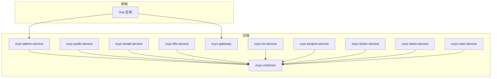
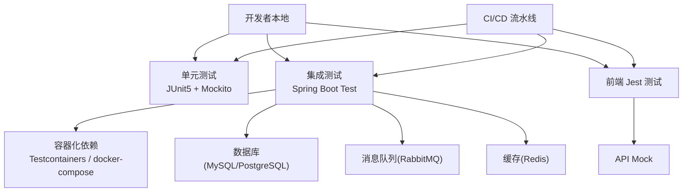
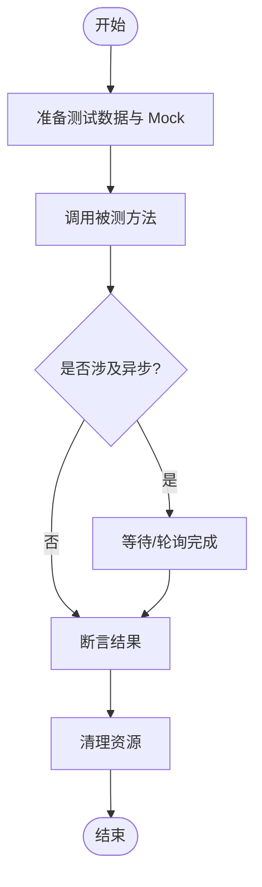
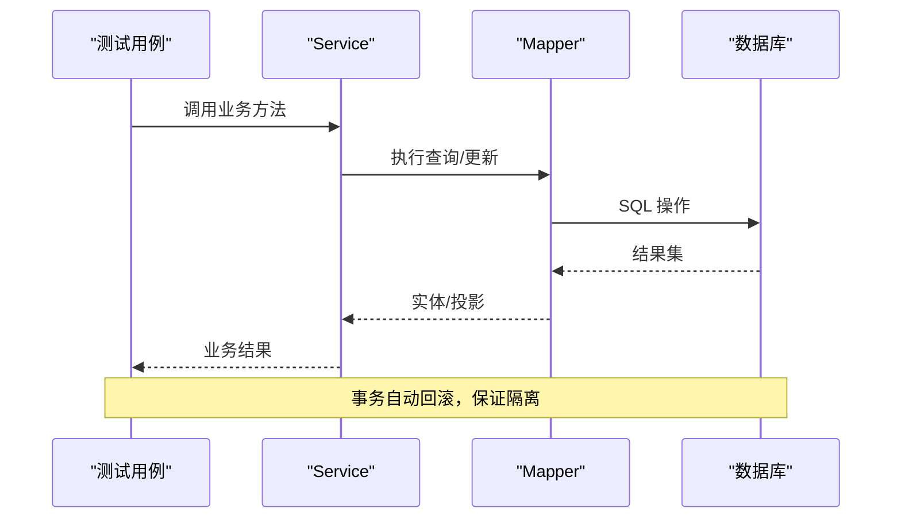
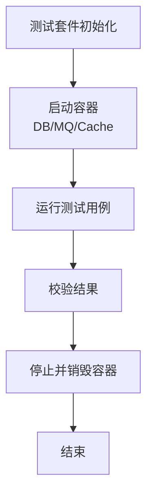
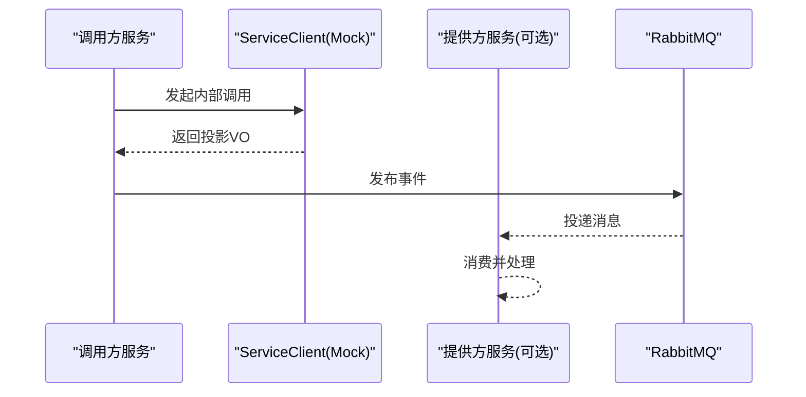
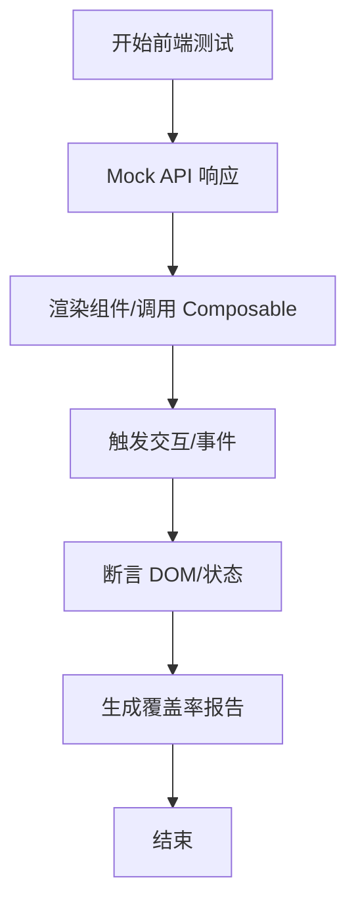
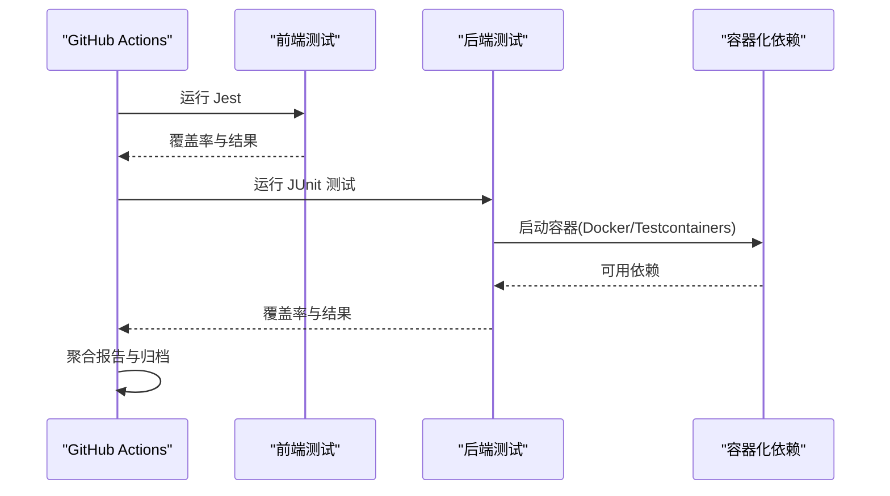
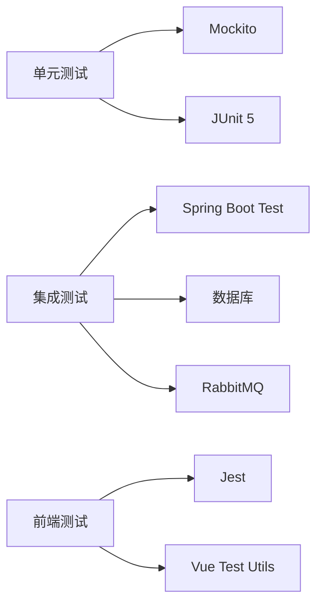

# 测试策略

<cite>
**本文引用的文件**
- [ci-cd.yml](file://.github/workflows/ci-cd.yml)
- [docker-compose.yml](file://docker-compose.yml)
- [pom.xml](file://ZXYZdatabaseBack/pom.xml)
- [application-test.yml](file://ZXYZdatabaseBack/zxyz-admin-service/src/test/resources/application-test.yml)
- [ConfigServiceTest.java](file://ZXYZdatabaseBack/zxyz-admin-service/src/test/java/uno/acloud/admin/service/ConfigServiceTest.java)
- [ConfigServiceIntegrationTest.java](file://ZXYZdatabaseBack/zxyz-admin-service/src/test/java/uno/acloud/admin/service/ConfigServiceIntegrationTest.java)
- [ConfigMapperIntegrationTest.java](file://ZXYZdatabaseBack/zxyz-admin-service/src/test/java/uno/acloud/admin/mapper/ConfigMapperIntegrationTest.java)
- [OperateLogConsumerTest.java](file://ZXYZdatabaseBack/zxyz-audit-service/src/test/java/uno/acloud/audit/mq/OperateLogConsumerTest.java)
- [AbstractIntegrationTest.java](file://ZXYZdatabaseBack/zxyz-common/src/test/java/uno/acloud/common/AbstractIntegrationTest.java)
- [EmailDispatchServiceTest.java](file://ZXYZdatabaseBack/zxyz-email-service/src/test/java/uno/acloud/email/application/EmailDispatchServiceTest.java)
- [ApplicationTest.java](file://ZXYZdatabaseBack/zxyz-im-service/src/test/java/uno/acloud/im/ZxyzImApplicationTests.java)
- [ShareFileServiceClientTest.java](file://ZXYZdatabaseBack/zxyz-share-service/src/test/java/uno/acloud/share/infrastructure/client/ShareFileServiceClientTest.java)
- [UserDeletedEventConsumerTest.java](file://ZXYZdatabaseBack/zxyz-share-service/src/test/java/uno/acloud/share/mq/UserDeletedEventConsumerTest.java)
- [package.json](file://ZXYZdatabaseFront/package.json)
- [setup.js](file://ZXYZdatabaseFront/src/test/setup.js)
- [auth.spec.js](file://ZXYZdatabaseFront/src/api/__tests__/auth.spec.js)
- [files.spec.js](file://ZXYZdatabaseFront/src/api/__tests__/files.spec.js)
- [im.spec.js](file://ZXYZdatabaseFront/src/api/__tests__/im.spec.js)
- [team.spec.js](file://ZXYZdatabaseFront/src/api/__tests__/team.spec.js)
- [useLoginForm.spec.js](file://ZXYZdatabaseFront/src/composables/__tests__/useLoginForm.spec.js)
- [currentUser.spec.js](file://ZXYZdatabaseFront/src/store/__tests__/currentUser.spec.js)
- [normalizers.spec.js](file://ZXYZdatabaseFront/src/store/im/__tests__/normalizers.spec.js)
</cite>

## 目录
1. [简介](#简介)
2. [项目结构](#项目结构)
3. [核心组件](#核心组件)
4. [架构总览](#架构总览)
5. [详细组件分析](#详细组件分析)
6. [依赖分析](#依赖分析)
7. [性能考虑](#性能考虑)
8. [故障排查指南](#故障排查指南)
9. [结论](#结论)
10. [附录](#附录)

## 简介
本测试策略文档面向 ZXYZ 微服务与前端工程，覆盖单元测试、集成测试、容器化测试、消息队列测试、前端 Jest 单元与组件测试、E2E 选型建议、测试数据管理、覆盖率要求与 CI/CD 执行与报告。目标是为开发团队提供可执行的规范与实践，确保在快速迭代中保持质量与稳定性。

## 项目结构
后端采用多模块 Maven 工程（11 个服务 + 公共库），前端为 Vue 3 单仓工程。测试代码按模块组织：
- 后端每个服务包含 src/test/java 与 src/test/resources，用于 JUnit 5 + Mockito 单元测试与 Spring Boot Test 集成测试。
- 前端使用 Jest 进行 API 层与工具函数测试，composables 与 store 的测试位于对应目录下的 __tests__。

**图表来源**
- [pom.xml](file://ZXYZdatabaseBack/pom.xml)

**章节来源**
- [pom.xml](file://ZXYZdatabaseBack/pom.xml)

## 核心组件
- 测试框架与工具
  - 后端：JUnit 5、Spring Boot Test、Mockito、AssertJ（推荐）、Testcontainers（建议引入）。
  - 前端：Jest、Vue Test Utils（组件测试）、Playwright/Cypress（E2E 建议）。
- 测试分层
  - 单元测试：纯逻辑、无外部依赖，使用 Mockito 隔离。
  - 集成测试：启动最小 Spring 上下文，验证 Controller/Service/Mapper 协作。
  - 容器化测试：通过 Testcontainers 或 docker-compose 拉起数据库、RabbitMQ、Redis 等依赖。
  - 前端测试：API Mock、Composable 行为、Store 状态变更、路由守卫。

**章节来源**
- [application-test.yml](file://ZXYZdatabaseBack/zxyz-admin-service/src/test/resources/application-test.yml)
- [AbstractIntegrationTest.java](file://ZXYZdatabaseBack/zxyz-common/src/test/java/uno/acloud/common/AbstractIntegrationTest.java)
- [package.json](file://ZXYZdatabaseFront/package.json)
- [setup.js](file://ZXYZdatabaseFront/src/test/setup.js)

## 架构总览
下图展示测试在微服务架构中的位置与交互：单元测试聚焦业务逻辑；集成测试覆盖控制器到持久化；容器化测试保证环境一致性；CI/CD 统一执行并生成报告。

[本图为概念性架构图，不直接映射具体源码文件]

## 详细组件分析

### 后端单元测试规范（JUnit 5 + Mockito）
- 命名与组织
  - 类名以被测类名 + Test 结尾，方法名体现场景与预期结果，如 shouldReturnX_whenY。
  - 包结构与生产代码一致，便于定位与维护。
- Mock 对象创建
  - 使用 @Mock、@InjectMocks、@Spy 与 MockitoExtension。
  - 对远程调用使用 ServiceClient 接口进行 Mock，避免真实网络请求。
- 异步处理
  - 对 CompletableFuture、WebClient、RabbitMQ 消费者，使用 Awaitility 或基于回调断言。
  - 对 @Scheduled 任务，使用 TestScheduler 或禁用调度器。
- 断言风格
  - 优先 AssertJ 链式断言，提升可读性与错误信息质量。
- 示例参考路径
  - [ConfigServiceTest.java](file://ZXYZdatabaseBack/zxyz-admin-service/src/test/java/uno/acloud/admin/service/ConfigServiceTest.java)
  - [EmailDispatchServiceTest.java](file://ZXYZdatabaseBack/zxyz-email-service/src/test/java/uno/acloud/email/application/EmailDispatchServiceTest.java)

**章节来源**
- [ConfigServiceTest.java](file://ZXYZdatabaseBack/zxyz-admin-service/src/test/java/uno/acloud/admin/service/ConfigServiceTest.java)
- [EmailDispatchServiceTest.java](file://ZXYZdatabaseBack/zxyz-email-service/src/test/java/uno/acloud/email/application/EmailDispatchServiceTest.java)

### 后端集成测试（Spring Boot Test）
- 配置要点
  - 使用 @SpringBootTest 加载最小上下文，结合 application-test.yml 切换测试配置。
  - 对 Mapper 层使用 @DataJpaTest 或 MyBatis 专用注解，配合事务回滚隔离。
- 数据库隔离
  - 每个测试用例独立事务，默认回滚；必要时使用 @Transactional 控制边界。
  - 复杂初始化建议使用 Flyway/Liquibase 脚本或 @Sql。
- 示例参考路径
  - [ConfigServiceIntegrationTest.java](file://ZXYZdatabaseBack/zxyz-admin-service/src/test/java/uno/acloud/admin/service/ConfigServiceIntegrationTest.java)
  - [ConfigMapperIntegrationTest.java](file://ZXYZdatabaseBack/zxyz-admin-service/src/test/java/uno/acloud/admin/mapper/ConfigMapperIntegrationTest.java)
  - [AbstractIntegrationTest.java](file://ZXYZdatabaseBack/zxyz-common/src/test/java/uno/acloud/common/AbstractIntegrationTest.java)

**图表来源**
- [ConfigServiceIntegrationTest.java](file://ZXYZdatabaseBack/zxyz-admin-service/src/test/java/uno/acloud/admin/service/ConfigServiceIntegrationTest.java)
- [ConfigMapperIntegrationTest.java](file://ZXYZdatabaseBack/zxyz-admin-service/src/test/java/uno/acloud/admin/mapper/ConfigMapperIntegrationTest.java)

**章节来源**
- [ConfigServiceIntegrationTest.java](file://ZXYZdatabaseBack/zxyz-admin-service/src/test/java/uno/acloud/admin/service/ConfigServiceIntegrationTest.java)
- [ConfigMapperIntegrationTest.java](file://ZXYZdatabaseBack/zxyz-admin-service/src/test/java/uno/acloud/admin/mapper/ConfigMapperIntegrationTest.java)
- [AbstractIntegrationTest.java](file://ZXYZdatabaseBack/zxyz-common/src/test/java/uno/acloud/common/AbstractIntegrationTest.java)

### 容器化测试（Testcontainers）
- 适用场景
  - 需要真实数据库、消息队列、缓存等外部依赖时，使用 Testcontainers 启动临时实例。
- 最佳实践
  - 将容器生命周期绑定到测试套件，减少启动开销。
  - 使用固定镜像版本，确保可重复性。
  - 为每个测试类分配独立 Schema/Database，避免冲突。
- 与 docker-compose 的关系
  - 本地调试可使用 docker-compose.dev.yml 启动全套环境；CI 中使用 Testcontainers 更轻量。

[本图为概念性流程图，不直接映射具体源码文件]

### 微服务间通信测试
- 同步调用
  - 使用 ServiceClient 接口进行 Mock，模拟窄端点与投影 VO 返回。
  - 针对鉴权头 X-Internal-Service-Token 进行断言或 Mock。
- 异步消息
  - 使用 RabbitMQ Test 或内存 Broker，发送与消费消息进行端到端验证。
  - 对死信队列（DLQ）与重试机制编写专项用例。
- 示例参考路径
  - [ShareFileServiceClientTest.java](file://ZXYZdatabaseBack/zxyz-share-service/src/test/java/uno/acloud/share/infrastructure/client/ShareFileServiceClientTest.java)
  - [UserDeletedEventConsumerTest.java](file://ZXYZdatabaseBack/zxyz-share-service/src/test/java/uno/acloud/share/mq/UserDeletedEventConsumerTest.java)
  - [OperateLogConsumerTest.java](file://ZXYZdatabaseBack/zxyz-audit-service/src/test/java/uno/acloud/audit/mq/OperateLogConsumerTest.java)

**图表来源**
- [ShareFileServiceClientTest.java](file://ZXYZdatabaseBack/zxyz-share-service/src/test/java/uno/acloud/share/infrastructure/client/ShareFileServiceClientTest.java)
- [UserDeletedEventConsumerTest.java](file://ZXYZdatabaseBack/zxyz-share-service/src/test/java/uno/acloud/share/mq/UserDeletedEventConsumerTest.java)
- [OperateLogConsumerTest.java](file://ZXYZdatabaseBack/zxyz-audit-service/src/test/java/uno/acloud/audit/mq/OperateLogConsumerTest.java)

**章节来源**
- [ShareFileServiceClientTest.java](file://ZXYZdatabaseBack/zxyz-share-service/src/test/java/uno/acloud/share/infrastructure/client/ShareFileServiceClientTest.java)
- [UserDeletedEventConsumerTest.java](file://ZXYZdatabaseBack/zxyz-share-service/src/test/java/uno/acloud/share/mq/UserDeletedEventConsumerTest.java)
- [OperateLogConsumerTest.java](file://ZXYZdatabaseBack/zxyz-audit-service/src/test/java/uno/acloud/audit/mq/OperateLogConsumerTest.java)

### 前端测试方法（Jest + Vue Test Utils）
- 单元测试
  - API 层：使用 jest.fn() 或 axios-mock-adapter 拦截请求，断言参数与响应处理。
  - Composables：模拟 Pinia Store、路由与第三方依赖，验证副作用与状态变化。
  - Store：断言 actions/mutations 对 state 的影响。
- 组件测试
  - 使用 Vue Test Utils 渲染组件，触发用户交互，断言 DOM 与事件。
- E2E 测试框架选择
  - 推荐 Playwright（跨浏览器、稳定、支持并行）或 Cypress（易用、生态丰富）。
- 示例参考路径
  - [auth.spec.js](file://ZXYZdatabaseFront/src/api/__tests__/auth.spec.js)
  - [files.spec.js](file://ZXYZdatabaseFront/src/api/__tests__/files.spec.js)
  - [im.spec.js](file://ZXYZdatabaseFront/src/api/__tests__/im.spec.js)
  - [team.spec.js](file://ZXYZdatabaseFront/src/api/__tests__/team.spec.js)
  - [useLoginForm.spec.js](file://ZXYZdatabaseFront/src/composables/__tests__/useLoginForm.spec.js)
  - [currentUser.spec.js](file://ZXYZdatabaseFront/src/store/__tests__/currentUser.spec.js)
  - [normalizers.spec.js](file://ZXYZdatabaseFront/src/store/im/__tests__/normalizers.spec.js)

**章节来源**
- [auth.spec.js](file://ZXYZdatabaseFront/src/api/__tests__/auth.spec.js)
- [files.spec.js](file://ZXYZdatabaseFront/src/api/__tests__/files.spec.js)
- [im.spec.js](file://ZXYZdatabaseFront/src/api/__tests__/im.spec.js)
- [team.spec.js](file://ZXYZdatabaseFront/src/api/__tests__/team.spec.js)
- [useLoginForm.spec.js](file://ZXYZdatabaseFront/src/composables/__tests__/useLoginForm.spec.js)
- [currentUser.spec.js](file://ZXYZdatabaseFront/src/store/__tests__/currentUser.spec.js)
- [normalizers.spec.js](file://ZXYZdatabaseFront/src/store/im/__tests__/normalizers.spec.js)
- [setup.js](file://ZXYZdatabaseFront/src/test/setup.js)
- [package.json](file://ZXYZdatabaseFront/package.json)

### 测试数据管理
- 数据准备
  - 使用工厂方法或 JSON fixtures 生成基础数据，避免硬编码。
  - 对复杂关系使用 Builder 模式构建对象图。
- 数据库重置
  - 集成测试默认事务回滚；如需持久化验证，使用独立 Schema 或 @Sql 脚本。
  - 迁移脚本由 Flyway/Liquibase 管理，测试环境复用同一套脚本。
- Mock 数据生成
  - 后端：使用 Lombok @Builder、Hutool BeanUtil、或自定义 Faker。
  - 前端：使用 jest.mock 与 axios-mock-adapter 构造响应。

[本节为通用指导，不直接分析具体文件]

### 测试覆盖率要求
- 后端
  - 行覆盖率 ≥ 80%，分支覆盖率 ≥ 70%；核心服务（user/team/project）≥ 85%。
  - 排除 DTO、VO、配置类与异常定义。
- 前端
  - 行覆盖率 ≥ 75%，分支覆盖率 ≥ 65%；关键流程（登录、上传、IM 消息）≥ 80%。
- 报告生成
  - 后端：JaCoCo 聚合报告，按模块输出 HTML/XML。
  - 前端：jest --coverage 输出覆盖率，CI 中归档 artifacts。

[本节为通用指导，不直接分析具体文件]

### 持续集成中的测试执行与报告
- GitHub Actions
  - 使用 paths-filter 选择性构建与测试，缩短反馈时间。
  - 并行执行各模块测试，聚合覆盖率与测试结果。
- 执行顺序
  - 先运行前端 Jest，再运行后端单元测试，最后运行集成测试（含容器）。
- 报告归档
  - 将 JaCoCo 与 Jest 覆盖率报告作为 artifacts 保存，失败时标记构建状态。

**图表来源**
- [ci-cd.yml](file://.github/workflows/ci-cd.yml)

**章节来源**
- [ci-cd.yml](file://.github/workflows/ci-cd.yml)

## 依赖分析
- 测试依赖耦合
  - 后端测试依赖 Spring Boot Test、Mockito、数据库驱动与消息客户端。
  - 前端测试依赖 Jest、Vue Test Utils、axios-mock-adapter（建议）。
- 外部依赖
  - 数据库、RabbitMQ、Redis 通过 Testcontainers 或 docker-compose 管理。
- 循环依赖
  - 测试代码不应引入生产循环依赖；ServiceClient 与 Provider 投影类解耦演进。

[本图为概念性依赖图，不直接映射具体源码文件]

**章节来源**
- [docker-compose.yml](file://docker-compose.yml)

## 性能考虑
- 测试启动优化
  - 共享容器实例，减少重复启动开销。
  - 使用嵌入式数据库或内存 Broker 加速单元测试。
- 并发与超时
  - 合理设置异步测试超时，避免不稳定。
  - 对慢查询与外部调用进行 Mock，降低波动。
- 资源限制
  - CI 中限制并发度，避免资源争用导致失败。

[本节为通用指导，不直接分析具体文件]

## 故障排查指南
- 常见后端问题
  - 事务未回滚导致数据污染：检查 @Transactional 与测试基类配置。
  - 容器启动失败：确认镜像版本、端口占用与网络连通性。
  - 消息消费失败：检查队列声明、路由键与 DLQ 处理逻辑。
- 常见前端问题
  - API Mock 未生效：确认拦截器注册顺序与请求匹配规则。
  - 组件渲染异常：检查依赖注入与全局插件初始化。
- 定位步骤
  - 缩小范围：从单测到集成测试逐步放大。
  - 日志增强：在关键路径添加结构化日志与追踪 ID。
  - 复现最小化：抽取最小可复现场景，便于回归验证。

**章节来源**
- [AbstractIntegrationTest.java](file://ZXYZdatabaseBack/zxyz-common/src/test/java/uno/acloud/common/AbstractIntegrationTest.java)
- [setup.js](file://ZXYZdatabaseFront/src/test/setup.js)

## 结论
本策略明确了 ZXYZ 项目的测试分层、工具选型、数据管理与 CI/CD 执行方式。通过严格的单元测试、稳健的集成测试与容器化依赖管理，结合前端全面的 Jest 测试与可选 E2E 方案，可在保证质量的同时提升交付效率。建议在后续迭代中持续完善覆盖率与自动化报告，形成质量闭环。

## 附录
- 参考实现路径
  - 后端单测与集成测试：见各服务 test 目录。
  - 前端测试：src/api/__tests__、src/composables/__tests__、src/store/__tests__。
- 相关配置文件
  - 测试环境配置：application-test.yml。
  - 前端测试入口：setup.js。
  - CI/CD 流水线：ci-cd.yml。
  - 容器编排：docker-compose.yml。

**章节来源**
- [application-test.yml](file://ZXYZdatabaseBack/zxyz-admin-service/src/test/resources/application-test.yml)
- [setup.js](file://ZXYZdatabaseFront/src/test/setup.js)
- [ci-cd.yml](file://.github/workflows/ci-cd.yml)
- [docker-compose.yml](file://docker-compose.yml)