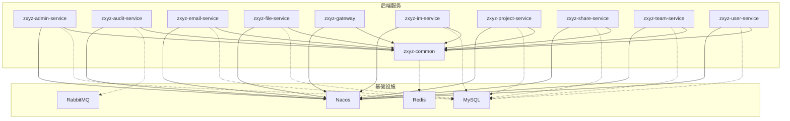
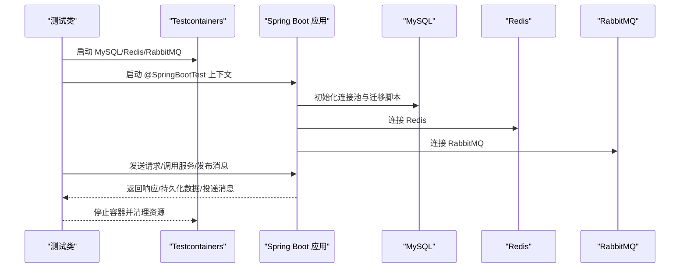
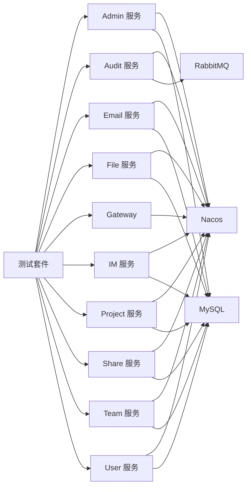

# 集成测试

<cite>
**本文引用的文件**   
- [pom.xml](file://ZXYZdatabaseBack/pom.xml)
- [docker-compose.yml](file://docker-compose.yml)
- [docker-compose.dev.yml](file://docker-compose.dev.yml)
- [application-test.yml](file://ZXYZdatabaseBack/zxyz-admin-service/src/test/resources/application-test.yml)
- [application-test.yml](file://ZXYZdatabaseBack/zxyz-file-service/src/test/resources/application-test.yml)
- [application-test.yml](file://ZXYZdatabaseBack/zxyz-project-service/src/test/resources/application-test.yml)
- [application-test.yml](file://ZXYZdatabaseBack/zxyz-team-service/src/test/resources/application-test.yml)
- [application-test.yml](file://ZXYZdatabaseBack/zxyz-user-service/src/test/resources/application-test.yml)
- [AbstractIntegrationTest.java](file://ZXYZdatabaseBack/zxyz-common/src/test/java/uno/acloud/common/AbstractIntegrationTest.java)
- [ConfigServiceIntegrationTest.java](file://ZXYZdatabaseBack/zxyz-admin-service/src/test/java/uno/acloud/admin/service/ConfigServiceIntegrationTest.java)
- [ConfigMapperIntegrationTest.java](file://ZXYZdatabaseBack/zxyz-admin-service/src/test/java/uno/acloud/admin/mapper/ConfigMapperIntegrationTest.java)
- [OperateLogConsumerTest.java](file://ZXYZdatabaseBack/zxyz-audit-service/src/test/java/uno/acloud/audit/mq/OperateLogConsumerTest.java)
- [EmailDispatchServiceTest.java](file://ZXYZdatabaseBack/zxyz-email-service/src/test/java/uno/acloud/email/application/EmailDispatchServiceTest.java)
- [ShareFileServiceClientTest.java](file://ZXYZdatabaseBack/zxyz-share-service/src/test/java/uno/acloud/share/infrastructure/client/ShareFileServiceClientTest.java)
- [UserDeletedEventConsumerTest.java](file://ZXYZdatabaseBack/zxyz-share-service/src/test/java/uno/acloud/share/mq/UserDeletedEventConsumerTest.java)
- [SaTokenFilterConfigTest.java](file://ZXYZdatabaseBack/zxyz-gateway/src/test/java/uno/acloud/gateway/filter/SaTokenFilterConfigTest.java)
- [zxyz-dynamic.yml](file://nacos-config/zxyz-dynamic.yml)
- [ci-cd.yml](file://.github/workflows/ci-cd.yml)
</cite>

## 目录
1. [简介](#简介)
2. [项目结构](#项目结构)
3. [核心组件](#核心组件)
4. [架构总览](#架构总览)
5. [详细组件分析](#详细组件分析)
6. [依赖关系分析](#依赖关系分析)
7. [性能考量](#性能考量)
8. [故障排查指南](#故障排查指南)
9. [结论](#结论)
10. [附录](#附录)

## 简介
本文件为 ZXYZ 项目的集成测试策略与实施指南，覆盖 Spring Boot Test、Testcontainers 容器化测试、微服务间通信（ServiceClient、内部接口、消息队列）、REST API 集成测试（MockMvc）、事务回滚策略，以及复杂业务场景的测试用例编写方法。文档面向不同技术背景的读者，提供从概念到代码级落地的完整路径。

## 项目结构
ZXYZ 后端采用多模块 Maven 工程，包含多个独立服务（如 admin、audit、email、file、gateway、im、project、share、team、user）与公共库 zxyz-common。每个服务均具备独立的测试目录与测试配置，便于隔离与并行执行。

**图表来源** 
- [docker-compose.yml](file://docker-compose.yml)
- [docker-compose.dev.yml](file://docker-compose.dev.yml)

**章节来源**
- [pom.xml](file://ZXYZdatabaseBack/pom.xml)

## 核心组件
- 抽象基类：zxyz-common 提供 AbstractIntegrationTest，作为各服务集成测试的基类，统一加载测试环境、数据库连接、缓存与 MQ 等基础能力。
- 服务测试：各服务在 src/test 下按 controller、service、mapper、mq 分层组织测试类，覆盖 REST 接口、业务逻辑、数据访问与消息消费。
- 测试配置：每个服务提供 application-test.yml，用于覆盖默认配置，指向测试用 MySQL/Redis/RabbitMQ/Nacos 地址与端口。

关键职责与关系：
- AbstractIntegrationTest 负责测试上下文初始化与通用断言工具。
- 各服务测试类继承或复用基类能力，聚焦具体业务验证。
- 测试配置文件确保测试环境与生产配置解耦。

**章节来源**
- [AbstractIntegrationTest.java](file://ZXYZdatabaseBack/zxyz-common/src/test/java/uno/acloud/common/AbstractIntegrationTest.java)
- [application-test.yml](file://ZXYZdatabaseBack/zxyz-admin-service/src/test/resources/application-test.yml)
- [application-test.yml](file://ZXYZdatabaseBack/zxyz-file-service/src/test/resources/application-test.yml)
- [application-test.yml](file://ZXYZdatabaseBack/zxyz-project-service/src/test/resources/application-test.yml)
- [application-test.yml](file://ZXYZdatabaseBack/zxyz-team-service/src/test/resources/application-test.yml)
- [application-test.yml](file://ZXYZdatabaseBack/zxyz-user-service/src/test/resources/application-test.yml)

## 架构总览
集成测试整体流程如下：
- 启动测试容器：通过 Testcontainers 启动 MySQL、Redis、RabbitMQ 等基础设施。
- 加载应用上下文：使用 @SpringBootTest 加载服务上下文，并注入测试配置。
- 准备测试数据：在事务中插入数据，测试结束后自动回滚。
- 调用被测组件：通过 MockMvc 调用控制器，或通过 ServiceClient/MQ 进行跨服务与异步通信测试。
- 验证结果：断言响应体、状态码、数据库变更与消息投递情况。

**图表来源** 
- [docker-compose.yml](file://docker-compose.yml)
- [docker-compose.dev.yml](file://docker-compose.dev.yml)

## 详细组件分析

### Spring Boot Test 配置与使用
- 注解与上下文：使用 @SpringBootTest 加载完整应用上下文；结合 @AutoConfigureTestDatabase 与 @DirtiesContext 控制数据库与上下文刷新。
- 测试配置：通过 application-test.yml 覆盖默认配置，指定测试环境的数据库、缓存、MQ 与 Nacos 地址。
- 数据隔离：在测试方法上使用事务注解，确保测试数据自动回滚，避免污染其他用例。

实践要点：
- 将数据库连接、缓存与 MQ 的连接信息集中到 application-test.yml。
- 对需要外部依赖的服务，优先使用 Testcontainers 启动真实容器，保证行为一致。
- 对不稳定的第三方依赖，使用 Mock 或 Stub 替代。

**章节来源**
- [application-test.yml](file://ZXYZdatabaseBack/zxyz-admin-service/src/test/resources/application-test.yml)
- [application-test.yml](file://ZXYZdatabaseBack/zxyz-file-service/src/test/resources/application-test.yml)
- [application-test.yml](file://ZXYZdatabaseBack/zxyz-project-service/src/test/resources/application-test.yml)
- [application-test.yml](file://ZXYZdatabaseBack/zxyz-team-service/src/test/resources/application-test.yml)
- [application-test.yml](file://ZXYZdatabaseBack/zxyz-user-service/src/test/resources/application-test.yml)

### Testcontainers 容器化测试方案
- 目标：以容器方式启动 MySQL、Redis、RabbitMQ，模拟真实运行环境。
- 管理策略：在测试套件生命周期内启动与销毁容器，避免重复创建开销。
- 网络与端口：通过 Testcontainers 动态分配端口，避免冲突。

建议步骤：
- 在基类中声明容器实例，并在 @BeforeAll 启动，@AfterAll 关闭。
- 将容器暴露的 JDBC URL、Redis 地址、RabbitMQ 连接信息注入到 Spring 配置。
- 使用 Flyway/Liquibase 自动执行迁移脚本，确保表结构与初始数据就绪。

**章节来源**
- [docker-compose.yml](file://docker-compose.yml)
- [docker-compose.dev.yml](file://docker-compose.dev.yml)

### 微服务间通信的集成测试
- ServiceClient 调用 Mock：对非被测服务的远程调用，使用 Mock 或 Stub 返回预期结果，避免外部依赖不稳定。
- 内部接口测试：对被测服务的 /api/internal/** 端点进行直接调用，验证权限与投影 VO 的正确性。
- 消息队列测试：通过 RabbitMQ 客户端或测试监听器，验证消息发布与消费链路。

最佳实践：
- 使用窄端点与投影模式，确保测试断言聚焦于调用方所需字段。
- 对异步消息，使用等待与轮询机制确认消息被处理，或使用测试专用交换机/队列。

**章节来源**
- [ShareFileServiceClientTest.java](file://ZXYZdatabaseBack/zxyz-share-service/src/test/java/uno/acloud/share/infrastructure/client/ShareFileServiceClientTest.java)
- [OperateLogConsumerTest.java](file://ZXYZdatabaseBack/zxyz-audit-service/src/test/java/uno/acloud/audit/mq/OperateLogConsumerTest.java)
- [UserDeletedEventConsumerTest.java](file://ZXYZdatabaseBack/zxyz-share-service/src/test/java/uno/acloud/share/mq/UserDeletedEventConsumerTest.java)

### REST API 集成测试（MockMvc）
- 构造请求：使用 MockMvcRequestBuilders 构建 GET/POST/PUT/DELETE 请求，设置 Header、参数与 Body。
- 响应验证：断言 HTTP 状态码、响应体结构与关键字段，确保 Result<T> 的 code 与 data 符合预期。
- 鉴权与过滤：针对 Sa-Token 过滤器，注入必要的 Cookie 或 Token，确保内部端点不被网关拒绝。

示例流程：
- 登录获取 Token → 携带 Token 发起业务请求 → 断言响应 → 清理会话。

**章节来源**
- [SaTokenFilterConfigTest.java](file://ZXYZdatabaseBack/zxyz-gateway/src/test/java/uno/acloud/gateway/filter/SaTokenFilterConfigTest.java)

### 事务管理与数据回滚策略
- 测试方法级别的事务：在每个测试方法上开启事务，测试结束后自动回滚，保证数据隔离。
- 批量操作与异步任务：对于异步处理，需等待任务完成后再断言，或在测试中使用同步替代实现。
- 数据准备与清理：优先使用 SQL 脚本或工厂方法准备数据，避免硬编码依赖。

注意事项：
- 对不可回滚的操作（如外部系统写入），使用 Mock 或沙箱环境。
- 对并发场景，使用线程安全的数据准备与断言。

**章节来源**
- [ConfigServiceIntegrationTest.java](file://ZXYZdatabaseBack/zxyz-admin-service/src/test/java/uno/acloud/admin/service/ConfigServiceIntegrationTest.java)
- [ConfigMapperIntegrationTest.java](file://ZXYZdatabaseBack/zxyz-admin-service/src/test/java/uno/acloud/admin/mapper/ConfigMapperIntegrationTest.java)

### 复杂业务场景的集成测试示例
- 邮件发送流程：构造模板与收件人，触发发送服务，断言记录与状态。
- 分享访问控制：生成分享链接，模拟访问，断言权限与限流策略。
- 审计日志消费：发布操作事件，验证消费者正确落库与去重。

推荐步骤：
- 明确输入与期望输出，拆分子步骤逐步验证。
- 使用夹具与工厂方法减少重复代码。
- 对时间敏感的场景，使用固定时钟或延迟断言。

**章节来源**
- [EmailDispatchServiceTest.java](file://ZXYZdatabaseBack/zxyz-email-service/src/test/java/uno/acloud/email/application/EmailDispatchServiceTest.java)
- [UserDeletedEventConsumerTest.java](file://ZXYZdatabaseBack/zxyz-share-service/src/test/java/uno/acloud/share/mq/UserDeletedEventConsumerTest.java)

## 依赖关系分析
- 服务间依赖：通过 ServiceClient 调用其他服务，遵循窄端点与投影模式，降低耦合。
- 基础设施依赖：MySQL、Redis、RabbitMQ、Nacos 由 docker-compose 编排，测试环境通过 Testcontainers 或本地实例接入。
- CI/CD 依赖：GitHub Actions 根据路径过滤选择性构建与推送镜像，确保测试与构建效率。

**图表来源** 
- [docker-compose.yml](file://docker-compose.yml)
- [docker-compose.dev.yml](file://docker-compose.dev.yml)
- [ci-cd.yml](file://.github/workflows/ci-cd.yml)

**章节来源**
- [ci-cd.yml](file://.github/workflows/ci-cd.yml)
- [zxyz-dynamic.yml](file://nacos-config/zxyz-dynamic.yml)

## 性能考量
- 容器启动优化：复用已启动的容器实例，避免每次测试重新创建。
- 数据库连接池：合理配置 HikariCP 连接数与超时，避免测试阻塞。
- 消息队列测试：使用内存队列或轻量 MQ 实例，减少网络开销。
- 并行执行：按模块并行运行测试套件，缩短整体耗时。

[本节为通用指导，无需引用具体文件]

## 故障排查指南
- 容器无法启动：检查端口占用与镜像可用性，查看容器日志定位问题。
- 数据库连接失败：核对 application-test.yml 中的 JDBC URL、用户名与密码。
- 消息未消费：确认交换机与队列绑定是否正确，检查消费者监听器是否注册。
- 鉴权失败：检查 Sa-Token 过滤器配置与 Cookie/Token 注入是否正确。

**章节来源**
- [application-test.yml](file://ZXYZdatabaseBack/zxyz-admin-service/src/test/resources/application-test.yml)
- [SaTokenFilterConfigTest.java](file://ZXYZdatabaseBack/zxyz-gateway/src/test/java/uno/acloud/gateway/filter/SaTokenFilterConfigTest.java)

## 结论
通过统一的抽象基类、容器化基础设施与严格的测试配置，ZXYZ 项目的集成测试能够稳定覆盖 REST API、服务间调用与消息队列等关键路径。建议在持续集成中启用并行测试与选择性构建，进一步提升反馈速度与开发效率。

[本节为总结性内容，无需引用具体文件]

## 附录
- 常用注解与配置清单：@SpringBootTest、@AutoConfigureTestDatabase、@DirtiesContext、application-test.yml。
- 测试数据准备模板：SQL 脚本、工厂方法与夹具。
- 断言库与工具：AssertJ、Hamcrest、MockMvc 助手类。

[本节为补充信息，无需引用具体文件]