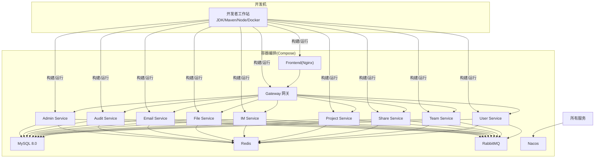
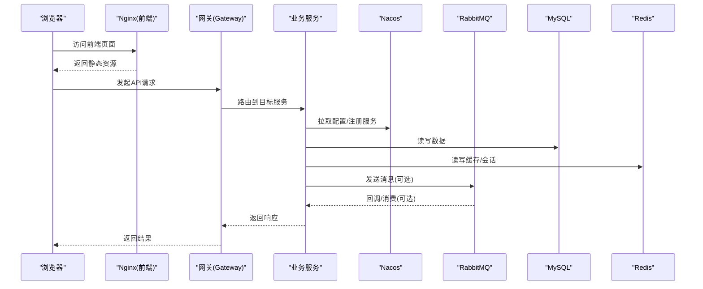
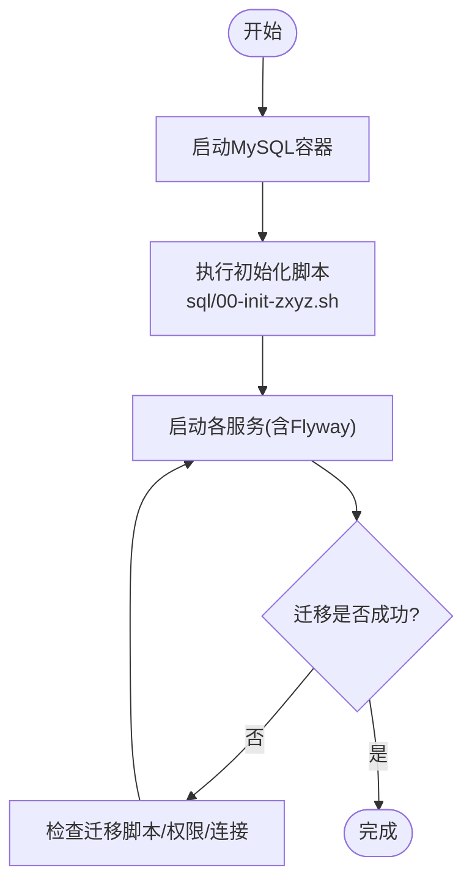
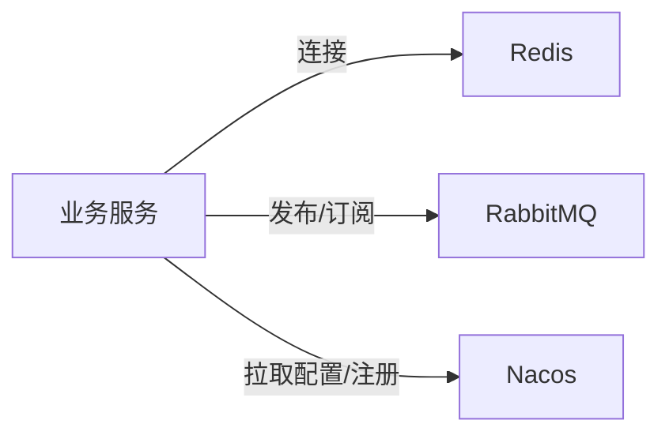
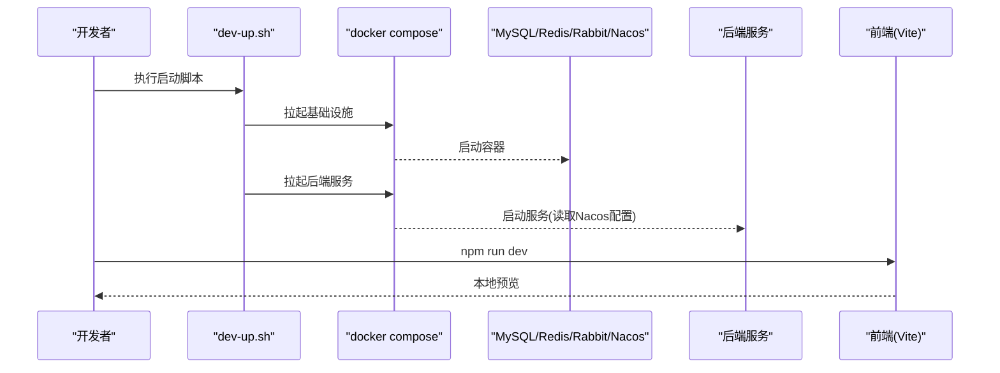
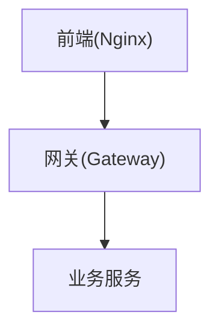
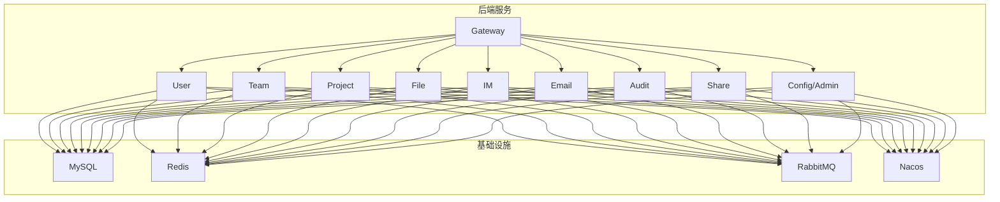

# 环境搭建

<cite>
**本文引用的文件**   
- [docker-compose.yml](file://docker-compose.yml)
- [docker-compose.dev.yml](file://docker-compose.dev.yml)
- [scripts/dev-up.sh](file://scripts/dev-up.sh)
- [scripts/health-check.sh](file://scripts/health-check.sh)
- [sql/00-init-zxyz.sh](file://sql/00-init-zxyz.sh)
- [nacos-config/import.sh](file://nacos-config/import.sh)
- [ZXYZdatabaseBack/pom.xml](file://ZXYZdatabaseBack/pom.xml)
- [ZXYZdatabaseBack/zxyz-admin-service/src/main/resources/application-dev.yml](file://ZXYZdatabaseBack/zxyz-admin-service/src/main/resources/application-dev.yml)
- [ZXYZdatabaseBack/zxyz-audit-service/src/main/resources/application-dev.yml](file://ZXYZdatabaseBack/zxyz-audit-service/src/main/resources/application-dev.yml)
- [ZXYZdatabaseBack/zxyz-email-service/src/main/resources/application-dev.yml](file://ZXYZdatabaseBack/zxyz-email-service/src/main/resources/application-dev.yml)
- [ZXYZdatabaseBack/zxyz-file-service/src/main/resources/application-dev.yml](file://ZXYZdatabaseBack/zxyz-file-service/src/main/resources/application-dev.yml)
- [ZXYZdatabaseBack/zxyz-gateway/src/main/resources/application.yml](file://ZXYZdatabaseBack/zxyz-gateway/src/main/resources/application.yml)
- [ZXYZdatabaseBack/zxyz-im-service/src/main/resources/application-dev.yml](file://ZXYZdatabaseBack/zxyz-im-service/src/main/resources/application-dev.yml)
- [ZXYZdatabaseBack/zxyz-project-service/src/main/resources/application-dev.yml](file://ZXYZdatabaseBack/zxyz-project-service/src/main/resources/application-dev.yml)
- [ZXYZdatabaseBack/zxyz-share-service/src/main/resources/application-dev.yml](file://ZXYZdatabaseBack/zxyz-share-service/src/main/resources/application-dev.yml)
- [ZXYZdatabaseBack/zxyz-team-service/src/main/resources/application-dev.yml](file://ZXYZdatabaseBack/zxyz-team-service/src/main/resources/application-dev.yml)
- [ZXYZdatabaseBack/zxyz-user-service/src/main/resources/application-dev.yml](file://ZXYZdatabaseBack/zxyz-user-service/src/main/resources/application-dev.yml)
- [ZXYZdatabaseFront/package.json](file://ZXYZdatabaseFront/package.json)
- [ZXYZdatabaseFront/vite.config.js](file://ZXYZdatabaseFront/vite.config.js)
- [deploy/nginx/default.conf](file://deploy/nginx/default.conf)
- [deploy/nginx/entrypoint.sh](file://deploy/nginx/entrypoint.sh)
- [.github/workflows/ci-cd.yml](file://.github/workflows/ci-cd.yml)
</cite>

## 目录
1. [简介](#简介)
2. [项目结构](#项目结构)
3. [核心组件](#核心组件)
4. [架构总览](#架构总览)
5. [详细组件分析](#详细组件分析)
6. [依赖关系分析](#依赖关系分析)
7. [性能注意事项](#性能注意事项)
8. [故障排查指南](#故障排查指南)
9. [结论](#结论)
10. [附录](#附录)

## 简介
本指南面向 ZXYZ 项目的本地开发环境搭建，覆盖 JDK、Maven、Node.js、Docker 与 Docker Compose 的安装配置；数据库初始化（MySQL 8.0、Flyway 迁移、初始数据导入）；中间件服务（Redis、RabbitMQ、Nacos）的启动与连接设置；IDE 配置建议（IntelliJ IDEA 与 VS Code）；以及本地快速启动命令与常用运维操作。文档同时给出常见环境问题的排查与解决方案，帮助开发者快速、稳定地运行前后端全栈。

## 项目结构
ZXYZ 采用微服务架构：后端为多模块 Maven 工程（约 11 个服务），前端为 Vue 3 + Vite 应用。基础设施与编排通过 Docker Compose 管理，Nacos 作为配置中心与服务注册发现，RabbitMQ 提供异步消息能力，Redis 用于会话与缓存，MySQL 持久化数据。

**图表来源** 
- [docker-compose.yml](file://docker-compose.yml)
- [docker-compose.dev.yml](file://docker-compose.dev.yml)

**章节来源**
- [docker-compose.yml](file://docker-compose.yml)
- [docker-compose.dev.yml](file://docker-compose.dev.yml)

## 核心组件
- 运行时与工具链
  - JDK 17+：后端编译与运行
  - Maven 3.8+：多模块构建
  - Node.js 18+：前端构建与开发
  - Docker & Docker Compose：容器化编排
- 基础设施
  - MySQL 8.0：业务数据存储
  - Redis：会话与缓存
  - RabbitMQ：异步消息总线
  - Nacos：配置中心与服务注册
- 后端服务
  - 网关：统一入口、鉴权过滤
  - 业务服务：用户、团队、项目、文件、IM、邮件、审计、分享、配置管理等
- 前端
  - Vue 3 + Vite + Element Plus + Pinia
  - Nginx 反向代理静态资源与 API 转发

**章节来源**
- [ZXYZdatabaseBack/pom.xml](file://ZXYZdatabaseBack/pom.xml)
- [ZXYZdatabaseFront/package.json](file://ZXYZdatabaseFront/package.json)
- [ZXYZdatabaseFront/vite.config.js](file://ZXYZdatabaseFront/vite.config.js)

## 架构总览
下图展示本地开发时各组件交互关系与调用路径。请求从浏览器进入 Nginx，再转发到网关，网关路由至具体服务；服务间通过内部 Token 鉴权访问窄端点；异步流程经 RabbitMQ 投递消费；所有服务通过 Nacos 获取配置并注册自身。

**图表来源** 
- [ZXYZdatabaseBack/zxyz-gateway/src/main/resources/application.yml](file://ZXYZdatabaseBack/zxyz-gateway/src/main/resources/application.yml)
- [docker-compose.yml](file://docker-compose.yml)

## 详细组件分析

### 一、环境与工具安装
- JDK 17+
  - 安装后验证版本与环境变量 JAVA_HOME
- Maven 3.8+
  - 安装后验证 mvn -v
  - 推荐配置国内镜像加速
- Node.js 18+
  - 安装后验证 node -v、npm -v
  - 推荐使用 nvm 管理版本
- Docker & Docker Compose
  - 安装 Docker Desktop（Windows/macOS）或 Docker Engine（Linux）
  - 验证 docker --version、docker compose version

提示：确保系统内存充足（建议 ≥16GB），以便同时运行多个服务容器。

**章节来源**
- [ZXYZdatabaseBack/pom.xml](file://ZXYZdatabaseBack/pom.xml)
- [ZXYZdatabaseFront/package.json](file://ZXYZdatabaseFront/package.json)

### 二、数据库初始化（MySQL 8.0、Flyway、初始数据）
- 使用 Compose 启动 MySQL 容器
- Flyway 自动执行各服务的 db/migration 脚本
- 执行 sql/00-init-zxyz.sh 完成库级初始化（如创建库、用户、权限等）

步骤要点：
- 确认 MySQL 端口未被占用（默认 3306）
- 首次启动前执行初始化脚本
- 观察各服务日志中 Flyway 迁移是否成功

**图表来源** 
- [sql/00-init-zxyz.sh](file://sql/00-init-zxyz.sh)
- [docker-compose.yml](file://docker-compose.yml)

**章节来源**
- [sql/00-init-zxyz.sh](file://sql/00-init-zxyz.sh)
- [docker-compose.yml](file://docker-compose.yml)

### 三、中间件服务（Redis、RabbitMQ、Nacos）
- Redis：用于会话存储与缓存
- RabbitMQ：Topic Exchange zxyz.topic，服务间异步通信
- Nacos：配置中心与服务注册发现，支持 Jasypt 加密配置

关键配置位置：
- 各服务 application-dev.yml 中的数据库、Redis、RabbitMQ、Nacos 连接信息
- gateway 的过滤器与路由配置
- Nacos 配置文件位于 nacos-config 目录，可通过 import.sh 导入

**图表来源** 
- [ZXYZdatabaseBack/zxyz-admin-service/src/main/resources/application-dev.yml](file://ZXYZdatabaseBack/zxyz-admin-service/src/main/resources/application-dev.yml)
- [ZXYZdatabaseBack/zxyz-audit-service/src/main/resources/application-dev.yml](file://ZXYZdatabaseBack/zxyz-audit-service/src/main/resources/application-dev.yml)
- [ZXYZdatabaseBack/zxyz-email-service/src/main/resources/application-dev.yml](file://ZXYZdatabaseBack/zxyz-email-service/src/main/resources/application-dev.yml)
- [ZXYZdatabaseBack/zxyz-file-service/src/main/resources/application-dev.yml](file://ZXYZdatabaseBack/zxyz-file-service/src/main/resources/application-dev.yml)
- [ZXYZdatabaseBack/zxyz-im-service/src/main/resources/application-dev.yml](file://ZXYZdatabaseBack/zxyz-im-service/src/main/resources/application-dev.yml)
- [ZXYZdatabaseBack/zxyz-project-service/src/main/resources/application-dev.yml](file://ZXYZdatabaseBack/zxyz-project-service/src/main/resources/application-dev.yml)
- [ZXYZdatabaseBack/zxyz-share-service/src/main/resources/application-dev.yml](file://ZXYZdatabaseBack/zxyz-share-service/src/main/resources/application-dev.yml)
- [ZXYZdatabaseBack/zxyz-team-service/src/main/resources/application-dev.yml](file://ZXYZdatabaseBack/zxyz-team-service/src/main/resources/application-dev.yml)
- [ZXYZdatabaseBack/zxyz-user-service/src/main/resources/application-dev.yml](file://ZXYZdatabaseBack/zxyz-user-service/src/main/resources/application-dev.yml)
- [nacos-config/import.sh](file://nacos-config/import.sh)

**章节来源**
- [ZXYZdatabaseBack/zxyz-gateway/src/main/resources/application.yml](file://ZXYZdatabaseBack/zxyz-gateway/src/main/resources/application.yml)
- [nacos-config/import.sh](file://nacos-config/import.sh)

### 四、IDE 配置建议
- IntelliJ IDEA（后端）
  - 导入 Maven 多模块工程（根 pom.xml）
  - 启用 Lombok、MapStruct（如有）插件
  - 配置 Spring Boot 运行参数（dev profile）
  - 调试时开启热部署（Spring DevTools）
- VS Code（前端）
  - 安装 Vue Language Features、ESLint、Prettier 等插件
  - 使用 .prettierrc 进行代码格式化
  - 配置 vite 代理以联调后端接口

提示：保持前后端编码风格一致，避免提交冲突。

**章节来源**
- [ZXYZdatabaseBack/pom.xml](file://ZXYZdatabaseBack/pom.xml)
- [ZXYZdatabaseFront/.prettierrc](file://ZXYZdatabaseFront/.prettierrc)
- [ZXYZdatabaseFront/vite.config.js](file://ZXYZdatabaseFront/vite.config.js)

### 五、本地快速启动与常用运维
- 一键启动开发环境
  - 使用 scripts/dev-up.sh 启动全部基础设施与后端服务
  - 前端在 ZXYZdatabaseFront 目录下执行 npm run dev
- 健康检查
  - 使用 scripts/health-check.sh 检查各服务状态
- 停止与清理
  - docker compose down 停止容器
  - 按需清理卷与镜像释放空间

**图表来源** 
- [scripts/dev-up.sh](file://scripts/dev-up.sh)
- [docker-compose.yml](file://docker-compose.yml)
- [docker-compose.dev.yml](file://docker-compose.dev.yml)

**章节来源**
- [scripts/dev-up.sh](file://scripts/dev-up.sh)
- [scripts/health-check.sh](file://scripts/health-check.sh)
- [docker-compose.yml](file://docker-compose.yml)
- [docker-compose.dev.yml](file://docker-compose.dev.yml)

### 六、前端与网关对接
- 前端通过 Nginx 反向代理到网关，解决跨域与静态资源托管
- 网关统一鉴权与路由分发，内部端点 /api/internal/** 拒绝公网访问

**图表来源** 
- [deploy/nginx/default.conf](file://deploy/nginx/default.conf)
- [deploy/nginx/entrypoint.sh](file://deploy/nginx/entrypoint.sh)
- [ZXYZdatabaseBack/zxyz-gateway/src/main/resources/application.yml](file://ZXYZdatabaseBack/zxyz-gateway/src/main/resources/application.yml)

**章节来源**
- [deploy/nginx/default.conf](file://deploy/nginx/default.conf)
- [deploy/nginx/entrypoint.sh](file://deploy/nginx/entrypoint.sh)
- [ZXYZdatabaseBack/zxyz-gateway/src/main/resources/application.yml](file://ZXYZdatabaseBack/zxyz-gateway/src/main/resources/application.yml)

## 依赖关系分析
- 后端服务依赖
  - 数据库：每个服务独立 schema，通过 Flyway 管理迁移
  - 缓存与会话：Redis
  - 消息队列：RabbitMQ Topic Exchange
  - 配置与注册：Nacos
- 前端依赖
  - 构建工具：Vite
  - UI 框架：Element Plus
  - 状态管理：Pinia
  - 包管理：npm/yarn/pnpm

**图表来源** 
- [docker-compose.yml](file://docker-compose.yml)
- [ZXYZdatabaseBack/pom.xml](file://ZXYZdatabaseBack/pom.xml)

**章节来源**
- [docker-compose.yml](file://docker-compose.yml)
- [ZXYZdatabaseBack/pom.xml](file://ZXYZdatabaseBack/pom.xml)

## 性能注意事项
- 合理分配容器资源限制，避免 OOM
- 数据库连接池与索引优化需结合查询热点调整
- Redis 缓存命中率与过期策略对性能影响显著
- RabbitMQ 消息堆积时需扩容消费者或优化处理逻辑
- Nacos 配置变更应灰度发布，避免全量刷新导致抖动

[本节为通用指导，不直接分析具体文件]

## 故障排查指南
- 无法连接数据库
  - 检查 MySQL 容器状态与端口映射
  - 核对 application-dev.yml 中的连接信息与凭据
  - 查看 Flyway 迁移日志定位失败脚本
- 无法连接 Redis/RabbitMQ/Nacos
  - 检查对应容器是否启动成功
  - 核对服务配置中的 host/port/用户名密码
  - 查看 Nacos 控制台服务列表与配置项
- 前端无法访问后端接口
  - 检查 Nginx 代理配置与 CORS 设置
  - 确认网关路由规则与鉴权过滤器
  - 使用浏览器网络面板与后端日志联合定位
- 服务启动失败
  - 查看容器日志与 Spring Boot 启动日志
  - 检查端口占用与依赖服务就绪顺序
  - 使用 health-check.sh 辅助诊断

**章节来源**
- [scripts/health-check.sh](file://scripts/health-check.sh)
- [ZXYZdatabaseBack/zxyz-gateway/src/main/resources/application.yml](file://ZXYZdatabaseBack/zxyz-gateway/src/main/resources/application.yml)

## 结论
通过本指南，您可以完成 ZXYZ 项目从环境准备、基础设施启动、数据库初始化、中间件配置到前后端联调的全流程搭建。建议在开发过程中遵循统一的配置管理与命名规范，利用脚本与 Compose 提升效率，并通过健康检查与日志快速定位问题。

[本节为总结性内容，不直接分析具体文件]

## 附录
- CI/CD 参考
  - GitHub Actions 工作流定义位于 .github/workflows/ci-cd.yml，支持选择性构建与镜像推送
- 前端代理与构建
  - Vite 代理与构建配置见 vite.config.js
- 部署相关
  - Nginx 配置与入口脚本见 deploy/nginx

**章节来源**
- [.github/workflows/ci-cd.yml](file://.github/workflows/ci-cd.yml)
- [ZXYZdatabaseFront/vite.config.js](file://ZXYZdatabaseFront/vite.config.js)
- [deploy/nginx/default.conf](file://deploy/nginx/default.conf)
- [deploy/nginx/entrypoint.sh](file://deploy/nginx/entrypoint.sh)