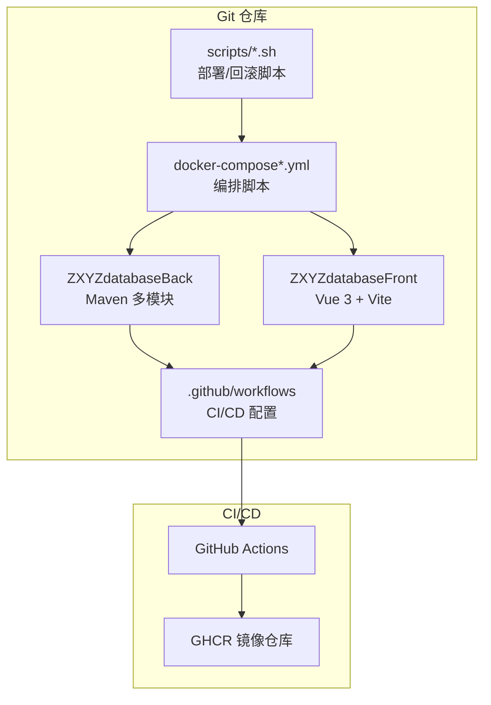
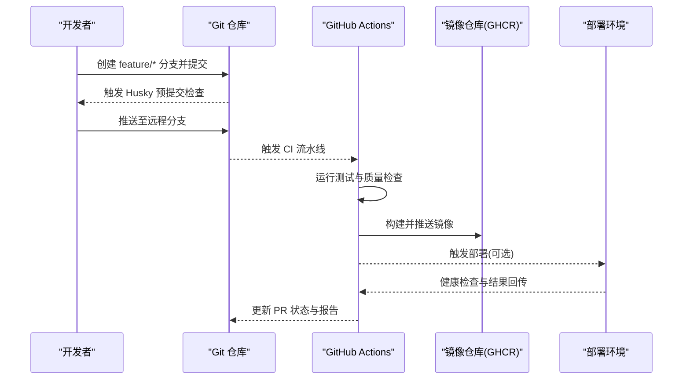
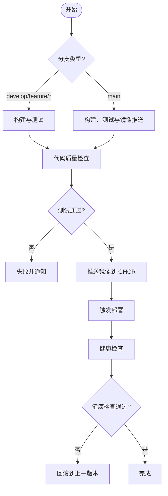
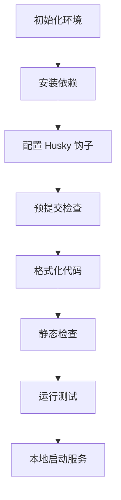
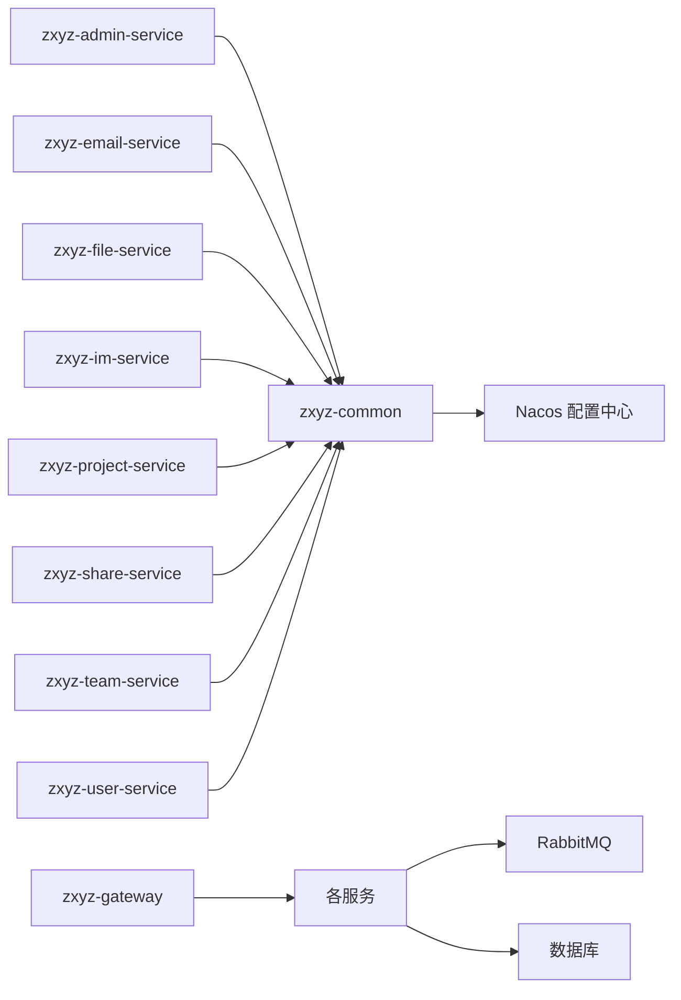

# Git工作流规范

<cite>
**本文引用的文件**
- [ci-cd.yml](file://.github/workflows/ci-cd.yml)
- [build.yml](file://ZXYZdatabaseFront/.github/workflows/build.yml)
- [deploy.yml](file://ZXYZdatabaseFront/.github/workflows/deploy.yml)
- [commitlint.config.js](file://ZXYZdatabaseFront/commitlint.config.js)
- [.husky/_/pre-commit](file://ZXYZdatabaseFront/.husky/_/pre-commit)
- [package.json](file://ZXYZdatabaseFront/package.json)
- [docker-compose.yml](file://docker-compose.yml)
- [docker-compose.dev.yml](file://docker-compose.dev.yml)
- [Dockerfile](file://ZXYZdatabaseBack/Dockerfile)
- [Dockerfile.base](file://ZXYZdatabaseBack/Dockerfile.base)
- [pom.xml](file://ZXYZdatabaseBack/pom.xml)
- [README.md](file://ZXYZdatabaseBack/README.md)
- [DEPLOYMENT.md](file://DEPLOYMENT.md)
- [CLAUDE.md](file://CLAUDE.md)
</cite>

## 目录
1. [简介](#简介)
2. [项目结构](#项目结构)
3. [核心组件](#核心组件)
4. [架构总览](#架构总览)
5. [详细组件分析](#详细组件分析)
6. [依赖分析](#依赖分析)
7. [性能考虑](#性能考虑)
8. [故障排查指南](#故障排查指南)
9. [结论](#结论)
10. [附录](#附录)

## 简介
本规范为 ZXYZ 项目制定统一的 Git 工作流，覆盖分支策略、提交信息规范、代码审查流程、CI/CD 集成、本地开发环境配置、版本发布与回滚、冲突解决与协作最佳实践。目标是确保多模块后端（11 个 Maven 模块）与 Vue 前端在持续交付过程中保持一致性、可追溯性与稳定性。

## 项目结构
仓库采用前后端分离与微服务架构：
- 后端：ZXYZdatabaseBack 包含多个 Spring Boot 服务模块，使用 Maven 管理；提供 Dockerfile 与基础镜像定义。
- 前端：ZXYZdatabaseFront 基于 Vue 3 + Vite，使用 Husky + Commitlint 进行提交前检查与格式化。
- CI/CD：GitHub Actions 编排后端与前端流水线，结合 docker-compose 进行本地与测试环境编排。
- 部署：Nacos 配置中心，Jasypt 加密敏感配置，容器化部署。

**图示来源**
- [ci-cd.yml](file://.github/workflows/ci-cd.yml)
- [build.yml](file://ZXYZdatabaseFront/.github/workflows/build.yml)
- [deploy.yml](file://ZXYZdatabaseFront/.github/workflows/deploy.yml)
- [docker-compose.yml](file://docker-compose.yml)
- [docker-compose.dev.yml](file://docker-compose.dev.yml)

**章节来源**
- [README.md](file://ZXYZdatabaseBack/README.md)
- [DEPLOYMENT.md](file://DEPLOYMENT.md)
- [CLAUDE.md](file://CLAUDE.md)

## 核心组件
- 分支模型：main、develop、feature/*、hotfix/*
- 提交规范：Commitlint 类型前缀与格式约束
- 代码审查：Pull Request 模板与检查清单
- CI/CD：自动化构建、测试、质量检查、镜像推送与部署
- 本地开发：Husky 钩子、预提交检查、格式化
- 版本发布：语义化版本、变更日志、回滚策略

**章节来源**
- [commitlint.config.js](file://ZXYZdatabaseFront/commitlint.config.js)
- [package.json](file://ZXYZdatabaseFront/package.json)
- [ci-cd.yml](file://.github/workflows/ci-cd.yml)
- [build.yml](file://ZXYZdatabaseFront/.github/workflows/build.yml)
- [deploy.yml](file://ZXYZdatabaseFront/.github/workflows/deploy.yml)

## 架构总览
下图展示从开发者到生产环境的完整工作流：分支创建 → 提交校验 → PR 审查 → CI 构建与测试 → 镜像构建与推送 → 部署与验证。

**图示来源**
- [ci-cd.yml](file://.github/workflows/ci-cd.yml)
- [build.yml](file://ZXYZdatabaseFront/.github/workflows/build.yml)
- [deploy.yml](file://ZXYZdatabaseFront/.github/workflows/deploy.yml)

## 详细组件分析

### 分支管理策略
- main 分支
  - 保护规则：禁止直接推送，仅允许通过受保护的合并请求；要求至少一名维护者批准；强制通过 CI 检查。
  - 用途：生产可用版本，所有发布标签指向该分支。
- develop 分支
  - 用途：集成分支，承载最新开发内容；功能分支合并至此；定期打 release/* 分支用于发布准备。
- feature/* 分支
  - 命名：feature/<模块>-<描述>，如 feature/user-service-login
  - 生命周期：从 develop 切出，完成后以 PR 合并回 develop；每个 PR 对应一个独立功能或任务。
- hotfix/* 分支
  - 命名：hotfix/<问题编号>-<描述>，如 hotfix/V1.2.3-email-send-failure
  - 生命周期：从 main 切出，修复后先合并回 main，再同步回 develop；紧急修复优先保证主分支稳定。

建议的分支保护与合并策略：
- main：仅允许 squash merge 或 rebase merge，禁用 fast-forward；必须通过全部 CI 检查与至少 1 名 reviewer 批准。
- develop：允许 merge 或 squash merge；需通过 CI 检查。
- feature/hotfix：不允许直接推送至 main/develop。

**章节来源**
- [ci-cd.yml](file://.github/workflows/ci-cd.yml)
- [build.yml](file://ZXYZdatabaseFront/.github/workflows/build.yml)
- [deploy.yml](file://ZXYZdatabaseFront/.github/workflows/deploy.yml)

### 提交消息规范（Commitlint）
- 类型前缀
  - feat：新功能
  - fix：缺陷修复
  - docs：文档变更
  - style：代码样式（不影响逻辑）
  - refactor：重构（非功能变更）
  - test：测试相关
  - chore：构建过程或辅助工具变动
- 作用域
  - 指定变更影响的模块或服务，如 admin-service、email-service、im-service、frontend 等。
- 描述要求
  - 简洁明了，动词开头，说明“做了什么”和“为什么”。
  - 必要时附加影响范围与注意事项。
- 示例格式
  - type(scope): description
  - 例如：feat(user-service): 新增用户注册接口

本地与远程校验：
- 本地：Husky 预提交钩子执行 Commitlint 与格式化检查。
- 远程：CI 阶段再次校验提交信息与代码质量。

**章节来源**
- [commitlint.config.js](file://ZXYZdatabaseFront/commitlint.config.js)
- [package.json](file://ZXYZdatabaseFront/package.json)

### 代码审查流程（Pull Request）
- PR 模板要点
  - 变更概述：简要说明本次改动目的与范围。
  - 影响面：涉及的服务、模块、数据库、配置项。
  - 自测情况：单元测试、集成测试、手动验证步骤。
  - 风险与回滚：潜在风险与回滚方案。
- 审查检查清单
  - 代码风格与规范是否符合 Commitlint 与 ESLint/Prettier。
  - 是否包含必要测试用例与覆盖率达标。
  - 是否存在安全漏洞或性能隐患。
  - 配置变更是否经过 Nacos 评审与加密处理。
  - 向后兼容性是否得到保障。
- 合并策略
  - 推荐 squash merge 以保持历史整洁；重大变更可使用 rebase merge 保留详细历史。
  - 合并前必须通过 CI 检查与至少一名 reviewer 批准。

**章节来源**
- [ci-cd.yml](file://.github/workflows/ci-cd.yml)
- [build.yml](file://ZXYZdatabaseFront/.github/workflows/build.yml)

### CI/CD 集成
- 触发条件
  - push 至 develop/feature/*：执行构建与测试。
  - push 至 main：执行构建、测试、镜像推送与部署。
- 后端流水线
  - 解析路径过滤，选择性构建受影响模块。
  - 运行 Maven 测试与静态检查。
  - 构建 Docker 镜像并推送至 GHCR。
- 前端流水线
  - 安装依赖、构建产物、运行测试与质量检查。
  - 生成静态资源供 Nginx 部署。
- 部署流水线
  - 拉取最新镜像，更新 docker-compose 配置。
  - 滚动更新服务并进行健康检查。
  - 失败自动回滚至上一稳定版本。

**图示来源**
- [ci-cd.yml](file://.github/workflows/ci-cd.yml)
- [build.yml](file://ZXYZdatabaseFront/.github/workflows/build.yml)
- [deploy.yml](file://ZXYZdatabaseFront/.github/workflows/deploy.yml)

**章节来源**
- [ci-cd.yml](file://.github/workflows/ci-cd.yml)
- [build.yml](file://ZXYZdatabaseFront/.github/workflows/build.yml)
- [deploy.yml](file://ZXYZdatabaseFront/.github/workflows/deploy.yml)

### 本地开发环境配置
- Husky 钩子
  - pre-commit：执行 Commitlint 与代码格式化（Prettier/ESLint）。
  - commit-msg：校验提交信息格式。
- 依赖安装
  - 前端：npm install 安装依赖。
  - 后端：Maven 下载依赖与编译。
- 启动方式
  - 使用 docker-compose.dev.yml 启动本地开发环境（基础设施 + 服务）。
  - 前端开发服务器与后端调试端口映射。

**图示来源**
- [.husky/_/pre-commit](file://ZXYZdatabaseFront/.husky/_/pre-commit)
- [package.json](file://ZXYZdatabaseFront/package.json)
- [docker-compose.dev.yml](file://docker-compose.dev.yml)

**章节来源**
- [.husky/_/pre-commit](file://ZXYZdatabaseFront/.husky/_/pre-commit)
- [package.json](file://ZXYZdatabaseFront/package.json)
- [docker-compose.dev.yml](file://docker-compose.dev.yml)

### 版本发布流程
- 语义化版本控制
  - 遵循 MAJOR.MINOR.PATCH 规则。
  - 主版本：不兼容的 API 变更。
  - 次版本：向下兼容的功能新增。
  - 修订版本：向下兼容的问题修正。
- 变更日志生成
  - 基于提交信息与 PR 标题自动生成 CHANGELOG。
  - 分类统计 feat/fix/docs 等类型变更。
- 发布步骤
  - 从 develop 创建 release/* 分支。
  - 合并至 main 并打标签。
  - 触发 CI 构建镜像与发布制品。
  - 部署至生产环境并验证。
- 回滚策略
  - 快速回滚：将 main 分支回退至上一个稳定标签。
  - 灰度回滚：逐步替换镜像并监控健康状态。
  - 数据回滚：必要时执行数据库回滚脚本。

**章节来源**
- [ci-cd.yml](file://.github/workflows/ci-cd.yml)
- [deploy.yml](file://ZXYZdatabaseFront/.github/workflows/deploy.yml)

### 冲突解决指南与协作最佳实践
- 冲突解决
  - 频繁同步 develop 分支，减少冲突概率。
  - 小步提交，便于定位与解决冲突。
  - 遇到复杂冲突时，召开短会协调解决方案。
- 协作最佳实践
  - 每个功能独立分支，避免多人修改同一文件。
  - PR 描述清晰，附带测试与影响分析。
  - 代码审查聚焦于设计、安全性与性能。
  - 使用 Issue 跟踪任务，关联 PR 与提交。

**章节来源**
- [ci-cd.yml](file://.github/workflows/ci-cd.yml)

## 依赖分析
- 模块依赖
  - 后端各服务通过 ServiceClient 调用内部端点，使用 X-Internal-Service-Token 鉴权。
  - 异步通信通过 RabbitMQ Topic Exchange zxyz.topic。
- 外部依赖
  - Nacos 配置中心与服务注册。
  - Jasypt 加密敏感配置。
  - GHCR 镜像仓库存储构建产物。

**图示来源**
- [pom.xml](file://ZXYZdatabaseBack/pom.xml)
- [docker-compose.yml](file://docker-compose.yml)

**章节来源**
- [pom.xml](file://ZXYZdatabaseBack/pom.xml)
- [docker-compose.yml](file://docker-compose.yml)

## 性能考虑
- 构建优化
  - 使用路径过滤仅构建受影响模块，减少 CI 时间。
  - 缓存依赖与构建产物，加速重复构建。
- 运行时优化
  - 合理设置 JVM 参数与线程池大小。
  - 使用连接池与缓存提升响应速度。
- 监控与告警
  - 集成 Prometheus 与 Grafana 监控系统指标。
  - 关键错误与慢查询实时告警。

[本节为通用指导，无需特定文件引用]

## 故障排查指南
- 常见问题
  - 提交被拒绝：检查 Commitlint 配置与提交信息格式。
  - CI 失败：查看日志输出，定位测试失败或构建错误。
  - 部署失败：检查镜像版本与环境配置一致性。
- 诊断工具
  - GitHub Actions 日志查看与重试机制。
  - Docker 容器日志与网络连通性检查。
  - Nacos 配置中心查看动态配置生效情况。

**章节来源**
- [ci-cd.yml](file://.github/workflows/ci-cd.yml)
- [build.yml](file://ZXYZdatabaseFront/.github/workflows/build.yml)
- [deploy.yml](file://ZXYZdatabaseFront/.github/workflows/deploy.yml)

## 结论
本规范为 ZXYZ 项目提供了完整的 Git 工作流框架，涵盖分支管理、提交规范、代码审查、CI/CD 集成、本地开发与版本发布。通过严格执行这些规范，团队能够高效协作、稳定交付高质量软件。建议定期回顾与更新规范，以适应项目发展与团队变化。

[本节为总结性内容，无需特定文件引用]

## 附录
- 参考文档
  - DEPLOYMENT.md：部署指南与最佳实践。
  - CLAUDE.md：项目架构与设计原则。
  - README.md：后端服务概览与使用说明。

**章节来源**
- [DEPLOYMENT.md](file://DEPLOYMENT.md)
- [CLAUDE.md](file://CLAUDE.md)
- [README.md](file://ZXYZdatabaseBack/README.md)