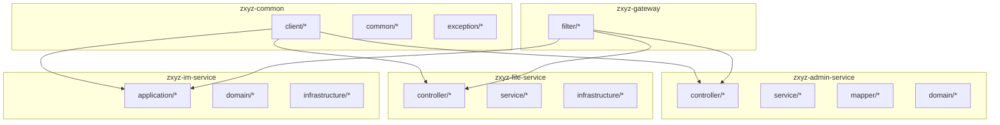
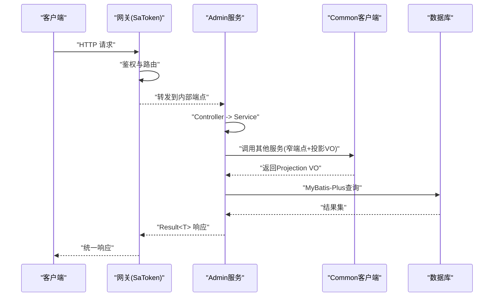
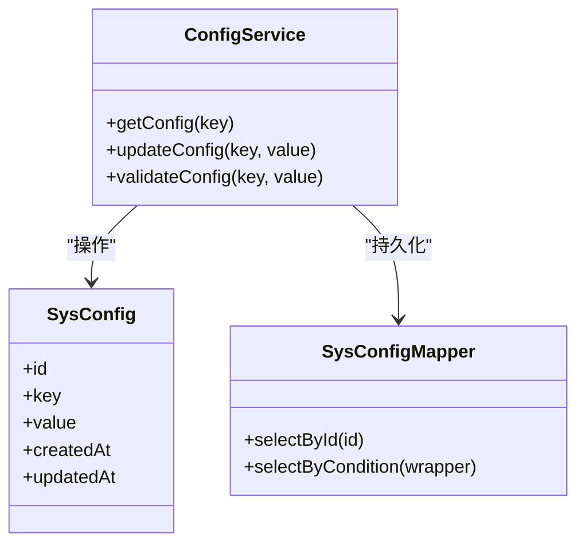
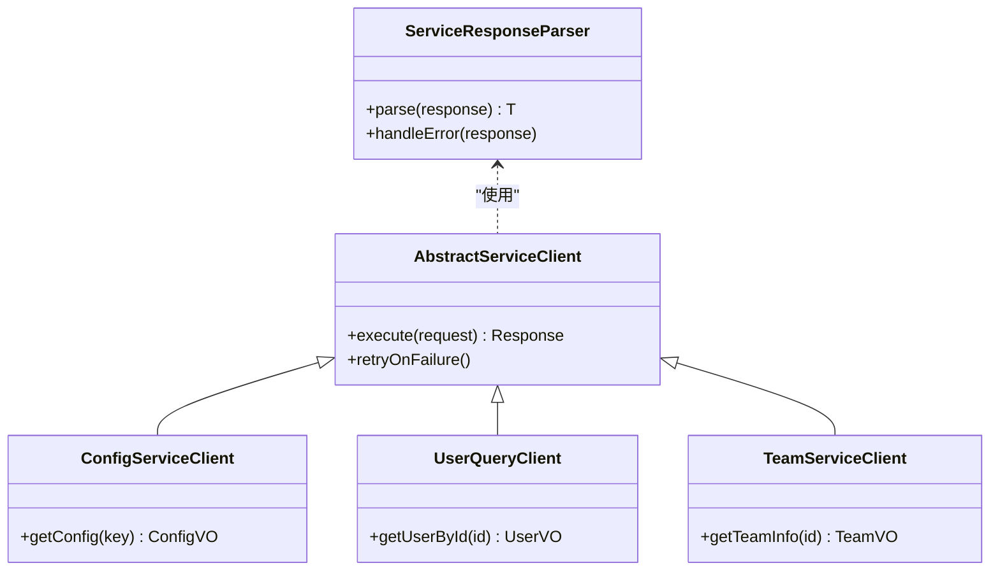
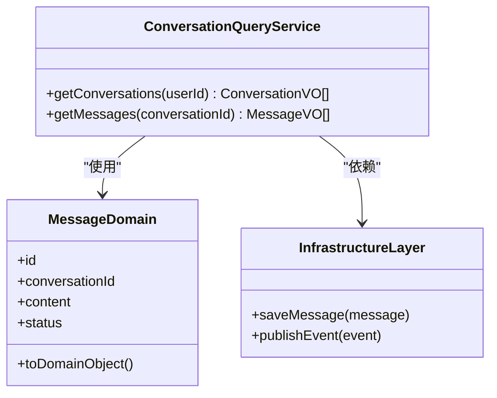
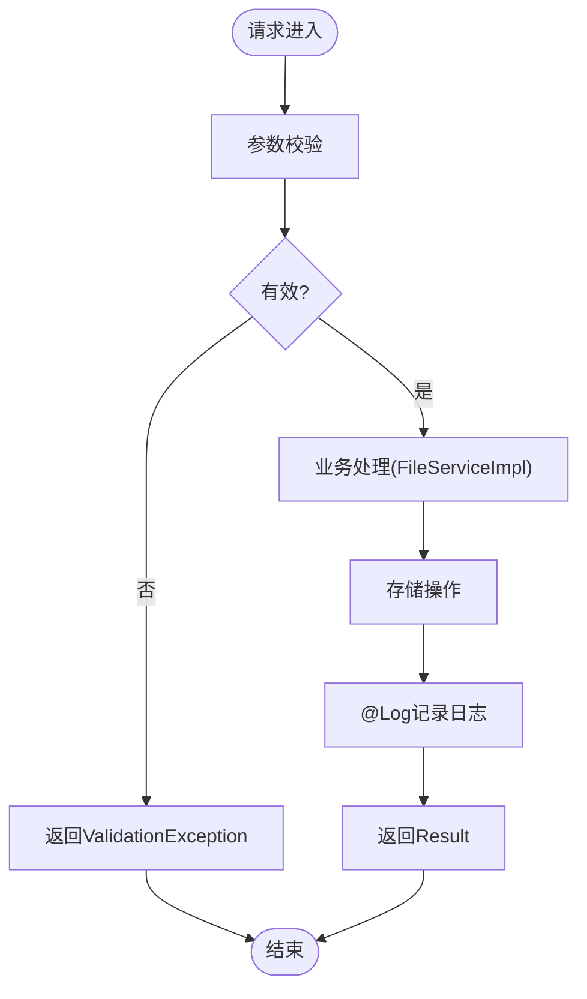
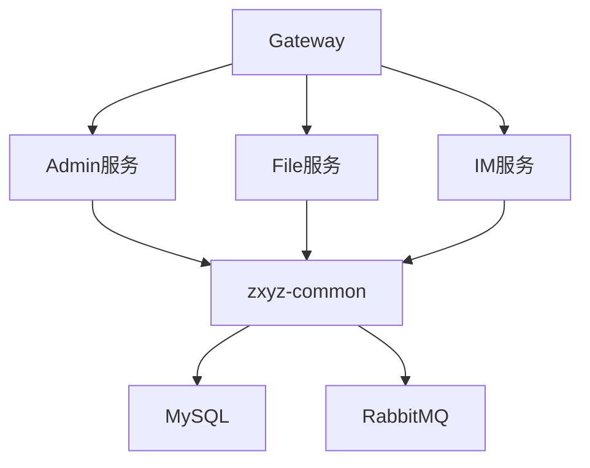

# Java编码规范

<cite>
**本文引用的文件**   
- [ZxyzAdminApplication.java](file://ZXYZdatabaseBack/zxyz-admin-service/src/main/java/uno/acloud/admin/ZxyzAdminApplication.java)
- [ConfigService.java](file://ZXYZdatabaseBack/zxyz-admin-service/src/main/java/uno/acloud/admin/service/ConfigService.java)
- [SysConfig.java](file://ZXYZdatabaseBack/zxyz-admin-service/src/main/java/uno/acloud/admin/domain/SysConfig.java)
- [SysConfigMapper.java](file://ZXYZdatabaseBack/zxyz-admin-service/src/main/java/uno/acloud/admin/mapper/SysConfigMapper.java)
- [AbstractServiceClient.java](file://ZXYZdatabaseBack/zxyz-common/src/main/java/uno/acloud/client/AbstractServiceClient.java)
- [ConfigServiceClient.java](file://ZXYZdatabaseBack/zxyz-common/src/main/java/uno/acloud/client/ConfigServiceClient.java)
- [ServiceResponseParser.java](file://ZXYZdatabaseBack/zxyz-common/src/main/java/uno/acloud/client/ServiceResponseParser.java)
- [application.yml](file://ZXYZdatabaseBack/zxyz-admin-service/src/main/resources/application.yml)
- [application-dev.yml](file://ZXYZdatabaseBack/zxyz-admin-service/src/main/resources/application-dev.yml)
- [application-prod.yml](file://ZXYZdatabaseBack/zxyz-admin-service/src/main/resources/application-prod.yml)
- [OperateLogConsumer.java](file://ZXYZdatabaseBack/zxyz-audit-service/src/main/java/uno/acloud/audit/mq/OperateLogConsumer.java)
- [RabbitMqConfig.java](file://ZXYZdatabaseBack/zxyz-audit-service/src/main/java/uno/acloud/audit/config/RabbitMqConfig.java)
- [EmailDispatchServiceTest.java](file://ZXYZdatabaseBack/zxyz-email-service/src/test/java/uno/acloud/email/application/EmailDispatchServiceTest.java)
- [EmailServerConfigServiceTest.java](file://ZXYZdatabaseBack/zxyz-email-service/src/test/java/uno/acloud/email/application/EmailServerConfigServiceTest.java)
- [FileController.java](file://ZXYZdatabaseBack/zxyz-file-service/src/main/java/uno/acloud/file/controller/FileController.java)
- [FileServiceImpl.java](file://ZXYZdatabaseBack/zxyz-file-service/src/main/java/uno/acloud/file/service/impl/FileServiceImpl.java)
- [SaTokenFilterConfig.java](file://ZXYZdatabaseBack/zxyz-gateway/src/main/java/uno/acloud/gateway/filter/SaTokenFilterConfig.java)
- [ConversationQueryService.java](file://ZXYZdatabaseBack/zxyz-im-service/src/main/java/uno/acloud/im/application/ConversationQueryService.java)
- [MessageDomain.java](file://ZXYZdatabaseBack/zxyz-im-service/src/main/java/uno/acloud/im/domain/message/MessageDomain.java)
- [UserQueryClient.java](file://ZXYZdatabaseBack/zxyz-common/src/main/java/uno/acloud/client/UserQueryClient.java)
- [TeamServiceClient.java](file://ZXYZdatabaseBack/zxyz-common/src/main/java/uno/acloud/client/TeamServiceClient.java)
- [ProjectController.java](file://ZXYZdatabaseBack/zxyz-project-service/src/main/java/uno/acloud/project/controller/ProjectController.java)
- [ProjectServiceImpl.java](file://ZXYZdatabaseBack/zxyz-project-service/src/main/java/uno/acloud/project/service/impl/ProjectServiceImpl.java)
- [ShareAccessManager.java](file://ZXYZdatabaseBack/zxyz-share-service/src/main/java/uno/acloud/share/service/impl/ShareAccessManager.java)
- [TeamController.java](file://ZXYZdatabaseBack/zxyz-team-service/src/main/java/uno/acloud/team/controller/TeamController.java)
- [TeamServiceImpl.java](file://ZXYZdatabaseBack/zxyz-team-service/src/main/java/uno/acloud/team/service/impl/TeamServiceImpl.java)
- [UserController.java](file://ZXYZdatabaseBack/zxyz-user-service/src/main/java/uno/acloud/user/controller/UserController.java)
- [UserServiceImpl.java](file://ZXYZdatabaseBack/zxyz-user-service/src/main/java/uno/acloud/user/service/impl/UserServiceImpl.java)
</cite>

## 目录
1. [引言](#引言)
2. [项目结构](#项目结构)
3. [核心组件](#核心组件)
4. [架构总览](#架构总览)
5. [详细组件分析](#详细组件分析)
6. [依赖关系分析](#依赖关系分析)
7. [性能考量](#性能考量)
8. [故障排查指南](#故障排查指南)
9. [结论](#结论)
10. [附录](#附录)

## 引言
本规范面向ZXYZ后端Java代码，统一包命名、类与方法命名、字段命名、注释与异常处理、日志记录、Spring Boot与MyBatis-Plus使用实践，并给出重构与性能优化建议。项目采用微服务架构（11个Maven模块），服务间同步通信通过ServiceClient+内部鉴权，异步通信通过RabbitMQ Topic Exchange zxyz.topic；部分服务（im-service、email-service）采用DDD分层，其余服务采用传统分层。

## 项目结构
- 包命名约定：所有Java包以 uno.acloud.* 为根，按领域或服务划分子包，如 uno.acloud.admin、uno.acloud.file、uno.acloud.im 等。
- 模块组织：每个服务一个独立Maven模块，公共能力沉淀在 zxyz-common。
- 分层风格：
  - DDD风格（im-service、email-service）：interfaces → application → domain → infrastructure。
  - 传统分层（admin、file、project、team、user等）：controller → service/impl → mapper → entity。
- 配置管理：各服务提供 application.yml 及环境配置文件（dev/prod），敏感配置通过Jasypt加密。

**图表来源** 
- [ZxyzAdminApplication.java](file://ZXYZdatabaseBack/zxyz-admin-service/src/main/java/uno/acloud/admin/ZxyzAdminApplication.java)
- [application.yml](file://ZXYZdatabaseBack/zxyz-admin-service/src/main/resources/application.yml)

**章节来源**
- [ZxyzAdminApplication.java](file://ZXYZdatabaseBack/zxyz-admin-service/src/main/java/uno/acloud/admin/ZxyzAdminApplication.java)
- [application.yml](file://ZXYZdatabaseBack/zxyz-admin-service/src/main/resources/application.yml)

## 核心组件
- 包与命名
  - 包：uno.acloud.<服务名>.*，避免跨层包混用。
  - 类：业务实体使用名词（如 SysConfig），控制器以 Controller 结尾，服务以 Service 结尾，实现类以 Impl 结尾，DTO/VO 明确后缀。
  - 方法：动词开头（如 query、create、update、delete），查询返回集合或对象，命令返回结果或void。
  - 字段：小驼峰，布尔字段避免 isXxx 前缀，数据库映射字段与实体字段保持一致语义。
- 注释规范
  - 类注释：说明职责、边界、线程安全、关键约束。
  - 方法注释：参数、返回值、异常、副作用、事务边界。
  - 复杂逻辑：在关键分支、重试、幂等、补偿处补充行内注释。
- 异常处理
  - 自定义异常：BusinessException（业务错误）、NotFoundException（资源不存在）、ValidationException（参数校验失败）。
  - 错误码：统一枚举或常量，包含 code、message、可选参数占位。
  - 全局异常处理器：捕获并转换为统一响应结构 Result<T>。
- 日志记录
  - 使用 @Log 注解标记需审计的方法，统一输出请求上下文、耗时、关键入参（脱敏）。
  - 敏感信息（密码、token、手机号、邮箱）必须脱敏后再落盘。
  - 性能监控日志：关键路径打点（进入/退出、缓存命中/未命中、DB耗时）。
- Spring Boot最佳实践
  - 依赖注入：优先构造器注入，避免字段注入；@ConfigurationProperties 绑定配置。
  - 事务管理：@Transactional 标注在Service层，明确传播与回滚策略，避免长事务。
  - 配置管理：多环境分离，敏感项加密，动态配置通过Nacos。
- MyBatis-Plus使用规范
  - 实体类：继承BaseEntity（如有），使用@TableField、@TableId等注解，避免冗余字段。
  - Mapper接口：继承BaseMapper，复杂查询使用Wrapper构建条件，禁止手写SQL除非必要。
  - 查询条件：使用LambdaQueryWrapper，避免字符串拼接；分页使用Page对象。

**章节来源**
- [ConfigService.java](file://ZXYZdatabaseBack/zxyz-admin-service/src/main/java/uno/acloud/admin/service/ConfigService.java)
- [SysConfig.java](file://ZXYZdatabaseBack/zxyz-admin-service/src/main/java/uno/acloud/admin/domain/SysConfig.java)
- [SysConfigMapper.java](file://ZXYZdatabaseBack/zxyz-admin-service/src/main/java/uno/acloud/admin/mapper/SysConfigMapper.java)

## 架构总览
- 网关层：Gateway统一鉴权（SaToken），拒绝公网访问 /api/internal/** 内部端点。
- 服务层：各业务服务暴露REST API，内部调用通过ServiceClient+内部令牌。
- 数据层：MyBatis-Plus + MySQL，迁移脚本集中管理。
- 消息层：RabbitMQ Topic Exchange zxyz.topic，消费者处理异步任务（如审计日志）。
- 配置中心：Nacos统一管理，Jasypt加密敏感配置。

**图表来源** 
- [SaTokenFilterConfig.java](file://ZXYZdatabaseBack/zxyz-gateway/src/main/java/uno/acloud/gateway/filter/SaTokenFilterConfig.java)
- [AbstractServiceClient.java](file://ZXYZdatabaseBack/zxyz-common/src/main/java/uno/acloud/client/AbstractServiceClient.java)
- [ConfigServiceClient.java](file://ZXYZdatabaseBack/zxyz-common/src/main/java/uno/acloud/client/ConfigServiceClient.java)
- [SysConfigMapper.java](file://ZXYZdatabaseBack/zxyz-admin-service/src/main/java/uno/acloud/admin/mapper/SysConfigMapper.java)

## 详细组件分析

### 组件A：Admin服务（传统分层）
- 职责：系统配置管理、审计配置、提供者管理。
- 分层：controller → service → mapper → domain。
- 关键点：
  - ConfigService封装配置CRUD与校验。
  - SysConfig实体映射配置表，含审计字段。
  - SysConfigMapper继承BaseMapper，使用Wrapper构建查询。

**图表来源** 
- [ConfigService.java](file://ZXYZdatabaseBack/zxyz-admin-service/src/main/java/uno/acloud/admin/service/ConfigService.java)
- [SysConfig.java](file://ZXYZdatabaseBack/zxyz-admin-service/src/main/java/uno/acloud/admin/domain/SysConfig.java)
- [SysConfigMapper.java](file://ZXYZdatabaseBack/zxyz-admin-service/src/main/java/uno/acloud/admin/mapper/SysConfigMapper.java)

**章节来源**
- [ConfigService.java](file://ZXYZdatabaseBack/zxyz-admin-service/src/main/java/uno/acloud/admin/service/ConfigService.java)
- [SysConfig.java](file://ZXYZdatabaseBack/zxyz-admin-service/src/main/java/uno/acloud/admin/domain/SysConfig.java)
- [SysConfigMapper.java](file://ZXYZdatabaseBack/zxyz-admin-service/src/main/java/uno/acloud/admin/mapper/SysConfigMapper.java)

### 组件B：Common客户端（服务间调用）
- 职责：抽象HTTP客户端、响应解析、具体服务客户端（Config、User、Team等）。
- 关键点：
  - AbstractServiceClient封装基础请求、重试、超时。
  - ServiceResponseParser统一解析Result<T>，提取数据或抛出异常。
  - 窄端点+投影VO：仅返回调用方所需字段，避免胖DTO。

**图表来源** 
- [AbstractServiceClient.java](file://ZXYZdatabaseBack/zxyz-common/src/main/java/uno/acloud/client/AbstractServiceClient.java)
- [ServiceResponseParser.java](file://ZXYZdatabaseBack/zxyz-common/src/main/java/uno/acloud/client/ServiceResponseParser.java)
- [ConfigServiceClient.java](file://ZXYZdatabaseBack/zxyz-common/src/main/java/uno/acloud/client/ConfigServiceClient.java)
- [UserQueryClient.java](file://ZXYZdatabaseBack/zxyz-common/src/main/java/uno/acloud/client/UserQueryClient.java)
- [TeamServiceClient.java](file://ZXYZdatabaseBack/zxyz-common/src/main/java/uno/acloud/client/TeamServiceClient.java)

**章节来源**
- [AbstractServiceClient.java](file://ZXYZdatabaseBack/zxyz-common/src/main/java/uno/acloud/client/AbstractServiceClient.java)
- [ServiceResponseParser.java](file://ZXYZdatabaseBack/zxyz-common/src/main/java/uno/acloud/client/ServiceResponseParser.java)
- [ConfigServiceClient.java](file://ZXYZdatabaseBack/zxyz-common/src/main/java/uno/acloud/client/ConfigServiceClient.java)
- [UserQueryClient.java](file://ZXYZdatabaseBack/zxyz-common/src/main/java/uno/acloud/client/UserQueryClient.java)
- [TeamServiceClient.java](file://ZXYZdatabaseBack/zxyz-common/src/main/java/uno/acloud/client/TeamServiceClient.java)

### 组件C：IM服务（DDD分层）
- 职责：会话、消息、通知等即时通讯功能。
- 分层：interfaces → application → domain → infrastructure。
- 关键点：
  - ConversationQueryService应用服务，编排领域逻辑。
  - MessageDomain领域模型，封装业务规则。
  - 基础设施层负责外部依赖（DB、MQ、缓存）。

**图表来源** 
- [ConversationQueryService.java](file://ZXYZdatabaseBack/zxyz-im-service/src/main/java/uno/acloud/im/application/ConversationQueryService.java)
- [MessageDomain.java](file://ZXYZdatabaseBack/zxyz-im-service/src/main/java/uno/acloud/im/domain/message/MessageDomain.java)

**章节来源**
- [ConversationQueryService.java](file://ZXYZdatabaseBack/zxyz-im-service/src/main/java/uno/acloud/im/application/ConversationQueryService.java)
- [MessageDomain.java](file://ZXYZdatabaseBack/zxyz-im-service/src/main/java/uno/acloud/im/domain/message/MessageDomain.java)

### 组件D：文件服务（传统分层）
- 职责：文件上传、下载、元数据管理。
- 关键点：
  - FileController处理HTTP请求，参数校验。
  - FileServiceImpl实现业务逻辑，调用存储基础设施。
  - 使用@Log注解记录关键操作，敏感信息脱敏。

**图表来源** 
- [FileController.java](file://ZXYZdatabaseBack/zxyz-file-service/src/main/java/uno/acloud/file/controller/FileController.java)
- [FileServiceImpl.java](file://ZXYZdatabaseBack/zxyz-file-service/src/main/java/uno/acloud/file/service/impl/FileServiceImpl.java)

**章节来源**
- [FileController.java](file://ZXYZdatabaseBack/zxyz-file-service/src/main/java/uno/acloud/file/controller/FileController.java)
- [FileServiceImpl.java](file://ZXYZdatabaseBack/zxyz-file-service/src/main/java/uno/acloud/file/service/impl/FileServiceImpl.java)

### 组件E：网关（鉴权过滤）
- 职责：统一鉴权、路由、限流。
- 关键点：
  - SaTokenFilterConfig配置SaToken过滤器，拦截/api/internal/**。
  - 拒绝公网访问内部端点，确保服务间调用安全。

**章节来源**
- [SaTokenFilterConfig.java](file://ZXYZdatabaseBack/zxyz-gateway/src/main/java/uno/acloud/gateway/filter/SaTokenFilterConfig.java)

### 组件F：审计服务（消息消费）
- 职责：消费审计日志消息，持久化与清理。
- 关键点：
  - OperateLogConsumer监听RabbitMQ队列，处理审计事件。
  - RabbitMqConfig配置Topic Exchange与队列绑定。

**章节来源**
- [OperateLogConsumer.java](file://ZXYZdatabaseBack/zxyz-audit-service/src/main/java/uno/acloud/audit/mq/OperateLogConsumer.java)
- [RabbitMqConfig.java](file://ZXYZdatabaseBack/zxyz-audit-service/src/main/java/uno/acloud/audit/config/RabbitMqConfig.java)

### 组件G：邮件服务（DDD分层）
- 职责：邮件发送、模板渲染、验证码服务。
- 关键点：
  - EmailDispatchServiceTest验证发送流程。
  - EmailServerConfigServiceTest验证服务器配置。

**章节来源**
- [EmailDispatchServiceTest.java](file://ZXYZdatabaseBack/zxyz-email-service/src/test/java/uno/acloud/email/application/EmailDispatchServiceTest.java)
- [EmailServerConfigServiceTest.java](file://ZXYZdatabaseBack/zxyz-email-service/src/test/java/uno/acloud/email/application/EmailServerConfigServiceTest.java)

### 组件H：项目、团队、用户服务（传统分层）
- 职责：项目管理、团队协作、用户管理。
- 关键点：
  - ProjectController/ServiceImpl处理项目CRUD。
  - TeamController/ServiceImpl管理团队与成员。
  - UserController/ServiceImpl处理用户注册、登录、权限。

**章节来源**
- [ProjectController.java](file://ZXYZdatabaseBack/zxyz-project-service/src/main/java/uno/acloud/project/controller/ProjectController.java)
- [ProjectServiceImpl.java](file://ZXYZdatabaseBack/zxyz-project-service/src/main/java/uno/acloud/project/service/impl/ProjectServiceImpl.java)
- [TeamController.java](file://ZXYZdatabaseBack/zxyz-team-service/src/main/java/uno/acloud/team/controller/TeamController.java)
- [TeamServiceImpl.java](file://ZXYZdatabaseBack/zxyz-team-service/src/main/java/uno/acloud/team/service/impl/TeamServiceImpl.java)
- [UserController.java](file://ZXYZdatabaseBack/zxyz-user-service/src/main/java/uno/acloud/user/controller/UserController.java)
- [UserServiceImpl.java](file://ZXYZdatabaseBack/zxyz-user-service/src/main/java/uno/acloud/user/service/impl/UserServiceImpl.java)

### 组件I：分享服务（权限控制）
- 职责：分享链接生成、访问控制、速率限制。
- 关键点：
  - ShareAccessManager实现访问权限校验与限流。

**章节来源**
- [ShareAccessManager.java](file://ZXYZdatabaseBack/zxyz-share-service/src/main/java/uno/acloud/share/service/impl/ShareAccessManager.java)

## 依赖关系分析
- 服务间依赖：通过zxyz-common的ServiceClient进行解耦，避免直接耦合。
- 配置依赖：Nacos动态配置，Jasypt加密敏感项。
- 消息依赖：RabbitMQ Topic Exchange zxyz.topic，生产者与消费者解耦。

**图表来源** 
- [AbstractServiceClient.java](file://ZXYZdatabaseBack/zxyz-common/src/main/java/uno/acloud/client/AbstractServiceClient.java)
- [RabbitMqConfig.java](file://ZXYZdatabaseBack/zxyz-audit-service/src/main/java/uno/acloud/audit/config/RabbitMqConfig.java)

**章节来源**
- [AbstractServiceClient.java](file://ZXYZdatabaseBack/zxyz-common/src/main/java/uno/acloud/client/AbstractServiceClient.java)
- [RabbitMqConfig.java](file://ZXYZdatabaseBack/zxyz-audit-service/src/main/java/uno/acloud/audit/config/RabbitMqConfig.java)

## 性能考量
- 数据库：
  - 使用索引优化查询，避免全表扫描。
  - 分页查询使用Page对象，限制单次返回量。
  - 批量操作使用MyBatis-Plus的insertBatch/updateBatch。
- 缓存：
  - 热点数据使用Redis缓存，设置合理过期时间。
  - 缓存更新策略：先更新DB再删除缓存，或延迟双删。
- 并发：
  - 使用线程池处理异步任务，避免阻塞主线程。
  - 分布式锁防止重复处理（如订单状态更新）。
- 网络：
  - 服务间调用设置超时与重试，避免雪崩。
  - 压缩大响应体，减少带宽占用。

## 故障排查指南
- 常见异常：
  - BusinessException：检查业务逻辑与错误码定义。
  - NotFoundException：确认资源ID是否存在。
  - ValidationException：检查参数校验规则。
- 日志排查：
  - 使用@Log注解定位问题，查看请求上下文与耗时。
  - 敏感信息已脱敏，避免泄露。
- 配置问题：
  - 检查Nacos配置是否正确加载。
  - Jasypt解密失败时，确认密钥配置。

**章节来源**
- [application.yml](file://ZXYZdatabaseBack/zxyz-admin-service/src/main/resources/application.yml)
- [application-dev.yml](file://ZXYZdatabaseBack/zxyz-admin-service/src/main/resources/application-dev.yml)
- [application-prod.yml](file://ZXYZdatabaseBack/zxyz-admin-service/src/main/resources/application-prod.yml)

## 结论
本规范统一了ZXYZ项目的Java编码标准，涵盖命名、注释、异常、日志、Spring Boot与MyBatis-Plus实践，并提供重构与性能优化建议。遵循本规范可提升代码质量、可维护性与系统稳定性。

## 附录
- 参考文档：
  - [architecture.md](file://docs/architecture.md)
  - [api-contract.md](file://docs/api-contract.md)
- 工具链：
  - CI/CD：GitHub Actions + dorny/paths-filter
  - 容器编排：Docker Compose
  - 配置中心：Nacos + Jasypt