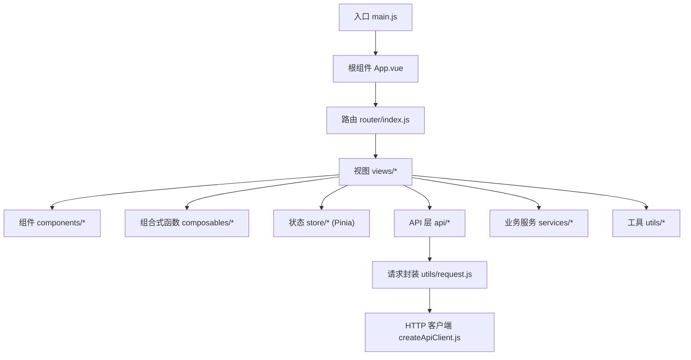
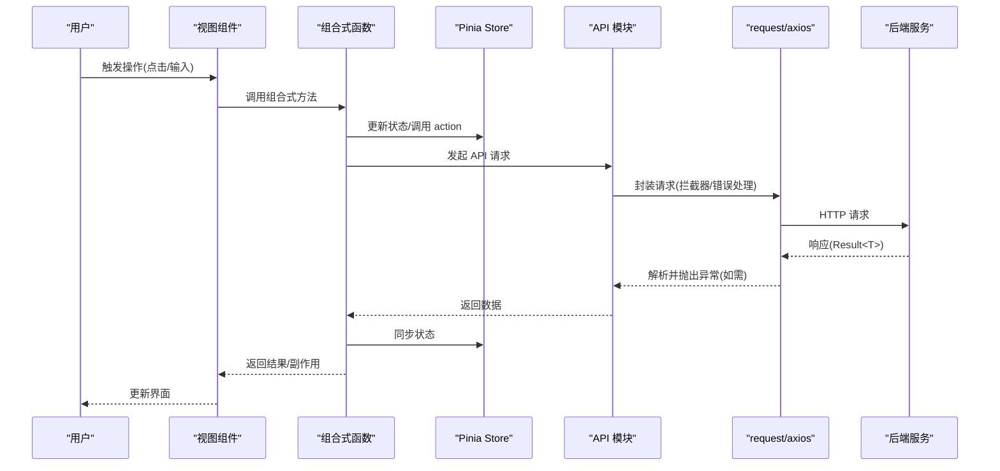
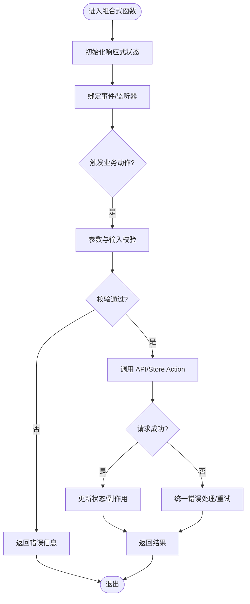
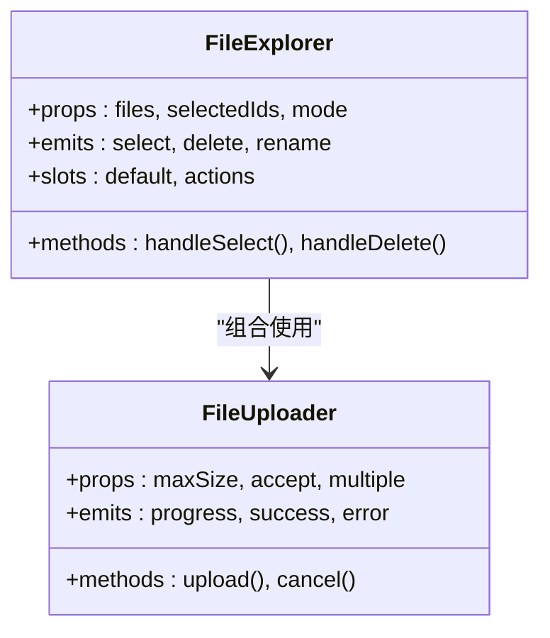
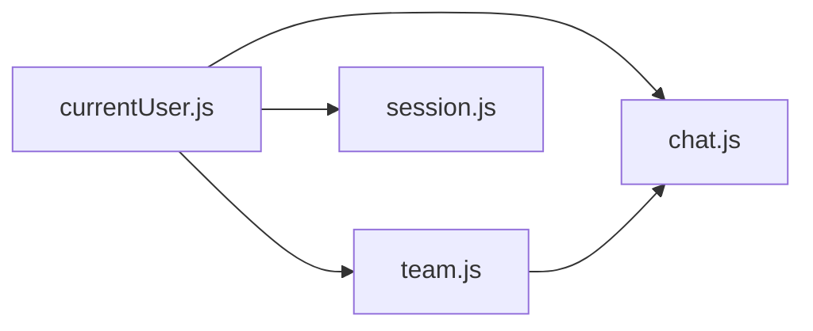
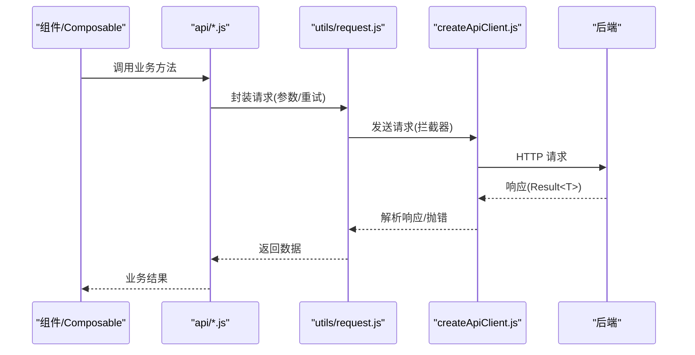
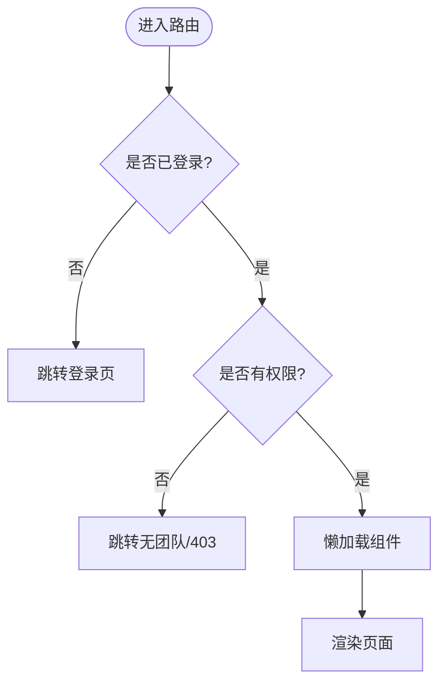
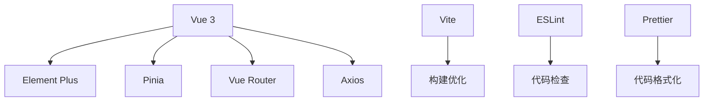

# Vue前端编码规范

<cite>
**本文引用的文件**   
- [package.json](file://ZXYZdatabaseFront/package.json)
- [vite.config.js](file://ZXYZdatabaseFront/vite.config.js)
- [eslint.config.mjs](file://ZXYZdatabaseFront/eslint.config.mjs)
- [.prettierrc](file://ZXYZdatabaseFront/.prettierrc)
- [main.js](file://ZXYZdatabaseFront/src/main.js)
- [App.vue](file://ZXYZdatabaseFront/src/App.vue)
- [router/index.js](file://ZXYZdatabaseFront/src/router/index.js)
- [router/guards/permission.js](file://ZXYZdatabaseFront/src/router/guards/permission.js)
- [store/currentUser.js](file://ZXYZdatabaseFront/src/store/currentUser.js)
- [store/team.js](file://ZXYZdatabaseFront/src/store/team.js)
- [store/chat.js](file://ZXYZdatabaseFront/src/store/chat.js)
- [store/session.js](file://ZXYZdatabaseFront/src/store/session.js)
- [api/auth.js](file://ZXYZdatabaseFront/src/api/auth.js)
- [api/files.js](file://ZXYZdatabaseFront/src/api/files.js)
- [utils/request.js](file://ZXYZdatabaseFront/src/utils/request.js)
- [utils/createApiClient.js](file://ZXYZdatabaseFront/src/utils/createApiClient.js)
- [utils/error.js](file://ZXYZdatabaseFront/src/utils/error.js)
- [utils/publicRequest.js](file://ZXYZdatabaseFront/src/utils/publicRequest.js)
- [composables/useLoginForm.js](file://ZXYZdatabaseFront/src/composables/useLoginForm.js)
- [composables/useFileUpload.js](file://ZXYZdatabaseFront/src/composables/useFileUpload.js)
- [composables/useSpaceFileList.js](file://ZXYZdatabaseFront/src/composables/useSpaceFileList.js)
- [components/FileExplorer.vue](file://ZXYZdatabaseFront/src/components/FileExplorer.vue)
- [components/FileUploader.vue](file://ZXYZdatabaseFront/src/components/FileUploader.vue)
- [views/login/index.vue](file://ZXYZdatabaseFront/src/views/login/index.vue)
- [views/layout/index.vue](file://ZXYZdatabaseFront/src/views/layout/index.vue)
- [views/chat/index.vue](file://ZXYZdatabaseFront/src/views/chat/index.vue)
- [services/upload.js](file://ZXYZdatabaseFront/src/services/upload.js)
- [services/avatarUpload.js](file://ZXYZdatabaseFront/src/services/avatarUpload.js)
- [services/filePathResolver.js](file://ZXYZdatabaseFront/src/services/filePathResolver.js)
</cite>

## 目录
1. [引言](#引言)
2. [项目结构](#项目结构)
3. [核心组件](#核心组件)
4. [架构总览](#架构总览)
5. [详细组件分析](#详细组件分析)
6. [依赖关系分析](#依赖关系分析)
7. [性能考量](#性能考量)
8. [故障排查指南](#故障排查指南)
9. [结论](#结论)
10. [附录](#附录)

## 引言
本规范面向 ZXYZ Vue 3 前端应用，基于 Composition API + <script setup>、Element Plus、Pinia、Vite 构建。目标是为团队提供统一的编码约定与最佳实践，覆盖：
- Composition API 使用规范（<script setup>、ref/reactive、composables）
- 组件设计原则（SFC 结构、props、事件、插槽）
- 状态管理（Pinia store 设计与模块划分、数据持久化）
- API 调用封装（axios 拦截器、错误处理、重试机制）
- 样式规范（CSS 模块化、主题定制、响应式）
- 路由与导航（守卫、权限控制、懒加载）
- 代码质量工具（Prettier、ESLint、TypeScript）
- 测试规范（组件测试、E2E 实践）

## 项目结构
前端采用功能域组织方式，按 api、composables、components、store、router、views、utils、services 等目录划分职责，便于复用与维护。

图表来源
- [main.js:1-50](file://ZXYZdatabaseFront/src/main.js#L1-L50)
- [App.vue:1-120](file://ZXYZdatabaseFront/src/App.vue#L1-L120)
- [router/index.js:1-120](file://ZXYZdatabaseFront/src/router/index.js#L1-L120)

章节来源
- [package.json:1-120](file://ZXYZdatabaseFront/package.json#L1-L120)
- [vite.config.js:1-120](file://ZXYZdatabaseFront/vite.config.js#L1-L120)
- [main.js:1-50](file://ZXYZdatabaseFront/src/main.js#L1-L50)
- [App.vue:1-120](file://ZXYZdatabaseFront/src/App.vue#L1-L120)
- [router/index.js:1-120](file://ZXYZdatabaseFront/src/router/index.js#L1-L120)

## 核心组件
- 组合式函数（composables）
  - 命名以 useXxx 开头，单一职责，返回响应式状态与操作方法；避免在 composable 内直接操作 DOM，优先通过 ref/reactive 暴露状态。
  - 典型示例：登录表单、文件上传、空间文件列表等。
- 单文件组件（SFC）
  - 结构顺序：<template> → <script setup> → <style scoped>；Props 使用 defineProps，事件使用 defineEmits。
  - 复杂 UI 拆分为子组件，保持父组件仅编排布局与流程。
- Pinia Store
  - 按领域拆分模块（如 currentUser、team、chat），每个模块包含 state、getters、actions；跨模块共享数据通过 actions 或 composables 协调。
- API 层
  - 每个业务域一个 api/*.js 文件，统一通过 request 或 createApiClient 发起请求，集中处理错误与重试。

章节来源
- [composables/useLoginForm.js:1-120](file://ZXYZdatabaseFront/src/composables/useLoginForm.js#L1-L120)
- [composables/useFileUpload.js:1-120](file://ZXYZdatabaseFront/src/composables/useFileUpload.js#L1-L120)
- [composables/useSpaceFileList.js:1-120](file://ZXYZdatabaseFront/src/composables/useSpaceFileList.js#L1-L120)
- [store/currentUser.js:1-120](file://ZXYZdatabaseFront/src/store/currentUser.js#L1-L120)
- [store/team.js:1-120](file://ZXYZdatabaseFront/src/store/team.js#L1-L120)
- [store/chat.js:1-120](file://ZXYZdatabaseFront/src/store/chat.js#L1-L120)
- [api/auth.js:1-120](file://ZXYZdatabaseFront/src/api/auth.js#L1-L120)
- [api/files.js:1-120](file://ZXYZdatabaseFront/src/api/files.js#L1-L120)

## 架构总览
前端整体遵循“视图层 → 组合式逻辑 → 状态管理 → API 层 → HTTP 客户端”的分层模式，配合路由守卫实现权限控制，结合 Element Plus 提供一致的交互体验。

图表来源
- [router/guards/permission.js:1-120](file://ZXYZdatabaseFront/src/router/guards/permission.js#L1-L120)
- [store/currentUser.js:1-120](file://ZXYZdatabaseFront/src/store/currentUser.js#L1-L120)
- [api/auth.js:1-120](file://ZXYZdatabaseFront/src/api/auth.js#L1-L120)
- [utils/request.js:1-120](file://ZXYZdatabaseFront/src/utils/request.js#L1-L120)
- [utils/createApiClient.js:1-120](file://ZXYZdatabaseFront/src/utils/createApiClient.js#L1-L120)

## 详细组件分析

### 组合式函数（Composition API）规范
- 使用场景
  - 表单与校验：useLoginForm 负责登录表单状态、校验与提交。
  - 文件上传：useFileUpload 封装上传进度、失败重试、取消上传等能力。
  - 数据列表：useSpaceFileList 管理分页、排序、搜索、选择等状态。
- 设计原则
  - 单一职责：每个 composable 聚焦一个业务场景。
  - 响应式优先：对外暴露 ref/reactive 状态与方法，内部可自由使用 computed/watch。
  - 无副作用：避免直接操作 DOM，必要时通过生命周期钩子在组件中执行。
  - 可测试性：纯函数式逻辑便于单元测试。

图表来源
- [composables/useLoginForm.js:1-120](file://ZXYZdatabaseFront/src/composables/useLoginForm.js#L1-L120)
- [composables/useFileUpload.js:1-120](file://ZXYZdatabaseFront/src/composables/useFileUpload.js#L1-L120)
- [composables/useSpaceFileList.js:1-120](file://ZXYZdatabaseFront/src/composables/useSpaceFileList.js#L1-L120)

章节来源
- [composables/useLoginForm.js:1-120](file://ZXYZdatabaseFront/src/composables/useLoginForm.js#L1-L120)
- [composables/useFileUpload.js:1-120](file://ZXYZdatabaseFront/src/composables/useFileUpload.js#L1-L120)
- [composables/useSpaceFileList.js:1-120](file://ZXYZdatabaseFront/src/composables/useSpaceFileList.js#L1-L120)

### 单文件组件（SFC）设计规范
- 结构顺序
  - <template>：模板与指令
  - <script setup>：声明 props、emits、组合式函数、本地状态
  - <style scoped>：样式隔离，主题变量通过 CSS 变量注入
- Props 定义
  - 使用 TypeScript 接口或 PropTypes 风格描述类型，必填字段标注 required。
- 事件处理
  - 使用 defineEmits 声明事件名，事件载荷最小化，避免传递大对象。
- 插槽使用
  - 具名插槽用于局部扩展，默认插槽用于内容包裹；避免过度嵌套。

图表来源
- [components/FileExplorer.vue:1-200](file://ZXYZdatabaseFront/src/components/FileExplorer.vue#L1-L200)
- [components/FileUploader.vue:1-200](file://ZXYZdatabaseFront/src/components/FileUploader.vue#L1-L200)

章节来源
- [components/FileExplorer.vue:1-200](file://ZXYZdatabaseFront/src/components/FileExplorer.vue#L1-L200)
- [components/FileUploader.vue:1-200](file://ZXYZdatabaseFront/src/components/FileUploader.vue#L1-L200)

### 状态管理（Pinia）规范
- 模块划分
  - currentUser：当前用户信息、权限、登录态
  - team：团队上下文、成员、配额
  - chat：会话、消息、通知
  - session：会话级临时状态
- 设计原则
  - State 只存放必要数据，计算属性用 getters；变更通过 actions 进行。
  - 跨模块协作通过 actions 或 composables 协调，避免循环依赖。
  - 持久化策略：敏感数据不落地，非敏感配置可通过 localStorage/sessionStorage 缓存。

图表来源
- [store/currentUser.js:1-120](file://ZXYZdatabaseFront/src/store/currentUser.js#L1-L120)
- [store/team.js:1-120](file://ZXYZdatabaseFront/src/store/team.js#L1-L120)
- [store/chat.js:1-120](file://ZXYZdatabaseFront/src/store/chat.js#L1-L120)
- [store/session.js:1-120](file://ZXYZdatabaseFront/src/store/session.js#L1-L120)

章节来源
- [store/currentUser.js:1-120](file://ZXYZdatabaseFront/src/store/currentUser.js#L1-L120)
- [store/team.js:1-120](file://ZXYZdatabaseFront/src/store/team.js#L1-L120)
- [store/chat.js:1-120](file://ZXYZdatabaseFront/src/store/chat.js#L1-L120)
- [store/session.js:1-120](file://ZXYZdatabaseFront/src/store/session.js#L1-L120)

### API 调用封装规范
- 客户端创建
  - 使用 createApiClient 创建实例，统一设置 baseURL、超时、Headers（含鉴权）。
- 拦截器
  - 请求拦截：附加 Token、请求 ID、追踪头；公共请求使用 publicRequest。
  - 响应拦截：统一 Result<T> 解析，code=1 视为成功，否则抛出错误。
- 错误处理
  - 网络错误、业务错误分类处理，支持重试与降级提示。
- 重试机制
  - 对幂等 GET 请求启用指数退避重试，其他请求按需配置。

图表来源
- [api/auth.js:1-120](file://ZXYZdatabaseFront/src/api/auth.js#L1-L120)
- [api/files.js:1-120](file://ZXYZdatabaseFront/src/api/files.js#L1-L120)
- [utils/request.js:1-120](file://ZXYZdatabaseFront/src/utils/request.js#L1-L120)
- [utils/createApiClient.js:1-120](file://ZXYZdatabaseFront/src/utils/createApiClient.js#L1-L120)
- [utils/publicRequest.js:1-120](file://ZXYZdatabaseFront/src/utils/publicRequest.js#L1-L120)

章节来源
- [api/auth.js:1-120](file://ZXYZdatabaseFront/src/api/auth.js#L1-L120)
- [api/files.js:1-120](file://ZXYZdatabaseFront/src/api/files.js#L1-L120)
- [utils/request.js:1-120](file://ZXYZdatabaseFront/src/utils/request.js#L1-L120)
- [utils/createApiClient.js:1-120](file://ZXYZdatabaseFront/src/utils/createApiClient.js#L1-L120)
- [utils/publicRequest.js:1-120](file://ZXYZdatabaseFront/src/utils/publicRequest.js#L1-L120)

### 路由与导航规范
- 路由守卫
  - 全局前置守卫检查登录态与权限，未授权跳转至登录页或无团队页。
- 权限控制
  - 基于角色/资源权限动态渲染菜单与按钮，页面级守卫二次校验。
- 懒加载
  - 路由组件使用动态 import，减少首屏体积。

图表来源
- [router/index.js:1-120](file://ZXYZdatabaseFront/src/router/index.js#L1-L120)
- [router/guards/permission.js:1-120](file://ZXYZdatabaseFront/src/router/guards/permission.js#L1-L120)

章节来源
- [router/index.js:1-120](file://ZXYZdatabaseFront/src/router/index.js#L1-L120)
- [router/guards/permission.js:1-120](file://ZXYZdatabaseFront/src/router/guards/permission.js#L1-L120)

### 样式规范
- CSS 模块化
  - 使用 scoped 样式，组件内样式与类名前缀区分；公共样式抽取到主题变量。
- 主题定制
  - 通过 CSS 变量与 Element Plus 主题覆盖实现多主题切换。
- 响应式设计
  - 使用媒体查询与弹性布局适配移动端与桌面端。

章节来源
- [components/FileExplorer.vue:1-200](file://ZXYZdatabaseFront/src/components/FileExplorer.vue#L1-L200)
- [components/FileUploader.vue:1-200](file://ZXYZdatabaseFront/src/components/FileUploader.vue#L1-L200)
- [views/layout/index.vue:1-120](file://ZXYZdatabaseFront/src/views/layout/index.vue#L1-L120)

### 业务服务（Services）规范
- 上传服务
  - upload.js：通用文件上传逻辑，支持分片、断点续传、进度回调。
  - avatarUpload.js：头像上传专用，包含压缩、裁剪、预览。
- 路径解析
  - filePathResolver.js：统一解析文件路径、分享链接、下载链接。

章节来源
- [services/upload.js:1-120](file://ZXYZdatabaseFront/src/services/upload.js#L1-L120)
- [services/avatarUpload.js:1-120](file://ZXYZdatabaseFront/src/services/avatarUpload.js#L1-L120)
- [services/filePathResolver.js:1-120](file://ZXYZdatabaseFront/src/services/filePathResolver.js#L1-L120)

## 依赖关系分析
- 运行时依赖
  - Vue 3、Element Plus、Pinia、Vue Router、Axios、Vite
- 开发依赖
  - ESLint、Prettier、TypeScript、Jest/Vitest（根据测试配置）
- 模块耦合
  - 视图层依赖 composables 与 store，store 依赖 api 层，api 层依赖 request 封装。

图表来源
- [package.json:1-120](file://ZXYZdatabaseFront/package.json#L1-L120)

章节来源
- [package.json:1-120](file://ZXYZdatabaseFront/package.json#L1-L120)

## 性能考量
- 首屏优化
  - 路由懒加载、组件异步加载、静态资源 CDN 化。
- 渲染优化
  - 合理使用 v-memo、虚拟列表、防抖节流；避免不必要的 re-render。
- 网络优化
  - 请求合并、缓存策略、图片懒加载与压缩。
- 内存管理
  - 及时清理定时器、事件监听、WebSocket 连接。

[本节为通用指导，无需特定文件引用]

## 故障排查指南
- 常见问题
  - 登录态丢失：检查 HttpOnly Cookie 与 Session 同步逻辑。
  - 401/403：确认 Token 有效性、权限配置与路由守卫。
  - 上传失败：检查文件大小限制、MIME 类型、服务端存储策略。
- 调试建议
  - 使用浏览器 Network 面板查看请求/响应；开启 Axios 日志。
  - 使用 Pinia Devtools 观察状态变化；ESLint/Prettier 提前发现语法问题。

章节来源
- [utils/error.js:1-120](file://ZXYZdatabaseFront/src/utils/error.js#L1-L120)
- [router/guards/permission.js:1-120](file://ZXYZdatabaseFront/src/router/guards/permission.js#L1-L120)
- [composables/useFileUpload.js:1-120](file://ZXYZdatabaseFront/src/composables/useFileUpload.js#L1-L120)

## 结论
本规范围绕 Composition API、组件设计、状态管理、API 封装、样式、路由、代码质量与测试等方面，提供了系统化的前端开发约定。遵循这些规范有助于提升代码一致性、可维护性与团队协作效率。

[本节为总结性内容，无需特定文件引用]

## 附录
- 代码质量工具配置
  - Prettier：统一缩进、引号、换行规则
  - ESLint：强制类型检查、禁止 console、import 排序
  - TypeScript：严格模式、路径别名、模块解析
- 测试规范
  - 组件测试：使用 Jest/Vitest 模拟 DOM 与 API
  - E2E 测试：Playwright/Cypress 覆盖关键用户流程

章节来源
- [.prettierrc:1-120](file://ZXYZdatabaseFront/.prettierrc#L1-L120)
- [eslint.config.mjs:1-120](file://ZXYZdatabaseFront/eslint.config.mjs#L1-L120)
- [vite.config.js:1-120](file://ZXYZdatabaseFront/vite.config.js#L1-L120)