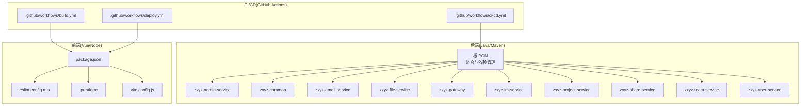
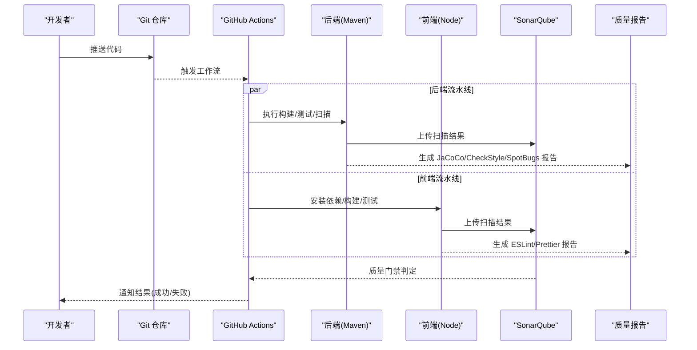
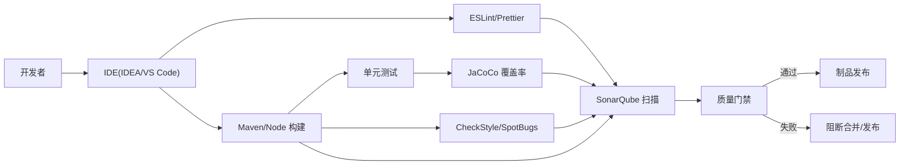

# 代码质量工具

<cite>
**本文引用的文件**   
- [ZXYZdatabaseBack/pom.xml](file://ZXYZdatabaseBack/pom.xml)
- [ZXYZdatabaseBack/zxyz-admin-service/pom.xml](file://ZXYZdatabaseBack/zxyz-admin-service/pom.xml)
- [ZXYZdatabaseBack/zxyz-common/pom.xml](file://ZXYZdatabaseBack/zxyz-common/pom.xml)
- [ZXYZdatabaseBack/zxyz-email-service/pom.xml](file://ZXYZdatabaseBack/zxyz-email-service/pom.xml)
- [ZXYZdatabaseBack/zxyz-file-service/pom.xml](file://ZXYZdatabaseBack/zxyz-file-service/pom.xml)
- [ZXYZdatabaseBack/zxyz-gateway/pom.xml](file://ZXYZdatabaseBack/zxyz-gateway/pom.xml)
- [ZXYZdatabaseBack/zxyz-im-service/pom.xml](file://ZXYZdatabaseBack/zxyz-im-service/pom.xml)
- [ZXYZdatabaseBack/zxyz-project-service/pom.xml](file://ZXYZdatabaseBack/zxyz-project-service/pom.xml)
- [ZXYZdatabaseBack/zxyz-share-service/pom.xml](file://ZXYZdatabaseBack/zxyz-share-service/pom.xml)
- [ZXYZdatabaseBack/zxyz-team-service/pom.xml](file://ZXYZdatabaseBack/zxyz-team-service/pom.xml)
- [ZXYZdatabaseBack/zxyz-user-service/pom.xml](file://ZXYZdatabaseBack/zxyz-user-service/pom.xml)
- [ZXYZdatabaseFront/package.json](file://ZXYZdatabaseFront/package.json)
- [ZXYZdatabaseFront/eslint.config.mjs](file://ZXYZdatabaseFront/eslint.config.mjs)
- [ZXYZdatabaseFront/.prettierrc](file://ZXYZdatabaseFront/.prettierrc)
- [ZXYZdatabaseFront/vite.config.js](file://ZXYZdatabaseFront/vite.config.js)
- [.github/workflows/ci-cd.yml](file://.github/workflows/ci-cd.yml)
- [ZXYZdatabaseFront/.github/workflows/build.yml](file://ZXYZdatabaseFront/.github/workflows/build.yml)
- [ZXYZdatabaseFront/.github/workflows/deploy.yml](file://ZXYZdatabaseFront/.github/workflows/deploy.yml)
</cite>

## 目录
1. [简介](#简介)
2. [项目结构](#项目结构)
3. [核心组件](#核心组件)
4. [架构总览](#架构总览)
5. [详细组件分析](#详细组件分析)
6. [依赖关系分析](#依赖关系分析)
7. [性能考虑](#性能考虑)
8. [故障排查指南](#故障排查指南)
9. [结论](#结论)
10. [附录](#附录)

## 简介
本文件为 ZXYZ 项目的“代码质量工具”配置与使用指南，覆盖后端（Java/Maven）与前端（Vue/Node）两大技术栈。内容涵盖：
- SonarQube 集成与质量门禁（覆盖率、重复率、安全漏洞、技术债务）
- Prettier 格式化（JavaScript/TypeScript/Vue）
- ESLint 检查规则（风格、最佳实践、安全）
- Maven 插件（CheckStyle、SpotBugs、JaCoCo）
- IDE 集成（IntelliJ IDEA、VS Code）
- CI/CD 质量门禁（触发条件、失败策略、报告生成）
- 最佳实践与常见问题解决方案

## 项目结构
ZXYZ 采用微服务架构，后端包含多个 Maven 模块，前端为 Vue 3 SPA。质量工具的配置分布在以下位置：
- 后端根 pom.xml 与各子模块 pom.xml：统一依赖管理与插件配置
- 前端 package.json、eslint.config.mjs、.prettierrc、vite.config.js：JS/TS/Vue 质量与构建相关配置
- GitHub Actions 工作流：自动化质量门禁与发布流程

图表来源
- [ZXYZdatabaseBack/pom.xml](file://ZXYZdatabaseBack/pom.xml)
- [ZXYZdatabaseFront/package.json](file://ZXYZdatabaseFront/package.json)
- [.github/workflows/ci-cd.yml](file://.github/workflows/ci-cd.yml)
- [ZXYZdatabaseFront/.github/workflows/build.yml](file://ZXYZdatabaseFront/.github/workflows/build.yml)
- [ZXYZdatabaseFront/.github/workflows/deploy.yml](file://ZXYZdatabaseFront/.github/workflows/deploy.yml)

章节来源
- [ZXYZdatabaseBack/pom.xml](file://ZXYZdatabaseBack/pom.xml)
- [ZXYZdatabaseFront/package.json](file://ZXYZdatabaseFront/package.json)

## 核心组件
本节聚焦各质量工具在前后端的职责与关键配置点。

- SonarQube（后端+前端）
  - 后端通过 Maven 插件执行扫描并上传结果；前端可通过 npm 脚本或 CI 任务调用 sonar-scanner
  - 质量阈值：覆盖率、重复率、安全漏洞、技术债务等需在 SonarQube 中设置并通过质量门禁
- Prettier（前端）
  - 统一 JS/TS/Vue 代码风格，支持 .prettierrc 与 .prettierignore
- ESLint（前端）
  - 基于 eslint.config.mjs 定义规则集，覆盖风格、最佳实践与安全
- Maven 插件（后端）
  - CheckStyle：代码规范检查
  - SpotBugs：静态分析发现潜在缺陷
  - JaCoCo：单元测试覆盖率统计
- CI/CD（GitHub Actions）
  - 后端 ci-cd.yml 与前端 build/deploy 工作流串联质量门禁与制品发布

章节来源
- [ZXYZdatabaseBack/pom.xml](file://ZXYZdatabaseBack/pom.xml)
- [ZXYZdatabaseFront/package.json](file://ZXYZdatabaseFront/package.json)
- [ZXYZdatabaseFront/eslint.config.mjs](file://ZXYZdatabaseFront/eslint.config.mjs)
- [ZXYZdatabaseFront/.prettierrc](file://ZXYZdatabaseFront/.prettierrc)
- [.github/workflows/ci-cd.yml](file://.github/workflows/ci-cd.yml)
- [ZXYZdatabaseFront/.github/workflows/build.yml](file://ZXYZdatabaseFront/.github/workflows/build.yml)
- [ZXYZdatabaseFront/.github/workflows/deploy.yml](file://ZXYZdatabaseFront/.github/workflows/deploy.yml)

## 架构总览
下图展示从提交到质量门禁的端到端流程，包括前后端并行检查与报告汇总。

图表来源
- [.github/workflows/ci-cd.yml](file://.github/workflows/ci-cd.yml)
- [ZXYZdatabaseFront/.github/workflows/build.yml](file://ZXYZdatabaseFront/.github/workflows/build.yml)
- [ZXYZdatabaseFront/.github/workflows/deploy.yml](file://ZXYZdatabaseFront/.github/workflows/deploy.yml)

## 详细组件分析

### SonarQube 集成（后端 + 前端）
- 目标
  - 统一代码质量度量：覆盖率、重复率、安全漏洞、技术债务
  - 在 CI 中强制质量门禁，不达标则阻断合并/发布
- 后端集成要点
  - 在 Maven 多模块项目中启用 SonarQube 插件，聚合扫描所有模块
  - 结合 JaCoCo 生成覆盖率数据供 SonarQube 消费
  - 建议开启安全规则集与漏洞检测
- 前端集成要点
  - 使用 sonar-scanner 对前端源码进行扫描
  - 将 ESLint/Prettier 的结果与 SonarQube 指标关联
- 质量门禁建议
  - 覆盖率阈值：按模块设定最低覆盖率（例如 ≥80%）
  - 重复率阈值：限制重复块数量与比例
  - 安全漏洞：严重级别以上必须修复
  - 技术债务：控制剩余技术债务时间

章节来源
- [ZXYZdatabaseBack/pom.xml](file://ZXYZdatabaseBack/pom.xml)
- [ZXYZdatabaseFront/package.json](file://ZXYZdatabaseFront/package.json)
- [.github/workflows/ci-cd.yml](file://.github/workflows/ci-cd.yml)

### Prettier 格式化（前端）
- 目标
  - 统一 JavaScript/TypeScript/Vue 代码风格，减少审查成本
- 配置要点
  - 使用 .prettierrc 定义全局规则（缩进、引号、分号、行宽等）
  - 通过 .prettierignore 排除不需要格式化的文件
  - 在编辑器中启用保存时自动格式化
- Vue 组件格式化
  - 确保模板、脚本、样式均被正确格式化
  - 与 ESLint 规则保持一致，避免冲突

章节来源
- [ZXYZdatabaseFront/.prettierrc](file://ZXYZdatabaseFront/.prettierrc)
- [ZXYZdatabaseFront/package.json](file://ZXYZdatabaseFront/package.json)

### ESLint 检查规则（前端）
- 目标
  - 代码风格检查、最佳实践验证、安全规则配置
- 配置要点
  - 使用 eslint.config.mjs 组织规则集（推荐模块化配置）
  - 启用 Vue 与 TypeScript 相关规则
  - 针对安全敏感 API 添加额外校验
- 与 Prettier 协作
  - 关闭与 Prettier 冲突的规则，保持格式化一致性

章节来源
- [ZXYZdatabaseFront/eslint.config.mjs](file://ZXYZdatabaseFront/eslint.config.mjs)
- [ZXYZdatabaseFront/package.json](file://ZXYZdatabaseFront/package.json)

### Maven 插件配置（后端）
- 目标
  - 通过 CheckStyle、SpotBugs、JaCoCo 提升代码质量与可维护性
- CheckStyle
  - 定义编码规范，检查命名、注释、复杂度等
- SpotBugs
  - 静态分析潜在缺陷（空指针、资源泄漏等）
- JaCoCo
  - 统计单元测试覆盖率，输出 HTML/XML 报告
- 多模块聚合
  - 在根 POM 中统一管理插件版本与聚合配置

章节来源
- [ZXYZdatabaseBack/pom.xml](file://ZXYZdatabaseBack/pom.xml)
- [ZXYZdatabaseBack/zxyz-common/pom.xml](file://ZXYZdatabaseBack/zxyz-common/pom.xml)
- [ZXYZdatabaseBack/zxyz-admin-service/pom.xml](file://ZXYZdatabaseBack/zxyz-admin-service/pom.xml)
- [ZXYZdatabaseBack/zxyz-email-service/pom.xml](file://ZXYZdatabaseBack/zxyz-email-service/pom.xml)
- [ZXYZdatabaseBack/zxyz-file-service/pom.xml](file://ZXYZdatabaseBack/zxyz-file-service/pom.xml)
- [ZXYZdatabaseBack/zxyz-gateway/pom.xml](file://ZXYZdatabaseBack/zxyz-gateway/pom.xml)
- [ZXYZdatabaseBack/zxyz-im-service/pom.xml](file://ZXYZdatabaseBack/zxyz-im-service/pom.xml)
- [ZXYZdatabaseBack/zxyz-project-service/pom.xml](file://ZXYZdatabaseBack/zxyz-project-service/pom.xml)
- [ZXYZdatabaseBack/zxyz-share-service/pom.xml](file://ZXYZdatabaseBack/zxyz-share-service/pom.xml)
- [ZXYZdatabaseBack/zxyz-team-service/pom.xml](file://ZXYZdatabaseBack/zxyz-team-service/pom.xml)
- [ZXYZdatabaseBack/zxyz-user-service/pom.xml](file://ZXYZdatabaseBack/zxyz-user-service/pom.xml)

### IDE 集成配置
- IntelliJ IDEA
  - 启用内置 ESLint 与 Prettier 支持
  - 导入 Maven 插件配置，运行 CheckStyle/SpotBugs/JaCoCo
  - 配置保存时自动格式化与检查
- VS Code
  - 推荐扩展：ESLint、Prettier、Vue Language Features、Maven Extension Pack
  - 通过 settings.json 同步编辑器行为（保存即格式化、错误提示）
- 配置同步
  - 使用 EditorConfig 与共享配置文件保证团队一致

章节来源
- [ZXYZdatabaseFront/package.json](file://ZXYZdatabaseFront/package.json)
- [ZXYZdatabaseFront/eslint.config.mjs](file://ZXYZdatabaseFront/eslint.config.mjs)
- [ZXYZdatabaseFront/.prettierrc](file://ZXYZdatabaseFront/.prettierrc)
- [ZXYZdatabaseBack/pom.xml](file://ZXYZdatabaseBack/pom.xml)

### CI/CD 中的质量门禁
- 触发条件
  - 推送分支、创建/更新 Pull Request 时触发
  - 路径过滤：仅对变更模块执行构建与检查
- 失败处理策略
  - 任一质量检查失败则中断流水线
  - 提供清晰错误信息与报告下载链接
- 报告生成
  - 后端：JaCoCo、CheckStyle、SpotBugs 报告
  - 前端：ESLint、Prettier 报告
  - SonarQube：质量门禁状态与趋势图

章节来源
- [.github/workflows/ci-cd.yml](file://.github/workflows/ci-cd.yml)
- [ZXYZdatabaseFront/.github/workflows/build.yml](file://ZXYZdatabaseFront/.github/workflows/build.yml)
- [ZXYZdatabaseFront/.github/workflows/deploy.yml](file://ZXYZdatabaseFront/.github/workflows/deploy.yml)

## 依赖关系分析
下图展示质量工具之间的依赖与协作关系。

图表来源
- [ZXYZdatabaseBack/pom.xml](file://ZXYZdatabaseBack/pom.xml)
- [ZXYZdatabaseFront/package.json](file://ZXYZdatabaseFront/package.json)
- [.github/workflows/ci-cd.yml](file://.github/workflows/ci-cd.yml)

章节来源
- [ZXYZdatabaseBack/pom.xml](file://ZXYZdatabaseBack/pom.xml)
- [ZXYZdatabaseFront/package.json](file://ZXYZdatabaseFront/package.json)
- [.github/workflows/ci-cd.yml](file://.github/workflows/ci-cd.yml)

## 性能考虑
- 并行执行：在 CI 中并行运行前后端流水线，缩短整体耗时
- 增量扫描：利用路径过滤仅对变更模块执行检查
- 缓存依赖：缓存 Node 与 Maven 依赖，加速构建
- 报告优化：按需生成报告，避免过大产物影响传输

[本节为通用指导，无需引用具体文件]

## 故障排查指南
- 覆盖率不足
  - 检查单元测试是否覆盖关键路径
  - 确认 JaCoCo 插件已正确集成并生成报告
- 重复代码过多
  - 重构公共逻辑，提取方法或类
  - 调整 SonarQube 重复率阈值
- 安全漏洞告警
  - 升级依赖库至安全版本
  - 禁用不安全的 API 或增加输入校验
- ESLint/Prettier 冲突
  - 关闭与 Prettier 冲突的 ESLint 规则
  - 统一编辑器配置
- CI 失败
  - 查看流水线日志定位失败步骤
  - 本地复现问题并修复

章节来源
- [ZXYZdatabaseBack/pom.xml](file://ZXYZdatabaseBack/pom.xml)
- [ZXYZdatabaseFront/package.json](file://ZXYZdatabaseFront/package.json)
- [ZXYZdatabaseFront/eslint.config.mjs](file://ZXYZdatabaseFront/eslint.config.mjs)
- [ZXYZdatabaseFront/.prettierrc](file://ZXYZdatabaseFront/.prettierrc)
- [.github/workflows/ci-cd.yml](file://.github/workflows/ci-cd.yml)

## 结论
通过统一的 SonarQube 质量门禁、Prettier 格式化、ESLint 检查以及 Maven 插件（CheckStyle、SpotBugs、JaCoCo），ZXYZ 项目在前后端实现了全面的代码质量控制。配合 CI/CD 自动化流程，可有效降低缺陷引入风险，提升团队协作效率与代码可维护性。

[本节为总结，无需引用具体文件]

## 附录
- 最佳实践清单
  - 在 PR 阶段强制执行质量门禁
  - 定期回顾质量报告并制定改进计划
  - 保持工具链版本稳定，避免频繁升级带来不稳定
- 常见问题速查
  - 覆盖率未上报：检查 JaCoCo 插件与 SonarQube 集成
  - 前端扫描失败：确认 sonar-scanner 配置与环境变量
  - 规则冲突：优先以 Prettier 为准，关闭冲突 ESLint 规则

[本节为补充信息，无需引用具体文件]