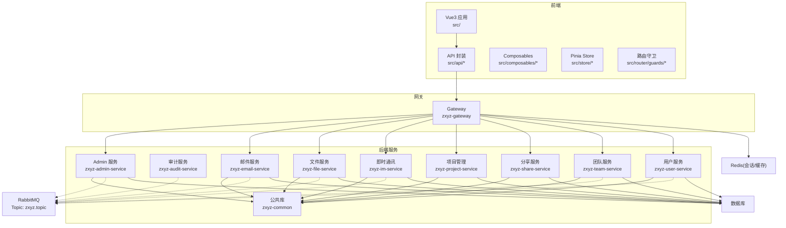
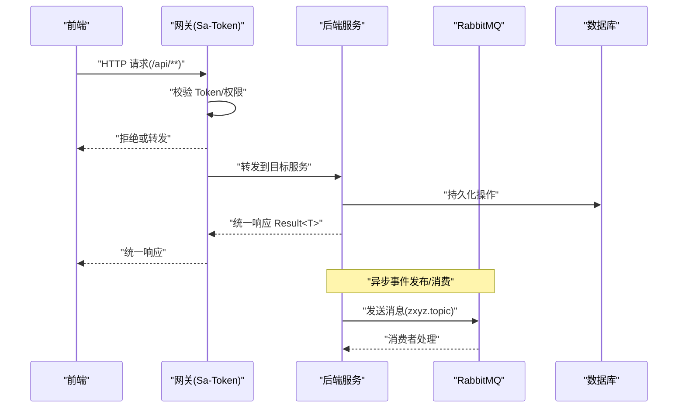
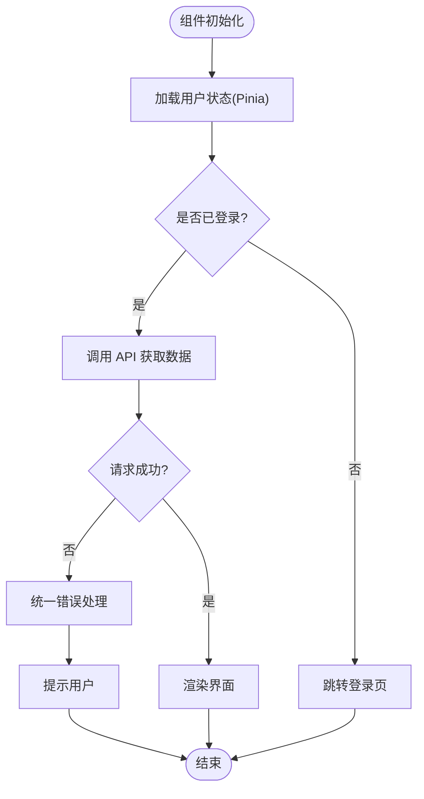
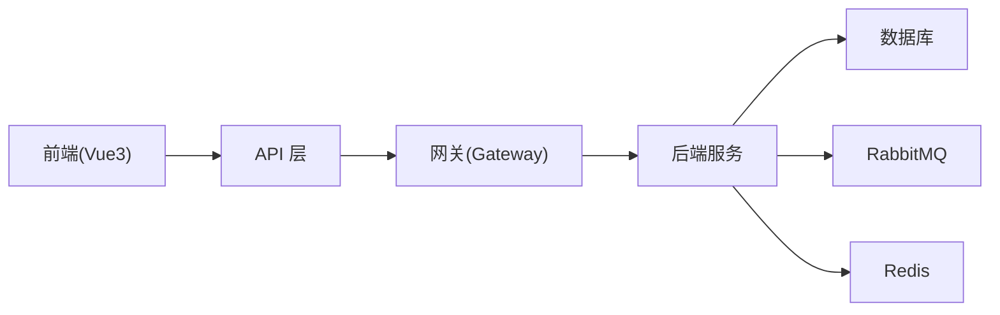

# 编码规范

<cite>
**本文引用的文件**   
- [ZXYZdatabaseBack/pom.xml](file://ZXYZdatabaseBack/pom.xml)
- [ZXYZdatabaseBack/zxyz-common/src/main/java/uno/acloud/common/web/Result.java](file://ZXYZdatabaseBack/zxyz-common/src/main/java/uno/acloud/common/web/Result.java)
- [ZXYZdatabaseBack/zxyz-common/src/main/java/uno/acloud/exception/BusinessException.java](file://ZXYZdatabaseBack/zxyz-common/src/main/java/uno/acloud/exception/BusinessException.java)
- [ZXYZdatabaseBack/zxyz-common/src/main/java/uno/acloud/client/AbstractServiceClient.java](file://ZXYZdatabaseBack/zxyz-common/src/main/java/uno/acloud/client/AbstractServiceClient.java)
- [ZXYZdatabaseBack/zxyz-admin-service/src/main/java/uno/acloud/admin/config/SaTokenConfigure.java](file://ZXYZdatabaseBack/zxyz-admin-service/src/main/java/uno/acloud/admin/config/SaTokenConfigure.java)
- [ZXYZdatabaseBack/zxyz-gateway/src/main/java/uno/acloud/gateway/filter/SaTokenFilterConfig.java](file://ZXYZdatabaseBack/zxyz-gateway/src/main/java/uno/acloud/gateway/filter/SaTokenFilterConfig.java)
- [ZXYZdatabaseBack/zxyz-audit-service/src/main/java/uno/acloud/audit/config/RabbitMqConfig.java](file://ZXYZdatabaseBack/zxyz-audit-service/src/main/java/uno/acloud/audit/config/RabbitMqConfig.java)
- [ZXYZdatabaseBack/zxyz-audit-service/src/main/java/uno/acloud/audit/mq/OperateLogConsumer.java](file://ZXYZdatabaseBack/zxyz-audit-service/src/main/java/uno/acloud/audit/mq/OperateLogConsumer.java)
- [ZXYZdatabaseBack/zxyz-email-service/src/main/java/uno/acloud/email/application/EmailDispatchService.java](file://ZXYZdatabaseBack/zxyz-email-service/src/main/java/uno/acloud/email/application/EmailDispatchService.java)
- [ZXYZdatabaseBack/zxyz-file-service/src/main/java/uno/acloud/file/service/FileService.java](file://ZXYZdatabaseBack/zxyz-file-service/src/main/java/uno/acloud/file/service/FileService.java)
- [ZXYZdatabaseBack/zxyz-im-service/src/main/java/uno/acloud/im/application/MessageApplicationService.java](file://ZXYZdatabaseBack/zxyz-im-service/src/main/java/uno/acloud/im/application/MessageApplicationService.java)
- [ZXYZdatabaseBack/zxyz-project-service/src/main/java/uno/acloud/project/controller/ProjectController.java](file://ZXYZdatabaseBack/zxyz-project-service/src/main/java/uno/acloud/project/controller/ProjectController.java)
- [ZXYZdatabaseBack/zxyz-team-service/src/main/java/uno/acloud/team/service/TeamService.java](file://ZXYZdatabaseBack/zxyz-team-service/src/main/java/uno/acloud/team/service/TeamService.java)
- [ZXYZdatabaseBack/zxyz-user-service/src/main/java/uno/acloud/user/service/UserService.java](file://ZXYZdatabaseBack/zxyz-user-service/src/main/java/uno/acloud/user/service/UserService.java)
- [ZXYZdatabaseFront/package.json](file://ZXYZdatabaseFront/package.json)
- [ZXYZdatabaseFront/eslint.config.mjs](file://ZXYZdatabaseFront/eslint.config.mjs)
- [ZXYZdatabaseFront/.prettierrc](file://ZXYZdatabaseFront/.prettierrc)
- [ZXYZdatabaseFront/commitlint.config.js](file://ZXYZdatabaseFront/commitlint.config.js)
- [ZXYZdatabaseFront/vite.config.js](file://ZXYZdatabaseFront/vite.config.js)
- [ZXYZdatabaseFront/src/api/auth.js](file://ZXYZdatabaseFront/src/api/auth.js)
- [ZXYZdatabaseFront/src/utils/request.js](file://ZXYZdatabaseFront/src/utils/request.js)
- [ZXYZdatabaseFront/src/composables/useLoginForm.js](file://ZXYZdatabaseFront/src/composables/useLoginForm.js)
- [ZXYZdatabaseFront/src/store/currentUser.js](file://ZXYZdatabaseFront/src/store/currentUser.js)
- [ZXYZdatabaseFront/src/router/guards/permission.js](file://ZXYZdatabaseFront/src/router/guards/permission.js)
- [ZXYZdatabaseFront/src/utils/logger.js](file://ZXYZdatabaseFront/src/utils/logger.js)
- [.github/workflows/ci-cd.yml](file://.github/workflows/ci-cd.yml)
- [docker-compose.yml](file://docker-compose.yml)
</cite>

## 目录
1. [引言](#引言)
2. [项目结构](#项目结构)
3. [核心组件](#核心组件)
4. [架构总览](#架构总览)
5. [详细组件分析](#详细组件分析)
6. [依赖分析](#依赖分析)
7. [性能考虑](#性能考虑)
8. [故障排查指南](#故障排查指南)
9. [结论](#结论)
10. [附录](#附录)

## 引言
本规范面向 ZXYZ 项目的后端（Java/Spring）与前端（Vue 3）团队，统一代码风格、架构约定、质量门禁与发布流程。目标：
- 统一命名、注释、异常与日志规范，提升可读性与可维护性
- 明确前后端交互契约与状态管理模式，降低沟通成本
- 固化 Git 提交与分支策略，保障协作效率
- 通过 SonarQube、Prettier、ESLint 等工具实现自动化质量检查
- 提供重构建议与性能优化最佳实践，并集成 CI/CD 流水线

## 项目结构
ZXYZ 采用微服务架构，包含 11 个 Maven 模块与一个 Vue 前端工程。后端服务间同步调用使用 ServiceClient + 内部鉴权令牌，异步通信基于 RabbitMQ Topic Exchange；前端使用 Composition API + Pinia + Element Plus。

图示来源 
- [ZXYZdatabaseBack/pom.xml](file://ZXYZdatabaseBack/pom.xml)
- [ZXYZdatabaseFront/package.json](file://ZXYZdatabaseFront/package.json)

章节来源
- [ZXYZdatabaseBack/pom.xml](file://ZXYZdatabaseBack/pom.xml)
- [ZXYZdatabaseFront/package.json](file://ZXYZdatabaseFront/package.json)

## 核心组件
- 统一响应体 Result<T>：所有接口返回统一结构，code=1 表示成功，便于前端统一处理。
- 业务异常 BusinessException：用于抛出领域错误，配合全局异常处理器转换为统一响应。
- 服务客户端 AbstractServiceClient：封装内部服务调用的通用逻辑（如鉴权头、重试、解析）。
- Sa-Token 配置：在 Admin 服务与 Gateway 中启用认证过滤，确保内部端点不被公网访问。
- RabbitMQ 配置与消费者：审计与事件驱动场景使用 Topic Exchange 进行解耦。

章节来源
- [ZXYZdatabaseBack/zxyz-common/src/main/java/uno/acloud/common/web/Result.java](file://ZXYZdatabaseBack/zxyz-common/src/main/java/uno/acloud/common/web/Result.java)
- [ZXYZdatabaseBack/zxyz-common/src/main/java/uno/acloud/exception/BusinessException.java](file://ZXYZdatabaseBack/zxyz-common/src/main/java/uno/acloud/exception/BusinessException.java)
- [ZXYZdatabaseBack/zxyz-common/src/main/java/uno/acloud/client/AbstractServiceClient.java](file://ZXYZdatabaseBack/zxyz-common/src/main/java/uno/acloud/client/AbstractServiceClient.java)
- [ZXYZdatabaseBack/zxyz-admin-service/src/main/java/uno/acloud/admin/config/SaTokenConfigure.java](file://ZXYZdatabaseBack/zxyz-admin-service/src/main/java/uno/acloud/admin/config/SaTokenConfigure.java)
- [ZXYZdatabaseBack/zxyz-gateway/src/main/java/uno/acloud/gateway/filter/SaTokenFilterConfig.java](file://ZXYZdatabaseBack/zxyz-gateway/src/main/java/uno/acloud/gateway/filter/SaTokenFilterConfig.java)
- [ZXYZdatabaseBack/zxyz-audit-service/src/main/java/uno/acloud/audit/config/RabbitMqConfig.java](file://ZXYZdatabaseBack/zxyz-audit-service/src/main/java/uno/acloud/audit/config/RabbitMqConfig.java)
- [ZXYZdatabaseBack/zxyz-audit-service/src/main/java/uno/acloud/audit/mq/OperateLogConsumer.java](file://ZXYZdatabaseBack/zxyz-audit-service/src/main/java/uno/acloud/audit/mq/OperateLogConsumer.java)

## 架构总览
- 分层模式
  - DDD 风格：im-service、email-service 采用 interfaces → application → domain → infrastructure。
  - 传统分层：其余服务采用 controller → service/impl → mapper → entity。
- 服务间通信
  - 同步：ServiceClient + X-Internal-Service-Token 鉴权，内部端点 /api/internal/** 被 Gateway 拒绝公网访问。
  - 异步：RabbitMQ Topic Exchange zxyz.topic，用于审计日志与跨服务事件。
- 前端架构
  - Vue 3 Composition API + <script setup>，Element Plus auto-import，Pinia 管理状态，composables 封装业务逻辑。
  - 认证依赖 HttpOnly Cookie（Sa-Token UUID token + Redis session），API 响应统一 Result<T>。

图示来源 
- [ZXYZdatabaseBack/zxyz-gateway/src/main/java/uno/acloud/gateway/filter/SaTokenFilterConfig.java](file://ZXYZdatabaseBack/zxyz-gateway/src/main/java/uno/acloud/gateway/filter/SaTokenFilterConfig.java)
- [ZXYZdatabaseBack/zxyz-audit-service/src/main/java/uno/acloud/audit/config/RabbitMqConfig.java](file://ZXYZdatabaseBack/zxyz-audit-service/src/main/java/uno/acloud/audit/config/RabbitMqConfig.java)
- [ZXYZdatabaseBack/zxyz-audit-service/src/main/java/uno/acloud/audit/mq/OperateLogConsumer.java](file://ZXYZdatabaseBack/zxyz-audit-service/src/main/java/uno/acloud/audit/mq/OperateLogConsumer.java)

## 详细组件分析

### Java 编码规范
- 包命名约定
  - 根包：uno.acloud
  - 子包按服务划分：admin、audit、email、file、im、project、share、team、user
  - 公共能力放在 zxyz-common，避免循环依赖
- 类与方法命名规则
  - Controller：以业务域命名，动词+名词，如 ProjectController
  - Service：职责单一，方法名体现动作，如 sendMail、uploadFile
  - DTO/VO：清晰区分输入输出，VO 仅暴露必要字段
  - Mapper/Repository：遵循 MyBatis/JPA 命名惯例
- 注释规范
  - 类级 Javadoc 说明职责与边界
  - 方法级 Javadoc 描述参数、返回值、异常
  - 复杂逻辑行内注释解释“为什么”，而非“做什么”
- 异常处理模式
  - 使用 BusinessException 表达业务错误
  - 全局异常处理器将异常映射为 Result<T>
  - 禁止吞异常，必须记录上下文并向上抛出
- 日志记录标准
  - 使用结构化日志，包含 traceId、userId、service、action
  - 敏感信息脱敏（手机号、邮箱、密码）
  - 合理日志级别：ERROR 仅记录不可恢复错误，WARN 记录潜在问题

章节来源
- [ZXYZdatabaseBack/zxyz-common/src/main/java/uno/acloud/common/web/Result.java](file://ZXYZdatabaseBack/zxyz-common/src/main/java/uno/acloud/common/web/Result.java)
- [ZXYZdatabaseBack/zxyz-common/src/main/java/uno/acloud/exception/BusinessException.java](file://ZXYZdatabaseBack/zxyz-common/src/main/java/uno/acloud/exception/BusinessException.java)
- [ZXYZdatabaseBack/zxyz-common/src/main/java/uno/acloud/client/AbstractServiceClient.java](file://ZXYZdatabaseBack/zxyz-common/src/main/java/uno/acloud/client/AbstractServiceClient.java)
- [ZXYZdatabaseBack/zxyz-admin-service/src/main/java/uno/acloud/admin/config/SaTokenConfigure.java](file://ZXYZdatabaseBack/zxyz-admin-service/src/main/java/uno/acloud/admin/config/SaTokenConfigure.java)
- [ZXYZdatabaseBack/zxyz-gateway/src/main/java/uno/acloud/gateway/filter/SaTokenFilterConfig.java](file://ZXYZdatabaseBack/zxyz-gateway/src/main/java/uno/acloud/gateway/filter/SaTokenFilterConfig.java)

### Vue 3 前端编码规范
- Composition API 使用规范
  - 优先使用 <script setup> 语法糖
  - 逻辑复用通过 composables 封装，如 useLoginForm、useFileUpload
  - 响应式数据最小化暴露，避免污染全局
- 组件设计原则
  - 单一职责，props/emit 明确定义
  - 样式隔离，优先 scoped 或 CSS Modules
  - 图标与静态资源统一管理
- 状态管理模式
  - 使用 Pinia 管理全局状态，如 currentUser、team、chat
  - 状态变更集中，避免分散修改
- API 调用封装
  - 统一 request.js 封装 axios，处理拦截器、错误码、重试
  - api/* 按模块拆分，保持高内聚
  - 认证依赖 HttpOnly Cookie，无需手动携带 token

图示来源 
- [ZXYZdatabaseFront/src/utils/request.js](file://ZXYZdatabaseFront/src/utils/request.js)
- [ZXYZdatabaseFront/src/store/currentUser.js](file://ZXYZdatabaseFront/src/store/currentUser.js)
- [ZXYZdatabaseFront/src/composables/useLoginForm.js](file://ZXYZdatabaseFront/src/composables/useLoginForm.js)

章节来源
- [ZXYZdatabaseFront/src/api/auth.js](file://ZXYZdatabaseFront/src/api/auth.js)
- [ZXYZdatabaseFront/src/utils/request.js](file://ZXYZdatabaseFront/src/utils/request.js)
- [ZXYZdatabaseFront/src/composables/useLoginForm.js](file://ZXYZdatabaseFront/src/composables/useLoginForm.js)
- [ZXYZdatabaseFront/src/store/currentUser.js](file://ZXYZdatabaseFront/src/store/currentUser.js)
- [ZXYZdatabaseFront/src/router/guards/permission.js](file://ZXYZdatabaseFront/src/router/guards/permission.js)

### Git 提交规范
- Commitlint 配置
  - 类型限定：feat、fix、docs、style、refactor、test、chore
  - 作用域可选：模块名或功能域
  - 描述简洁明了，动词开头
- 分支管理策略
  - main：生产分支，受保护
  - develop：开发主干
  - feature/*：功能分支
  - hotfix/*：紧急修复
- 代码审查流程
  - PR 必须通过 CI 检查（构建、测试、格式化）
  - 至少一名 reviewer 批准
  - 合并前解决所有评论

章节来源
- [ZXYZdatabaseFront/commitlint.config.js](file://ZXYZdatabaseFront/commitlint.config.js)

### 代码质量工具配置
- SonarQube 规则
  - 开启重复代码检测、复杂度阈值、安全漏洞扫描
  - 质量门禁：覆盖率 > 80%，无 blocker 问题
- Prettier 格式化
  - 统一缩进、引号、分号、换行
  - 与 IDE 集成，保存时自动格式化
- ESLint 检查规则
  - 启用 Vue 3 推荐规则集
  - 自定义规则：禁止 console.log、强制类型注解
  - 与 Prettier 冲突规则关闭

章节来源
- [ZXYZdatabaseFront/eslint.config.mjs](file://ZXYZdatabaseFront/eslint.config.mjs)
- [ZXYZdatabaseFront/.prettierrc](file://ZXYZdatabaseFront/.prettierrc)

### 自动化代码检查和格式化的 CI/CD 集成
- GitHub Actions 工作流
  - 路径过滤：仅构建变更模块
  - 步骤：安装依赖、单元测试、构建镜像、推送 GHCR
  - 失败即阻断合并
- Docker Compose 编排
  - 本地一键启动：基础设施 + 服务 + 前端
  - 环境变量注入：Nacos、Jasypt 加密配置

章节来源
- [.github/workflows/ci-cd.yml](file://.github/workflows/ci-cd.yml)
- [docker-compose.yml](file://docker-compose.yml)

## 依赖分析
- 后端依赖
  - Spring Boot 微服务，MyBatis/JPA 数据访问
  - Nacos 配置中心与服务注册
  - RabbitMQ 异步通信
  - Redis 会话与缓存
- 前端依赖
  - Vue 3.5 + Vite
  - Element Plus UI 库
  - Pinia 状态管理
  - Axios HTTP 客户端

图示来源 
- [ZXYZdatabaseBack/pom.xml](file://ZXYZdatabaseBack/pom.xml)
- [ZXYZdatabaseFront/package.json](file://ZXYZdatabaseFront/package.json)

章节来源
- [ZXYZdatabaseBack/pom.xml](file://ZXYZdatabaseBack/pom.xml)
- [ZXYZdatabaseFront/package.json](file://ZXYZdatabaseFront/package.json)

## 性能考虑
- 后端
  - 数据库：索引优化、分页查询、连接池调优
  - 缓存：热点数据 Redis 缓存，避免穿透击穿
  - 异步：耗时操作消息队列削峰
  - GC：调整 JVM 参数，监控堆内存
- 前端
  - 懒加载：路由与组件按需加载
  - 虚拟滚动：长列表优化
  - 图片压缩：WebP 格式，CDN 加速
  - 防抖节流：搜索与滚动事件

## 故障排查指南
- 常见问题
  - 认证失败：检查 Sa-Token 配置与 Cookie 设置
  - 服务调用超时：查看网关日志与服务健康状态
  - 消息堆积：监控 RabbitMQ 队列长度与消费者速率
  - 前端白屏：检查浏览器控制台错误与网络请求
- 调试技巧
  - 启用详细日志：traceId 追踪请求链路
  - 本地复现：Docker Compose 快速搭建环境
  - 单元测试：覆盖边界条件与异常路径

章节来源
- [ZXYZdatabaseBack/zxyz-gateway/src/main/java/uno/acloud/gateway/filter/SaTokenFilterConfig.java](file://ZXYZdatabaseBack/zxyz-gateway/src/main/java/uno/acloud/gateway/filter/SaTokenFilterConfig.java)
- [ZXYZdatabaseBack/zxyz-audit-service/src/main/java/uno/acloud/audit/mq/OperateLogConsumer.java](file://ZXYZdatabaseBack/zxyz-audit-service/src/main/java/uno/acloud/audit/mq/OperateLogConsumer.java)
- [ZXYZdatabaseFront/src/utils/logger.js](file://ZXYZdatabaseFront/src/utils/logger.js)

## 结论
本规范为 ZXYZ 项目提供了从后端到前端的完整编码标准，涵盖命名、注释、异常、日志、Git 流程、质量工具与 CI/CD 集成。通过统一约定与自动化检查，显著提升代码质量与团队协作效率。建议定期回顾与更新规范，适应技术演进与业务需求变化。

## 附录
- 参考文档
  - 架构设计：docs/architecture.md
  - API 契约：docs/api-contract.md
  - 部署指南：DEPLOYMENT.md
- 工具链
  - SonarQube：代码质量平台
  - Prettier：代码格式化
  - ESLint：代码检查
  - GitHub Actions：CI/CD 流水线