# 调试技巧

<cite>
**本文引用的文件**   
- [docker-compose.dev.yml](file://docker-compose.dev.yml)
- [docker-compose.yml](file://docker-compose.yml)
- [CI/CD工作流](file://./.github/workflows/ci-cd.yml)
- [前端Vite配置](file://ZXYZdatabaseFront/vite.config.js)
- [前端包管理](file://ZXYZdatabaseFront/package.json)
- [后端根POM](file://ZXYZdatabaseBack/pom.xml)
- [网关应用入口](file://ZXYZdatabaseBack/zxyz-gateway/src/main/java/uno/acloud/gateway/ZxyzGatewayApplication.java)
- [网关过滤器集合](file://ZXYZdatabaseBack/zxyz-gateway/src/main/java/uno/acloud/gateway/filter/)
- [审计服务RabbitMQ配置](file://ZXYZdatabaseBack/zxyz-audit-service/src/main/java/uno/acloud/audit/config/RabbitMqConfig.java)
- [审计消费者](file://ZXYZdatabaseBack/zxyz-audit-service/src/main/java/uno/acloud/audit/mq/OperateLogConsumer.java)
- [Nacos动态配置示例](file://nacos-config/zxyz-dynamic.yml)
- [健康检查脚本](file://scripts/health-check.sh)
- [部署脚本](file://scripts/deploy-fast.sh)
- [Promtail配置](file://deploy/promtail-config.yml)
- [Nginx默认配置](file://deploy/nginx/default.conf)
- [数据库初始化脚本](file://sql/00-init-zxyz.sh)
</cite>

## 目录
1. [简介](#简介)
2. [项目结构](#项目结构)
3. [核心组件](#核心组件)
4. [架构总览](#架构总览)
5. [详细组件分析](#详细组件分析)
6. [依赖关系分析](#依赖关系分析)
7. [性能考虑](#性能考虑)
8. [故障排查指南](#故障排查指南)
9. [结论](#结论)
10. [附录](#附录)

## 简介
本指南面向ZXYZ项目的开发与运维人员，提供从本地到生产环境的系统化调试方法。内容覆盖：
- 本地调试：Spring Boot热重载、Vue开发服务器、断点与远程调试
- 日志体系：Logback配置、结构化日志、级别管理与收集分析
- 性能分析：JVM监控、内存泄漏检测、SQL优化、前端性能分析
- 常见问题：网络、连接池、Redis缓存、消息队列消费
- 监控告警：健康检查、指标采集、错误追踪、基准测试
- 工具推荐：IDE插件、浏览器与命令行工具

## 项目结构
ZXYZ采用微服务架构（11个Maven模块）+ Vue前端，使用Docker Compose编排容器化环境，Nacos集中配置，RabbitMQ异步通信，Gateway统一鉴权。

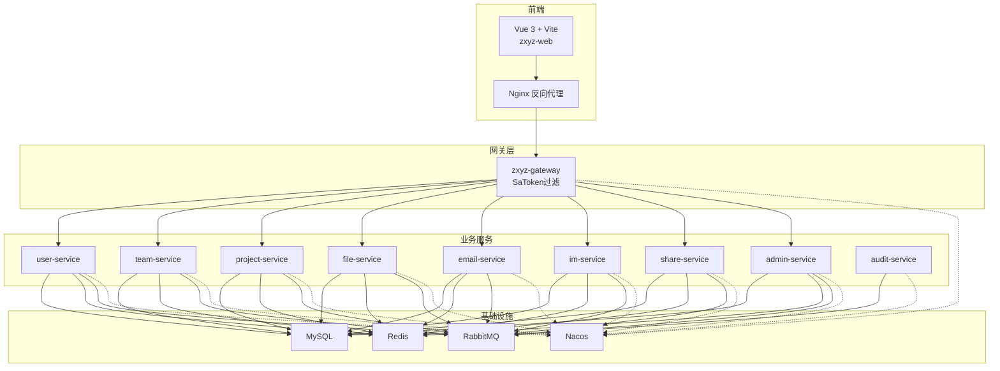

**图表来源**
- [docker-compose.yml](file://docker-compose.yml)
- [docker-compose.dev.yml](file://docker-compose.dev.yml)
- [网关应用入口](file://ZXYZdatabaseBack/zxyz-gateway/src/main/java/uno/acloud/gateway/ZxyzGatewayApplication.java)
- [网关过滤器集合](file://ZXYZdatabaseBack/zxyz-gateway/src/main/java/uno/acloud/gateway/filter/)

**章节来源**
- [docker-compose.yml](file://docker-compose.yml)
- [docker-compose.dev.yml](file://docker-compose.dev.yml)

## 核心组件
- 网关（zxyz-gateway）：统一鉴权、路由转发、内部端点保护
- 业务服务：用户、团队、项目、文件、邮件、IM、分享、管理、审计等
- 基础设施：MySQL、Redis、RabbitMQ、Nacos
- 前端：Vue 3 + Vite，Element Plus，Pinia，Composables

关键特性：
- 服务间调用：ServiceClient + X-Internal-Service-Token
- 异步通信：RabbitMQ Topic Exchange zxyz.topic
- 配置中心：Nacos + Jasypt加密敏感项
- 认证：Sa-Token UUID Token + Redis Session（HttpOnly Cookie）

**章节来源**
- [后端根POM](file://ZXYZdatabaseBack/pom.xml)
- [网关应用入口](file://ZXYZdatabaseBack/zxyz-gateway/src/main/java/uno/acloud/gateway/ZxyzGatewayApplication.java)
- [网关过滤器集合](file://ZXYZdatabaseBack/zxyz-gateway/src/main/java/uno/acloud/gateway/filter/)
- [审计服务RabbitMQ配置](file://ZXYZdatabaseBack/zxyz-audit-service/src/main/java/uno/acloud/audit/config/RabbitMqConfig.java)
- [Nacos动态配置示例](file://nacos-config/zxyz-dynamic.yml)

## 架构总览
下图展示请求从前端到后端服务的典型路径，以及网关的鉴权与内部端点保护机制。

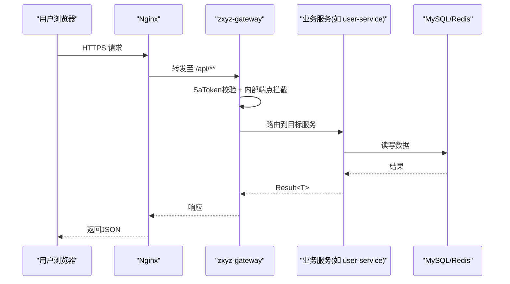

**图表来源**
- [网关应用入口](file://ZXYZdatabaseBack/zxyz-gateway/src/main/java/uno/acloud/gateway/ZxyzGatewayApplication.java)
- [网关过滤器集合](file://ZXYZdatabaseBack/zxyz-gateway/src/main/java/uno/acloud/gateway/filter/)
- [Nginx默认配置](file://deploy/nginx/default.conf)

## 详细组件分析

### 本地调试：Spring Boot热重载与断点
- 启用DevTools：在对应服务的application-dev.yml中开启spring.devtools相关属性
- IDEA运行配置：勾选“自动编译”和“立即启动”，设置JVM参数以支持热重载
- 断点调试：在Controller、Service、Mapper处设置断点，配合Postman或浏览器发起请求
- 远程调试：通过-Ddebug=5005等参数暴露端口，IDE远程附加

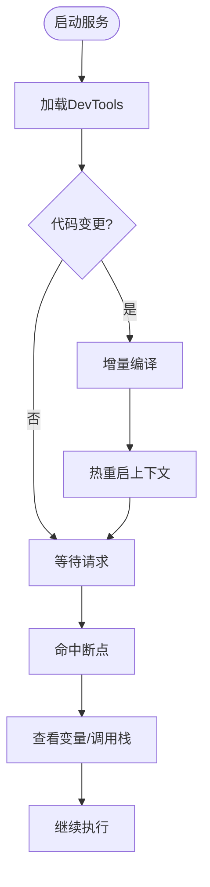

**图表来源**
- [后端根POM](file://ZXYZdatabaseBack/pom.xml)

**章节来源**
- [后端根POM](file://ZXYZdatabaseBack/pom.xml)

### 本地调试：Vue开发服务器与断点
- 启动命令：npm run dev，监听localhost:5173
- 热更新：修改.vue/.js文件即时刷新
- 断点调试：Chrome DevTools Sources面板设置断点，Network面板查看API请求
- Mock数据：在vite.config.js中配置proxy或mock接口

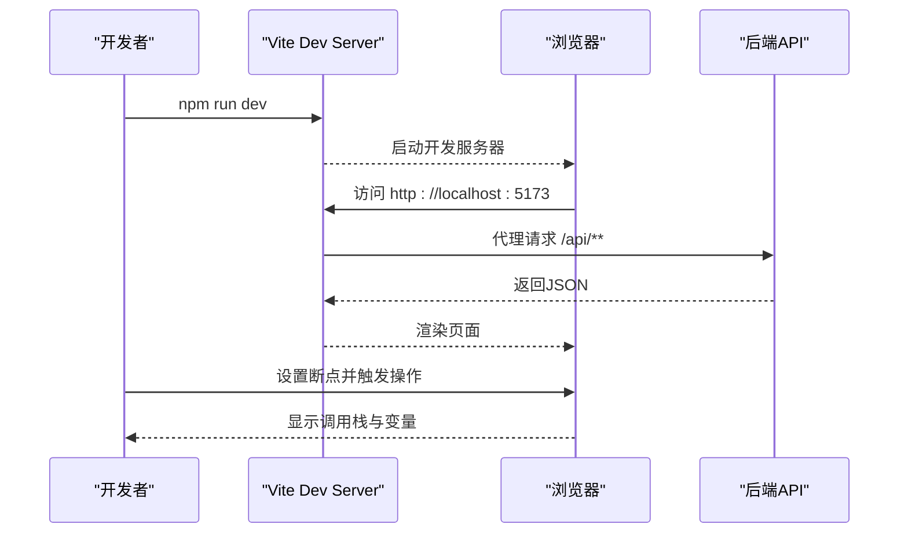

**图表来源**
- [前端Vite配置](file://ZXYZdatabaseFront/vite.config.js)
- [前端包管理](file://ZXYZdatabaseFront/package.json)

**章节来源**
- [前端Vite配置](file://ZXYZdatabaseFront/vite.config.js)
- [前端包管理](file://ZXYZdatabaseFront/package.json)

### 日志体系：Logback配置与结构化日志
- 日志框架：Spring Boot默认集成Logback
- 配置文件：logback-spring.xml，按模块划分日志级别
- 结构化日志：使用JSON格式输出，便于ELK收集
- 级别管理：dev环境DEBUG，prod环境INFO/WARN/ERROR

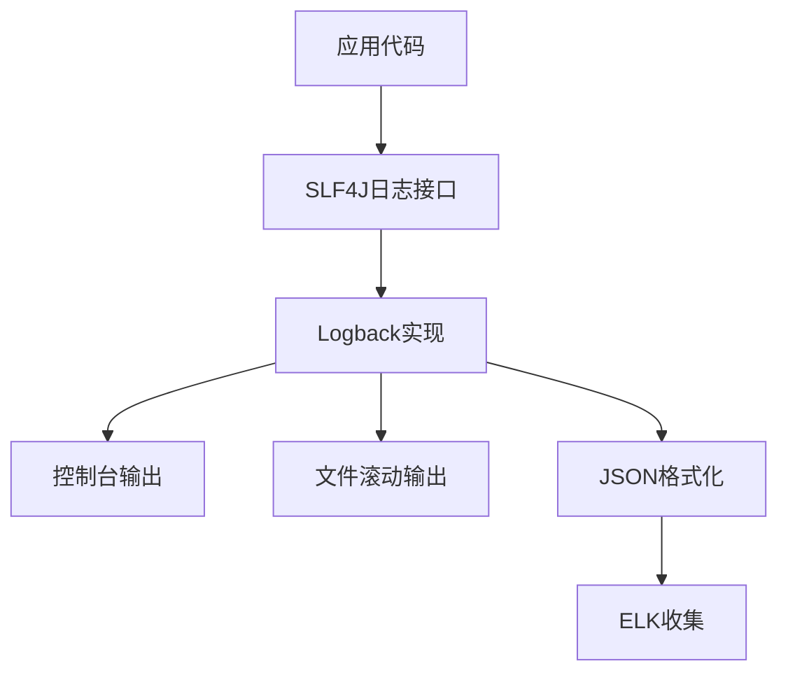

**图表来源**
- [后端根POM](file://ZXYZdatabaseBack/pom.xml)

**章节来源**
- [后端根POM](file://ZXYZdatabaseBack/pom.xml)

### 日志收集与分析：Promtail与ELK
- Promtail：采集容器日志，推送至Loki
- Loki：轻量级日志聚合系统
- Grafana：可视化查询与分析

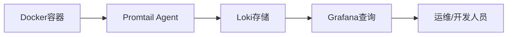

**图表来源**
- [Promtail配置](file://deploy/promtail-config.yml)

**章节来源**
- [Promtail配置](file://deploy/promtail-config.yml)

### 性能分析：JVM监控与内存泄漏检测
- JVM参数：-XX:+UseG1GC -Xms512m -Xmx1g
- 监控工具：jstat、jmap、VisualVM、Arthas
- 内存泄漏：heap dump分析，定位大对象引用链

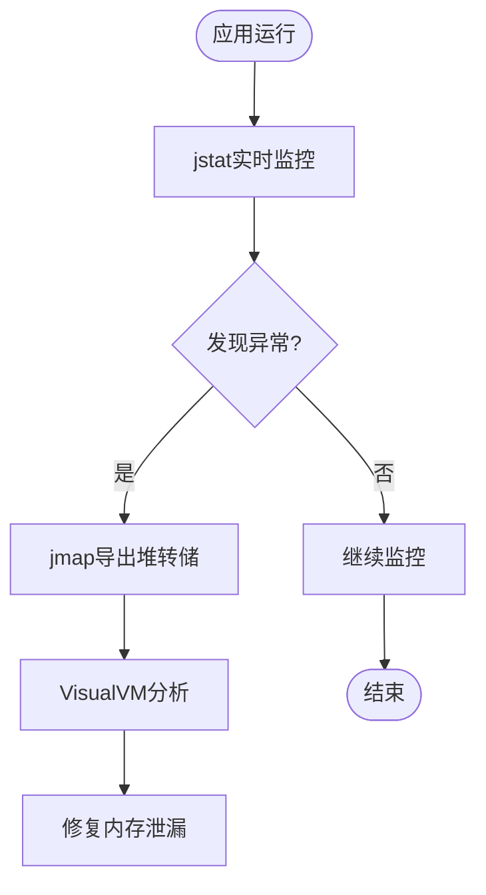

**图表来源**
- [后端根POM](file://ZXYZdatabaseBack/pom.xml)

**章节来源**
- [后端根POM](file://ZXYZdatabaseBack/pom.xml)

### 性能分析：数据库查询优化
- SQL慢查询：开启MySQL slow_query_log
- 索引优化：使用EXPLAIN分析执行计划
- 连接池：HikariCP调优maxLifetime、idleTimeout

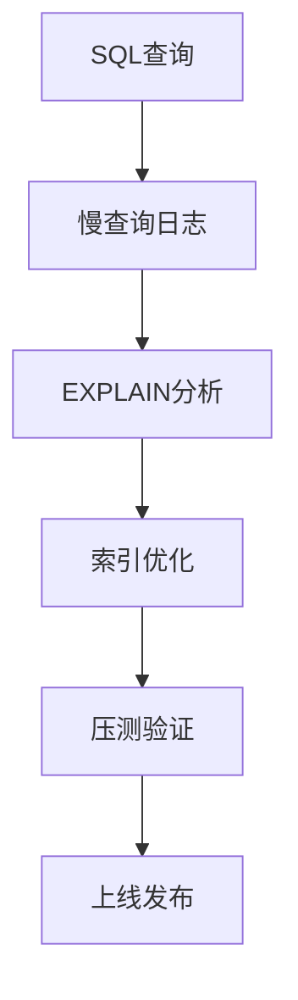

**图表来源**
- [数据库初始化脚本](file://sql/00-init-zxyz.sh)

**章节来源**
- [数据库初始化脚本](file://sql/00-init-zxyz.sh)

### 性能分析：前端性能分析
- Chrome Lighthouse：性能评分与建议
- Network面板：请求耗时与资源大小
- Performance面板：JS执行与渲染瓶颈

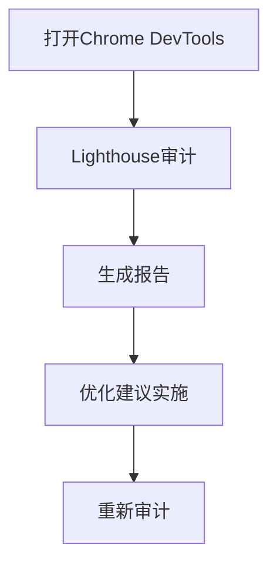

**图表来源**
- [前端包管理](file://ZXYZdatabaseFront/package.json)

**章节来源**
- [前端包管理](file://ZXYZdatabaseFront/package.json)

### 常见问题诊断：网络连接问题
- 检查防火墙与安全组规则
- 验证DNS解析与服务注册
- 使用curl或telnet测试端口连通性

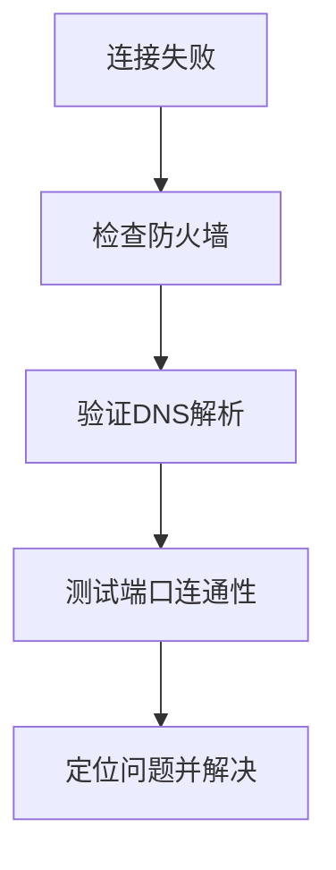

**章节来源**
- [健康检查脚本](file://scripts/health-check.sh)

### 常见问题诊断：数据库连接池问题
- 监控连接池状态：active、idle、waiting
- 调整最大连接数与超时时间
- 排查长事务与未释放连接

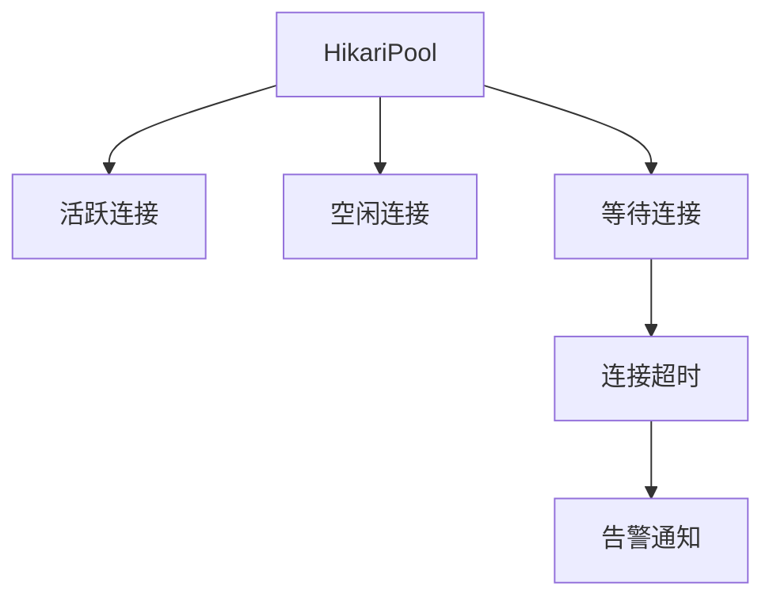

**章节来源**
- [后端根POM](file://ZXYZdatabaseBack/pom.xml)

### 常见问题诊断：Redis缓存问题
- 检查缓存命中率与内存使用
- 监控键空间过期与淘汰策略
- 处理缓存穿透与雪崩

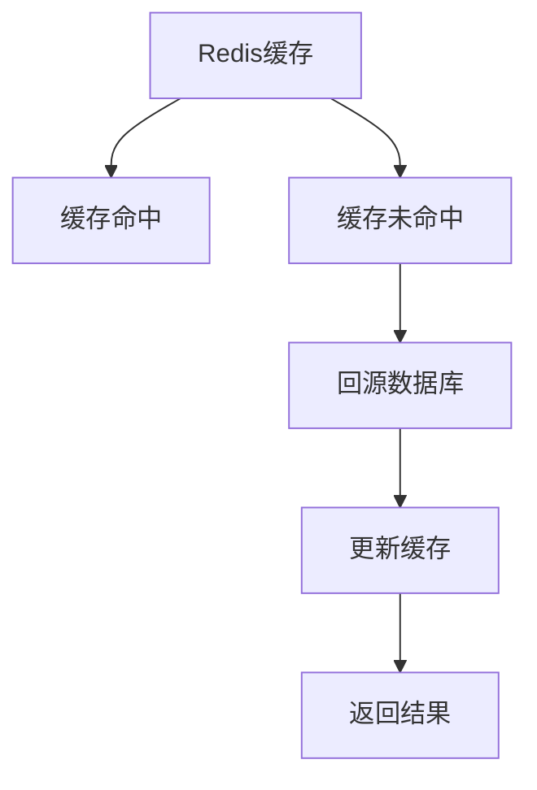

**章节来源**
- [后端根POM](file://ZXYZdatabaseBack/pom.xml)

### 常见问题诊断：消息队列消费问题
- 监控队列长度与消费延迟
- 处理死信队列与重试机制
- 幂等性设计与重复消费防护

```mermaid
sequenceDiagram
participant Producer as "生产者"
participant MQ as "RabbitMQ"
participant Consumer as "消费者"
participant DLQ as "死信队列"
Producer->>MQ : 发送消息
MQ->>Consumer : 投递消息
Consumer->>Consumer : 处理业务逻辑
alt 处理成功
Consumer-->>MQ : 确认消费
else 处理失败
Consumer->>DLQ : 发送到死信队列
DLQ->>Operator["人工干预"]
end
```

**图表来源**
- [审计服务RabbitMQ配置](file://ZXYZdatabaseBack/zxyz-audit-service/src/main/java/uno/acloud/audit/config/RabbitMqConfig.java)
- [审计消费者](file://ZXYZdatabaseBack/zxyz-audit-service/src/main/java/uno/acloud/audit/mq/OperateLogConsumer.java)

**章节来源**
- [审计服务RabbitMQ配置](file://ZXYZdatabaseBack/zxyz-audit-service/src/main/java/uno/acloud/audit/config/RabbitMqConfig.java)
- [审计消费者](file://ZXYZdatabaseBack/zxyz-audit-service/src/main/java/uno/acloud/audit/mq/OperateLogConsumer.java)

### 监控告警：健康检查端点
- Spring Boot Actuator：/actuator/health
- 自定义健康检查：数据库、Redis、MQ连接状态
- 集成Prometheus：暴露指标端点

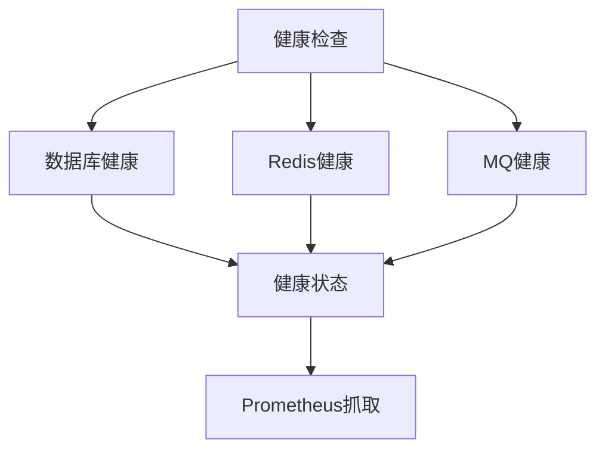

**章节来源**
- [健康检查脚本](file://scripts/health-check.sh)

### 监控告警：指标收集与错误追踪
- Micrometer：埋点关键业务指标
- Sentry：前端错误捕获与堆栈追踪
- APM工具：SkyWalking或APM平台

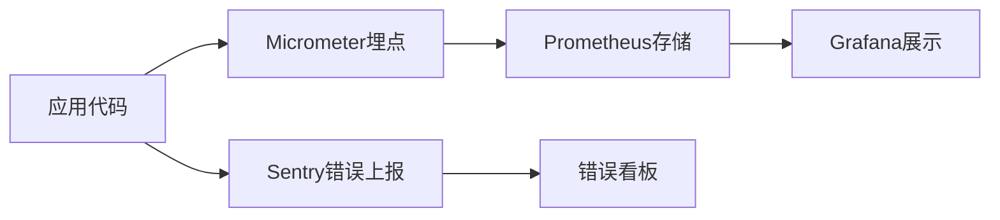

**章节来源**
- [后端根POM](file://ZXYZdatabaseBack/pom.xml)

### 监控告警：性能基准测试
- JMeter：接口压力测试
- k6：现代负载测试工具
- 持续集成：GitHub Actions自动化测试

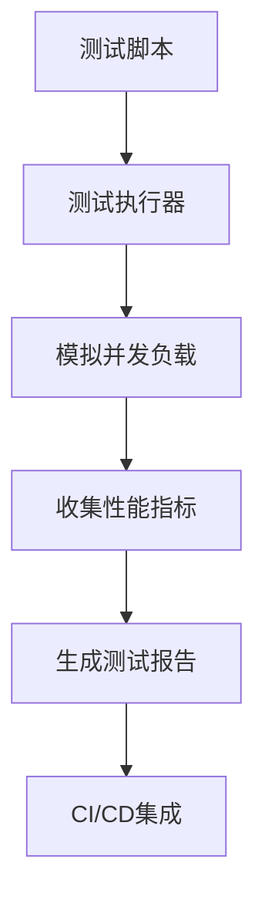

**章节来源**
- [CI/CD工作流](file://./.github/workflows/ci-cd.yml)

## 依赖关系分析
微服务间依赖清晰，通过Nacos进行服务发现与配置管理，RabbitMQ解耦异步任务。

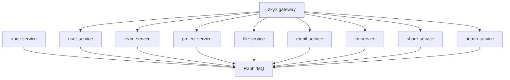

**图表来源**
- [后端根POM](file://ZXYZdatabaseBack/pom.xml)
- [审计服务RabbitMQ配置](file://ZXYZdatabaseBack/zxyz-audit-service/src/main/java/uno/acloud/audit/config/RabbitMqConfig.java)

**章节来源**
- [后端根POM](file://ZXYZdatabaseBack/pom.xml)

## 性能考虑
- JVM调优：选择合适的垃圾回收器与堆大小
- 数据库优化：索引设计、慢查询优化、连接池配置
- 缓存策略：合理设置TTL与缓存容量
- 前端优化：代码分割、懒加载、资源压缩
- 监控告警：建立完善的监控体系与告警规则

[本节为通用指导，无需特定文件来源]

## 故障排查指南
- 网络连接：检查防火墙、DNS、端口连通性
- 数据库连接池：监控连接状态，调整超时参数
- Redis缓存：检查命中率、内存使用、键过期策略
- 消息队列：监控队列长度、消费延迟、死信队列处理
- 日志分析：使用ELK快速定位问题根源

**章节来源**
- [健康检查脚本](file://scripts/health-check.sh)
- [Promtail配置](file://deploy/promtail-config.yml)

## 结论
通过系统的调试方法与工具链，可以高效定位和解决ZXYZ项目中的各类问题。建议团队建立标准化的调试流程与知识库，提升整体研发效率与系统稳定性。

[本节为总结性内容，无需特定文件来源]

## 附录
- IDE插件推荐：IntelliJ IDEA、VS Code、Vue DevTools
- 命令行工具：curl、jq、kubectl、docker
- 监控工具：Grafana、Prometheus、Sentry、Arthas

[本节为工具推荐，无需特定文件来源]