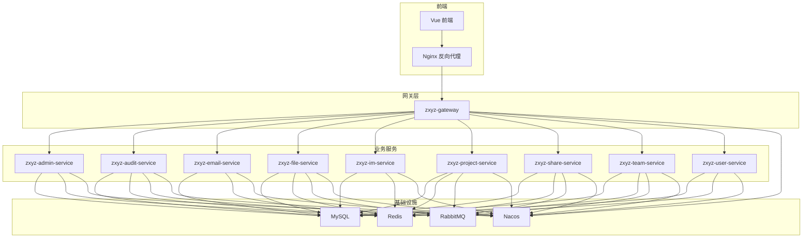
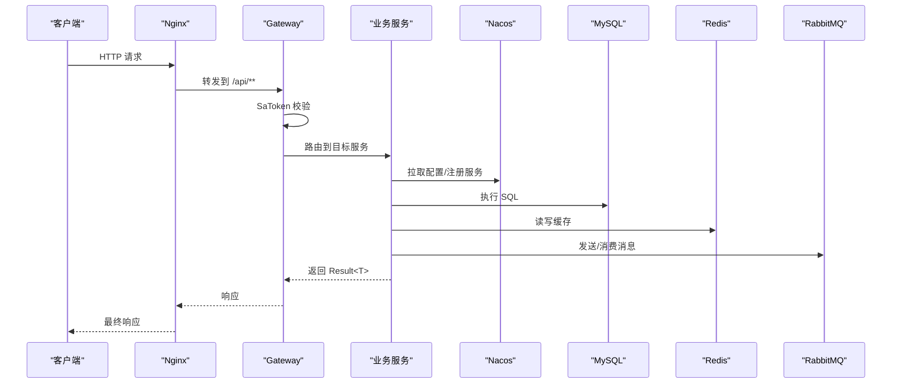
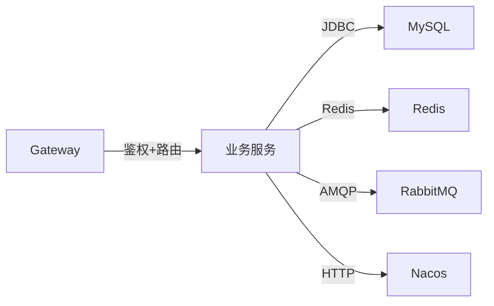
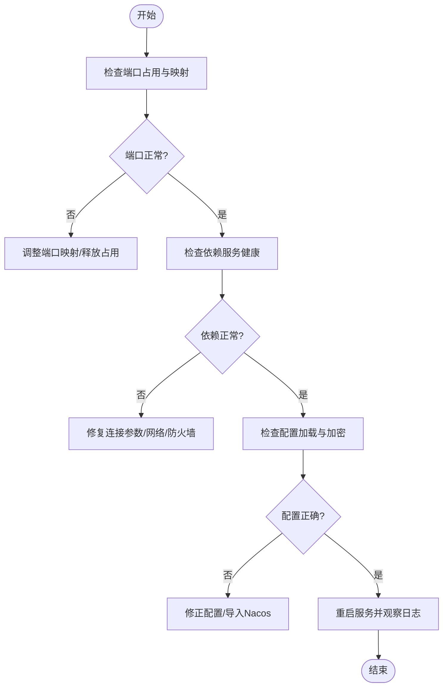
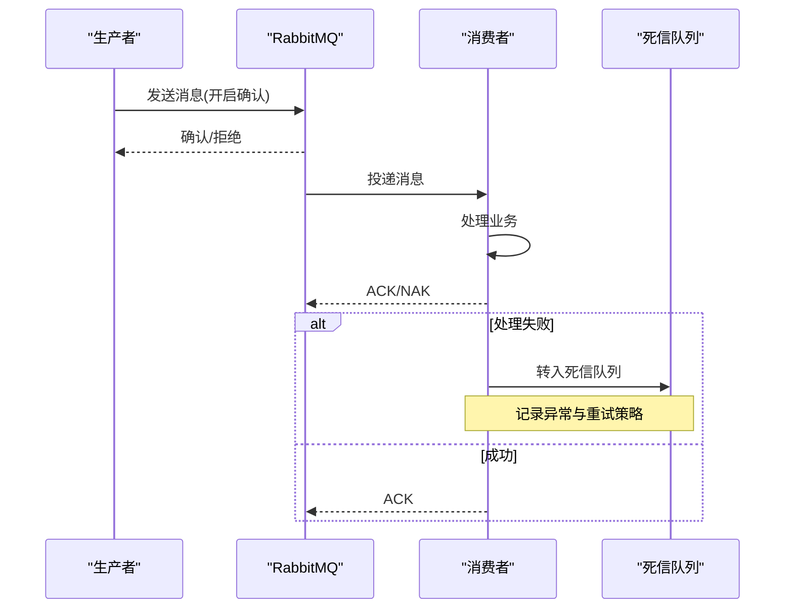

# 常见问题诊断

<cite>
**本文引用的文件**   
- [docker-compose.yml](file://docker-compose.yml)
- [docker-compose.dev.yml](file://docker-compose.dev.yml)
- [nacos-config/zxyz-static.yml](file://nacos-config/zxyz-static.yml)
- [nacos-config/zxyz-dynamic.yml](file://nacos-config/zxyz-dynamic.yml)
- [ZXYZdatabaseBack/ZXYZdatabaseBack/pom.xml](file://ZXYZdatabaseBack/pom.xml)
- [ZXYZdatabaseBack/README.md](file://ZXYZdatabaseBack/README.md)
- [ZXYZdatabaseBack/zxyz-admin-service/src/main/resources/application.yml](file://ZXYZdatabaseBack/zxyz-admin-service/src/main/resources/application.yml)
- [ZXYZdatabaseBack/zxyz-audit-service/src/main/java/uno/acloud/audit/config/RabbitMqConfig.java](file://ZXYZdatabaseBack/zxyz-audit-service/src/main/java/uno/acloud/audit/config/RabbitMqConfig.java)
- [ZXYZdatabaseBack/zxyz-audit-service/src/main/java/uno/acloud/audit/mq/OperateLogConsumer.java](file://ZXYZdatabaseBack/zxyz-audit-service/src/main/java/uno/acloud/audit/mq/OperateLogConsumer.java)
- [ZXYZdatabaseBack/zxyz-file-service/src/main/resources/application.yml](file://ZXYZdatabaseBack/zxyz-file-service/src/main/resources/application.yml)
- [ZXYZdatabaseBack/zxyz-im-service/src/main/resources/application.yml](file://ZXYZdatabaseBack/zxyz-im-service/src/main/resources/application.yml)
- [ZXYZdatabaseBack/zxyz-project-service/src/main/resources/application.yml](file://ZXYZdatabaseBack/zxyz-project-service/src/main/resources/application.yml)
- [ZXYZdatabaseBack/zxyz-share-service/src/main/resources/application.yml](file://ZXYZdatabaseBack/zxyz-share-service/src/main/resources/application.yml)
- [ZXYZdatabaseBack/zxyz-team-service/src/main/resources/application.yml](file://ZXYZdatabaseBack/zxyz-team-service/src/main/resources/application.yml)
- [ZXYZdatabaseBack/zxyz-user-service/src/main/resources/application.yml](file://ZXYZdatabaseBack/zxyz-user-service/src/main/resources/application.yml)
- [ZXYZdatabaseBack/zxyz-email-service/src/main/resources/application.yml](file://ZXYZdatabaseBack/zxyz-email-service/src/main/resources/application.yml)
- [ZXYZdatabaseBack/zxyz-gateway/src/main/resources/application.yml](file://ZXYZdatabaseBack/zxyz-gateway/src/main/resources/application.yml)
- [scripts/health-check.sh](file://scripts/health-check.sh)
- [scripts/validate-env.sh](file://scripts/validate-env.sh)
- [deploy/nginx/default.conf](file://deploy/nginx/default.conf)
- [docs/architecture.md](file://docs/architecture.md)
- [docs/infrastructure.md](file://docs/infrastructure.md)
</cite>

## 目录
1. [简介](#简介)
2. [项目结构](#项目结构)
3. [核心组件](#核心组件)
4. [架构总览](#架构总览)
5. [详细组件分析](#详细组件分析)
6. [依赖关系分析](#依赖关系分析)
7. [性能注意事项](#性能注意事项)
8. [故障排查指南](#故障排查指南)
9. [结论](#结论)
10. [附录](#附录)

## 简介
本文件面向 ZXYZ 项目的运维与研发人员，聚焦“服务启动失败”的常见原因与定位方法，覆盖端口冲突、依赖服务连接失败、配置加载错误等；并给出数据库（MySQL）连接池、慢查询与死锁的诊断步骤；说明 Redis 缓存异常（连接超时、内存溢出、数据不一致）的处理流程；提供 RabbitMQ 消息丢失排查（队列堆积、消费者异常、网络分区）；以及 Nacos 配置中心问题（拉取失败、注册异常、动态配置不生效）的解决方案。文档同时给出常用命令行工具与调试技巧，帮助快速恢复服务。

## 项目结构
ZXYZ 采用微服务架构：后端为多个 Maven 模块（网关与各业务服务），前端为 Vue 应用，基础设施通过 Docker Compose 编排，Nacos 作为配置中心与服务注册发现，RabbitMQ 用于异步通信，MySQL 与 Redis 分别承担持久化与缓存。

图表来源
- [docker-compose.yml](file://docker-compose.yml)
- [docs/architecture.md](file://docs/architecture.md)

章节来源
- [ZXYZdatabaseBack/README.md](file://ZXYZdatabaseBack/README.md)
- [docs/architecture.md](file://docs/architecture.md)

## 核心组件
- 网关 zxyz-gateway：统一入口、鉴权过滤、路由转发。
- 业务服务：admin、audit、email、file、im、project、share、team、user 等，各自负责领域能力。
- 基础设施：MySQL（持久化）、Redis（会话/缓存）、RabbitMQ（异步消息）、Nacos（配置中心/注册中心）。
- 前端与 Nginx：静态资源与反向代理。

章节来源
- [ZXYZdatabaseBack/zxyz-gateway/src/main/resources/application.yml](file://ZXYZdatabaseBack/zxyz-gateway/src/main/resources/application.yml)
- [ZXYZdatabaseBack/zxyz-admin-service/src/main/resources/application.yml](file://ZXYZdatabaseBack/zxyz-admin-service/src/main/resources/application.yml)
- [ZXYZdatabaseBack/zxyz-audit-service/src/main/java/uno/acloud/audit/config/RabbitMqConfig.java](file://ZXYZdatabaseBack/zxyz-audit-service/src/main/java/uno/acloud/audit/config/RabbitMqConfig.java)

## 架构总览
系统以 Gateway 为统一入口，内部服务通过 ServiceClient + X-Internal-Service-Token 进行鉴权调用；异步消息通过 RabbitMQ Topic Exchange zxyz.topic 传递；配置由 Nacos 统一管理，支持动态刷新；数据库使用 MySQL，连接池由框架管理；Redis 承载会话与热点缓存。

图表来源
- [ZXYZdatabaseBack/zxyz-gateway/src/main/resources/application.yml](file://ZXYZdatabaseBack/zxyz-gateway/src/main/resources/application.yml)
- [ZXYZdatabaseBack/zxyz-audit-service/src/main/java/uno/acloud/audit/config/RabbitMqConfig.java](file://ZXYZdatabaseBack/zxyz-audit-service/src/main/java/uno/acloud/audit/config/RabbitMqConfig.java)

## 详细组件分析

### 服务启动失败：端口冲突
- 现象：服务启动时报端口占用或无法绑定端口。
- 排查要点：
  - 检查 docker-compose 中各容器端口映射是否重复。
  - 宿主机端口被其他进程占用时，优先释放或修改映射。
  - 确认服务内 application.yml 的 server.port 与 compose 映射一致。
- 解决建议：
  - 调整 docker-compose.yml 中的端口映射，避免冲突。
  - 在本地开发环境使用 validate-env.sh 脚本校验端口可用性。

章节来源
- [docker-compose.yml](file://docker-compose.yml)
- [scripts/validate-env.sh](file://scripts/validate-env.sh)

### 服务启动失败：依赖服务连接失败
- 现象：启动阶段报 MySQL/Redis/RabbitMQ/Nacos 连接异常。
- 排查要点：
  - 检查环境变量与 nacos-config 中的连接地址、用户名密码是否正确。
  - 确认依赖服务容器健康状态（可用 health-check.sh）。
  - 检查防火墙/安全组/网络策略是否放行端口。
- 解决建议：
  - 修正连接参数，确保服务启动顺序正确（先启动基础设施）。
  - 增加重试与退避策略，提升启动鲁棒性。

章节来源
- [nacos-config/zxyz-static.yml](file://nacos-config/zxyz-static.yml)
- [scripts/health-check.sh](file://scripts/health-check.sh)

### 服务启动失败：配置加载错误
- 现象：启动时报配置缺失、格式错误或加密字段解密失败。
- 排查要点：
  - 核对 Nacos 命名空间、Data ID、Group 是否与部署一致。
  - 检查 Jasypt 密钥配置与环境变量注入。
  - 验证 application.yml 与 Nacos 动态配置的优先级与覆盖规则。
- 解决建议：
  - 在 Nacos 控制台补齐缺失配置项，确保 YAML 语法正确。
  - 重新导入 nacos-config/*.yml 至 Nacos，必要时清理旧配置。

章节来源
- [nacos-config/zxyz-static.yml](file://nacos-config/zxyz-static.yml)
- [nacos-config/zxyz-dynamic.yml](file://nacos-config/zxyz-dynamic.yml)
- [ZXYZdatabaseBack/zxyz-admin-service/src/main/resources/application.yml](file://ZXYZdatabaseBack/zxyz-admin-service/src/main/resources/application.yml)

### 数据库连接问题：连接池配置
- 现象：连接耗尽、频繁超时、SQL 执行缓慢。
- 排查要点：
  - 检查连接池最大连接数、空闲连接回收、获取超时时间。
  - 观察连接泄漏（未关闭的 Statement/Connection）。
  - 监控连接池活跃/等待线程数。
- 解决建议：
  - 根据 QPS 与事务长度合理设置 maxActive/maxIdle/minIdle。
  - 开启连接泄漏检测，定位长时间持有连接的代码路径。

章节来源
- [ZXYZdatabaseBack/zxyz-file-service/src/main/resources/application.yml](file://ZXYZdatabaseBack/zxyz-file-service/src/main/resources/application.yml)
- [ZXYZdatabaseBack/zxyz-im-service/src/main/resources/application.yml](file://ZXYZdatabaseBack/zxyz-im-service/src/main/resources/application.yml)
- [ZXYZdatabaseBack/zxyz-project-service/src/main/resources/application.yml](file://ZXYZdatabaseBack/zxyz-project-service/src/main/resources/application.yml)
- [ZXYZdatabaseBack/zxyz-share-service/src/main/resources/application.yml](file://ZXYZdatabaseBack/zxyz-share-service/src/main/resources/application.yml)
- [ZXYZdatabaseBack/zxyz-team-service/src/main/resources/application.yml](file://ZXYZdatabaseBack/zxyz-team-service/src/main/resources/application.yml)
- [ZXYZdatabaseBack/zxyz-user-service/src/main/resources/application.yml](file://ZXYZdatabaseBack/zxyz-user-service/src/main/resources/application.yml)
- [ZXYZdatabaseBack/zxyz-email-service/src/main/resources/application.yml](file://ZXYZdatabaseBack/zxyz-email-service/src/main/resources/application.yml)

### 数据库连接问题：慢查询分析
- 现象：接口响应变慢，CPU/IO 升高。
- 排查要点：
  - 开启慢查询日志，统计阈值与采样率。
  - 使用 EXPLAIN 分析执行计划，关注全表扫描、索引失效。
  - 关联业务热点接口，定位高频慢查询。
- 解决建议：
  - 优化 SQL（减少 JOIN、分页限制、避免函数对列操作）。
  - 补充合适索引，避免回表过多。

章节来源
- [ZXYZdatabaseBack/zxyz-file-service/src/main/resources/application.yml](file://ZXYZdatabaseBack/zxyz-file-service/src/main/resources/application.yml)
- [ZXYZdatabaseBack/zxyz-im-service/src/main/resources/application.yml](file://ZXYZdatabaseBack/zxyz-im-service/src/main/resources/application.yml)

### 数据库连接问题：死锁检测
- 现象：事务提交失败、出现死锁报错。
- 排查要点：
  - 查看 InnoDB 死锁日志，定位涉及的表与行锁。
  - 分析事务边界与加锁顺序，识别循环等待。
- 解决建议：
  - 统一加锁顺序，拆分大事务，缩短持锁时间。
  - 引入重试机制处理偶发死锁。

章节来源
- [ZXYZdatabaseBack/zxyz-file-service/src/main/resources/application.yml](file://ZXYZdatabaseBack/zxyz-file-service/src/main/resources/application.yml)
- [ZXYZdatabaseBack/zxyz-im-service/src/main/resources/application.yml](file://ZXYZdatabaseBack/zxyz-im-service/src/main/resources/application.yml)

### Redis 缓存异常：连接超时
- 现象：缓存读写超时、服务降级。
- 排查要点：
  - 检查 Redis 实例可达性与网络延迟。
  - 核对连接池大小、超时时间、重试策略。
- 解决建议：
  - 调整连接池参数，增加超时上限与重试次数。
  - 对关键路径实现缓存降级与兜底逻辑。

章节来源
- [ZXYZdatabaseBack/zxyz-file-service/src/main/resources/application.yml](file://ZXYZdatabaseBack/zxyz-file-service/src/main/resources/application.yml)
- [ZXYZdatabaseBack/zxyz-im-service/src/main/resources/application.yml](file://ZXYZdatabaseBack/zxyz-im-service/src/main/resources/application.yml)

### Redis 缓存异常：内存溢出
- 现象：OOM、键值淘汰、服务抖动。
- 排查要点：
  - 监控内存使用量、命中率、淘汰策略。
  - 检查大 Key、热 Key 分布。
- 解决建议：
  - 设置合理的 maxmemory 与淘汰策略（如 allkeys-lru）。
  - 拆分大 Key，控制过期时间，避免集中过期。

章节来源
- [ZXYZdatabaseBack/zxyz-file-service/src/main/resources/application.yml](file://ZXYZdatabaseBack/zxyz-file-service/src/main/resources/application.yml)
- [ZXYZdatabaseBack/zxyz-im-service/src/main/resources/application.yml](file://ZXYZdatabaseBack/zxyz-im-service/src/main/resources/application.yml)

### Redis 缓存异常：数据不一致
- 现象：读到的缓存与数据库不一致。
- 排查要点：
  - 检查更新顺序（先更新库还是先删缓存）。
  - 是否存在并发写导致脏读。
- 解决建议：
  - 采用“先更新库，再删除缓存”的策略，配合延迟双删或订阅 Binlog 更新缓存。
  - 对强一致性场景引入分布式锁或版本号控制。

章节来源
- [ZXYZdatabaseBack/zxyz-file-service/src/main/resources/application.yml](file://ZXYZdatabaseBack/zxyz-file-service/src/main/resources/application.yml)
- [ZXYZdatabaseBack/zxyz-im-service/src/main/resources/application.yml](file://ZXYZdatabaseBack/zxyz-im-service/src/main/resources/application.yml)

### RabbitMQ 消息丢失：队列堆积
- 现象：队列长度持续增长，消费者处理滞后。
- 排查要点：
  - 监控队列长度、消费速率、生产者发布速率。
  - 检查消费者并发度与批处理能力。
- 解决建议：
  - 扩容消费者实例，提升并行度。
  - 优化消息体大小与处理逻辑，减少单次处理耗时。

章节来源
- [ZXYZdatabaseBack/zxyz-audit-service/src/main/java/uno/acloud/audit/config/RabbitMqConfig.java](file://ZXYZdatabaseBack/zxyz-audit-service/src/main/java/uno/acloud/audit/config/RabbitMqConfig.java)
- [ZXYZdatabaseBack/zxyz-audit-service/src/main/java/uno/acloud/audit/mq/OperateLogConsumer.java](file://ZXYZdatabaseBack/zxyz-audit-service/src/main/java/uno/acloud/audit/mq/OperateLogConsumer.java)

### RabbitMQ 消息丢失：消费者异常
- 现象：部分消息未被消费或重复消费。
- 排查要点：
  - 检查消费者异常处理与重试策略。
  - 确认 ACK 机制与幂等设计。
- 解决建议：
  - 完善异常捕获与死信队列（DLQ）处理。
  - 实现幂等消费（基于唯一键去重）。

章节来源
- [ZXYZdatabaseBack/zxyz-audit-service/src/main/java/uno/acloud/audit/mq/OperateLogConsumer.java](file://ZXYZdatabaseBack/zxyz-audit-service/src/main/java/uno/acloud/audit/mq/OperateLogConsumer.java)

### RabbitMQ 消息丢失：网络分区
- 现象：生产端或消费端短暂不可达导致丢消息。
- 排查要点：
  - 监控网络连通性与 Broker 集群状态。
  - 检查发布确认与消费确认配置。
- 解决建议：
  - 启用 publisher confirms 与 consumer acks。
  - 对关键消息落盘持久化，结合重试与补偿任务。

章节来源
- [ZXYZdatabaseBack/zxyz-audit-service/src/main/java/uno/acloud/audit/config/RabbitMqConfig.java](file://ZXYZdatabaseBack/zxyz-audit-service/src/main/java/uno/acloud/audit/config/RabbitMqConfig.java)

### Nacos 配置中心：配置拉取失败
- 现象：服务启动后无法拉取配置或频繁拉取失败。
- 排查要点：
  - 检查 Nacos 地址、命名空间、Data ID、Group。
  - 核对认证信息与网络连通性。
- 解决建议：
  - 修正配置项，确保命名空间隔离正确。
  - 在 Nacos 控制台查看拉取日志与权限。

章节来源
- [nacos-config/zxyz-static.yml](file://nacos-config/zxyz-static.yml)
- [nacos-config/zxyz-dynamic.yml](file://nacos-config/zxyz-dynamic.yml)

### Nacos 配置中心：服务注册异常
- 现象：服务未在 Nacos 注册或心跳失败。
- 排查要点：
  - 检查服务名、分组、元数据配置。
  - 观察心跳间隔与超时配置。
- 解决建议：
  - 修正服务注册参数，确保与网关路由一致。
  - 调整心跳参数，避免误判下线。

章节来源
- [ZXYZdatabaseBack/zxyz-gateway/src/main/resources/application.yml](file://ZXYZdatabaseBack/zxyz-gateway/src/main/resources/application.yml)
- [ZXYZdatabaseBack/zxyz-admin-service/src/main/resources/application.yml](file://ZXYZdatabaseBack/zxyz-admin-service/src/main/resources/application.yml)

### Nacos 配置中心：动态配置不生效
- 现象：修改 Nacos 配置后，服务未热更新。
- 排查要点：
  - 检查 @RefreshScope 或监听器是否生效。
  - 确认配置键名与类型匹配。
- 解决建议：
  - 确保配置类标注刷新注解，监听对应 Data ID。
  - 重启必要组件或触发手动刷新。

章节来源
- [nacos-config/zxyz-dynamic.yml](file://nacos-config/zxyz-dynamic.yml)
- [ZXYZdatabaseBack/zxyz-admin-service/src/main/resources/application.yml](file://ZXYZdatabaseBack/zxyz-admin-service/src/main/resources/application.yml)

## 依赖关系分析
- 服务间同步调用：ServiceClient + X-Internal-Service-Token 鉴权，内部端点 /api/internal/** 被 Gateway 拒绝公网访问。
- 异步消息：RabbitMQ Topic Exchange zxyz.topic，审计、文件、团队等项目事件通过 MQ 解耦。
- 配置与注册：Nacos 统一管理，静态与动态配置分离。

图表来源
- [ZXYZdatabaseBack/zxyz-gateway/src/main/resources/application.yml](file://ZXYZdatabaseBack/zxyz-gateway/src/main/resources/application.yml)
- [ZXYZdatabaseBack/zxyz-audit-service/src/main/java/uno/acloud/audit/config/RabbitMqConfig.java](file://ZXYZdatabaseBack/zxyz-audit-service/src/main/java/uno/acloud/audit/config/RabbitMqConfig.java)

章节来源
- [docs/infrastructure.md](file://docs/infrastructure.md)
- [ZXYZdatabaseBack/pom.xml](file://ZXYZdatabaseBack/pom.xml)

## 性能注意事项
- 连接池：根据负载调优最大连接数与超时，避免连接耗尽。
- 缓存：合理设置 TTL 与淘汰策略，避免热点 Key 与内存压力。
- 消息：控制消息体大小，批量处理，避免长事务与阻塞。
- 数据库：优化 SQL 与索引，减少全表扫描与回表。

## 故障排查指南

### 服务启动失败的通用排查流程

章节来源
- [docker-compose.yml](file://docker-compose.yml)
- [scripts/health-check.sh](file://scripts/health-check.sh)
- [nacos-config/zxyz-static.yml](file://nacos-config/zxyz-static.yml)

### 数据库连接问题诊断步骤
- 连接池：检查 maxActive、maxIdle、minIdle、获取超时、泄漏检测。
- 慢查询：开启慢查询日志，EXPLAIN 分析执行计划，优化 SQL 与索引。
- 死锁：查看 InnoDB 死锁日志，统一加锁顺序，拆分事务，引入重试。

章节来源
- [ZXYZdatabaseBack/zxyz-file-service/src/main/resources/application.yml](file://ZXYZdatabaseBack/zxyz-file-service/src/main/resources/application.yml)
- [ZXYZdatabaseBack/zxyz-im-service/src/main/resources/application.yml](file://ZXYZdatabaseBack/zxyz-im-service/src/main/resources/application.yml)

### Redis 缓存异常处理方法
- 连接超时：检查网络与连接池参数，增加超时与重试。
- 内存溢出：设置 maxmemory 与淘汰策略，拆分大 Key，控制过期。
- 数据不一致：先更新库再删缓存，幂等与版本控制。

章节来源
- [ZXYZdatabaseBack/zxyz-file-service/src/main/resources/application.yml](file://ZXYZdatabaseBack/zxyz-file-service/src/main/resources/application.yml)
- [ZXYZdatabaseBack/zxyz-im-service/src/main/resources/application.yml](file://ZXYZdatabaseBack/zxyz-im-service/src/main/resources/application.yml)

### RabbitMQ 消息丢失排查流程

章节来源
- [ZXYZdatabaseBack/zxyz-audit-service/src/main/java/uno/acloud/audit/config/RabbitMqConfig.java](file://ZXYZdatabaseBack/zxyz-audit-service/src/main/java/uno/acloud/audit/config/RabbitMqConfig.java)
- [ZXYZdatabaseBack/zxyz-audit-service/src/main/java/uno/acloud/audit/mq/OperateLogConsumer.java](file://ZXYZdatabaseBack/zxyz-audit-service/src/main/java/uno/acloud/audit/mq/OperateLogConsumer.java)

### Nacos 配置中心问题处理
- 拉取失败：核对命名空间、Data ID、Group、认证信息。
- 注册异常：检查服务名、分组、元数据与心跳参数。
- 动态不生效：确认刷新注解与监听器，必要时手动刷新。

章节来源
- [nacos-config/zxyz-static.yml](file://nacos-config/zxyz-static.yml)
- [nacos-config/zxyz-dynamic.yml](file://nacos-config/zxyz-dynamic.yml)
- [ZXYZdatabaseBack/zxyz-admin-service/src/main/resources/application.yml](file://ZXYZdatabaseBack/zxyz-admin-service/src/main/resources/application.yml)

### 常用命令与调试技巧
- 容器健康检查：使用 health-check.sh 检查各服务状态。
- 环境校验：使用 validate-env.sh 校验端口与依赖连通性。
- 日志查看：docker logs 查看服务日志，结合关键字过滤异常堆栈。
- 网络连通：telnet/curl 测试依赖服务端口与 API 可达性。
- 配置验证：在 Nacos 控制台查看配置内容与拉取日志。

章节来源
- [scripts/health-check.sh](file://scripts/health-check.sh)
- [scripts/validate-env.sh](file://scripts/validate-env.sh)

## 结论
通过对端口、依赖、配置、数据库、缓存、消息与配置中心的系统化排查，可快速定位并解决 ZXYZ 服务启动失败与运行异常问题。建议在生产环境建立完善的监控与告警体系，结合健康检查与环境校验脚本，提升故障恢复效率。

## 附录
- 参考文档：
  - [docs/architecture.md](file://docs/architecture.md)
  - [docs/infrastructure.md](file://docs/infrastructure.md)
- 部署与编排：
  - [docker-compose.yml](file://docker-compose.yml)
  - [docker-compose.dev.yml](file://docker-compose.dev.yml)
  - [deploy/nginx/default.conf](file://deploy/nginx/default.conf)