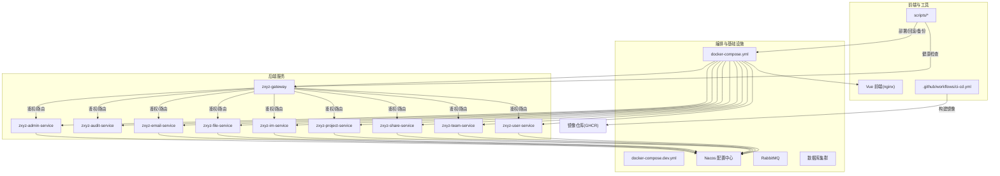
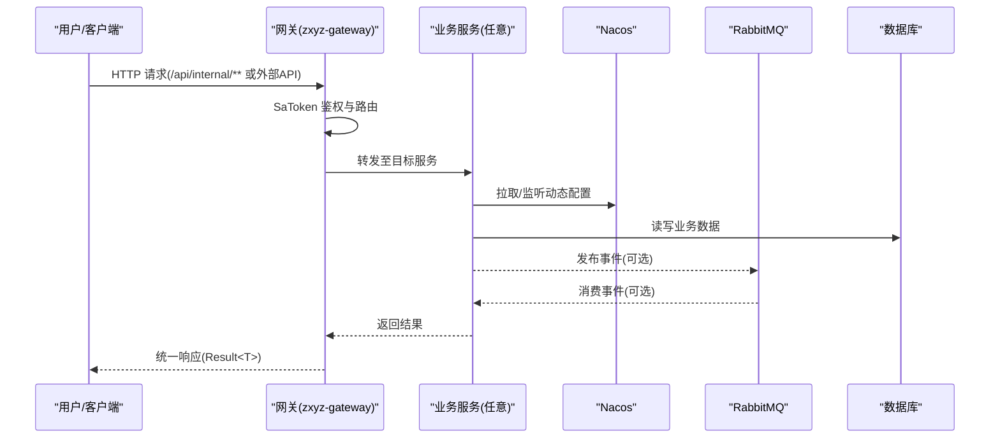
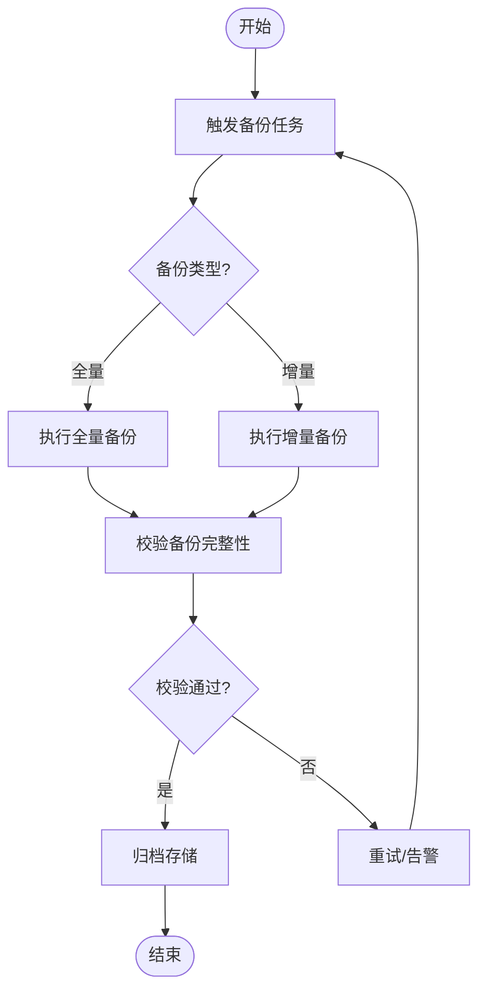
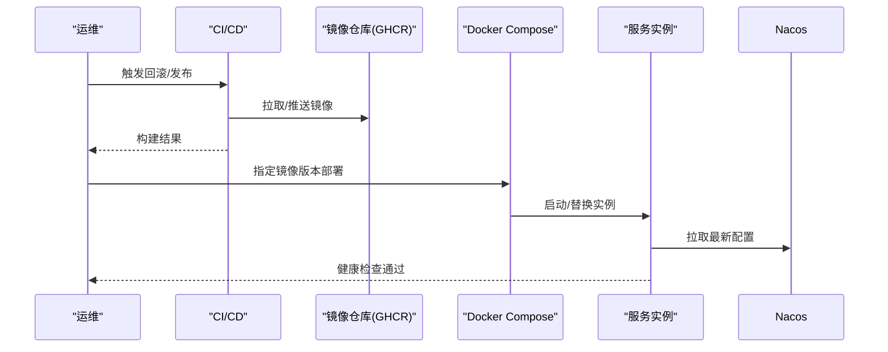
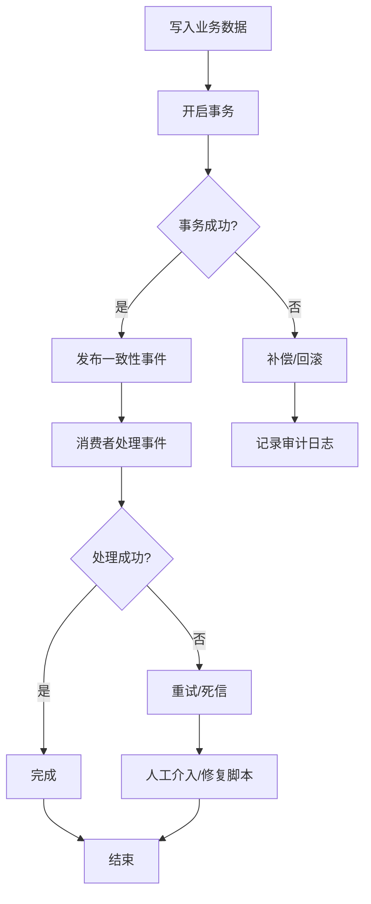
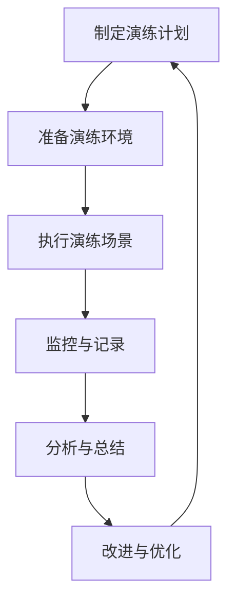
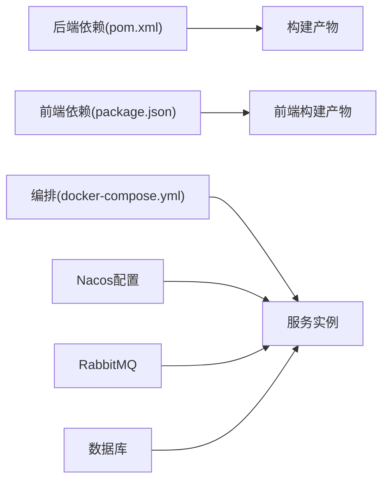

# 应急响应与恢复

<cite>
**本文引用的文件**   
- [docker-compose.yml](file://docker-compose.yml)
- [docker-compose.dev.yml](file://docker-compose.dev.yml)
- [Dockerfile](file://ZXYZdatabaseBack/Dockerfile)
- [Dockerfile.base](file://ZXYZdatabaseBack/Dockerfile.base)
- [.github/workflows/ci-cd.yml](file://.github/workflows/ci-cd.yml)
- [deploy-fast.sh](file://scripts/deploy-fast.sh)
- [rollback.sh](file://scripts/rollback.sh)
- [backup.sh](file://scripts/backup.sh)
- [health-check.sh](file://scripts/health-check.sh)
- [setup-acr.sh](file://scripts/setup-acr.sh)
- [validate-env.sh](file://scripts/validate-env.sh)
- [nacos-config/zxyz-dynamic.yml](file://nacos-config/zxyz-dynamic.yml)
- [nacos-config/import.sh](file://nacos-config/import.sh)
- [ZXYZdatabaseBack/pom.xml](file://ZXYZdatabaseBack/pom.xml)
- [ZXYZdatabaseFront/package.json](file://ZXYZdatabaseFront/package.json)
- [DEPLOYMENT.md](file://DEPLOYMENT.md)
- [docs/architecture.md](file://docs/architecture.md)
- [docs/infrastructure.md](file://docs/infrastructure.md)
</cite>

## 目录
1. [引言](#引言)
2. [项目结构](#项目结构)
3. [核心组件](#核心组件)
4. [架构总览](#架构总览)
5. [详细组件分析](#详细组件分析)
6. [依赖分析](#依赖分析)
7. [性能考虑](#性能考虑)
8. [故障排查指南](#故障排查指南)
9. [结论](#结论)
10. [附录](#附录)

## 引言
本文件为 ZXYZ 项目的应急响应与恢复手册，面向运维、研发与产品团队，覆盖故障分级与响应、应急预案制定、备份与恢复、容器化快速恢复、数据一致性保障、应急沟通模板与复盘报告格式、应急演练计划与自动化脚本使用指南。文档基于仓库现有编排、CI/CD、脚本与配置进行说明，确保可操作、可验证、可审计。

## 项目结构
ZXYZ 采用微服务架构（后端 11 个 Maven 模块 + Vue 前端），通过 Docker Compose 编排运行，Nacos 管理配置与服务注册，GitHub Actions 驱动 CI/CD，脚本层提供部署、回滚、备份与健康检查能力。

**图表来源**
- [docker-compose.yml](file://docker-compose.yml)
- [docker-compose.dev.yml](file://docker-compose.dev.yml)
- [.github/workflows/ci-cd.yml](file://.github/workflows/ci-cd.yml)
- [nacos-config/zxyz-dynamic.yml](file://nacos-config/zxyz-dynamic.yml)

**章节来源**
- [DEPLOYMENT.md](file://DEPLOYMENT.md)
- [docs/architecture.md](file://docs/architecture.md)
- [docs/infrastructure.md](file://docs/infrastructure.md)

## 核心组件
- 编排与容器：Docker Compose 统一编排 18 个容器；多环境 compose 文件分离开发与生产配置。
- 镜像与构建：Dockerfile/Dockerfile.base 定义基础镜像与构建流程；CI/CD 按路径过滤选择性构建并推送镜像。
- 配置中心：Nacos 集中管理动态配置，支持热更新；import.sh 用于批量导入配置。
- 运维脚本：deploy-fast.sh、rollback.sh、backup.sh、health-check.sh、setup-acr.sh、validate-env.sh 覆盖快速部署、回滚、备份、健康检查、镜像仓库初始化与环境校验。
- 前后端工程：后端 Maven 多模块，前端 package.json 管理依赖与脚本。

**章节来源**
- [docker-compose.yml](file://docker-compose.yml)
- [docker-compose.dev.yml](file://docker-compose.dev.yml)
- [Dockerfile](file://ZXYZdatabaseBack/Dockerfile)
- [Dockerfile.base](file://ZXYZdatabaseBack/Dockerfile.base)
- [.github/workflows/ci-cd.yml](file://.github/workflows/ci-cd.yml)
- [nacos-config/import.sh](file://nacos-config/import.sh)
- [scripts/deploy-fast.sh](file://scripts/deploy-fast.sh)
- [scripts/rollback.sh](file://scripts/rollback.sh)
- [scripts/backup.sh](file://scripts/backup.sh)
- [scripts/health-check.sh](file://scripts/health-check.sh)
- [scripts/setup-acr.sh](file://scripts/setup-acr.sh)
- [scripts/validate-env.sh](file://scripts/validate-env.sh)
- [ZXYZdatabaseBack/pom.xml](file://ZXYZdatabaseBack/pom.xml)
- [ZXYZdatabaseFront/package.json](file://ZXYZdatabaseFront/package.json)

## 架构总览
系统以 Gateway 作为统一入口，内部服务通过窄端点与投影 VO 通信，异步消息经 RabbitMQ Topic Exchange 解耦。Nacos 提供配置与服务发现，数据库持久化存储业务数据。CI/CD 流水线负责代码到镜像的持续交付，运维脚本支撑日常与应急操作。

**图表来源**
- [docker-compose.yml](file://docker-compose.yml)
- [nacos-config/zxyz-dynamic.yml](file://nacos-config/zxyz-dynamic.yml)

**章节来源**
- [docs/architecture.md](file://docs/architecture.md)
- [docs/infrastructure.md](file://docs/infrastructure.md)

## 详细组件分析

### 故障分类与响应级别（P0-P4）
- P0 级（致命）：核心功能不可用（如登录、IM、文件上传）、数据丢失风险、大面积服务宕机。要求立即响应，分钟级止血，小时级恢复。
- P1 级（严重）：重要功能降级或部分不可用，影响关键用户群体。要求快速定位，小时内恢复。
- P2 级（一般）：非核心功能异常，影响范围有限。要求当日修复或排期处理。
- P3 级（轻微）：体验问题或非阻塞错误。纳入迭代优化。
- P4 级（建议）：改进建议与优化项。

响应时间要求（示例）：
- P0：5 分钟内响应，30 分钟内止血，2 小时内恢复
- P1：10 分钟内响应，1 小时内恢复
- P2：30 分钟内响应，当日解决
- P3/P4：按迭代计划处理

升级流程：
- 一线值班 → 二线专家 → 三线架构师/负责人
- 跨团队协同：网关、服务、数据库、中间件、网络与安全

**章节来源**
- [DEPLOYMENT.md](file://DEPLOYMENT.md)
- [docs/infrastructure.md](file://docs/infrastructure.md)

### 应急预案制定
常见故障场景处置流程：
- 服务崩溃：重启实例 → 灰度回滚 → 限流熔断 → 扩容
- 配置错误：Nacos 热回滚 → 隔离变更 → 验证回归
- 数据库异常：切换只读/主从切换 → 清理慢查询 → 索引优化
- 中间件异常：重启/重建队列 → 重放消息 → 死信处理
- 网络/证书：切换域名/证书 → 回退 DNS → 防火墙策略修正

回滚策略：
- 版本回滚：基于镜像标签回滚到上一个稳定版本
- 配置回滚：Nacos 历史版本一键恢复
- 数据回滚：基于备份集恢复与增量回放

数据恢复方案：
- 全量备份恢复：停机或低峰窗口执行
- 增量恢复：结合 binlog/事务日志进行时间点恢复
- 校验与演练：恢复后完整性校验与业务回归

**章节来源**
- [scripts/rollback.sh](file://scripts/rollback.sh)
- [nacos-config/import.sh](file://nacos-config/import.sh)
- [scripts/backup.sh](file://scripts/backup.sh)

### 备份恢复机制
- 定时备份：通过 backup.sh 定期执行全量/增量备份，落盘或对象存储
- 增量策略：按天/小时粒度保留，配合压缩与校验
- 备份验证：自动校验备份完整性与可恢复性
- 灾难恢复演练：定期演练恢复流程，记录指标与改进点

**图表来源**
- [scripts/backup.sh](file://scripts/backup.sh)

**章节来源**
- [scripts/backup.sh](file://scripts/backup.sh)
- [docs/infrastructure.md](file://docs/infrastructure.md)

### 容器化环境下的快速恢复
- 镜像版本管理：按语义化版本与 Git Tag 管理镜像，CI/CD 推送 GHCR
- 服务编排回滚：通过 docker-compose 指定镜像标签快速回滚
- 配置中心热更新：Nacos 动态配置即时生效，无需重启服务

**图表来源**
- [.github/workflows/ci-cd.yml](file://.github/workflows/ci-cd.yml)
- [docker-compose.yml](file://docker-compose.yml)
- [nacos-config/zxyz-dynamic.yml](file://nacos-config/zxyz-dynamic.yml)

**章节来源**
- [Dockerfile](file://ZXYZdatabaseBack/Dockerfile)
- [Dockerfile.base](file://ZXYZdatabaseBack/Dockerfile.base)
- [.github/workflows/ci-cd.yml](file://.github/workflows/ci-cd.yml)
- [scripts/deploy-fast.sh](file://scripts/deploy-fast.sh)
- [scripts/rollback.sh](file://scripts/rollback.sh)

### 数据一致性保障
- 事务补偿：本地事务与分布式补偿结合，失败重试与幂等设计
- 最终一致性：通过消息队列实现事件驱动的最终一致，死信队列兜底
- 数据修复脚本：针对脏数据提供修复脚本，严格审批与审计

**图表来源**
- [docs/architecture.md](file://docs/architecture.md)

**章节来源**
- [docs/architecture.md](file://docs/architecture.md)
- [docs/infrastructure.md](file://docs/infrastructure.md)

### 应急沟通模板与复盘报告格式
- 应急沟通模板：包含故障时间线、影响范围评估、当前状态、下一步措施、预计恢复时间、责任人
- 复盘报告格式：根因分析、影响面统计、处置过程回顾、改进措施与跟踪、演练计划

[本节为通用模板说明，不直接分析具体文件]

### 应急演练计划与自动化恢复脚本使用指南
- 演练计划：季度演练，覆盖服务崩溃、配置错误、数据库异常、中间件故障
- 自动化脚本：
  - deploy-fast.sh：快速部署指定版本
  - rollback.sh：一键回滚到上一稳定版本
  - health-check.sh：服务健康检查与告警
  - setup-acr.sh：初始化镜像仓库
  - validate-env.sh：环境与依赖校验

**章节来源**
- [scripts/deploy-fast.sh](file://scripts/deploy-fast.sh)
- [scripts/rollback.sh](file://scripts/rollback.sh)
- [scripts/health-check.sh](file://scripts/health-check.sh)
- [scripts/setup-acr.sh](file://scripts/setup-acr.sh)
- [scripts/validate-env.sh](file://scripts/validate-env.sh)

## 依赖分析
- 编排依赖：docker-compose.yml 定义服务间依赖关系与启动顺序
- 构建依赖：pom.xml 与 package.json 管理后端与前端依赖
- 配置依赖：Nacos 动态配置与 import.sh 批量导入
- 外部依赖：RabbitMQ、数据库、对象存储、镜像仓库

**图表来源**
- [ZXYZdatabaseBack/pom.xml](file://ZXYZdatabaseBack/pom.xml)
- [ZXYZdatabaseFront/package.json](file://ZXYZdatabaseFront/package.json)
- [docker-compose.yml](file://docker-compose.yml)
- [nacos-config/zxyz-dynamic.yml](file://nacos-config/zxyz-dynamic.yml)

**章节来源**
- [ZXYZdatabaseBack/pom.xml](file://ZXYZdatabaseBack/pom.xml)
- [ZXYZdatabaseFront/package.json](file://ZXYZdatabaseFront/package.json)
- [docker-compose.yml](file://docker-compose.yml)

## 性能考虑
- 限流与熔断：在网关或服务层实施限流与熔断，避免雪崩
- 缓存策略：热点数据缓存，降低数据库压力
- 连接池优化：合理设置数据库与消息队列连接池
- 资源隔离：容器资源限制与弹性扩缩容

[本节为通用指导，不直接分析具体文件]

## 故障排查指南
- 健康检查：使用 health-check.sh 检查服务状态与依赖
- 日志收集：集中日志采集与检索，定位问题根因
- 指标监控：CPU、内存、磁盘、网络、QPS、延迟等关键指标
- 链路追踪：跨服务调用链路追踪，识别瓶颈与异常

**章节来源**
- [scripts/health-check.sh](file://scripts/health-check.sh)
- [docs/infrastructure.md](file://docs/infrastructure.md)

## 结论
本应急与恢复文档基于 ZXYZ 项目现有架构与工具链，提供了从故障分级、预案制定、备份恢复、容器化快速恢复、数据一致性保障到演练与复盘的完整闭环。通过标准化流程与自动化脚本，提升应急响应效率与系统韧性。

[本节为总结性内容，不直接分析具体文件]

## 附录
- 常用命令参考：部署、回滚、备份、健康检查
- 联系人清单：值班人员、专家、负责人联系方式
- 演练记录模板：演练计划、执行记录、总结报告

[本节为补充信息，不直接分析具体文件]