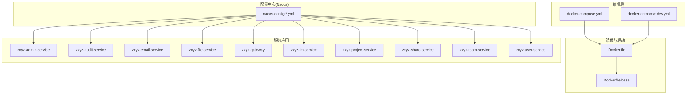
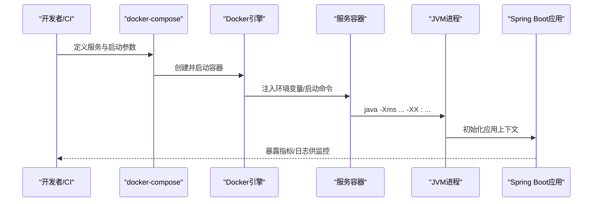
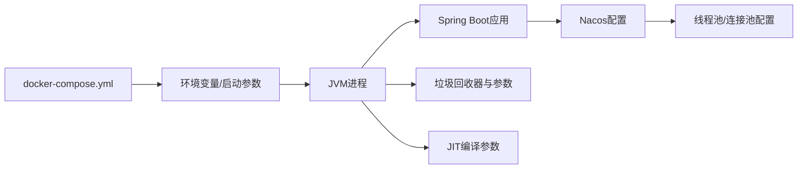

# JVM性能调优

<cite>
**本文引用的文件**   
- [Dockerfile](file://ZXYZdatabaseBack/Dockerfile)
- [Dockerfile.base](file://ZXYZdatabaseBack/Dockerfile.base)
- [docker-compose.yml](file://docker-compose.yml)
- [docker-compose.dev.yml](file://docker-compose.dev.yml)
- [zxyz-admin-service.yml](file://nacos-config/zxyz-admin-service.yml)
- [zxyz-audit-service.yml](file://nacos-config/zxyz-audit-service.yml)
- [zxyz-email-service.yml](file://nacos-config/zxyz-email-service.yml)
- [zxyz-file-service.yml](file://nacos-config/zxyz-file-service.yml)
- [zxyz-gateway.yml](file://nacos-config/zxyz-gateway.yml)
- [zxyz-im-service.yml](file://nacos-config/zxyz-im-service.yml)
- [zxyz-project-service.yml](file://nacos-config/zxyz-project-service.yml)
- [zxyz-share-service.yml](file://nacos-config/zxyz-share-service.yml)
- [zxyz-team-service.yml](file://nacos-config/zxyz-team-service.yml)
- [zxyz-user-service.yml](file://nacos-config/zxyz-user-service.yml)
- [application-prod.yml](file://ZXYZdatabaseBack/zxyz-admin-service/src/main/resources/application-prod.yml)
- [application-prod.yml](file://ZXYZdatabaseBack/zxyz-audit-service/src/main/resources/application-prod.yml)
- [application-prod.yml](file://ZXYZdatabaseBack/zxyz-email-service/src/main/resources/application-prod.yml)
- [application-prod.yml](file://ZXYZdatabaseBack/zxyz-file-service/src/main/resources/application-prod.yml)
- [application-prod.yml](file://ZXYZdatabaseBack/zxyz-im-service/src/main/resources/application-prod.yml)
- [application-prod.yml](file://ZXYZdatabaseBack/zxyz-project-service/src/main/resources/application-prod.yml)
- [application-prod.yml](file://ZXYZdatabaseBack/zxyz-share-service/src/main/resources/application-prod.yml)
- [application-prod.yml](file://ZXYZdatabaseBack/zxyz-team-service/src/main/resources/application-prod.yml)
- [application-prod.yml](file://ZXYZdatabaseBack/zxyz-user-service/src/main/resources/application-prod.yml)
</cite>

## 目录
1. [简介](#简介)
2. [项目结构](#项目结构)
3. [核心组件](#核心组件)
4. [架构总览](#架构总览)
5. [详细组件分析](#详细组件分析)
6. [依赖关系分析](#依赖关系分析)
7. [性能考量](#性能考量)
8. [故障排查指南](#故障排查指南)
9. [结论](#结论)
10. [附录](#附录)

## 简介
本文件面向ZXYZ项目的JVM性能调优，覆盖启动参数、堆内存与新生代配置、垃圾回收器选择与调优、线程池优化、JIT编译参数、监控诊断工具使用以及Docker环境下的最佳实践。文档基于仓库中的Docker编排、Nacos配置与服务配置文件进行梳理，并结合微服务特性给出可落地的建议与检查清单。

## 项目结构
ZXYZ后端采用多模块Maven工程（约11个服务），通过Docker Compose编排运行，Nacos集中管理配置，Jasypt加密敏感项。前端为Vue 3应用，由独立容器提供静态资源与反向代理。JVM相关的关键位置包括：
- Docker镜像构建与启动入口（影响JVM默认行为与环境变量注入）
- Nacos服务级配置（运行时动态生效的JVM参数可通过环境变量或启动脚本注入）
- 各服务的application-prod.yml（生产环境基础配置，通常不包含JVM参数，但会影响线程池、连接池等运行时行为）

图表来源
- [docker-compose.yml](file://docker-compose.yml)
- [docker-compose.dev.yml](file://docker-compose.dev.yml)
- [Dockerfile](file://ZXYZdatabaseBack/Dockerfile)
- [Dockerfile.base](file://ZXYZdatabaseBack/Dockerfile.base)
- [zxyz-admin-service.yml](file://nacos-config/zxyz-admin-service.yml)
- [zxyz-audit-service.yml](file://nacos-config/zxyz-audit-service.yml)
- [zxyz-email-service.yml](file://nacos-config/zxyz-email-service.yml)
- [zxyz-file-service.yml](file://nacos-config/zxyz-file-service.yml)
- [zxyz-gateway.yml](file://nacos-config/zxyz-gateway.yml)
- [zxyz-im-service.yml](file://nacos-config/zxyz-im-service.yml)
- [zxyz-project-service.yml](file://nacos-config/zxyz-project-service.yml)
- [zxyz-share-service.yml](file://nacos-config/zxyz-share-service.yml)
- [zxyz-team-service.yml](file://nacos-config/zxyz-team-service.yml)
- [zxyz-user-service.yml](file://nacos-config/zxyz-user-service.yml)

章节来源
- [docker-compose.yml](file://docker-compose.yml)
- [docker-compose.dev.yml](file://docker-compose.dev.yml)
- [Dockerfile](file://ZXYZdatabaseBack/Dockerfile)
- [Dockerfile.base](file://ZXYZdatabaseBack/Dockerfile.base)

## 核心组件
- 容器编排与启动：通过docker-compose定义服务、资源限制与启动命令；JVM参数可通过环境变量或启动脚本传入容器。
- 配置中心：Nacos集中管理各服务配置，JVM参数一般不在application.yml中设置，而是通过容器环境变量或启动脚本注入。
- 服务应用：每个Spring Boot服务在容器内以java进程运行，受容器资源限制与JVM参数共同影响。

章节来源
- [docker-compose.yml](file://docker-compose.yml)
- [docker-compose.dev.yml](file://docker-compose.dev.yml)
- [Dockerfile](file://ZXYZdatabaseBack/Dockerfile)
- [Dockerfile.base](file://ZXYZdatabaseBack/Dockerfile.base)
- [zxyz-admin-service.yml](file://nacos-config/zxyz-admin-service.yml)
- [zxyz-audit-service.yml](file://nacos-config/zxyz-audit-service.yml)
- [zxyz-email-service.yml](file://nacos-config/zxyz-email-service.yml)
- [zxyz-file-service.yml](file://nacos-config/zxyz-file-service.yml)
- [zxyz-gateway.yml](file://nacos-config/zxyz-gateway.yml)
- [zxyz-im-service.yml](file://nacos-config/zxyz-im-service.yml)
- [zxyz-project-service.yml](file://nacos-config/zxyz-project-service.yml)
- [zxyz-share-service.yml](file://nacos-config/zxyz-share-service.yml)
- [zxyz-team-service.yml](file://nacos-config/zxyz-team-service.yml)
- [zxyz-user-service.yml](file://nacos-config/zxyz-user-service.yml)

## 架构总览
下图展示JVM参数在ZXYZ系统中的注入路径与生效范围：从编排层到容器运行时再到JVM进程。

图表来源
- [docker-compose.yml](file://docker-compose.yml)
- [docker-compose.dev.yml](file://docker-compose.dev.yml)
- [Dockerfile](file://ZXYZdatabaseBack/Dockerfile)
- [Dockerfile.base](file://ZXYZdatabaseBack/Dockerfile.base)

## 详细组件分析

### JVM启动参数与堆内存配置
- 初始堆与最大堆：-Xms与-Xmx建议设置为相等值，避免运行时堆扩容带来的停顿与抖动。
- 新生代大小：-Xmn或-XX:NewRatio用于控制新生代比例。对于吞吐优先的服务，适当增大新生代可减少Minor GC频率；对于延迟敏感场景，需结合GC日志评估。
- 老年代优化：-XX:MaxTenuringThreshold、-XX:SurvivorRatio等影响对象晋升策略，需根据对象生命周期特征调整。
- 元空间与代码缓存：-XX:MetaspaceSize、-XX:MaxMetaspaceSize防止类加载导致的OOM；-XX:ReservedCodeCacheSize对JIT编译热点方法有利。
- 直接内存与栈大小：-XX:MaxDirectMemorySize、-Xss按业务IO与线程模型设定。

章节来源
- [Dockerfile](file://ZXYZdatabaseBack/Dockerfile)
- [Dockerfile.base](file://ZXYZdatabaseBack/Dockerfile.base)
- [docker-compose.yml](file://docker-compose.yml)
- [docker-compose.dev.yml](file://docker-compose.dev.yml)

### 垃圾回收器选择与调优
- G1 GC：适合大堆与低延迟目标，参数如-XX:+UseG1GC、-XX:MaxGCPauseMillis、-XX:G1HeapRegionSize、-XX:InitiatingHeapOccupancyPercent。适用于大多数微服务。
- ZGC：低停顿、高吞吐，适合大堆与强延迟要求，参数如-XX:+UseZGC、-XX:ConcGCThreads、-XX:ZCollectionInterval。需要较新JDK版本支持。
- Shenandoah GC：低停顿且吞吐较好，参数如-XX:+UseShenandoahGC、-XX:ShenandoahHeuristics、-XX:ShenandoahGCMode。同样需要合适JDK版本。
- 选择策略：根据堆大小、延迟SLA、CPU核数与JDK版本综合决定；先启用GC日志，再逐步调参。

章节来源
- [Dockerfile](file://ZXYZdatabaseBack/Dockerfile)
- [Dockerfile.base](file://ZXYZdatabaseBack/Dockerfile.base)
- [docker-compose.yml](file://docker-compose.yml)
- [docker-compose.dev.yml](file://docker-compose.dev.yml)

### 线程池配置优化
- 核心线程数与最大线程数：CPU密集型建议core=max=CPU核数；IO密集型可按CPU核数×(1+平均等待时间/计算时间)估算。
- 队列容量：无界队列可能导致内存压力，建议使用有界队列配合拒绝策略；队列长度需压测确定。
- 拒绝策略：AbortPolicy抛出异常便于快速失败；CallerRunsPolicy降低提交速率；DiscardOldestPolicy丢弃最旧任务；自定义策略可记录告警。
- Spring线程池：@Async、ThreadPoolTaskExecutor等需显式配置，避免默认值不匹配业务负载。

章节来源
- [application-prod.yml](file://ZXYZdatabaseBack/zxyz-admin-service/src/main/resources/application-prod.yml)
- [application-prod.yml](file://ZXYZdatabaseBack/zxyz-audit-service/src/main/resources/application-prod.yml)
- [application-prod.yml](file://ZXYZdatabaseBack/zxyz-email-service/src/main/resources/application-prod.yml)
- [application-prod.yml](file://ZXYZdatabaseBack/zxyz-file-service/src/main/resources/application-prod.yml)
- [application-prod.yml](file://ZXYZdatabaseBack/zxyz-im-service/src/main/resources/application-prod.yml)
- [application-prod.yml](file://ZXYZdatabaseBack/zxyz-project-service/src/main/resources/application-prod.yml)
- [application-prod.yml](file://ZXYZdatabaseBack/zxyz-share-service/src/main/resources/application-prod.yml)
- [application-prod.yml](file://ZXYZdatabaseBack/zxyz-team-service/src/main/resources/application-prod.yml)
- [application-prod.yml](file://ZXYZdatabaseBack/zxyz-user-service/src/main/resources/application-prod.yml)

### JIT编译优化参数
- 编译阈值：-XX:CompileThreshold、-XX:OnStackReplacePercentage、-XX:FreqInlineSize影响热点方法编译时机与内联。
- 内联优化：-XX:+AlwaysInliner、-XX:MaxInlineLevel、-XX:MaxInlineSize提升执行效率，但会增加编译时间与代码缓存占用。
- 逃逸分析与锁消除：-XX:+DoEscapeAnalysis、-XX:+EliminateAllocations减少分配与锁竞争，需结合GC与对象分配模式评估。
- 编译日志：-XX:+PrintCompilation、-XX:+UnlockDiagnosticVMOptions辅助定位瓶颈。

章节来源
- [Dockerfile](file://ZXYZdatabaseBack/Dockerfile)
- [Dockerfile.base](file://ZXYZdatabaseBack/Dockerfile.base)

### 监控与诊断工具使用指南
- jstat：实时查看GC统计、类加载、编译器状态，常用-c、-gc、-gccapacity、-gcutil。
- jmap：生成堆转储、查看对象分布，结合MAT或JProfiler分析内存泄漏与热点对象。
- jstack：抓取线程快照，定位死锁、阻塞与CPU飙高线程。
- Arthas：在线诊断与热更新，支持thread、jvm、dashboard、trace、watch等命令，适合生产环境快速排障。
- GC日志：开启-XX:+PrintGCDetails、-Xlog:gc*（新版JDK），结合gceasy.io或GCViewer分析停顿与吞吐量。

章节来源
- [Dockerfile](file://ZXYZdatabaseBack/Dockerfile)
- [Dockerfile.base](file://ZXYZdatabaseBack/Dockerfile.base)
- [docker-compose.yml](file://docker-compose.yml)
- [docker-compose.dev.yml](file://docker-compose.dev.yml)

### Docker环境下的JVM参数最佳实践
- 容器感知：使用-XX:+UseContainerSupport（JDK8u191+/JDK11+默认启用），确保JVM识别容器Cgroup限制。
- 堆大小与容器限制：-Xms/-Xmx应小于等于容器内存上限，预留系统与非堆内存；避免OOMKilled。
- 启动参数注入：通过docker-compose environment或entrypoint脚本统一注入，便于环境与版本隔离。
- 日志与指标：将GC日志与Arthas输出挂载至宿主机或日志收集系统，便于集中分析。
- 安全与只读：最小化镜像层、关闭调试端口、限制文件系统写入权限。

章节来源
- [docker-compose.yml](file://docker-compose.yml)
- [docker-compose.dev.yml](file://docker-compose.dev.yml)
- [Dockerfile](file://ZXYZdatabaseBack/Dockerfile)
- [Dockerfile.base](file://ZXYZdatabaseBack/Dockerfile.base)

## 依赖关系分析
JVM参数在各层的依赖关系如下：编排层定义容器资源与启动命令，镜像层提供JDK与运行环境，服务层读取Nacos配置并初始化线程池与连接池，最终由JVM进程执行。

图表来源
- [docker-compose.yml](file://docker-compose.yml)
- [docker-compose.dev.yml](file://docker-compose.dev.yml)
- [Dockerfile](file://ZXYZdatabaseBack/Dockerfile)
- [Dockerfile.base](file://ZXYZdatabaseBack/Dockerfile.base)
- [zxyz-admin-service.yml](file://nacos-config/zxyz-admin-service.yml)
- [zxyz-audit-service.yml](file://nacos-config/zxyz-audit-service.yml)
- [zxyz-email-service.yml](file://nacos-config/zxyz-email-service.yml)
- [zxyz-file-service.yml](file://nacos-config/zxyz-file-service.yml)
- [zxyz-gateway.yml](file://nacos-config/zxyz-gateway.yml)
- [zxyz-im-service.yml](file://nacos-config/zxyz-im-service.yml)
- [zxyz-project-service.yml](file://nacos-config/zxyz-project-service.yml)
- [zxyz-share-service.yml](file://nacos-config/zxyz-share-service.yml)
- [zxyz-team-service.yml](file://nacos-config/zxyz-team-service.yml)
- [zxyz-user-service.yml](file://nacos-config/zxyz-user-service.yml)

章节来源
- [docker-compose.yml](file://docker-compose.yml)
- [docker-compose.dev.yml](file://docker-compose.dev.yml)
- [Dockerfile](file://ZXYZdatabaseBack/Dockerfile)
- [Dockerfile.base](file://ZXYZdatabaseBack/Dockerfile.base)
- [zxyz-admin-service.yml](file://nacos-config/zxyz-admin-service.yml)
- [zxyz-audit-service.yml](file://nacos-config/zxyz-audit-service.yml)
- [zxyz-email-service.yml](file://nacos-config/zxyz-email-service.yml)
- [zxyz-file-service.yml](file://nacos-config/zxyz-file-service.yml)
- [zxyz-gateway.yml](file://nacos-config/zxyz-gateway.yml)
- [zxyz-im-service.yml](file://nacos-config/zxyz-im-service.yml)
- [zxyz-project-service.yml](file://nacos-config/zxyz-project-service.yml)
- [zxyz-share-service.yml](file://nacos-config/zxyz-share-service.yml)
- [zxyz-team-service.yml](file://nacos-config/zxyz-team-service.yml)
- [zxyz-user-service.yml](file://nacos-config/zxyz-user-service.yml)

## 性能考量
- 吞吐与延迟权衡：G1/ZGC/Shenandoah在不同场景下表现不同，需结合压测与GC日志选择。
- 对象分配与晋升：合理设置Survivor区与晋升阈值，减少Full GC触发。
- 线程模型：避免过多线程导致上下文切换开销；合理设置队列与拒绝策略，保障稳定性。
- JIT编译：热点方法内联与逃逸分析能显著提升性能，但需关注编译时间与代码缓存占用。
- 容器资源：确保JVM感知容器限制，避免超卖与OOMKilled。

[本节为通用指导，不直接分析具体文件]

## 故障排查指南
- CPU飙高：使用jstack抓取线程快照，定位热点方法与锁竞争；结合Arthas的thread命令观察线程状态。
- 内存泄漏：使用jmap生成堆转储，借助MAT分析对象引用链；关注大对象与集合增长趋势。
- GC频繁：开启GC日志，分析Minor/Full GC频率与停顿时间；调整新生代大小与晋升阈值。
- 线程阻塞：检查线程池队列是否溢出、拒绝策略是否触发；排查外部依赖超时与锁等待。
- 容器问题：确认容器内存/CPU限制与JVM参数匹配；检查日志卷挂载与指标采集。

章节来源
- [Dockerfile](file://ZXYZdatabaseBack/Dockerfile)
- [Dockerfile.base](file://ZXYZdatabaseBack/Dockerfile.base)
- [docker-compose.yml](file://docker-compose.yml)
- [docker-compose.dev.yml](file://docker-compose.dev.yml)

## 结论
ZXYZ项目的JVM调优应从容器编排与镜像构建入手，统一通过环境变量或启动脚本注入参数；结合Nacos配置优化线程池与连接池；依据业务特征选择合适的垃圾回收器并持续观测GC日志；利用jstat/jmap/jstack/Arthas进行在线诊断；在Docker环境中确保JVM与容器资源一致，避免OOM与性能抖动。

[本节为总结性内容，不直接分析具体文件]

## 附录
- 常用JVM参数清单：-Xms、-Xmx、-Xmn、-XX:NewRatio、-XX:+UseG1GC、-XX:MaxGCPauseMillis、-XX:+UseZGC、-XX:+UseShenandoahGC、-XX:MetaspaceSize、-XX:MaxMetaspaceSize、-XX:+PrintGCDetails、-XX:+PrintCompilation。
- 监控指标：GC次数与停顿时间、堆使用率、线程活跃数、队列长度、拒绝次数、编译次数与耗时。
- 压测建议：逐步增加并发与数据量，观察GC日志与系统指标，迭代调整参数。

[本节为补充信息，不直接分析具体文件]