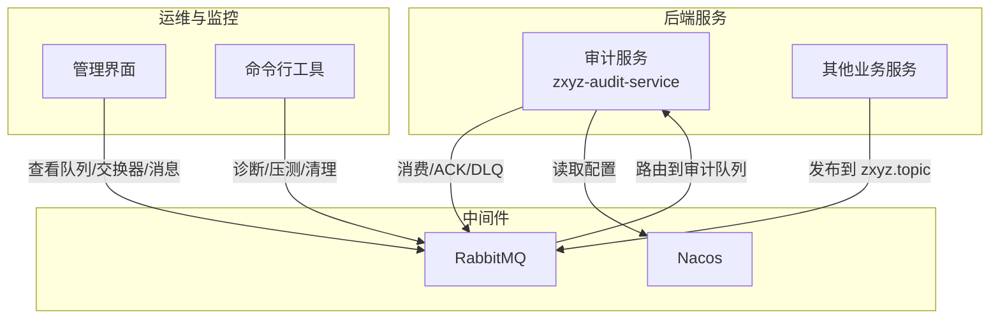
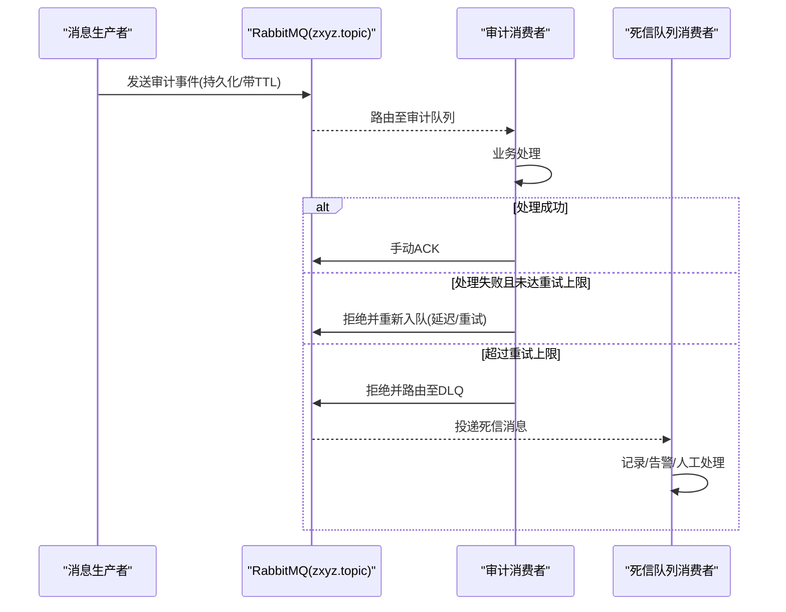
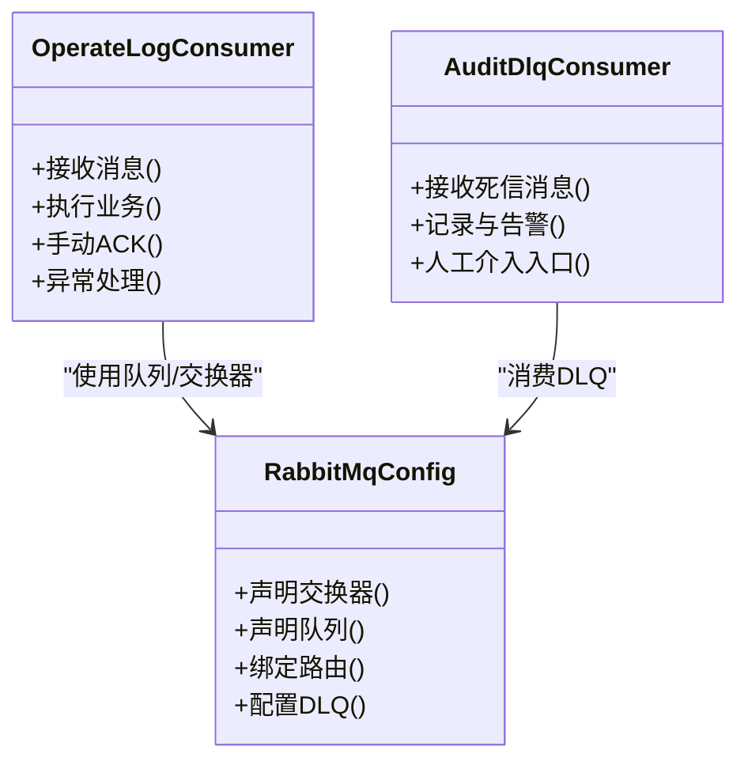

# RabbitMQ消息队列优化

<cite>
**本文引用的文件**   
- [RabbitMqConfig.java](file://ZXYZdatabaseBack/zxyz-audit-service/src/main/java/uno/acloud/audit/config/RabbitMqConfig.java)
- [OperateLogConsumer.java](file://ZXYZdatabaseBack/zxyz-audit-service/src/main/java/uno/acloud/audit/mq/OperateLogConsumer.java)
- [AuditDlqConsumer.java](file://ZXYZdatabaseBack/zxyz-audit-service/src/main/java/uno/acloud/audit/mq/AuditDlqConsumer.java)
- [application.yml（审计服务）](file://ZXYZdatabaseBack/zxyz-audit-service/src/main/resources/application.yml)
- [application-dev.yml（审计服务）](file://ZXYZdatabaseBack/zxyz-audit-service/src/main/resources/application-dev.yml)
- [application-prod.yml（审计服务）](file://ZXYZdatabaseBack/zxyz-audit-service/src/main/resources/application-prod.yml)
- [zxyz-audit-service.yml（Nacos配置）](file://nacos-config/zxyz-audit-service.yml)
- [docker-compose.yml](file://docker-compose.yml)
- [架构说明文档](file://docs/architecture.md)
</cite>

## 目录
1. [引言](#引言)
2. [项目结构](#项目结构)
3. [核心组件](#核心组件)
4. [架构总览](#架构总览)
5. [详细组件分析](#详细组件分析)
6. [依赖关系分析](#依赖关系分析)
7. [性能考虑](#性能考虑)
8. [故障排查指南](#故障排查指南)
9. [结论](#结论)
10. [附录](#附录)

## 引言
本指南面向ZXYZ项目的RabbitMQ消息队列性能优化，覆盖生产者、消费者、积压处理、集群与资源、监控调试以及幂等性设计等方面。结合项目中审计服务的RabbitMQ使用实践，给出可落地的调优建议与最佳实践，帮助在保障可靠性的同时提升吞吐与稳定性。

## 项目结构
ZXYZ采用微服务架构，异步通信统一通过RabbitMQ Topic Exchange zxyz.topic进行。审计服务包含RabbitMQ配置与消费者实现，并具备死信队列处理能力；其他服务可通过通用客户端或MQ封装进行消息收发。部署层面使用Docker Compose编排基础设施与后端服务，配置由Nacos统一管理。

图表来源
- [架构说明文档](file://docs/architecture.md)
- [docker-compose.yml](file://docker-compose.yml)

章节来源
- [架构说明文档](file://docs/architecture.md)
- [docker-compose.yml](file://docker-compose.yml)

## 核心组件
- 审计服务RabbitMQ配置：定义连接参数、交换器、队列、绑定及死信队列策略。
- 操作日志消费者：负责从审计队列拉取消息、执行业务处理与手动ACK。
- 死信队列消费者：处理失败重试耗尽的消息，便于人工干预与二次分析。
- 应用配置：通过application与Nacos集中管理RabbitMQ连接与行为开关。

章节来源
- [RabbitMqConfig.java](file://ZXYZdatabaseBack/zxyz-audit-service/src/main/java/uno/acloud/audit/config/RabbitMqConfig.java)
- [OperateLogConsumer.java](file://ZXYZdatabaseBack/zxyz-audit-service/src/main/java/uno/acloud/audit/mq/OperateLogConsumer.java)
- [AuditDlqConsumer.java](file://ZXYZdatabaseBack/zxyz-audit-service/src/main/java/uno/acloud/audit/mq/AuditDlqConsumer.java)
- [application.yml（审计服务）](file://ZXYZdatabaseBack/zxyz-audit-service/src/main/resources/application.yml)
- [application-dev.yml（审计服务）](file://ZXYZdatabaseBack/zxyz-audit-service/src/main/resources/application-dev.yml)
- [application-prod.yml（审计服务）](file://ZXYZdatabaseBack/zxyz-audit-service/src/main/resources/application-prod.yml)
- [zxyz-audit-service.yml（Nacos配置）](file://nacos-config/zxyz-audit-service.yml)

## 架构总览
下图展示审计服务中消息从生产到消费、失败进入死信队列的完整流程，体现手动ACK与DLQ机制的配合。

图表来源
- [OperateLogConsumer.java](file://ZXYZdatabaseBack/zxyz-audit-service/src/main/java/uno/acloud/audit/mq/OperateLogConsumer.java)
- [AuditDlqConsumer.java](file://ZXYZdatabaseBack/zxyz-audit-service/src/main/java/uno/acloud/audit/mq/AuditDlqConsumer.java)
- [RabbitMqConfig.java](file://ZXYZdatabaseBack/zxyz-audit-service/src/main/java/uno/acloud/audit/config/RabbitMqConfig.java)

## 详细组件分析

### 生产者优化要点
- 批量发送：在高吞吐场景下，将多条消息合并为批次发送，减少网络往返与握手开销。注意控制批次大小以避免单条过大导致内存压力。
- 确认机制：开启publisher confirms确保消息到达Broker；必要时配合return回调处理不可路由消息。
- 持久化配置：对关键队列与消息启用持久化，避免Broker重启丢失；权衡I/O成本与可靠性需求。
- 交换器类型选择：统一使用Topic Exchange以支持灵活的路由键匹配；热点路由键需评估倾斜风险。

章节来源
- [RabbitMqConfig.java](file://ZXYZdatabaseBack/zxyz-audit-service/src/main/java/uno/acloud/audit/config/RabbitMqConfig.java)
- [application.yml（审计服务）](file://ZXYZdatabaseBack/zxyz-audit-service/src/main/resources/application.yml)

### 消费者性能调优
- 预取计数：合理设置prefetch，使消费者保持“少量未确认”的工作集，避免背压堆积；根据CPU与下游IO能力动态调整。
- 并发消费：在同一队列上启动多个消费者实例，提升并行处理能力；注意幂等与顺序要求。
- 手动ACK处理：业务逻辑完成后显式ACK；异常时按策略拒绝并决定是否重入队或转入DLQ。
- 死信队列配置：为队列配置x-dead-letter-exchange与x-dead-letter-routing-key，捕获重试耗尽的消息，便于隔离与修复。

章节来源
- [OperateLogConsumer.java](file://ZXYZdatabaseBack/zxyz-audit-service/src/main/java/uno/acloud/audit/mq/OperateLogConsumer.java)
- [AuditDlqConsumer.java](file://ZXYZdatabaseBack/zxyz-audit-service/src/main/java/uno/acloud/audit/mq/AuditDlqConsumer.java)
- [RabbitMqConfig.java](file://ZXYZdatabaseBack/zxyz-audit-service/src/main/java/uno/acloud/audit/config/RabbitMqConfig.java)

### 消息积压处理方法
- 扩容消费者：临时增加消费者实例数量，快速消化积压；恢复后回滚规模。
- 临时队列分流：将积压消息路由到新队列并由新消费者处理，原队列继续稳定消费。
- 消息清理策略：对过期或无效消息执行安全清理；保留审计轨迹与告警记录。

章节来源
- [OperateLogConsumer.java](file://ZXYZdatabaseBack/zxyz-audit-service/src/main/java/uno/acloud/audit/mq/OperateLogConsumer.java)
- [AuditDlqConsumer.java](file://ZXYZdatabaseBack/zxyz-audit-service/src/main/java/uno/acloud/audit/mq/AuditDlqConsumer.java)

### 集群与资源优化
- 镜像队列：在跨机房高可用场景启用镜像队列，保证节点故障时数据不丢失；注意复制带来的额外负载。
- 网络分区：关注网络抖动导致的分区与脑裂，合理设置心跳与超时；出现分区时优先保证一致性。
- 资源限制：对队列长度、交换器数量、连接数设置上限，防止单点过载影响整体可用性。

章节来源
- [docker-compose.yml](file://docker-compose.yml)
- [zxyz-audit-service.yml（Nacos配置）](file://nacos-config/zxyz-audit-service.yml)

### 监控与调试
- 管理界面：通过Web UI观察队列长度、消息速率、消费者状态、DLQ增长趋势。
- 命令行工具：使用rabbitmqctl/rabbitmq-diagnostics进行健康检查、队列统计与诊断。
- 指标收集：采集Broker与客户端指标（如确认率、延迟、GC、线程池），结合Prometheus/Grafana可视化。

章节来源
- [docker-compose.yml](file://docker-compose.yml)
- [application.yml（审计服务）](file://ZXYZdatabaseBack/zxyz-audit-service/src/main/resources/application.yml)

### 幂等性与重复消息处理
- 幂等设计：为每条消息生成唯一ID，并在存储层建立唯一约束或去重表，确保重复消费不产生副作用。
- 重复检测：在处理前查询是否已处理过，命中则直接ACK返回。
- 补偿与修复：对异常分支提供补偿接口，结合DLQ与人工复核完成最终一致。

章节来源
- [OperateLogConsumer.java](file://ZXYZdatabaseBack/zxyz-audit-service/src/main/java/uno/acloud/audit/mq/OperateLogConsumer.java)
- [AuditDlqConsumer.java](file://ZXYZdatabaseBack/zxyz-audit-service/src/main/java/uno/acloud/audit/mq/AuditDlqConsumer.java)

## 依赖关系分析
审计服务对RabbitMQ的依赖集中在配置与消费者两个层面：配置类声明交换器、队列、绑定与DLQ；消费者实现消息处理与ACK逻辑。运行时依赖由容器编排与Nacos配置注入。

图表来源
- [RabbitMqConfig.java](file://ZXYZdatabaseBack/zxyz-audit-service/src/main/java/uno/acloud/audit/config/RabbitMqConfig.java)
- [OperateLogConsumer.java](file://ZXYZdatabaseBack/zxyz-audit-service/src/main/java/uno/acloud/audit/mq/OperateLogConsumer.java)
- [AuditDlqConsumer.java](file://ZXYZdatabaseBack/zxyz-audit-service/src/main/java/uno/acloud/audit/mq/AuditDlqConsumer.java)

章节来源
- [RabbitMqConfig.java](file://ZXYZdatabaseBack/zxyz-audit-service/src/main/java/uno/acloud/audit/config/RabbitMqConfig.java)
- [OperateLogConsumer.java](file://ZXYZdatabaseBack/zxyz-audit-service/src/main/java/uno/acloud/audit/mq/OperateLogConsumer.java)
- [AuditDlqConsumer.java](file://ZXYZdatabaseBack/zxyz-audit-service/src/main/java/uno/acloud/audit/mq/AuditDlqConsumer.java)

## 性能考虑
- 生产者侧
  - 批量化：按时间窗口或消息数量触发批量发送，降低系统调用次数。
  - 确认与退回：开启confirm与return，及时感知丢消息与路由失败。
  - 持久化权衡：对关键路径开启持久化，非关键路径可关闭以提升吞吐。
  - 路由键设计：避免热点key导致单队列拥塞，必要时拆分队列。
- 消费者侧
  - prefetch与并发：根据CPU与下游能力设定prefetch，水平扩展消费者实例。
  - 事务边界：尽量缩短事务范围，避免长事务阻塞队列。
  - 错误隔离：区分可重试与不可重试错误，后者直接进入DLQ。
- 集群与资源
  - 镜像队列：按需启用，评估复制开销。
  - 资源上限：限制队列长度、连接数、交换器数量，保护Broker。
  - 网络与健康：心跳、超时、分区检测与恢复策略。
- 监控与可观测性
  - 指标：确认率、平均延迟、队列长度、消费者空闲率、DLQ增长率。
  - 告警：阈值告警与自动扩缩容联动。
  - 日志：结构化日志与链路追踪，定位慢消费与异常。

[本节为通用指导，不直接分析具体文件]

## 故障排查指南
- 常见问题
  - 消息未消费：检查消费者状态、prefetch设置、手动ACK是否正确。
  - 消息堆积：观察队列长度与消费者速率，必要时扩容或分流。
  - 死信激增：分析失败原因，完善重试与降级策略。
  - 重复消费：确认幂等设计与去重机制是否生效。
- 排查步骤
  - 使用管理界面查看队列、消费者、消息详情。
  - 使用命令行工具获取Broker与队列统计信息。
  - 检查应用日志与指标，定位瓶颈与异常。
  - 针对DLQ消息进行抽样分析与修复。

章节来源
- [OperateLogConsumer.java](file://ZXYZdatabaseBack/zxyz-audit-service/src/main/java/uno/acloud/audit/mq/OperateLogConsumer.java)
- [AuditDlqConsumer.java](file://ZXYZdatabaseBack/zxyz-audit-service/src/main/java/uno/acloud/audit/mq/AuditDlqConsumer.java)
- [application.yml（审计服务）](file://ZXYZdatabaseBack/zxyz-audit-service/src/main/resources/application.yml)

## 结论
通过对生产者、消费者、积压处理、集群与资源、监控与幂等性的系统化优化，ZXYZ项目的RabbitMQ消息队列可在高吞吐与高可靠之间取得平衡。建议在生产环境持续采集指标、完善告警与自动化扩缩容，并结合业务特性迭代路由键与队列划分策略，持续提升整体稳定性与性能。

[本节为总结性内容，不直接分析具体文件]

## 附录
- 相关配置文件路径
  - 审计服务应用配置：application.yml、application-dev.yml、application-prod.yml
  - Nacos配置：zxyz-audit-service.yml
  - 容器编排：docker-compose.yml
- 参考文档
  - 架构说明文档：docs/architecture.md

章节来源
- [application.yml（审计服务）](file://ZXYZdatabaseBack/zxyz-audit-service/src/main/resources/application.yml)
- [application-dev.yml（审计服务）](file://ZXYZdatabaseBack/zxyz-audit-service/src/main/resources/application-dev.yml)
- [application-prod.yml（审计服务）](file://ZXYZdatabaseBack/zxyz-audit-service/src/main/resources/application-prod.yml)
- [zxyz-audit-service.yml（Nacos配置）](file://nacos-config/zxyz-audit-service.yml)
- [docker-compose.yml](file://docker-compose.yml)
- [架构说明文档](file://docs/architecture.md)