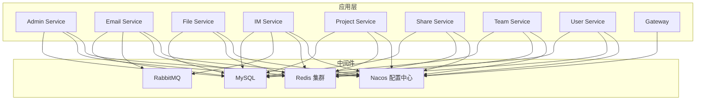
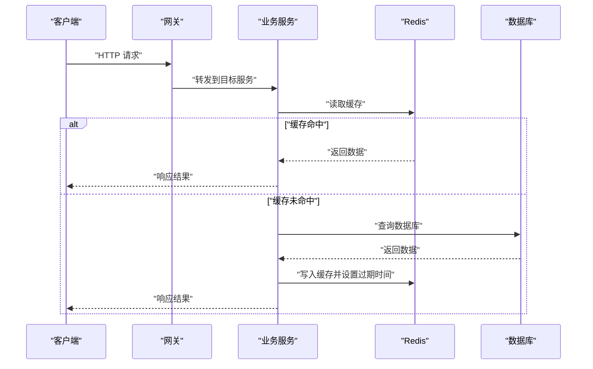
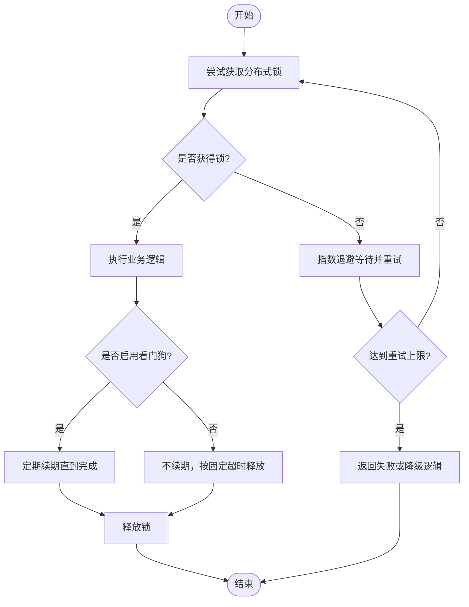
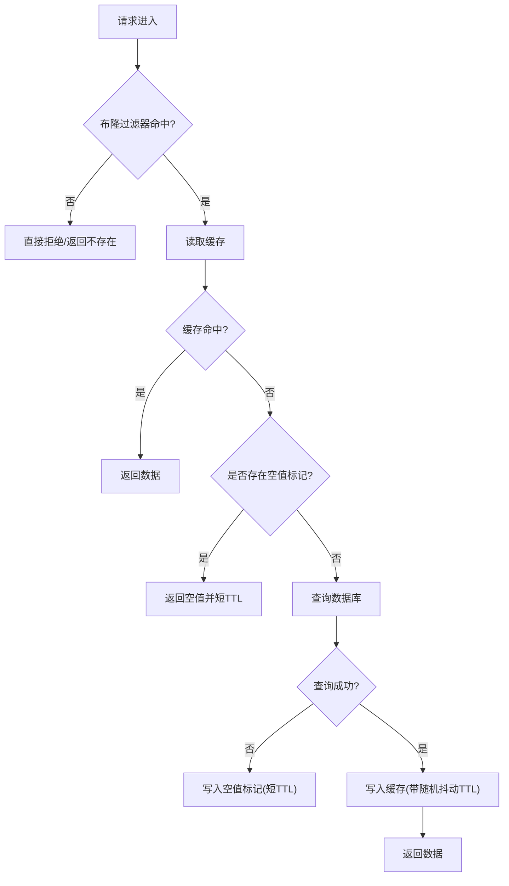
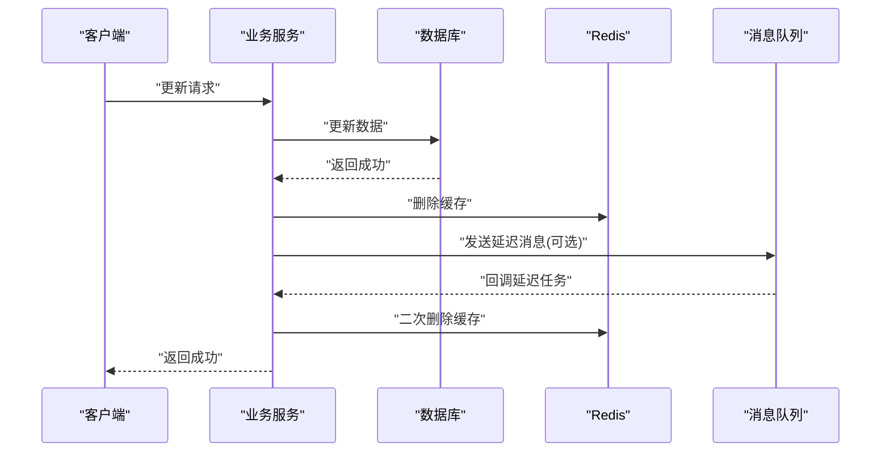
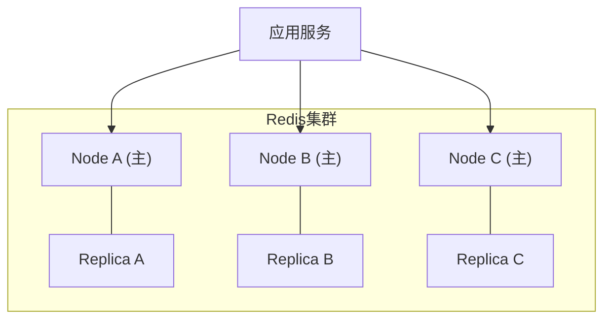
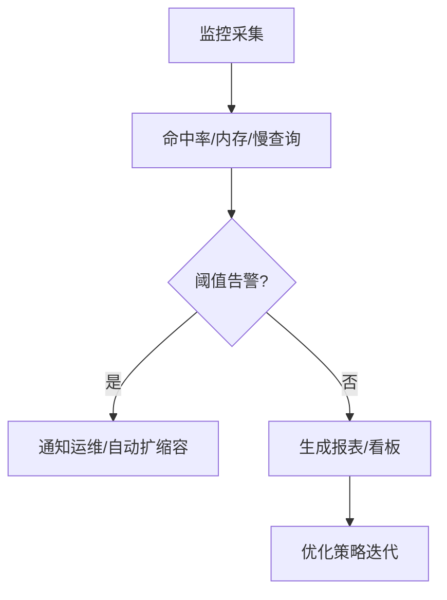
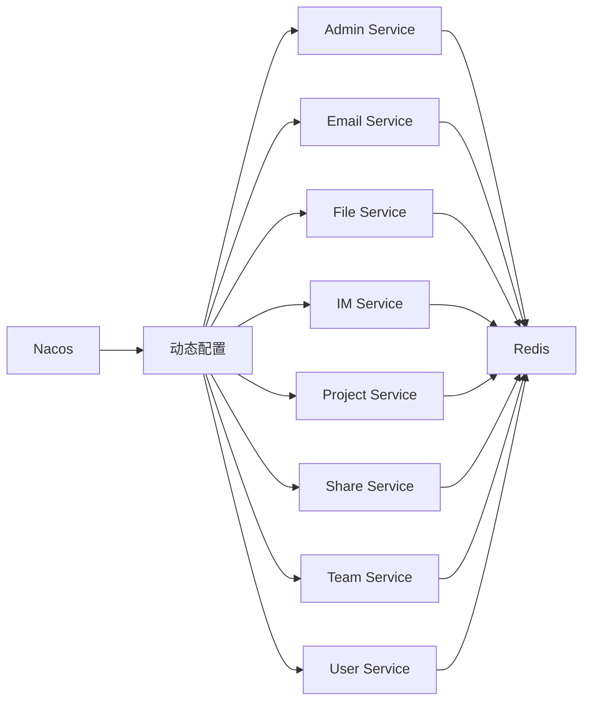

# Redis缓存优化

<cite>
**本文引用的文件**   
- [docker-compose.yml](file://docker-compose.yml)
- [zxyz-dynamic.yml](file://nacos-config/zxyz-dynamic.yml)
- [application-dev.yml](file://ZXYZdatabaseBack/zxyz-admin-service/src/main/resources/application-dev.yml)
- [application-prod.yml](file://ZXYZdatabaseBack/zxyz-admin-service/src/main/resources/application-prod.yml)
- [application.yml](file://ZXYZdatabaseBack/zxyz-admin-service/src/main/resources/application.yml)
- [application-dev.yml](file://ZXYZdatabaseBack/zxyz-email-service/src/main/resources/application-dev.yml)
- [application-prod.yml](file://ZXYZdatabaseBack/zxyz-email-service/src/main/resources/application-prod.yml)
- [application.yml](file://ZXYZdatabaseBack/zxyz-email-service/src/main/resources/application.yml)
- [application-dev.yml](file://ZXYZdatabaseBack/zxyz-file-service/src/main/resources/application-dev.yml)
- [application-prod.yml](file://ZXYZdatabaseBack/zxyz-file-service/src/main/resources/application-prod.yml)
- [application.yml](file://ZXYZdatabaseBack/zxyz-file-service/src/main/resources/application.yml)
- [application-dev.yml](file://ZXYZdatabaseBack/zxyz-im-service/src/main/resources/application-dev.yml)
- [application-prod.yml](file://ZXYZdatabaseBack/zxyz-im-service/src/main/resources/application-prod.yml)
- [application.yml](file://ZXYZdatabaseBack/zxyz-im-service/src/main/resources/application.yml)
- [application-dev.yml](file://ZXYZdatabaseBack/zxyz-project-service/src/main/resources/application-dev.yml)
- [application-prod.yml](file://ZXYZdatabaseBack/zxyz-project-service/src/main/resources/application-prod.yml)
- [application.yml](file://ZXYZdatabaseBack/zxyz-project-service/src/main/resources/application.yml)
- [application-dev.yml](file://ZXYZdatabaseBack/zxyz-share-service/src/main/resources/application-dev.yml)
- [application-prod.yml](file://ZXYZdatabaseBack/zxyz-share-service/src/main/resources/application-prod.yml)
- [application.yml](file://ZXYZdatabaseBack/zxyz-share-service/src/main/resources/application.yml)
- [application-dev.yml](file://ZXYZdatabaseBack/zxyz-team-service/src/main/resources/application-dev.yml)
- [application-prod.yml](file://ZXYZdatabaseBack/zxyz-team-service/src/main/resources/application-prod.yml)
- [application.yml](file://ZXYZdatabaseBack/zxyz-team-service/src/main/resources/application.yml)
- [application-dev.yml](file://ZXYZdatabaseBack/zxyz-user-service/src/main/resources/application-dev.yml)
- [application-prod.yml](file://ZXYZdatabaseBack/zxyz-user-service/src/main/resources/application-prod.yml)
- [application.yml](file://ZXYZdatabaseBack/zxyz-user-service/src/main/resources/application.yml)
- [application.yml](file://ZXYZdatabaseBack/zxyz-gateway/src/main/resources/application.yml)
- [pom.xml](file://ZXYZdatabaseBack/pom.xml)
- [Dockerfile.base](file://Dockerfile.base)
- [deploy.sh](file://ZXYZdatabaseBack/zxyz-project-service/deploy/deploy.sh)
- [health-check.sh](file://scripts/health-check.sh)
</cite>

## 目录
1. [引言](#引言)
2. [项目结构](#项目结构)
3. [核心组件](#核心组件)
4. [架构总览](#架构总览)
5. [详细组件分析](#详细组件分析)
6. [依赖关系分析](#依赖关系分析)
7. [性能考量](#性能考量)
8. [故障排查指南](#故障排查指南)
9. [结论](#结论)
10. [附录](#附录)

## 引言
本文件面向ZXYZ项目的Redis缓存优化，覆盖分布式锁（Redisson）、缓存策略（穿透/雪崩/热点预热）、一致性方案（Cache-Aside、Binlog订阅、延迟双删）、集群配置与监控调试、数据结构选择与序列化优化等主题。文档基于仓库中的容器编排、Nacos动态配置与各服务配置文件进行归纳，并结合微服务架构特点给出可落地的优化建议。

## 项目结构
ZXYZ采用多模块后端（Maven）+ Vue前端 + Docker Compose编排的架构。Redis作为共享缓存与分布式锁基础设施，通过Nacos集中管理各服务的连接参数与特性开关；生产环境通常以集群模式部署，配合健康检查脚本保障可用性。

图表来源
- [docker-compose.yml](file://docker-compose.yml)
- [zxyz-dynamic.yml](file://nacos-config/zxyz-dynamic.yml)

章节来源
- [docker-compose.yml](file://docker-compose.yml)
- [zxyz-dynamic.yml](file://nacos-config/zxyz-dynamic.yml)

## 核心组件
- Redis客户端与连接池：由各服务通过Spring Boot自动装配或自定义配置引入，连接参数由Nacos动态下发。
- 分布式锁：基于Redisson实现，用于跨实例互斥操作（如热点数据重建、任务调度）。
- 缓存读写：以Cache-Aside为主，结合本地缓存（按需）与多级缓存策略。
- 事件驱动一致性：通过消息队列与数据库变更监听（Binlog）触发缓存失效或更新。

章节来源
- [zxyz-dynamic.yml](file://nacos-config/zxyz-dynamic.yml)
- [application.yml](file://ZXYZdatabaseBack/zxyz-admin-service/src/main/resources/application.yml)
- [application.yml](file://ZXYZdatabaseBack/zxyz-email-service/src/main/resources/application.yml)
- [application.yml](file://ZXYZdatabaseBack/zxyz-file-service/src/main/resources/application.yml)
- [application.yml](file://ZXYZdatabaseBack/zxyz-im-service/src/main/resources/application.yml)
- [application.yml](file://ZXYZdatabaseBack/zxyz-project-service/src/main/resources/application.yml)
- [application.yml](file://ZXYZdatabaseBack/zxyz-share-service/src/main/resources/application.yml)
- [application.yml](file://ZXYZdatabaseBack/zxyz-team-service/src/main/resources/application.yml)
- [application.yml](file://ZXYZdatabaseBack/zxyz-user-service/src/main/resources/application.yml)

## 架构总览
下图展示请求在网关、业务服务、Redis与数据库之间的典型路径，以及缓存命中与未命中的分支处理。

图表来源
- [application.yml](file://ZXYZdatabaseBack/zxyz-admin-service/src/main/resources/application.yml)
- [application.yml](file://ZXYZdatabaseBack/zxyz-email-service/src/main/resources/application.yml)
- [application.yml](file://ZXYZdatabaseBack/zxyz-file-service/src/main/resources/application.yml)
- [application.yml](file://ZXYZdatabaseBack/zxyz-im-service/src/main/resources/application.yml)
- [application.yml](file://ZXYZdatabaseBack/zxyz-project-service/src/main/resources/application.yml)
- [application.yml](file://ZXYZdatabaseBack/zxyz-share-service/src/main/resources/application.yml)
- [application.yml](file://ZXYZdatabaseBack/zxyz-team-service/src/main/resources/application.yml)
- [application.yml](file://ZXYZdatabaseBack/zxyz-user-service/src/main/resources/application.yml)

## 详细组件分析

### Redisson分布式锁配置与优化
- 锁超时时间：根据业务耗时合理设置，避免过短导致误释放、过长影响并发度。
- 重试机制：对获取锁失败场景进行指数退避重试，降低瞬时竞争导致的失败率。
- 看门狗机制：开启续期能力，防止长事务执行期间锁被提前释放。
- 锁粒度：尽量细化到键级，避免热点键竞争放大。
- 锁升级与降级：读多写少场景可采用读写锁分离，提升吞吐。

图表来源
- [application.yml](file://ZXYZdatabaseBack/zxyz-admin-service/src/main/resources/application.yml)
- [application.yml](file://ZXYZdatabaseBack/zxyz-email-service/src/main/resources/application.yml)
- [application.yml](file://ZXYZdatabaseBack/zxyz-file-service/src/main/resources/application.yml)
- [application.yml](file://ZXYZdatabaseBack/zxyz-im-service/src/main/resources/application.yml)
- [application.yml](file://ZXYZdatabaseBack/zxyz-project-service/src/main/resources/application.yml)
- [application.yml](file://ZXYZdatabaseBack/zxyz-share-service/src/main/resources/application.yml)
- [application.yml](file://ZXYZdatabaseBack/zxyz-team-service/src/main/resources/application.yml)
- [application.yml](file://ZXYZdatabaseBack/zxyz-user-service/src/main/resources/application.yml)

章节来源
- [application.yml](file://ZXYZdatabaseBack/zxyz-admin-service/src/main/resources/application.yml)
- [application.yml](file://ZXYZdatabaseBack/zxyz-email-service/src/main/resources/application.yml)
- [application.yml](file://ZXYZdatabaseBack/zxyz-file-service/src/main/resources/application.yml)
- [application.yml](file://ZXYZdatabaseBack/zxyz-im-service/src/main/resources/application.yml)
- [application.yml](file://ZXYZdatabaseBack/zxyz-project-service/src/main/resources/application.yml)
- [application.yml](file://ZXYZdatabaseBack/zxyz-share-service/src/main/resources/application.yml)
- [application.yml](file://ZXYZdatabaseBack/zxyz-team-service/src/main/resources/application.yml)
- [application.yml](file://ZXYZdatabaseBack/zxyz-user-service/src/main/resources/application.yml)

### 缓存策略设计
- 缓存穿透防护
  - 布隆过滤器：针对高频不存在键快速拦截，减少下游压力。
  - 空值缓存：对确实不存在的键设置短TTL，避免重复回源。
- 缓存雪崩防护
  - 随机过期时间：为热点键添加抖动，避免集中过期。
  - 限流与降级：突发流量下限制回源频率，必要时返回兜底数据。
- 热点数据预热
  - 启动预热：服务启动时加载关键配置与字典数据。
  - 增量预热：后台定时任务或事件驱动刷新热点集合。

图表来源
- [application.yml](file://ZXYZdatabaseBack/zxyz-admin-service/src/main/resources/application.yml)
- [application.yml](file://ZXYZdatabaseBack/zxyz-email-service/src/main/resources/application.yml)
- [application.yml](file://ZXYZdatabaseBack/zxyz-file-service/src/main/resources/application.yml)
- [application.yml](file://ZXYZdatabaseBack/zxyz-im-service/src/main/resources/application.yml)
- [application.yml](file://ZXYZdatabaseBack/zxyz-project-service/src/main/resources/application.yml)
- [application.yml](file://ZXYZdatabaseBack/zxyz-share-service/src/main/resources/application.yml)
- [application.yml](file://ZXYZdatabaseBack/zxyz-team-service/src/main/resources/application.yml)
- [application.yml](file://ZXYZdatabaseBack/zxyz-user-service/src/main/resources/application.yml)

章节来源
- [application.yml](file://ZXYZdatabaseBack/zxyz-admin-service/src/main/resources/application.yml)
- [application.yml](file://ZXYZdatabaseBack/zxyz-email-service/src/main/resources/application.yml)
- [application.yml](file://ZXYZdatabaseBack/zxyz-file-service/src/main/resources/application.yml)
- [application.yml](file://ZXYZdatabaseBack/zxyz-im-service/src/main/resources/application.yml)
- [application.yml](file://ZXYZdatabaseBack/zxyz-project-service/src/main/resources/application.yml)
- [application.yml](file://ZXYZdatabaseBack/zxyz-share-service/src/main/resources/application.yml)
- [application.yml](file://ZXYZdatabaseBack/zxyz-team-service/src/main/resources/application.yml)
- [application.yml](file://ZXYZdatabaseBack/zxyz-user-service/src/main/resources/application.yml)

### 缓存一致性保证方案
- Cache-Aside模式
  - 读：先读缓存，未命中再读库并回填缓存。
  - 写：先更新数据库，再删除缓存（或异步更新），避免脏读。
- Binlog订阅更新
  - 通过CDC/Binlog监听数据库变更，触发缓存失效或更新，降低业务侵入。
- 延迟双删策略
  - 写库后延时再次删除缓存，缓解极端竞态下的不一致问题。

图表来源
- [application.yml](file://ZXYZdatabaseBack/zxyz-admin-service/src/main/resources/application.yml)
- [application.yml](file://ZXYZdatabaseBack/zxyz-email-service/src/main/resources/application.yml)
- [application.yml](file://ZXYZdatabaseBack/zxyz-file-service/src/main/resources/application.yml)
- [application.yml](file://ZXYZdatabaseBack/zxyz-im-service/src/main/resources/application.yml)
- [application.yml](file://ZXYZdatabaseBack/zxyz-project-service/src/main/resources/application.yml)
- [application.yml](file://ZXYZdatabaseBack/zxyz-share-service/src/main/resources/application.yml)
- [application.yml](file://ZXYZdatabaseBack/zxyz-team-service/src/main/resources/application.yml)
- [application.yml](file://ZXYZdatabaseBack/zxyz-user-service/src/main/resources/application.yml)

章节来源
- [application.yml](file://ZXYZdatabaseBack/zxyz-admin-service/src/main/resources/application.yml)
- [application.yml](file://ZXYZdatabaseBack/zxyz-email-service/src/main/resources/application.yml)
- [application.yml](file://ZXYZdatabaseBack/zxyz-file-service/src/main/resources/application.yml)
- [application.yml](file://ZXYZdatabaseBack/zxyz-im-service/src/main/resources/application.yml)
- [application.yml](file://ZXYZdatabaseBack/zxyz-project-service/src/main/resources/application.yml)
- [application.yml](file://ZXYZdatabaseBack/zxyz-share-service/src/main/resources/application.yml)
- [application.yml](file://ZXYZdatabaseBack/zxyz-team-service/src/main/resources/application.yml)
- [application.yml](file://ZXYZdatabaseBack/zxyz-user-service/src/main/resources/application.yml)

### Redis集群配置优化
- 节点数量规划
  - 依据QPS、内存占用与副本数评估，确保分片均匀与高可用。
- 分片策略
  - 使用哈希槽分片，合理设计Key前缀与路由规则，避免热点分片。
- 故障转移配置
  - 主从复制与哨兵/集群自动切换，设置合理的超时与重试阈值。
- 网络与IO
  - 调整线程模型、连接池大小与缓冲区，匹配CPU与带宽。

图表来源
- [docker-compose.yml](file://docker-compose.yml)
- [zxyz-dynamic.yml](file://nacos-config/zxyz-dynamic.yml)

章节来源
- [docker-compose.yml](file://docker-compose.yml)
- [zxyz-dynamic.yml](file://nacos-config/zxyz-dynamic.yml)

### 缓存监控与调试方法
- 命中率统计
  - 采集hits/misses比率，定位热点键与异常波动。
- 内存使用分析
  - 监控used_memory、maxmemory及碎片率，及时扩容或清理。
- 慢查询日志
  - 开启slowlog，定位耗时命令与阻塞点。
- 链路追踪
  - 结合网关与服务日志，串联缓存访问路径。

图表来源
- [health-check.sh](file://scripts/health-check.sh)
- [application.yml](file://ZXYZdatabaseBack/zxyz-admin-service/src/main/resources/application.yml)
- [application.yml](file://ZXYZdatabaseBack/zxyz-email-service/src/main/resources/application.yml)
- [application.yml](file://ZXYZdatabaseBack/zxyz-file-service/src/main/resources/application.yml)
- [application.yml](file://ZXYZdatabaseBack/zxyz-im-service/src/main/resources/application.yml)
- [application.yml](file://ZXYZdatabaseBack/zxyz-project-service/src/main/resources/application.yml)
- [application.yml](file://ZXYZdatabaseBack/zxyz-share-service/src/main/resources/application.yml)
- [application.yml](file://ZXYZdatabaseBack/zxyz-team-service/src/main/resources/application.yml)
- [application.yml](file://ZXYZdatabaseBack/zxyz-user-service/src/main/resources/application.yml)

章节来源
- [health-check.sh](file://scripts/health-check.sh)
- [application.yml](file://ZXYZdatabaseBack/zxyz-admin-service/src/main/resources/application.yml)
- [application.yml](file://ZXYZdatabaseBack/zxyz-email-service/src/main/resources/application.yml)
- [application.yml](file://ZXYZdatabaseBack/zxyz-file-service/src/main/resources/application.yml)
- [application.yml](file://ZXYZdatabaseBack/zxyz-im-service/src/main/resources/application.yml)
- [application.yml](file://ZXYZdatabaseBack/zxyz-project-service/src/main/resources/application.yml)
- [application.yml](file://ZXYZdatabaseBack/zxyz-share-service/src/main/resources/application.yml)
- [application.yml](file://ZXYZdatabaseBack/zxyz-team-service/src/main/resources/application.yml)
- [application.yml](file://ZXYZdatabaseBack/zxyz-user-service/src/main/resources/application.yml)

### Redis数据结构选择与序列化优化
- 数据结构建议
  - String：简单KV、计数器、令牌桶。
  - Hash：对象字段化存储，节省内存且便于局部更新。
  - Set/ZSet：去重集合、排行榜、范围查询。
  - List：消息队列、最近列表。
  - Bitmap/HyperLogLog：位图统计、基数估算。
- 序列化优化
  - 优先使用紧凑格式（如Protobuf/Kryo），减少网络传输与内存占用。
  - 控制对象大小，避免大对象频繁序列化/反序列化。
  - 统一序列化器，避免版本兼容问题。

章节来源
- [application.yml](file://ZXYZdatabaseBack/zxyz-admin-service/src/main/resources/application.yml)
- [application.yml](file://ZXYZdatabaseBack/zxyz-email-service/src/main/resources/application.yml)
- [application.yml](file://ZXYZdatabaseBack/zxyz-file-service/src/main/resources/application.yml)
- [application.yml](file://ZXYZdatabaseBack/zxyz-im-service/src/main/resources/application.yml)
- [application.yml](file://ZXYZdatabaseBack/zxyz-project-service/src/main/resources/application.yml)
- [application.yml](file://ZXYZdatabaseBack/zxyz-share-service/src/main/resources/application.yml)
- [application.yml](file://ZXYZdatabaseBack/zxyz-team-service/src/main/resources/application.yml)
- [application.yml](file://ZXYZdatabaseBack/zxyz-user-service/src/main/resources/application.yml)

## 依赖关系分析
- 服务间调用遵循窄端点与投影模式，内部端点受网关鉴权保护。
- 配置中心Nacos统一管理Redis连接参数与功能开关，支持热更新。
- 容器编排通过Compose拉起Redis与其他中间件，提供健康检查与重启策略。

图表来源
- [zxyz-dynamic.yml](file://nacos-config/zxyz-dynamic.yml)
- [docker-compose.yml](file://docker-compose.yml)

章节来源
- [zxyz-dynamic.yml](file://nacos-config/zxyz-dynamic.yml)
- [docker-compose.yml](file://docker-compose.yml)

## 性能考量
- 连接池与线程模型：根据CPU核数与I/O类型调优连接池大小与线程数。
- 批量操作：使用Pipeline与批量命令降低RTT开销。
- 热点键隔离：拆分热点键或使用独立节点，避免单分片瓶颈。
- 压缩与编码：选择合适的数据结构与编码，减少内存占用。
- 缓存淘汰策略：LRU/LFU结合业务访问特征选择最优策略。

[本节为通用指导，无需特定文件引用]

## 故障排查指南
- 常见问题
  - 缓存击穿：热点键过期瞬间大量请求直达数据库，需加互斥锁或逻辑过期。
  - 缓存穿透：恶意或异常键导致大量回源，需布隆过滤器与空值缓存。
  - 缓存雪崩：大规模键同时过期，需随机抖动与限流降级。
  - 锁竞争：分布式锁粒度不当导致吞吐下降，需细化键与退避重试。
- 诊断步骤
  - 查看命中率与慢查询日志，定位热点与慢命令。
  - 检查内存使用与碎片率，必要时重启或扩容。
  - 核对Nacos配置与动态开关，确认连接参数与功能开关正确。
  - 结合网关与服务日志，追踪请求链路。

章节来源
- [health-check.sh](file://scripts/health-check.sh)
- [application.yml](file://ZXYZdatabaseBack/zxyz-admin-service/src/main/resources/application.yml)
- [application.yml](file://ZXYZdatabaseBack/zxyz-email-service/src/main/resources/application.yml)
- [application.yml](file://ZXYZdatabaseBack/zxyz-file-service/src/main/resources/application.yml)
- [application.yml](file://ZXYZdatabaseBack/zxyz-im-service/src/main/resources/application.yml)
- [application.yml](file://ZXYZdatabaseBack/zxyz-project-service/src/main/resources/application.yml)
- [application.yml](file://ZXYZdatabaseBack/zxyz-share-service/src/main/resources/application.yml)
- [application.yml](file://ZXYZdatabaseBack/zxyz-team-service/src/main/resources/application.yml)
- [application.yml](file://ZXYZdatabaseBack/zxyz-user-service/src/main/resources/application.yml)

## 结论
通过对Redisson分布式锁、缓存策略、一致性方案、集群配置与监控调试的系统性优化，ZXYZ可在高并发与高可用场景下显著提升性能与稳定性。建议持续采集指标、滚动验证策略，并结合业务演进动态调整。

[本节为总结，无需特定文件引用]

## 附录
- 环境变量与密钥管理：敏感配置通过Jasypt加密，集中存放于Nacos。
- 部署脚本：使用Compose与脚本自动化部署与健康检查。
- 依赖版本：通过POM统一管理Redis客户端与相关依赖版本。

章节来源
- [Dockerfile.base](file://Dockerfile.base)
- [deploy.sh](file://ZXYZdatabaseBack/zxyz-project-service/deploy/deploy.sh)
- [pom.xml](file://ZXYZdatabaseBack/pom.xml)