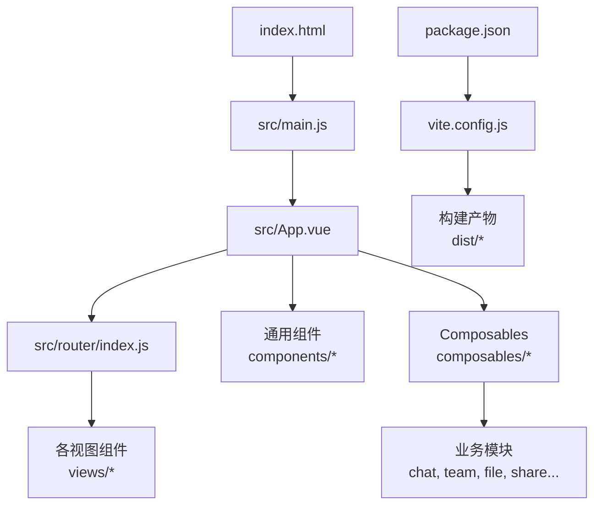
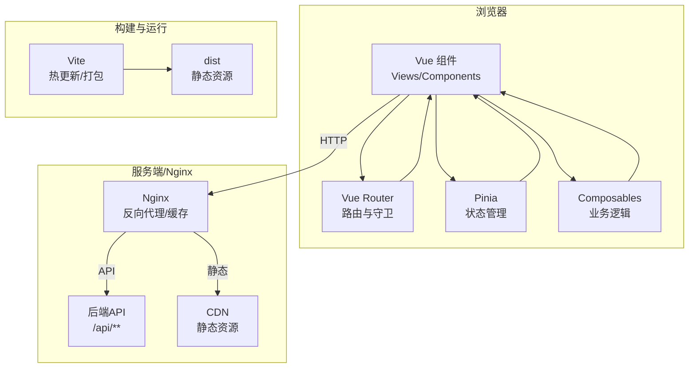
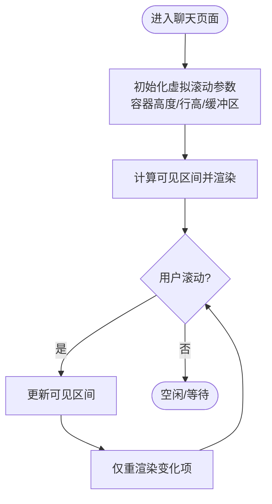
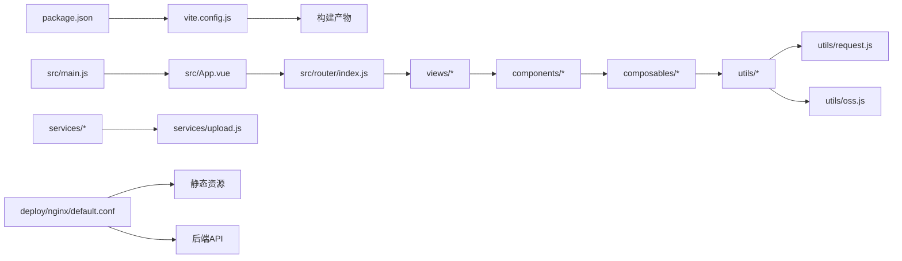

# 前端性能优化

<cite>
**本文引用的文件**   
- [vite.config.js](file://ZXYZdatabaseFront/vite.config.js)
- [package.json](file://ZXYZdatabaseFront/package.json)
- [index.html](file://ZXYZdatabaseFront/index.html)
- [main.js](file://ZXYZdatabaseFront/src/main.js)
- [App.vue](file://ZXYZdatabaseFront/src/App.vue)
- [router/index.js](file://ZXYZdatabaseFront/src/router/index.js)
- [views/chat/components/VirtualMessageList.vue](file://ZXYZdatabaseFront/src/views/chat/components/VirtualMessageList.vue)
- [views/chat/composables/useVirtualScroll.js](file://ZXYZdatabaseFront/src/views/chat/composables/useVirtualScroll.js)
- [components/FileExplorer.vue](file://ZXYZdatabaseFront/src/components/FileExplorer.vue)
- [services/upload.js](file://ZXYZdatabaseFront/src/services/upload.js)
- [utils/request.js](file://ZXYZdatabaseFront/src/utils/request.js)
- [utils/oss.js](file://ZXYZdatabaseFront/src/utils/oss.js)
- [deploy/nginx/default.conf](file://deploy/nginx/default.conf)
</cite>

## 目录
1. [简介](#简介)
2. [项目结构](#项目结构)
3. [核心组件](#核心组件)
4. [架构总览](#架构总览)
5. [详细组件分析](#详细组件分析)
6. [依赖分析](#依赖分析)
7. [性能考虑](#性能考虑)
8. [故障排查指南](#故障排查指南)
9. [结论](#结论)
10. [附录](#附录)

## 简介
本指南面向 ZXYZ 前端（Vue 3 + Vite）的性能优化，覆盖以下方面：
- Vue 3 运行时与渲染优化：组件懒加载、路由分割、动态导入、虚拟滚动列表
- 构建与打包优化：Vite 打包策略、代码分割、Tree Shaking、压缩插件
- 图片与静态资源优化：WebP 支持、图片懒加载、CDN 加速与缓存策略
- 运行时性能优化：事件委托、防抖节流、内存泄漏检测、长列表渲染优化
- 监控与分析：Lighthouse、Performance 面板、网络请求优化
- 移动端特殊优化：首屏时间、交互延迟、内存与电量控制

## 项目结构
前端位于 ZXYZdatabaseFront，采用 Vite 作为构建工具，Vue 3 Composition API 与 <script setup> 组织组件，Pinia 管理状态，composables 封装业务逻辑。关键入口与配置如下：
- 应用入口：src/main.js、index.html
- 路由与权限：src/router/index.js
- 根组件：src/App.vue
- 构建配置：vite.config.js、package.json
- 典型长列表与虚拟滚动：src/views/chat/components/VirtualMessageList.vue、useVirtualScroll.js
- 上传与 OSS：src/services/upload.js、src/utils/oss.js
- 网络请求：src/utils/request.js
- Nginx 部署与缓存：deploy/nginx/default.conf

**图表来源**
- [index.html:1-50](file://ZXYZdatabaseFront/index.html#L1-L50)
- [main.js:1-80](file://ZXYZdatabaseFront/src/main.js#L1-L80)
- [App.vue:1-120](file://ZXYZdatabaseFront/src/App.vue#L1-L120)
- [router/index.js:1-120](file://ZXYZdatabaseFront/src/router/index.js#L1-L120)
- [vite.config.js:1-200](file://ZXYZdatabaseFront/vite.config.js#L1-L200)
- [package.json:1-120](file://ZXYZdatabaseFront/package.json#L1-L120)

**章节来源**
- [index.html:1-50](file://ZXYZdatabaseFront/index.html#L1-L50)
- [main.js:1-80](file://ZXYZdatabaseFront/src/main.js#L1-L80)
- [App.vue:1-120](file://ZXYZdatabaseFront/src/App.vue#L1-L120)
- [router/index.js:1-120](file://ZXYZdatabaseFront/src/router/index.js#L1-L120)
- [vite.config.js:1-200](file://ZXYZdatabaseFront/vite.config.js#L1-L200)
- [package.json:1-120](file://ZXYZdatabaseFront/package.json#L1-L120)

## 核心组件
- 虚拟消息列表：通过虚拟滚动减少 DOM 节点数量，提升长列表渲染性能
- 文件浏览器：大目录与大量文件的展示与交互，需配合懒加载与分页/虚拟化
- 上传服务：分片、并发、断点续传与进度反馈，避免阻塞主线程
- 网络请求层：统一拦截器、重试、缓存与错误处理，降低重复请求与抖动

**章节来源**
- [views/chat/components/VirtualMessageList.vue:1-200](file://ZXYZdatabaseFront/src/views/chat/components/VirtualMessageList.vue#L1-L200)
- [views/chat/composables/useVirtualScroll.js:1-150](file://ZXYZdatabaseFront/src/views/chat/composables/useVirtualScroll.js#L1-L150)
- [components/FileExplorer.vue:1-200](file://ZXYZdatabaseFront/src/components/FileExplorer.vue#L1-L200)
- [services/upload.js:1-200](file://ZXYZdatabaseFront/src/services/upload.js#L1-L200)
- [utils/request.js:1-200](file://ZXYZdatabaseFront/src/utils/request.js#L1-L200)

## 架构总览
前端以 Vite 为构建与开发服务器，Vue Router 负责路由与按需加载，Pinia 管理全局状态，Composables 提供可复用逻辑，Nginx 作为反向代理与静态资源分发。

**图表来源**
- [router/index.js:1-120](file://ZXYZdatabaseFront/src/router/index.js#L1-L120)
- [vite.config.js:1-200](file://ZXYZdatabaseFront/vite.config.js#L1-L200)
- [deploy/nginx/default.conf:1-200](file://deploy/nginx/default.conf#L1-L200)

## 详细组件分析

### 虚拟滚动列表（聊天消息）
- 目标：在大量消息场景下保持流畅滚动与低内存占用
- 关键点：只渲染可视区域元素；使用 IntersectionObserver 或滚动位置计算可见范围；稳定 key 与不可变数据更新
- 实现要点：
  - 容器高度固定，内部使用占位与偏移定位
  - 根据滚动位置计算起始索引与结束索引
  - 对每条消息进行最小化重渲染（避免不必要的响应式更新）
  - 预加载上下缓冲项，减少闪烁

**图表来源**
- [views/chat/components/VirtualMessageList.vue:1-200](file://ZXYZdatabaseFront/src/views/chat/components/VirtualMessageList.vue#L1-L200)
- [views/chat/composables/useVirtualScroll.js:1-150](file://ZXYZdatabaseFront/src/views/chat/composables/useVirtualScroll.js#L1-L150)

**章节来源**
- [views/chat/components/VirtualMessageList.vue:1-200](file://ZXYZdatabaseFront/src/views/chat/components/VirtualMessageList.vue#L1-L200)
- [views/chat/composables/useVirtualScroll.js:1-150](file://ZXYZdatabaseFront/src/views/chat/composables/useVirtualScroll.js#L1-L150)

### 文件浏览器（大目录与多文件）
- 目标：快速浏览与操作大量文件，避免卡顿
- 关键点：分页/虚拟列表、懒加载缩略图、选择与批量操作的内存控制
- 建议：
  - 使用分页或虚拟列表渲染文件卡片
  - 缩略图按需加载与尺寸限制
  - 选择状态集中管理，避免每个文件组件维护独立状态

**章节来源**
- [components/FileExplorer.vue:1-200](file://ZXYZdatabaseFront/src/components/FileExplorer.vue#L1-L200)

### 上传服务（分片与并发）
- 目标：大文件稳定上传，提升吞吐与用户体验
- 关键点：分片上传、并发控制、进度上报、失败重试、断点续传
- 建议：
  - 按固定大小分片，合并时校验完整性
  - 控制并发数，避免阻塞主线程与带宽拥塞
  - 使用 WebSocket 或轮询获取进度
  - 失败自动重试与指数退避

**章节来源**
- [services/upload.js:1-200](file://ZXYZdatabaseFront/src/services/upload.js#L1-L200)

### 网络请求层（统一拦截与优化）
- 目标：统一错误处理、缓存、重试与日志
- 关键点：请求去重、条件缓存、错误分类、超时与重试
- 建议：
  - GET 请求启用短期缓存（内存或 localStorage）
  - 幂等接口支持重试与退避
  - 统一错误码映射与用户提示

**章节来源**
- [utils/request.js:1-200](file://ZXYZdatabaseFront/src/utils/request.js#L1-L200)

### OSS 与图片优化
- 目标：高效加载与传输图片资源
- 关键点：WebP/AVIF 格式、懒加载、CDN 缓存、尺寸裁剪
- 建议：
  - 优先 WebP，回退到 JPEG/PNG
  - 使用 srcset/picture 适配不同分辨率
  - 开启 CDN 缓存与版本化文件名
  - 图片懒加载与占位图

**章节来源**
- [utils/oss.js:1-200](file://ZXYZdatabaseFront/src/utils/oss.js#L1-L200)

## 依赖分析
- 构建依赖：Vite、Vue 3、Router、Pinia、Element Plus
- 运行时依赖：WebSocket（IM）、Fetch/Axios（API）、IntersectionObserver（懒加载）
- 外部服务：Nginx、CDN、OSS、后端 API

**图表来源**
- [package.json:1-120](file://ZXYZdatabaseFront/package.json#L1-L120)
- [vite.config.js:1-200](file://ZXYZdatabaseFront/vite.config.js#L1-L200)
- [main.js:1-80](file://ZXYZdatabaseFront/src/main.js#L1-L80)
- [App.vue:1-120](file://ZXYZdatabaseFront/src/App.vue#L1-L120)
- [router/index.js:1-120](file://ZXYZdatabaseFront/src/router/index.js#L1-L120)
- [utils/request.js:1-200](file://ZXYZdatabaseFront/src/utils/request.js#L1-L200)
- [utils/oss.js:1-200](file://ZXYZdatabaseFront/src/utils/oss.js#L1-L200)
- [services/upload.js:1-200](file://ZXYZdatabaseFront/src/services/upload.js#L1-L200)
- [deploy/nginx/default.conf:1-200](file://deploy/nginx/default.conf#L1-L200)

**章节来源**
- [package.json:1-120](file://ZXYZdatabaseFront/package.json#L1-L120)
- [vite.config.js:1-200](file://ZXYZdatabaseFront/vite.config.js#L1-L200)
- [main.js:1-80](file://ZXYZdatabaseFront/src/main.js#L1-L80)
- [App.vue:1-120](file://ZXYZdatabaseFront/src/App.vue#L1-L120)
- [router/index.js:1-120](file://ZXYZdatabaseFront/src/router/index.js#L1-L120)
- [utils/request.js:1-200](file://ZXYZdatabaseFront/src/utils/request.js#L1-L200)
- [utils/oss.js:1-200](file://ZXYZdatabaseFront/src/utils/oss.js#L1-L200)
- [services/upload.js:1-200](file://ZXYZdatabaseFront/src/services/upload.js#L1-L200)
- [deploy/nginx/default.conf:1-200](file://deploy/nginx/default.conf#L1-L200)

## 性能考虑

### Vue 3 运行时与渲染优化
- 组件懒加载与路由分割
  - 使用动态 import() 拆分路由与重型组件，减少首屏体积
  - 将非关键功能（如设置页、统计页）延迟加载
- 响应式优化
  - 合理使用 ref/reactive，避免过度响应式
  - 使用 computed 缓存派生数据，避免重复计算
- 列表渲染优化
  - 为列表项提供稳定 key，避免不必要重渲染
  - 大数据集使用虚拟滚动或分页
- 事件与监听
  - 使用事件委托减少监听器数量
  - 及时移除不需要的监听器，防止内存泄漏

**章节来源**
- [router/index.js:1-120](file://ZXYZdatabaseFront/src/router/index.js#L1-L120)
- [views/chat/components/VirtualMessageList.vue:1-200](file://ZXYZdatabaseFront/src/views/chat/components/VirtualMessageList.vue#L1-L200)

### 构建与打包优化（Vite）
- 代码分割策略
  - 按路由与功能模块拆分 chunk，利用 Vite 的按需加载
  - 第三方库按需引入，避免全量打包
- Tree Shaking
  - 确保使用 ES Module 语法，便于静态分析剔除未用代码
  - 避免副作用函数污染模块边界
- 压缩与优化
  - 启用 CSS/JS 压缩与内联关键样式
  - 图片资源使用现代格式与压缩
- 缓存与版本化
  - 使用内容哈希命名，提升缓存命中率
  - 分离 vendor 与业务代码，提高增量更新效率

**章节来源**
- [vite.config.js:1-200](file://ZXYZdatabaseFront/vite.config.js#L1-L200)
- [package.json:1-120](file://ZXYZdatabaseFront/package.json#L1-L120)

### 图片与静态资源优化
- 格式与尺寸
  - 优先 WebP/AVIF，兼容回退
  - 使用 srcset 与 picture 标签适配多分辨率
- 懒加载与占位
  - 使用 IntersectionObserver 实现懒加载
  - 提供轻量占位图提升感知速度
- CDN 与缓存
  - 静态资源走 CDN，开启强缓存与协商缓存
  - 版本号与指纹文件名提升缓存有效性

**章节来源**
- [utils/oss.js:1-200](file://ZXYZdatabaseFront/src/utils/oss.js#L1-L200)
- [deploy/nginx/default.conf:1-200](file://deploy/nginx/default.conf#L1-L200)

### 运行时性能优化
- 事件委托
  - 在父容器上绑定事件，减少监听器数量
- 防抖与节流
  - 搜索输入、窗口 resize、滚动事件使用防抖/节流
- 内存泄漏检测
  - 使用 Performance 面板与 Memory 快照定位泄漏
  - 清理定时器、监听器与订阅
- 长列表渲染优化
  - 虚拟滚动、分页、分页预取
  - 避免在渲染路径中进行昂贵计算

**章节来源**
- [views/chat/composables/useVirtualScroll.js:1-150](file://ZXYZdatabaseFront/src/views/chat/composables/useVirtualScroll.js#L1-L150)
- [utils/request.js:1-200](file://ZXYZdatabaseFront/src/utils/request.js#L1-L200)

### 监控与分析
- Lighthouse
  - 定期运行性能审计，关注 FCP/LCP/CLS/TBT
- Performance 面板
  - 录制关键交互，识别长任务与布局抖动
- 网络请求优化
  - 合并请求、缓存策略、压缩与 HTTP/2
  - 监控慢接口与错误率

**章节来源**
- [utils/request.js:1-200](file://ZXYZdatabaseFront/src/utils/request.js#L1-L200)
- [deploy/nginx/default.conf:1-200](file://deploy/nginx/default.conf#L1-L200)

### 移动端特殊优化
- 首屏时间优化
  - 关键 CSS 内联、脚本 defer/async、按需加载
- 交互延迟控制
  - 主线程任务拆分，Web Worker 处理耗时计算
- 内存与电量
  - 减少频繁重排重绘，避免大图与过多动画
  - 合理暂停后台任务与轮询

[本节为通用指导，不直接分析具体文件]

## 故障排查指南
- 首屏过慢
  - 检查路由与组件是否按需加载
  - 分析 bundle 体积与第三方库引入方式
- 滚动卡顿
  - 确认虚拟滚动实现是否正确
  - 检查列表项渲染复杂度与 key 稳定性
- 内存泄漏
  - 使用 Memory 快照对比前后差异
  - 排查未清理的监听器与定时器
- 网络问题
  - 检查请求拦截器与重试策略
  - 分析缓存命中与 CDN 配置

**章节来源**
- [router/index.js:1-120](file://ZXYZdatabaseFront/src/router/index.js#L1-L120)
- [views/chat/components/VirtualMessageList.vue:1-200](file://ZXYZdatabaseFront/src/views/chat/components/VirtualMessageList.vue#L1-L200)
- [utils/request.js:1-200](file://ZXYZdatabaseFront/src/utils/request.js#L1-L200)

## 结论
通过对 Vue 3 运行时优化、Vite 构建策略、图片与静态资源优化、网络请求层改进以及监控与分析的体系化实践，ZXYZ 前端可在复杂业务场景下显著提升首屏性能、交互流畅性与资源利用率。建议在持续迭代中结合 Lighthouse 与 Performance 面板进行度量与回归验证。

[本节为总结性内容，不直接分析具体文件]

## 附录
- 常用优化清单
  - 路由与组件懒加载
  - 第三方库按需引入
  - 图片 WebP/AVIF 与懒加载
  - 虚拟滚动与分页
  - 请求去重与缓存
  - Nginx/CDN 缓存策略
- 参考实现路径
  - 虚拟滚动：views/chat/components/VirtualMessageList.vue、useVirtualScroll.js
  - 上传优化：services/upload.js
  - 网络层：utils/request.js
  - 构建配置：vite.config.js、package.json
  - 部署缓存：deploy/nginx/default.conf

[本节为补充信息，不直接分析具体文件]