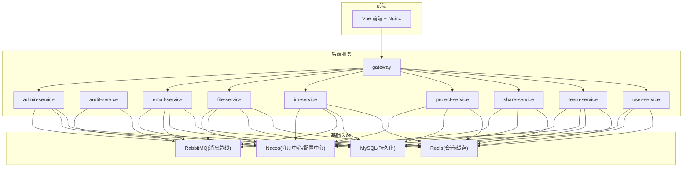
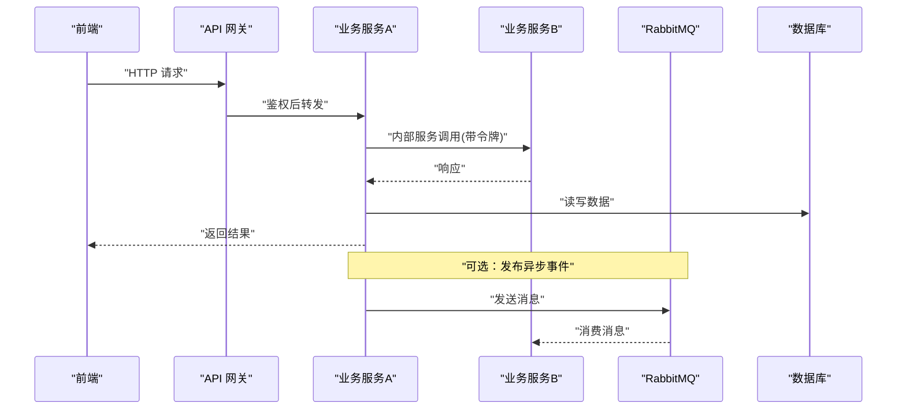
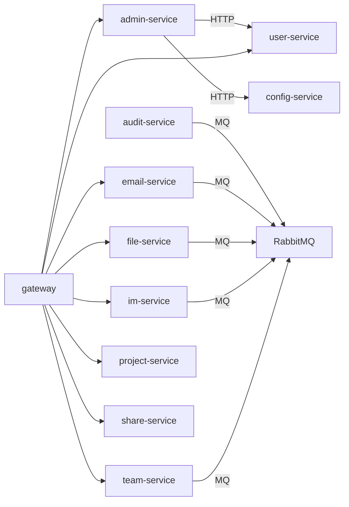

# 微服务性能优化

<cite>
**本文引用的文件**   
- [pom.xml](file://ZXYZdatabaseBack/pom.xml)
- [application.yml](file://ZXYZdatabaseBack/zxyz-admin-service/src/main/resources/application.yml)
- [application-dev.yml](file://ZXYZdatabaseBack/zxyz-admin-service/src/main/resources/application-dev.yml)
- [application-prod.yml](file://ZXYZdatabaseBack/zxyz-admin-service/src/main/resources/application-prod.yml)
- [RestClientConfig.java](file://ZXYZdatabaseBack/zxyz-admin-service/src/main/java/uno/acloud/admin/config/RestClientConfig.java)
- [AdminServiceProperties.java](file://ZXYZdatabaseBack/zxyz-admin-service/src/main/java/uno/acloud/admin/config/AdminServiceProperties.java)
- [RabbitMqConfig.java](file://ZXYZdatabaseBack/zxyz-audit-service/src/main/java/uno/acloud/audit/config/RabbitMqConfig.java)
- [application.yml](file://ZXYZdatabaseBack/zxyz-gateway/src/main/resources/application.yml)
- [SaTokenFilterConfigTest.java](file://ZXYZdatabaseBack/zxyz-gateway/src/test/java/uno/acloud/gateway/filter/SaTokenFilterConfigTest.java)
- [zxyz-dynamic.yml](file://nacos-config/zxyz-dynamic.yml)
- [zxyz-static.yml](file://nacos-config/zxyz-static.yml)
- [docker-compose.yml](file://docker-compose.yml)
- [docker-compose.dev.yml](file://docker-compose.dev.yml)
- [buildkitd.toml](file://buildkitd.toml)
- [.github/workflows/ci-cd.yml](file://.github/workflows/ci-cd.yml)
- [architecture.md](file://docs/architecture.md)
- [infrastructure.md](file://docs/infrastructure.md)
</cite>

## 目录
1. [简介](#简介)
2. [项目结构](#项目结构)
3. [核心组件](#核心组件)
4. [架构总览](#架构总览)
5. [详细组件分析](#详细组件分析)
6. [依赖关系分析](#依赖关系分析)
7. [性能考量](#性能考量)
8. [故障排查指南](#故障排查指南)
9. [结论](#结论)
10. [附录](#附录)

## 简介
本指南面向 ZXYZ 微服务项目的性能优化，覆盖服务间调用、负载均衡、API 网关、服务发现与注册中心、分布式链路追踪以及容器编排等关键维度。结合仓库中的实际配置与代码结构，提供可落地的调优建议与最佳实践，帮助在保障稳定性的前提下提升吞吐、降低延迟并增强弹性。

## 项目结构
ZXYZ 后端采用多模块 Maven 工程，包含多个独立服务（如 admin、audit、email、file、gateway、im、project、share、team、user）与公共库 zxyz-common；前端为 Vue 3 + Element Plus + Pinia 的单页应用。部署层面使用 Docker Compose 编排基础设施与所有服务，Nacos 作为配置中心与服务注册中心，GitHub Actions 负责 CI/CD。

图表来源
- [docker-compose.yml](file://docker-compose.yml)
- [architecture.md](file://docs/architecture.md)

章节来源
- [pom.xml](file://ZXYZdatabaseBack/pom.xml)
- [docker-compose.yml](file://docker-compose.yml)
- [architecture.md](file://docs/architecture.md)

## 核心组件
- 服务间 HTTP 客户端：各服务通过 RestTemplate/WebClient 或自定义 Client 进行同步调用，需统一连接池、超时、重试与熔断策略。
- 异步消息：审计、邮件、文件、IM、团队等服务通过 RabbitMQ Topic Exchange 进行事件驱动通信，需关注消费者并发、重试与死信队列。
- API 网关：Spring Cloud Gateway 统一入口，承载鉴权、路由、限流、CORS 等横切能力。
- 服务发现与配置：Nacos 提供服务注册、健康检查与动态配置管理。
- 容器编排：Docker Compose 定义服务拓扑与资源限制，CI/CD 基于 GitHub Actions。

章节来源
- [RestClientConfig.java](file://ZXYZdatabaseBack/zxyz-admin-service/src/main/java/uno/acloud/admin/config/RestClientConfig.java)
- [RabbitMqConfig.java](file://ZXYZdatabaseBack/zxyz-audit-service/src/main/java/uno/acloud/audit/config/RabbitMqConfig.java)
- [application.yml](file://ZXYZdatabaseBack/zxyz-gateway/src/main/resources/application.yml)
- [zxyz-dynamic.yml](file://nacos-config/zxyz-dynamic.yml)
- [zxyz-static.yml](file://nacos-config/zxyz-static.yml)
- [docker-compose.yml](file://docker-compose.yml)

## 架构总览
下图展示请求从前端到网关再到业务服务的典型路径，以及跨服务调用与消息流转的关键节点。

图表来源
- [application.yml](file://ZXYZdatabaseBack/zxyz-gateway/src/main/resources/application.yml)
- [RabbitMqConfig.java](file://ZXYZdatabaseBack/zxyz-audit-service/src/main/java/uno/acloud/audit/config/RabbitMqConfig.java)
- [RestClientConfig.java](file://ZXYZdatabaseBack/zxyz-admin-service/src/main/java/uno/acloud/admin/config/RestClientConfig.java)

## 详细组件分析

### 服务间调用优化（HTTP 客户端）
- 连接池配置
  - 合理设置最大连接数、连接超时、空闲回收策略，避免连接泄漏与线程阻塞。
  - 针对高并发场景启用连接复用与长连接，减少握手开销。
- 超时设置
  - 区分连接超时、读取超时与写入超时，按下游服务 SLA 设定阈值。
  - 对慢查询与外部依赖设置更严格的超时，防止雪崩。
- 重试机制
  - 仅对幂等接口启用自动重试，避免重复提交导致的数据不一致。
  - 指数退避与抖动策略，避免瞬时拥塞放大。
- 熔断降级
  - 基于错误率与慢调用比例触发熔断，快速失败保护上游。
  - 提供降级响应或缓存兜底，保证用户体验。

章节来源
- [RestClientConfig.java](file://ZXYZdatabaseBack/zxyz-admin-service/src/main/java/uno/acloud/admin/config/RestClientConfig.java)
- [AdminServiceProperties.java](file://ZXYZdatabaseBack/zxyz-admin-service/src/main/java/uno/acloud/admin/config/AdminServiceProperties.java)

### 负载均衡配置
- 轮询策略
  - 默认轮询适用于无状态服务，确保负载均匀分布。
  - 对于有差异化的实例（不同规格），可采用加权轮询。
- 权重分配
  - 根据实例资源与处理能力动态调整权重，避免热点。
- 健康检查
  - 启用主动健康检查与被动剔除，及时摘除异常实例。
- 会话保持
  - 对需要会话一致性的场景，采用基于 Cookie 的粘性会话或外部会话存储（Redis）。

章节来源
- [application.yml](file://ZXYZdatabaseBack/zxyz-gateway/src/main/resources/application.yml)

### API 网关性能优化
- 请求合并
  - 对批量小请求进行聚合，减少下游压力与网络往返。
- 响应缓存
  - 对读多写少接口启用缓存，缩短响应时间。
- 限流配置
  - 基于 IP、用户或服务维度进行限流，防止突发流量冲击。
- CORS 优化
  - 精确配置允许源与方法，减少预检请求开销。

章节来源
- [application.yml](file://ZXYZdatabaseBack/zxyz-gateway/src/main/resources/application.yml)
- [SaTokenFilterConfigTest.java](file://ZXYZdatabaseBack/zxyz-gateway/src/test/java/uno/acloud/gateway/filter/SaTokenFilterConfigTest.java)

### 服务发现与注册中心优化（Nacos）
- 配置调优
  - 合理设置心跳间隔、超时与剔除策略，平衡实时性与稳定性。
  - 动态配置热更新，避免重启带来的抖动。
- 实例剔除
  - 基于健康检查与超时剔除异常实例，恢复后自动回注。
- 集群模式
  - 生产环境采用 Nacos 集群部署，提升可用性与扩展性。

章节来源
- [zxyz-dynamic.yml](file://nacos-config/zxyz-dynamic.yml)
- [zxyz-static.yml](file://nacos-config/zxyz-static.yml)

### 分布式链路追踪（SkyWalking）
- 集成方式
  - 通过 Agent 注入或 SDK 集成，采集方法级调用链与指标。
- 性能指标收集
  - 监控 QPS、延迟分布、错误率与资源利用率。
- 瓶颈分析方法
  - 基于调用链定位慢调用与热点方法，结合日志与指标根因分析。

章节来源
- [infrastructure.md](file://docs/infrastructure.md)

### 容器编排优化（Kubernetes/Docker Compose）
- 资源配置
  - 设置合理的 CPU 与内存请求/限制，避免资源争用。
- 水平扩展策略
  - 基于 HPA 或 Compose 副本数实现弹性伸缩。
- 滚动更新配置
  - 配置最大不可用与最大增量，保证零停机更新。

章节来源
- [docker-compose.yml](file://docker-compose.yml)
- [docker-compose.dev.yml](file://docker-compose.dev.yml)
- [buildkitd.toml](file://buildkitd.toml)

## 依赖关系分析
下图展示各服务之间的主要依赖与交互，包括 HTTP 调用与消息队列。

图表来源
- [docker-compose.yml](file://docker-compose.yml)
- [RabbitMqConfig.java](file://ZXYZdatabaseBack/zxyz-audit-service/src/main/java/uno/acloud/audit/config/RabbitMqConfig.java)
- [RestClientConfig.java](file://ZXYZdatabaseBack/zxyz-admin-service/src/main/java/uno/acloud/admin/config/RestClientConfig.java)

章节来源
- [docker-compose.yml](file://docker-compose.yml)
- [RabbitMqConfig.java](file://ZXYZdatabaseBack/zxyz-audit-service/src/main/java/uno/acloud/audit/config/RabbitMqConfig.java)
- [RestClientConfig.java](file://ZXYZdatabaseBack/zxyz-admin-service/src/main/java/uno/acloud/admin/config/RestClientConfig.java)

## 性能考量
- 连接池与线程模型
  - 根据 CPU 核数与 I/O 特性调整线程池大小，避免上下文切换开销。
- 超时与重试
  - 严格区分幂等与非幂等操作，避免重试引发副作用。
- 缓存与本地缓存
  - 热点数据使用多级缓存（本地+分布式），降低数据库压力。
- 消息队列背压
  - 消费者限流与批量处理，避免堆积与内存溢出。
- 监控与告警
  - 建立端到端监控体系，及时发现性能退化与异常。

[本节为通用指导，不直接分析具体文件]

## 故障排查指南
- 常见问题
  - 连接池耗尽：检查连接泄漏与超时设置。
  - 超时频繁：评估下游 SLA 与重试策略。
  - 消息堆积：调整消费者并发与批处理大小。
  - 网关限流误伤：校准限流阈值与白名单。
- 诊断工具
  - 链路追踪：查看调用链耗时与错误堆栈。
  - 日志聚合：集中收集与分析服务日志。
  - 指标看板：观察 QPS、延迟、错误率与资源使用。

章节来源
- [SaTokenFilterConfigTest.java](file://ZXYZdatabaseBack/zxyz-gateway/src/test/java/uno/acloud/gateway/filter/SaTokenFilterConfigTest.java)
- [RabbitMqConfig.java](file://ZXYZdatabaseBack/zxyz-audit-service/src/main/java/uno/acloud/audit/config/RabbitMqConfig.java)

## 结论
通过对服务间调用、负载均衡、API 网关、服务发现、链路追踪与容器编排的系统性优化，ZXYZ 可在高并发与复杂依赖环境下获得更高的稳定性与性能。建议持续监控与迭代调优，结合业务特征制定差异化策略。

[本节为总结性内容，不直接分析具体文件]

## 附录
- 配置文件参考
  - 应用配置：application.yml、application-dev.yml、application-prod.yml
  - Nacos 动态与静态配置：zxyz-dynamic.yml、zxyz-static.yml
- 部署与构建
  - Docker Compose：docker-compose.yml、docker-compose.dev.yml
  - 构建优化：buildkitd.toml
  - CI/CD：.github/workflows/ci-cd.yml

章节来源
- [application.yml](file://ZXYZdatabaseBack/zxyz-admin-service/src/main/resources/application.yml)
- [application-dev.yml](file://ZXYZdatabaseBack/zxyz-admin-service/src/main/resources/application-dev.yml)
- [application-prod.yml](file://ZXYZdatabaseBack/zxyz-admin-service/src/main/resources/application-prod.yml)
- [zxyz-dynamic.yml](file://nacos-config/zxyz-dynamic.yml)
- [zxyz-static.yml](file://nacos-config/zxyz-static.yml)
- [docker-compose.yml](file://docker-compose.yml)
- [docker-compose.dev.yml](file://docker-compose.dev.yml)
- [buildkitd.toml](file://buildkitd.toml)
- [.github/workflows/ci-cd.yml](file://.github/workflows/ci-cd.yml)