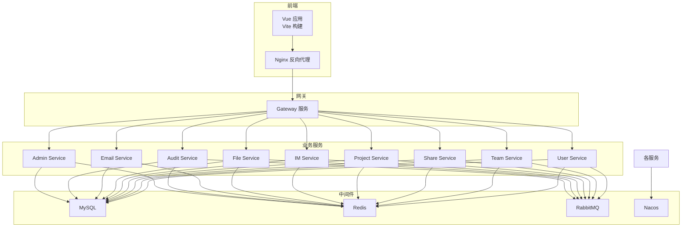
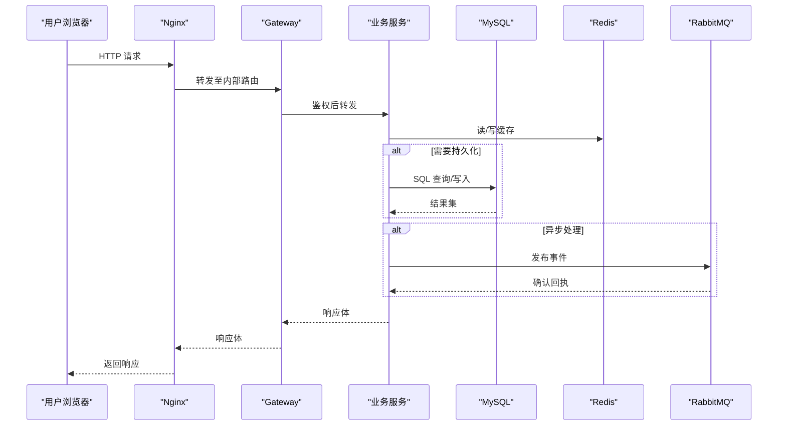
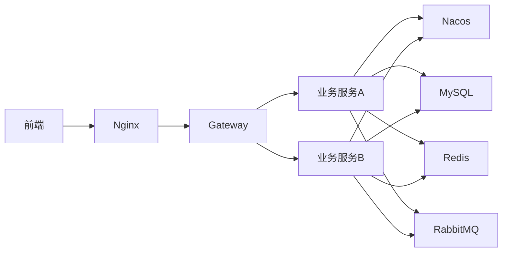

# 性能优化指南

<cite>
**本文引用的文件**   
- [docker-compose.yml](file://docker-compose.yml)
- [zxyz-admin-service/application-dev.yml](file://ZXYZdatabaseBack/zxyz-admin-service/src/main/resources/application-dev.yml)
- [zxyz-audit-service/RabbitMqConfig.java](file://ZXYZdatabaseBack/zxyz-audit-service/src/main/java/uno/acloud/audit/config/RabbitMqConfig.java)
- [zxyz-audit-service/OperateLogConsumer.java](file://ZXYZdatabaseBack/zxyz-audit-service/src/main/java/uno/acloud/audit/mq/OperateLogConsumer.java)
- [zxyz-file-service/application-dev.yml](file://ZXYZdatabaseBack/zxyz-file-service/src/main/resources/application-dev.yml)
- [zxyz-im-service/application-dev.yml](file://ZXYZdatabaseBack/zxyz-im-service/src/main/resources/application-dev.yml)
- [zxyz-project-service/application-dev.yml](file://ZXYZdatabaseBack/zxyz-project-service/src/main/resources/application-dev.yml)
- [zxyz-team-service/application-dev.yml](file://ZXYZdatabaseBack/zxyz-team-service/src/main/resources/application-dev.yml)
- [zxyz-user-service/application-dev.yml](file://ZXYZdatabaseBack/zxyz-user-service/src/main/resources/application-dev.yml)
- [nacos-config/zxyz-dynamic.yml](file://nacos-config/zxyz-dynamic.yml)
- [nacos-config/zxyz-static.yml](file://nacos-config/zxyz-static.yml)
- [deploy/nginx/default.conf](file://deploy/nginx/default.conf)
- [ZXYZdatabaseFront/vite.config.js](file://ZXYZdatabaseFront/vite.config.js)
- [ZXYZdatabaseFront/package.json](file://ZXYZdatabaseFront/package.json)
- [ZXYZdatabaseFront/src/utils/createApiClient.js](file://ZXYZdatabaseFront/src/utils/createApiClient.js)
- [ZXYZdatabaseFront/src/utils/request.js](file://ZXYZdatabaseFront/src/utils/request.js)
- [ZXYZdatabaseFront/src/router/index.js](file://ZXYZdatabaseFront/src/router/index.js)
- [ZXYZdatabaseFront/src/composables/useFileUpload.js](file://ZXYZdatabaseFront/src/composables/useFileUpload.js)
- [ZXYZdatabaseFront/src/components/FileUploader.vue](file://ZXYZdatabaseFront/src/components/FileUploader.vue)
- [ZXYZdatabaseFront/src/components/FolderUploader.vue](file://ZXYZdatabaseFront/src/components/FolderUploader.vue)
- [ZXYZdatabaseBack/pom.xml](file://ZXYZdatabaseBack/pom.xml)
- [ZXYZdatabaseBack/Dockerfile.base](file://ZXYZdatabaseBack/Dockerfile.base)
- [scripts/health-check.sh](file://scripts/health-check.sh)
</cite>

## 目录
1. [引言](#引言)
2. [项目结构](#项目结构)
3. [核心组件](#核心组件)
4. [架构总览](#架构总览)
5. [详细组件分析](#详细组件分析)
6. [依赖分析](#依赖分析)
7. [性能考量](#性能考量)
8. [故障排查指南](#故障排查指南)
9. [结论](#结论)
10. [附录](#附录)

## 引言
本指南面向 ZXYZ 微服务与前端工程，聚焦生产级性能优化：JVM 调优、GC 策略、线程池、JIT；数据库 SQL 与索引、连接池、读写分离；Redis 缓存穿透防护、热点预热、分布式锁与一致性；RabbitMQ 批量发送、消费限流、死信队列与积压监控；前端代码分割、懒加载、图片压缩与 CDN；压测方法与工具；以及微服务场景下的调用延迟、负载均衡与熔断降级。内容结合仓库中的配置与实现，给出可落地的参数建议与排障路径。

## 项目结构
后端采用多模块 Maven 工程（11 个服务 + common），前端为 Vue 3 + Vite。容器编排通过 docker-compose 管理基础设施与所有服务，Nacos 集中配置，Nginx 作为网关入口。

图表来源
- [docker-compose.yml](file://docker-compose.yml)
- [deploy/nginx/default.conf](file://deploy/nginx/default.conf)

章节来源
- [docker-compose.yml](file://docker-compose.yml)
- [ZXYZdatabaseBack/pom.xml](file://ZXYZdatabaseBack/pom.xml)

## 核心组件
- JVM 与运行时：基于 Docker 镜像运行，可通过启动参数与环境变量注入 JVM 选项；建议统一在镜像层或编排层设置堆大小、GC 类型、日志与 JFR。
- 数据库访问：各服务使用 MyBatis/Mapper 访问 MySQL，连接池与慢查询需按服务独立配置。
- 消息队列：审计服务与部分业务服务通过 RabbitMQ Topic Exchange zxyz.topic 进行异步解耦，消费者需关注限流与死信处理。
- 缓存：服务普遍接入 Redis，用于会话、热点数据与分布式锁等。
- 网关与前端：Nginx 提供静态资源与反向代理，前端通过 Vite 构建并启用按需加载与分包。

章节来源
- [ZXYZdatabaseBack/Dockerfile.base](file://ZXYZdatabaseBack/Dockerfile.base)
- [ZXYZdatabaseBack/zxyz-audit-service/src/main/java/uno/acloud/audit/config/RabbitMqConfig.java](file://ZXYZdatabaseBack/zxyz-audit-service/src/main/java/uno/acloud/audit/config/RabbitMqConfig.java)
- [ZXYZdatabaseBack/zxyz-audit-service/src/main/java/uno/acloud/audit/mq/OperateLogConsumer.java](file://ZXYZdatabaseBack/zxyz-audit-service/src/main/java/uno/acloud/audit/mq/OperateLogConsumer.java)
- [ZXYZdatabaseBack/zxyz-file-service/src/main/resources/application-dev.yml](file://ZXYZdatabaseBack/zxyz-file-service/src/main/resources/application-dev.yml)
- [ZXYZdatabaseBack/zxyz-im-service/src/main/resources/application-dev.yml](file://ZXYZdatabaseBack/zxyz-im-service/src/main/resources/application-dev.yml)
- [ZXYZdatabaseBack/zxyz-project-service/src/main/resources/application-dev.yml](file://ZXYZdatabaseBack/zxyz-project-service/src/main/resources/application-dev.yml)
- [ZXYZdatabaseBack/zxyz-team-service/src/main/resources/application-dev.yml](file://ZXYZdatabaseBack/zxyz-team-service/src/main/resources/application-dev.yml)
- [ZXYZdatabaseBack/zxyz-user-service/src/main/resources/application-dev.yml](file://ZXYZdatabaseBack/zxyz-user-service/src/main/resources/application-dev.yml)
- [ZXYZdatabaseBack/zxyz-admin-service/src/main/resources/application-dev.yml](file://ZXYZdatabaseBack/zxyz-admin-service/src/main/resources/application-dev.yml)
- [nacos-config/zxyz-dynamic.yml](file://nacos-config/zxyz-dynamic.yml)
- [nacos-config/zxyz-static.yml](file://nacos-config/zxyz-static.yml)
- [deploy/nginx/default.conf](file://deploy/nginx/default.conf)
- [ZXYZdatabaseFront/vite.config.js](file://ZXYZdatabaseFront/vite.config.js)

## 架构总览
下图展示请求从浏览器到后端服务的典型路径，以及关键性能点（Nginx、网关、服务、DB、Redis、MQ）。

图表来源
- [deploy/nginx/default.conf](file://deploy/nginx/default.conf)
- [ZXYZdatabaseBack/zxyz-audit-service/src/main/java/uno/acloud/audit/config/RabbitMqConfig.java](file://ZXYZdatabaseBack/zxyz-audit-service/src/main/java/uno/acloud/audit/config/RabbitMqConfig.java)

## 详细组件分析

### JVM 性能调优
- 堆内存与 GC 策略
  - 根据容器 CPU/内存配额设置 -Xms/-Xmx，避免频繁扩容；推荐新生代与老年代比例合理分配，启用 G1 或 ZGC（视 JDK 版本与延迟目标）。
  - 开启 GC 日志与 JFR 采集，定位 Full GC 根因与长停顿。
- JIT 编译优化
  - 合理使用 -XX:+UseStringDeduplication、-XX:+TieredCompilation、-XX:CompileThresholdScaling 等参数提升热点方法编译效率。
  - 对热路径避免过度反射与动态代理，减少 AOT 不友好模式。
- 线程模型
  - Web 容器线程数与 IO 密集型任务线程池分开配置，避免阻塞型操作占用请求线程。
  - 监控线程池拒绝率与队列长度，结合业务 QPS 与 P99 时延调整。

章节来源
- [ZXYZdatabaseBack/Dockerfile.base](file://ZXYZdatabaseBack/Dockerfile.base)
- [ZXYZdatabaseBack/pom.xml](file://ZXYZdatabaseBack/pom.xml)

### 数据库性能优化
- SQL 与索引
  - 优先走覆盖索引，避免回表；大字段与 JSON 字段谨慎使用；分页用延迟关联或游标分页。
  - 复合索引顺序遵循最左前缀原则，区分度高的列放前面；定期分析慢查询并重建索引。
- 连接池配置
  - 根据并发与平均耗时估算最大连接数，避免过大导致上下文切换开销；最小连接数保持一定基线减少冷启动抖动。
  - 开启连接健康检查与超时回收，防止僵尸连接。
- 读写分离
  - 读多写少场景启用主从读写分离，事务内强制走主库；缓存失效时注意“先更新 DB，再删缓存”的顺序。

章节来源
- [ZXYZdatabaseBack/zxyz-file-service/src/main/resources/application-dev.yml](file://ZXYZdatabaseBack/zxyz-file-service/src/main/resources/application-dev.yml)
- [ZXYZdatabaseBack/zxyz-im-service/src/main/resources/application-dev.yml](file://ZXYZdatabaseBack/zxyz-im-service/src/main/resources/application-dev.yml)
- [ZXYZdatabaseBack/zxyz-project-service/src/main/resources/application-dev.yml](file://ZXYZdatabaseBack/zxyz-project-service/src/main/resources/application-dev.yml)
- [ZXYZdatabaseBack/zxyz-team-service/src/main/resources/application-dev.yml](file://ZXYZdatabaseBack/zxyz-team-service/src/main/resources/application-dev.yml)
- [ZXYZdatabaseBack/zxyz-user-service/src/main/resources/application-dev.yml](file://ZXYZdatabaseBack/zxyz-user-service/src/main/resources/application-dev.yml)
- [ZXYZdatabaseBack/zxyz-admin-service/src/main/resources/application-dev.yml](file://ZXYZdatabaseBack/zxyz-admin-service/src/main/resources/application-dev.yml)

### Redis 缓存优化
- 穿透防护
  - 空值缓存+短 TTL；布隆过滤器拦截不存在键；热点 key 单独保护。
- 热点数据预热
  - 启动阶段异步加载热点集合；增量更新时使用双缓冲或版本号控制。
- 分布式锁
  - 使用 SETNX + 过期时间 + Lua 原子释放；锁粒度尽量小，避免跨行锁。
- 一致性保证
  - Cache-Aside 模式：先更新 DB 再删除缓存；必要时加重试与补偿；对强一致场景考虑 Canal 同步或本地消息表。

章节来源
- [nacos-config/zxyz-dynamic.yml](file://nacos-config/zxyz-dynamic.yml)
- [nacos-config/zxyz-static.yml](file://nacos-config/zxyz-static.yml)

### RabbitMQ 消息队列优化
- 批量发送
  - 合并小消息成批发送，降低网络与序列化开销；合理设置生产者确认与重试。
- 消费限流
  - 预取数量 prefetch 限制单消费者并发；按队列维度设置最大长度与 TTL，避免堆积。
- 死信队列
  - 配置 DLQ 与重试次数上限，失败消息进入死信后人工介入或二次补偿。
- 积压监控
  - 监控队列长度、消费速率、消费者 lag；设置告警阈值与自动扩缩容策略。

章节来源
- [ZXYZdatabaseBack/zxyz-audit-service/src/main/java/uno/acloud/audit/config/RabbitMqConfig.java](file://ZXYZdatabaseBack/zxyz-audit-service/src/main/java/uno/acloud/audit/config/RabbitMqConfig.java)
- [ZXYZdatabaseBack/zxyz-audit-service/src/main/java/uno/acloud/audit/mq/OperateLogConsumer.java](file://ZXYZdatabaseBack/zxyz-audit-service/src/main/java/uno/acloud/audit/mq/OperateLogConsumer.java)

### 前端性能优化
- 代码分割与懒加载
  - 路由级与组件级按需加载，减少首屏体积；第三方库按需引入。
- 图片与静态资源
  - 使用现代格式（WebP/AVIF）、CDN 缓存与指纹文件名；大图懒加载与占位图。
- 请求与状态
  - 接口请求去抖/节流、取消重复请求；列表虚拟滚动与分页；Pinia 局部更新。
- 构建与部署
  - Vite 分包与 Tree Shaking；Gzip/Brotli 压缩；HTTP/2 多路复用。

章节来源
- [ZXYZdatabaseFront/vite.config.js](file://ZXYZdatabaseFront/vite.config.js)
- [ZXYZdatabaseFront/package.json](file://ZXYZdatabaseFront/package.json)
- [ZXYZdatabaseFront/src/utils/createApiClient.js](file://ZXYZdatabaseFront/src/utils/createApiClient.js)
- [ZXYZdatabaseFront/src/utils/request.js](file://ZXYZdatabaseFront/src/utils/request.js)
- [ZXYZdatabaseFront/src/router/index.js](file://ZXYZdatabaseFront/src/router/index.js)
- [ZXYZdatabaseFront/src/composables/useFileUpload.js](file://ZXYZdatabaseFront/src/composables/useFileUpload.js)
- [ZXYZdatabaseFront/src/components/FileUploader.vue](file://ZXYZdatabaseFront/src/components/FileUploader.vue)
- [ZXYZdatabaseFront/src/components/FolderUploader.vue](file://ZXYZdatabaseFront/src/components/FolderUploader.vue)

### 微服务性能考量
- 服务间调用延迟
  - 使用窄端点与投影 VO，减少序列化体积；避免循环依赖与胖 DTO。
- 负载均衡
  - Gateway 层做请求分发，后端无状态化水平扩展；连接复用与超时合理设置。
- 熔断降级
  - 对下游依赖设置熔断器与舱壁隔离，快速失败与兜底响应；重试幂等设计。

章节来源
- [ZXYZdatabaseBack/pom.xml](file://ZXYZdatabaseBack/pom.xml)
- [nacos-config/zxyz-dynamic.yml](file://nacos-config/zxyz-dynamic.yml)

## 依赖分析
- 服务间通信：内部端点 /api/internal/** 由 Gateway SaToken 过滤，禁止公网访问；服务客户端通过 Token 鉴权。
- 配置中心：Nacos 统一管理动态与静态配置，便于灰度与热更新。
- 基础设施：MySQL、Redis、RabbitMQ、Nacos、Nginx 由 docker-compose 编排，生命周期与端口映射清晰。

图表来源
- [docker-compose.yml](file://docker-compose.yml)
- [deploy/nginx/default.conf](file://deploy/nginx/default.conf)
- [nacos-config/zxyz-dynamic.yml](file://nacos-config/zxyz-dynamic.yml)

章节来源
- [docker-compose.yml](file://docker-compose.yml)
- [deploy/nginx/default.conf](file://deploy/nginx/default.conf)
- [nacos-config/zxyz-dynamic.yml](file://nacos-config/zxyz-dynamic.yml)
- [nacos-config/zxyz-static.yml](file://nacos-config/zxyz-static.yml)

## 性能考量
- JVM 与 GC
  - 以 P99/P999 为目标设定堆大小与 GC 策略；开启 GC 日志与 JFR，观察 STW 与晋升失败。
- 线程池
  - 计算最佳线程数：CPU 密集型 ≈ CPU 核数 + 1；IO 密集型 ≈ CPU 核数 × (1 + 等待时间/计算时间)。
  - 监控队列长度、活跃线程、拒绝率，结合业务峰值调整。
- 数据库
  - 慢查询治理、索引优化、连接池上限与超时；读写分离与分库分表评估。
- Redis
  - 热点 key 保护、大 key 拆分、管道与批量命令；避免阻塞命令。
- MQ
  - 批量发送、prefetch 限流、DLQ 与重试策略；积压告警与自动扩容。
- 前端
  - 首屏体积、懒加载、CDN 缓存、HTTP/2 与压缩；请求去重与取消。
- 微服务
  - 调用链追踪、超时与重试、熔断与降级、连接复用。

[本节为通用指导，无需特定文件引用]

## 故障排查指南
- 常见症状
  - 高延迟：检查 GC 日志、慢查询、线程池饱和、MQ 积压、Redis 大 key。
  - 内存泄漏：堆转储分析、对象保留路径、直方图与火焰图。
  - 连接耗尽：连接池耗尽、连接泄漏、DB 锁等待。
  - 消息丢失：未确认、重试风暴、DLQ 堆积。
- 诊断步骤
  - 使用健康检查脚本验证服务存活与依赖连通性。
  - 查看 Nacos 配置是否生效，对比 dev/prod 差异。
  - 收集 GC 日志、JFR 快照、线程 dump、慢查询日志与 MQ 监控指标。
- 恢复策略
  - 临时扩容、降级非核心功能、清理热点 key、重置连接池、重启消费者。

章节来源
- [scripts/health-check.sh](file://scripts/health-check.sh)
- [nacos-config/zxyz-dynamic.yml](file://nacos-config/zxyz-dynamic.yml)
- [nacos-config/zxyz-static.yml](file://nacos-config/zxyz-static.yml)

## 结论
ZXYZ 的性能优化应围绕“端到端链路”展开：JVM/GC 保障运行时稳定，数据库与缓存提升数据访问效率，MQ 削峰填谷，前端减少首屏与请求开销，微服务层面通过负载均衡与熔断降级增强弹性。建议建立常态化压测与监控体系，持续迭代参数与架构决策。

[本节为总结性内容，无需特定文件引用]

## 附录
- 压测方法与工具
  - 编写压测脚本：模拟真实用户行为，覆盖登录、查询、上传、下载等关键路径。
  - 基准测试：对热点接口与算法进行单元测试级基准，确保回归不劣化。
  - 瓶颈分析：结合 APM、GC 日志、慢查询、MQ 指标定位瓶颈，制定优化方案。
- 参考配置位置
  - 后端服务应用配置：各服务 application-dev.yml
  - 动态与静态配置：Nacos 的 zxyz-dynamic.yml、zxyz-static.yml
  - 网关与静态资源：Nginx default.conf
  - 前端构建与打包：Vite 配置与包管理

章节来源
- [ZXYZdatabaseBack/zxyz-file-service/src/main/resources/application-dev.yml](file://ZXYZdatabaseBack/zxyz-file-service/src/main/resources/application-dev.yml)
- [ZXYZdatabaseBack/zxyz-im-service/src/main/resources/application-dev.yml](file://ZXYZdatabaseBack/zxyz-im-service/src/main/resources/application-dev.yml)
- [ZXYZdatabaseBack/zxyz-project-service/src/main/resources/application-dev.yml](file://ZXYZdatabaseBack/zxyz-project-service/src/main/resources/application-dev.yml)
- [ZXYZdatabaseBack/zxyz-team-service/src/main/resources/application-dev.yml](file://ZXYZdatabaseBack/zxyz-team-service/src/main/resources/application-dev.yml)
- [ZXYZdatabaseBack/zxyz-user-service/src/main/resources/application-dev.yml](file://ZXYZdatabaseBack/zxyz-user-service/src/main/resources/application-dev.yml)
- [ZXYZdatabaseBack/zxyz-admin-service/src/main/resources/application-dev.yml](file://ZXYZdatabaseBack/zxyz-admin-service/src/main/resources/application-dev.yml)
- [nacos-config/zxyz-dynamic.yml](file://nacos-config/zxyz-dynamic.yml)
- [nacos-config/zxyz-static.yml](file://nacos-config/zxyz-static.yml)
- [deploy/nginx/default.conf](file://deploy/nginx/default.conf)
- [ZXYZdatabaseFront/vite.config.js](file://ZXYZdatabaseFront/vite.config.js)