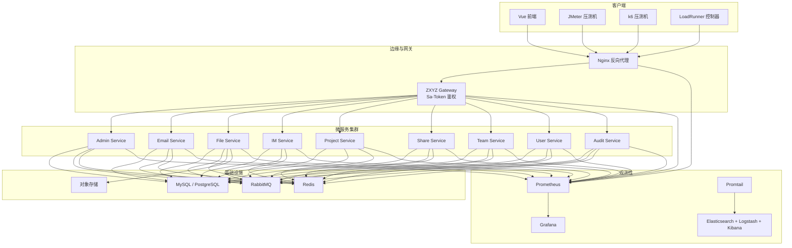
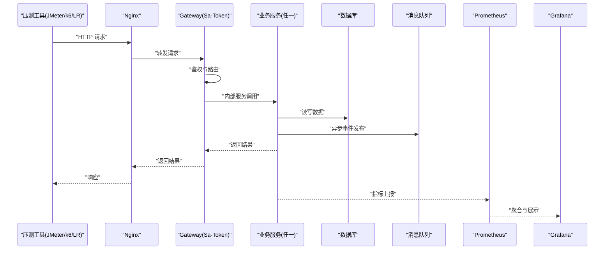
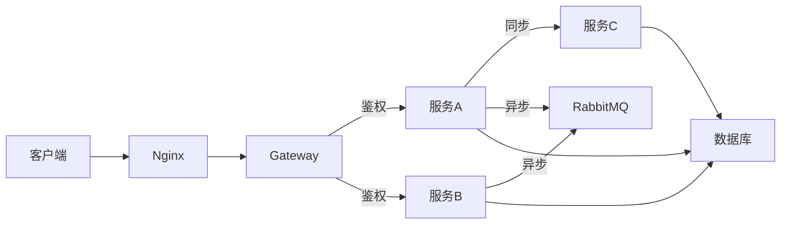

# 性能测试与监控

<cite>
**本文引用的文件**   
- [docker-compose.yml](file://docker-compose.yml)
- [docker-compose.dev.yml](file://docker-compose.dev.yml)
- [deploy/nginx/default.conf](file://deploy/nginx/default.conf)
- [deploy/promtail-config.yml](file://deploy/promtail-config.yml)
- [.github/workflows/ci-cd.yml](file://.github/workflows/ci-cd.yml)
- [ZXYZdatabaseBack/pom.xml](file://ZXYZdatabaseBack/pom.xml)
- [ZXYZdatabaseBack/zxyz-common/src/main/resources/application-common.yml](file://ZXYZdatabaseBack/zxyz-common/src/main/resources/application-common.yml)
- [ZXYZdatabaseBack/zxyz-gateway/src/main/java/uno/acloud/gateway/filter/SaTokenFilterConfig.java](file://ZXYZdatabaseBack/zxyz-gateway/src/main/java/uno/acloud/gateway/filter/SaTokenFilterConfig.java)
- [ZXYZdatabaseBack/zxyz-gateway/src/main/resources/application.yml](file://ZXYZdatabaseBack/zxyz-gateway/src/main/resources/application.yml)
- [ZXYZdatabaseBack/zxyz-admin-service/src/main/resources/application-dev.yml](file://ZXYZdatabaseBack/zxyz-admin-service/src/main/resources/application-dev.yml)
- [ZXYZdatabaseBack/zxyz-email-service/src/main/resources/application-dev.yml](file://ZXYZdatabaseBack/zxyz-email-service/src/main/resources/application-dev.yml)
- [ZXYZdatabaseBack/zxyz-file-service/src/main/resources/application-dev.yml](file://ZXYZdatabaseBack/zxyz-file-service/src/main/resources/application-dev.yml)
- [ZXYZdatabaseBack/zxyz-im-service/src/main/resources/application-dev.yml](file://ZXYZdatabaseBack/zxyz-im-service/src/main/resources/application-dev.yml)
- [ZXYZdatabaseBack/zxyz-project-service/src/main/resources/application-dev.yml](file://ZXYZdatabaseBack/zxyz-project-service/src/main/resources/application-dev.yml)
- [ZXYZdatabaseBack/zxyz-share-service/src/main/resources/application-dev.yml](file://ZXYZdatabaseBack/zxyz-share-service/src/main/resources/application-dev.yml)
- [ZXYZdatabaseBack/zxyz-team-service/src/main/resources/application-dev.yml](file://ZXYZdatabaseBack/zxyz-team-service/src/main/resources/application-dev.yml)
- [ZXYZdatabaseBack/zxyz-user-service/src/main/resources/application-dev.yml](file://ZXYZdatabaseBack/zxyz-user-service/src/main/resources/application-dev.yml)
- [ZXYZdatabaseFront/package.json](file://ZXYZdatabaseFront/package.json)
- [ZXYZdatabaseFront/vite.config.js](file://ZXYZdatabaseFront/vite.config.js)
- [nacos-config/zxyz-static.yml](file://nacos-config/zxyz-static.yml)
- [scripts/health-check.sh](file://scripts/health-check.sh)
</cite>

## 目录
1. [简介](#简介)
2. [项目结构](#项目结构)
3. [核心组件](#核心组件)
4. [架构总览](#架构总览)
5. [详细组件分析](#详细组件分析)
6. [依赖分析](#依赖分析)
7. [性能考虑](#性能考虑)
8. [故障排查指南](#故障排查指南)
9. [结论](#结论)
10. [附录](#附录)

## 简介
本指南面向 ZXYZ 微服务项目的性能测试与监控，覆盖压测工具使用（JMeter、LoadRunner、k6）、基准测试方法（单接口、混合场景、长时间稳定性）、监控体系搭建（Prometheus + Grafana + 告警）、日志分析与优化（ELK/Promtail + 结构化日志）、瓶颈定位（CPU、内存泄漏、IO、网络延迟），以及将自动化性能测试集成到 CI/CD 的最佳实践。文档基于仓库现有编排、网关鉴权、Nacos 配置与前端构建脚本等上下文进行落地设计，确保可操作、可验证、可演进。

## 项目结构
ZXYZ 采用多模块 Maven 后端（11 个服务）+ Vue 前端，通过 Docker Compose 编排运行，Nacos 管理配置与服务发现，Gateway 统一入口并实施 Sa-Token 鉴权。性能测试与监控需围绕以下关键点展开：
- 网关层：统一入口、鉴权过滤、内部端点隔离
- 应用层：各业务服务暴露 REST 接口，部分服务遵循 DDD 分层
- 基础设施：数据库、消息队列、缓存、对象存储等
- 观测性：容器日志采集、指标采集、可视化与告警
- 前端：构建产物与代理配置影响端到端性能

**图表来源** 
- [docker-compose.yml](file://docker-compose.yml)
- [docker-compose.dev.yml](file://docker-compose.dev.yml)
- [deploy/nginx/default.conf](file://deploy/nginx/default.conf)
- [ZXYZdatabaseBack/zxyz-gateway/src/main/resources/application.yml](file://ZXYZdatabaseBack/zxyz-gateway/src/main/resources/application.yml)

**章节来源**
- [docker-compose.yml](file://docker-compose.yml)
- [docker-compose.dev.yml](file://docker-compose.dev.yml)
- [deploy/nginx/default.conf](file://deploy/nginx/default.conf)

## 核心组件
- 网关与鉴权：Gateway 统一入口，Sa-Token Filter 对内部端点 /api/internal/** 进行鉴权拦截，避免公网访问；对外接口通过 Cookie/Session 认证。
- 配置中心：Nacos 集中管理静态与动态配置，开发/生产环境分离。
- 应用分层：IM/Email 服务采用 DDD（interfaces → application → domain → infrastructure），其他服务为传统分层（controller → service → mapper → entity）。
- 前后端交互：前端通过 Vite 构建，Nginx 反向代理至后端；API 响应统一 Result<T> 结构。

**章节来源**
- [ZXYZdatabaseBack/zxyz-gateway/src/main/java/uno/acloud/gateway/filter/SaTokenFilterConfig.java](file://ZXYZdatabaseBack/zxyz-gateway/src/main/java/uno/acloud/gateway/filter/SaTokenFilterConfig.java)
- [ZXYZdatabaseBack/zxyz-gateway/src/main/resources/application.yml](file://ZXYZdatabaseBack/zxyz-gateway/src/main/resources/application.yml)
- [nacos-config/zxyz-static.yml](file://nacos-config/zxyz-static.yml)
- [ZXYZdatabaseFront/vite.config.js](file://ZXYZdatabaseFront/vite.config.js)

## 架构总览
下图展示从压测发起、网关鉴权、服务调用、外部依赖到观测性采集的完整链路，便于理解压测与监控在系统中的落点。

**图表来源** 
- [ZXYZdatabaseBack/zxyz-gateway/src/main/resources/application.yml](file://ZXYZdatabaseBack/zxyz-gateway/src/main/resources/application.yml)
- [ZXYZdatabaseBack/zxyz-common/src/main/resources/application-common.yml](file://ZXYZdatabaseBack/zxyz-common/src/main/resources/application-common.yml)

## 详细组件分析

### 压测工具使用与脚本编写
- JMeter
  - 建议以 Nginx/Gateway 为入口，模拟真实用户行为，设置合理的并发、阶梯加压与持续时间。
  - 关键参数：线程数、Ramp-Up、循环次数、超时、采样器类型（HTTP Request）、断言（状态码、响应体关键字）、监听器（聚合报告、CSV 输出）。
  - 变量与参数化：登录态通过 Cookie 保持，接口参数使用 CSV Data Set Config 或 JSON 模板。
  - 资源监控：结合系统监控（CPU、内存、IO、网络）与 JVM 指标（GC、堆使用、线程池）。
- LoadRunner
  - 录制 Web HTTP/HTML 协议脚本，回放前清理无关元素，参数化敏感数据。
  - 使用 Controller 组织场景，Vuser Generator 控制并发，Analysis 分析瓶颈。
  - 注意会话保持与事务划分，合理设置 Think Time。
- k6
  - 使用 JavaScript 脚本定义场景，支持模块化与数据驱动。
  - 常用 API：http.get/post、check 断言、metrics 自定义指标、handleSummary 汇总输出。
  - 执行方式：本地执行或容器化执行，配合 Prometheus Remote Write 导出指标。

[本节为通用指导，不直接分析具体代码文件]

### 基准测试方法
- 单接口压测
  - 目标：评估单个接口的吞吐、延迟分布、错误率与资源占用。
  - 步骤：选择热点接口（如登录、文件上传、消息发送），设定基线并发，逐步加压，记录 P95/P99 延迟与错误率。
  - 关注点：连接池、线程池、缓存命中率、SQL 慢查询、外部依赖限流。
- 混合场景测试
  - 目标：模拟真实用户比例（读多写少、批量导入、实时聊天等），评估整体容量与稳定性。
  - 步骤：按业务比例分配场景权重，设置 Ramp-Up 与持续时长，观察系统拐点。
  - 关注点：跨服务调用链路的尾延迟、消息堆积、锁竞争、资源争用。
- 长时间稳定性测试
  - 目标：验证系统在长时间高负载下的稳定性（内存泄漏、连接池耗尽、磁盘增长）。
  - 步骤：7×24h 稳定负载，周期性峰值冲击，监控 GC、堆外内存、句柄数、磁盘 IO。
  - 关注点：资源回收、定时任务、日志滚动、备份策略。

[本节为通用指导，不直接分析具体代码文件]

### 性能监控体系搭建
- Prometheus 指标采集
  - 后端：启用 Spring Boot Actuator 与 Micrometer，暴露 /actuator/prometheus；自定义业务指标（QPS、耗时、错误率、队列长度）。
  - 中间件：MySQL、Redis、RabbitMQ、Nginx 等 exporter 采集关键指标。
  - 前端：通过 Performance API 采集页面加载、首屏时间、长任务耗时。
- Grafana 可视化
  - 创建仪表盘：系统资源、JVM、网关、服务、数据库、消息队列、对象存储。
  - 关键面板：QPS、P95/P99 延迟、错误率、线程池、连接池、GC、慢 SQL、队列积压。
- 告警规则配置
  - 阈值：错误率 > 1%、P95 > 500ms、CPU > 80%、内存使用 > 85%、队列积压 > 阈值、磁盘使用 > 80%。
  - 通知：企业微信/钉钉/邮件，分级告警（警告、严重、致命）。

**章节来源**
- [ZXYZdatabaseBack/zxyz-common/src/main/resources/application-common.yml](file://ZXYZdatabaseBack/zxyz-common/src/main/resources/application-common.yml)
- [docker-compose.yml](file://docker-compose.yml)
- [docker-compose.dev.yml](file://docker-compose.dev.yml)

### 日志分析与优化
- ELK/Promtail 配置
  - 容器日志：Promtail 收集 /var/log/containers/*.log，解析 JSON 后写入 Elasticsearch。
  - 索引策略：按服务名与日期分索引，保留策略（TTL）与冷热分层。
  - Kibana：创建索引模式、搜索语法、可视化看板（错误日志、慢请求、异常堆栈）。
- 日志级别控制
  - 开发：DEBUG；测试：INFO；生产：WARN/ERROR，按需开启 DEBUG。
  - 动态调整：通过 Nacos 或配置文件热更新日志级别。
- 结构化日志输出
  - 统一格式：时间戳、TraceId、服务名、级别、消息、关键参数（脱敏）。
  - 关联追踪：跨服务传递 TraceId，便于链路分析。

**章节来源**
- [deploy/promtail-config.yml](file://deploy/promtail-config.yml)
- [ZXYZdatabaseBack/zxyz-common/src/main/resources/application-common.yml](file://ZXYZdatabaseBack/zxyz-common/src/main/resources/application-common.yml)

### 性能瓶颈定位方法
- CPU 分析
  - 工具：top、htop、jstack、async-profiler、perf。
  - 步骤：定位高 CPU 线程，生成火焰图，识别热点方法与锁竞争。
- 内存泄漏检测
  - 工具：jmap、jstat、VisualVM、MAT、heap dump。
  - 步骤：抓取堆快照，分析大对象、未释放引用、缓存膨胀。
- IO 瓶颈识别
  - 工具：iostat、iotop、strace、lsof。
  - 步骤：检查磁盘 IO、文件句柄、网络连接数、慢查询。
- 网络延迟分析
  - 工具：ping、traceroute、tcpdump、Wireshark、curl -w。
  - 步骤：测量 DNS、TCP 握手、TLS 握手、服务端处理时间。

[本节为通用指导，不直接分析具体代码文件]

### 自动化性能测试集成到 CI/CD
- GitHub Actions
  - 触发条件：push/PR，路径过滤仅构建变更模块。
  - 步骤：构建镜像、启动依赖（Minikube/本地 Docker）、运行压测、收集报告、上传 Artifact。
  - 质量门禁：P95 延迟、错误率、吞吐量阈值不达标则失败。
- 报告与归档
  - JMeter：HTML 报告、CSV 数据。
  - k6：JSON 输出、Prometheus 远程写入。
  - LoadRunner：Analysis 结果导出。
- 回滚与灰度
  - 压测通过后自动部署到预发环境，灰度放量，监控指标稳定后全量发布。

**章节来源**
- [.github/workflows/ci-cd.yml](file://.github/workflows/ci-cd.yml)
- [ZXYZdatabaseFront/package.json](file://ZXYZdatabaseFront/package.json)
- [ZXYZdatabaseFront/vite.config.js](file://ZXYZdatabaseFront/vite.config.js)

## 依赖分析
- 服务间调用：ServiceClient + X-Internal-Service-Token 鉴权，内部端点 /api/internal/** 被 Gateway 拒绝公网访问。
- 异步通信：RabbitMQ Topic Exchange zxyz.topic，解耦与削峰填谷。
- 配置管理：Nacos 统一管理，静态与动态配置分离。
- 前端构建：Vite + Element Plus auto-import，Pinia 状态管理。

**图表来源** 
- [ZXYZdatabaseBack/zxyz-gateway/src/main/java/uno/acloud/gateway/filter/SaTokenFilterConfig.java](file://ZXYZdatabaseBack/zxyz-gateway/src/main/java/uno/acloud/gateway/filter/SaTokenFilterConfig.java)
- [ZXYZdatabaseBack/zxyz-common/src/main/resources/application-common.yml](file://ZXYZdatabaseBack/zxyz-common/src/main/resources/application-common.yml)

**章节来源**
- [ZXYZdatabaseBack/zxyz-gateway/src/main/java/uno/acloud/gateway/filter/SaTokenFilterConfig.java](file://ZXYZdatabaseBack/zxyz-gateway/src/main/java/uno/acloud/gateway/filter/SaTokenFilterConfig.java)
- [ZXYZdatabaseBack/zxyz-common/src/main/resources/application-common.yml](file://ZXYZdatabaseBack/zxyz-common/src/main/resources/application-common.yml)

## 性能考虑
- 网关层：合理设置连接池、超时、重试与熔断；限制内部端点访问。
- 应用层：线程池隔离、缓存预热、分页与投影、慢查询优化。
- 数据层：索引优化、连接池大小、读写分离、分库分表。
- 消息层：消费者并行度、死信队列、幂等处理。
- 前端：懒加载、资源压缩、CDN 加速、缓存策略。

[本节为通用指导，不直接分析具体代码文件]

## 故障排查指南
- 健康检查
  - 使用 health-check.sh 探测服务存活与依赖连通性。
- 常见症状
  - 高延迟：检查线程池、锁、慢 SQL、外部依赖超时。
  - 高错误率：检查鉴权、参数校验、下游服务可用性。
  - 内存溢出：检查大对象、缓存未释放、堆外内存。
  - 磁盘满：检查日志滚动、临时文件、备份策略。
- 快速恢复
  - 降级与熔断、扩容、重启、回滚。

**章节来源**
- [scripts/health-check.sh](file://scripts/health-check.sh)

## 结论
通过系统化的压测方法、完善的监控体系与高效的日志分析，结合 CI/CD 自动化，可在 ZXYZ 项目中实现持续的性能保障与问题快速定位。建议在每次重大变更前后执行基准测试，建立性能基线与回归门禁，确保系统在高负载下的稳定性与可扩展性。

## 附录
- 推荐工具清单
  - 压测：JMeter、k6、LoadRunner
  - 监控：Prometheus、Grafana、Node Exporter、JMX Exporter
  - 日志：Promtail、Elasticsearch、Logstash、Kibana
  - 分析：async-profiler、MAT、Wireshark
- 参考配置路径
  - 网关配置：[gateway application.yml](file://ZXYZdatabaseBack/zxyz-gateway/src/main/resources/application.yml)
  - 服务配置：各服务 application-dev.yml
  - 公共配置：[application-common.yml](file://ZXYZdatabaseBack/zxyz-common/src/main/resources/application-common.yml)
  - 编排文件：[docker-compose.yml](file://docker-compose.yml)、[docker-compose.dev.yml](file://docker-compose.dev.yml)
  - 日志采集：[promtail-config.yml](file://deploy/promtail-config.yml)
  - 前端构建：[package.json](file://ZXYZdatabaseFront/package.json)、[vite.config.js](file://ZXYZdatabaseFront/vite.config.js)