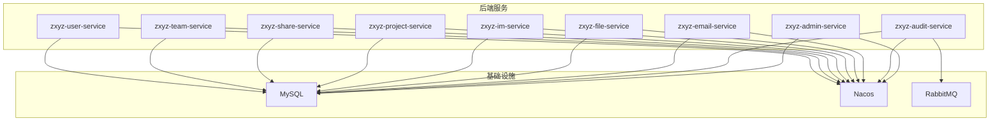
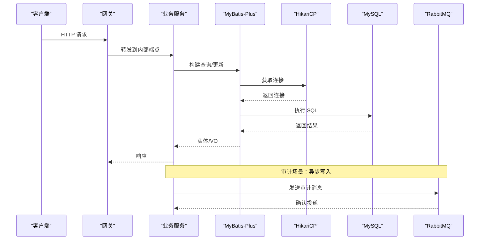
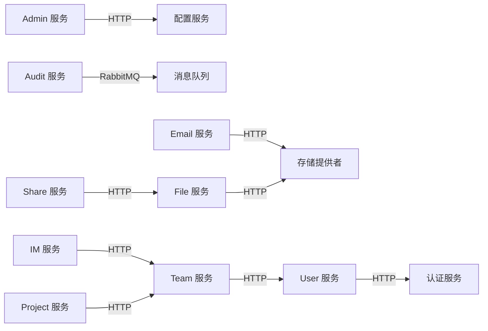

# 数据库性能优化

<cite>
**本文引用的文件**   
- [application.yml](file://ZXYZdatabaseBack/zxyz-admin-service/src/main/resources/application.yml)
- [application-dev.yml](file://ZXYZdatabaseBack/zxyz-admin-service/src/main/resources/application-dev.yml)
- [application-prod.yml](file://ZXYZdatabaseBack/zxyz-admin-service/src/main/resources/application-prod.yml)
- [ConfigDataSourceConfig.java](file://ZXYZdatabaseBack/zxyz-admin-service/src/main/java/uno/acloud/admin/config/ConfigDataSourceConfig.java)
- [application.yml](file://ZXYZdatabaseBack/zxyz-audit-service/src/main/resources/application.yml)
- [application-dev.yml](file://ZXYZdatabaseBack/zxyz-audit-service/src/main/resources/application-dev.yml)
- [application-prod.yml](file://ZXYZdatabaseBack/zxyz-audit-service/src/main/resources/application-prod.yml)
- [RabbitMqConfig.java](file://ZXYZdatabaseBack/zxyz-audit-service/src/main/java/uno/acloud/audit/config/RabbitMqConfig.java)
- [OperateLogConsumer.java](file://ZXYZdatabaseBack/zxyz-audit-service/src/main/java/uno/acloud/audit/mq/OperateLogConsumer.java)
- [application.yml](file://ZXYZdatabaseBack/zxyz-email-service/src/main/resources/application.yml)
- [application-dev.yml](file://ZXYZdatabaseBack/zxyz-email-service/src/main/resources/application-dev.yml)
- [application-prod.yml](file://ZXYZdatabaseBack/zxyz-email-service/src/main/resources/application-prod.yml)
- [application.yml](file://ZXYZdatabaseBack/zxyz-file-service/src/main/resources/application.yml)
- [application-dev.yml](file://ZXYZdatabaseBack/zxyz-file-service/src/main/resources/application-dev.yml)
- [application-prod.yml](file://ZXYZdatabaseBack/zxyz-file-service/src/main/resources/application-prod.yml)
- [application.yml](file://ZXYZdatabaseBack/zxyz-im-service/src/main/resources/application.yml)
- [application-dev.yml](file://ZXYZdatabaseBack/zxyz-im-service/src/main/resources/application-dev.yml)
- [application-prod.yml](file://ZXYZdatabaseBack/zxyz-im-service/src/main/resources/application-prod.yml)
- [application.yml](file://ZXYZdatabaseBack/zxyz-project-service/src/main/resources/application.yml)
- [application-dev.yml](file://ZXYZdatabaseBack/zxyz-project-service/src/main/resources/application-dev.yml)
- [application-prod.yml](file://ZXYZdatabaseBack/zxyz-project-service/src/main/resources/application-prod.yml)
- [application.yml](file://ZXYZdatabaseBack/zxyz-share-service/src/main/resources/application.yml)
- [application-dev.yml](file://ZXYZdatabaseBack/zxyz-share-service/src/main/resources/application-dev.yml)
- [application-prod.yml](file://ZXYZdatabaseBack/zxyz-share-service/src/main/resources/application-prod.yml)
- [application.yml](file://ZXYZdatabaseBack/zxyz-team-service/src/main/resources/application.yml)
- [application-dev.yml](file://ZXYZdatabaseBack/zxyz-team-service/src/main/resources/application-dev.yml)
- [application-prod.yml](file://ZXYZdatabaseBack/zxyz-team-service/src/main/resources/application-prod.yml)
- [application.yml](file://ZXYZdatabaseBack/zxyz-user-service/src/main/resources/application.yml)
- [application-dev.yml](file://ZXYZdatabaseBack/zxyz-user-service/src/main/resources/application-dev.yml)
- [application-prod.yml](file://ZXYZdatabaseBack/zxyz-user-service/src/main/resources/application-prod.yml)
- [schema_project.sql](file://ZXYZdatabaseBack/sql/schema_project.sql)
- [schema_user.sql](file://ZXYZdatabaseBack/sql/schema_user.sql)
- [schema_team.sql](file://ZXYZdatabaseBack/sql/schema_team.sql)
- [schema_im.sql](file://ZXYZdatabaseBack/sql/schema_im.sql)
- [schema_file.sql](file://ZXYZdatabaseBack/sql/schema_file.sql)
- [schema_email.sql](file://ZXYZdatabaseBack/sql/schema_email.sql)
- [schema_audit.sql](file://ZXYZdatabaseBack/sql/schema_audit.sql)
- [schema_share.sql](file://ZXYZdatabaseBack/sql/schema_share.sql)
- [zxyz-dynamic.yml](file://nacos-config/zxyz-dynamic.yml)
- [docker-compose.yml](file://docker-compose.yml)
</cite>

## 目录
1. [引言](#引言)
2. [项目结构](#项目结构)
3. [核心组件](#核心组件)
4. [架构总览](#架构总览)
5. [详细组件分析](#详细组件分析)
6. [依赖关系分析](#依赖关系分析)
7. [性能考量](#性能考量)
8. [故障排查指南](#故障排查指南)
9. [结论](#结论)
10. [附录](#附录)

## 引言
本指南面向 ZXYZ 项目的数据库性能优化，覆盖 MySQL 连接池（HikariCP）参数调优、SQL 语句优化、索引设计原则、MyBatis-Plus 性能优化、慢查询日志分析与优化方法，以及读写分离与分库分表策略。文档结合仓库中的服务配置、数据迁移脚本与 Nacos 动态配置，给出可落地的实践建议与排障路径。

## 项目结构
- 后端为多模块 Maven 工程，包含多个业务服务（admin、audit、email、file、im、project、share、team、user），每个服务均提供 application.yml 及 dev/prod 环境配置。
- 数据库相关 SQL 定义集中在 sql 目录下，按领域拆分（project、user、team、im、file、email、audit、share）。
- Nacos 集中管理动态配置（如 zxyz-dynamic.yml），用于运行时调整行为。
- 部署使用 docker-compose 编排，便于本地与测试环境验证优化效果。

**图表来源** 
- [docker-compose.yml](file://docker-compose.yml)
- [zxyz-dynamic.yml](file://nacos-config/zxyz-dynamic.yml)

**章节来源**
- [application.yml](file://ZXYZdatabaseBack/zxyz-admin-service/src/main/resources/application.yml)
- [application-dev.yml](file://ZXYZdatabaseBack/zxyz-admin-service/src/main/resources/application-dev.yml)
- [application-prod.yml](file://ZXYZdatabaseBack/zxyz-admin-service/src/main/resources/application-prod.yml)

## 核心组件
- 数据源与连接池：各服务通过 Spring Boot 自动装配 HikariCP；部分服务自定义 DataSource 配置类以细化连接池参数。
- MyBatis-Plus：作为 ORM 层，提供分页、批量操作、条件构造等能力，需配合合理的 SQL 与索引优化。
- 消息队列：审计服务通过 RabbitMQ 异步处理审计日志，降低写放大对数据库的压力。
- 配置中心：Nacos 提供动态配置，支持运行时调整数据库连接池、日志级别、功能开关等。

**章节来源**
- [ConfigDataSourceConfig.java](file://ZXYZdatabaseBack/zxyz-admin-service/src/main/java/uno/acloud/admin/config/ConfigDataSourceConfig.java)
- [RabbitMqConfig.java](file://ZXYZdatabaseBack/zxyz-audit-service/src/main/java/uno/acloud/audit/config/RabbitMqConfig.java)
- [OperateLogConsumer.java](file://ZXYZdatabaseBack/zxyz-audit-service/src/main/java/uno/acloud/audit/mq/OperateLogConsumer.java)

## 架构总览
下图展示典型的数据访问链路：前端请求经网关进入后端服务，服务调用 MyBatis-Plus 生成并执行 SQL，底层由 HikariCP 管理连接池，最终访问 MySQL。审计写入通过 RabbitMQ 异步落库，避免同步阻塞。

**图表来源** 
- [application.yml](file://ZXYZdatabaseBack/zxyz-admin-service/src/main/resources/application.yml)
- [application.yml](file://ZXYZdatabaseBack/zxyz-audit-service/src/main/resources/application.yml)
- [RabbitMqConfig.java](file://ZXYZdatabaseBack/zxyz-audit-service/src/main/java/uno/acloud/audit/config/RabbitMqConfig.java)

## 详细组件分析

### MySQL 连接池（HikariCP）配置优化
- maximumPoolSize：根据 CPU 核数与 IO 特性设置，通常取 2×CPU + 有效磁盘数；高并发读多写少场景可适当提高，但需监控连接等待与线程池饱和。
- connectionTimeout：连接获取超时，建议 5–10s，避免请求堆积；过低易导致频繁失败，过高则放大延迟。
- idleTimeout：空闲连接回收时间，建议略小于数据库 max_connections_timeout，减少僵尸连接。
- maxLifetime：连接最大生命周期，建议小于数据库 sidecar 或防火墙超时，避免连接被远端断开。
- keepaliveTime：心跳检测间隔，确保连接健康，避免冷连接失效。
- minimumIdle：最小空闲连接数，建议不低于 2–5，缓解突发流量时的连接创建开销。
- poolName：命名便于监控区分不同服务的连接池。
- dataSourceProperties：可透传 JDBC 参数，如 useSSL、rewriteBatchedStatements、useServerPrepStmts 等。

建议在不同环境（dev/prod）分别配置，并通过 Nacos 动态下发关键参数，实现灰度与回滚。

**章节来源**
- [application-dev.yml](file://ZXYZdatabaseBack/zxyz-admin-service/src/main/resources/application-dev.yml)
- [application-prod.yml](file://ZXYZdatabaseBack/zxyz-admin-service/src/main/resources/application-prod.yml)
- [application-dev.yml](file://ZXYZdatabaseBack/zxyz-project-service/src/main/resources/application-dev.yml)
- [application-prod.yml](file://ZXYZdatabaseBack/zxyz-project-service/src/main/resources/application-prod.yml)
- [application-dev.yml](file://ZXYZdatabaseBack/zxyz-im-service/src/main/resources/application-dev.yml)
- [application-prod.yml](file://ZXYZdatabaseBack/zxyz-im-service/src/main/resources/application-prod.yml)
- [application-dev.yml](file://ZXYZdatabaseBack/zxyz-email-service/src/main/resources/application-dev.yml)
- [application-prod.yml](file://ZXYZdatabaseBack/zxyz-email-service/src/main/resources/application-prod.yml)
- [application-dev.yml](file://ZXYZdatabaseBack/zxyz-file-service/src/main/resources/application-dev.yml)
- [application-prod.yml](file://ZXYZdatabaseBack/zxyz-file-service/src/main/resources/application-prod.yml)
- [application-dev.yml](file://ZXYZdatabaseBack/zxyz-user-service/src/main/resources/application-dev.yml)
- [application-prod.yml](file://ZXYZdatabaseBack/zxyz-user-service/src/main/resources/application-prod.yml)
- [application-dev.yml](file://ZXYZdatabaseBack/zxyz-team-service/src/main/resources/application-dev.yml)
- [application-prod.yml](file://ZXYZdatabaseBack/zxyz-team-service/src/main/resources/application-prod.yml)
- [application-dev.yml](file://ZXYZdatabaseBack/zxyz-share-service/src/main/resources/application-dev.yml)
- [application-prod.yml](file://ZXYZdatabaseBack/zxyz-share-service/src/main/resources/application-prod.yml)
- [application-dev.yml](file://ZXYZdatabaseBack/zxyz-audit-service/src/main/resources/application-dev.yml)
- [application-prod.yml](file://ZXYZdatabaseBack/zxyz-audit-service/src/main/resources/application-prod.yml)

### SQL 语句优化技巧
- EXPLAIN 分析执行计划：关注 type（ALL/const/ref/range/index/ALL）、rows、Extra（Using filesort、Using temporary、Using where、Using index）。
- 避免 N+1 查询：在应用层合并查询或使用 JOIN，减少往返次数；必要时使用投影 VO 减少字段传输。
- 批量操作优化：使用批量插入/更新（JDBC rewriteBatchedStatements=TRUE），控制批次大小（如 500–2000），避免事务过大。
- 分页优化：深分页时使用延迟关联或基于游标分页，避免 large LIMIT OFFSET。
- 函数与表达式：避免在 WHERE 中对列使用函数或表达式，防止索引失效。
- 排序与分组：尽量利用索引排序，避免 Using filesort；必要时建立合适复合索引。

**章节来源**
- [schema_project.sql](file://ZXYZdatabaseBack/sql/schema_project.sql)
- [schema_user.sql](file://ZXYZdatabaseBack/sql/schema_user.sql)
- [schema_team.sql](file://ZXYZdatabaseBack/sql/schema_team.sql)
- [schema_im.sql](file://ZXYZdatabaseBack/sql/schema_im.sql)
- [schema_file.sql](file://ZXYZdatabaseBack/sql/schema_file.sql)
- [schema_email.sql](file://ZXYZdatabaseBack/sql/schema_email.sql)
- [schema_audit.sql](file://ZXYZdatabaseBack/sql/schema_audit.sql)
- [schema_share.sql](file://ZXYZdatabaseBack/sql/schema_share.sql)

### 索引设计原则
- 复合索引：遵循最左前缀原则，将高频等值条件放前面，范围条件放后面；避免过多列导致维护成本上升。
- 覆盖索引：查询所需字段全部在索引中，避免回表；适用于统计、列表页投影查询。
- 前缀索引：对长字符串列使用前缀索引，平衡选择性与维护成本。
- 唯一索引：保证业务唯一性，同时提升查询性能。
- 联合主键与外键：谨慎使用外键约束，微服务下更推荐应用层一致性。
- 索引维护：定期分析统计信息，重建碎片化索引，监控未使用索引。

**章节来源**
- [schema_project.sql](file://ZXYZdatabaseBack/sql/schema_project.sql)
- [schema_user.sql](file://ZXYZdatabaseBack/sql/schema_user.sql)
- [schema_team.sql](file://ZXYZdatabaseBack/sql/schema_team.sql)
- [schema_im.sql](file://ZXYZdatabaseBack/sql/schema_im.sql)
- [schema_file.sql](file://ZXYZdatabaseBack/sql/schema_file.sql)
- [schema_email.sql](file://ZXYZdatabaseBack/sql/schema_email.sql)
- [schema_audit.sql](file://ZXYZdatabaseBack/sql/schema_audit.sql)
- [schema_share.sql](file://ZXYZdatabaseBack/sql/schema_share.sql)

### MyBatis-Plus 性能优化
- 分页查询优化：合理设置 page.size，避免一次性加载大量数据；复杂分页使用延迟关联或子查询优化。
- 批量插入：使用 saveBatch，控制 batchSize，开启 JDBC rewriteBatchedStatements；大事务拆分为小事务。
- 懒加载配置：按需启用懒加载，避免不必要的关联查询；注意循环引用问题。
- 条件构造器：避免动态拼接导致无法命中索引；尽量使用等值与范围条件。
- 缓存：合理使用二级缓存（需谨慎评估一致性），热点数据可引入 Redis。

**章节来源**
- [application.yml](file://ZXYZdatabaseBack/zxyz-admin-service/src/main/resources/application.yml)
- [application.yml](file://ZXYZdatabaseBack/zxyz-audit-service/src/main/resources/application.yml)
- [application.yml](file://ZXYZdatabaseBack/zxyz-email-service/src/main/resources/application.yml)
- [application.yml](file://ZXYZdatabaseBack/zxyz-file-service/src/main/resources/application.yml)
- [application.yml](file://ZXYZdatabaseBack/zxyz-im-service/src/main/resources/application.yml)
- [application.yml](file://ZXYZdatabaseBack/zxyz-project-service/src/main/resources/application.yml)
- [application.yml](file://ZXYZdatabaseBack/zxyz-share-service/src/main/resources/application.yml)
- [application.yml](file://ZXYZdatabaseBack/zxyz-team-service/src/main/resources/application.yml)
- [application.yml](file://ZXYZdatabaseBack/zxyz-user-service/src/main/resources/application.yml)

### 慢查询日志分析与优化方法
- 定位慢查询：开启 slow_query_log，设置 long_query_time，收集慢 SQL 样本。
- 分析执行计划：使用 EXPLAIN 查看扫描行数、类型、是否临时表与文件排序。
- 索引失效排查：检查 WHERE 条件是否对列使用函数、隐式类型转换、LIKE 前缀通配符。
- 表结构优化：拆分大表、归档历史数据、冷热分离；适当冗余字段减少 JOIN。
- 批量化与异步化：将批量写入改为分批提交，非关键路径异步处理（如审计日志）。

**章节来源**
- [application-dev.yml](file://ZXYZdatabaseBack/zxyz-admin-service/src/main/resources/application-dev.yml)
- [application-prod.yml](file://ZXYZdatabaseBack/zxyz-admin-service/src/main/resources/application-prod.yml)
- [application-dev.yml](file://ZXYZdatabaseBack/zxyz-audit-service/src/main/resources/application-dev.yml)
- [application-prod.yml](file://ZXYZdatabaseBack/zxyz-audit-service/src/main/resources/application-prod.yml)

### 读写分离与分库分表策略
- 读写分离：主库负责写，从库负责读；通过路由规则将读请求分发至从库，注意主从延迟与一致性要求。
- 分库分表：按租户/团队维度进行水平拆分，选择合适分片键（如 team_id、project_id）；避免跨分片 JOIN。
- 全局 ID：使用分布式 ID 生成器（雪花算法），避免自增冲突。
- 数据迁移：采用双写与回放机制，逐步迁移；灰度发布与回滚预案必备。
- 监控告警：监控分片分布、热点分片、锁竞争、复制延迟。

**章节来源**
- [zxyz-dynamic.yml](file://nacos-config/zxyz-dynamic.yml)
- [docker-compose.yml](file://docker-compose.yml)

## 依赖关系分析
- 服务间依赖：通过 ServiceClient 调用其他服务，内部端点受 SaToken 鉴权保护，禁止公网访问。
- 数据依赖：各服务独立数据库实例或 Schema，避免强耦合；审计服务通过 RabbitMQ 解耦写入。
- 配置依赖：Nacos 统一管理动态配置，支持运行时调整数据库连接池、日志级别、功能开关。

**图表来源** 
- [application.yml](file://ZXYZdatabaseBack/zxyz-admin-service/src/main/resources/application.yml)
- [RabbitMqConfig.java](file://ZXYZdatabaseBack/zxyz-audit-service/src/main/java/uno/acloud/audit/config/RabbitMqConfig.java)

**章节来源**
- [application.yml](file://ZXYZdatabaseBack/zxyz-admin-service/src/main/resources/application.yml)
- [application.yml](file://ZXYZdatabaseBack/zxyz-audit-service/src/main/resources/application.yml)
- [application.yml](file://ZXYZdatabaseBack/zxyz-email-service/src/main/resources/application.yml)
- [application.yml](file://ZXYZdatabaseBack/zxyz-file-service/src/main/resources/application.yml)
- [application.yml](file://ZXYZdatabaseBack/zxyz-im-service/src/main/resources/application.yml)
- [application.yml](file://ZXYZdatabaseBack/zxyz-project-service/src/main/resources/application.yml)
- [application.yml](file://ZXYZdatabaseBack/zxyz-share-service/src/main/resources/application.yml)
- [application.yml](file://ZXYZdatabaseBack/zxyz-team-service/src/main/resources/application.yml)
- [application.yml](file://ZXYZdatabaseBack/zxyz-user-service/src/main/resources/application.yml)

## 性能考量
- 连接池容量与线程模型匹配：避免连接不足导致排队，也避免过大造成上下文切换开销。
- SQL 复杂度与索引命中率：优先优化 SQL，其次考虑缓存与异步化。
- 批量与事务边界：合理拆分事务，避免长事务占用连接与锁资源。
- 监控与观测：接入 APM 与数据库监控，观察 QPS、延迟、连接池使用率、慢查询数量。
- 容量规划：根据峰值流量与增长趋势预留资源，定期压测验证。

[本节为通用指导，不直接分析具体文件]

## 故障排查指南
- 连接池耗尽：检查 maximumPoolSize、connectionTimeout、idleTimeout、maxLifetime；监控连接泄漏与活跃连接数。
- 慢查询频发：收集慢查询日志，EXPLAIN 分析执行计划，补充或调整索引，改写 SQL。
- 死锁与锁竞争：分析 InnoDB 锁等待图，减少长事务，避免大范围更新。
- 主从延迟：调整复制参数，必要时降级读一致性；对强一致场景强制走主库。
- 消息积压：检查消费者处理能力，扩容消费者实例，优化批量处理逻辑。

**章节来源**
- [application-dev.yml](file://ZXYZdatabaseBack/zxyz-admin-service/src/main/resources/application-dev.yml)
- [application-prod.yml](file://ZXYZdatabaseBack/zxyz-admin-service/src/main/resources/application-prod.yml)
- [application-dev.yml](file://ZXYZdatabaseBack/zxyz-audit-service/src/main/resources/application-dev.yml)
- [application-prod.yml](file://ZXYZdatabaseBack/zxyz-audit-service/src/main/resources/application-prod.yml)
- [OperateLogConsumer.java](file://ZXYZdatabaseBack/zxyz-audit-service/src/main/java/uno/acloud/audit/mq/OperateLogConsumer.java)

## 结论
通过合理配置 HikariCP、优化 SQL 与索引、使用 MyBatis-Plus 的最佳实践、分析慢查询日志，并结合读写分离与分库分表策略，可以显著提升 ZXYZ 项目的数据库性能与稳定性。建议在开发阶段即纳入性能基线与压测，持续监控与迭代优化。

[本节为总结性内容，不直接分析具体文件]

## 附录
- 常用命令：SHOW PROCESSLIST、SHOW ENGINE INNODB STATUS、ANALYZE TABLE、OPTIMIZE TABLE。
- 监控指标：连接池使用率、慢查询数量、QPS、TP99、锁等待、复制延迟。
- 工具推荐：Percona Toolkit、pt-query-digest、Explain Analyzer。

[本节为通用参考，不直接分析具体文件]