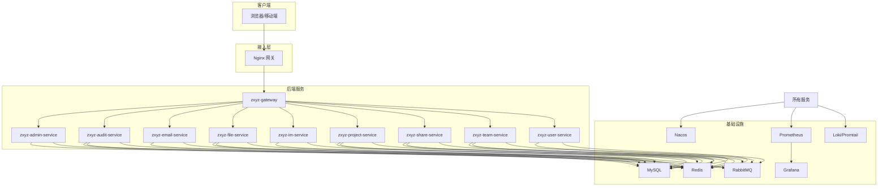
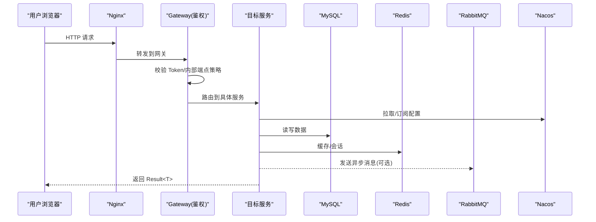
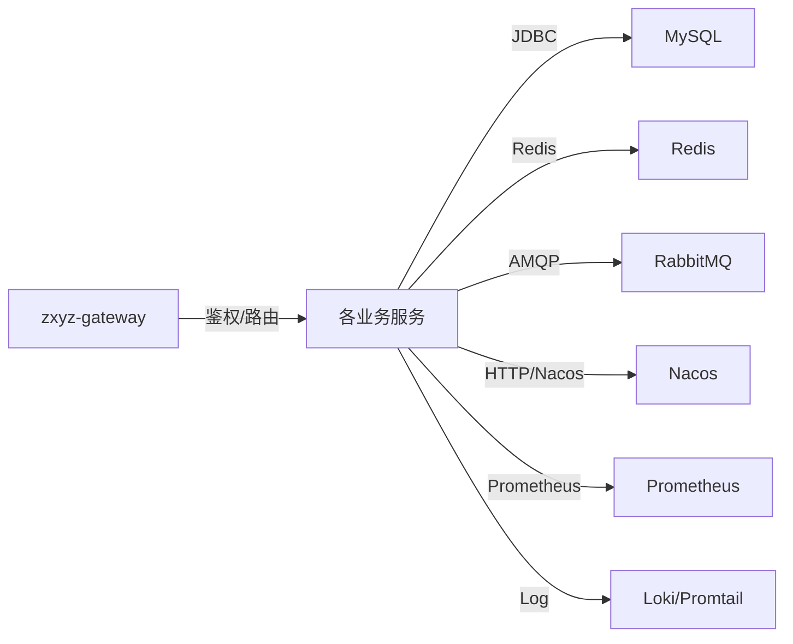
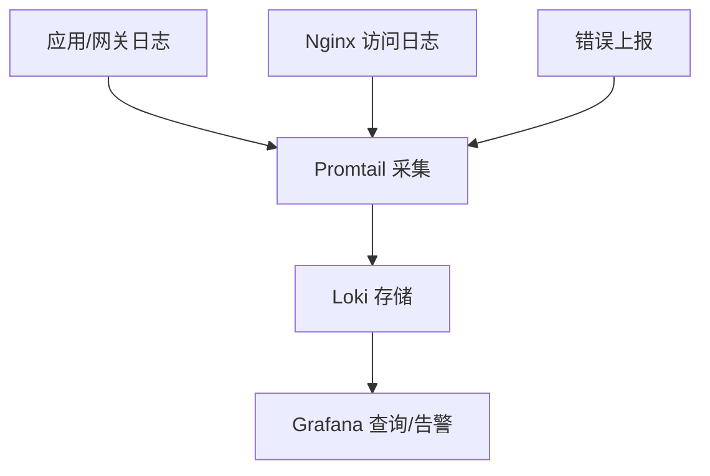
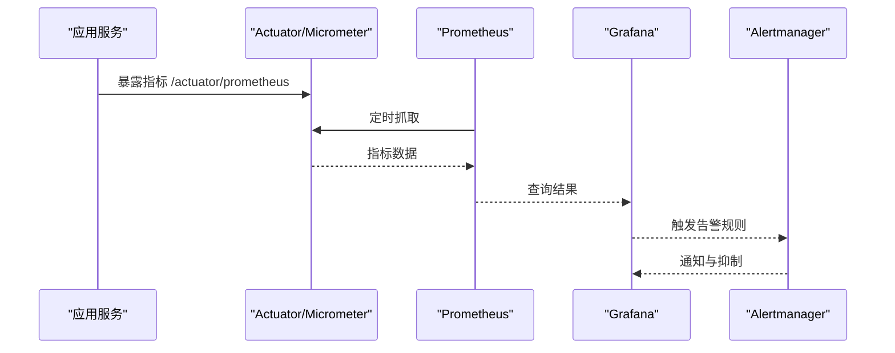
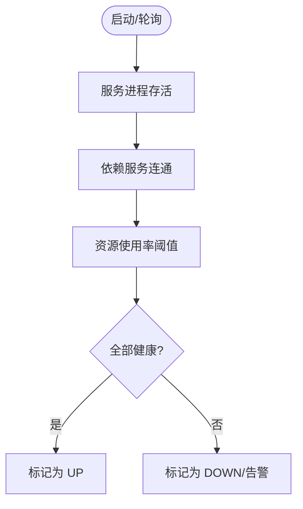

# 故障排查与监控

<cite>
**本文引用的文件**   
- [docker-compose.yml](file://docker-compose.yml)
- [docker-compose.dev.yml](file://docker-compose.dev.yml)
- [Dockerfile.base](file://Dockerfile.base)
- [deploy/nginx/default.conf](file://deploy/nginx/default.conf)
- [deploy/promtail-config.yml](file://deploy/promtail-config.yml)
- [scripts/health-check.sh](file://scripts/health-check.sh)
- [nacos-config/zxyz-static.yml](file://nacos-config/zxyz-static.yml)
- [nacos-config/zxyz-dynamic.yml](file://nacos-config/zxyz-dynamic.yml)
- [ZXYZdatabaseBack/pom.xml](file://ZXYZdatabaseBack/pom.xml)
- [ZXYZdatabaseBack/ZXYZdatabaseBack/zxyz-admin-service/src/main/resources/application.yml](file://ZXYZdatabaseBack/zxyz-admin-service/src/main/resources/application.yml)
- [ZXYZdatabaseBack/ZXYZdatabaseBack/zxyz-audit-service/src/main/java/uno/acloud/audit/config/RabbitMqConfig.java](file://ZXYZdatabaseBack/zxyz-audit-service/src/main/java/uno/acloud/audit/config/RabbitMqConfig.java)
- [ZXYZdatabaseBack/ZXYZdatabaseBack/zxyz-audit-service/src/main/java/uno/acloud/audit/mq/AuditDlqConsumer.java](file://ZXYZdatabaseBack/zxyz-audit-service/src/main/java/uno/acloud/audit/mq/AuditDlqConsumer.java)
- [ZXYZdatabaseBack/ZXYZdatabaseBack/zxyz-common/src/main/resources/application-common.yml](file://ZXYZdatabaseBack/zxyz-common/src/main/resources/application-common.yml)
- [ZXYZdatabaseFront/package.json](file://ZXYZdatabaseFront/package.json)
- [ZXYZdatabaseFront/vite.config.js](file://ZXYZdatabaseFront/vite.config.js)
- [ZXYZdatabaseFront/src/utils/logger.js](file://ZXYZdatabaseFront/src/utils/logger.js)
- [ZXYZdatabaseFront/src/utils/request.js](file://ZXYZdatabaseFront/src/utils/request.js)
- [ZXYZdatabaseFront/src/utils/error.js](file://ZXYZdatabaseFront/src/utils/error.js)
- [deploy/fast-deploy.sh](file://scripts/deploy-fast.sh)
- [deploy/rollback.sh](file://scripts/rollback.sh)
</cite>

## 目录
1. [简介](#简介)
2. [项目结构](#项目结构)
3. [核心组件](#核心组件)
4. [架构总览](#架构总览)
5. [详细组件分析](#详细组件分析)
6. [依赖关系分析](#依赖关系分析)
7. [性能考量](#性能考量)
8. [故障排查指南](#故障排查指南)
9. [结论](#结论)
10. [附录](#附录)

## 简介
本文件面向 ZXYZ 项目的运维与研发人员，提供覆盖服务启动、数据库连接、Redis 缓存、RabbitMQ 消息、Nacos 配置加载等常见问题的诊断与处理方法；统一日志收集与分析策略；搭建 Prometheus + Grafana 监控体系与健康检查机制；给出性能分析方法（JVM、数据库慢查询、前端性能）以及应急响应流程、故障恢复策略与预防措施。文档内容基于仓库中的 Docker Compose 编排、Nacos 配置、各服务配置文件与脚本进行说明，确保可落地执行。

## 项目结构
ZXYZ 采用微服务架构：后端为 Maven 多模块（约 11 个服务），前端为 Vue 3 SPA，通过 Nginx 反向代理暴露。基础设施包括 MySQL、Redis、RabbitMQ、Nacos 等，由 Docker Compose 统一编排。部署与发布使用 GitHub Actions CI/CD，镜像推送至 GHCR。

图表来源
- [docker-compose.yml](file://docker-compose.yml)
- [deploy/nginx/default.conf](file://deploy/nginx/default.conf)

章节来源
- [docker-compose.yml](file://docker-compose.yml)
- [docker-compose.dev.yml](file://docker-compose.dev.yml)
- [ZXYZdatabaseBack/pom.xml](file://ZXYZdatabaseBack/pom.xml)

## 核心组件
- 网关与鉴权：Nginx 作为入口，内部端点 /api/internal/** 由 Gateway SaToken 过滤器拒绝公网访问，服务间调用需携带 X-Internal-Service-Token。
- 配置中心：Nacos 管理静态与动态配置，敏感信息通过 Jasypt 加密。
- 数据持久化：MySQL 存储业务数据，Redis 用于会话、缓存与分布式锁。
- 异步通信：RabbitMQ Topic Exchange zxyz.topic 承载审计、文件处理、团队事件等消息。
- 监控与日志：Prometheus 采集指标，Grafana 可视化，Promtail/Loki 收集应用与访问日志。
- 健康检查：容器级 healthcheck 与脚本 health-check.sh 组合，检测服务存活与依赖可用性。

章节来源
- [ZXYZdatabaseBack/ZXYZdatabaseBack/zxyz-common/src/main/resources/application-common.yml](file://ZXYZdatabaseBack/zxyz-common/src/main/resources/application-common.yml)
- [nacos-config/zxyz-static.yml](file://nacos-config/zxyz-static.yml)
- [nacos-config/zxyz-dynamic.yml](file://nacos-config/zxyz-dynamic.yml)
- [deploy/promtail-config.yml](file://deploy/promtail-config.yml)
- [scripts/health-check.sh](file://scripts/health-check.sh)

## 架构总览
下图展示请求从前端到后端服务的典型路径，以及关键中间件交互。

图表来源
- [deploy/nginx/default.conf](file://deploy/nginx/default.conf)
- [ZXYZdatabaseBack/ZXYZdatabaseBack/zxyz-common/src/main/resources/application-common.yml](file://ZXYZdatabaseBack/zxyz-common/src/main/resources/application-common.yml)

## 详细组件分析

### 服务启动失败
常见问题与定位步骤：
- 端口冲突或容器网络不可达：检查 docker-compose 端口映射与服务名解析。
- 环境变量缺失：确认 .env 或 compose 中必需变量已注入。
- 依赖服务未就绪：数据库、Redis、RabbitMQ、Nacos 未启动或健康检查失败。
- JVM 启动参数不当：内存不足导致 OOM，或 GC 参数不匹配。
- 镜像构建问题：基础镜像版本不一致或缺失依赖。

建议操作：
- 查看容器日志与 healthcheck 状态，优先解决依赖服务。
- 调整 JVM 启动参数与容器资源限制。
- 使用 scripts/health-check.sh 验证依赖连通性。

章节来源
- [docker-compose.yml](file://docker-compose.yml)
- [Dockerfile.base](file://Dockerfile.base)
- [scripts/health-check.sh](file://scripts/health-check.sh)

### 数据库连接问题
症状：
- 启动时报连接超时或认证失败。
- 运行时出现连接池耗尽、SQL 执行缓慢。

排查要点：
- 核对 MySQL 地址、端口、用户名、密码、时区与字符集。
- 检查连接池大小、最大空闲数、超时时间是否合理。
- 观察慢查询日志，定位长事务与大表扫描。
- 确认防火墙与安全组放行。

优化建议：
- 根据 QPS 与并发调优连接池参数。
- 对热点 SQL 建立索引，避免全表扫描。
- 拆分大事务，减少锁竞争。

章节来源
- [ZXYZdatabaseBack/ZXYZdatabaseBack/zxyz-common/src/main/resources/application-common.yml](file://ZXYZdatabaseBack/zxyz-common/src/main/resources/application-common.yml)

### Redis 缓存异常
症状：
- 缓存命中率低、频繁穿透或雪崩。
- 序列化/反序列化失败。
- 连接超时或内存不足。

排查要点：
- 检查 Redis 地址、密码、数据库索引与超时配置。
- 确认缓存键命名规范与过期策略。
- 监控内存使用率与淘汰策略。

优化建议：
- 引入布隆过滤器防穿透，设置随机过期防雪崩。
- 合理设置 TTL，热点 key 单独维护。
- 分库分片与扩容提升吞吐。

章节来源
- [ZXYZdatabaseBack/ZXYZdatabaseBack/zxyz-common/src/main/resources/application-common.yml](file://ZXYZdatabaseBack/zxyz-common/src/main/resources/application-common.yml)

### RabbitMQ 消息丢失
症状：
- 审计日志未落库、文件处理任务未完成。
- DLQ 队列堆积。

排查要点：
- 确认交换机类型与路由键配置正确。
- 检查消费者重试与死信队列处理逻辑。
- 观察生产者确认与消费者 ACK 机制。

优化建议：
- 开启生产者 confirm 与消费者手动 ACK。
- 对关键消息做幂等处理与去重。
- 定期巡检 DLQ 并告警。

章节来源
- [ZXYZdatabaseBack/ZXYZdatabaseBack/zxyz-audit-service/src/main/java/uno/acloud/audit/config/RabbitMqConfig.java](file://ZXYZdatabaseBack/ZXYZdatabaseBack/zxyz-audit-service/src/main/java/uno/acloud/audit/config/RabbitMqConfig.java)
- [ZXYZdatabaseBack/ZXYZdatabaseBack/zxyz-audit-service/src/main/java/uno/acloud/audit/mq/AuditDlqConsumer.java](file://ZXYZdatabaseBack/ZXYZdatabaseBack/zxyz-audit-service/src/main/java/uno/acloud/audit/mq/AuditDlqConsumer.java)

### Nacos 配置加载失败
症状：
- 服务启动卡住或报配置获取错误。
- 动态配置不生效。

排查要点：
- 检查 Nacos 地址、命名空间、分组与 Data ID。
- 确认 Jasypt 解密密钥与环境变量。
- 观察 Nacos 控制台配置是否正确发布。

优化建议：
- 将敏感配置放入 Nacos 并使用 Jasypt 加密。
- 对关键配置增加本地降级默认值。

章节来源
- [nacos-config/zxyz-static.yml](file://nacos-config/zxyz-static.yml)
- [nacos-config/zxyz-dynamic.yml](file://nacos-config/zxyz-dynamic.yml)

### 网关与鉴权问题
症状：
- 内部端点被拒绝访问。
- Token 失效或跨域异常。

排查要点：
- 确认 X-Internal-Service-Token 传递与校验。
- 检查 SaToken 配置与 Cookie 的 HttpOnly 设置。
- 核对 CORS 与白名单。

章节来源
- [ZXYZdatabaseBack/ZXYZdatabaseBack/zxyz-common/src/main/resources/application-common.yml](file://ZXYZdatabaseBack/ZXYZdatabaseBack/zxyz-common/src/main/resources/application-common.yml)
- [deploy/nginx/default.conf](file://deploy/nginx/default.conf)

### 前端请求与错误处理
症状：
- 页面报错、接口返回非预期结构。
- 上传/下载失败。

排查要点：
- 检查 request.js 拦截器与错误模型 error.js。
- 确认 logger.js 输出级别与上报通道。
- 核对 vite.config.js 代理与跨域配置。

优化建议：
- 统一错误码与提示文案。
- 对长耗时操作增加进度与重试。

章节来源
- [ZXYZdatabaseFront/src/utils/request.js](file://ZXYZdatabaseFront/src/utils/request.js)
- [ZXYZdatabaseFront/src/utils/error.js](file://ZXYZdatabaseFront/src/utils/error.js)
- [ZXYZdatabaseFront/src/utils/logger.js](file://ZXYZdatabaseFront/src/utils/logger.js)
- [ZXYZdatabaseFront/vite.config.js](file://ZXYZdatabaseFront/vite.config.js)

## 依赖关系分析
服务间依赖与外部系统耦合如下：

图表来源
- [docker-compose.yml](file://docker-compose.yml)
- [ZXYZdatabaseBack/ZXYZdatabaseBack/zxyz-common/src/main/resources/application-common.yml](file://ZXYZdatabaseBack/ZXYZdatabaseBack/zxyz-common/src/main/resources/application-common.yml)

章节来源
- [docker-compose.yml](file://docker-compose.yml)
- [ZXYZdatabaseBack/ZXYZdatabaseBack/zxyz-common/src/main/resources/application-common.yml](file://ZXYZdatabaseBack/ZXYZdatabaseBack/zxyz-common/src/main/resources/application-common.yml)

## 性能考量
- JVM 性能调优：根据容器资源限制设置 -Xms/-Xmx，选择合适的 GC 算法（如 G1），启用堆转储与 GC 日志，结合 Prometheus 指标分析停顿与吞吐量。
- 数据库慢查询分析：开启慢查询日志，使用 EXPLAIN 分析执行计划，优化索引与分页；对热点表考虑读写分离或分库分表。
- 前端性能优化：代码分割与懒加载、图片压缩与 CDN、减少重排重绘、合理使用 WebSocket 与缓存策略。
- 缓存与消息：提高缓存命中率，合理设置 TTL；消息批量发送与消费，避免热点 key 与单点瓶颈。

[本节为通用指导，无需特定文件引用]

## 故障排查指南

### 统一日志收集与分析策略
- 应用日志：各服务输出结构化 JSON 日志，包含 traceId、level、service、message 等字段，便于聚合检索。
- 访问日志：Nginx access/error 日志集中采集，关联请求链路。
- 错误日志：统一捕获异常并上报，包含堆栈与上下文。
- 采集方案：Promtail 收集容器日志，写入 Loki；Grafana 统一查询与可视化。

图表来源
- [deploy/promtail-config.yml](file://deploy/promtail-config.yml)

章节来源
- [deploy/promtail-config.yml](file://deploy/promtail-config.yml)

### 监控系统搭建
- 指标采集：Spring Boot Actuator + Micrometer 暴露 /actuator/prometheus，Prometheus 定时抓取。
- 可视化展示：Grafana 导入预置仪表盘，自定义关键面板（CPU、内存、GC、JDBC、Redis、MQ）。
- 告警规则：基于阈值与趋势配置告警（如 CPU > 80%、错误率 > 5%、延迟 P99 > 1s、连接池耗尽、DLQ 堆积）。

图表来源
- [ZXYZdatabaseBack/ZXYZdatabaseBack/zxyz-common/src/main/resources/application-common.yml](file://ZXYZdatabaseBack/ZXYZdatabaseBack/zxyz-common/src/main/resources/application-common.yml)

章节来源
- [ZXYZdatabaseBack/ZXYZdatabaseBack/zxyz-common/src/main/resources/application-common.yml](file://ZXYZdatabaseBack/ZXYZdatabaseBack/zxyz-common/src/main/resources/application-common.yml)

### 健康检查机制
- 服务健康：容器 healthcheck 探测端口与 /actuator/health。
- 依赖健康：脚本 health-check.sh 检测 MySQL、Redis、RabbitMQ、Nacos 连通性。
- 资源监控：CPU、内存、磁盘、网络与容器状态。

图表来源
- [scripts/health-check.sh](file://scripts/health-check.sh)
- [docker-compose.yml](file://docker-compose.yml)

章节来源
- [scripts/health-check.sh](file://scripts/health-check.sh)
- [docker-compose.yml](file://docker-compose.yml)

### 应急响应流程
- 发现与分级：监控告警与用户反馈触发，按影响范围与严重度分级。
- 快速止血：限流、熔断、降级、回滚、隔离故障节点。
- 根因定位：日志聚合、链路追踪、指标下钻、依赖健康检查。
- 恢复与复盘：验证修复效果，更新预案与知识库，持续改进。

章节来源
- [scripts/rollback.sh](file://scripts/rollback.sh)
- [scripts/deploy-fast.sh](file://scripts/deploy-fast.sh)

### 故障恢复策略与预防措施
- 回滚策略：一键回滚到上一稳定版本，保留快照与数据备份。
- 灰度发布：逐步放量，观察指标与错误率，自动回滚。
- 容量规划：预留冗余资源，弹性扩缩容。
- 预防演练：混沌工程与压测，提前发现瓶颈与单点。

章节来源
- [scripts/rollback.sh](file://scripts/rollback.sh)
- [scripts/deploy-fast.sh](file://scripts/deploy-fast.sh)

## 结论
通过统一的日志与监控体系、完善的健康检查与应急流程，ZXYZ 能够在复杂微服务环境下快速定位与恢复故障。建议持续完善指标维度与告警规则，强化依赖健康检查与自动化回滚能力，形成闭环的稳定性保障体系。

## 附录
- 常用命令与脚本：
  - 健康检查：scripts/health-check.sh
  - 快速部署：scripts/deploy-fast.sh
  - 回滚：scripts/rollback.sh
- 前端包管理与构建：
  - package.json、vite.config.js

章节来源
- [scripts/health-check.sh](file://scripts/health-check.sh)
- [scripts/deploy-fast.sh](file://scripts/deploy-fast.sh)
- [scripts/rollback.sh](file://scripts/rollback.sh)
- [ZXYZdatabaseFront/package.json](file://ZXYZdatabaseFront/package.json)
- [ZXYZdatabaseFront/vite.config.js](file://ZXYZdatabaseFront/vite.config.js)