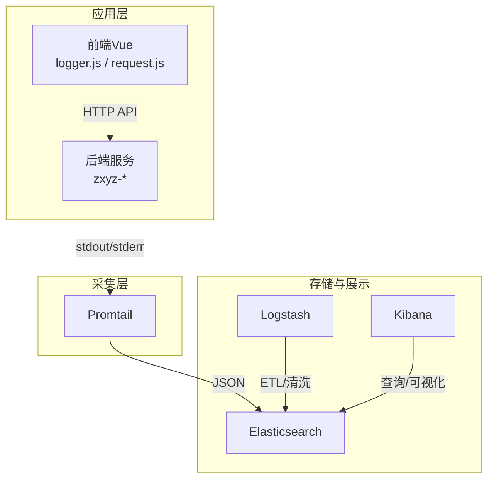
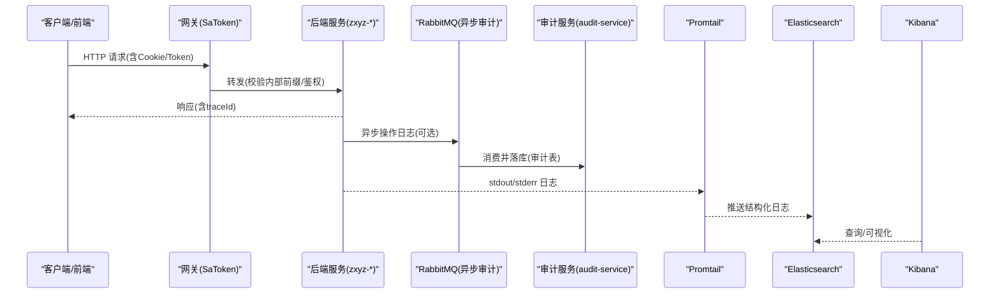
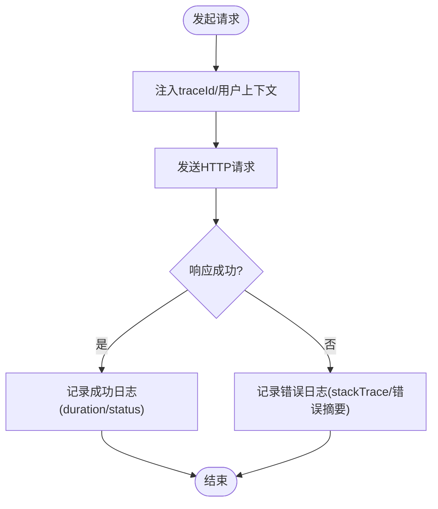
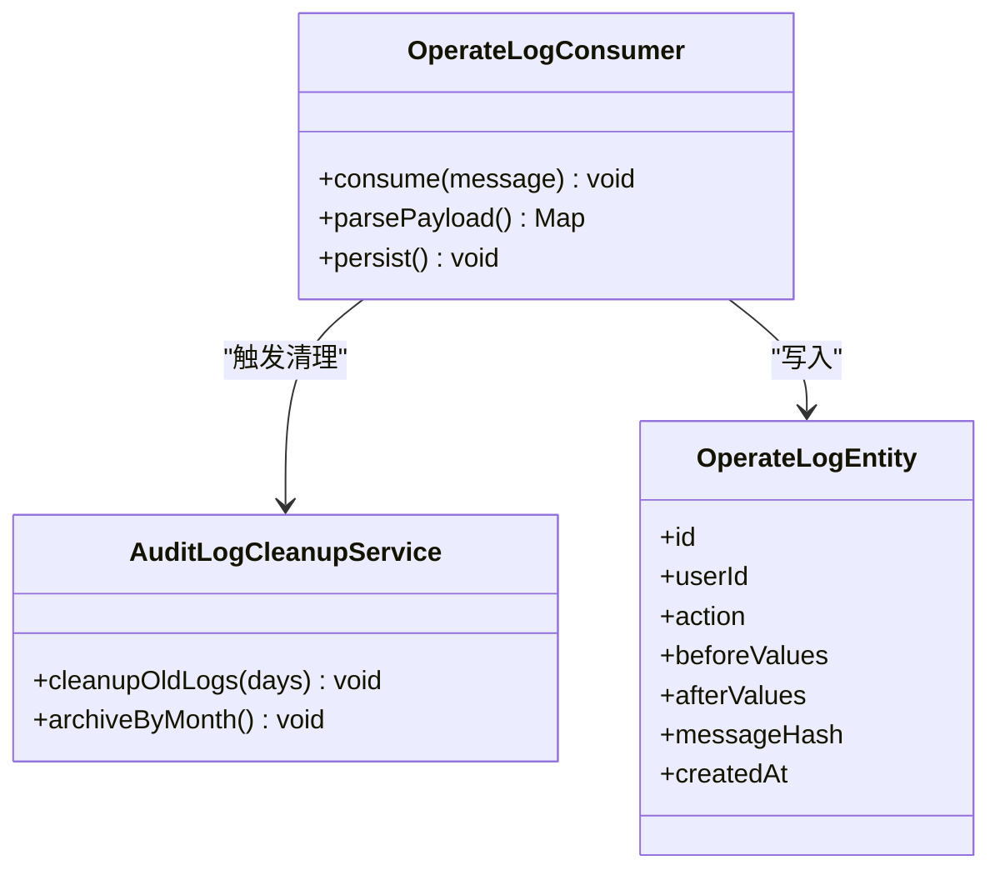
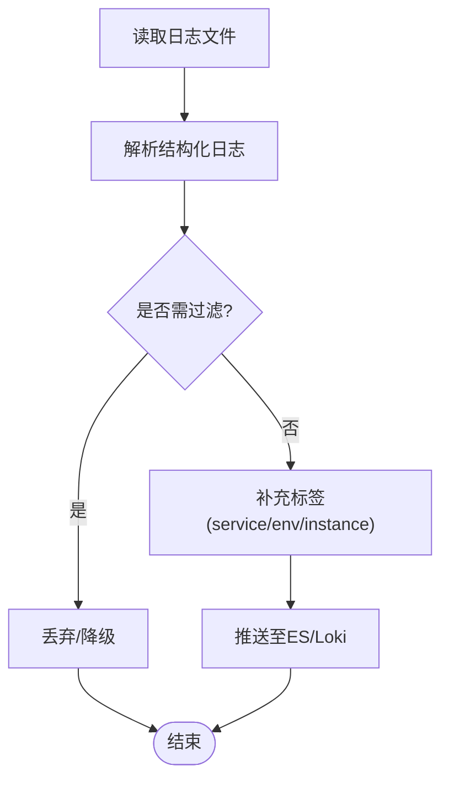
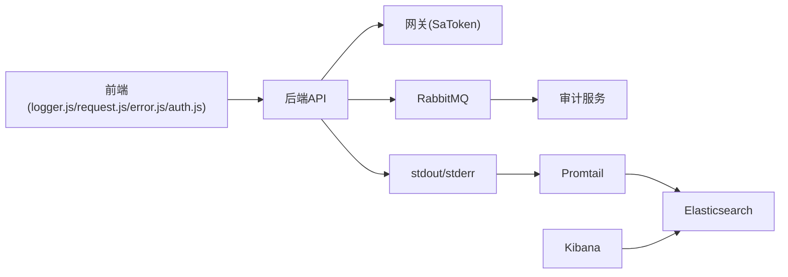

# 日志收集与分析

<cite>
**本文引用的文件**   
- [docker-compose.yml](file://docker-compose.yml)
- [deploy/promtail-config.yml](file://deploy/promtail-config.yml)
- [ZXYZdatabaseBack/zxyz-common/src/main/resources/application-common.yml](file://ZXYZdatabaseBack/zxyz-common/src/main/resources/application-common.yml)
- [ZXYZdatabaseBack/zxyz-gateway/src/main/java/uno/acloud/gateway/filter/SaTokenFilterConfig.java](file://ZXYZdatabaseBack/zxyz-gateway/src/main/java/uno/acloud/gateway/filter/SaTokenFilterConfig.java)
- [ZXYZdatabaseBack/zxyz-audit-service/src/main/java/uno/acloud/audit/mq/OperateLogConsumer.java](file://ZXYZdatabaseBack/zxyz-audit-service/src/main/java/uno/acloud/audit/mq/OperateLogConsumer.java)
- [ZXYZdatabaseBack/zxyz-audit-service/src/main/java/uno/acloud/audit/service/AuditLogCleanupService.java](file://ZXYZdatabaseBack/zxyz-audit-service/src/main/java/uno/acloud/audit/service/AuditLogCleanupService.java)
- [ZXYZdatabaseBack/zxyz-audit-service/src/main/resources/db/migration/V1__init_schema.sql](file://ZXYZdatabaseBack/zxyz-audit-service/src/main/resources/db/migration/V1__init_schema.sql)
- [ZXYZdatabaseBack/zxyz-audit-service/src/main/resources/db/migration/V2__add_operate_log_before_after_values.sql](file://ZXYZdatabaseBack/zxyz-audit-service/src/main/resources/db/migration/V2__add_operate_log_before_after_values.sql)
- [ZXYZdatabaseFront/src/utils/logger.js](file://ZXYZdatabaseFront/src/utils/logger.js)
- [ZXYZdatabaseFront/src/utils/request.js](file://ZXYZdatabaseFront/src/utils/request.js)
- [ZXYZdatabaseFront/src/utils/error.js](file://ZXYZdatabaseFront/src/utils/error.js)
- [ZXYZdatabaseFront/src/utils/auth.js](file://ZXYZdatabaseFront/src/utils/auth.js)
- [nacos-config/zxyz-static.yml](file://nacos-config/zxyz-static.yml)
- [nacos-config/zxyz-dynamic.yml](file://nacos-config/zxyz-dynamic.yml)
- [scripts/health-check.sh](file://scripts/health-check.sh)
</cite>

## 目录
1. [引言](#引言)
2. [项目结构](#项目结构)
3. [核心组件](#核心组件)
4. [架构总览](#架构总览)
5. [详细组件分析](#详细组件分析)
6. [依赖关系分析](#依赖关系分析)
7. [性能与成本优化](#性能与成本优化)
8. [故障排查指南](#故障排查指南)
9. [结论](#结论)
10. [附录：常用查询与分析技巧](#附录常用查询与分析技巧)

## 引言
本文件面向 ZXYZ 项目的日志体系，目标是统一后端与前端日志规范、完善采集与存储链路、提供可操作的 ELK/EFK 使用指南，并给出敏感信息脱敏、轮转策略与成本控制实践。文档覆盖以下要点：
- 统一日志格式规范（请求追踪ID、用户信息、业务上下文、性能指标等）
- Promtail 采集配置（文件路径监控、解析、过滤、转发）
- ELK/EFK 搭建与使用（Elasticsearch 索引设计、Logstash 管道、Kibana 可视化）
- 敏感信息自动脱敏（密码、手机号、身份证号等）
- 常用查询语句与分析技巧（错误聚合、性能瓶颈定位、审计追溯）
- 日志轮转策略、存储优化与成本控制建议

## 项目结构
ZXYZ 采用微服务架构（多个后端 Maven 模块 + Vue 前端），通过 Docker Compose 编排容器，包含基础设施与日志栈。日志相关的关键位置包括：
- 应用层：各服务的日志输出（Java 应用默认控制台输出 JSON 或结构化文本）
- 前端：浏览器端日志与请求拦截器
- 采集层：Promtail 配置文件
- 编排层：Docker Compose 定义日志栈与挂载卷
- 配置中心：Nacos 静态与动态配置

[本图为概念性概览，不直接映射具体源码文件]

## 核心组件
- 统一日志字段规范
  - 请求追踪ID：traceId（贯穿网关、服务、上下游调用）
  - 用户信息：userId、userName、teamId（来自认证上下文）
  - 业务上下文：service、module、action、bizId
  - 性能指标：durationMs、status、httpMethod、httpPath、httpStatus
  - 环境标识：env、instance、pod/containerId
  - 其他：level、msg、timestamp、thread、stackTrace（仅错误）
- 前端日志
  - 浏览器端结构化日志（warn/error/info）
  - 请求级日志（方法、路径、耗时、状态码、错误摘要）
  - 脱敏处理（手机号、身份证、邮箱等）
- 采集与转发
  - Promtail 监控应用日志文件，按服务名划分标签
  - 可选 Logstash 做二次清洗、脱敏、路由
- 存储与检索
  - Elasticsearch 索引按天分片（如 zxyz-logs-YYYY.MM.dd）
  - Kibana 仪表盘与告警规则

**章节来源**
- [docker-compose.yml](file://docker-compose.yml)
- [ZXYZdatabaseFront/src/utils/logger.js](file://ZXYZdatabaseFront/src/utils/logger.js)
- [ZXYZdatabaseFront/src/utils/request.js](file://ZXYZdatabaseFront/src/utils/request.js)
- [ZXYZdatabaseFront/src/utils/error.js](file://ZXYZdatabaseFront/src/utils/error.js)

## 架构总览
下图展示了从应用到采集、存储与可视化的端到端流程，以及关键鉴权与内部调用边界。

**图表来源**
- [ZXYZdatabaseBack/zxyz-gateway/src/main/java/uno/acloud/gateway/filter/SaTokenFilterConfig.java](file://ZXYZdatabaseBack/zxyz-gateway/src/main/java/uno/acloud/gateway/filter/SaTokenFilterConfig.java)
- [ZXYZdatabaseBack/zxyz-audit-service/src/main/java/uno/acloud/audit/mq/OperateLogConsumer.java](file://ZXYZdatabaseBack/zxyz-audit-service/src/main/java/uno/acloud/audit/mq/OperateLogConsumer.java)
- [docker-compose.yml](file://docker-compose.yml)

**章节来源**
- [ZXYZdatabaseBack/zxyz-gateway/src/main/java/uno/acloud/gateway/filter/SaTokenFilterConfig.java](file://ZXYZdatabaseBack/zxyz-gateway/src/main/java/uno/acloud/gateway/filter/SaTokenFilterConfig.java)
- [ZXYZdatabaseBack/zxyz-audit-service/src/main/java/uno/acloud/audit/mq/OperateLogConsumer.java](file://ZXYZdatabaseBack/zxyz-audit-service/src/main/java/uno/acloud/audit/mq/OperateLogConsumer.java)
- [docker-compose.yml](file://docker-compose.yml)

## 详细组件分析

### 统一日志格式规范
- 必填字段
  - traceId：全局唯一，跨网关与服务传递
  - level：INFO/WARN/ERROR/FATAL
  - timestamp：ISO8601 或 Unix毫秒
  - service：服务名（如 zxyz-file-service）
  - module：模块/子域
  - action：动作（如 upload、download、share）
  - userId、userName、teamId：来自认证上下文
  - httpMethod、httpPath、httpStatus：HTTP 维度
  - durationMs：接口耗时
  - msg：人类可读消息
  - stackTrace：仅 ERROR/FATAL
- 可选字段
  - bizId：业务主键（订单/文件/分享等）
  - ip、clientIp、userAgent
  - env、instance、pod
- 前端日志
  - 记录请求级日志（method、path、duration、status、errorSummary）
  - 脱敏后输出（手机号、身份证、邮箱、密码等）

**章节来源**
- [ZXYZdatabaseFront/src/utils/logger.js](file://ZXYZdatabaseFront/src/utils/logger.js)
- [ZXYZdatabaseFront/src/utils/request.js](file://ZXYZdatabaseFront/src/utils/request.js)
- [ZXYZdatabaseFront/src/utils/error.js](file://ZXYZdatabaseFront/src/utils/error.js)

### 前端日志与请求追踪
- logger.js：封装结构化日志输出，支持级别控制与环境区分
- request.js：拦截请求/响应，注入 traceId、记录耗时与状态码
- error.js：统一错误处理，捕获异常堆栈并脱敏
- auth.js：读取/设置 Cookie（HttpOnly Token），用于后续用户上下文填充

**图表来源**
- [ZXYZdatabaseFront/src/utils/request.js](file://ZXYZdatabaseFront/src/utils/request.js)
- [ZXYZdatabaseFront/src/utils/logger.js](file://ZXYZdatabaseFront/src/utils/logger.js)
- [ZXYZdatabaseFront/src/utils/error.js](file://ZXYZdatabaseFront/src/utils/error.js)
- [ZXYZdatabaseFront/src/utils/auth.js](file://ZXYZdatabaseFront/src/utils/auth.js)

**章节来源**
- [ZXYZdatabaseFront/src/utils/logger.js](file://ZXYZdatabaseFront/src/utils/logger.js)
- [ZXYZdatabaseFront/src/utils/request.js](file://ZXYZdatabaseFront/src/utils/request.js)
- [ZXYZdatabaseFront/src/utils/error.js](file://ZXYZdatabaseFront/src/utils/error.js)
- [ZXYZdatabaseFront/src/utils/auth.js](file://ZXYZdatabaseFront/src/utils/auth.js)

### 后端日志与审计
- 网关 SaToken 过滤器：统一鉴权与内部端点访问控制，确保公网不可达 /api/internal/**
- 审计服务：通过 RabbitMQ Topic Exchange 异步消费操作日志，持久化至数据库，支持清理与归档
- 审计表结构：包含操作人、时间、前后值差异、消息哈希去重等

**图表来源**
- [ZXYZdatabaseBack/zxyz-audit-service/src/main/java/uno/acloud/audit/mq/OperateLogConsumer.java](file://ZXYZdatabaseBack/zxyz-audit-service/src/main/java/uno/acloud/audit/mq/OperateLogConsumer.java)
- [ZXYZdatabaseBack/zxyz-audit-service/src/main/java/uno/acloud/audit/service/AuditLogCleanupService.java](file://ZXYZdatabaseBack/zxyz-audit-service/src/main/java/uno/acloud/audit/service/AuditLogCleanupService.java)
- [ZXYZdatabaseBack/zxyz-audit-service/src/main/resources/db/migration/V1__init_schema.sql](file://ZXYZdatabaseBack/zxyz-audit-service/src/main/resources/db/migration/V1__init_schema.sql)
- [ZXYZdatabaseBack/zxyz-audit-service/src/main/resources/db/migration/V2__add_operate_log_before_after_values.sql](file://ZXYZdatabaseBack/zxyz-audit-service/src/main/resources/db/migration/V2__add_operate_log_before_after_values.sql)

**章节来源**
- [ZXYZdatabaseBack/zxyz-gateway/src/main/java/uno/acloud/gateway/filter/SaTokenFilterConfig.java](file://ZXYZdatabaseBack/zxyz-gateway/src/main/java/uno/acloud/gateway/filter/SaTokenFilterConfig.java)
- [ZXYZdatabaseBack/zxyz-audit-service/src/main/java/uno/acloud/audit/mq/OperateLogConsumer.java](file://ZXYZdatabaseBack/zxyz-audit-service/src/main/java/uno/acloud/audit/mq/OperateLogConsumer.java)
- [ZXYZdatabaseBack/zxyz-audit-service/src/main/java/uno/acloud/audit/service/AuditLogCleanupService.java](file://ZXYZdatabaseBack/zxyz-audit-service/src/main/java/uno/acloud/audit/service/AuditLogCleanupService.java)
- [ZXYZdatabaseBack/zxyz-audit-service/src/main/resources/db/migration/V1__init_schema.sql](file://ZXYZdatabaseBack/zxyz-audit-service/src/main/resources/db/migration/V1__init_schema.sql)
- [ZXYZdatabaseBack/zxyz-audit-service/src/main/resources/db/migration/V2__add_operate_log_before_after_values.sql](file://ZXYZdatabaseBack/zxyz-audit-service/src/main/resources/db/migration/V2__add_operate_log_before_after_values.sql)

### Promtail 日志采集配置
- 文件路径监控：按服务名划分 job，匹配对应日志文件路径（如 /var/log/zxyz-*.log）
- 日志格式解析：识别 JSON 或结构化文本，提取关键字段（traceId、level、msg、durationMs 等）
- 字段过滤：丢弃调试级别或无关日志，保留 INFO/WARN/ERROR
- 转发策略：按 service/env 打标签，推送到 Elasticsearch 或 Loki（本项目为 ES）

**图表来源**
- [deploy/promtail-config.yml](file://deploy/promtail-config.yml)

**章节来源**
- [deploy/promtail-config.yml](file://deploy/promtail-config.yml)

### ELK/EFK 搭建与使用
- Elasticsearch 索引设计
  - 命名：zxyz-logs-YYYY.MM.dd（按天分片）
  - 字段映射：traceId(keyword)、level(keyword)、service(keyword)、httpPath(keyword)、durationMs(float)、timestamp(date)
  - 生命周期：热温冷分层，旧索引自动滚动与压缩
- Logstash 管道（可选）
  - 输入：Promtail/Fluentd 推送的 JSON
  - 处理：脱敏（正则替换）、字段标准化、路由（按 service/env）
  - 输出：ES 索引
- Kibana 可视化
  - 仪表盘：错误率、耗时分布、Top 慢接口、用户行为漏斗
  - 告警：错误率阈值、超时率、敏感词命中

[本节为通用指导，不直接映射具体源码文件]

### 敏感信息脱敏处理
- 前端脱敏
  - 手机号：中间四位掩码（如 138****5678）
  - 身份证号：保留首尾各若干位，中间用 * 替代
  - 邮箱：用户名部分掩码（如 a***@example.com）
  - 密码：禁止输出，强制替换为 [REDACTED]
- 后端脱敏
  - 统一日志切面/拦截器对入参出参进行正则替换
  - 审计日志中 before/after 值对比时自动脱敏
- 采集层脱敏（可选）
  - Logstash 正则替换敏感字段
  - Promtail 过滤掉包含敏感关键词的行（兜底）

**章节来源**
- [ZXYZdatabaseFront/src/utils/logger.js](file://ZXYZdatabaseFront/src/utils/logger.js)
- [ZXYZdatabaseFront/src/utils/request.js](file://ZXYZdatabaseFront/src/utils/request.js)
- [ZXYZdatabaseFront/src/utils/error.js](file://ZXYZdatabaseFront/src/utils/error.js)

### 日志轮转策略、存储优化与成本控制
- 轮转策略
  - 应用侧：按大小/时间滚动（如 100MB/天），保留最近 N 天本地
  - 采集侧：Promtail 增量读取，避免重复
  - 存储侧：ES 索引生命周期管理（ILM），冷热分离
- 存储优化
  - 字段映射精简（keyword 仅用于过滤/排序字段）
  - 禁用不必要的 _source 扩展
  - 压缩与分片数合理配置
- 成本控制
  - 分级采样：DEBUG/INFO 采样，WARN/ERROR 全量
  - 短期热数据保留（如 7 天），长期归档至对象存储
  - 定期清理无效索引与审计历史

[本节为通用指导，不直接映射具体源码文件]

## 依赖关系分析
- 前端依赖：logger.js、request.js、error.js、auth.js
- 后端依赖：网关鉴权（SaToken）、审计服务（RabbitMQ + DB）
- 采集依赖：Promtail 配置文件
- 编排依赖：Docker Compose 定义日志栈与卷挂载

**图表来源**
- [ZXYZdatabaseFront/src/utils/logger.js](file://ZXYZdatabaseFront/src/utils/logger.js)
- [ZXYZdatabaseFront/src/utils/request.js](file://ZXYZdatabaseFront/src/utils/request.js)
- [ZXYZdatabaseFront/src/utils/error.js](file://ZXYZdatabaseFront/src/utils/error.js)
- [ZXYZdatabaseFront/src/utils/auth.js](file://ZXYZdatabaseFront/src/utils/auth.js)
- [ZXYZdatabaseBack/zxyz-gateway/src/main/java/uno/acloud/gateway/filter/SaTokenFilterConfig.java](file://ZXYZdatabaseBack/zxyz-gateway/src/main/java/uno/acloud/gateway/filter/SaTokenFilterConfig.java)
- [ZXYZdatabaseBack/zxyz-audit-service/src/main/java/uno/acloud/audit/mq/OperateLogConsumer.java](file://ZXYZdatabaseBack/zxyz-audit-service/src/main/java/uno/acloud/audit/mq/OperateLogConsumer.java)
- [deploy/promtail-config.yml](file://deploy/promtail-config.yml)
- [docker-compose.yml](file://docker-compose.yml)

**章节来源**
- [docker-compose.yml](file://docker-compose.yml)
- [deploy/promtail-config.yml](file://deploy/promtail-config.yml)
- [ZXYZdatabaseBack/zxyz-gateway/src/main/java/uno/acloud/gateway/filter/SaTokenFilterConfig.java](file://ZXYZdatabaseBack/zxyz-gateway/src/main/java/uno/acloud/gateway/filter/SaTokenFilterConfig.java)
- [ZXYZdatabaseBack/zxyz-audit-service/src/main/java/uno/acloud/audit/mq/OperateLogConsumer.java](file://ZXYZdatabaseBack/zxyz-audit-service/src/main/java/uno/acloud/audit/mq/OperateLogConsumer.java)

## 性能与成本优化
- 采样与分级
  - DEBUG/INFO 采样率可调（如 10%~50%），WARN/ERROR 全量
  - 热点接口降低采样，非热点提高采样
- 字段与索引优化
  - 仅对必要字段建立 keyword 映射
  - 关闭 _source 扩展中的大字段
  - 合理分片与副本数（生产建议 1 主多副）
- 生命周期与归档
  - ILM 策略：热（7天）→温（30天）→冷（90天）→归档（对象存储）
  - 审计日志按月归档，支持离线分析
- 资源与监控
  - 监控 Promtail/Logstash 队列堆积
  - 监控 ES 集群健康与磁盘水位

[本节为通用指导，不直接映射具体源码文件]

## 故障排查指南
- 常见问题
  - 日志缺失：检查 Promtail 文件路径与权限、应用 stdout 输出
  - 字段丢失：确认日志格式与解析规则一致
  - 延迟高：检查 ES 写入吞吐与网络带宽
  - 脱敏失败：核对正则表达式与字段名
- 快速定位
  - 通过 traceId 串联请求链路
  - 按 service/env/httpPath 过滤
  - 错误聚合：统计 top 错误类型与堆栈
- 健康检查
  - 使用 health-check.sh 验证服务可用性
  - Kibana 告警：错误率、超时率、敏感词命中

**章节来源**
- [scripts/health-check.sh](file://scripts/health-check.sh)
- [ZXYZdatabaseFront/src/utils/logger.js](file://ZXYZdatabaseFront/src/utils/logger.js)
- [ZXYZdatabaseFront/src/utils/request.js](file://ZXYZdatabaseFront/src/utils/request.js)
- [ZXYZdatabaseFront/src/utils/error.js](file://ZXYZdatabaseFront/src/utils/error.js)

## 结论
通过统一的日志规范、完善的采集与存储链路、严格的脱敏策略与科学的轮转优化，ZXYZ 项目可实现高效、安全、可控的日志体系。结合 Kibana 可视化与告警，能够快速定位问题、保障系统稳定性并控制成本。

[本节为总结性内容，不直接映射具体源码文件]

## 附录：常用查询与分析技巧
- 错误日志聚合
  - 按 service 与 level=ERROR 聚合，统计 top 错误类型与堆栈
  - 关联 traceId 查看完整链路
- 性能瓶颈定位
  - 筛选 durationMs > 阈值（如 500ms）的请求
  - 按 httpPath 分组，计算 P95/P99 耗时
- 业务操作审计
  - 基于 audit 表查询 userId/action/bizId 的时间线
  - 对比 before/after 值变更，定位误操作
- 安全与合规
  - 搜索敏感词（如 password、ssn、mobile）确保已脱敏
  - 审计未授权访问尝试（内部端点被公网访问）

[本节为通用指导，不直接映射具体源码文件]