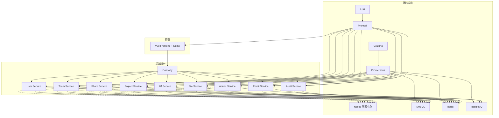
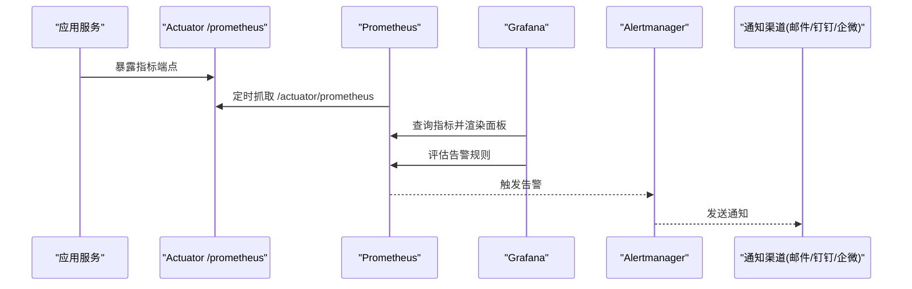
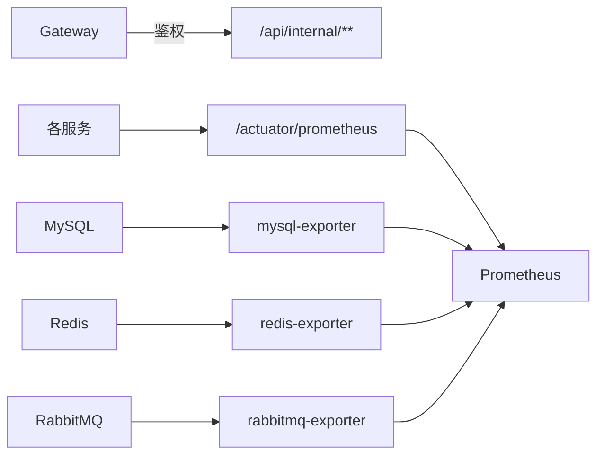

# 监控告警系统

<cite>
**本文引用的文件**   
- [docker-compose.yml](file://docker-compose.yml)
- [docker-compose.dev.yml](file://docker-compose.dev.yml)
- [promtail-config.yml](file://deploy/promtail-config.yml)
- [nginx/default.conf](file://deploy/nginx/default.conf)
- [nacos-config/zxyz-static.yml](file://nacos-config/zxyz-static.yml)
- [nacos-config/zxyz-dynamic.yml](file://nacos-config/zxyz-dynamic.yml)
- [nacos-config/zxyz-gateway.yml](file://nacos-config/zxyz-gateway.yml)
- [nacos-config/zxyz-admin-service.yml](file://nacos-config/zxyz-admin-service.yml)
- [nacos-config/zxyz-audit-service.yml](file://nacos-config/zxyz-audit-service.yml)
- [nacos-config/zxyz-email-service.yml](file://nacos-config/zxyz-email-service.yml)
- [nacos-config/zxyz-file-service.yml](file://nacos-config/zxyz-file-service.yml)
- [nacos-config/zxyz-im-service.yml](file://nacos-config/zxyz-im-service.yml)
- [nacos-config/zxyz-project-service.yml](file://nacos-config/zxyz-project-service.yml)
- [nacos-config/zxyz-share-service.yml](file://nacos-config/zxyz-share-service.yml)
- [nacos-config/zxyz-team-service.yml](file://nacos-config/zxyz-team-service.yml)
- [nacos-config/zxyz-user-service.yml](file://nacos-config/zxyz-user-service.yml)
- [scripts/health-check.sh](file://scripts/health-check.sh)
- [ZXYZdatabaseBack/pom.xml](file://ZXYZdatabaseBack/pom.xml)
- [ZXYZdatabaseFront/package.json](file://ZXYZdatabaseFront/package.json)
</cite>

## 目录
1. [简介](#简介)
2. [项目结构](#项目结构)
3. [核心组件](#核心组件)
4. [架构总览](#架构总览)
5. [详细组件分析](#详细组件分析)
6. [依赖关系分析](#依赖关系分析)
7. [性能考量](#性能考量)
8. [故障排查指南](#故障排查指南)
9. [结论](#结论)
10. [附录](#附录)

## 简介
本文件为 ZXYZ 项目的监控告警系统设计文档，覆盖 Prometheus 指标采集、Grafana 仪表板设计、告警规则与通知渠道集成、健康检查机制、数据库/Redis/RabbitMQ 监控配置，以及监控数据分析与容量规划方法。基于仓库现有编排与配置（Docker Compose、Nacos、Promtail、Nginx），提供可落地的实施路径与最佳实践。

## 项目结构
ZXYZ 采用微服务架构，后端包含多个 Spring Boot 模块，前端为 Vue 应用，基础设施通过 Docker Compose 编排。监控相关的关键位置：
- 容器编排与端口映射：docker-compose.yml、docker-compose.dev.yml
- 日志采集：deploy/promtail-config.yml
- Nacos 统一配置：nacos-config/*.yml（静态与动态配置）
- 网关与反向代理：deploy/nginx/default.conf
- 健康检查脚本：scripts/health-check.sh
- 后端依赖与可选监控能力：ZXYZdatabaseBack/pom.xml
- 前端构建与运行：ZXYZdatabaseFront/package.json

图表来源
- [docker-compose.yml](file://docker-compose.yml)
- [docker-compose.dev.yml](file://docker-compose.dev.yml)
- [deploy/promtail-config.yml](file://deploy/promtail-config.yml)
- [deploy/nginx/default.conf](file://deploy/nginx/default.conf)
- [nacos-config/zxyz-static.yml](file://nacos-config/zxyz-static.yml)
- [nacos-config/zxyz-dynamic.yml](file://nacos-config/zxyz-dynamic.yml)

章节来源
- [docker-compose.yml](file://docker-compose.yml)
- [docker-compose.dev.yml](file://docker-compose.dev.yml)
- [deploy/promtail-config.yml](file://deploy/promtail-config.yml)
- [deploy/nginx/default.conf](file://deploy/nginx/default.conf)
- [nacos-config/zxyz-static.yml](file://nacos-config/zxyz-static.yml)
- [nacos-config/zxyz-dynamic.yml](file://nacos-config/zxyz-dynamic.yml)

## 核心组件
- 指标采集层（Prometheus）
  - 目标：JVM 运行时指标、Spring Boot Actuator /actuator/prometheus、自定义业务指标（Micrometer）。
  - 抓取策略：按服务暴露的 /actuator/prometheus 端点周期性抓取；对数据库、Redis、RabbitMQ 使用官方 exporter 或内置指标。
- 可视化层（Grafana）
  - 面板：服务健康概览、性能指标（QPS、延迟、错误率）、业务关键指标（订单量、消息吞吐、队列积压等）。
- 告警层（Alertmanager）
  - 阈值：CPU、内存、GC、线程池、连接池、慢查询、队列堆积、缓存命中率等。
  - 级别：信息、警告、严重、致命。
  - 通知：邮件、钉钉、企业微信。
- 日志层（Loki + Promtail）
  - 采集：容器标准输出与文件日志，结构化标签（service、instance、env）。
- 健康检查（探针）
  - Liveness/Readiness：应用启动就绪、依赖可用性检测、资源使用率阈值。

章节来源
- [nacos-config/zxyz-static.yml](file://nacos-config/zxyz-static.yml)
- [nacos-config/zxyz-dynamic.yml](file://nacos-config/zxyz-dynamic.yml)
- [scripts/health-check.sh](file://scripts/health-check.sh)

## 架构总览
监控体系由“采集—存储—展示—告警—通知”构成，结合日志采集形成可观测性闭环。Prometheus 作为时序数据中枢，Grafana 负责可视化与告警规则管理，Alertmanager 负责告警路由与通知，Loki/Promtail 负责日志聚合与检索。

图表来源
- [nacos-config/zxyz-static.yml](file://nacos-config/zxyz-static.yml)
- [nacos-config/zxyz-dynamic.yml](file://nacos-config/zxyz-dynamic.yml)

## 详细组件分析

### Prometheus 指标采集配置
- JVM 指标
  - 通过 Micrometer 自动暴露 JVM 运行时指标（堆/非堆内存、GC、线程、类加载等）。
  - 在 Spring Boot 应用中启用 Actuator 并暴露 /actuator/prometheus。
- Spring Boot Actuator
  - 启用 endpoints.prometheus 与 health/liveness/readiness。
  - 安全策略：仅内网访问或通过网关鉴权。
- 自定义业务指标
  - 使用 Micrometer Counter/Gauge/Histogram/Timer 埋点关键业务路径（如接口耗时、成功率、队列消费速率）。
  - 维度标签建议：service、method、status、topic、queue、region。
- 第三方组件指标
  - MySQL：mysql-exporter 或 Spring Boot 内置 DataSource Metrics。
  - Redis：redis-exporter 或 Spring Data Redis Metrics。
  - RabbitMQ：rabbitmq-exporter 或 Spring AMQP Metrics。
- 抓取配置
  - 以服务名为 job_name，按实例标签区分；合理设置 scrape_interval 与 scrape_timeout。
  - 对高吞吐服务降低抓取频率，避免采集侧压力过大。

章节来源
- [nacos-config/zxyz-static.yml](file://nacos-config/zxyz-static.yml)
- [nacos-config/zxyz-dynamic.yml](file://nacos-config/zxyz-dynamic.yml)
- [ZXYZdatabaseBack/pom.xml](file://ZXYZdatabaseBack/pom.xml)

### Grafana 仪表板设计
- 服务健康概览
  - 关键指标：存活状态、启动耗时、错误率、P95/P99 延迟、GC 停顿、线程池活跃数。
  - 视图：多服务对比、按环境/实例筛选。
- 性能指标展示
  - JVM：堆使用率、GC 次数/耗时、元空间、线程数。
  - 应用：QPS、请求延迟分布、错误码分布、慢接口 TopN。
  - 中间件：DB 连接池、慢查询、Redis 命中率、MQ 堆积与消费延迟。
- 业务关键指标监控面板
  - 根据各服务域定义 KPI：用户注册量、消息收发量、文件上传成功率和大小分布、分享访问热度、团队配额使用率等。
  - 趋势与同比/环比：周/月趋势、峰值时段识别。

章节来源
- [nacos-config/zxyz-static.yml](file://nacos-config/zxyz-static.yml)
- [nacos-config/zxyz-dynamic.yml](file://nacos-config/zxyz-dynamic.yml)

### 告警规则配置
- 阈值设置
  - 资源类：CPU > 80% 持续 5min、内存使用率 > 85%、GC 频繁（Young GC 间隔缩短且 Full GC 增多）。
  - 应用类：错误率 > 1%、P95 > 500ms、接口超时率上升。
  - 中间件类：DB 连接池耗尽、慢查询占比 > 5%、Redis 命中率 < 90%、MQ 队列堆积 > 阈值。
- 告警级别定义
  - 信息：容量预警、轻微抖动。
  - 警告：性能退化、错误率升高。
  - 严重：服务不可用、数据不一致风险。
  - 致命：核心链路中断、数据丢失风险。
- 通知渠道集成
  - 邮件：SMTP 配置、收件人组、去重与静默窗口。
  - 钉钉：Webhook 机器人、@指定人员、富文本模板。
  - 企业微信：Webhook 或 API，支持 Markdown 与卡片消息。
- 规则管理
  - 在 Grafana 中维护规则集，按环境隔离；变更需评审与灰度验证。

章节来源
- [nacos-config/zxyz-static.yml](file://nacos-config/zxyz-static.yml)
- [nacos-config/zxyz-dynamic.yml](file://nacos-config/zxyz-dynamic.yml)

### 健康检查机制实现
- 服务就绪探针
  - Liveness：进程存活、关键依赖可达、磁盘/内存阈值未越界。
  - Readiness：依赖服务可用（DB、Redis、MQ）、初始化完成、热配置生效。
- 依赖服务可用性检测
  - 启动时探测 DB/Redis/MQ 连通性与版本兼容性。
  - 运行时周期性心跳检测，异常快速降级或熔断。
- 资源使用率监控
  - CPU、内存、文件句柄、网络 IO、线程池队列长度。
  - 阈值告警与自动扩容联动。

章节来源
- [scripts/health-check.sh](file://scripts/health-check.sh)
- [nacos-config/zxyz-static.yml](file://nacos-config/zxyz-static.yml)

### 数据库监控（MySQL）
- 指标项
  - 连接数、活跃连接、慢查询、锁等待、缓冲池命中率、复制延迟、表扫描比例。
- 采集方式
  - mysql-exporter 暴露 /metrics；或在应用层开启 DataSource Metrics。
- 告警要点
  - 连接池耗尽、慢查询突增、主从延迟、锁竞争。

章节来源
- [nacos-config/zxyz-static.yml](file://nacos-config/zxyz-static.yml)
- [nacos-config/zxyz-dynamic.yml](file://nacos-config/zxyz-dynamic.yml)

### Redis 缓存监控
- 指标项
  - 命中率、内存使用率、键数量、持久化失败、命令延迟、集群节点状态。
- 采集方式
  - redis-exporter 暴露 /metrics；或使用 Spring Data Redis Metrics。
- 告警要点
  - 命中率骤降、内存逼近上限、大键导致阻塞、主从同步异常。

章节来源
- [nacos-config/zxyz-static.yml](file://nacos-config/zxyz-static.yml)
- [nacos-config/zxyz-dynamic.yml](file://nacos-config/zxyz-dynamic.yml)

### RabbitMQ 队列监控
- 指标项
  - 队列长度、消息入队/出队速率、消费者数量、确认延迟、死信队列增长。
- 采集方式
  - rabbitmq-exporter 暴露 /metrics；或使用 Spring AMQP Metrics。
- 告警要点
  - 队列堆积、消费者掉线、死信激增、交换器路由失败。

章节来源
- [nacos-config/zxyz-static.yml](file://nacos-config/zxyz-static.yml)
- [nacos-config/zxyz-dynamic.yml](file://nacos-config/zxyz-dynamic.yml)

### 日志采集与关联
- Promtail 采集容器标准输出与应用日志文件，附加 service、instance、env 标签。
- 与 Prometheus 指标通过 traceId/spanId 关联，便于问题定位。

章节来源
- [deploy/promtail-config.yml](file://deploy/promtail-config.yml)

## 依赖关系分析
- 服务间调用与监控
  - 内部端点 /api/internal/** 经 Gateway SaToken 过滤，确保公网不可达。
  - 每个服务暴露 /actuator/prometheus 供 Prometheus 抓取。
- 配置中心
  - Nacos 统一管理静态与动态配置，监控开关、采样率、告警阈值可通过动态配置下发。
- 外部依赖
  - DB/Redis/MQ 通过独立 exporter 暴露指标，Prometheus 统一抓取。

图表来源
- [nacos-config/zxyz-gateway.yml](file://nacos-config/zxyz-gateway.yml)
- [nacos-config/zxyz-static.yml](file://nacos-config/zxyz-static.yml)
- [nacos-config/zxyz-dynamic.yml](file://nacos-config/zxyz-dynamic.yml)

章节来源
- [nacos-config/zxyz-gateway.yml](file://nacos-config/zxyz-gateway.yml)
- [nacos-config/zxyz-static.yml](file://nacos-config/zxyz-static.yml)
- [nacos-config/zxyz-dynamic.yml](file://nacos-config/zxyz-dynamic.yml)

## 性能考量
- 采集侧
  - 合理设置 scrape_interval、scrape_timeout，避免高频抓取造成负载。
  - 对热点服务使用更粗粒度指标与降采样。
- 存储侧
  - 控制保留周期与压缩策略，避免磁盘膨胀。
- 展示侧
  - 面板按需加载，避免一次性查询过多时间范围。
- 告警侧
  - 抑制重复告警，设置静默窗口与升级策略。

[本节为通用指导，不直接分析具体文件]

## 故障排查指南
- 指标缺失
  - 检查服务是否暴露 /actuator/prometheus，Prometheus 抓取目标状态。
  - 校验 Nacos 配置是否启用了 Actuator 与 Micrometer。
- 告警风暴
  - 检查规则阈值与去重策略，避免级联告警。
- 日志无法采集
  - 检查 Promtail 配置与容器日志路径，确认标签正确。
- 健康检查失败
  - 查看 health-check 脚本返回码与依赖探测结果，定位具体依赖。

章节来源
- [scripts/health-check.sh](file://scripts/health-check.sh)
- [deploy/promtail-config.yml](file://deploy/promtail-config.yml)
- [nacos-config/zxyz-static.yml](file://nacos-config/zxyz-static.yml)

## 结论
通过统一的指标采集、可视化与告警体系，结合日志关联与健康检查，ZXYZ 可实现端到端可观测性。建议在上线前完成基线建立与阈值调优，持续优化采集与告警策略，保障系统稳定与性能。

[本节为总结性内容，不直接分析具体文件]

## 附录
- 容量规划方法
  - 趋势预测：基于历史 QPS、延迟、资源使用率进行线性/指数拟合，预测拐点。
  - 性能基线：压测获取 P95/P99 基线，设定告警阈值与扩容阈值。
  - 扩容决策：当连续 N 个周期超过阈值或预测即将超限，触发水平/垂直扩容。
- 监控数据治理
  - 指标命名规范、标签标准化、废弃指标清理。
  - 面板与规则版本化管理，纳入 CI 流程。

[本节为通用指导，不直接分析具体文件]