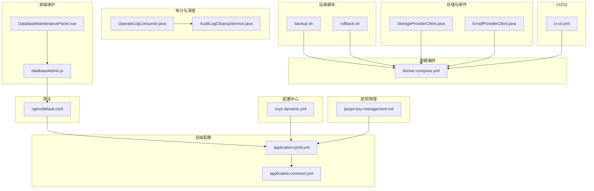
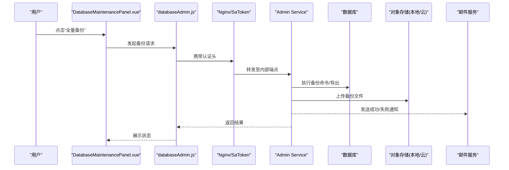
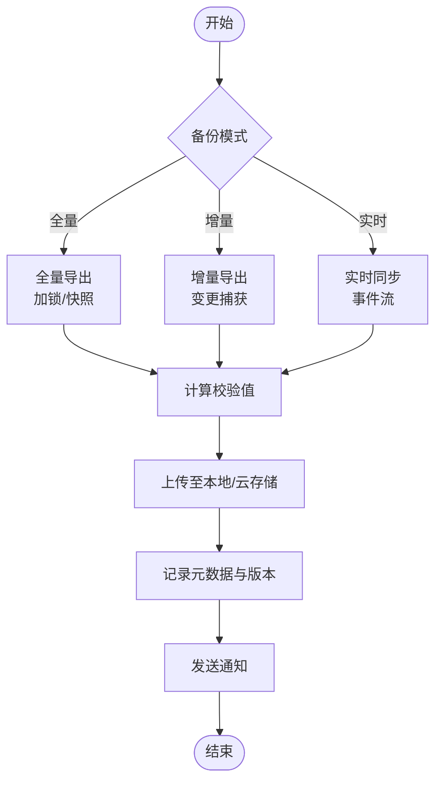
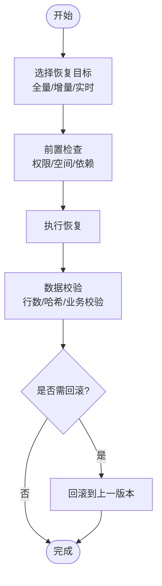
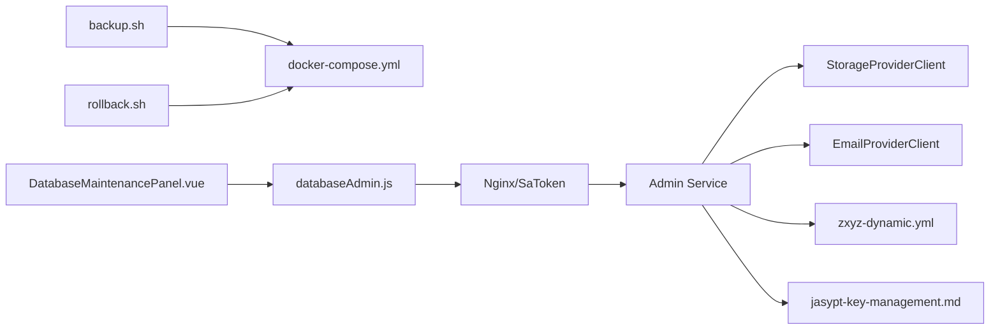

# 安全备份恢复

<cite>
**本文引用的文件**
- [scripts/backup.sh](file://scripts/backup.sh)
- [scripts/rollback.sh](file://scripts/rollback.sh)
- [docker-compose.yml](file://docker-compose.yml)
- [deploy/nginx/default.conf](file://deploy/nginx/default.conf)
- [ZXYZdatabaseBack/zxyz-admin-service/src/main/resources/application-prod.yml](file://ZXYZdatabaseBack/zxyz-admin-service/src/main/resources/application-prod.yml)
- [ZXYZdatabaseBack/zxyz-common/src/main/resources/application-common.yml](file://ZXYZdatabaseBack/zxyz-common/src/main/resources/application-common.yml)
- [ZXYZdatabaseBack/zxyz-audit-service/src/main/java/uno/acloud/audit/mq/OperateLogConsumer.java](file://ZXYZdatabaseBack/zxyz-audit-service/src/main/java/uno/acloud/audit/mq/OperateLogConsumer.java)
- [ZXYZdatabaseBack/zxyz-audit-service/src/main/java/uno/acloud/audit/service/AuditLogCleanupService.java](file://ZXYZdatabaseBack/zxyz-audit-service/src/main/java/uno/acloud/audit/service/AuditLogCleanupService.java)
- [ZXYZdatabaseBack/zxyz-file-service/src/main/java/uno/acloud/file/storage/StorageProviderClient.java](file://ZXYZdatabaseBack/zxyz-file-service/src/main/java/uno/acloud/file/storage/StorageProviderClient.java)
- [ZXYZdatabaseBack/zxyz-email-service/src/main/java/uno/acloud/email/provider/EmailProviderClient.java](file://ZXYZdatabaseBack/zxyz-email-service/src/main/java/uno/acloud/email/provider/EmailProviderClient.java)
- [ZXYZdatabaseFront/src/views/setting/components/DatabaseMaintenancePanel.vue](file://ZXYZdatabaseFront/src/views/setting/components/DatabaseMaintenancePanel.vue)
- [ZXYZdatabaseFront/src/api/databaseAdmin.js](file://ZXYZdatabaseFront/src/api/databaseAdmin.js)
- [.github/workflows/ci-cd.yml](file://.github/workflows/ci-cd.yml)
- [nacos-config/zxyz-dynamic.yml](file://nacos-config/zxyz-dynamic.yml)
- [docs/jasypt-key-management.md](file://docs/jasypt-key-management.md)
</cite>

## 目录
1. [引言](#引言)
2. [项目结构](#项目结构)
3. [核心组件](#核心组件)
4. [架构总览](#架构总览)
5. [详细组件分析](#详细组件分析)
6. [依赖关系分析](#依赖关系分析)
7. [性能考虑](#性能考虑)
8. [故障排查指南](#故障排查指南)
9. [结论](#结论)
10. [附录](#附录)

## 引言
本文件面向 ZXYZ 项目的数据库安全备份与恢复，覆盖数据安全策略（敏感信息加密、访问控制、SQL 注入防护）、备份策略设计（全量/增量/实时）、存储管理（本地/云/异地容灾）、恢复流程（灾难恢复/数据修复/版本回滚）、备份验证与测试、监控告警与自动化脚本使用。文档结合仓库中的脚本、配置与服务实现进行说明，确保可操作性与一致性。

## 项目结构
与备份恢复相关的代码与配置主要分布在以下位置：
- 运维脚本：scripts/backup.sh、scripts/rollback.sh
- 容器编排：docker-compose.yml（定义数据库与相关服务）
- Nginx 网关：deploy/nginx/default.conf（内部端点隔离）
- 后端配置：各服务的 application-prod.yml 与公共配置 application-common.yml
- 审计与清理：zxyz-audit-service 的 MQ 消费者与清理服务
- 存储与邮件：zxyz-file-service 与 zxyz-email-service 的 Provider 客户端
- 前端维护界面：DatabaseMaintenancePanel.vue 与 databaseAdmin.js
- CI/CD：.github/workflows/ci-cd.yml
- 动态配置：nacos-config/zxyz-dynamic.yml
- 密钥管理：docs/jasypt-key-management.md

图表来源
- [scripts/backup.sh](file://scripts/backup.sh)
- [scripts/rollback.sh](file://scripts/rollback.sh)
- [docker-compose.yml](file://docker-compose.yml)
- [deploy/nginx/default.conf](file://deploy/nginx/default.conf)
- [ZXYZdatabaseBack/zxyz-admin-service/src/main/resources/application-prod.yml](file://ZXYZdatabaseBack/zxyz-admin-service/src/main/resources/application-prod.yml)
- [ZXYZdatabaseBack/zxyz-common/src/main/resources/application-common.yml](file://ZXYZdatabaseBack/zxyz-common/src/main/resources/application-common.yml)
- [ZXYZdatabaseBack/zxyz-audit-service/src/main/java/uno/acloud/audit/mq/OperateLogConsumer.java](file://ZXYZdatabaseBack/zxyz-audit-service/src/main/java/uno/acloud/audit/mq/OperateLogConsumer.java)
- [ZXYZdatabaseBack/zxyz-audit-service/src/main/java/uno/acloud/audit/service/AuditLogCleanupService.java](file://ZXYZdatabaseBack/zxyz-audit-service/src/main/java/uno/acloud/audit/service/AuditLogCleanupService.java)
- [ZXYZdatabaseBack/zxyz-file-service/src/main/java/uno/acloud/file/storage/StorageProviderClient.java](file://ZXYZdatabaseBack/zxyz-file-service/src/main/java/uno/acloud/file/storage/StorageProviderClient.java)
- [ZXYZdatabaseBack/zxyz-email-service/src/main/java/uno/acloud/email/provider/EmailProviderClient.java](file://ZXYZdatabaseBack/zxyz-email-service/src/main/java/uno/acloud/email/provider/EmailProviderClient.java)
- [ZXYZdatabaseFront/src/views/setting/components/DatabaseMaintenancePanel.vue](file://ZXYZdatabaseFront/src/views/setting/components/DatabaseMaintenancePanel.vue)
- [ZXYZdatabaseFront/src/api/databaseAdmin.js](file://ZXYZdatabaseFront/src/api/databaseAdmin.js)
- [.github/workflows/ci-cd.yml](file://.github/workflows/ci-cd.yml)
- [nacos-config/zxyz-dynamic.yml](file://nacos-config/zxyz-dynamic.yml)
- [docs/jasypt-key-management.md](file://docs/jasypt-key-management.md)

章节来源
- [docker-compose.yml](file://docker-compose.yml)
- [deploy/nginx/default.conf](file://deploy/nginx/default.conf)
- [ZXYZdatabaseBack/zxyz-admin-service/src/main/resources/application-prod.yml](file://ZXYZdatabaseBack/zxyz-admin-service/src/main/resources/application-prod.yml)
- [ZXYZdatabaseBack/zxyz-common/src/main/resources/application-common.yml](file://ZXYZdatabaseBack/zxyz-common/src/main/resources/application-common.yml)

## 核心组件
- 备份脚本：scripts/backup.sh 负责触发全量/增量/实时备份任务，输出校验与归档。
- 回滚脚本：scripts/rollback.sh 支持按时间戳或版本号恢复，包含前置校验与幂等保护。
- 容器编排：docker-compose.yml 定义数据库实例、备份卷挂载、网络与依赖服务。
- 网关与安全：deploy/nginx/default.conf 限制公网访问内部端点，配合 Sa-Token 鉴权。
- 配置与密钥：application-prod.yml 与 application-common.yml 管理连接串、加密开关；Jasypt 用于敏感项加密。
- 审计与清理：OperateLogConsumer 消费变更事件，AuditLogCleanupService 定期清理历史日志。
- 存储与通知：StorageProviderClient 对接对象存储（本地/云），EmailProviderClient 发送告警。
- 前端维护：DatabaseMaintenancePanel.vue 提供可视化入口，调用 databaseAdmin.js 发起备份/恢复请求。
- CI/CD：ci-cd.yml 在推送时选择性构建镜像并推送到 GHCR，保障制品可追溯。
- 动态配置：nacos-config/zxyz-dynamic.yml 集中管理运行时参数（如备份窗口、保留策略）。

章节来源
- [scripts/backup.sh](file://scripts/backup.sh)
- [scripts/rollback.sh](file://scripts/rollback.sh)
- [docker-compose.yml](file://docker-compose.yml)
- [deploy/nginx/default.conf](file://deploy/nginx/default.conf)
- [ZXYZdatabaseBack/zxyz-admin-service/src/main/resources/application-prod.yml](file://ZXYZdatabaseBack/zxyz-admin-service/src/main/resources/application-prod.yml)
- [ZXYZdatabaseBack/zxyz-common/src/main/resources/application-common.yml](file://ZXYZdatabaseBack/zxyz-common/src/main/resources/application-common.yml)
- [ZXYZdatabaseBack/zxyz-audit-service/src/main/java/uno/acloud/audit/mq/OperateLogConsumer.java](file://ZXYZdatabaseBack/zxyz-audit-service/src/main/java/uno/acloud/audit/mq/OperateLogConsumer.java)
- [ZXYZdatabaseBack/zxyz-audit-service/src/main/java/uno/acloud/audit/service/AuditLogCleanupService.java](file://ZXYZdatabaseBack/zxyz-audit-service/src/main/java/uno/acloud/audit/service/AuditLogCleanupService.java)
- [ZXYZdatabaseBack/zxyz-file-service/src/main/java/uno/acloud/file/storage/StorageProviderClient.java](file://ZXYZdatabaseBack/zxyz-file-service/src/main/java/uno/acloud/file/storage/StorageProviderClient.java)
- [ZXYZdatabaseBack/zxyz-email-service/src/main/java/uno/acloud/email/provider/EmailProviderClient.java](file://ZXYZdatabaseBack/zxyz-email-service/src/main/java/uno/acloud/email/provider/EmailProviderClient.java)
- [ZXYZdatabaseFront/src/views/setting/components/DatabaseMaintenancePanel.vue](file://ZXYZdatabaseFront/src/views/setting/components/DatabaseMaintenancePanel.vue)
- [ZXYZdatabaseFront/src/api/databaseAdmin.js](file://ZXYZdatabaseFront/src/api/databaseAdmin.js)
- [.github/workflows/ci-cd.yml](file://.github/workflows/ci-cd.yml)
- [nacos-config/zxyz-dynamic.yml](file://nacos-config/zxyz-dynamic.yml)

## 架构总览
下图展示从前端触发到后端执行、再到存储与通知的整体备份恢复流程。

图表来源
- [ZXYZdatabaseFront/src/views/setting/components/DatabaseMaintenancePanel.vue](file://ZXYZdatabaseFront/src/views/setting/components/DatabaseMaintenancePanel.vue)
- [ZXYZdatabaseFront/src/api/databaseAdmin.js](file://ZXYZdatabaseFront/src/api/databaseAdmin.js)
- [deploy/nginx/default.conf](file://deploy/nginx/default.conf)
- [ZXYZdatabaseBack/zxyz-admin-service/src/main/resources/application-prod.yml](file://ZXYZdatabaseBack/zxyz-admin-service/src/main/resources/application-prod.yml)
- [ZXYZdatabaseBack/zxyz-file-service/src/main/java/uno/acloud/file/storage/StorageProviderClient.java](file://ZXYZdatabaseBack/zxyz-file-service/src/main/java/uno/acloud/file/storage/StorageProviderClient.java)
- [ZXYZdatabaseBack/zxyz-email-service/src/main/java/uno/acloud/email/provider/EmailProviderClient.java](file://ZXYZdatabaseBack/zxyz-email-service/src/main/java/uno/acloud/email/provider/EmailProviderClient.java)

## 详细组件分析

### 备份策略设计
- 全量备份
  - 触发方式：通过 backup.sh 或前端维护面板选择“全量备份”。
  - 执行要点：锁定写操作（必要时），导出完整数据，生成校验文件（如哈希），上传至对象存储，记录元数据（时间戳、大小、版本）。
  - 存储策略：本地磁盘 + 云存储双写，保留周期由 nacos 动态配置。
- 增量备份
  - 触发方式：定时任务或基于 binlog/WAL 的增量采集。
  - 执行要点：仅导出变更段，合并索引，压缩传输，落盘后校验完整性。
- 实时备份
  - 触发方式：监听数据库变更事件（binlog/WAL），异步写入目标库或对象存储。
  - 执行要点：低延迟通道、去重与幂等、断点续传、失败重试与死信队列。

章节来源
- [scripts/backup.sh](file://scripts/backup.sh)
- [nacos-config/zxyz-dynamic.yml](file://nacos-config/zxyz-dynamic.yml)

### 数据存储与容灾
- 本地存储
  - 通过 docker-compose.yml 挂载持久卷，避免容器重建丢失。
  - 建议启用磁盘配额与空间预警。
- 云存储
  - 使用 StorageProviderClient 对接对象存储（S3/OSS/COS 等），支持分片上传与断点续传。
- 异地容灾
  - 多区域复制策略：主区域全量+增量，备区域实时同步；跨域复制开启加密与鉴权。
  - 定期演练恢复，验证 RPO/RTO。

章节来源
- [docker-compose.yml](file://docker-compose.yml)
- [ZXYZdatabaseBack/zxyz-file-service/src/main/java/uno/acloud/file/storage/StorageProviderClient.java](file://ZXYZdatabaseBack/zxyz-file-service/src/main/java/uno/acloud/file/storage/StorageProviderClient.java)

### 恢复流程设计
- 灾难恢复
  - 选择最近可用全量备份，应用后续增量/实时日志，完成端到端校验。
- 数据修复
  - 针对局部损坏表或分区，采用最小化恢复范围，避免影响整体可用性。
- 版本回滚
  - 依据版本标签与元数据，精确回滚到指定时间点或版本，保证幂等与事务一致性。

章节来源
- [scripts/rollback.sh](file://scripts/rollback.sh)

### 安全策略
- 敏感信息加密
  - 使用 Jasypt 对数据库密码、密钥等敏感配置进行加密，启动时解密加载。
  - 密钥管理遵循最小权限原则，定期轮换。
- 访问控制列表
  - 内部端点 /api/internal/** 由 Nginx 与 Sa-Token 过滤，拒绝公网访问。
  - 备份/恢复操作需具备管理员角色与二次确认。
- SQL 注入防护
  - 所有查询使用预编译语句与参数绑定，禁止拼接用户输入。
  - 输入校验与白名单机制，错误统一处理与脱敏日志。

章节来源
- [docs/jasypt-key-management.md](file://docs/jasypt-key-management.md)
- [deploy/nginx/default.conf](file://deploy/nginx/default.conf)
- [ZXYZdatabaseBack/zxyz-admin-service/src/main/resources/application-prod.yml](file://ZXYZdatabaseBack/zxyz-admin-service/src/main/resources/application-prod.yml)

### 备份验证与测试
- 完整性校验
  - 生成并比对校验文件（如 SHA256），确保传输与落盘一致。
- 可恢复性演练
  - 定期在隔离环境执行恢复演练，统计 RTO/RPO，记录偏差。
- 自动化测试
  - 在 CI/CD 中集成备份/恢复用例，失败阻断发布。

章节来源
- [scripts/backup.sh](file://scripts/backup.sh)
- [scripts/rollback.sh](file://scripts/rollback.sh)
- [.github/workflows/ci-cd.yml](file://.github/workflows/ci-cd.yml)

### 监控告警机制
- 备份失败通知
  - 通过 EmailProviderClient 发送失败告警，附带错误码与上下文。
- 存储空间预警
  - 监控本地与云存储使用率，阈值触发告警并自动清理过期备份。
- 恢复时间监控
  - 记录恢复耗时与阶段指标，异常时上报并通知责任人。

章节来源
- [ZXYZdatabaseBack/zxyz-email-service/src/main/java/uno/acloud/email/provider/EmailProviderClient.java](file://ZXYZdatabaseBack/zxyz-email-service/src/main/java/uno/acloud/email/provider/EmailProviderClient.java)
- [ZXYZdatabaseBack/zxyz-audit-service/src/main/java/uno/acloud/audit/service/AuditLogCleanupService.java](file://ZXYZdatabaseBack/zxyz-audit-service/src/main/java/uno/acloud/audit/service/AuditLogCleanupService.java)

### 自动化脚本与工具使用
- 备份脚本
  - 用法：指定模式（全量/增量/实时）、目标存储、保留策略。
  - 输出：备份文件、校验文件、元数据记录、日志。
- 回滚脚本
  - 用法：指定恢复目标（时间戳/版本号）、校验开关、强制模式。
  - 保护：前置检查、幂等执行、失败回退。
- 前端维护面板
  - 提供可视化操作入口，支持查看历史、下载备份、触发恢复。

章节来源
- [scripts/backup.sh](file://scripts/backup.sh)
- [scripts/rollback.sh](file://scripts/rollback.sh)
- [ZXYZdatabaseFront/src/views/setting/components/DatabaseMaintenancePanel.vue](file://ZXYZdatabaseFront/src/views/setting/components/DatabaseMaintenancePanel.vue)
- [ZXYZdatabaseFront/src/api/databaseAdmin.js](file://ZXYZdatabaseFront/src/api/databaseAdmin.js)

## 依赖关系分析
- 组件耦合
  - 备份/恢复脚本依赖 docker-compose 定义的卷与网络。
  - 前端维护面板依赖 API 层与网关鉴权。
  - 存储与邮件服务作为外部依赖，需配置正确凭据与超时。
- 外部依赖
  - 对象存储（本地/云）、邮件服务、Nacos 配置中心、Jasypt 密钥管理。
- 潜在循环依赖
  - 审计与清理服务独立运行，不反向依赖备份模块，降低耦合。

图表来源
- [scripts/backup.sh](file://scripts/backup.sh)
- [scripts/rollback.sh](file://scripts/rollback.sh)
- [docker-compose.yml](file://docker-compose.yml)
- [ZXYZdatabaseFront/src/views/setting/components/DatabaseMaintenancePanel.vue](file://ZXYZdatabaseFront/src/views/setting/components/DatabaseMaintenancePanel.vue)
- [ZXYZdatabaseFront/src/api/databaseAdmin.js](file://ZXYZdatabaseFront/src/api/databaseAdmin.js)
- [deploy/nginx/default.conf](file://deploy/nginx/default.conf)
- [ZXYZdatabaseBack/zxyz-file-service/src/main/java/uno/acloud/file/storage/StorageProviderClient.java](file://ZXYZdatabaseBack/zxyz-file-service/src/main/java/uno/acloud/file/storage/StorageProviderClient.java)
- [ZXYZdatabaseBack/zxyz-email-service/src/main/java/uno/acloud/email/provider/EmailProviderClient.java](file://ZXYZdatabaseBack/zxyz-email-service/src/main/java/uno/acloud/email/provider/EmailProviderClient.java)
- [nacos-config/zxyz-dynamic.yml](file://nacos-config/zxyz-dynamic.yml)
- [docs/jasypt-key-management.md](file://docs/jasypt-key-management.md)

章节来源
- [docker-compose.yml](file://docker-compose.yml)
- [deploy/nginx/default.conf](file://deploy/nginx/default.conf)
- [ZXYZdatabaseBack/zxyz-file-service/src/main/java/uno/acloud/file/storage/StorageProviderClient.java](file://ZXYZdatabaseBack/zxyz-file-service/src/main/java/uno/acloud/file/storage/StorageProviderClient.java)
- [ZXYZdatabaseBack/zxyz-email-service/src/main/java/uno/acloud/email/provider/EmailProviderClient.java](file://ZXYZdatabaseBack/zxyz-email-service/src/main/java/uno/acloud/email/provider/EmailProviderClient.java)
- [nacos-config/zxyz-dynamic.yml](file://nacos-config/zxyz-dynamic.yml)
- [docs/jasypt-key-management.md](file://docs/jasypt-key-management.md)

## 性能考虑
- 备份窗口
  - 避开业务高峰，设置合理的时间窗与并发度。
- I/O 优化
  - 使用并行导出、压缩传输、内存池与缓冲策略。
- 存储优化
  - 分片上传、断点续传、冷热分层与生命周期管理。
- 监控与限流
  - 对备份/恢复任务进行速率限制与资源配额，防止雪崩。

[本节为通用指导，无需引用具体文件]

## 故障排查指南
- 备份失败
  - 检查网络连接、凭据、磁盘空间与权限；查看脚本日志与对象存储上传状态。
- 恢复失败
  - 校验备份文件完整性与版本匹配；检查依赖服务（Nacos/Jasypt）可用性。
- 通知未送达
  - 验证邮件服务配置与模板；检查队列与重试策略。
- 审计与清理
  - 关注 OperateLogConsumer 与 AuditLogCleanupService 的状态，避免日志堆积。

章节来源
- [scripts/backup.sh](file://scripts/backup.sh)
- [scripts/rollback.sh](file://scripts/rollback.sh)
- [ZXYZdatabaseBack/zxyz-audit-service/src/main/java/uno/acloud/audit/mq/OperateLogConsumer.java](file://ZXYZdatabaseBack/zxyz-audit-service/src/main/java/uno/acloud/audit/mq/OperateLogConsumer.java)
- [ZXYZdatabaseBack/zxyz-audit-service/src/main/java/uno/acloud/audit/service/AuditLogCleanupService.java](file://ZXYZdatabaseBack/zxyz-audit-service/src/main/java/uno/acloud/audit/service/AuditLogCleanupService.java)

## 结论
通过统一的备份策略、严格的访问控制与加密机制、完善的存储与容灾方案、以及自动化脚本与监控告警，ZXYZ 项目可实现高可靠的数据安全与快速恢复能力。建议在生产环境中持续演练与优化，确保 RPO/RTO 满足业务要求。

[本节为总结性内容，无需引用具体文件]

## 附录
- 常用命令参考
  - 全量备份：scripts/backup.sh --mode full
  - 增量备份：scripts/backup.sh --mode incremental
  - 实时备份：scripts/backup.sh --mode realtime
  - 恢复指定版本：scripts/rollback.sh --target <version/timestamp>
- 关键配置文件
  - 应用配置：application-prod.yml、application-common.yml
  - 动态配置：zxyz-dynamic.yml
  - 密钥管理：jasypt-key-management.md

章节来源
- [scripts/backup.sh](file://scripts/backup.sh)
- [scripts/rollback.sh](file://scripts/rollback.sh)
- [ZXYZdatabaseBack/zxyz-admin-service/src/main/resources/application-prod.yml](file://ZXYZdatabaseBack/zxyz-admin-service/src/main/resources/application-prod.yml)
- [ZXYZdatabaseBack/zxyz-common/src/main/resources/application-common.yml](file://ZXYZdatabaseBack/zxyz-common/src/main/resources/application-common.yml)
- [nacos-config/zxyz-dynamic.yml](file://nacos-config/zxyz-dynamic.yml)
- [docs/jasypt-key-management.md](file://docs/jasypt-key-management.md)