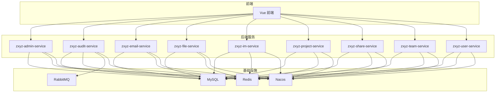
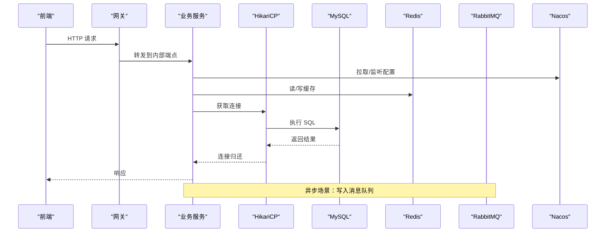
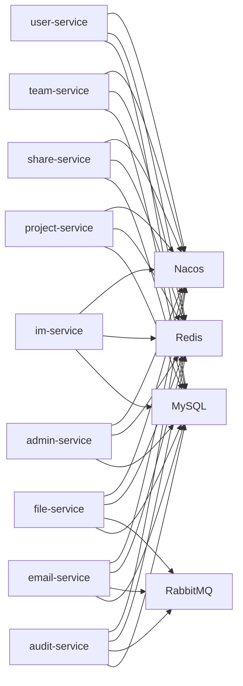

# 性能优化策略

<cite>
**本文引用的文件**   
- [ZXYZdatabaseBack/README.md](file://ZXYZdatabaseBack/README.md)
- [ZXYZdatabaseBack/pom.xml](file://ZXYZdatabaseBack/pom.xml)
- [ZXYZdatabaseBack/zxyz-admin-service/src/main/resources/application.yml](file://ZXYZdatabaseBack/zxyz-admin-service/src/main/resources/application.yml)
- [ZXYZdatabaseBack/zxyz-admin-service/src/main/java/uno/acloud/admin/config/ConfigDataSourceConfig.java](file://ZXYZdatabaseBack/zxyz-admin-service/src/main/java/uno/acloud/admin/config/ConfigDataSourceConfig.java)
- [ZXYZdatabaseBack/zxyz-common/src/main/resources/application-common.yml](file://ZXYZdatabaseBack/zxyz-common/src/main/resources/application-common.yml)
- [ZXYZdatabaseBack/zxyz-audit-service/src/main/resources/application.yml](file://ZXYZdatabaseBack/zxyz-audit-service/src/main/resources/application.yml)
- [ZXYZdatabaseBack/zxyz-email-service/src/main/resources/application.yml](file://ZXYZdatabaseBack/zxyz-email-service/src/main/resources/application.yml)
- [ZXYZdatabaseBack/zxyz-file-service/src/main/resources/application.yml](file://ZXYZdatabaseBack/zxyz-file-service/src/main/resources/application.yml)
- [ZXYZdatabaseBack/zxyz-im-service/src/main/resources/application.yml](file://ZXYZdatabaseBack/zxyz-im-service/src/main/resources/application.yml)
- [ZXYZdatabaseBack/zxyz-project-service/src/main/resources/application.yml](file://ZXYZdatabaseBack/zxyz-project-service/src/main/resources/application.yml)
- [ZXYZdatabaseBack/zxyz-share-service/src/main/resources/application.yml](file://ZXYZdatabaseBack/zxyz-share-service/src/main/resources/application.yml)
- [ZXYZdatabaseBack/zxyz-team-service/src/main/resources/application.yml](file://ZXYZdatabaseBack/zxyz-team-service/src/main/resources/application.yml)
- [ZXYZdatabaseBack/zxyz-user-service/src/main/resources/application.yml](file://ZXYZdatabaseBack/zxyz-user-service/src/main/resources/application.yml)
- [ZXYZdatabaseBack/ZXYZdatabaseFront/src/api/databaseAdmin.js](file://ZXYZdatabaseFront/src/api/databaseAdmin.js)
- [ZXYZdatabaseBack/nacos-config/zxyz-static.yml](file://ZXYZdatabaseBack/nacos-config/zxyz-static.yml)
- [ZXYZdatabaseBack/nacos-config/zxyz-dynamic.yml](file://ZXYZdatabaseBack/nacos-config/zxyz-dynamic.yml)
- [ZXYZdatabaseBack/sql/00-init-zxyz.sh](file://ZXYZdatabaseBack/sql/00-init-zxyz.sh)
- [ZXYZdatabaseBack/deploy/nginx/default.conf](file://ZXYZdatabaseBack/deploy/nginx/default.conf)
- [ZXYZdatabaseBack/docker-compose.yml](file://ZXYZdatabaseBack/docker-compose.yml)
</cite>

## 目录
1. [引言](#引言)
2. [项目结构](#项目结构)
3. [核心组件](#核心组件)
4. [架构总览](#架构总览)
5. [详细组件分析](#详细组件分析)
6. [依赖关系分析](#依赖关系分析)
7. [性能考量](#性能考量)
8. [故障排查指南](#故障排查指南)
9. [结论](#结论)
10. [附录](#附录)

## 引言
本文件面向 ZXYZ 项目的数据库性能优化，覆盖索引设计、查询优化与执行计划分析、连接池调优（HikariCP）、缓存策略（多级缓存、穿透防护、热点预热）、慢查询监控与分析、分库分表策略、大数据量处理方案以及性能测试与基准测试方法。文档结合仓库中的服务配置、Nacos 配置与前端管理接口，给出可落地的优化建议与实施路径。

## 项目结构
ZXYZ 采用微服务架构，后端包含多个独立 Maven 模块（如 admin、audit、email、file、im、project、share、team、user 等），每个服务通常拥有独立的 application.yml 配置文件，并通过 Nacos 进行配置管理与动态刷新。前端为 Vue 3 + Element Plus，提供数据库运维相关页面与 API 调用封装。

图表来源
- [ZXYZdatabaseBack/docker-compose.yml](file://ZXYZdatabaseBack/docker-compose.yml)
- [ZXYZdatabaseBack/nacos-config/zxyz-static.yml](file://ZXYZdatabaseBack/nacos-config/zxyz-static.yml)
- [ZXYZdatabaseBack/nacos-config/zxyz-dynamic.yml](file://ZXYZdatabaseBack/nacos-config/zxyz-dynamic.yml)

章节来源
- [ZXYZdatabaseBack/README.md](file://ZXYZdatabaseBack/README.md)
- [ZXYZdatabaseBack/pom.xml](file://ZXYZdatabaseBack/pom.xml)

## 核心组件
- 数据源与连接池：各服务通过 Spring Boot 的 HikariCP 管理数据库连接，关键参数包括最大连接数、最小空闲、超时、连接验证等。不同环境（dev/prod）可通过 application.yml 或 Nacos 动态配置。
- 缓存层：Redis 作为二级缓存，用于会话、热点数据与分布式锁；部分服务内可使用本地缓存（如 Caffeine）做一级缓存。
- 消息队列：RabbitMQ 用于异步解耦与削峰填谷，典型场景包括审计日志消费、邮件发送、文件处理等。
- 配置中心：Nacos 统一管理静态与动态配置，支持运行时刷新，便于在线调优连接池与缓存参数。
- 前端数据库管理：提供数据库维护面板与 API 调用，便于运维人员查看状态、触发任务与收集指标。

章节来源
- [ZXYZdatabaseBack/zxyz-admin-service/src/main/resources/application.yml](file://ZXYZdatabaseBack/zxyz-admin-service/src/main/resources/application.yml)
- [ZXYZdatabaseBack/zxyz-common/src/main/resources/application-common.yml](file://ZXYZdatabaseBack/zxyz-common/src/main/resources/application-common.yml)
- [ZXYZdatabaseBack/zxyz-audit-service/src/main/resources/application.yml](file://ZXYZdatabaseBack/zxyz-audit-service/src/main/resources/application.yml)
- [ZXYZdatabaseBack/zxyz-email-service/src/main/resources/application.yml](file://ZXYZdatabaseBack/zxyz-email-service/src/main/resources/application.yml)
- [ZXYZdatabaseBack/zxyz-file-service/src/main/resources/application.yml](file://ZXYZdatabaseBack/zxyz-file-service/src/main/resources/application.yml)
- [ZXYZdatabaseBack/zxyz-im-service/src/main/resources/application.yml](file://ZXYZdatabaseBack/zxyz-im-service/src/main/resources/application.yml)
- [ZXYZdatabaseBack/zxyz-project-service/src/main/resources/application.yml](file://ZXYZdatabaseBack/zxyz-project-service/src/main/resources/application.yml)
- [ZXYZdatabaseBack/zxyz-share-service/src/main/resources/application.yml](file://ZXYZdatabaseBack/zxyz-share-service/src/main/resources/application.yml)
- [ZXYZdatabaseBack/zxyz-team-service/src/main/resources/application.yml](file://ZXYZdatabaseBack/zxyz-team-service/src/main/resources/application.yml)
- [ZXYZdatabaseBack/zxyz-user-service/src/main/resources/application.yml](file://ZXYZdatabaseBack/zxyz-user-service/src/main/resources/application.yml)
- [ZXYZdatabaseBack/ZXYZdatabaseFront/src/api/databaseAdmin.js](file://ZXYZdatabaseFront/src/api/databaseAdmin.js)

## 架构总览
下图展示数据库访问链路：前端请求经网关进入后端服务，服务通过数据源访问 MySQL，使用 Redis 做缓存，必要时通过 RabbitMQ 异步处理，配置由 Nacos 下发。

图表来源
- [ZXYZdatabaseBack/docker-compose.yml](file://ZXYZdatabaseBack/docker-compose.yml)
- [ZXYZdatabaseBack/nacos-config/zxyz-static.yml](file://ZXYZdatabaseBack/nacos-config/zxyz-static.yml)
- [ZXYZdatabaseBack/nacos-config/zxyz-dynamic.yml](file://ZXYZdatabaseBack/nacos-config/zxyz-dynamic.yml)

## 详细组件分析

### 连接池配置优化（HikariCP）
- 关键参数说明
  - maximum-pool-size：最大连接数，需根据 CPU 核数、I/O 能力与并发峰值设定。
  - minimum-idle：最小空闲连接数，避免冷启动抖动。
  - connection-timeout：获取连接超时，防止线程阻塞堆积。
  - idle-timeout/max-lifetime：连接空闲与生命周期控制，减少僵尸连接。
  - connection-test-query/validation-timeout：连接有效性校验，降低异常连接占用。
- 环境差异
  - dev 环境可适当放宽超时与连接数，prod 环境严格限制并配合限流。
  - 通过 Nacos 动态调整，实现热更新不重启。
- 监控与告警
  - 采集连接池活跃/空闲/等待线程数、获取超时次数、连接泄漏检测。
  - 设置阈值告警，及时扩容或优化慢查询。

章节来源
- [ZXYZdatabaseBack/zxyz-admin-service/src/main/resources/application.yml](file://ZXYZdatabaseBack/zxyz-admin-service/src/main/resources/application.yml)
- [ZXYZdatabaseBack/zxyz-common/src/main/resources/application-common.yml](file://ZXYZdatabaseBack/zxyz-common/src/main/resources/application-common.yml)
- [ZXYZdatabaseBack/zxyz-audit-service/src/main/resources/application.yml](file://ZXYZdatabaseBack/zxyz-audit-service/src/main/resources/application.yml)
- [ZXYZdatabaseBack/zxyz-email-service/src/main/resources/application.yml](file://ZXYZdatabaseBack/zxyz-email-service/src/main/resources/application.yml)
- [ZXYZdatabaseBack/zxyz-file-service/src/main/resources/application.yml](file://ZXYZdatabaseBack/zxyz-file-service/src/main/resources/application.yml)
- [ZXYZdatabaseBack/zxyz-im-service/src/main/resources/application.yml](file://ZXYZdatabaseBack/zxyz-im-service/src/main/resources/application.yml)
- [ZXYZdatabaseBack/zxyz-project-service/src/main/resources/application.yml](file://ZXYZdatabaseBack/zxyz-project-service/src/main/resources/application.yml)
- [ZXYZdatabaseBack/zxyz-share-service/src/main/resources/application.yml](file://ZXYZdatabaseBack/zxyz-share-service/src/main/resources/application.yml)
- [ZXYZdatabaseBack/zxyz-team-service/src/main/resources/application.yml](file://ZXYZdatabaseBack/zxyz-team-service/src/main/resources/application.yml)
- [ZXYZdatabaseBack/zxyz-user-service/src/main/resources/application.yml](file://ZXYZdatabaseBack/zxyz-user-service/src/main/resources/application.yml)
- [ZXYZdatabaseBack/nacos-config/zxyz-dynamic.yml](file://ZXYZdatabaseBack/nacos-config/zxyz-dynamic.yml)

### 索引设计与查询优化
- 索引设计原则
  - 高选择性字段优先建索引，复合索引遵循最左前缀原则。
  - 避免过度索引导致写放大与空间浪费。
  - 定期清理无用索引，关注索引命中率与扫描行数。
- 查询优化技巧
  - 使用 EXPLAIN/EXPLAIN ANALYZE 分析执行计划，关注 type、key、rows、Extra。
  - 避免 SELECT *，仅选择必要字段，减少回表与网络传输。
  - 合理使用覆盖索引、索引下推、批量 IN 与分页优化（延迟关联）。
- 执行计划分析要点
  - 全表扫描（ALL）应尽量避免，优先走索引（ref/range）。
  - 注意临时表与文件排序（Using temporary; Using filesort）。
  - 关注 Join 顺序与驱动表选择，必要时改写子查询为 JOIN。

章节来源
- [ZXYZdatabaseBack/sql/00-init-zxyz.sh](file://ZXYZdatabaseBack/sql/00-init-zxyz.sh)

### 缓存策略设计与实现
- 多级缓存架构
  - 一级缓存：进程内（如 Caffeine），适合热点小数据，短 TTL。
  - 二级缓存：Redis，分布式共享，适合跨实例热点数据与会话。
- 缓存穿透防护
  - 空值缓存（短 TTL）+ 布隆过滤器拦截不存在键。
  - 接口层加互斥锁，避免缓存击穿时的雪崩效应。
- 热点数据预热
  - 启动时加载高频键，定时刷新与失效策略结合。
  - 基于访问频率统计动态提升优先级。

章节来源
- [ZXYZdatabaseBack/zxyz-common/src/main/resources/application-common.yml](file://ZXYZdatabaseBack/zxyz-common/src/main/resources/application-common.yml)
- [ZXYZdatabaseBack/nacos-config/zxyz-dynamic.yml](file://ZXYZdatabaseBack/nacos-config/zxyz-dynamic.yml)

### 慢查询监控与分析
- SQL 审计
  - 开启慢查询日志，设置阈值（如 > 500ms），按库/表维度收集。
  - 结合 ELK/ClickHouse 存储与可视化分析。
- 性能指标收集
  - 采集 QPS、TP99、连接池指标、缓存命中率、错误率。
  - 使用 Prometheus + Grafana 构建看板。
- 瓶颈识别
  - 定位热点 SQL、锁等待、长事务、大事务回滚。
  - 结合 APM（如 SkyWalking）追踪调用链。

章节来源
- [ZXYZdatabaseBack/ZXYZdatabaseFront/src/api/databaseAdmin.js](file://ZXYZdatabaseFront/src/api/databaseAdmin.js)

### 分库分表策略
- 水平拆分
  - 按用户 ID、团队 ID 或时间范围分片，保证热点均匀分布。
  - 路由规则在服务层实现，屏蔽底层分片细节。
- 垂直拆分
  - 将读写分离、冷热数据分离至不同库，降低单库压力。
- 路由规则设计
  - 一致性哈希或取模路由，支持扩缩容与迁移工具。
  - 跨分片查询通过聚合层合并结果。

章节来源
- [ZXYZdatabaseBack/nacos-config/zxyz-dynamic.yml](file://ZXYZdatabaseBack/nacos-config/zxyz-dynamic.yml)

### 大数据量处理方案
- 分页优化
  - 使用游标分页或延迟关联，避免深分页性能问题。
  - 合理限制每页大小，前端懒加载。
- 批量操作
  - 批量插入/更新，关闭自动提交，使用事务边界控制。
  - 分批提交，避免单次事务过大。
- 异步处理
  - 通过 RabbitMQ 异步化耗时任务，提升吞吐。
  - 幂等性与重试机制保障可靠性。

章节来源
- [ZXYZdatabaseBack/zxyz-audit-service/src/main/resources/application.yml](file://ZXYZdatabaseBack/zxyz-audit-service/src/main/resources/application.yml)
- [ZXYZdatabaseBack/zxyz-email-service/src/main/resources/application.yml](file://ZXYZdatabaseBack/zxyz-email-service/src/main/resources/application.yml)
- [ZXYZdatabaseBack/zxyz-file-service/src/main/resources/application.yml](file://ZXYZdatabaseBack/zxyz-file-service/src/main/resources/application.yml)

### 性能测试方法与基准测试
- 压测工具
  - JMeter/Locust 模拟并发，生成负载曲线。
  - 针对热点接口与慢查询专项压测。
- 基准测试
  - 使用 sysbench 对 MySQL 进行 OLTP/OLAP 基准测试。
  - 对比优化前后 TPS、延迟、资源利用率。
- 持续优化
  - 建立回归测试集，纳入 CI 流水线。
  - 自动化采集指标，趋势分析与告警。

章节来源
- [ZXYZdatabaseBack/docker-compose.yml](file://ZXYZdatabaseBack/docker-compose.yml)

## 依赖关系分析
- 服务间依赖
  - 各服务通过 ServiceClient 调用其他服务，内部端点受 Gateway 鉴权保护。
  - 异步通信通过 RabbitMQ Topic Exchange 解耦。
- 外部依赖
  - MySQL：主数据存储，需关注连接池与索引。
  - Redis：缓存与会话，需关注内存与淘汰策略。
  - RabbitMQ：消息中间件，需关注队列积压与消费者速率。
  - Nacos：配置中心，需关注配置变更与生效时效。

图表来源
- [ZXYZdatabaseBack/docker-compose.yml](file://ZXYZdatabaseBack/docker-compose.yml)
- [ZXYZdatabaseBack/nacos-config/zxyz-static.yml](file://ZXYZdatabaseBack/nacos-config/zxyz-static.yml)
- [ZXYZdatabaseBack/nacos-config/zxyz-dynamic.yml](file://ZXYZdatabaseBack/nacos-config/zxyz-dynamic.yml)

章节来源
- [ZXYZdatabaseBack/docker-compose.yml](file://ZXYZdatabaseBack/docker-compose.yml)

## 性能考量
- 连接池容量与超时需与数据库最大连接数匹配，避免耗尽。
- 索引与查询优化是提升性能的关键，优先解决慢查询。
- 缓存命中率直接影响数据库压力，需监控与调优。
- 分库分表应在数据增长初期规划，避免后期重构成本。
- 压测与监控应常态化，形成闭环优化流程。

## 故障排查指南
- 连接池问题
  - 检查 maximum-pool-size 是否过小，connection-timeout 是否过短。
  - 观察连接泄漏与等待线程堆积。
- 慢查询定位
  - 启用慢查询日志，结合 EXPLAIN 分析执行计划。
  - 关注全表扫描、临时表与文件排序。
- 缓存失效
  - 检查 Redis 连接与内存使用，确认 TTL 与淘汰策略。
  - 排查缓存穿透与击穿场景。
- 消息积压
  - 检查消费者速率与队列长度，扩容消费者或优化处理逻辑。

章节来源
- [ZXYZdatabaseBack/ZXYZdatabaseFront/src/api/databaseAdmin.js](file://ZXYZdatabaseFront/src/api/databaseAdmin.js)

## 结论
通过系统化的索引设计、查询优化、连接池调优、缓存策略、慢查询监控与分库分表规划，ZXYZ 可在高并发与大数据量场景下保持稳定的数据库性能。建议将性能测试与监控纳入日常开发流程，持续迭代优化。

## 附录
- 常用命令与脚本
  - 初始化脚本：sql/00-init-zxyz.sh
  - 部署编排：docker-compose.yml
  - Nginx 配置：deploy/nginx/default.conf

章节来源
- [ZXYZdatabaseBack/sql/00-init-zxyz.sh](file://ZXYZdatabaseBack/sql/00-init-zxyz.sh)
- [ZXYZdatabaseBack/docker-compose.yml](file://ZXYZdatabaseBack/docker-compose.yml)
- [ZXYZdatabaseBack/deploy/nginx/default.conf](file://ZXYZdatabaseBack/deploy/nginx/default.conf)