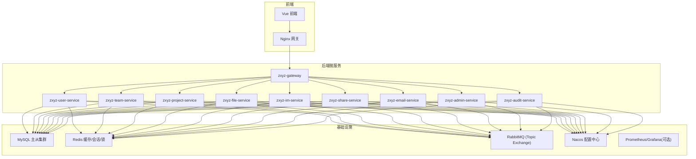
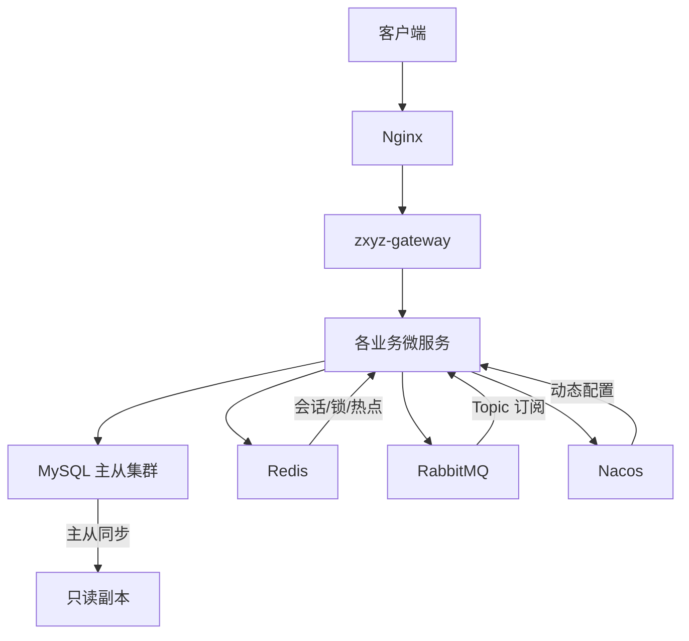
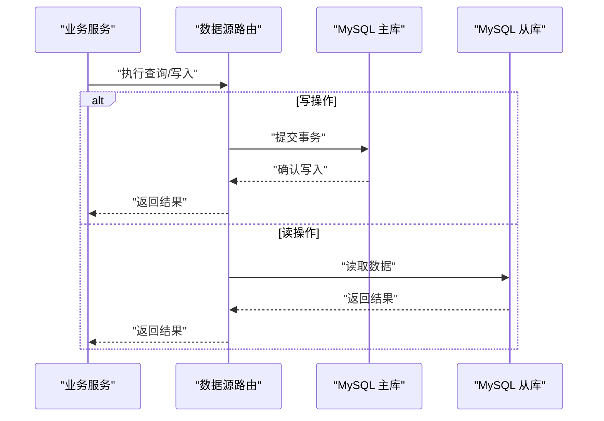
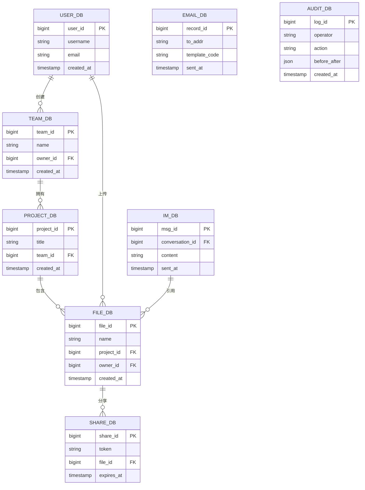
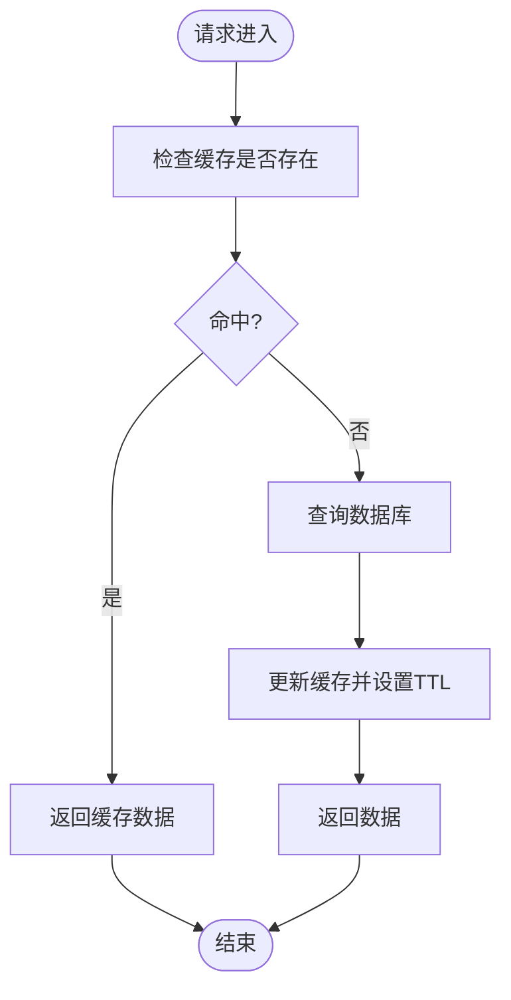
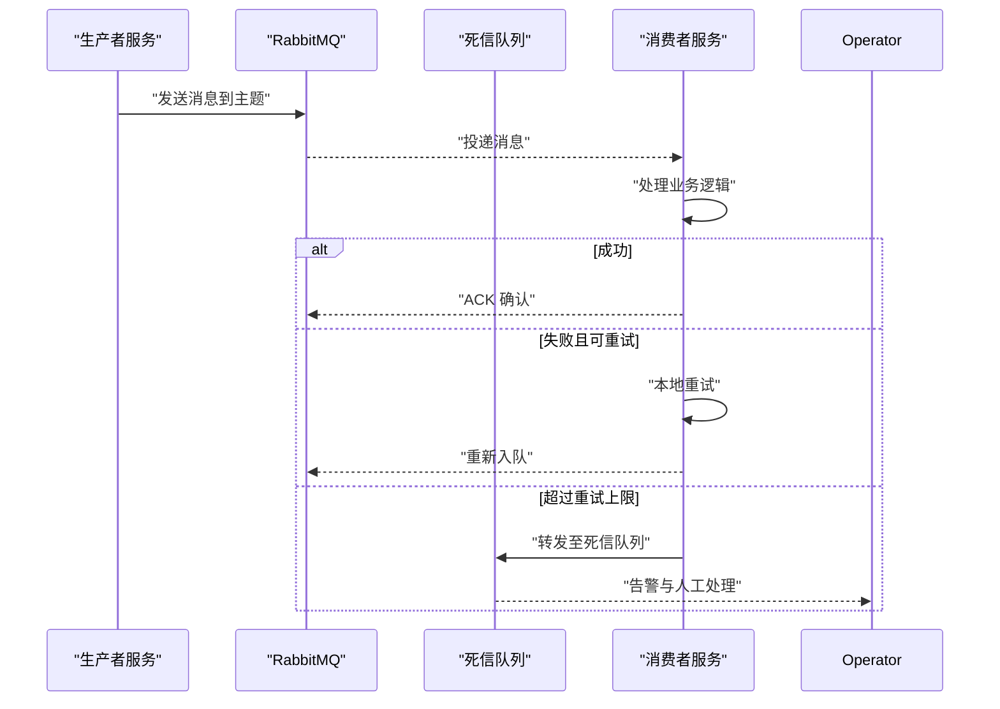
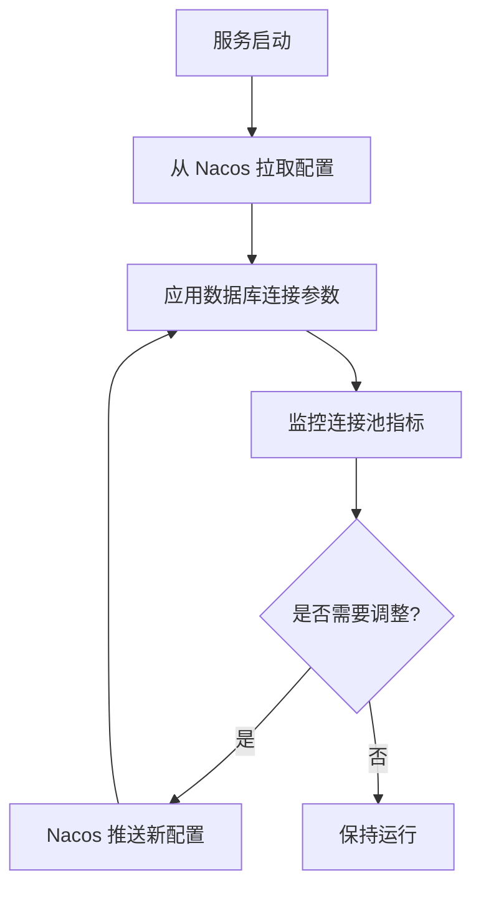
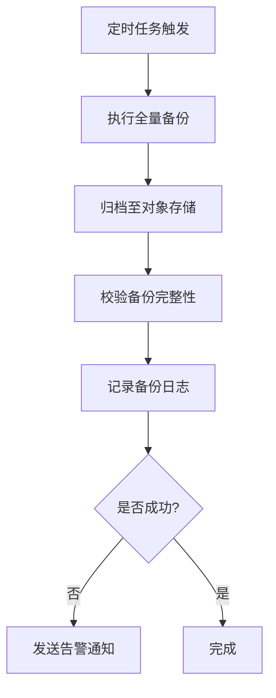
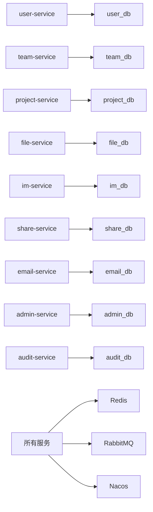

# 数据库架构设计

<cite>
**本文引用的文件**   
- [docker-compose.yml](file://docker-compose.yml)
- [ZXYZdatabaseBack/README.md](file://ZXYZdatabaseBack/README.md)
- [ZXYZdatabaseBack/zxyz-admin-service/src/main/resources/application.yml](file://ZXYZdatabaseBack/zxyz-admin-service/src/main/resources/application.yml)
- [ZXYZdatabaseBack/zxyz-audit-service/src/main/resources/application.yml](file://ZXYZdatabaseBack/zxyz-audit-service/src/main/resources/application.yml)
- [ZXYZdatabaseBack/zxyz-email-service/src/main/resources/application.yml](file://ZXYZdatabaseBack/zxyz-email-service/src/main/resources/application.yml)
- [ZXYZdatabaseBack/zxyz-file-service/src/main/resources/application.yml](file://ZXYZdatabaseBack/zxyz-file-service/src/main/resources/application.yml)
- [ZXYZdatabaseBack/zxyz-gateway/src/main/resources/application.yml](file://ZXYZdatabaseBack/zxyz-gateway/src/main/resources/application.yml)
- [ZXYZdatabaseBack/zxyz-im-service/src/main/resources/application.yml](file://ZXYZdatabaseBack/zxyz-im-service/src/main/resources/application.yml)
- [ZXYZdatabaseBack/zxyz-project-service/src/main/resources/application.yml](file://ZXYZdatabaseBack/zxyz-project-service/src/main/resources/application.yml)
- [ZXYZdatabaseBack/zxyz-share-service/src/main/resources/application.yml](file://ZXYZdatabaseBack/zxyz-share-service/src/main/resources/application.yml)
- [ZXYZdatabaseBack/zxyz-team-service/src/main/resources/application.yml](file://ZXYZdatabaseBack/zxyz-team-service/src/main/resources/application.yml)
- [ZXYZdatabaseBack/zxyz-user-service/src/main/resources/application.yml](file://ZXYZdatabaseBack/zxyz-user-service/src/main/resources/application.yml)
- [nacos-config/zxyz-dynamic.yml](file://nacos-config/zxyz-dynamic.yml)
- [nacos-config/zxyz-static.yml](file://nacos-config/zxyz-static.yml)
- [nacos-config/zxyz-admin-service.yml](file://nacos-config/zxyz-admin-service.yml)
- [nacos-config/zxyz-audit-service.yml](file://nacos-config/zxyz-audit-service.yml)
- [nacos-config/zxyz-email-service.yml](file://nacos-config/zxyz-email-service.yml)
- [nacos-config/zxyz-file-service.yml](file://nacos-config/zxyz-file-service.yml)
- [nacos-config/zxyz-gateway.yml](file://nacos-config/zxyz-gateway.yml)
- [nacos-config/zxyz-im-service.yml](file://nacos-config/zxyz-im-service.yml)
- [nacos-config/zxyz-project-service.yml](file://nacos-config/zxyz-project-service.yml)
- [nacos-config/zxyz-share-service.yml](file://nacos-config/zxyz-share-service.yml)
- [nacos-config/zxyz-team-service.yml](file://nacos-config/zxyz-team-service.yml)
- [nacos-config/zxyz-user-service.yml](file://nacos-config/zxyz-user-service.yml)
- [scripts/backup.sh](file://scripts/backup.sh)
- [deploy/nginx/default.conf](file://deploy/nginx/default.conf)
- [ZXYZdatabaseBack/sql/schema_user.sql](file://ZXYZdatabaseBack/sql/schema_user.sql)
- [ZXYZdatabaseBack/sql/schema_team.sql](file://ZXYZdatabaseBack/sql/schema_team.sql)
- [ZXYZdatabaseBack/sql/schema_project.sql](file://ZXYZdatabaseBack/sql/schema_project.sql)
- [ZXYZdatabaseBack/sql/schema_file.sql](file://ZXYZdatabaseBack/sql/schema_file.sql)
- [ZXYZdatabaseBack/sql/schema_im.sql](file://ZXYZdatabaseBack/sql/schema_im.sql)
- [ZXYZdatabaseBack/sql/schema_share.sql](file://ZXYZdatabaseBack/sql/schema_share.sql)
- [ZXYZdatabaseBack/sql/schema_email.sql](file://ZXYZdatabaseBack/sql/schema_email.sql)
- [ZXYZdatabaseBack/sql/schema_audit.sql](file://ZXYZdatabaseBack/sql/schema_audit.sql)
- [sql/00-init-zxyz.sh](file://sql/00-init-zxyz.sh)
</cite>

## 目录
1. [引言](#引言)
2. [项目结构](#项目结构)
3. [核心组件](#核心组件)
4. [架构总览](#架构总览)
5. [详细组件分析](#详细组件分析)
6. [依赖关系分析](#依赖关系分析)
7. [性能考虑](#性能考虑)
8. [故障排查指南](#故障排查指南)
9. [结论](#结论)
10. [附录](#附录)

## 引言
本文件面向 ZXYZ 项目的数据库与数据层架构，覆盖 MySQL 主从复制、读写分离策略、微服务分库与数据隔离、Redis 缓存层（热点缓存、分布式锁、会话存储）、RabbitMQ 消息队列（Topic Exchange、持久化、死信队列与重试）、Nacos 配置中心在连接管理中的作用，以及监控告警、备份恢复与容量规划建议。文档同时提供架构图与数据流向图，帮助读者快速理解各组件交互关系。

## 项目结构
ZXYZ 后端采用多模块 Maven 工程，包含多个独立微服务；前端为 Vue 应用并通过 Nginx 反向代理暴露。基础设施由 Docker Compose 编排，包含 MySQL、Redis、RabbitMQ、Nacos、Promtail 等。每个服务拥有独立的数据库迁移脚本与配置文件，便于按服务维度进行数据隔离与演进。

**图表来源** 
- [docker-compose.yml](file://docker-compose.yml)
- [deploy/nginx/default.conf](file://deploy/nginx/default.conf)

**章节来源**
- [docker-compose.yml](file://docker-compose.yml)
- [ZXYZdatabaseBack/README.md](file://ZXYZdatabaseBack/README.md)

## 核心组件
- MySQL：作为所有服务的持久化存储，采用主从复制架构，支持读写分离与高可用。
- Redis：用于热点数据缓存、分布式锁与会话存储，降低数据库压力并提升响应速度。
- RabbitMQ：基于 Topic Exchange 的异步消息总线，支撑跨服务事件驱动与最终一致性。
- Nacos：统一配置中心与服务注册发现，集中管理数据库连接参数、连接池与动态开关。
- Gateway/Nginx：统一入口与鉴权过滤，内部端点通过 Token 校验限制公网访问。

**章节来源**
- [ZXYZdatabaseBack/README.md](file://ZXYZdatabaseBack/README.md)
- [docker-compose.yml](file://docker-compose.yml)

## 架构总览
下图展示 ZXYZ 的数据层总体架构，包括服务到数据库、缓存、消息队列与配置中心的交互路径。

**图表来源** 
- [docker-compose.yml](file://docker-compose.yml)
- [nacos-config/zxyz-dynamic.yml](file://nacos-config/zxyz-dynamic.yml)

## 详细组件分析

### MySQL 主从复制与读写分离
- 主从复制：主库负责写操作，一个或多个从库承担读请求，通过 binlog 实现数据同步。
- 读写分离：服务侧根据操作类型选择数据源，写走主库，读走从库或读负载均衡。
- 故障转移：主库异常时自动切换至从库，保证服务可用性；需配合健康检查与连接路由。
- 连接管理：通过 Nacos 动态下发连接参数（如最大连接数、超时、重试），避免重启服务。

**图表来源** 
- [docker-compose.yml](file://docker-compose.yml)

**章节来源**
- [docker-compose.yml](file://docker-compose.yml)

### 微服务分库与数据隔离
- 分库原则：每个服务拥有独立数据库，避免跨库事务与耦合，提升可维护性与扩展性。
- 数据隔离：通过命名空间与权限控制确保服务间数据不可越界访问。
- 共享数据：通过事件与 API 投影模式进行弱耦合同步，禁止直接跨库 JOIN。
- 迁移管理：使用版本化 SQL 脚本（Flyway/Liquibase）保障环境一致性。

**图表来源** 
- [ZXYZdatabaseBack/sql/schema_user.sql](file://ZXYZdatabaseBack/sql/schema_user.sql)
- [ZXYZdatabaseBack/sql/schema_team.sql](file://ZXYZdatabaseBack/sql/schema_team.sql)
- [ZXYZdatabaseBack/sql/schema_project.sql](file://ZXYZdatabaseBack/sql/schema_project.sql)
- [ZXYZdatabaseBack/sql/schema_file.sql](file://ZXYZdatabaseBack/sql/schema_file.sql)
- [ZXYZdatabaseBack/sql/schema_im.sql](file://ZXYZdatabaseBack/sql/schema_im.sql)
- [ZXYZdatabaseBack/sql/schema_share.sql](file://ZXYZdatabaseBack/sql/schema_share.sql)
- [ZXYZdatabaseBack/sql/schema_email.sql](file://ZXYZdatabaseBack/sql/schema_email.sql)
- [ZXYZdatabaseBack/sql/schema_audit.sql](file://ZXYZdatabaseBack/sql/schema_audit.sql)

**章节来源**
- [ZXYZdatabaseBack/sql/schema_user.sql](file://ZXYZdatabaseBack/sql/schema_user.sql)
- [ZXYZdatabaseBack/sql/schema_team.sql](file://ZXYZdatabaseBack/sql/schema_team.sql)
- [ZXYZdatabaseBack/sql/schema_project.sql](file://ZXYZdatabaseBack/sql/schema_project.sql)
- [ZXYZdatabaseBack/sql/schema_file.sql](file://ZXYZdatabaseBack/sql/schema_file.sql)
- [ZXYZdatabaseBack/sql/schema_im.sql](file://ZXYZdatabaseBack/sql/schema_im.sql)
- [ZXYZdatabaseBack/sql/schema_share.sql](file://ZXYZdatabaseBack/sql/schema_share.sql)
- [ZXYZdatabaseBack/sql/schema_email.sql](file://ZXYZdatabaseBack/sql/schema_email.sql)
- [ZXYZdatabaseBack/sql/schema_audit.sql](file://ZXYZdatabaseBack/sql/schema_audit.sql)

### Redis 缓存层设计
- 热点数据缓存：对高频读取的配置、字典、用户信息等设置短 TTL 缓存，减轻数据库压力。
- 分布式锁：基于 Redis 原子命令实现互斥锁，用于并发控制与幂等处理。
- 会话存储：Sa-Token 将会话信息存入 Redis，支持跨节点共享与过期清理。
- 键设计与过期：按服务前缀组织键空间，合理设置过期时间，避免内存泄漏。

**图表来源** 
- [ZXYZdatabaseBack/zxyz-admin-service/src/main/resources/application.yml](file://ZXYZdatabaseBack/zxyz-admin-service/src/main/resources/application.yml)
- [ZXYZdatabaseBack/zxyz-user-service/src/main/resources/application.yml](file://ZXYZdatabaseBack/zxyz-user-service/src/main/resources/application.yml)

**章节来源**
- [ZXYZdatabaseBack/zxyz-admin-service/src/main/resources/application.yml](file://ZXYZdatabaseBack/zxyz-admin-service/src/main/resources/application.yml)
- [ZXYZdatabaseBack/zxyz-user-service/src/main/resources/application.yml](file://ZXYZdatabaseBack/zxyz-user-service/src/main/resources/application.yml)

### RabbitMQ 消息队列架构
- 交换模式：采用 Topic Exchange，按主题路由消息，支持通配符匹配。
- 持久化：队列与消息持久化，确保服务重启不丢失关键事件。
- 死信队列：失败消息进入死信队列，便于人工干预与重试。
- 重试机制：消费者本地重试 + 指数退避，超过阈值转入死信队列。

**图表来源** 
- [ZXYZdatabaseBack/zxyz-audit-service/src/main/resources/application.yml](file://ZXYZdatabaseBack/zxyz-audit-service/src/main/resources/application.yml)
- [ZXYZdatabaseBack/zxyz-file-service/src/main/resources/application.yml](file://ZXYZdatabaseBack/zxyz-file-service/src/main/resources/application.yml)

**章节来源**
- [ZXYZdatabaseBack/zxyz-audit-service/src/main/resources/application.yml](file://ZXYZdatabaseBack/zxyz-audit-service/src/main/resources/application.yml)
- [ZXYZdatabaseBack/zxyz-file-service/src/main/resources/application.yml](file://ZXYZdatabaseBack/zxyz-file-service/src/main/resources/application.yml)

### Nacos 配置中心与连接管理
- 动态配置：数据库连接串、连接池大小、超时与重试策略通过 Nacos 动态下发，无需重启服务。
- 连接池优化：根据负载动态调整 HikariCP/Druid 参数，平衡资源占用与吞吐。
- 灰度发布：按服务实例维度推送差异化配置，支持渐进式上线与回滚。
- 安全加密：敏感配置使用 Jasypt 加密，Nacos 中存储密文，启动时解密。

**图表来源** 
- [nacos-config/zxyz-dynamic.yml](file://nacos-config/zxyz-dynamic.yml)
- [nacos-config/zxyz-static.yml](file://nacos-config/zxyz-static.yml)
- [nacos-config/zxyz-admin-service.yml](file://nacos-config/zxyz-admin-service.yml)

**章节来源**
- [nacos-config/zxyz-dynamic.yml](file://nacos-config/zxyz-dynamic.yml)
- [nacos-config/zxyz-static.yml](file://nacos-config/zxyz-static.yml)
- [nacos-config/zxyz-admin-service.yml](file://nacos-config/zxyz-admin-service.yml)

### 监控告警策略
- 指标采集：Prometheus 采集 MySQL、Redis、RabbitMQ、JVM 与应用指标。
- 告警规则：连接池耗尽、慢查询、队列堆积、死信增长、主从延迟等触发告警。
- 可视化：Grafana 仪表盘展示关键指标趋势与实时状态。
- 日志聚合：Promtail + Loki 收集容器日志，便于问题定位。

[本节为通用指导，不直接分析具体文件]

### 备份恢复方案
- 全量备份：定期 mysqldump 导出全库快照，归档至对象存储。
- 增量备份：开启 binlog 增量备份，结合时间点恢复（PITR）。
- 演练恢复：定期演练恢复流程，验证 RPO/RTO 目标达成。
- 自动化脚本：通过脚本批量执行备份与校验，纳入 CI/CD 流水线。

**图表来源** 
- [scripts/backup.sh](file://scripts/backup.sh)

**章节来源**
- [scripts/backup.sh](file://scripts/backup.sh)

### 容量规划建议
- 数据库容量：按服务维度评估表增长速率，预留 3–6 个月扩容空间。
- 连接池规模：根据 QPS 与平均响应时间估算连接数，避免过度分配。
- 缓存命中率：监控缓存命中率与内存使用，动态调整 TTL 与淘汰策略。
- 消息积压：监控队列长度与消费延迟，横向扩展消费者实例。

[本节为通用指导，不直接分析具体文件]

## 依赖关系分析
各服务对数据库、缓存、消息队列与配置中心的依赖如下所示。

**图表来源** 
- [ZXYZdatabaseBack/zxyz-user-service/src/main/resources/application.yml](file://ZXYZdatabaseBack/zxyz-user-service/src/main/resources/application.yml)
- [ZXYZdatabaseBack/zxyz-team-service/src/main/resources/application.yml](file://ZXYZdatabaseBack/zxyz-team-service/src/main/resources/application.yml)
- [ZXYZdatabaseBack/zxyz-project-service/src/main/resources/application.yml](file://ZXYZdatabaseBack/zxyz-project-service/src/main/resources/application.yml)
- [ZXYZdatabaseBack/zxyz-file-service/src/main/resources/application.yml](file://ZXYZdatabaseBack/zxyz-file-service/src/main/resources/application.yml)
- [ZXYZdatabaseBack/zxyz-im-service/src/main/resources/application.yml](file://ZXYZdatabaseBack/zxyz-im-service/src/main/resources/application.yml)
- [ZXYZdatabaseBack/zxyz-share-service/src/main/resources/application.yml](file://ZXYZdatabaseBack/zxyz-share-service/src/main/resources/application.yml)
- [ZXYZdatabaseBack/zxyz-email-service/src/main/resources/application.yml](file://ZXYZdatabaseBack/zxyz-email-service/src/main/resources/application.yml)
- [ZXYZdatabaseBack/zxyz-admin-service/src/main/resources/application.yml](file://ZXYZdatabaseBack/zxyz-admin-service/src/main/resources/application.yml)
- [ZXYZdatabaseBack/zxyz-audit-service/src/main/resources/application.yml](file://ZXYZdatabaseBack/zxyz-audit-service/src/main/resources/application.yml)

**章节来源**
- [ZXYZdatabaseBack/zxyz-user-service/src/main/resources/application.yml](file://ZXYZdatabaseBack/zxyz-user-service/src/main/resources/application.yml)
- [ZXYZdatabaseBack/zxyz-team-service/src/main/resources/application.yml](file://ZXYZdatabaseBack/zxyz-team-service/src/main/resources/application.yml)
- [ZXYZdatabaseBack/zxyz-project-service/src/main/resources/application.yml](file://ZXYZdatabaseBack/zxyz-project-service/src/main/resources/application.yml)
- [ZXYZdatabaseBack/zxyz-file-service/src/main/resources/application.yml](file://ZXYZdatabaseBack/zxyz-file-service/src/main/resources/application.yml)
- [ZXYZdatabaseBack/zxyz-im-service/src/main/resources/application.yml](file://ZXYZdatabaseBack/zxyz-im-service/src/main/resources/application.yml)
- [ZXYZdatabaseBack/zxyz-share-service/src/main/resources/application.yml](file://ZXYZdatabaseBack/zxyz-share-service/src/main/resources/application.yml)
- [ZXYZdatabaseBack/zxyz-email-service/src/main/resources/application.yml](file://ZXYZdatabaseBack/zxyz-email-service/src/main/resources/application.yml)
- [ZXYZdatabaseBack/zxyz-admin-service/src/main/resources/application.yml](file://ZXYZdatabaseBack/zxyz-admin-service/src/main/resources/application.yml)
- [ZXYZdatabaseBack/zxyz-audit-service/src/main/resources/application.yml](file://ZXYZdatabaseBack/zxyz-audit-service/src/main/resources/application.yml)

## 性能考虑
- 索引优化：为高频查询字段建立合适索引，避免全表扫描。
- 分页与投影：使用分页与投影减少数据传输量。
- 缓存预热：热点数据在服务启动时预热，降低冷启动延迟。
- 连接复用：合理配置连接池大小与超时，避免频繁创建销毁。
- 异步解耦：将耗时操作放入消息队列异步处理，提升主链路响应。

[本节为通用指导，不直接分析具体文件]

## 故障排查指南
- 连接失败：检查 Nacos 配置是否正确，网络连通性与防火墙策略。
- 主从延迟：监控主从延迟指标，必要时降级读流量或临时切读主库。
- 缓存击穿：增加布隆过滤器或互斥锁，防止热点键失效风暴。
- 消息堆积：扩容消费者实例，检查消费者逻辑是否存在阻塞。
- 备份失败：查看备份脚本日志，确认存储空间与权限。

**章节来源**
- [scripts/backup.sh](file://scripts/backup.sh)
- [ZXYZdatabaseBack/zxyz-audit-service/src/main/resources/application.yml](file://ZXYZdatabaseBack/zxyz-audit-service/src/main/resources/application.yml)

## 结论
ZXYZ 项目通过微服务分库、MySQL 主从复制、Redis 缓存与 RabbitMQ 消息队列构建了高可用、可扩展的数据层。Nacos 提供统一的配置管理能力，配合监控与备份策略保障系统稳定运行。建议在后续迭代中持续优化索引、连接池与缓存策略，完善监控告警与自动化运维能力。

[本节为总结性内容，不直接分析具体文件]

## 附录
- 初始化脚本：参考 sql/00-init-zxyz.sh 了解数据库初始化流程。
- 部署配置：参考 docker-compose.yml 与 deploy/nginx/default.conf 了解容器编排与反向代理配置。
- 服务配置：参考各服务 application.yml 与 nacos-config 下的对应文件，了解连接参数与功能开关。

**章节来源**
- [sql/00-init-zxyz.sh](file://sql/00-init-zxyz.sh)
- [docker-compose.yml](file://docker-compose.yml)
- [deploy/nginx/default.conf](file://deploy/nginx/default.conf)
- [ZXYZdatabaseBack/zxyz-admin-service/src/main/resources/application.yml](file://ZXYZdatabaseBack/zxyz-admin-service/src/main/resources/application.yml)
- [nacos-config/zxyz-admin-service.yml](file://nacos-config/zxyz-admin-service.yml)