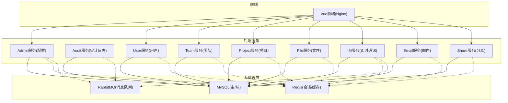
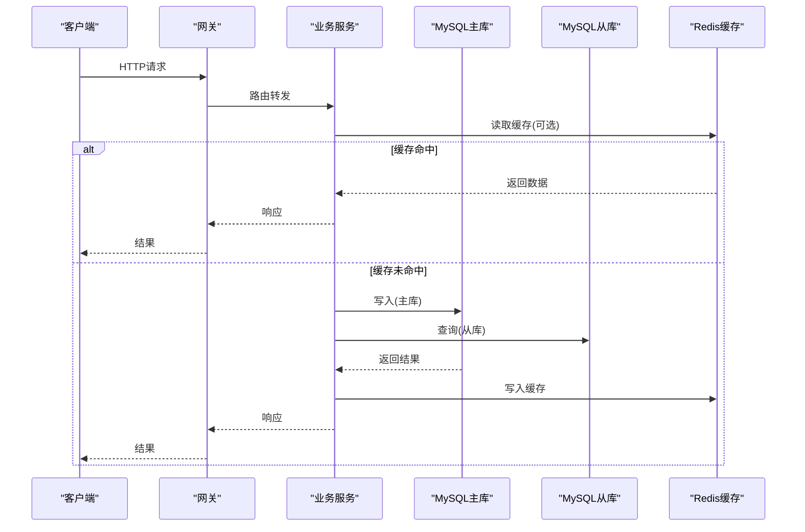
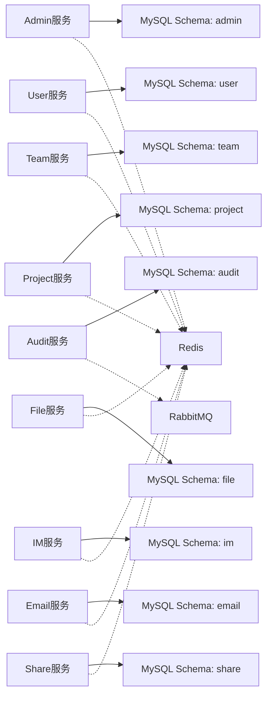

# 数据库设计

<cite>
**本文引用的文件**   
- [ZXYZdatabaseBack/README.md](file://ZXYZdatabaseBack/README.md)
- [ZXYZdatabaseBack/pom.xml](file://ZXYZdatabaseBack/pom.xml)
- [ZXYZdatabaseBack/zxyz-admin-service/src/main/resources/application.yml](file://ZXYZdatabaseBack/zxyz-admin-service/src/main/resources/application.yml)
- [ZXYZdatabaseBack/zxyz-admin-service/src/main/resources/db/migration/V1__init_config_schema.sql](file://ZXYZdatabaseBack/zxyz-admin-service/src/main/resources/db/migration/V1__init_config_schema.sql)
- [ZXYZdatabaseBack/zxyz-audit-service/src/main/resources/application.yml](file://ZXYZdatabaseBack/zxyz-audit-service/src/main/resources/application.yml)
- [ZXYZdatabaseBack/zxyz-audit-service/src/main/resources/db/migration/V1__init_schema.sql](file://ZXYZdatabaseBack/zxyz-audit-service/src/main/resources/db/migration/V1__init_schema.sql)
- [ZXYZdatabaseBack/ZXYZdatabaseBack/sql/schema_user.sql](file://ZXYZdatabaseBack/ZXYZdatabaseBack/sql/schema_user.sql)
- [ZXYZdatabaseBack/ZXYZdatabaseBack/sql/schema_team.sql](file://ZXYZdatabaseBack/ZXYZdatabaseBack/sql/schema_team.sql)
- [ZXYZdatabaseBack/ZXYZdatabaseBack/sql/schema_project.sql](file://ZXYZdatabaseBack/ZXYZdatabaseBack/sql/schema_project.sql)
- [ZXYZdatabaseBack/ZXYZdatabaseBack/sql/schema_file.sql](file://ZXYZdatabaseBack/ZXYZdatabaseBack/sql/schema_file.sql)
- [ZXYZdatabaseBack/ZXYZdatabaseBack/sql/schema_im.sql](file://ZXYZdatabaseBack/ZXYZdatabaseBack/sql/schema_im.sql)
- [ZXYZdatabaseBack/ZXYZdatabaseBack/sql/schema_email.sql](file://ZXYZdatabaseBack/ZXYZdatabaseBack/sql/schema_email.sql)
- [ZXYZdatabaseBack/ZXYZdatabaseBack/sql/schema_share.sql](file://ZXYZdatabaseBack/ZXYZdatabaseBack/sql/schema_share.sql)
- [ZXYZdatabaseBack/ZXYZdatabaseBack/sql/schema_audit.sql](file://ZXYZdatabaseBack/ZXYZdatabaseBack/sql/schema_audit.sql)
- [ZXYZdatabaseBack/nacos-config/zxyz-dynamic.yml](file://ZXYZdatabaseBack/nacos-config/zxyz-dynamic.yml)
- [ZXYZdatabaseBack/docker-compose.yml](file://ZXYZdatabaseBack/docker-compose.yml)
- [scripts/backup.sh](file://scripts/backup.sh)
- [scripts/rollback.sh](file://scripts/rollback.sh)
</cite>

## 目录
1. [引言](#引言)
2. [项目结构](#项目结构)
3. [核心组件](#核心组件)
4. [架构总览](#架构总览)
5. [详细组件分析](#详细组件分析)
6. [依赖分析](#依赖分析)
7. [性能考虑](#性能考虑)
8. [故障排查指南](#故障排查指南)
9. [结论](#结论)
10. [附录](#附录)

## 引言
本文件面向ZXYZ项目的数据库设计与治理，覆盖MySQL主从复制与分库策略、核心实体关系（ER图）、表结构设计（字段、类型、约束与索引）、Flyway迁移管理、数据访问模式（MyBatis-Plus规范、查询优化与缓存）、数据安全（加密、访问控制、审计日志）、性能优化、备份恢复与生命周期管理。文档基于仓库中的SQL脚本、服务配置与部署编排进行归纳总结，确保读者既能把握整体架构，也能落地到具体实现细节。

## 项目结构
ZXYZ采用微服务架构，后端包含多个独立Maven模块，每个业务域服务拥有自己的数据库Schema与Flyway迁移脚本；前端为Vue应用，通过网关统一接入。数据库相关资产主要分布在：
- ZXYZdatabaseBack/sql：按领域划分的初始Schema脚本（用户、团队、项目、文件、IM、邮件、分享、审计等）
- 各服务的src/main/resources/db/migration：Flyway增量迁移脚本
- nacos-config：集中化配置（含动态数据源与连接参数）
- docker-compose.yml：容器编排，定义MySQL、Redis、RabbitMQ等基础设施
- scripts：备份、回滚等运维脚本



**图表来源**
- [docker-compose.yml](file://ZXYZdatabaseBack/docker-compose.yml)
- [nacos-config/zxyz-dynamic.yml](file://ZXYZdatabaseBack/nacos-config/zxyz-dynamic.yml)

**章节来源**
- [ZXYZdatabaseBack/README.md](file://ZXYZdatabaseBack/README.md)
- [ZXYZdatabaseBack/pom.xml](file://ZXYZdatabaseBack/pom.xml)

## 核心组件
- 数据库层：MySQL为主存储，支持主从复制；Redis用于会话与热点缓存；RabbitMQ承载异步事件（Topic Exchange: zxyz.topic）。
- 迁移层：Flyway统一管理数据库版本演进，按服务域划分迁移脚本，保证可重复部署与回滚能力。
- 数据访问层：MyBatis-Plus作为ORM框架，配合Mapper接口与XML/注解完成CRUD与复杂查询；服务间通过ServiceClient窄端点投影调用。
- 安全与审计：敏感信息使用Jasypt加密；操作审计由Audit服务消费消息并落库，支持审计日志清理与去重。

**章节来源**
- [ZXYZdatabaseBack/zxyz-admin-service/src/main/resources/application.yml](file://ZXYZdatabaseBack/zxyz-admin-service/src/main/resources/application.yml)
- [ZXYZdatabaseBack/zxyz-audit-service/src/main/resources/application.yml](file://ZXYZdatabaseBack/zxyz-audit-service/src/main/resources/application.yml)
- [ZXYZdatabaseBack/nacos-config/zxyz-dynamic.yml](file://ZXYZdatabaseBack/nacos-config/zxyz-dynamic.yml)

## 架构总览
ZXYZ的数据库架构遵循“按域分库、主从读写分离”的原则：
- 分库策略：每个业务域服务拥有独立Schema（如user、team、project、file、im、email、share、audit），避免跨域强耦合，便于水平扩展与独立演进。
- 主从复制：MySQL主节点负责写，从节点承担读流量；通过Nacos动态配置切换读写数据源，提升吞吐与可用性。
- 迁移管理：Flyway以V{version}__description.sql命名规范组织脚本，按服务维度独立维护，支持增量更新与回滚。
- 数据访问：MyBatis-Plus提供通用CRUD，结合分页插件、乐观锁、逻辑删除等特性；复杂查询通过XML或LambdaQueryWrapper组合条件。
- 缓存与一致性：热点数据（如权限、配置、会话）使用Redis缓存，关键变更通过消息驱动异步更新缓存，保障最终一致性。



**图表来源**
- [nacos-config/zxyz-dynamic.yml](file://ZXYZdatabaseBack/nacos-config/zxyz-dynamic.yml)
- [ZXYZdatabaseBack/zxyz-admin-service/src/main/resources/application.yml](file://ZXYZdatabaseBack/zxyz-admin-service/src/main/resources/application.yml)

**章节来源**
- [ZXYZdatabaseBack/docker-compose.yml](file://ZXYZdatabaseBack/docker-compose.yml)
- [ZXYZdatabaseBack/nacos-config/zxyz-dynamic.yml](file://ZXYZdatabaseBack/nacos-config/zxyz-dynamic.yml)

## 详细组件分析

### 实体关系图（ER图）
核心实体包括用户(User)、团队(Team)、项目(Project)、文件(File)、消息(Message)，以及辅助实体如成员关系、权限、分享链接等。以下ER图展示主要关联关系：

```mermaid
erDiagram
USER {
bigint id PK
varchar username UK
varchar email UK
varchar password
datetime created_at
datetime updated_at
tinyint status
}
TEAM {
bigint id PK
varchar name
varchar description
bigint owner_id FK
datetime created_at
datetime updated_at
tinyint status
}
PROJECT {
bigint id PK
varchar name
text description
bigint team_id FK
bigint creator_id FK
datetime created_at
datetime updated_at
tinyint status
}
FILE {
bigint id PK
varchar name
varchar path
bigint project_id FK
bigint uploader_id FK
bigint folder_id FK
datetime created_at
datetime updated_at
tinyint status
}
MESSAGE {
bigint id PK
varchar conversation_id
varchar sender_id
text content
tinyint type
datetime created_at
datetime updated_at
tinyint status
}
TEAM_MEMBER {
bigint id PK
bigint team_id FK
bigint user_id FK
varchar role
datetime joined_at
}
PROJECT_MEMBER {
bigint id PK
bigint project_id FK
bigint user_id FK
varchar role
datetime added_at
}
SHARE_LINK {
bigint id PK
varchar code UK
bigint file_id FK
datetime expires_at
tinyint status
}
USER ||--o{ TEAM : "创建/加入"
TEAM ||--o{ TEAM_MEMBER : "包含成员"
TEAM ||--o{ PROJECT : "拥有项目"
PROJECT ||--o{ PROJECT_MEMBER : "包含成员"
PROJECT ||--o{ FILE : "包含文件"
USER ||--o{ FILE : "上传文件"
MESSAGE |||| CONVERSATION : "属于会话"
SHARE_LINK ||--o| FILE : "指向文件"
```

**图表来源**
- [ZXYZdatabaseBack/ZXYZdatabaseBack/sql/schema_user.sql](file://ZXYZdatabaseBack/ZXYZdatabaseBack/sql/schema_user.sql)
- [ZXYZdatabaseBack/ZXYZdatabaseBack/sql/schema_team.sql](file://ZXYZdatabaseBack/ZXYZdatabaseBack/sql/schema_team.sql)
- [ZXYZdatabaseBack/ZXYZdatabaseBack/sql/schema_project.sql](file://ZXYZdatabaseBack/ZXYZdatabaseBack/sql/schema_project.sql)
- [ZXYZdatabaseBack/ZXYZdatabaseBack/sql/schema_file.sql](file://ZXYZdatabaseBack/ZXYZdatabaseBack/sql/schema_file.sql)
- [ZXYZdatabaseBack/ZXYZdatabaseBack/sql/schema_im.sql](file://ZXYZdatabaseBack/ZXYZdatabaseBack/sql/schema_im.sql)
- [ZXYZdatabaseBack/ZXYZdatabaseBack/sql/schema_share.sql](file://ZXYZdatabaseBack/ZXYZdatabaseBack/sql/schema_share.sql)

**章节来源**
- [ZXYZdatabaseBack/ZXYZdatabaseBack/sql/schema_user.sql](file://ZXYZdatabaseBack/ZXYZdatabaseBack/sql/schema_user.sql)
- [ZXYZdatabaseBack/ZXYZdatabaseBack/sql/schema_team.sql](file://ZXYZdatabaseBack/ZXYZdatabaseBack/sql/schema_team.sql)
- [ZXYZdatabaseBack/ZXYZdatabaseBack/sql/schema_project.sql](file://ZXYZdatabaseBack/ZXYZdatabaseBack/sql/schema_project.sql)
- [ZXYZdatabaseBack/ZXYZdatabaseBack/sql/schema_file.sql](file://ZXYZdatabaseBack/ZXYZdatabaseBack/sql/schema_file.sql)
- [ZXYZdatabaseBack/ZXYZdatabaseBack/sql/schema_im.sql](file://ZXYZdatabaseBack/ZXYZdatabaseBack/sql/schema_im.sql)
- [ZXYZdatabaseBack/ZXYZdatabaseBack/sql/schema_share.sql](file://ZXYZdatabaseBack/ZXYZdatabaseBack/sql/schema_share.sql)

### 表结构设计说明
以下为各核心表的字段定义、数据类型、主外键约束与索引策略概述（具体DDL请参考对应SQL文件）：

- 用户表（user）
  - 主键：id（bigint，自增）
  - 唯一键：username、email
  - 关键字段：password（加密存储）、status（状态枚举）
  - 索引：username、email唯一索引；created_at、updated_at普通索引
  - 审计字段：created_at、updated_at、deleted_at（逻辑删除）

- 团队表（team）
  - 主键：id（bigint）
  - 外键：owner_id（关联user.id）
  - 关键字段：name、description、status
  - 索引：name唯一索引；owner_id普通索引；created_at、updated_at

- 项目表（project）
  - 主键：id（bigint）
  - 外键：team_id（关联team.id）、creator_id（关联user.id）
  - 关键字段：name、description、status
  - 索引：team_id+name联合唯一索引；creator_id、status、created_at

- 文件表（file）
  - 主键：id（bigint）
  - 外键：project_id（关联project.id）、uploader_id（关联user.id）、folder_id（关联file.id，自引用）
  - 关键字段：name、path、type、size、status
  - 索引：project_id+path唯一索引；uploader_id、status、created_at

- 消息表（message）
  - 主键：id（bigint）
  - 外键：conversation_id（关联conversation.id）、sender_id（关联user.id）
  - 关键字段：content、type、status
  - 索引：conversation_id+created_at复合索引；sender_id、type

- 团队成员表（team_member）
  - 主键：id（bigint）
  - 外键：team_id（关联team.id）、user_id（关联user.id）
  - 关键字段：role（角色枚举）、joined_at
  - 索引：team_id+user_id联合唯一索引；role、joined_at

- 项目成员表（project_member）
  - 主键：id（bigint）
  - 外键：project_id（关联project.id）、user_id（关联user.id）
  - 关键字段：role、added_at
  - 索引：project_id+user_id联合唯一索引；role

- 分享链接表（share_link）
  - 主键：id（bigint）
  - 外键：file_id（关联file.id）
  - 关键字段：code（唯一）、expires_at、status
  - 索引：code唯一索引；file_id、expires_at

**章节来源**
- [ZXYZdatabaseBack/ZXYZdatabaseBack/sql/schema_user.sql](file://ZXYZdatabaseBack/ZXYZdatabaseBack/sql/schema_user.sql)
- [ZXYZdatabaseBack/ZXYZdatabaseBack/sql/schema_team.sql](file://ZXYZdatabaseBack/ZXYZdatabaseBack/sql/schema_team.sql)
- [ZXYZdatabaseBack/ZXYZdatabaseBack/sql/schema_project.sql](file://ZXYZdatabaseBack/ZXYZdatabaseBack/sql/schema_project.sql)
- [ZXYZdatabaseBack/ZXYZdatabaseBack/sql/schema_file.sql](file://ZXYZdatabaseBack/ZXYZdatabaseBack/sql/schema_file.sql)
- [ZXYZdatabaseBack/ZXYZdatabaseBack/sql/schema_im.sql](file://ZXYZdatabaseBack/ZXYZdatabaseBack/sql/schema_im.sql)
- [ZXYZdatabaseBack/ZXYZdatabaseBack/sql/schema_share.sql](file://ZXYZdatabaseBack/ZXYZdatabaseBack/sql/schema_share.sql)

### Flyway迁移管理策略
- 版本控制：迁移脚本采用V{version}__description.sql命名规范，按服务域独立维护（如admin、audit、user、team等）。
- 增量更新：每次变更新增一个迁移脚本，禁止修改历史脚本；服务启动时自动执行未应用的迁移。
- 回滚机制：生产环境建议仅允许向下回滚到最近稳定版本；开发/测试环境可启用自动回滚。
- 校验与锁定：迁移前进行数据库连通性检查与锁竞争处理，避免并发迁移导致冲突。
- 审计与追踪：记录迁移执行时间、执行人、影响行数，便于问题追溯。

**章节来源**
- [ZXYZdatabaseBack/zxyz-admin-service/src/main/resources/db/migration/V1__init_config_schema.sql](file://ZXYZdatabaseBack/zxyz-admin-service/src/main/resources/db/migration/V1__init_config_schema.sql)
- [ZXYZdatabaseBack/zxyz-audit-service/src/main/resources/db/migration/V1__init_schema.sql](file://ZXYZdatabaseBack/zxyz-audit-service/src/main/resources/db/migration/V1__init_schema.sql)

### 数据访问模式（MyBatis-Plus）
- ORM规范：使用BaseMapper继承通用CRUD方法，复杂查询通过LambdaQueryWrapper或XML映射。
- 分页插件：启用PageHelper或MyBatis-Plus内置分页插件，避免全表扫描。
- 乐观锁：对高频更新字段（如version）启用乐观锁注解，防止并发覆盖。
- 逻辑删除：使用@TableLogic标记软删除字段，所有查询自动追加删除条件。
- 审计字段：通过MetaObjectHandler自动填充created_at、updated_at、create_by、update_by。
- 缓存集成：热点数据（如权限、配置）使用@Cacheable注解或手动Redis操作，失效策略与消息驱动一致。

**章节来源**
- [ZXYZdatabaseBack/zxyz-admin-service/src/main/resources/application.yml](file://ZXYZdatabaseBack/zxyz-admin-service/src/main/resources/application.yml)
- [ZXYZdatabaseBack/zxyz-audit-service/src/main/resources/application.yml](file://ZXYZdatabaseBack/zxyz-audit-service/src/main/resources/application.yml)

### 数据安全策略
- 敏感信息加密：密码、密钥等敏感字段使用Jasypt加密存储，配置文件中的敏感值通过环境变量注入。
- 访问控制：基于Sa-Token进行认证与授权，内部服务调用需携带X-Internal-Service-Token头，网关层拦截非法请求。
- 审计日志：所有关键操作（增删改）通过RabbitMQ异步投递至Audit服务，持久化至audit库，支持查询与清理。
- 数据脱敏：对外API返回敏感字段（如手机号、邮箱）进行脱敏处理，避免泄露。
- 传输加密：全站HTTPS，数据库连接使用SSL加密（可选）。

**章节来源**
- [ZXYZdatabaseBack/ZXYZdatabaseBack/sql/schema_audit.sql](file://ZXYZdatabaseBack/ZXYZdatabaseBack/sql/schema_audit.sql)
- [ZXYZdatabaseBack/nacos-config/zxyz-dynamic.yml](file://ZXYZdatabaseBack/nacos-config/zxyz-dynamic.yml)

### 性能优化建议
- 索引优化：为高频查询字段建立合适索引，避免过度索引导致写放大；定期分析慢查询日志。
- 读写分离：主库处理写操作，从库承担读流量，合理分配连接池大小。
- 缓存策略：热点数据（如用户信息、团队配置）使用Redis缓存，设置合理过期时间与更新策略。
- 分页与限流：列表查询强制分页，接口层增加限流保护，防止雪崩。
- 批量操作：大批量插入/更新使用批量接口，减少网络往返。
- 连接池调优：根据QPS与延迟目标调整HikariCP连接池参数。

[本节为通用指导，不直接分析具体文件]

### 备份恢复策略
- 全量备份：每日凌晨执行mysqldump全量备份，保留最近30天快照。
- 增量备份：开启MySQL binlog，每小时归档一次，支持时间点恢复。
- 异地容灾：备份文件同步至对象存储（如OSS/S3），跨区域冗余存储。
- 恢复演练：每季度进行一次恢复演练，验证备份有效性。
- 自动化脚本：通过backup.sh脚本自动化备份流程，失败告警通知。

**章节来源**
- [scripts/backup.sh](file://scripts/backup.sh)

### 数据生命周期管理
- 热数据：近3个月活跃数据保留在主库，高性能访问。
- 温数据：3-12个月数据迁移至归档库，降低主库压力。
- 冷数据：1年以上数据压缩归档至对象存储，按需解冻。
- 清理策略：审计日志、临时文件等按策略定期清理，释放存储空间。
- 合规要求：用户注销后数据匿名化处理，满足隐私法规。

[本节为通用指导，不直接分析具体文件]

## 依赖分析
数据库相关依赖关系如下：
- 服务与数据库：每个服务依赖对应Schema，通过Nacos动态配置数据源。
- 缓存与消息：Redis与RabbitMQ作为辅助存储，与数据库保持最终一致性。
- 迁移工具：Flyway在应用启动时执行迁移脚本，依赖数据库连接与权限。
- 运维脚本：backup.sh与rollback.sh依赖系统命令与数据库客户端。



**图表来源**
- [ZXYZdatabaseBack/nacos-config/zxyz-dynamic.yml](file://ZXYZdatabaseBack/nacos-config/zxyz-dynamic.yml)
- [ZXYZdatabaseBack/docker-compose.yml](file://ZXYZdatabaseBack/docker-compose.yml)

**章节来源**
- [ZXYZdatabaseBack/nacos-config/zxyz-dynamic.yml](file://ZXYZdatabaseBack/nacos-config/zxyz-dynamic.yml)
- [ZXYZdatabaseBack/docker-compose.yml](file://ZXYZdatabaseBack/docker-compose.yml)

## 性能考虑
- 索引设计：针对高频查询路径（如team_id+project_id、conversation_id+time）建立复合索引。
- 查询优化：避免SELECT *，只取必要字段；使用EXPLAIN分析执行计划。
- 连接池：根据并发量调整最大连接数与超时时间，避免连接耗尽。
- 缓存命中率：监控Redis命中率，调整TTL与预热策略。
- 分库分表：当单表超过千万级时，考虑按用户ID或团队ID分片。

[本节为通用指导，不直接分析具体文件]

## 故障排查指南
- 迁移失败：检查Flyway元数据表，确认脚本版本与MD5校验；查看数据库权限与锁状态。
- 连接超时：检查MySQL主从同步状态、网络连通性与连接池配置。
- 缓存不一致：核对消息队列消费情况，确保缓存更新与数据库事务一致。
- 慢查询：启用慢查询日志，定位长事务与全表扫描。
- 备份失败：检查磁盘空间、权限与脚本输出日志。

**章节来源**
- [scripts/rollback.sh](file://scripts/rollback.sh)
- [scripts/backup.sh](file://scripts/backup.sh)

## 结论
ZXYZ数据库设计遵循微服务最佳实践，通过分库隔离、主从复制、Flyway迁移与MyBatis-Plus高效访问，构建了可扩展、高可用的数据层。结合缓存、消息与审计机制，实现了性能与安全的双重保障。建议持续监控与优化，逐步引入分片与冷热分离，进一步提升系统容量与稳定性。

[本节为总结性内容，不直接分析具体文件]

## 附录
- 术语表：主从复制、Flyway、MyBatis-Plus、Nacos、Sa-Token等
- 参考链接：MySQL官方文档、Flyway手册、MyBatis-Plus指南
- 变更记录：本文件随项目演进持续更新，重大变更需评审与发布

[本节为补充信息，不直接分析具体文件]