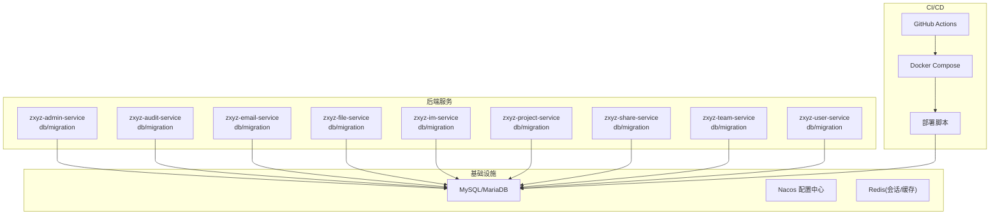
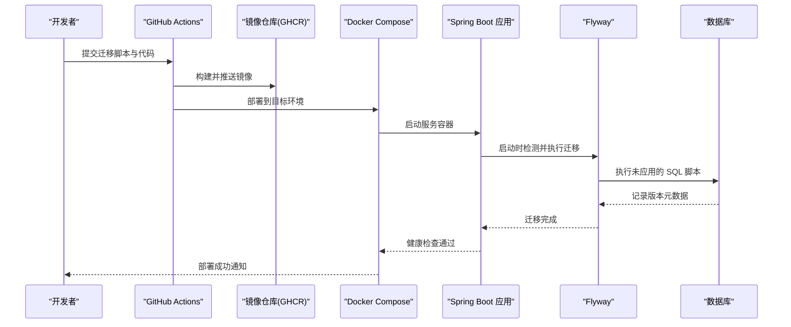
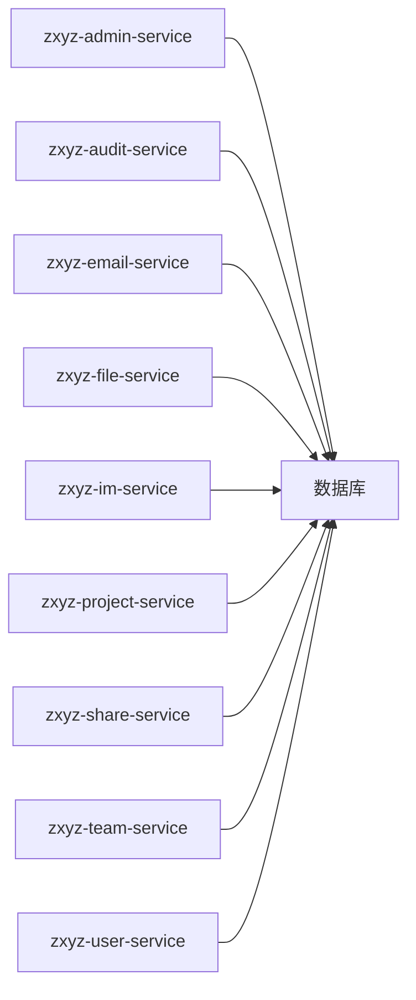

# 数据库迁移管理

<cite>
**本文引用的文件**   
- [zxyz-admin-service/V1__init_config_schema.sql](file://ZXYZdatabaseBack/zxyz-admin-service/src/main/resources/db/migration/V1__init_config_schema.sql)
- [zxyz-admin-service/V2__hot_config_keys.sql](file://ZXYZdatabaseBack/zxyz-admin-service/src/main/resources/db/migration/V2__hot_config_keys.sql)
- [zxyz-admin-service/V3__fix_config_keys.sql](file://ZXYZdatabaseBack/zxyz-admin-service/src/main/resources/db/migration/V3__fix_config_keys.sql)
- [zxyz-audit-service/V1__init_schema.sql](file://ZXYZdatabaseBack/zxyz-audit-service/src/main/resources/db/migration/V1__init_schema.sql)
- [zxyz-audit-service/V2__add_operate_log_before_after_values.sql](file://ZXYZdatabaseBack/zxyz-audit-service/src/main/resources/db/migration/V2__add_operate_log_before_after_values.sql)
- [zxyz-audit-service/V3__add_message_hash_unique.sql](file://ZXYZdatabaseBack/zxyz-audit-service/src/main/resources/db/migration/V3__add_message_hash_unique.sql)
- [zxyz-email-service/application.yml](file://ZXYZdatabaseBack/zxyz-email-service/src/main/resources/application.yml)
- [zxyz-file-service/application.yml](file://ZXYZdatabaseBack/zxyz-file-service/src/main/resources/application.yml)
- [zxyz-im-service/application.yml](file://ZXYZdatabaseBack/zxyz-im-service/src/main/resources/application.yml)
- [zxyz-project-service/application.yml](file://ZXYZdatabaseBack/zxyz-project-service/src/main/resources/application.yml)
- [zxyz-share-service/application.yml](file://ZXYZdatabaseBack/zxyz-share-service/src/main/resources/application.yml)
- [zxyz-team-service/application.yml](file://ZXYZdatabaseBack/zxyz-team-service/src/main/resources/application.yml)
- [zxyz-user-service/application.yml](file://ZXYZdatabaseBack/zxyz-user-service/src/main/resources/application.yml)
- [docker-compose.yml](file://docker-compose.yml)
- [ci-cd.yml](file://.github/workflows/ci-cd.yml)
- [deploy-fast.sh](file://scripts/deploy-fast.sh)
- [rollback.sh](file://scripts/rollback.sh)
- [00-init-zxyz.sh](file://sql/00-init-zxyz.sh)
</cite>

## 目录
1. [简介](#简介)
2. [项目结构](#项目结构)
3. [核心组件](#核心组件)
4. [架构总览](#架构总览)
5. [详细组件分析](#详细组件分析)
6. [依赖关系分析](#依赖关系分析)
7. [性能考虑](#性能考虑)
8. [故障排查指南](#故障排查指南)
9. [结论](#结论)
10. [附录](#附录)

## 简介
本文件面向 ZXYZ 项目的数据库迁移管理，聚焦 Flyway 迁移工具的使用规范与落地实践。内容涵盖脚本命名约定、版本管理与执行顺序控制；增量更新策略（表结构变更、数据迁移脚本编写规范、回滚机制）；多环境差异化处理（开发、测试、生产）；事务处理、数据安全与性能优化；错误处理与异常恢复；迁移脚本的测试方法与验证流程；以及自动化部署集成方案。同时提供常见场景的处理模板与示例路径，便于团队快速复用与统一标准。

## 项目结构
ZXYZ 采用微服务架构，每个后端服务模块均包含独立的 db/migration 目录，存放该服务的 Flyway 迁移脚本。应用通过 Spring Boot + Flyway 自动发现并执行迁移。CI/CD 使用 GitHub Actions，结合 Docker Compose 编排容器化部署，并提供一键部署与回滚脚本。

图表来源
- [docker-compose.yml](file://docker-compose.yml)
- [ci-cd.yml](file://.github/workflows/ci-cd.yml)

章节来源
- [zxyz-admin-service/V1__init_config_schema.sql](file://ZXYZdatabaseBack/zxyz-admin-service/src/main/resources/db/migration/V1__init_config_schema.sql)
- [zxyz-audit-service/V1__init_schema.sql](file://ZXYZdatabaseBack/zxyz-audit-service/src/main/resources/db/migration/V1__init_schema.sql)
- [zxyz-email-service/application.yml](file://ZXYZdatabaseBack/zxyz-email-service/src/main/resources/application.yml)
- [zxyz-file-service/application.yml](file://ZXYZdatabaseBack/zxyz-file-service/src/main/resources/application.yml)
- [zxyz-im-service/application.yml](file://ZXYZdatabaseBack/zxyz-im-service/src/main/resources/application.yml)
- [zxyz-project-service/application.yml](file://ZXYZdatabaseBack/zxyz-project-service/src/main/resources/application.yml)
- [zxyz-share-service/application.yml](file://ZXYZdatabaseBack/zxyz-share-service/src/main/resources/application.yml)
- [zxyz-team-service/application.yml](file://ZXYZdatabaseBack/zxyz-team-service/src/main/resources/application.yml)
- [zxyz-user-service/application.yml](file://ZXYZdatabaseBack/zxyz-user-service/src/main/resources/application.yml)

## 核心组件
- Flyway 迁移脚本：按服务隔离，位于各模块 resources/db/migration 下，命名遵循 V{版本号}__{描述}.sql。
- Spring Boot 集成：通过 application*.yml 或 Nacos 动态配置启用 Flyway，默认在应用启动时执行未执行的迁移。
- 多环境配置：dev/test/prod 配置文件分别指定数据库连接与 Flyway 行为（如校验、基线、跳过等）。
- CI/CD 流水线：构建镜像前进行迁移脚本静态检查，部署阶段执行数据库初始化与迁移。
- 运维脚本：提供一键部署、健康检查与回滚脚本，确保迁移过程可观测与可恢复。

章节来源
- [zxyz-admin-service/V1__init_config_schema.sql](file://ZXYZdatabaseBack/zxyz-admin-service/src/main/resources/db/migration/V1__init_config_schema.sql)
- [zxyz-admin-service/V2__hot_config_keys.sql](file://ZXYZdatabaseBack/zxyz-admin-service/src/main/resources/db/migration/V2__hot_config_keys.sql)
- [zxyz-admin-service/V3__fix_config_keys.sql](file://ZXYZdatabaseBack/zxyz-admin-service/src/main/resources/db/migration/V3__fix_config_keys.sql)
- [zxyz-audit-service/V1__init_schema.sql](file://ZXYZdatabaseBack/zxyz-audit-service/src/main/resources/db/migration/V1__init_schema.sql)
- [zxyz-audit-service/V2__add_operate_log_before_after_values.sql](file://ZXYZdatabaseBack/zxyz-audit-service/src/main/resources/db/migration/V2__add_operate_log_before_after_values.sql)
- [zxyz-audit-service/V3__add_message_hash_unique.sql](file://ZXYZdatabaseBack/zxyz-audit-service/src/main/resources/db/migration/V3__add_message_hash_unique.sql)
- [zxyz-email-service/application.yml](file://ZXYZdatabaseBack/zxyz-email-service/src/main/resources/application.yml)
- [zxyz-file-service/application.yml](file://ZXYZdatabaseBack/zxyz-file-service/src/main/resources/application.yml)
- [zxyz-im-service/application.yml](file://ZXYZdatabaseBack/zxyz-im-service/src/main/resources/application.yml)
- [zxyz-project-service/application.yml](file://ZXYZdatabaseBack/zxyz-project-service/src/main/resources/application.yml)
- [zxyz-share-service/application.yml](file://ZXYZdatabaseBack/zxyz-share-service/src/main/resources/application.yml)
- [zxyz-team-service/application.yml](file://ZXYZdatabaseBack/zxyz-team-service/src/main/resources/application.yml)
- [zxyz-user-service/application.yml](file://ZXYZdatabaseBack/zxyz-user-service/src/main/resources/application.yml)

## 架构总览
下图展示从代码提交到数据库迁移执行的端到端流程，包括 CI 检查、镜像构建、部署编排与服务启动触发 Flyway 迁移。

图表来源
- [ci-cd.yml](file://.github/workflows/ci-cd.yml)
- [docker-compose.yml](file://docker-compose.yml)

## 详细组件分析

### 迁移脚本命名与版本管理
- 命名约定：V{版本号}__{描述}.sql，版本号必须递增且唯一，描述需简洁明确表达变更目的。
- 版本管理：每个服务独立维护自身迁移历史，避免跨服务耦合；跨服务共享结构应通过接口契约而非直接依赖同一张表。
- 执行顺序：Flyway 按文件名排序执行，确保幂等与顺序可控。

章节来源
- [zxyz-admin-service/V1__init_config_schema.sql](file://ZXYZdatabaseBack/zxyz-admin-service/src/main/resources/db/migration/V1__init_config_schema.sql)
- [zxyz-admin-service/V2__hot_config_keys.sql](file://ZXYZdatabaseBack/zxyz-admin-service/src/main/resources/db/migration/V2__hot_config_keys.sql)
- [zxyz-admin-service/V3__fix_config_keys.sql](file://ZXYZdatabaseBack/zxyz-admin-service/src/main/resources/db/migration/V3__fix_config_keys.sql)
- [zxyz-audit-service/V1__init_schema.sql](file://ZXYZdatabaseBack/zxyz-audit-service/src/main/resources/db/migration/V1__init_schema.sql)
- [zxyz-audit-service/V2__add_operate_log_before_after_values.sql](file://ZXYZdatabaseBack/zxyz-audit-service/src/main/resources/db/migration/V2__add_operate_log_before_after_values.sql)
- [zxyz-audit-service/V3__add_message_hash_unique.sql](file://ZXYZdatabaseBack/zxyz-audit-service/src/main/resources/db/migration/V3__add_message_hash_unique.sql)

### 增量更新策略
- 表结构变更：优先使用 ALTER TABLE 添加字段、索引、约束；删除字段或重命名表需谨慎评估影响面与兼容性。
- 数据迁移：大表数据迁移建议分批处理，避免长事务锁表；必要时引入中间表与异步任务。
- 幂等性：所有脚本应具备幂等特性，支持重复执行不产生副作用。
- 兼容期：新增字段设置默认值，旧版本代码与新版本代码共存期间保证读写兼容。

章节来源
- [zxyz-audit-service/V2__add_operate_log_before_after_values.sql](file://ZXYZdatabaseBack/zxyz-audit-service/src/main/resources/db/migration/V2__add_operate_log_before_after_values.sql)
- [zxyz-audit-service/V3__add_message_hash_unique.sql](file://ZXYZdatabaseBack/zxyz-audit-service/src/main/resources/db/migration/V3__add_message_hash_unique.sql)

### 回滚机制实现
- 原则：尽量设计不可逆但可补偿的迁移；确需回滚时提供反向脚本或补偿逻辑。
- 实现方式：
  - 在 CI/CD 中保留上一版本镜像与迁移历史，支持快速回滚。
  - 使用运维脚本执行回滚命令，先停止新服务实例，再回滚数据库至前一版本。
- 注意事项：回滚前备份关键数据，确认回滚脚本幂等与无副作用。

章节来源
- [rollback.sh](file://scripts/rollback.sh)
- [docker-compose.yml](file://docker-compose.yml)

### 多环境迁移管理
- 开发环境：开启详细日志与校验，允许本地快速迭代；可使用内嵌数据库或轻量实例。
- 测试环境：严格校验迁移脚本与业务用例一致性，模拟生产数据规模进行回归。
- 生产环境：关闭自动迁移或仅允许只读校验，通过预发布环境与灰度发布降低风险；使用 Nacos 集中管理敏感配置。
- 差异处理：通过 application-dev.yml / application-prod.yml 或 Nacos 动态配置切换数据库源与 Flyway 行为。

章节来源
- [zxyz-email-service/application.yml](file://ZXYZdatabaseBack/zxyz-email-service/src/main/resources/application.yml)
- [zxyz-file-service/application.yml](file://ZXYZdatabaseBack/zxyz-file-service/src/main/resources/application.yml)
- [zxyz-im-service/application.yml](file://ZXYZdatabaseBack/zxyz-im-service/src/main/resources/application.yml)
- [zxyz-project-service/application.yml](file://ZXYZdatabaseBack/zxyz-project-service/src/main/resources/application.yml)
- [zxyz-share-service/application.yml](file://ZXYZdatabaseBack/zxyz-share-service/src/main/resources/application.yml)
- [zxyz-team-service/application.yml](file://ZXYZdatabaseBack/zxyz-team-service/src/main/resources/application.yml)
- [zxyz-user-service/application.yml](file://ZXYZdatabaseBack/zxyz-user-service/src/main/resources/application.yml)

### 事务处理、数据安全与性能
- 事务处理：DDL 语句在不同数据库引擎的事务语义不同，建议在单脚本内保持最小范围事务；复杂数据迁移使用显式事务边界。
- 数据安全：禁止在生产脚本中硬编码敏感信息；使用环境变量或密钥管理服务注入；对批量更新增加 WHERE 条件与限流。
- 性能优化：为大表操作创建临时索引、分批提交；避免全表扫描与锁竞争；监控慢查询与锁等待。

章节来源
- [zxyz-audit-service/V3__add_message_hash_unique.sql](file://ZXYZdatabaseBack/zxyz-audit-service/src/main/resources/db/migration/V3__add_message_hash_unique.sql)

### 错误处理与异常恢复
- 启动失败：若迁移失败，应用启动中止；检查 Flyway 日志定位具体脚本与错误原因。
- 部分执行：确保脚本幂等，避免重复执行导致状态不一致；必要时引入版本标记表记录执行进度。
- 恢复策略：回滚到上一个稳定版本，修复脚本后重新发布；对已落库的数据进行补偿修正。

章节来源
- [ci-cd.yml](file://.github/workflows/ci-cd.yml)
- [docker-compose.yml](file://docker-compose.yml)

### 迁移脚本测试与验证
- 单元测试：针对数据迁移脚本中的存储过程、函数与视图编写 SQL 测试用例。
- 集成测试：在测试环境执行完整迁移流程，验证表结构、索引、约束与数据一致性。
- 验证流程：
  - 静态检查：命名规范、SQL 语法、潜在危险操作（DROP/DELETE/TRUNCATE）告警。
  - 运行检查：在隔离数据库中执行迁移，比对预期结构与数据。
  - 回归检查：运行业务用例，确保功能不受影响。

章节来源
- [ci-cd.yml](file://.github/workflows/ci-cd.yml)

### 自动化部署集成
- CI 阶段：构建镜像前执行迁移脚本静态检查与基础测试。
- CD 阶段：通过 Docker Compose 编排服务，启动时自动触发 Flyway 迁移；健康检查通过后暴露服务。
- 运维脚本：提供一键部署与回滚脚本，简化人工操作与风险控制。

章节来源
- [ci-cd.yml](file://.github/workflows/ci-cd.yml)
- [docker-compose.yml](file://docker-compose.yml)
- [deploy-fast.sh](file://scripts/deploy-fast.sh)
- [rollback.sh](file://scripts/rollback.sh)

### 常见场景处理模板与示例
- 表重命名：先创建新表并迁移数据，再切换引用，最后删除旧表；确保业务兼容期读写一致。
- 字段添加：新增字段设置默认值，逐步填充历史数据，移除默认值前确保数据完整性。
- 索引优化：根据查询模式添加复合索引，定期分析统计信息与碎片整理；避免过度索引影响写入性能。
- 数据清洗：分批清理无效数据，记录审计日志，提供回滚补偿脚本。

章节来源
- [zxyz-admin-service/V2__hot_config_keys.sql](file://ZXYZdatabaseBack/zxyz-admin-service/src/main/resources/db/migration/V2__hot_config_keys.sql)
- [zxyz-admin-service/V3__fix_config_keys.sql](file://ZXYZdatabaseBack/zxyz-admin-service/src/main/resources/db/migration/V3__fix_config_keys.sql)
- [zxyz-audit-service/V2__add_operate_log_before_after_values.sql](file://ZXYZdatabaseBack/zxyz-audit-service/src/main/resources/db/migration/V2__add_operate_log_before_after_values.sql)

## 依赖关系分析
各服务通过各自的迁移脚本与数据库交互，整体依赖关系如下：

图表来源
- [docker-compose.yml](file://docker-compose.yml)

章节来源
- [docker-compose.yml](file://docker-compose.yml)

## 性能考虑
- 迁移窗口：选择低峰时段执行大规模迁移，减少业务影响。
- 锁与并发：避免长时间持有表级锁，使用行级锁与分批提交。
- 资源监控：监控 CPU、内存、IO 与锁等待，及时扩容或降级。
- 索引策略：基于查询热点设计索引，定期评估与优化。

[本节为通用指导，无需特定文件来源]

## 故障排查指南
- 常见问题：
  - 迁移脚本命名不规范导致执行失败。
  - 非幂等脚本重复执行引发数据冲突。
  - 生产环境误开自动迁移导致意外变更。
- 排查步骤：
  - 查看 Flyway 日志与应用启动日志定位错误位置。
  - 检查数据库元数据表确认当前版本与执行状态。
  - 对比预期脚本与实际执行结果，必要时回滚并修复。
- 恢复措施：
  - 使用回滚脚本恢复到上一稳定版本。
  - 修复脚本后重新构建与部署。
  - 对受影响数据进行补偿修正并验证。

章节来源
- [rollback.sh](file://scripts/rollback.sh)
- [ci-cd.yml](file://.github/workflows/ci-cd.yml)

## 结论
通过统一的 Flyway 迁移规范、严格的版本管理与多环境差异化配置，ZXYZ 实现了安全、可控、可追溯的数据库变更流程。结合 CI/CD 自动化与运维脚本，迁移过程具备高可用性与强恢复能力。建议持续完善脚本质量门禁与性能基准，确保演进过程中的稳定性与效率。

[本节为总结性内容，无需特定文件来源]

## 附录
- 初始化脚本：用于首次安装与基础数据准备。
- 部署脚本：提供快速部署与健康检查能力。
- 回滚脚本：支持一键回滚与状态恢复。

章节来源
- [00-init-zxyz.sh](file://sql/00-init-zxyz.sh)
- [deploy-fast.sh](file://scripts/deploy-fast.sh)
- [rollback.sh](file://scripts/rollback.sh)