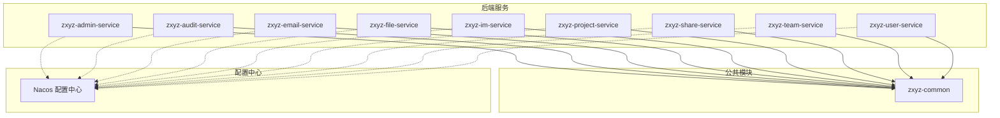
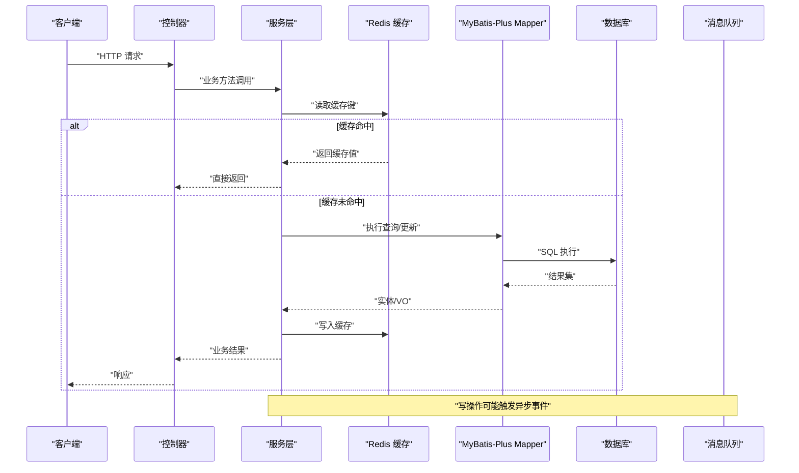
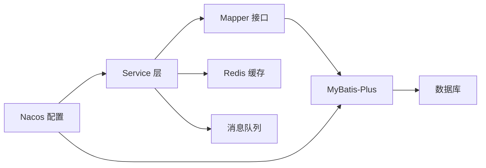

# 数据访问模式

<cite>
**本文引用的文件**   
- [pom.xml](file://ZXYZdatabaseBack/pom.xml)
- [application.yml](file://ZXYZdatabaseBack/zxyz-admin-service/src/main/resources/application.yml)
- [ConfigDataSourceConfig.java](file://ZXYZdatabaseBack/zxyz-admin-service/src/main/java/uno/acloud/admin/config/ConfigDataSourceConfig.java)
- [SysConfigMapper.java](file://ZXYZdatabaseBack/zxyz-admin-service/src/main/java/uno/acloud/admin/mapper/SysConfigMapper.java)
- [SysConfigAuditMapper.java](file://ZXYZdatabaseBack/zxyz-admin-service/src/main/java/uno/acloud/admin/mapper/SysConfigAuditMapper.java)
- [SysConfig.java](file://ZXYZdatabaseBack/zxyz-admin-service/src/main/java/uno/acloud/admin/domain/SysConfig.java)
- [SysConfigAudit.java](file://ZXYZdatabaseBack/zxyz-admin-service/src/main/java/uno/acloud/admin/domain/SysConfigAudit.java)
- [OperateLogMapper.java](file://ZXYZdatabaseBack/zxyz-audit-service/src/main/java/uno/acloud/audit/mapper/OperateLogMapper.java)
- [application.yml](file://ZXYZdatabaseBack/zxyz-email-service/src/main/resources/application.yml)
- [application.yml](file://ZXYZdatabaseBack/zxyz-file-service/src/main/resources/application.yml)
- [application.yml](file://ZXYZdatabaseBack/zxyz-im-service/src/main/resources/application.yml)
- [application.yml](file://ZXYZdatabaseBack/zxyz-project-service/src/main/resources/application.yml)
- [application.yml](file://ZXYZdatabaseBack/zxyz-share-service/src/main/resources/application.yml)
- [application.yml](file://ZXYZdatabaseBack/zxyz-team-service/src/main/resources/application.yml)
- [application.yml](file://ZXYZdatabaseBack/zxyz-user-service/src/main/resources/application.yml)
- [application-common.yml](file://ZXYZdatabaseBack/zxyz-common/src/main/resources/application-common.yml)
- [Nacos配置 zxyz-dynamic.yml](file://nacos-config/zxyz-dynamic.yml)
- [Nacos配置 zxyz-admin-service.yml](file://nacos-config/zxyz-admin-service.yml)
</cite>

## 目录
1. [简介](#简介)
2. [项目结构](#项目结构)
3. [核心组件](#核心组件)
4. [架构总览](#架构总览)
5. [详细组件分析](#详细组件分析)
6. [依赖关系分析](#依赖关系分析)
7. [性能考虑](#性能考虑)
8. [故障排查指南](#故障排查指南)
9. [结论](#结论)
10. [附录](#附录)

## 简介
本文件面向 ZXYZ 项目的后端数据访问层，系统性阐述基于 MyBatis-Plus 的标准化数据访问模式。内容覆盖：
- BaseMapper 扩展与条件构造器的规范用法
- CRUD 操作的实体映射、自动填充、逻辑删除与乐观锁
- 复杂查询（多表关联、动态条件、结果集投影）的实现模式
- 缓存策略（Redis 注解、失效策略、一致性保证）
- 事务管理（声明式、编程式、分布式事务）
- 查询性能优化（索引设计、SQL 优化、批量操作最佳实践）
- 常见数据访问模式与反模式的代码示例路径，帮助规避性能陷阱

## 项目结构
ZXYZ 采用微服务架构，后端由多个独立 Maven 模块组成，每个服务包含 controller → service → mapper → entity 的分层结构；部分服务（如 im-service、email-service）采用 DDD 分层。数据访问相关的关键位置包括：
- 各服务的 application.yml 中配置数据库连接、MyBatis-Plus 行为等
- common 模块提供通用配置与工具
- Nacos 集中管理动态配置（如数据源、分页插件、缓存开关等）

**图表来源** 
- [pom.xml](file://ZXYZdatabaseBack/pom.xml)
- [application.yml](file://ZXYZdatabaseBack/zxyz-admin-service/src/main/resources/application.yml)
- [application.yml](file://ZXYZdatabaseBack/zxyz-email-service/src/main/resources/application.yml)
- [application.yml](file://ZXYZdatabaseBack/zxyz-file-service/src/main/resources/application.yml)
- [application.yml](file://ZXYZdatabaseBack/zxyz-im-service/src/main/resources/application.yml)
- [application.yml](file://ZXYZdatabaseBack/zxyz-project-service/src/main/resources/application.yml)
- [application.yml](file://ZXYZdatabaseBack/zxyz-share-service/src/main/resources/application.yml)
- [application.yml](file://ZXYZdatabaseBack/zxyz-team-service/src/main/resources/application.yml)
- [application.yml](file://ZXYZdatabaseBack/zxyz-user-service/src/main/resources/application.yml)
- [application-common.yml](file://ZXYZdatabaseBack/zxyz-common/src/main/resources/application-common.yml)
- [Nacos配置 zxyz-dynamic.yml](file://nacos-config/zxyz-dynamic.yml)

**章节来源**
- [pom.xml](file://ZXYZdatabaseBack/pom.xml)
- [application.yml](file://ZXYZdatabaseBack/zxyz-admin-service/src/main/resources/application.yml)
- [application.yml](file://ZXYZdatabaseBack/zxyz-email-service/src/main/resources/application.yml)
- [application.yml](file://ZXYZdatabaseBack/zxyz-file-service/src/main/resources/application.yml)
- [application.yml](file://ZXYZdatabaseBack/zxyz-im-service/src/main/resources/application.yml)
- [application.yml](file://ZXYZdatabaseBack/zxyz-project-service/src/main/resources/application.yml)
- [application.yml](file://ZXYZdatabaseBack/zxyz-share-service/src/main/resources/application.yml)
- [application.yml](file://ZXYZdatabaseBack/zxyz-team-service/src/main/resources/application.yml)
- [application.yml](file://ZXYZdatabaseBack/zxyz-user-service/src/main/resources/application.yml)
- [application-common.yml](file://ZXYZdatabaseBack/zxyz-common/src/main/resources/application-common.yml)
- [Nacos配置 zxyz-dynamic.yml](file://nacos-config/zxyz-dynamic.yml)

## 核心组件
围绕数据访问的核心组件包括：
- 数据源与连接池：由各服务的 application.yml 或 Nacos 配置定义
- MyBatis-Plus 基础能力：BaseMapper 扩展、条件构造器、分页插件、自动填充、逻辑删除、乐观锁
- Mapper 接口：继承 BaseMapper 提供标准 CRUD，必要时自定义 SQL
- Entity 实体：字段与表结构映射，配合注解实现元数据行为
- Service 层：封装业务事务与调用链，协调缓存、MQ、外部服务

在本项目中，典型的数据访问入口位于各服务的 mapper 目录与 domain/entity 目录，例如：
- SysConfigMapper、SysConfigAuditMapper
- OperateLogMapper

这些 Mapper 均基于 MyBatis-Plus 的 BaseMapper，通过注解与配置驱动实现高效的数据访问。

**章节来源**
- [SysConfigMapper.java](file://ZXYZdatabaseBack/zxyz-admin-service/src/main/java/uno/acloud/admin/mapper/SysConfigMapper.java)
- [SysConfigAuditMapper.java](file://ZXYZdatabaseBack/zxyz-admin-service/src/main/java/uno/acloud/admin/mapper/SysConfigAuditMapper.java)
- [OperateLogMapper.java](file://ZXYZdatabaseBack/zxyz-audit-service/src/main/java/uno/acloud/audit/mapper/OperateLogMapper.java)
- [SysConfig.java](file://ZXYZdatabaseBack/zxyz-admin-service/src/main/java/uno/acloud/admin/domain/SysConfig.java)
- [SysConfigAudit.java](file://ZXYZdatabaseBack/zxyz-admin-service/src/main/java/uno/acloud/admin/domain/SysConfigAudit.java)

## 架构总览
下图展示数据访问在微服务中的整体交互：Controller 调用 Service，Service 通过 Mapper 访问数据库，必要时使用 Redis 缓存与 MQ 异步处理。Nacos 提供动态配置，统一控制数据源、分页、缓存等行为。

**图表来源** 
- [application.yml](file://ZXYZdatabaseBack/zxyz-admin-service/src/main/resources/application.yml)
- [application.yml](file://ZXYZdatabaseBack/zxyz-email-service/src/main/resources/application.yml)
- [application.yml](file://ZXYZdatabaseBack/zxyz-file-service/src/main/resources/application.yml)
- [application.yml](file://ZXYZdatabaseBack/zxyz-im-service/src/main/resources/application.yml)
- [application.yml](file://ZXYZdatabaseBack/zxyz-project-service/src/main/resources/application.yml)
- [application.yml](file://ZXYZdatabaseBack/zxyz-share-service/src/main/resources/application.yml)
- [application.yml](file://ZXYZdatabaseBack/zxyz-team-service/src/main/resources/application.yml)
- [application.yml](file://ZXYZdatabaseBack/zxyz-user-service/src/main/resources/application.yml)
- [application-common.yml](file://ZXYZdatabaseBack/zxyz-common/src/main/resources/application-common.yml)

## 详细组件分析

### MyBatis-Plus 基础与 BaseMapper 扩展
- BaseMapper 提供标准 CRUD（insert、selectById、updateById、deleteById 等），避免手写重复 SQL
- 条件构造器（QueryWrapper/LambdaQueryWrapper）用于构建动态查询条件，支持链式 API
- 分页插件（PaginationInnerInterceptor）结合 Page 对象实现高效分页
- 自动填充（MetaObjectHandler）统一设置创建时间、更新时间等元数据
- 逻辑删除（@TableLogic）将删除标记为状态字段而非物理删除
- 乐观锁（@Version）防止并发更新冲突

建议实践：
- 所有 Mapper 继承 BaseMapper，仅在复杂场景下补充自定义 XML SQL
- 优先使用 LambdaQueryWrapper 进行类型安全条件构建
- 分页查询必须传入 Page 对象，避免全量拉取

**章节来源**
- [SysConfigMapper.java](file://ZXYZdatabaseBack/zxyz-admin-service/src/main/java/uno/acloud/admin/mapper/SysConfigMapper.java)
- [SysConfigAuditMapper.java](file://ZXYZdatabaseBack/zxyz-admin-service/src/main/java/uno/acloud/admin/mapper/SysConfigAuditMapper.java)
- [OperateLogMapper.java](file://ZXYZdatabaseBack/zxyz-audit-service/src/main/java/uno/acloud/audit/mapper/OperateLogMapper.java)

### 实体映射与注解约定
- @TableName、@TableId、@TableField 用于表名、主键与字段映射
- @TableLogic 指定逻辑删除字段
- @Version 指定乐观锁版本字段
- 时间字段可通过 MetaObjectHandler 自动填充

建议实践：
- 实体类保持简洁，仅承载数据与映射注解
- 对敏感字段使用加密或脱敏策略
- 避免在实体中放置业务逻辑

**章节来源**
- [SysConfig.java](file://ZXYZdatabaseBack/zxyz-admin-service/src/main/java/uno/acloud/admin/domain/SysConfig.java)
- [SysConfigAudit.java](file://ZXYZdatabaseBack/zxyz-admin-service/src/main/java/uno/acloud/admin/domain/SysConfigAudit.java)

### 条件构造器与动态查询
- 使用 LambdaQueryWrapper 构建可维护的条件链
- 支持等值、范围、模糊匹配、排序、分组等
- 复杂条件可通过 if-else 动态拼接

建议实践：
- 避免在 Wrapper 中拼接字符串，优先使用类型安全的 Lambda
- 对高频查询建立合适的复合索引

**章节来源**
- [SysConfigMapper.java](file://ZXYZdatabaseBack/zxyz-admin-service/src/main/java/uno/acloud/admin/mapper/SysConfigMapper.java)
- [OperateLogMapper.java](file://ZXYZdatabaseBack/zxyz-audit-service/src/main/java/uno/acloud/audit/mapper/OperateLogMapper.java)

### 分页查询优化
- 使用 Page 对象与分页插件，限制单次返回条数
- 避免 select *，按需选择字段
- 对分页排序字段建立索引

建议实践：
- 列表接口默认分页，禁止无分页的全量查询
- 大数据量导出走异步任务与流式输出

**章节来源**
- [application.yml](file://ZXYZdatabaseBack/zxyz-admin-service/src/main/resources/application.yml)
- [application.yml](file://ZXYZdatabaseBack/zxyz-email-service/src/main/resources/application.yml)
- [application.yml](file://ZXYZdatabaseBack/zxyz-file-service/src/main/resources/application.yml)
- [application.yml](file://ZXYZdatabaseBack/zxyz-im-service/src/main/resources/application.yml)
- [application.yml](file://ZXYZdatabaseBack/zxyz-project-service/src/main/resources/application.yml)
- [application.yml](file://ZXYZdatabaseBack/zxyz-share-service/src/main/resources/application.yml)
- [application.yml](file://ZXYZdatabaseBack/zxyz-team-service/src/main/resources/application.yml)
- [application.yml](file://ZXYZdatabaseBack/zxyz-user-service/src/main/resources/application.yml)

### 自动填充、逻辑删除与乐观锁
- 自动填充：通过 MetaObjectHandler 统一注入 create_time、update_time、creator、updater 等
- 逻辑删除：@TableLogic 标记 deleted 字段，删除时更新状态而非物理删除
- 乐观锁：@Version 字段在并发更新时校验版本号，失败则重试或报错

建议实践：
- 所有需要审计的实体启用自动填充
- 逻辑删除需配合软删除查询条件
- 高并发更新场景启用乐观锁并处理失败分支

**章节来源**
- [SysConfig.java](file://ZXYZdatabaseBack/zxyz-admin-service/src/main/java/uno/acloud/admin/domain/SysConfig.java)
- [SysConfigAudit.java](file://ZXYZdatabaseBack/zxyz-admin-service/src/main/java/uno/acloud/admin/domain/SysConfigAudit.java)

### 复杂查询：多表关联、动态条件与结果集映射
- 多表关联：优先使用 JOIN SQL（XML 或 @SelectProvider），避免多次往返
- 动态条件：在服务层组装 QueryWrapper，或在 XML 中使用 <if> 动态拼接
- 结果集映射：使用 VO/DTO 投影，减少数据传输体积

建议实践：
- 复杂报表查询使用视图或物化视图
- 投影类与服务解耦，避免胖 DTO

**章节来源**
- [SysConfigMapper.java](file://ZXYZdatabaseBack/zxyz-admin-service/src/main/java/uno/acloud/admin/mapper/SysConfigMapper.java)
- [OperateLogMapper.java](file://ZXYZdatabaseBack/zxyz-audit-service/src/main/java/uno/acloud/audit/mapper/OperateLogMapper.java)

### 缓存策略：Redis 注解、失效与一致性
- 使用 Spring Cache + Redis 注解（@Cacheable、@CacheEvict、@CachePut）
- 合理设计缓存键（含租户/团队维度），避免键冲突
- 失效策略：写后失效、TTL 过期、热点数据预热
- 一致性：先更新数据库再删除缓存，或使用延迟双删

建议实践：
- 读多写少场景启用缓存
- 对热点配置使用本地缓存 + 远程缓存二级缓存

**章节来源**
- [application.yml](file://ZXYZdatabaseBack/zxyz-admin-service/src/main/resources/application.yml)
- [application.yml](file://ZXYZdatabaseBack/zxyz-email-service/src/main/resources/application.yml)
- [application.yml](file://ZXYZdatabaseBack/zxyz-file-service/src/main/resources/application.yml)
- [application.yml](file://ZXYZdatabaseBack/zxyz-im-service/src/main/resources/application.yml)
- [application.yml](file://ZXYZdatabaseBack/zxyz-project-service/src/main/resources/application.yml)
- [application.yml](file://ZXYZdatabaseBack/zxyz-share-service/src/main/resources/application.yml)
- [application.yml](file://ZXYZdatabaseBack/zxyz-team-service/src/main/resources/application.yml)
- [application.yml](file://ZXYZdatabaseBack/zxyz-user-service/src/main/resources/application.yml)
- [application-common.yml](file://ZXYZdatabaseBack/zxyz-common/src/main/resources/application-common.yml)

### 事务管理：声明式、编程式与分布式事务
- 声明式事务：@Transactional 标注在 Service 方法，按业务边界划分事务
- 编程式事务：TransactionTemplate 用于细粒度控制
- 分布式事务：跨服务调用建议使用 Saga/TCC 或最终一致性（MQ 补偿）

建议实践：
- 只读方法标注 readOnly=true
- 长事务拆分为短事务，避免锁竞争
- 跨服务写操作通过事件驱动保证最终一致

**章节来源**
- [application.yml](file://ZXYZdatabaseBack/zxyz-admin-service/src/main/resources/application.yml)
- [application.yml](file://ZXYZdatabaseBack/zxyz-email-service/src/main/resources/application.yml)
- [application.yml](file://ZXYZdatabaseBack/zxyz-file-service/src/main/resources/application.yml)
- [application.yml](file://ZXYZdatabaseBack/zxyz-im-service/src/main/resources/application.yml)
- [application.yml](file://ZXYZdatabaseBack/zxyz-project-service/src/main/resources/application.yml)
- [application.yml](file://ZXYZdatabaseBack/zxyz-share-service/src/main/resources/application.yml)
- [application.yml](file://ZXYZdatabaseBack/zxyz-team-service/src/main/resources/application.yml)
- [application.yml](file://ZXYZdatabaseBack/zxyz-user-service/src/main/resources/application.yml)

### 数据源与连接池配置
- 各服务通过 application.yml 或 Nacos 配置数据源 URL、用户名、密码、连接池大小等
- 推荐 HikariCP 作为连接池，调整最大连接数与超时参数
- 读写分离与分库分表需结合中间件或框架扩展

建议实践：
- 生产环境开启连接池监控与慢查询日志
- 根据 QPS 与平均响应时间调优连接池参数

**章节来源**
- [application.yml](file://ZXYZdatabaseBack/zxyz-admin-service/src/main/resources/application.yml)
- [application.yml](file://ZXYZdatabaseBack/zxyz-email-service/src/main/resources/application.yml)
- [application.yml](file://ZXYZdatabaseBack/zxyz-file-service/src/main/resources/application.yml)
- [application.yml](file://ZXYZdatabaseBack/zxyz-im-service/src/main/resources/application.yml)
- [application.yml](file://ZXYZdatabaseBack/zxyz-project-service/src/main/resources/application.yml)
- [application.yml](file://ZXYZdatabaseBack/zxyz-share-service/src/main/resources/application.yml)
- [application.yml](file://ZXYZdatabaseBack/zxyz-team-service/src/main/resources/application.yml)
- [application.yml](file://ZXYZdatabaseBack/zxyz-user-service/src/main/resources/application.yml)
- [application-common.yml](file://ZXYZdatabaseBack/zxyz-common/src/main/resources/application-common.yml)
- [Nacos配置 zxyz-dynamic.yml](file://nacos-config/zxyz-dynamic.yml)

### 批量操作最佳实践
- 批量插入：使用 insertBatch 或 JDBC batch，避免逐条提交
- 批量更新：使用 CASE WHEN 或临时表批量更新
- 批量删除：IN 条件限制数量，避免超大 IN 列表

建议实践：
- 分批提交（每批 500~1000 条），平衡内存与性能
- 对大事务拆分，降低锁持有时间

**章节来源**
- [SysConfigMapper.java](file://ZXYZdatabaseBack/zxyz-admin-service/src/main/java/uno/acloud/admin/mapper/SysConfigMapper.java)
- [OperateLogMapper.java](file://ZXYZdatabaseBack/zxyz-audit-service/src/main/java/uno/acloud/audit/mapper/OperateLogMapper.java)

## 依赖关系分析
数据访问层的依赖关系如下：
- Service 依赖 Mapper 与缓存组件
- Mapper 依赖 MyBatis-Plus 与数据库驱动
- 配置由 Nacos 统一管理，运行时注入

**图表来源** 
- [application.yml](file://ZXYZdatabaseBack/zxyz-admin-service/src/main/resources/application.yml)
- [application.yml](file://ZXYZdatabaseBack/zxyz-email-service/src/main/resources/application.yml)
- [application.yml](file://ZXYZdatabaseBack/zxyz-file-service/src/main/resources/application.yml)
- [application.yml](file://ZXYZdatabaseBack/zxyz-im-service/src/main/resources/application.yml)
- [application.yml](file://ZXYZdatabaseBack/zxyz-project-service/src/main/resources/application.yml)
- [application.yml](file://ZXYZdatabaseBack/zxyz-share-service/src/main/resources/application.yml)
- [application.yml](file://ZXYZdatabaseBack/zxyz-team-service/src/main/resources/application.yml)
- [application.yml](file://ZXYZdatabaseBack/zxyz-user-service/src/main/resources/application.yml)
- [application-common.yml](file://ZXYZdatabaseBack/zxyz-common/src/main/resources/application-common.yml)
- [Nacos配置 zxyz-dynamic.yml](file://nacos-config/zxyz-dynamic.yml)

**章节来源**
- [application.yml](file://ZXYZdatabaseBack/zxyz-admin-service/src/main/resources/application.yml)
- [application.yml](file://ZXYZdatabaseBack/zxyz-email-service/src/main/resources/application.yml)
- [application.yml](file://ZXYZdatabaseBack/zxyz-file-service/src/main/resources/application.yml)
- [application.yml](file://ZXYZdatabaseBack/zxyz-im-service/src/main/resources/application.yml)
- [application.yml](file://ZXYZdatabaseBack/zxyz-project-service/src/main/resources/application.yml)
- [application.yml](file://ZXYZdatabaseBack/zxyz-share-service/src/main/resources/application.yml)
- [application.yml](file://ZXYZdatabaseBack/zxyz-team-service/src/main/resources/application.yml)
- [application.yml](file://ZXYZdatabaseBack/zxyz-user-service/src/main/resources/application.yml)
- [application-common.yml](file://ZXYZdatabaseBack/zxyz-common/src/main/resources/application-common.yml)
- [Nacos配置 zxyz-dynamic.yml](file://nacos-config/zxyz-dynamic.yml)

## 性能考虑
- 索引设计：为高频查询条件与排序字段建立合适索引，避免回表
- SQL 优化：避免 select *，使用 EXPLAIN 分析执行计划，减少子查询
- 批量操作：合并小事务为大事务，减少网络往返
- 缓存命中率：热点数据缓存，合理 TTL 与键设计
- 连接池调优：根据负载调整最大连接数与超时

[本节为通用指导，不直接分析具体文件]

## 故障排查指南
常见问题与定位步骤：
- 连接池耗尽：检查连接泄漏、慢查询、连接池上限
- 缓存不一致：确认写后失效顺序，检查缓存键是否冲突
- 事务超时：拆分长事务，检查锁等待与死锁
- 分页异常：确认分页插件配置与排序字段索引
- 逻辑删除误用：确保查询条件包含 deleted 过滤

建议工具：
- 数据库慢查询日志与 EXPLAIN
- Redis 监控与键空间分析
- APM 链路追踪（SkyWalking/Pinpoint）

[本节为通用指导，不直接分析具体文件]

## 结论
ZXYZ 项目基于 MyBatis-Plus 构建了统一、高效的数据访问层。通过规范的 BaseMapper 扩展、条件构造器、分页插件、自动填充、逻辑删除与乐观锁机制，实现了标准化的 CRUD 与复杂查询。结合 Redis 缓存与 Nacos 动态配置，提升了系统性能与可运维性。遵循本文的最佳实践，可有效避免性能陷阱，保障系统的稳定性与可扩展性。

[本节为总结，不直接分析具体文件]

## 附录
- 参考配置路径：
  - 各服务 application.yml
  - common 模块 application-common.yml
  - Nacos 动态配置 zxyz-dynamic.yml
- 关键 Mapper 与实体：
  - SysConfigMapper、SysConfigAuditMapper、OperateLogMapper
  - SysConfig、SysConfigAudit

[本节为附录，不直接分析具体文件]