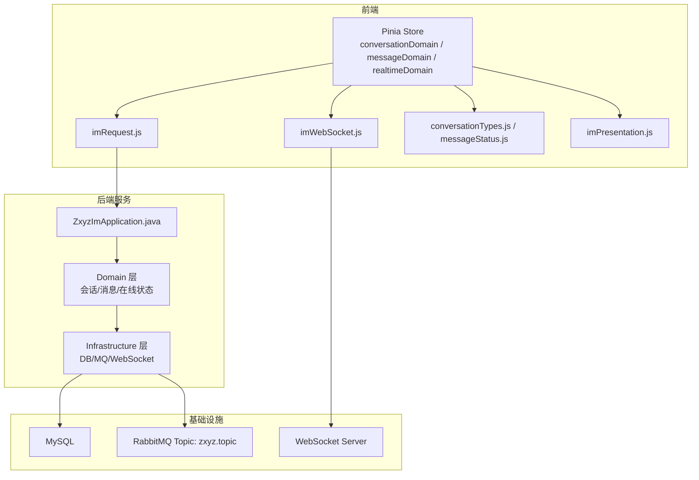
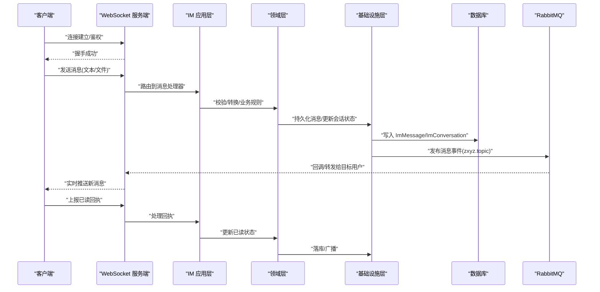
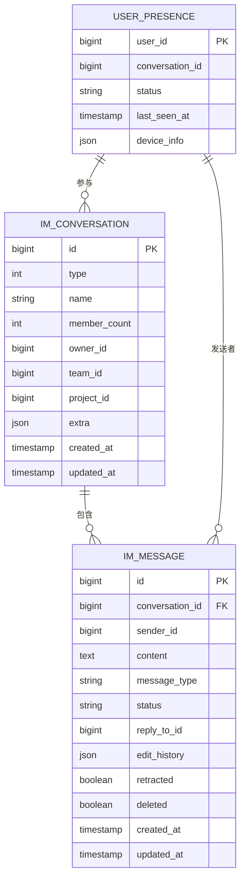
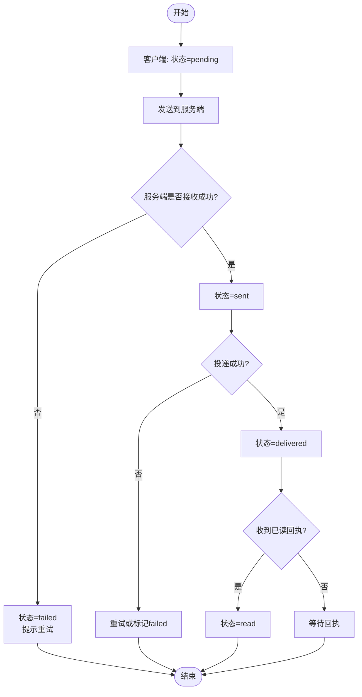
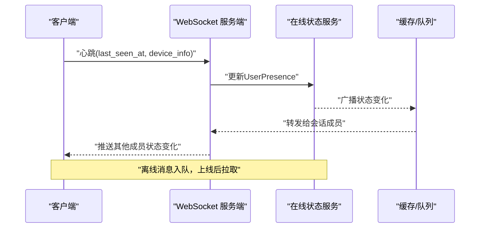
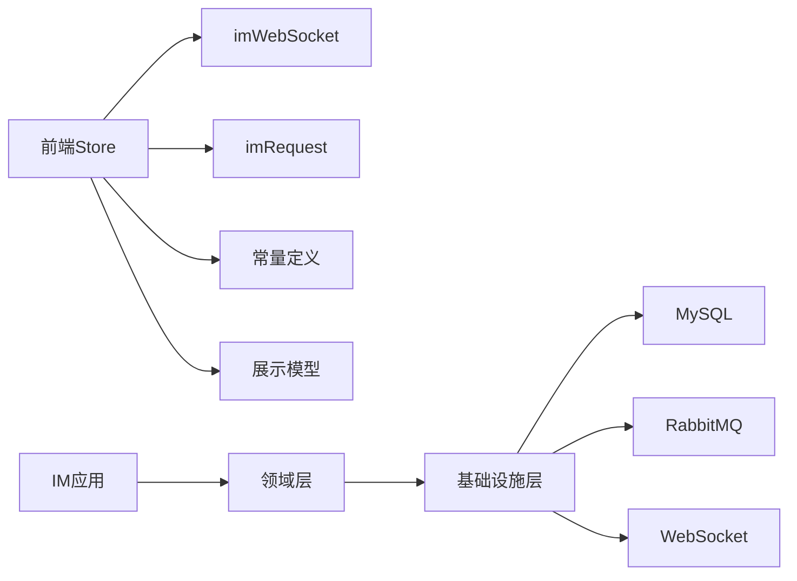

# 即时通讯实体模型

<cite>
**本文引用的文件**   
- [schema_im.sql](file://ZXYZdatabaseBack/sql/schema_im.sql)
- [zxyz-im-service/pom.xml](file://ZXYZdatabaseBack/zxyz-im-service/pom.xml)
- [ZxyzImApplication.java](file://ZXYZdatabaseBack/zxyz-im-service/src/main/java/uno/acloud/im/ZxyzImApplication.java)
- [conversationDomain.js](file://ZXYZdatabaseFront/src/store/im/conversationDomain.js)
- [messageDomain.js](file://ZXYZdatabaseFront/src/store/im/messageDomain.js)
- [realtimeDomain.js](file://ZXYZdatabaseFront/src/store/im/realtimeDomain.js)
- [imWebSocket.js](file://ZXYZdatabaseFront/src/utils/imWebSocket.js)
- [imRequest.js](file://ZXYZdatabaseFront/src/utils/imRequest.js)
- [constants/conversationTypes.js](file://ZXYZdatabaseFront/src/constants/conversationTypes.js)
- [constants/messageStatus.js](file://ZXYZdatabaseFront/src/constants/messageStatus.js)
- [models/imPresentation.js](file://ZXYZdatabaseFront/src/models/imPresentation.js)
- [composables/useChatMessageModel.js](file://ZXYZdatabaseFront/src/views/chat/composables/useChatMessageModel.js)
- [api-contract.md](file://docs/api-contract.md)
</cite>

## 目录
1. [简介](#简介)
2. [项目结构](#项目结构)
3. [核心组件](#核心组件)
4. [架构总览](#架构总览)
5. [详细组件分析](#详细组件分析)
6. [依赖关系分析](#依赖关系分析)
7. [性能考量](#性能考量)
8. [故障排查指南](#故障排查指南)
9. [结论](#结论)
10. [附录](#附录)

## 简介
本文件面向 ZXYZ 项目的即时通讯（IM）子系统，聚焦三大核心实体：会话 ImConversation、消息 ImMessage、用户在线状态 UserPresence。文档从数据库设计、前后端领域模型、消息流转与持久化机制、在线状态同步、安全合规等方面进行全面说明，并给出 ER 图与消息流转时序图，帮助读者快速理解 IM 实体的数据结构与运行方式。

## 项目结构
IM 功能由后端 zxyz-im-service 与前端 Vue 应用共同实现：
- 后端采用 DDD 分层（interfaces → application → domain → infrastructure），提供 REST 内部接口与 WebSocket 实时通道。
- 前端使用 Pinia store（conversationDomain、messageDomain、realtimeDomain）管理会话、消息与在线状态，通过 imWebSocket 与 imRequest 分别处理实时与请求式交互。
- 数据库 schema 定义在 sql/schema_im.sql，包含会话、消息、成员关系、已读未读等表结构。

**图表来源** 
- [ZxyzImApplication.java](file://ZXYZdatabaseBack/zxyz-im-service/src/main/java/uno/acloud/im/ZxyzImApplication.java)
- [conversationDomain.js](file://ZXYZdatabaseFront/src/store/im/conversationDomain.js)
- [messageDomain.js](file://ZXYZdatabaseFront/src/store/im/messageDomain.js)
- [realtimeDomain.js](file://ZXYZdatabaseFront/src/store/im/realtimeDomain.js)
- [imWebSocket.js](file://ZXYZdatabaseFront/src/utils/imWebSocket.js)
- [imRequest.js](file://ZXYZdatabaseFront/src/utils/imRequest.js)
- [constants/conversationTypes.js](file://ZXYZdatabaseFront/src/constants/conversationTypes.js)
- [constants/messageStatus.js](file://ZXYZdatabaseFront/src/constants/messageStatus.js)
- [models/imPresentation.js](file://ZXYZdatabaseFront/src/models/imPresentation.js)

**章节来源**
- [schema_im.sql](file://ZXYZdatabaseBack/sql/schema_im.sql)
- [zxyz-im-service/pom.xml](file://ZXYZdatabaseBack/zxyz-im-service/pom.xml)
- [ZxyzImApplication.java](file://ZXYZdatabaseBack/zxyz-im-service/src/main/java/uno/acloud/im/ZxyzImApplication.java)

## 核心组件
- 会话 ImConversation：表示一个聊天会话，支持单聊、群聊、项目讨论组、系统通知等类型；字段包括 id、type、name、member_count、owner_id、team_id、project_id、extra（扩展 JSON）、created_at、updated_at。
- 消息 ImMessage：表示一条聊天消息，字段包括 id、conversation_id、sender_id、content、message_type、status、reply_to_id、edit_history、retracted、deleted、created_at、updated_at。
- 用户在线状态 UserPresence：表示用户在某会话或全局的在线状态，字段包括 user_id、conversation_id（可选）、status、last_seen_at、device_info（JSON）。

会话类型设计要点：
- 单聊：type=1，通常有 partner_id 或 member_count=2，无 team/project 关联。
- 群聊：type=2，member_count≥3，可关联 team_id。
- 项目讨论组：type=3，关联 project_id，用于项目内协作沟通。
- 系统通知：type=4，sender_id 为系统用户，常用于公告、审计事件推送。

消息内容字段说明：
- content：文本或富媒体摘要（实际附件走文件服务），支持 Markdown 片段。
- message_type：text、image、file、mention、system 等。
- status：pending/sent/delivered/read/failed 等，用于状态机推进。
- reply_to_id：回复引用。
- edit_history：编辑历史快照数组。
- retracted/deleted：撤回与删除标记。

在线状态字段说明：
- status：online/offline/away/busy 等。
- last_seen_at：最近心跳时间戳。
- device_info：设备标识、客户端版本等。

**章节来源**
- [schema_im.sql](file://ZXYZdatabaseBack/sql/schema_im.sql)
- [constants/conversationTypes.js](file://ZXYZdatabaseFront/src/constants/conversationTypes.js)
- [constants/messageStatus.js](file://ZXYZdatabaseFront/src/constants/messageStatus.js)
- [models/imPresentation.js](file://ZXYZdatabaseFront/src/models/imPresentation.js)

## 架构总览
IM 子系统采用“REST + WebSocket”混合通信模式：
- REST：用于会话创建、成员管理、历史消息拉取、状态查询等。
- WebSocket：用于消息实时推送、在线状态广播、已读回执上报。
- 异步：通过 RabbitMQ Topic Exchange zxyz.topic 进行跨服务事件分发（如用户下线、审计日志）。

**图表来源** 
- [ZxyzImApplication.java](file://ZXYZdatabaseBack/zxyz-im-service/src/main/java/uno/acloud/im/ZxyzImApplication.java)
- [imWebSocket.js](file://ZXYZdatabaseFront/src/utils/imWebSocket.js)
- [imRequest.js](file://ZXYZdatabaseFront/src/utils/imRequest.js)
- [realtimeDomain.js](file://ZXYZdatabaseFront/src/store/im/realtimeDomain.js)

## 详细组件分析

### 实体 ER 图

**图表来源** 
- [schema_im.sql](file://ZXYZdatabaseBack/sql/schema_im.sql)

**章节来源**
- [schema_im.sql](file://ZXYZdatabaseBack/sql/schema_im.sql)

### 会话类型与特殊字段
- 单聊：type=1，member_count=2，partner_id 可由成员关系推导。
- 群聊：type=2，member_count≥3，team_id 非空，支持群设置（禁言、邀请审核等）放入 extra。
- 项目讨论组：type=3，project_id 非空，权限与项目角色联动。
- 系统通知：type=4，sender_id 固定为系统用户，message_type=system，不要求接收方在线。

处理逻辑要点：
- 创建会话时根据 type 校验必填字段（如 project_id/team_id）。
- 成员变更触发 member_count 更新与权限检查。
- 系统通知类消息跳过在线检查，直接入队持久化。

**章节来源**
- [constants/conversationTypes.js](file://ZXYZdatabaseFront/src/constants/conversationTypes.js)
- [schema_im.sql](file://ZXYZdatabaseBack/sql/schema_im.sql)

### 消息持久化与状态机
消息状态机：
- pending：客户端本地待发送。
- sent：服务端已接收但未投递。
- delivered：已投递至目标设备。
- read：对方已读。
- failed：发送失败（网络/权限/内容违规）。

持久化流程：
- 客户端发送消息后，立即落库本地状态为 pending。
- 服务端接收后更新为 sent，并尝试投递。
- 投递成功后更新为 delivered，收到已读回执后更新为 read。
- 失败回退为 failed，并允许重试。

撤回与编辑：
- 撤回：将 retracted=true，原内容保留但不可见，记录撤回时间。
- 编辑：追加 edit_history 快照，当前 content 替换为新值。

**图表来源** 
- [constants/messageStatus.js](file://ZXYZdatabaseFront/src/constants/messageStatus.js)
- [messageDomain.js](file://ZXYZdatabaseFront/src/store/im/messageDomain.js)
- [useChatMessageModel.js](file://ZXYZdatabaseFront/src/views/chat/composables/useChatMessageModel.js)

**章节来源**
- [constants/messageStatus.js](file://ZXYZdatabaseFront/src/constants/messageStatus.js)
- [messageDomain.js](file://ZXYZdatabaseFront/src/store/im/messageDomain.js)
- [useChatMessageModel.js](file://ZXYZdatabaseFront/src/views/chat/composables/useChatMessageModel.js)

### 在线状态同步与心跳检测
- 心跳：客户端定时发送心跳（含 last_seen_at、device_info），服务端更新 UserPresence。
- 状态广播：当用户上线/离线/状态变化时，向相关会话成员广播。
- 离线消息：若目标用户离线，消息进入队列，待上线后拉取。

**图表来源** 
- [realtimeDomain.js](file://ZXYZdatabaseFront/src/store/im/realtimeDomain.js)
- [imWebSocket.js](file://ZXYZdatabaseFront/src/utils/imWebSocket.js)

**章节来源**
- [realtimeDomain.js](file://ZXYZdatabaseFront/src/store/im/realtimeDomain.js)
- [imWebSocket.js](file://ZXYZdatabaseFront/src/utils/imWebSocket.js)

### 安全与合规
- 消息加密：传输层 TLS，敏感内容可在应用层加密（如端到端加密选项）。
- 敏感词过滤：在服务端对 content 进行正则/词典匹配，命中则拦截或打码。
- 合规性检查：结合审计服务记录操作日志，支持内容审计与回溯。

**章节来源**
- [api-contract.md](file://docs/api-contract.md)
- [schema_im.sql](file://ZXYZdatabaseBack/sql/schema_im.sql)

## 依赖关系分析
- 前端依赖：
  - Pinia store（conversationDomain、messageDomain、realtimeDomain）负责数据归一化与状态同步。
  - imWebSocket 处理实时事件，imRequest 处理 REST 调用。
  - constants 定义会话类型与消息状态枚举。
- 后端依赖：
  - ZxyzImApplication 作为入口，暴露内部 REST 与 WebSocket。
  - Domain 层封装会话/消息/在线状态的领域逻辑。
  - Infrastructure 层对接 MySQL、RabbitMQ、WebSocket。

**图表来源** 
- [conversationDomain.js](file://ZXYZdatabaseFront/src/store/im/conversationDomain.js)
- [messageDomain.js](file://ZXYZdatabaseFront/src/store/im/messageDomain.js)
- [realtimeDomain.js](file://ZXYZdatabaseFront/src/store/im/realtimeDomain.js)
- [imWebSocket.js](file://ZXYZdatabaseFront/src/utils/imWebSocket.js)
- [imRequest.js](file://ZXYZdatabaseFront/src/utils/imRequest.js)
- [constants/conversationTypes.js](file://ZXYZdatabaseFront/src/constants/conversationTypes.js)
- [constants/messageStatus.js](file://ZXYZdatabaseFront/src/constants/messageStatus.js)
- [models/imPresentation.js](file://ZXYZdatabaseFront/src/models/imPresentation.js)
- [ZxyzImApplication.java](file://ZXYZdatabaseBack/zxyz-im-service/src/main/java/uno/acloud/im/ZxyzImApplication.java)

**章节来源**
- [zxyz-im-service/pom.xml](file://ZXYZdatabaseBack/zxyz-im-service/pom.xml)
- [ZxyzImApplication.java](file://ZXYZdatabaseBack/zxyz-im-service/src/main/java/uno/acloud/im/ZxyzImApplication.java)

## 性能考量
- 分页与虚拟滚动：前端使用 VirtualMessageList 优化长列表渲染。
- 索引策略：conversation_id、sender_id、created_at 建索引加速查询。
- 批量写入：消息入库采用批量插入减少 IO。
- 缓存热点：会话元数据与成员列表缓存，降低 DB 压力。
- 异步解耦：通过 RabbitMQ 削峰填谷，避免同步阻塞。

[本节为通用指导，无需特定文件来源]

## 故障排查指南
- 消息未送达：检查 WebSocket 连接状态、MQ 消费日志、用户在线状态。
- 已读回执丢失：确认回执上报路径与状态更新事务一致性。
- 会话成员不同步：检查成员变更事件是否发布与订阅。
- 内容违规：查看敏感词过滤日志与审计记录。

**章节来源**
- [api-contract.md](file://docs/api-contract.md)
- [schema_im.sql](file://ZXYZdatabaseBack/sql/schema_im.sql)

## 结论
ZXYZ 的 IM 实体模型以 ImConversation、ImMessage、UserPresence 为核心，通过 REST 与 WebSocket 协同、RabbitMQ 异步解耦，实现了高可靠、可扩展的即时通讯能力。清晰的会话类型划分、完善的消息状态机与在线状态同步机制，为多场景协作提供了坚实基础。建议在生产环境持续监控关键指标（延迟、吞吐、错误率），并结合审计与合规策略保障数据安全。

[本节为总结，无需特定文件来源]

## 附录
- 术语表：会话、消息、在线状态、心跳、回执、撤回、编辑历史。
- 参考文档：API 契约、部署说明、架构文档。

[本节为补充信息，无需特定文件来源]