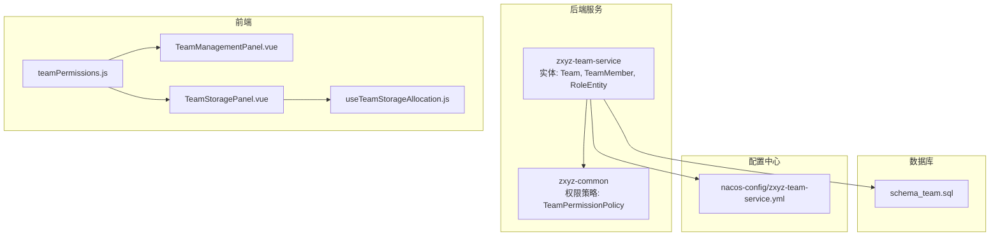
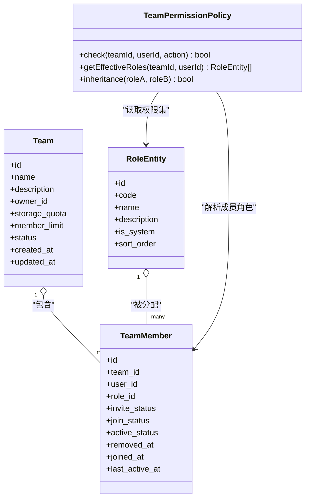
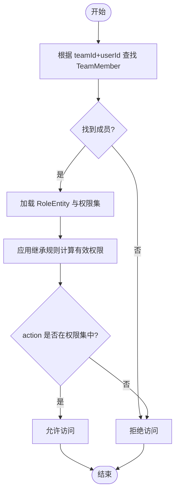
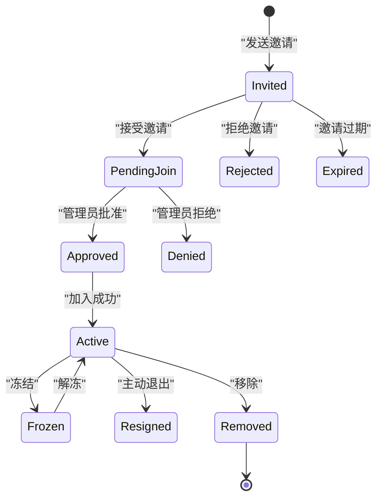
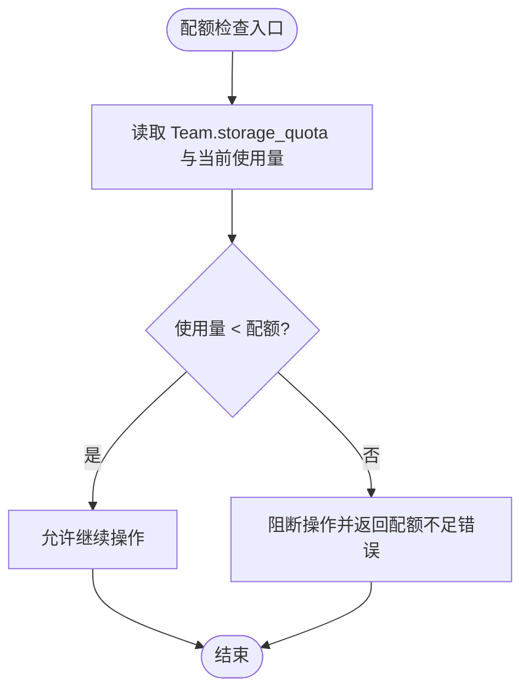
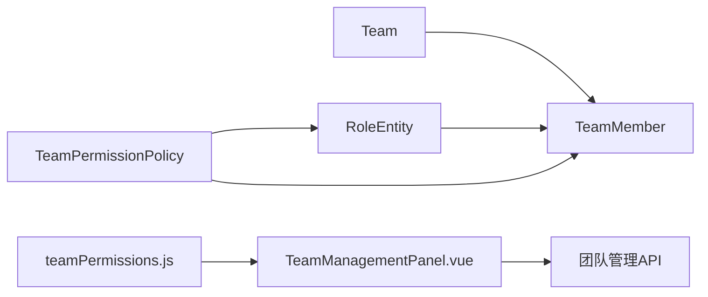
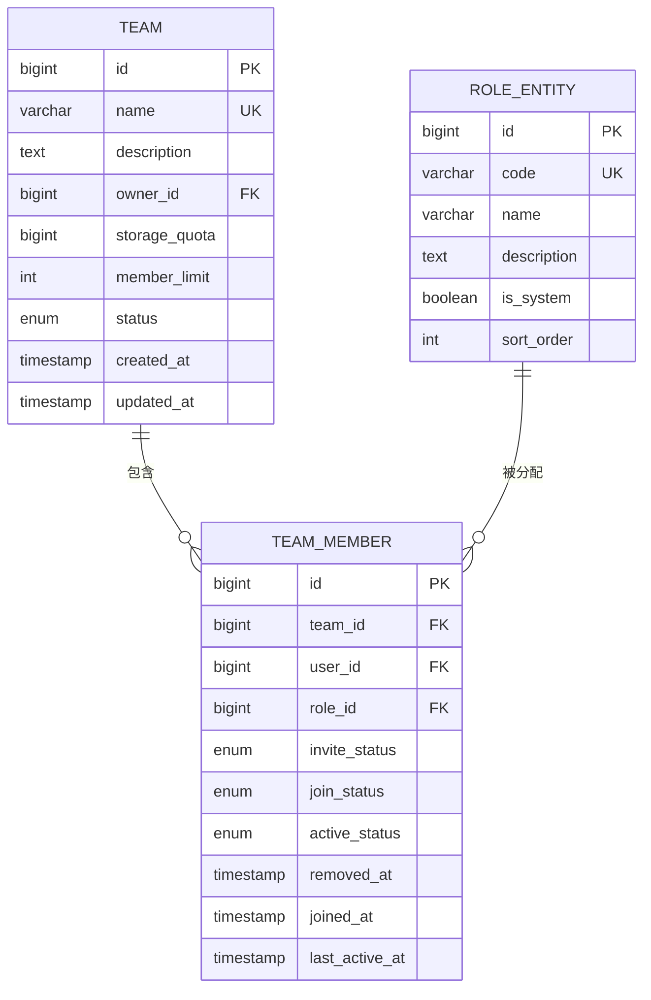

# 团队实体模型

<cite>
**本文引用的文件**   
- [ZXYZdatabaseBack/ZXYZdatabaseBack/zxyz-team-service/src/main/java/uno/acloud/team/entity/Team.java](file://ZXYZdatabaseBack/zxyz-team-service/src/main/java/uno/acloud/team/entity/Team.java)
- [ZXYZdatabaseBack/ZXYZdatabaseBack/zxyz-team-service/src/main/java/uno/acloud/team/entity/TeamMember.java](file://ZXYZdatabaseBack/zxyz-team-service/src/main/java/uno/acloud/team/entity/TeamMember.java)
- [ZXYZdatabaseBack/ZXYZdatabaseBack/zxyz-team-service/src/main/java/uno/acloud/team/entity/RoleEntity.java](file://ZXYZdatabaseBack/zxyz-team-service/src/main/java/uno/acloud/team/entity/RoleEntity.java)
- [ZXYZdatabaseBack/ZXYZdatabaseBack/ZXYZdatabaseBack/sql/schema_team.sql](file://ZXYZdatabaseBack/ZXYZdatabaseBack/sql/schema_team.sql)
- [ZXYZdatabaseBack/ZXYZdatabaseBack/zxyz-common/src/main/java/uno/acloud/common/permission/TeamPermissionPolicy.java](file://ZXYZdatabaseBack/ZXYZdatabaseBack/zxyz-common/src/main/java/uno/acloud/common/permission/TeamPermissionPolicy.java)
- [ZXYZdatabaseBack/ZXYZdatabaseBack/zxyz-common/src/test/java/uno/acloud/common/TeamPermissionPolicyTest.java](file://ZXYZdatabaseBack/ZXYZdatabaseBack/zxyz-common/src/test/java/uno/acloud/common/TeamPermissionPolicyTest.java)
- [ZXYZdatabaseBack/ZXYZdatabaseBack/nacos-config/zxyz-team-service.yml](file://ZXYZdatabaseBack/ZXYZdatabaseBack/nacos-config/zxyz-team-service.yml)
- [ZXYZdatabaseFront/ZXYZdatabaseFront/src/constants/teamPermissions.js](file://ZXYZdatabaseFront/ZXYZdatabaseFront/src/constants/teamPermissions.js)
- [ZXYZdatabaseFront/ZXYZdatabaseFront/src/components/team-settings/TeamManagementPanel.vue](file://ZXYZdatabaseFront/ZXYZdatabaseFront/src/components/team-settings/TeamManagementPanel.vue)
- [ZXYZdatabaseFront/ZXYZdatabaseFront/src/components/team-settings/TeamStoragePanel.vue](file://ZXYZdatabaseFront/ZXYZdatabaseFront/src/components/team-settings/TeamStoragePanel.vue)
- [ZXYZdatabaseFront/ZXYZdatabaseFront/src/composables/team/useTeamStorageAllocation.js](file://ZXYZdatabaseFront/ZXYZdatabaseFront/src/composables/team/useTeamStorageAllocation.js)
</cite>

## 目录
1. [简介](#简介)
2. [项目结构](#项目结构)
3. [核心组件](#核心组件)
4. [架构总览](#架构总览)
5. [详细组件分析](#详细组件分析)
6. [依赖关系分析](#依赖关系分析)
7. [性能考量](#性能考量)
8. [故障排查指南](#故障排查指南)
9. [结论](#结论)
10. [附录](#附录)

## 简介
本文件面向 ZXYZ 项目的“团队”领域，系统性阐述 Team、TeamMember、RoleEntity 等核心实体的数据结构设计、RBAC 权限模型在团队层面的实现、成员状态生命周期、配额与资源监控策略，以及完整性约束、权限验证规则与审计追踪要求。文档同时提供 ER 图与权限关系矩阵，帮助研发与运维快速理解并正确扩展团队能力。

## 项目结构
围绕团队能力的代码主要分布在以下位置：
- 后端实体与持久化定义：zxyz-team-service 的 entity 包与 SQL schema
- 权限策略与测试：zxyz-common 的 permission 包及单元测试
- 前端常量与页面：constants 与 team-settings 组件、composables
- 配置中心：nacos 中 zxyz-team-service 的配置项

图表来源
- [ZXYZdatabaseBack/ZXYZdatabaseBack/zxyz-team-service/src/main/java/uno/acloud/team/entity/Team.java](file://ZXYZdatabaseBack/ZXYZdatabaseBack/zxyz-team-service/src/main/java/uno/acloud/team/entity/Team.java)
- [ZXYZdatabaseBack/ZXYZdatabaseBack/zxyz-team-service/src/main/java/uno/acloud/team/entity/TeamMember.java](file://ZXYZdatabaseBack/ZXYZdatabaseBack/zxyz-team-service/src/main/java/uno/acloud/team/entity/TeamMember.java)
- [ZXYZdatabaseBack/ZXYZdatabaseBack/zxyz-team-service/src/main/java/uno/acloud/team/entity/RoleEntity.java](file://ZXYZdatabaseBack/ZXYZdatabaseBack/zxyz-team-service/src/main/java/uno/acloud/team/entity/RoleEntity.java)
- [ZXYZdatabaseBack/ZXYZdatabaseBack/ZXYZdatabaseBack/sql/schema_team.sql](file://ZXYZdatabaseBack/ZXYZdatabaseBack/sql/schema_team.sql)
- [ZXYZdatabaseBack/ZXYZdatabaseBack/zxyz-common/src/main/java/uno/acloud/common/permission/TeamPermissionPolicy.java](file://ZXYZdatabaseBack/ZXYZdatabaseBack/zxyz-common/src/main/java/uno/acloud/common/permission/TeamPermissionPolicy.java)
- [ZXYZdatabaseFront/ZXYZdatabaseFront/src/constants/teamPermissions.js](file://ZXYZdatabaseFront/ZXYZdatabaseFront/src/constants/teamPermissions.js)
- [ZXYZdatabaseFront/ZXYZdatabaseFront/src/components/team-settings/TeamManagementPanel.vue](file://ZXYZdatabaseFront/ZXYZdatabaseFront/src/components/team-settings/TeamManagementPanel.vue)
- [ZXYZdatabaseFront/ZXYZdatabaseFront/src/components/team-settings/TeamStoragePanel.vue](file://ZXYZdatabaseFront/ZXYZdatabaseFront/src/components/team-settings/TeamStoragePanel.vue)
- [ZXYZdatabaseFront/ZXYZdatabaseFront/src/composables/team/useTeamStorageAllocation.js](file://ZXYZdatabaseFront/ZXYZdatabaseFront/src/composables/team/useTeamStorageAllocation.js)
- [ZXYZdatabaseBack/ZXYZdatabaseBack/nacos-config/zxyz-team-service.yml](file://ZXYZdatabaseBack/ZXYZdatabaseBack/nacos-config/zxyz-team-service.yml)

章节来源
- [ZXYZdatabaseBack/ZXYZdatabaseBack/sql/schema_team.sql](file://ZXYZdatabaseBack/ZXYZdatabaseBack/sql/schema_team.sql)
- [ZXYZdatabaseBack/ZXYZdatabaseBack/zxyz-team-service/src/main/java/uno/acloud/team/entity/Team.java](file://ZXYZdatabaseBack/ZXYZdatabaseBack/zxyz-team-service/src/main/java/uno/acloud/team/entity/Team.java)
- [ZXYZdatabaseBack/ZXYZdatabaseBack/zxyz-team-service/src/main/java/uno/acloud/team/entity/TeamMember.java](file://ZXYZdatabaseBack/ZXYZdatabaseBack/zxyz-team-service/src/main/java/uno/acloud/team/entity/TeamMember.java)
- [ZXYZdatabaseBack/ZXYZdatabaseBack/zxyz-team-service/src/main/java/uno/acloud/team/entity/RoleEntity.java](file://ZXYZdatabaseBack/ZXYZdatabaseBack/zxyz-team-service/src/main/java/uno/acloud/team/entity/RoleEntity.java)

## 核心组件
本节聚焦团队域的核心数据模型与权限策略，涵盖字段说明、关系建模与权限判定逻辑。

- Team（团队）
  - 基本信息：id、name、description、owner_id、创建时间、更新时间、状态等
  - 配额与限额：存储空间上限、成员数量上限、已用量统计等
  - 关联关系：拥有者用户、成员集合、角色定义

- TeamMember（团队成员）
  - 成员绑定：team_id、user_id、role_id
  - 成员状态：邀请状态、加入状态、活跃状态、移除状态等
  - 审计信息：加入时间、最后活跃时间、操作人等

- RoleEntity（角色）
  - 角色元数据：id、code、name、description、是否系统内置、排序等
  - 权限集合：与权限点（如读/写/管理）的关系
  - 继承关系：支持角色层级或权限合并

- RBAC 权限策略（TeamPermissionPolicy）
  - 基于角色的访问控制：通过角色-权限映射决定成员对团队的读写与管理能力
  - 权限继承：父角色权限可被子角色继承或覆盖
  - 校验入口：统一在策略类中进行团队级权限判定

章节来源
- [ZXYZdatabaseBack/ZXYZdatabaseBack/zxyz-team-service/src/main/java/uno/acloud/team/entity/Team.java](file://ZXYZdatabaseBack/ZXYZdatabaseBack/zxyz-team-service/src/main/java/uno/acloud/team/entity/Team.java)
- [ZXYZdatabaseBack/ZXYZdatabaseBack/zxyz-team-service/src/main/java/uno/acloud/team/entity/TeamMember.java](file://ZXYZdatabaseBack/ZXYZdatabaseBack/zxyz-team-service/src/main/java/uno/acloud/team/entity/TeamMember.java)
- [ZXYZdatabaseBack/ZXYZdatabaseBack/zxyz-team-service/src/main/java/uno/acloud/team/entity/RoleEntity.java](file://ZXYZdatabaseBack/ZXYZdatabaseBack/zxyz-team-service/src/main/java/uno/acloud/team/entity/RoleEntity.java)
- [ZXYZdatabaseBack/ZXYZdatabaseBack/zxyz-common/src/main/java/uno/acloud/common/permission/TeamPermissionPolicy.java](file://ZXYZdatabaseBack/ZXYZdatabaseBack/zxyz-common/src/main/java/uno/acloud/common/permission/TeamPermissionPolicy.java)

## 架构总览
下图展示团队实体与权限策略、数据库、前后端之间的交互关系。

图表来源
- [ZXYZdatabaseBack/ZXYZdatabaseBack/zxyz-team-service/src/main/java/uno/acloud/team/entity/Team.java](file://ZXYZdatabaseBack/ZXYZdatabaseBack/zxyz-team-service/src/main/java/uno/acloud/team/entity/Team.java)
- [ZXYZdatabaseBack/ZXYZdatabaseBack/zxyz-team-service/src/main/java/uno/acloud/team/entity/TeamMember.java](file://ZXYZdatabaseBack/ZXYZdatabaseBack/zxyz-team-service/src/main/java/uno/acloud/team/entity/TeamMember.java)
- [ZXYZdatabaseBack/ZXYZdatabaseBack/zxyz-team-service/src/main/java/uno/acloud/team/entity/RoleEntity.java](file://ZXYZdatabaseBack/ZXYZdatabaseBack/zxyz-team-service/src/main/java/uno/acloud/team/entity/RoleEntity.java)
- [ZXYZdatabaseBack/ZXYZdatabaseBack/zxyz-common/src/main/java/uno/acloud/common/permission/TeamPermissionPolicy.java](file://ZXYZdatabaseBack/ZXYZdatabaseBack/zxyz-common/src/main/java/uno/acloud/common/permission/TeamPermissionPolicy.java)

## 详细组件分析

### Team 实体
- 字段设计
  - id：主键，唯一标识团队
  - name：团队名称，需唯一性约束
  - description：团队描述，可选
  - owner_id：团队拥有者用户ID，外键关联用户表
  - storage_quota：存储空间配额（字节），默认值与最小值校验
  - member_limit：成员数量上限，默认值与最小值校验
  - status：团队状态（启用/禁用/归档）
  - created_at/updated_at：审计时间戳
- 约束与校验
  - 唯一性：name 唯一
  - 非空：id、name、owner_id
  - 范围：storage_quota > 0；member_limit >= 1
- 业务含义
  - 作为资源隔离边界，所有存储、IM、项目等资源均归属某团队
  - 配额用于限制团队整体资源使用，触发告警与限流

章节来源
- [ZXYZdatabaseBack/ZXYZdatabaseBack/sql/schema_team.sql](file://ZXYZdatabaseBack/ZXYZdatabaseBack/sql/schema_team.sql)
- [ZXYZdatabaseBack/ZXYZdatabaseBack/zxyz-team-service/src/main/java/uno/acloud/team/entity/Team.java](file://ZXYZdatabaseBack/ZXYZdatabaseBack/zxyz-team-service/src/main/java/uno/acloud/team/entity/Team.java)

### TeamMember 实体
- 字段设计
  - id：主键
  - team_id：所属团队ID，外键
  - user_id：成员用户ID，外键
  - role_id：角色ID，外键
  - invite_status：邀请状态（待接受/已拒绝/已过期）
  - join_status：加入状态（申请中/已批准/已拒绝）
  - active_status：活跃状态（正常/冻结/离职）
  - removed_at：移除时间（软删除标记）
  - joined_at/last_active_at：加入时间与最后活跃时间
- 约束与校验
  - 唯一性：(team_id, user_id) 唯一
  - 非空：team_id、user_id、role_id
  - 状态机：邀请→加入→活跃→移除，禁止逆向跳转
- 业务含义
  - 承载成员与角色的绑定关系，是权限判定的关键中间层
  - 支持邀请流程与审批流程的状态流转

章节来源
- [ZXYZdatabaseBack/ZXYZdatabaseBack/sql/schema_team.sql](file://ZXYZdatabaseBack/ZXYZdatabaseBack/sql/schema_team.sql)
- [ZXYZdatabaseBack/ZXYZdatabaseBack/zxyz-team-service/src/main/java/uno/acloud/team/entity/TeamMember.java](file://ZXYZdatabaseBack/ZXYZdatabaseBack/zxyz-team-service/src/main/java/uno/acloud/team/entity/TeamMember.java)

### RoleEntity 实体
- 字段设计
  - id：主键
  - code：角色编码（如 admin/editor/viewer）
  - name：角色名称
  - description：角色描述
  - is_system：是否系统内置角色
  - sort_order：排序权重
- 约束与校验
  - 唯一性：code 唯一
  - 非空：code、name
- 业务含义
  - 抽象权限集合，便于跨团队复用
  - 支持继承关系，子角色可继承父角色权限

章节来源
- [ZXYZdatabaseBack/ZXYZdatabaseBack/sql/schema_team.sql](file://ZXYZdatabaseBack/ZXYZdatabaseBack/sql/schema_team.sql)
- [ZXYZdatabaseBack/ZXYZdatabaseBack/zxyz-team-service/src/main/java/uno/acloud/team/entity/RoleEntity.java](file://ZXYZdatabaseBack/ZXYZdatabaseBack/zxyz-team-service/src/main/java/uno/acloud/team/entity/RoleEntity.java)

### RBAC 权限模型（团队层面）
- 角色定义与权限点
  - 常见权限点：read、write、manage、delete、transfer_owner
  - 角色与权限点的映射由策略类维护
- 权限分配与继承
  - 成员通过 TeamMember.role_id 获得角色
  - 继承机制：父角色权限自动授予子角色，除非显式覆盖
- 权限判定流程
  - 输入：teamId、userId、action
  - 步骤：定位成员 → 获取角色 → 计算有效权限集 → 判断 action 是否在权限集中
- 前端权限常量
  - teamPermissions.js 定义权限点常量，供前端按钮与路由守卫使用

图表来源
- [ZXYZdatabaseBack/ZXYZdatabaseBack/zxyz-common/src/main/java/uno/acloud/common/permission/TeamPermissionPolicy.java](file://ZXYZdatabaseBack/ZXYZdatabaseBack/zxyz-common/src/main/java/uno/acloud/common/permission/TeamPermissionPolicy.java)
- [ZXYZdatabaseFront/ZXYZdatabaseFront/src/constants/teamPermissions.js](file://ZXYZdatabaseFront/ZXYZdatabaseFront/src/constants/teamPermissions.js)

章节来源
- [ZXYZdatabaseBack/ZXYZdatabaseBack/zxyz-common/src/main/java/uno/acloud/common/permission/TeamPermissionPolicy.java](file://ZXYZdatabaseBack/ZXYZdatabaseBack/zxyz-common/src/main/java/uno/acloud/common/permission/TeamPermissionPolicy.java)
- [ZXYZdatabaseBack/ZXYZdatabaseBack/zxyz-common/src/test/java/uno/acloud/common/TeamPermissionPolicyTest.java](file://ZXYZdatabaseBack/ZXYZdatabaseBack/zxyz-common/src/test/java/uno/acloud/common/TeamPermissionPolicyTest.java)
- [ZXYZdatabaseFront/ZXYZdatabaseFront/src/constants/teamPermissions.js](file://ZXYZdatabaseFront/ZXYZdatabaseFront/src/constants/teamPermissions.js)

### 成员状态生命周期
- 状态定义
  - 邀请状态：pending、accepted、rejected、expired
  - 加入状态：applying、approved、denied
  - 活跃状态：active、frozen、resigned
  - 移除状态：soft_deleted（removed_at 非空）
- 生命周期约束
  - 邀请→加入→活跃→移除，单向推进
  - 异常路径：过期、拒绝、冻结需在状态机中明确处理
- 前端交互
  - TeamManagementPanel.vue 负责成员列表与状态变更
  - 邀请与加入流程通过 API 调用更新状态

图表来源
- [ZXYZdatabaseBack/ZXYZdatabaseBack/zxyz-team-service/src/main/java/uno/acloud/team/entity/TeamMember.java](file://ZXYZdatabaseBack/ZXYZdatabaseBack/zxyz-team-service/src/main/java/uno/acloud/team/entity/TeamMember.java)
- [ZXYZdatabaseFront/ZXYZdatabaseFront/src/components/team-settings/TeamManagementPanel.vue](file://ZXYZdatabaseFront/ZXYZdatabaseFront/src/components/team-settings/TeamManagementPanel.vue)

### 团队配额管理系统
- 配额维度
  - 存储空间配额：storage_quota（字节），按团队聚合
  - 成员数量限制：member_limit，超过后禁止新增成员
  - 资源使用监控：实时统计已用空间、成员数、活跃成员数
- 监控与告警
  - 当使用量接近阈值（如 80%）时触发告警
  - 超限后限制写入或删除操作，直至扩容或清理
- 前端展示与操作
  - TeamStoragePanel.vue 展示配额与使用量
  - useTeamStorageAllocation.js 封装配额查询与分配逻辑

图表来源
- [ZXYZdatabaseBack/ZXYZdatabaseBack/zxyz-team-service/src/main/java/uno/acloud/team/entity/Team.java](file://ZXYZdatabaseBack/ZXYZdatabaseBack/zxyz-team-service/src/main/java/uno/acloud/team/entity/Team.java)
- [ZXYZdatabaseFront/ZXYZdatabaseFront/src/components/team-settings/TeamStoragePanel.vue](file://ZXYZdatabaseFront/ZXYZdatabaseFront/src/components/team-settings/TeamStoragePanel.vue)
- [ZXYZdatabaseFront/ZXYZdatabaseFront/src/composables/team/useTeamStorageAllocation.js](file://ZXYZdatabaseFront/ZXYZdatabaseFront/src/composables/team/useTeamStorageAllocation.js)

章节来源
- [ZXYZdatabaseBack/ZXYZdatabaseBack/zxyz-team-service/src/main/java/uno/acloud/team/entity/Team.java](file://ZXYZdatabaseBack/ZXYZdatabaseBack/zxyz-team-service/src/main/java/uno/acloud/team/entity/Team.java)
- [ZXYZdatabaseFront/ZXYZdatabaseFront/src/components/team-settings/TeamStoragePanel.vue](file://ZXYZdatabaseFront/ZXYZdatabaseFront/src/components/team-settings/TeamStoragePanel.vue)
- [ZXYZdatabaseFront/ZXYZdatabaseFront/src/composables/team/useTeamStorageAllocation.js](file://ZXYZdatabaseFront/ZXYZdatabaseFront/src/composables/team/useTeamStorageAllocation.js)

## 依赖关系分析
- 实体间依赖
  - Team 与 TeamMember 为一对多关系
  - TeamMember 与 RoleEntity 为多对一关系
- 权限策略依赖
  - TeamPermissionPolicy 依赖 TeamMember 与 RoleEntity 进行权限计算
- 前后端依赖
  - 前端 constants/teamPermissions.js 与后端权限点保持一致
  - 前端组件通过 API 调用更新成员状态与配额

图表来源
- [ZXYZdatabaseBack/ZXYZdatabaseBack/zxyz-team-service/src/main/java/uno/acloud/team/entity/Team.java](file://ZXYZdatabaseBack/ZXYZdatabaseBack/zxyz-team-service/src/main/java/uno/acloud/team/entity/Team.java)
- [ZXYZdatabaseBack/ZXYZdatabaseBack/zxyz-team-service/src/main/java/uno/acloud/team/entity/TeamMember.java](file://ZXYZdatabaseBack/ZXYZdatabaseBack/zxyz-team-service/src/main/java/uno/acloud/team/entity/TeamMember.java)
- [ZXYZdatabaseBack/ZXYZdatabaseBack/zxyz-team-service/src/main/java/uno/acloud/team/entity/RoleEntity.java](file://ZXYZdatabaseBack/ZXYZdatabaseBack/zxyz-team-service/src/main/java/uno/acloud/team/entity/RoleEntity.java)
- [ZXYZdatabaseBack/ZXYZdatabaseBack/zxyz-common/src/main/java/uno/acloud/common/permission/TeamPermissionPolicy.java](file://ZXYZdatabaseBack/ZXYZdatabaseBack/zxyz-common/src/main/java/uno/acloud/common/permission/TeamPermissionPolicy.java)
- [ZXYZdatabaseFront/ZXYZdatabaseFront/src/constants/teamPermissions.js](file://ZXYZdatabaseFront/ZXYZdatabaseFront/src/constants/teamPermissions.js)
- [ZXYZdatabaseFront/ZXYZdatabaseFront/src/components/team-settings/TeamManagementPanel.vue](file://ZXYZdatabaseFront/ZXYZdatabaseFront/src/components/team-settings/TeamManagementPanel.vue)

章节来源
- [ZXYZdatabaseBack/ZXYZdatabaseBack/zxyz-team-service/src/main/java/uno/acloud/team/entity/Team.java](file://ZXYZdatabaseBack/ZXYZdatabaseBack/zxyz-team-service/src/main/java/uno/acloud/team/entity/Team.java)
- [ZXYZdatabaseBack/ZXYZdatabaseBack/zxyz-team-service/src/main/java/uno/acloud/team/entity/TeamMember.java](file://ZXYZdatabaseBack/ZXYZdatabaseBack/zxyz-team-service/src/main/java/uno/acloud/team/entity/TeamMember.java)
- [ZXYZdatabaseBack/ZXYZdatabaseBack/zxyz-team-service/src/main/java/uno/acloud/team/entity/RoleEntity.java](file://ZXYZdatabaseBack/ZXYZdatabaseBack/zxyz-team-service/src/main/java/uno/acloud/team/entity/RoleEntity.java)
- [ZXYZdatabaseBack/ZXYZdatabaseBack/zxyz-common/src/main/java/uno/acloud/common/permission/TeamPermissionPolicy.java](file://ZXYZdatabaseBack/ZXYZdatabaseBack/zxyz-common/src/main/java/uno/acloud/common/permission/TeamPermissionPolicy.java)
- [ZXYZdatabaseFront/ZXYZdatabaseFront/src/constants/teamPermissions.js](file://ZXYZdatabaseFront/ZXYZdatabaseFront/src/constants/teamPermissions.js)
- [ZXYZdatabaseFront/ZXYZdatabaseFront/src/components/team-settings/TeamManagementPanel.vue](file://ZXYZdatabaseFront/ZXYZdatabaseFront/src/components/team-settings/TeamManagementPanel.vue)

## 性能考量
- 索引建议
  - TeamMember(team_id, user_id) 复合索引以加速成员查询
  - TeamMember(role_id) 索引以加速角色权限计算
  - Team(name) 唯一索引保证名称唯一性与快速检索
- 缓存策略
  - 角色权限集可缓存，减少重复计算
  - 团队配额使用量可异步更新，避免频繁锁竞争
- 查询优化
  - 使用投影 VO 返回必要字段，避免全表扫描
  - 分页与过滤条件结合索引提升响应速度

[本节为通用性能指导，不直接分析具体文件]

## 故障排查指南
- 常见问题
  - 权限不足：检查 TeamMember.role_id 是否正确，确认 TeamPermissionPolicy 的权限集
  - 配额不足：核对 Team.storage_quota 与当前使用量，必要时扩容或清理
  - 成员状态异常：检查状态机转换是否符合约束，查看邀请/加入流程日志
- 排查步骤
  - 定位团队与成员记录，确认外键约束与唯一性
  - 查看权限策略单元测试用例，对比预期行为
  - 检查 nacos 配置中的配额阈值与告警开关

章节来源
- [ZXYZdatabaseBack/ZXYZdatabaseBack/zxyz-common/src/test/java/uno/acloud/common/TeamPermissionPolicyTest.java](file://ZXYZdatabaseBack/ZXYZdatabaseBack/zxyz-common/src/test/java/uno/acloud/common/TeamPermissionPolicyTest.java)
- [ZXYZdatabaseBack/ZXYZdatabaseBack/nacos-config/zxyz-team-service.yml](file://ZXYZdatabaseBack/ZXYZdatabaseBack/nacos-config/zxyz-team-service.yml)

## 结论
ZXYZ 的团队实体模型以 Team、TeamMember、RoleEntity 为核心，配合 TeamPermissionPolicy 实现清晰的 RBAC 权限体系。通过严格的状态机与配额管理，保障团队协作的安全与可控。建议在后续迭代中持续完善权限点粒度、增强审计追踪与监控告警，以提升系统的可观测性与可扩展性。

[本节为总结性内容，不直接分析具体文件]

## 附录

### ER 图（团队实体）

图表来源
- [ZXYZdatabaseBack/ZXYZdatabaseBack/sql/schema_team.sql](file://ZXYZdatabaseBack/ZXYZdatabaseBack/sql/schema_team.sql)
- [ZXYZdatabaseBack/ZXYZdatabaseBack/zxyz-team-service/src/main/java/uno/acloud/team/entity/Team.java](file://ZXYZdatabaseBack/ZXYZdatabaseBack/zxyz-team-service/src/main/java/uno/acloud/team/entity/Team.java)
- [ZXYZdatabaseBack/ZXYZdatabaseBack/zxyz-team-service/src/main/java/uno/acloud/team/entity/TeamMember.java](file://ZXYZdatabaseBack/ZXYZdatabaseBack/zxyz-team-service/src/main/java/uno/acloud/team/entity/TeamMember.java)
- [ZXYZdatabaseBack/ZXYZdatabaseBack/zxyz-team-service/src/main/java/uno/acloud/team/entity/RoleEntity.java](file://ZXYZdatabaseBack/ZXYZdatabaseBack/zxyz-team-service/src/main/java/uno/acloud/team/entity/RoleEntity.java)

### 权限关系矩阵（示例）
- 角色：admin、editor、viewer
- 权限点：read、write、manage、delete、transfer_owner
- 矩阵说明：Y 表示具备该权限，N 表示不具备

| 角色   | read | write | manage | delete | transfer_owner |
|--------|------|-------|--------|--------|----------------|
| admin  | Y    | Y     | Y      | Y      | Y              |
| editor | Y    | Y     | N      | N      | N              |
| viewer | Y    | N     | N      | N      | N              |

[本节为概念性说明，不直接分析具体文件]