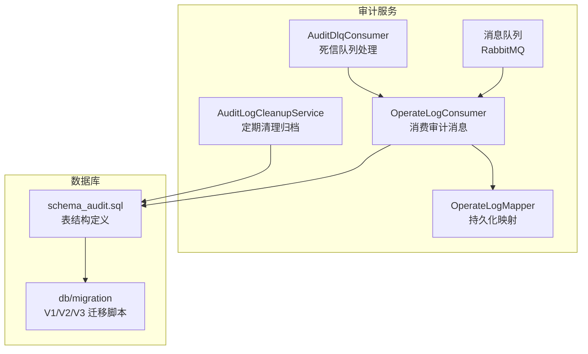
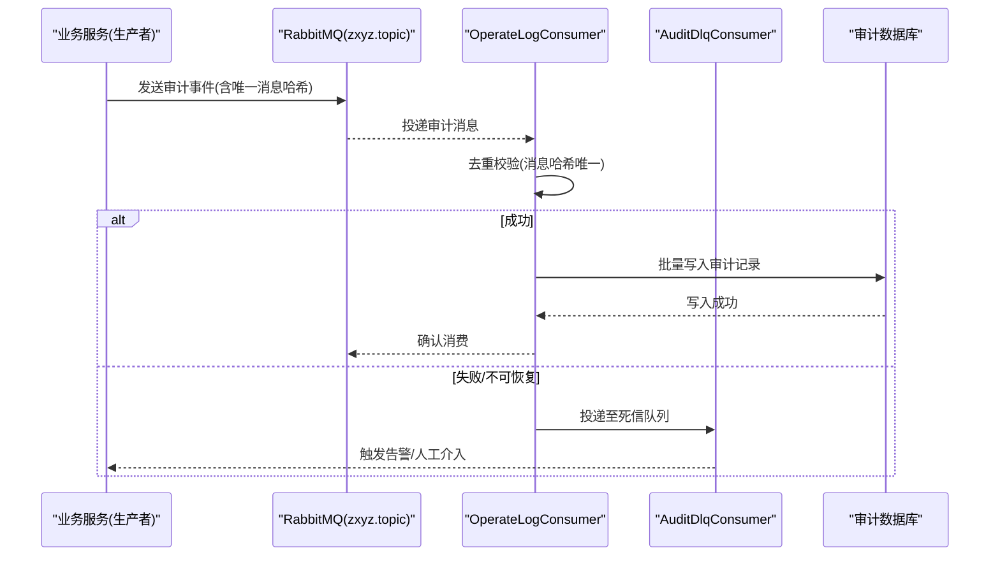
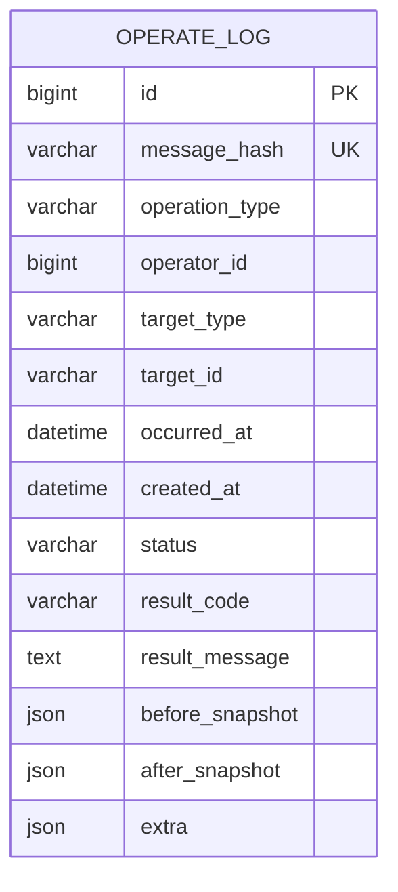
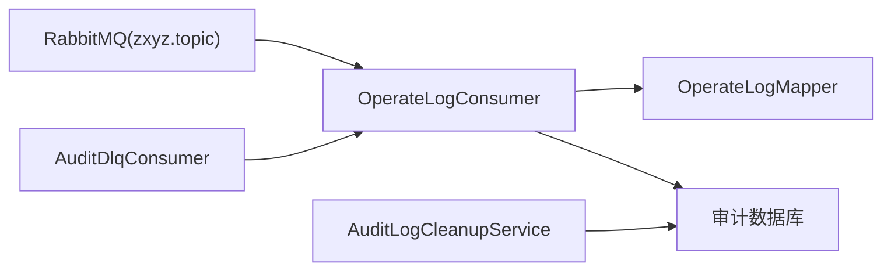
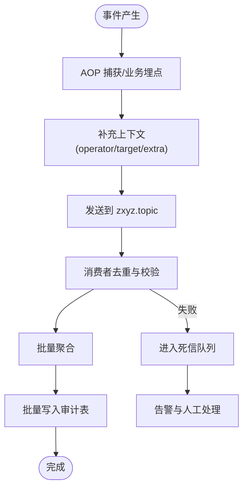

# 审计实体模型

<cite>
**本文引用的文件**   
- [schema_audit.sql](file://ZXYZdatabaseBack/sql/schema_audit.sql)
- [V1__init_schema.sql](file://ZXYZdatabaseBack/zxyz-audit-service/src/main/resources/db/migration/V1__init_schema.sql)
- [V2__add_operate_log_before_after_values.sql](file://ZXYZdatabaseBack/zxyz-audit-service/src/main/resources/db/migration/V2__add_operate_log_before_after_values.sql)
- [V3__add_message_hash_unique.sql](file://ZXYZdatabaseBack/zxyz-audit-service/src/main/resources/db/migration/V3__add_message_hash_unique.sql)
- [OperateLogMapper.java](file://ZXYZdatabaseBack/zxyz-audit-service/src/main/java/uno/acloud/audit/mapper/OperateLogMapper.java)
- [OperateLogConsumer.java](file://ZXYZdatabaseBack/zxyz-audit-service/src/main/java/uno/acloud/audit/mq/OperateLogConsumer.java)
- [AuditDlqConsumer.java](file://ZXYZdatabaseBack/zxyz-audit-service/src/main/java/uno/acloud/audit/mq/AuditDlqConsumer.java)
- [RabbitMqConfig.java](file://ZXYZdatabaseBack/zxyz-audit-service/src/main/java/uno/acloud/audit/config/RabbitMqConfig.java)
- [AuditLogCleanupService.java](file://ZXYZdatabaseBack/zxyz-audit-service/src/main/java/uno/acloud/audit/service/AuditLogCleanupService.java)
- [application.yml](file://ZXYZdatabaseBack/zxyz-audit-service/src/main/resources/application.yml)
- [application-dev.yml](file://ZXYZdatabaseBack/zxyz-audit-service/src/main/resources/application-dev.yml)
- [application-prod.yml](file://ZXYZdatabaseBack/zxyz-audit-service/src/main/resources/application-prod.yml)
- [AuditBufferRetrySchedulerTest.java](file://ZXYZdatabaseBack/zxyz-common/src/test/java/uno/acloud/common/audit/AuditBufferRetrySchedulerTest.java)
- [AuditEventPublisherTest.java](file://ZXYZdatabaseBack/zxyz-common/src/test/java/uno/acloud/common/audit/AuditEventPublisherTest.java)
- [OperateLogConsumerTest.java](file://ZXYZdatabaseBack/zxyz-audit-service/src/test/java/uno/acloud/audit/mq/OperateLogConsumerTest.java)
</cite>

## 目录
1. [简介](#简介)
2. [项目结构](#项目结构)
3. [核心组件](#核心组件)
4. [架构总览](#架构总览)
5. [详细组件分析](#详细组件分析)
6. [依赖关系分析](#依赖关系分析)
7. [性能考量](#性能考量)
8. [故障排查指南](#故障排查指南)
9. [结论](#结论)
10. [附录](#附录)

## 简介
本文件面向 ZXYZ 项目的“审计实体模型”，聚焦操作日志实体的数据结构设计、分类体系、采集机制、查询分析、保留策略与安全合规，以及防篡改与访问控制。文档基于仓库中的审计服务（zxyz-audit-service）、公共模块（zxyz-common）与数据库迁移脚本进行系统化梳理，帮助读者快速理解审计数据从产生到落库的全链路设计与实现要点。

## 项目结构
审计相关代码主要分布在以下位置：
- 数据库定义与迁移：sql 目录下的 schema_audit.sql 与 audit-service 的 db/migration 脚本
- 审计服务：zxyz-audit-service（消费者、清理任务、配置等）
- 公共能力：zxyz-common（事件发布、缓冲重试等测试用例体现的能力）

图表来源
- [OperateLogConsumer.java](file://ZXYZdatabaseBack/zxyz-audit-service/src/main/java/uno/acloud/audit/mq/OperateLogConsumer.java)
- [AuditDlqConsumer.java](file://ZXYZdatabaseBack/zxyz-audit-service/src/main/java/uno/acloud/audit/mq/AuditDlqConsumer.java)
- [OperateLogMapper.java](file://ZXYZdatabaseBack/zxyz-audit-service/src/main/java/uno/acloud/audit/mapper/OperateLogMapper.java)
- [schema_audit.sql](file://ZXYZdatabaseBack/sql/schema_audit.sql)
- [V1__init_schema.sql](file://ZXYZdatabaseBack/zxyz-audit-service/src/main/resources/db/migration/V1__init_schema.sql)
- [V2__add_operate_log_before_after_values.sql](file://ZXYZdatabaseBack/zxyz-audit-service/src/main/resources/db/migration/V2__add_operate_log_before_after_values.sql)
- [V3__add_message_hash_unique.sql](file://ZXYZdatabaseBack/zxyz-audit-service/src/main/resources/db/migration/V3__add_message_hash_unique.sql)

章节来源
- [schema_audit.sql](file://ZXYZdatabaseBack/sql/schema_audit.sql)
- [V1__init_schema.sql](file://ZXYZdatabaseBack/zxyz-audit-service/src/main/resources/db/migration/V1__init_schema.sql)
- [V2__add_operate_log_before_after_values.sql](file://ZXYZdatabaseBack/zxyz-audit-service/src/main/resources/db/migration/V2__add_operate_log_before_after_values.sql)
- [V3__add_message_hash_unique.sql](file://ZXYZdatabaseBack/zxyz-audit-service/src/main/resources/db/migration/V3__add_message_hash_unique.sql)

## 核心组件
- 审计消息消费者：负责从 RabbitMQ 主题中消费审计事件，去重、校验、批量写入数据库。
- 死信队列消费者：对失败或不可恢复的消息进行告警与二次处理。
- 持久化映射器：封装审计日志表的增删改查，支持批量插入优化。
- 清理归档服务：按时间窗口与策略执行审计数据的归档与清理，满足合规要求。
- 配置中心：通过 application*.yml 管理 MQ、数据库、批大小、超时等运行参数。

章节来源
- [OperateLogConsumer.java](file://ZXYZdatabaseBack/zxyz-audit-service/src/main/java/uno/acloud/audit/mq/OperateLogConsumer.java)
- [AuditDlqConsumer.java](file://ZXYZdatabaseBack/zxyz-audit-service/src/main/java/uno/acloud/audit/mq/AuditDlqConsumer.java)
- [OperateLogMapper.java](file://ZXYZdatabaseBack/zxyz-audit-service/src/main/java/uno/acloud/audit/mapper/OperateLogMapper.java)
- [AuditLogCleanupService.java](file://ZXYZdatabaseBack/zxyz-audit-service/src/main/java/uno/acloud/audit/service/AuditLogCleanupService.java)
- [application.yml](file://ZXYZdatabaseBack/zxyz-audit-service/src/main/resources/application.yml)
- [application-dev.yml](file://ZXYZdatabaseBack/zxyz-audit-service/src/main/resources/application-dev.yml)
- [application-prod.yml](file://ZXYZdatabaseBack/zxyz-audit-service/src/main/resources/application-prod.yml)

## 架构总览
审计数据流采用“生产者 → 消息队列 → 消费者 → 持久化”的异步解耦模式，结合去重与死信机制保障可靠性。

图表来源
- [OperateLogConsumer.java](file://ZXYZdatabaseBack/zxyz-audit-service/src/main/java/uno/acloud/audit/mq/OperateLogConsumer.java)
- [AuditDlqConsumer.java](file://ZXYZdatabaseBack/zxyz-audit-service/src/main/java/uno/acloud/audit/mq/AuditDlqConsumer.java)
- [V3__add_message_hash_unique.sql](file://ZXYZdatabaseBack/zxyz-audit-service/src/main/resources/db/migration/V3__add_message_hash_unique.sql)

## 详细组件分析

### 审计实体与数据模型
- 主键与标识
  - id：自增主键，用于行级定位与排序
  - message_hash：消息唯一哈希，用于幂等去重与重复投递防护
- 操作元信息
  - operation_type：操作类型（如用户登录、资源创建、权限变更等）
  - operator_id：操作者标识（用户ID或系统账号）
  - target_type：目标对象类型（如 user、project、team、file 等）
  - target_id：目标对象标识
- 时间与结果
  - created_at：审计记录创建时间（建议索引）
  - occurred_at：事件发生时间（生产侧时间戳）
  - status：处理状态（成功/失败/重试中）
  - result_code：结果码（业务语义）
  - result_message：结果描述（脱敏后）
- 前后值快照
  - before_snapshot：变更前数据快照（JSON）
  - after_snapshot：变更后数据快照（JSON）
- 扩展字段
  - extra：扩展属性（IP、UA、租户/团队ID、请求ID等）

ER 图

图表来源
- [schema_audit.sql](file://ZXYZdatabaseBack/sql/schema_audit.sql)
- [V1__init_schema.sql](file://ZXYZdatabaseBack/zxyz-audit-service/src/main/resources/db/migration/V1__init_schema.sql)
- [V2__add_operate_log_before_after_values.sql](file://ZXYZdatabaseBack/zxyz-audit-service/src/main/resources/db/migration/V2__add_operate_log_before_after_values.sql)
- [V3__add_message_hash_unique.sql](file://ZXYZdatabaseBack/zxyz-audit-service/src/main/resources/db/migration/V3__add_message_hash_unique.sql)

章节来源
- [schema_audit.sql](file://ZXYZdatabaseBack/sql/schema_audit.sql)
- [V1__init_schema.sql](file://ZXYZdatabaseBack/zxyz-audit-service/src/main/resources/db/migration/V1__init_schema.sql)
- [V2__add_operate_log_before_after_values.sql](file://ZXYZdatabaseBack/zxyz-audit-service/src/main/resources/db/migration/V2__add_operate_log_before_after_values.sql)
- [V3__add_message_hash_unique.sql](file://ZXYZdatabaseBack/zxyz-audit-service/src/main/resources/db/migration/V3__add_message_hash_unique.sql)

### 审计日志分类体系
- 用户操作审计
  - 典型 operation_type：登录、登出、密码修改、资料更新
  - 关键字段：operator_id、target_type=user、extra 包含 IP/UA
- 系统变更审计
  - 典型 operation_type：配置项变更、开关切换、定时任务执行
  - 关键字段：before_snapshot/after_snapshot、result_code/result_message
- 安全事件审计
  - 典型 operation_type：异常登录、越权访问、敏感接口调用
  - 关键字段：status=失败/告警、result_code 安全码、extra 包含风险标签

说明
- 不同类别在字段侧重上有所差异：用户操作强调 operator_id 与上下文；系统变更强调前后快照；安全事件强调状态与结果码。

章节来源
- [schema_audit.sql](file://ZXYZdatabaseBack/sql/schema_audit.sql)
- [V2__add_operate_log_before_after_values.sql](file://ZXYZdatabaseBack/zxyz-audit-service/src/main/resources/db/migration/V2__add_operate_log_before_after_values.sql)

### 数据采集机制
- AOP 切面拦截
  - 在各业务服务中通过注解或切面捕获关键方法调用，生成标准化审计事件
  - 事件包含 operation_type、operator_id、target_*、occurred_at、extra 等
- 消息队列异步处理
  - 使用 RabbitMQ Topic Exchange zxyz.topic 进行解耦
  - 消费者具备幂等性（message_hash 唯一约束）与批量写入能力
- 批量写入优化
  - 消费者内聚批次收集，达到阈值或定时触发批量插入
  - 通过事务与重试策略保证最终一致性

章节来源
- [OperateLogConsumer.java](file://ZXYZdatabaseBack/zxyz-audit-service/src/main/java/uno/acloud/audit/mq/OperateLogConsumer.java)
- [RabbitMqConfig.java](file://ZXYZdatabaseBack/zxyz-audit-service/src/main/java/uno/acloud/audit/config/RabbitMqConfig.java)
- [V3__add_message_hash_unique.sql](file://ZXYZdatabaseBack/zxyz-audit-service/src/main/resources/db/migration/V3__add_message_hash_unique.sql)

### 查询与分析功能
- 条件筛选
  - 按 operation_type、target_type、target_id、operator_id 过滤
  - 支持 extra 中的扩展字段检索（如 IP、租户ID）
- 时间范围查询
  - 基于 occurred_at 与 created_at 的范围查询，建议建立复合索引
- 操作轨迹追踪
  - 以 target_id + target_type 为维度串联同一对象的多次操作
  - 结合 before_snapshot/after_snapshot 还原变更过程

章节来源
- [OperateLogMapper.java](file://ZXYZdatabaseBack/zxyz-audit-service/src/main/java/uno/acloud/audit/mapper/OperateLogMapper.java)
- [schema_audit.sql](file://ZXYZdatabaseBack/sql/schema_audit.sql)

### 保留策略与合规
- 数据归档
  - 按月份或季度将历史数据迁移至归档表或冷存储
- 清理规则
  - 超过保留期的非安全类审计记录可删除或匿名化
  - 安全事件记录需延长保留期以满足合规审计
- 合规性要求
  - 保留期、脱敏、不可篡改、访问审计需符合企业内控与外部法规

章节来源
- [AuditLogCleanupService.java](file://ZXYZdatabaseBack/zxyz-audit-service/src/main/java/uno/acloud/audit/service/AuditLogCleanupService.java)

### 防篡改、加密与访问控制
- 防篡改
  - message_hash 唯一约束避免重复写入
  - 建议在应用层对关键字段计算签名并落库，配合只读审计库
- 数据加密
  - 敏感字段（如 extra）在入库前进行加密，查询时按需解密
  - 传输层使用 TLS，存储层启用透明加密（TDE）
- 访问控制
  - 审计库仅允许审计服务读写，其他服务通过只读视图或 API 访问
  - 内部端点 /api/internal/** 经 Gateway SaToken 鉴权，拒绝公网访问

章节来源
- [V3__add_message_hash_unique.sql](file://ZXYZdatabaseBack/zxyz-audit-service/src/main/resources/db/migration/V3__add_message_hash_unique.sql)
- [application.yml](file://ZXYZdatabaseBack/zxyz-audit-service/src/main/resources/application.yml)

## 依赖关系分析

图表来源
- [OperateLogConsumer.java](file://ZXYZdatabaseBack/zxyz-audit-service/src/main/java/uno/acloud/audit/mq/OperateLogConsumer.java)
- [AuditDlqConsumer.java](file://ZXYZdatabaseBack/zxyz-audit-service/src/main/java/uno/acloud/audit/mq/AuditDlqConsumer.java)
- [OperateLogMapper.java](file://ZXYZdatabaseBack/zxyz-audit-service/src/main/java/uno/acloud/audit/mapper/OperateLogMapper.java)
- [AuditLogCleanupService.java](file://ZXYZdatabaseBack/zxyz-audit-service/src/main/java/uno/acloud/audit/service/AuditLogCleanupService.java)

章节来源
- [OperateLogConsumer.java](file://ZXYZdatabaseBack/zxyz-audit-service/src/main/java/uno/acloud/audit/mq/OperateLogConsumer.java)
- [AuditDlqConsumer.java](file://ZXYZdatabaseBack/zxyz-audit-service/src/main/java/uno/acloud/audit/mq/AuditDlqConsumer.java)
- [OperateLogMapper.java](file://ZXYZdatabaseBack/zxyz-audit-service/src/main/java/uno/acloud/audit/mapper/OperateLogMapper.java)
- [AuditLogCleanupService.java](file://ZXYZdatabaseBack/zxyz-audit-service/src/main/java/uno/acloud/audit/service/AuditLogCleanupService.java)

## 性能考量
- 去重与幂等
  - 通过 message_hash 唯一约束避免重复写入，降低冲突成本
- 批量写入
  - 消费者内聚批次收集，减少数据库往返次数
- 索引设计
  - 针对 occurred_at、created_at、target_type、target_id、operator_id 建立合适索引
- 背压与限流
  - 根据 MQ 堆积情况动态调整消费并发与批大小
- 监控与告警
  - 关注消费者延迟、失败率、死信队列增长等指标

[本节为通用指导，不直接分析具体文件]

## 故障排查指南
- 常见现象
  - 审计消息堆积：检查消费者健康、数据库连接池、批大小配置
  - 重复写入：核查 message_hash 是否一致、是否存在重复投递
  - 写入失败：查看错误日志、SQL 异常、事务回滚原因
- 排查步骤
  - 查看消费者日志与 MQ 消费位点
  - 核对数据库唯一约束与索引
  - 检查清理任务的执行周期与策略
- 工具与用例
  - 参考消费者单元测试验证消费逻辑
  - 使用集成测试验证端到端流程

章节来源
- [OperateLogConsumerTest.java](file://ZXYZdatabaseBack/zxyz-audit-service/src/test/java/uno/acloud/audit/mq/OperateLogConsumerTest.java)
- [AuditBufferRetrySchedulerTest.java](file://ZXYZdatabaseBack/zxyz-common/src/test/java/uno/acloud/common/audit/AuditBufferRetrySchedulerTest.java)
- [AuditEventPublisherTest.java](file://ZXYZdatabaseBack/zxyz-common/src/test/java/uno/acloud/common/audit/AuditEventPublisherTest.java)

## 结论
ZXYZ 审计实体模型围绕“可靠采集、幂等持久、可追溯、可归档”的目标构建。通过 AOP 切面与 RabbitMQ 解耦，结合消息哈希去重与死信队列，确保审计数据的高可用与完整性。ER 模型清晰区分操作元信息、时间戳与结果字段，并通过 before/after 快照支撑变更回溯。配合合理的索引、批量写入与清理归档策略，满足性能与合规双重需求。

[本节为总结性内容，不直接分析具体文件]

## 附录
- 审计数据流图（概念）

[本图为概念示意，不直接映射具体源码文件]