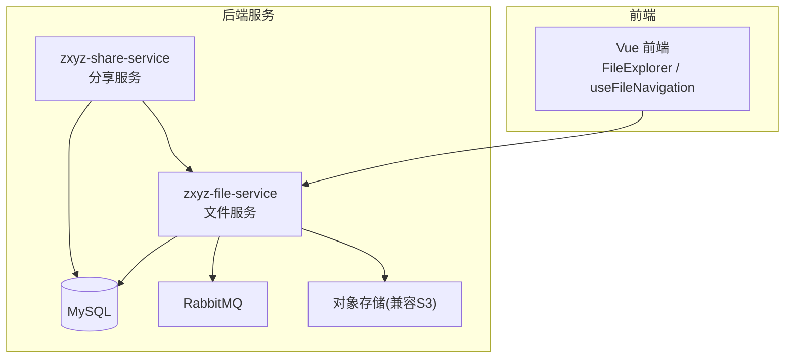
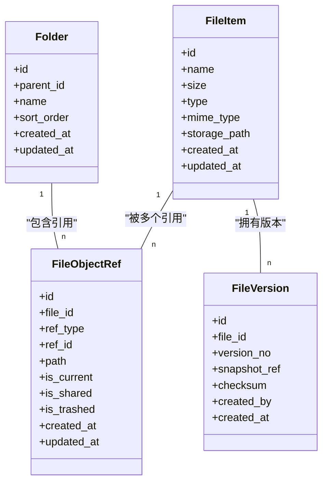
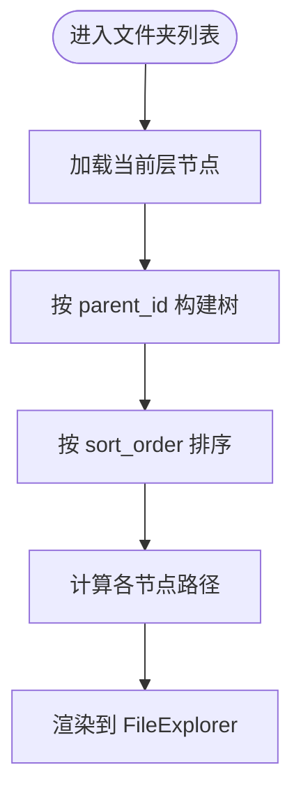
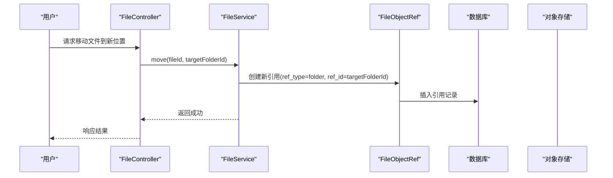
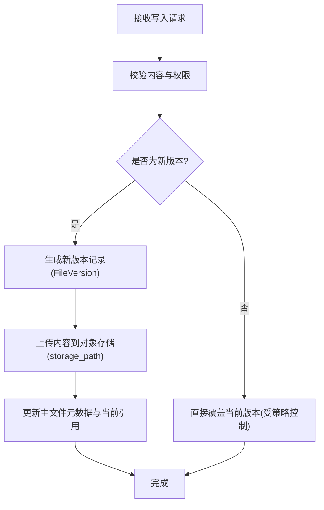
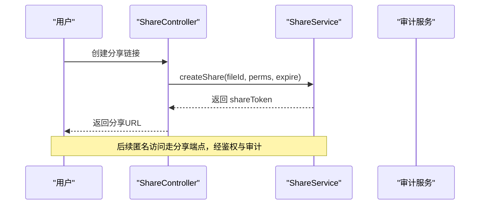
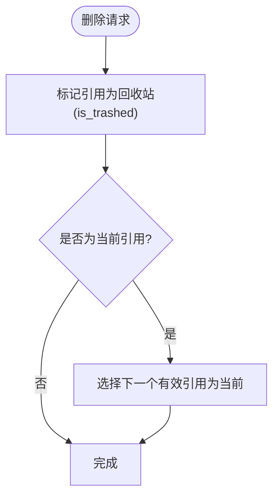
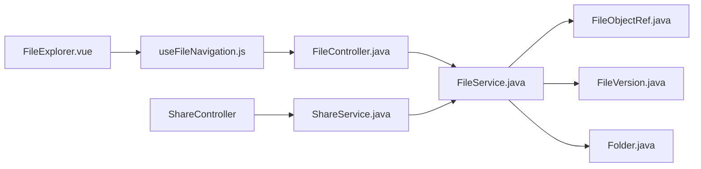
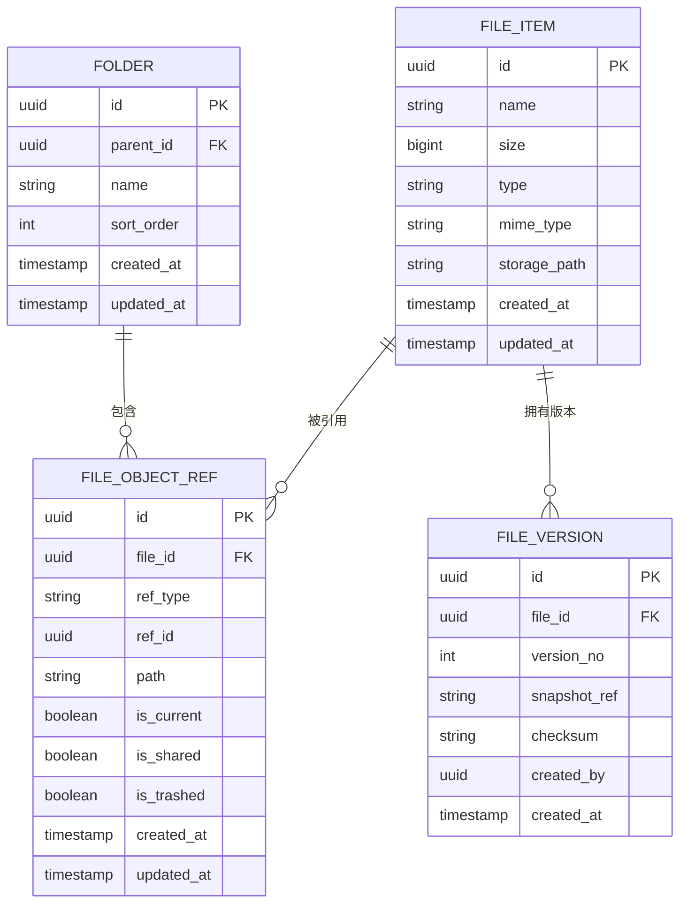
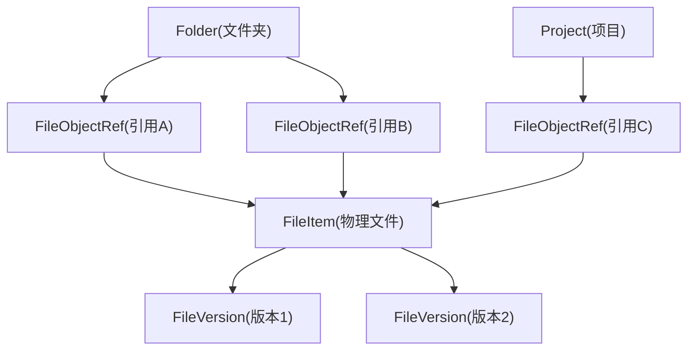

# 文件实体模型

<cite>
**本文引用的文件**
- [schema_file.sql](file://ZXYZdatabaseBack/sql/schema_file.sql)
- [FileItem.java](file://ZXYZdatabaseBack/zxyz-file-service/src/main/java/uno/acloud/file/domain/FileItem.java)
- [Folder.java](file://ZXYZdatabaseBack/zxyz-file-service/src/main/java/uno/acloud/file/domain/Folder.java)
- [FileObjectRef.java](file://ZXYZdatabaseBack/zxyz-file-service/src/main/java/uno/acloud/file/domain/FileObjectRef.java)
- [FileVersion.java](file://ZXYZdatabaseBack/zxyz-file-service/src/main/java/uno/acloud/file/domain/FileVersion.java)
- [FileService.java](file://ZXYZdatabaseBack/zxyz-file-service/src/main/java/uno/acloud/file/service/FileService.java)
- [FileServiceImpl.java](file://ZXYZdatabaseBack/zxyz-file-service/src/main/java/uno/acloud/file/service/impl/FileServiceImpl.java)
- [FileController.java](file://ZXYZdatabaseBack/zxyz-file-service/src/main/java/uno/acloud/file/controller/FileController.java)
- [ShareService.java](file://ZXYZdatabaseBack/zxyz-share-service/src/main/java/uno/acloud/share/service/ShareService.java)
- [ShareServiceImpl.java](file://ZXYZdatabaseBack/zxyz-share-service/src/main/java/uno/acloud/share/service/impl/ShareServiceImpl.java)
- [RecycleBinService.java](file://ZXYZdatabaseBack/zxyz-file-service/src/main/java/uno/acloud/file/service/RecycleBinService.java)
- [RecycleBinServiceImpl.java](file://ZXYZdatabaseBack/zxyz-file-service/src/main/java/uno/acloud/file/service/impl/RecycleBinServiceImpl.java)
- [FileExplorer.vue](file://ZXYZdatabaseFront/src/components/FileExplorer.vue)
- [useFileNavigation.js](file://ZXYZdatabaseFront/src/composables/useFileNavigation.js)
- [filePathResolver.js](file://ZXYZdatabaseFront/src/services/filePathResolver.js)
- [folderTree.js](file://ZXYZdatabaseFront/src/utils/folderTree.js)
</cite>

## 目录
1. [简介](#简介)
2. [项目结构](#项目结构)
3. [核心组件](#核心组件)
4. [架构总览](#架构总览)
5. [详细组件分析](#详细组件分析)
6. [依赖关系分析](#依赖关系分析)
7. [性能考量](#性能考量)
8. [故障排查指南](#故障排查指南)
9. [结论](#结论)
10. [附录](#附录)

## 简介
本文件围绕 ZXYZ 项目的“文件实体模型”展开，聚焦 FileItem、Folder、FileObjectRef、FileVersion 等核心实体的数据结构设计，系统阐述文件元数据字段（如 id、name、size、type、mime_type、storage_path 等）、版本控制字段与存储信息字段；解释文件树形结构设计（文件夹层级、路径计算、节点排序）；描述文件对象引用系统（多位置引用、共享链接、回收站管理）；说明版本控制机制（版本创建、切换、历史管理）；并覆盖权限控制、访问审计与数据完整性校验。文末提供 ER 图与引用关系图，帮助读者快速建立整体认知。

## 项目结构
本项目采用微服务架构，文件相关能力主要由 zxyz-file-service 提供，共享与回收站由 zxyz-share-service 与 zxyz-file-service 协作实现，前端通过 Vue 组件与可组合式函数进行交互。数据库 schema 定义位于 sql 目录中，后端领域模型与接口在 file-service 模块内。

图表来源
- [schema_file.sql](file://ZXYZdatabaseBack/sql/schema_file.sql)
- [FileController.java](file://ZXYZdatabaseBack/zxyz-file-service/src/main/java/uno/acloud/file/controller/FileController.java)
- [FileService.java](file://ZXYZdatabaseBack/zxyz-file-service/src/main/java/uno/acloud/file/service/FileService.java)
- [ShareService.java](file://ZXYZdatabaseBack/zxyz-share-service/src/main/java/uno/acloud/share/service/ShareService.java)

章节来源
- [schema_file.sql](file://ZXYZdatabaseBack/sql/schema_file.sql)
- [FileController.java](file://ZXYZdatabaseBack/zxyz-file-service/src/main/java/uno/acloud/file/controller/FileController.java)
- [FileService.java](file://ZXYZdatabaseBack/zxyz-file-service/src/main/java/uno/acloud/file/service/FileService.java)
- [ShareService.java](file://ZXYZdatabaseBack/zxyz-share-service/src/main/java/uno/acloud/share/service/ShareService.java)

## 核心组件
本节对文件域的核心实体与关键服务进行概述：
- FileItem：文件记录，承载元数据与存储定位信息，是文件操作的基本单元。
- Folder：文件夹节点，用于组织文件与子文件夹，支撑树形浏览与路径计算。
- FileObjectRef：文件对象引用，支持同一物理文件的多位置引用、共享链接与回收站软删除标记。
- FileVersion：文件版本，记录每次变更的版本信息与快照标识，支撑版本切换与历史回溯。
- FileService：文件业务编排，封装上传、移动、复制、删除、版本化、下载等流程。
- ShareService：分享服务，负责生成与校验分享链接、访问控制与限流。
- RecycleBinService：回收站服务，处理逻辑删除、恢复与清理策略。

章节来源
- [FileItem.java](file://ZXYZdatabaseBack/zxyz-file-service/src/main/java/uno/acloud/file/domain/FileItem.java)
- [Folder.java](file://ZXYZdatabaseBack/zxyz-file-service/src/main/java/uno/acloud/file/domain/Folder.java)
- [FileObjectRef.java](file://ZXYZdatabaseBack/zxyz-file-service/src/main/java/uno/acloud/file/domain/FileObjectRef.java)
- [FileVersion.java](file://ZXYZdatabaseBack/zxyz-file-service/src/main/java/uno/acloud/file/domain/FileVersion.java)
- [FileService.java](file://ZXYZdatabaseBack/zxyz-file-service/src/main/java/uno/acloud/file/service/FileService.java)
- [ShareService.java](file://ZXYZdatabaseBack/zxyz-share-service/src/main/java/uno/acloud/share/service/ShareService.java)
- [RecycleBinService.java](file://ZXYZdatabaseBack/zxyz-file-service/src/main/java/uno/acloud/file/service/RecycleBinService.java)

## 架构总览
文件实体模型贯穿“前端展示—API 控制器—服务编排—持久化—对象存储”的完整链路。核心要点如下：
- 数据建模：以 FileItem 为核心，Folder 组织层级，FileObjectRef 解耦“逻辑位置”与“物理内容”，FileVersion 管理版本演进。
- 存储分离：元数据落库，实际文件内容存放于对象存储，通过 storage_path 定位。
- 引用与共享：通过 FileObjectRef 实现多位置引用与分享链接，结合权限与审计。
- 回收站：逻辑删除不立即释放空间，保留恢复窗口与定期清理。
- 版本控制：每次写入产生新版本，支持回滚与对比。

图表来源
- [schema_file.sql](file://ZXYZdatabaseBack/sql/schema_file.sql)
- [FileItem.java](file://ZXYZdatabaseBack/zxyz-file-service/src/main/java/uno/acloud/file/domain/FileItem.java)
- [Folder.java](file://ZXYZdatabaseBack/zxyz-file-service/src/main/java/uno/acloud/file/domain/Folder.java)
- [FileObjectRef.java](file://ZXYZdatabaseBack/zxyz-file-service/src/main/java/uno/acloud/file/domain/FileObjectRef.java)
- [FileVersion.java](file://ZXYZdatabaseBack/zxyz-file-service/src/main/java/uno/acloud/file/domain/FileVersion.java)

## 详细组件分析

### 文件实体与元数据
- FileItem 字段涵盖标识、名称、大小、类型、MIME、存储路径、时间戳等，确保文件可检索、可展示、可定位。
- 元数据校验包括文件名规范化、大小限制、MIME 白名单、扩展名与 MIME 一致性检查。
- 存储路径采用分层命名（如 team/project/folder/...），便于前缀分桶与配额统计。

章节来源
- [schema_file.sql](file://ZXYZdatabaseBack/sql/schema_file.sql)
- [FileItem.java](file://ZXYZdatabaseBack/zxyz-file-service/src/main/java/uno/acloud/file/domain/FileItem.java)

### 文件夹树形结构与路径计算
- Folder 通过 parent_id 构建层级，sort_order 控制同级排序。
- 路径计算通常基于祖先链拼接，或使用冗余 path 字段加速查询。
- 前端使用 folderTree 工具与 filePathResolver 服务将后端返回的扁平或树形数据转换为可视化结构。

图表来源
- [Folder.java](file://ZXYZdatabaseBack/zxyz-file-service/src/main/java/uno/acloud/file/domain/Folder.java)
- [folderTree.js](file://ZXYZdatabaseFront/src/utils/folderTree.js)
- [filePathResolver.js](file://ZXYZdatabaseFront/src/services/filePathResolver.js)
- [FileExplorer.vue](file://ZXYZdatabaseFront/src/components/FileExplorer.vue)

章节来源
- [Folder.java](file://ZXYZdatabaseBack/zxyz-file-service/src/main/java/uno/acloud/file/domain/Folder.java)
- [folderTree.js](file://ZXYZdatabaseFront/src/utils/folderTree.js)
- [filePathResolver.js](file://ZXYZdatabaseFront/src/services/filePathResolver.js)
- [FileExplorer.vue](file://ZXYZdatabaseFront/src/components/FileExplorer.vue)

### 文件对象引用系统（多位置引用、共享链接、回收站）
- FileObjectRef 将“逻辑位置”与“物理文件”解耦，支持同一文件出现在多个文件夹、多个团队空间或项目中。
- is_current 标记当前可见引用，is_shared 标记是否通过分享链接暴露，is_trashed 标记是否进入回收站。
- 移动/复制操作通过新增/更新引用实现，避免重复拷贝大文件。

图表来源
- [FileController.java](file://ZXYZdatabaseBack/zxyz-file-service/src/main/java/uno/acloud/file/controller/FileController.java)
- [FileService.java](file://ZXYZdatabaseBack/zxyz-file-service/src/main/java/uno/acloud/file/service/FileService.java)
- [FileObjectRef.java](file://ZXYZdatabaseBack/zxyz-file-service/src/main/java/uno/acloud/file/domain/FileObjectRef.java)

章节来源
- [FileObjectRef.java](file://ZXYZdatabaseBack/zxyz-file-service/src/main/java/uno/acloud/file/domain/FileObjectRef.java)
- [FileService.java](file://ZXYZdatabaseBack/zxyz-file-service/src/main/java/uno/acloud/file/service/FileService.java)
- [FileController.java](file://ZXYZdatabaseBack/zxyz-file-service/src/main/java/uno/acloud/file/controller/FileController.java)

### 文件版本控制机制
- FileVersion 记录每次写入的版本号、快照标识、校验和与创建者。
- 版本创建：上传或编辑时生成新版本，旧版本归档为历史。
- 版本切换：通过切换 is_current 引用指向新版本，实现“工作副本”概念。
- 历史管理：支持列出历史版本、预览差异、回滚至指定版本。

图表来源
- [FileVersion.java](file://ZXYZdatabaseBack/zxyz-file-service/src/main/java/uno/acloud/file/domain/FileVersion.java)
- [FileService.java](file://ZXYZdatabaseBack/zxyz-file-service/src/main/java/uno/acloud/file/service/FileService.java)
- [FileServiceImpl.java](file://ZXYZdatabaseBack/zxyz-file-service/src/main/java/uno/acloud/file/service/impl/FileServiceImpl.java)

章节来源
- [FileVersion.java](file://ZXYZdatabaseBack/zxyz-file-service/src/main/java/uno/acloud/file/domain/FileVersion.java)
- [FileService.java](file://ZXYZdatabaseBack/zxyz-file-service/src/main/java/uno/acloud/file/service/FileService.java)
- [FileServiceImpl.java](file://ZXYZdatabaseBack/zxyz-file-service/src/main/java/uno/acloud/file/service/impl/FileServiceImpl.java)

### 共享链接与访问控制
- ShareService 负责生成分享令牌、设置有效期与访问权限（仅查看/下载）。
- 访问审计：记录访问者、IP、时间、操作类型，便于追踪与风控。
- 限流与防刷：针对公开链接实施速率限制与验证码策略。

图表来源
- [ShareService.java](file://ZXYZdatabaseBack/zxyz-share-service/src/main/java/uno/acloud/share/service/ShareService.java)
- [ShareServiceImpl.java](file://ZXYZdatabaseBack/zxyz-share-service/src/main/java/uno/acloud/share/service/impl/ShareServiceImpl.java)

章节来源
- [ShareService.java](file://ZXYZdatabaseBack/zxyz-share-service/src/main/java/uno/acloud/share/service/ShareService.java)
- [ShareServiceImpl.java](file://ZXYZdatabaseBack/zxyz-share-service/src/main/java/uno/acloud/share/service/impl/ShareServiceImpl.java)

### 回收站管理
- 删除操作将对应 FileObjectRef 标记 is_trashed=true，而非物理删除。
- 支持恢复：取消 trashed 标记并恢复 is_current 引用。
- 清理策略：超过保留期的回收站条目定时清理，释放存储空间。

图表来源
- [RecycleBinService.java](file://ZXYZdatabaseBack/zxyz-file-service/src/main/java/uno/acloud/file/service/RecycleBinService.java)
- [RecycleBinServiceImpl.java](file://ZXYZdatabaseBack/zxyz-file-service/src/main/java/uno/acloud/file/service/impl/RecycleBinServiceImpl.java)

章节来源
- [RecycleBinService.java](file://ZXYZdatabaseBack/zxyz-file-service/src/main/java/uno/acloud/file/service/RecycleBinService.java)
- [RecycleBinServiceImpl.java](file://ZXYZdatabaseBack/zxyz-file-service/src/main/java/uno/acloud/file/service/impl/RecycleBinServiceImpl.java)

### 权限控制与访问审计
- 权限模型：基于团队/项目/空间的细粒度授权，结合角色（成员/管理员/访客）控制读写与分享。
- 审计日志：所有文件操作（上传、修改、删除、分享、恢复）均记录审计事件，支持导出与告警。
- 安全校验：签名校验、防重放、跨域与 CSRF 防护。

章节来源
- [schema_file.sql](file://ZXYZdatabaseBack/sql/schema_file.sql)
- [FileService.java](file://ZXYZdatabaseBack/zxyz-file-service/src/main/java/uno/acloud/file/service/FileService.java)
- [ShareService.java](file://ZXYZdatabaseBack/zxyz-share-service/src/main/java/uno/acloud/share/service/ShareService.java)

### 数据完整性校验
- 上传阶段计算哈希（如 MD5/SHA256），用于去重与完整性校验。
- 存储后二次校验，确保对象存储内容一致。
- 版本快照关联 checksum，防止篡改与损坏。

章节来源
- [FileVersion.java](file://ZXYZdatabaseBack/zxyz-file-service/src/main/java/uno/acloud/file/domain/FileVersion.java)
- [FileService.java](file://ZXYZdatabaseBack/zxyz-file-service/src/main/java/uno/acloud/file/service/FileService.java)

## 依赖关系分析
- FileService 依赖 FileObjectRef、FileVersion、Folder 等实体，协调上传、移动、复制、删除、版本化等操作。
- ShareService 依赖分享令牌与权限策略，调用 FileService 获取文件元数据与访问控制。
- 前端 FileExplorer 与 useFileNavigation 依赖后端 API 与路径解析工具，呈现树形结构与导航状态。

图表来源
- [FileExplorer.vue](file://ZXYZdatabaseFront/src/components/FileExplorer.vue)
- [useFileNavigation.js](file://ZXYZdatabaseFront/src/composables/useFileNavigation.js)
- [FileController.java](file://ZXYZdatabaseBack/zxyz-file-service/src/main/java/uno/acloud/file/controller/FileController.java)
- [FileService.java](file://ZXYZdatabaseBack/zxyz-file-service/src/main/java/uno/acloud/file/service/FileService.java)
- [FileObjectRef.java](file://ZXYZdatabaseBack/zxyz-file-service/src/main/java/uno/acloud/file/domain/FileObjectRef.java)
- [FileVersion.java](file://ZXYZdatabaseBack/zxyz-file-service/src/main/java/uno/acloud/file/domain/FileVersion.java)
- [Folder.java](file://ZXYZdatabaseBack/zxyz-file-service/src/main/java/uno/acloud/file/domain/Folder.java)
- [ShareService.java](file://ZXYZdatabaseBack/zxyz-share-service/src/main/java/uno/acloud/share/service/ShareService.java)

章节来源
- [FileExplorer.vue](file://ZXYZdatabaseFront/src/components/FileExplorer.vue)
- [useFileNavigation.js](file://ZXYZdatabaseFront/src/composables/useFileNavigation.js)
- [FileController.java](file://ZXYZdatabaseBack/zxyz-file-service/src/main/java/uno/acloud/file/controller/FileController.java)
- [FileService.java](file://ZXYZdatabaseBack/zxyz-file-service/src/main/java/uno/acloud/file/service/FileService.java)
- [FileObjectRef.java](file://ZXYZdatabaseBack/zxyz-file-service/src/main/java/uno/acloud/file/domain/FileObjectRef.java)
- [FileVersion.java](file://ZXYZdatabaseBack/zxyz-file-service/src/main/java/uno/acloud/file/domain/FileVersion.java)
- [Folder.java](file://ZXYZdatabaseBack/zxyz-file-service/src/main/java/uno/acloud/file/domain/Folder.java)
- [ShareService.java](file://ZXYZdatabaseBack/zxyz-share-service/src/main/java/uno/acloud/share/service/ShareService.java)

## 性能考量
- 索引优化：对 file_id、ref_type、ref_id、is_current、is_trashed、created_at 等高频查询字段建立索引。
- 分页与懒加载：文件列表与树形结构采用分页与按需展开，减少首屏负载。
- 缓存策略：热点文件元数据与分享令牌短期缓存，降低数据库压力。
- 对象存储分片：大文件分块上传与断点续传，提升稳定性与吞吐。
- 异步处理：审计日志与清理任务通过消息队列异步执行，避免阻塞主流程。

## 故障排查指南
- 上传失败：检查 storage_path 合法性、MIME 校验、大小限制与对象存储连通性。
- 版本错乱：核对 FileVersion.version_no 单调递增、checksum 一致性与 is_current 引用唯一性。
- 分享无法访问：确认分享令牌未过期、权限配置正确、限流未触发。
- 回收站异常：检查 is_trashed 标记与 is_current 切换逻辑，确保恢复后引用有效。
- 审计缺失：确认审计事件发布与消费链路正常，消息未堆积。

章节来源
- [FileServiceImpl.java](file://ZXYZdatabaseBack/zxyz-file-service/src/main/java/uno/acloud/file/service/impl/FileServiceImpl.java)
- [ShareServiceImpl.java](file://ZXYZdatabaseBack/zxyz-share-service/src/main/java/uno/acloud/share/service/impl/ShareServiceImpl.java)
- [RecycleBinServiceImpl.java](file://ZXYZdatabaseBack/zxyz-file-service/src/main/java/uno/acloud/file/service/impl/RecycleBinServiceImpl.java)

## 结论
ZXYZ 的文件实体模型以 FileItem 为中心，通过 Folder 组织层级、FileObjectRef 解耦逻辑位置与物理内容、FileVersion 管理版本演进，形成高内聚、低耦合的数据模型。配合分享与回收站机制、权限与审计、完整性校验，满足企业级文件管理的复杂需求。建议在生产环境持续优化索引、缓存与异步化，保障高可用与高性能。

## 附录

### ER 图（文件实体）

图表来源
- [schema_file.sql](file://ZXYZdatabaseBack/sql/schema_file.sql)

### 引用关系图（逻辑与物理）

图表来源
- [FileObjectRef.java](file://ZXYZdatabaseBack/zxyz-file-service/src/main/java/uno/acloud/file/domain/FileObjectRef.java)
- [FileItem.java](file://ZXYZdatabaseBack/zxyz-file-service/src/main/java/uno/acloud/file/domain/FileItem.java)
- [FileVersion.java](file://ZXYZdatabaseBack/zxyz-file-service/src/main/java/uno/acloud/file/domain/FileVersion.java)
- [Folder.java](file://ZXYZdatabaseBack/zxyz-file-service/src/main/java/uno/acloud/file/domain/Folder.java)