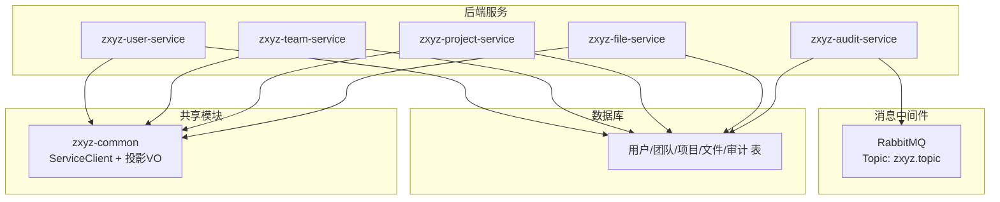
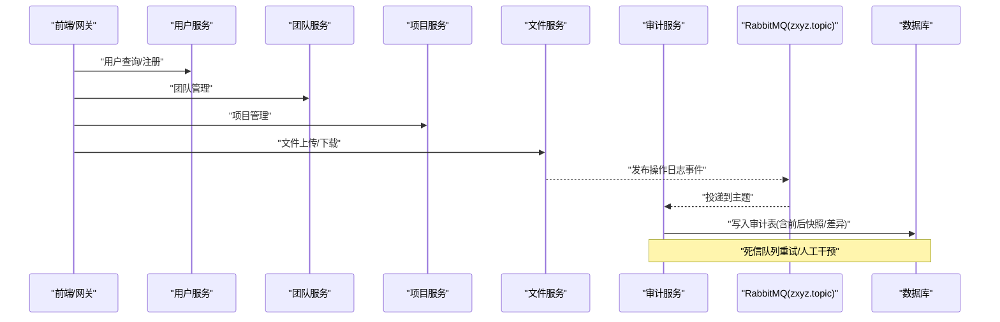
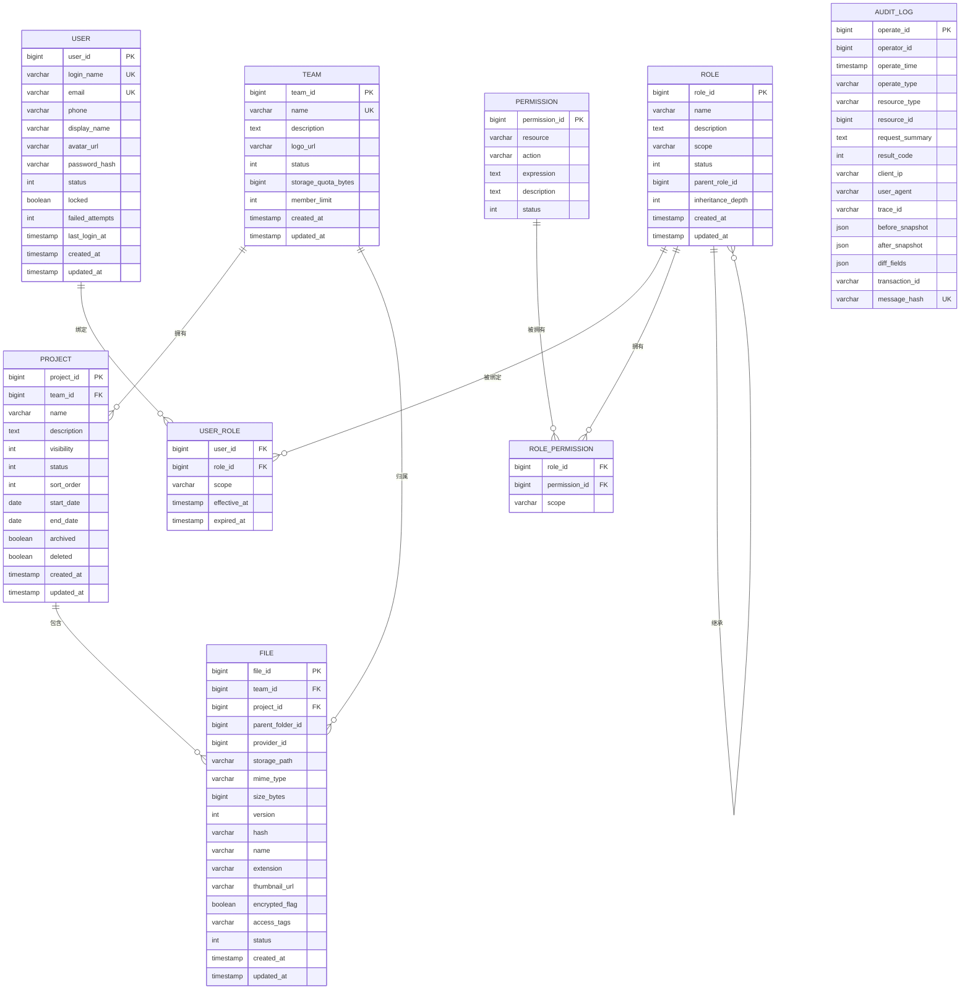
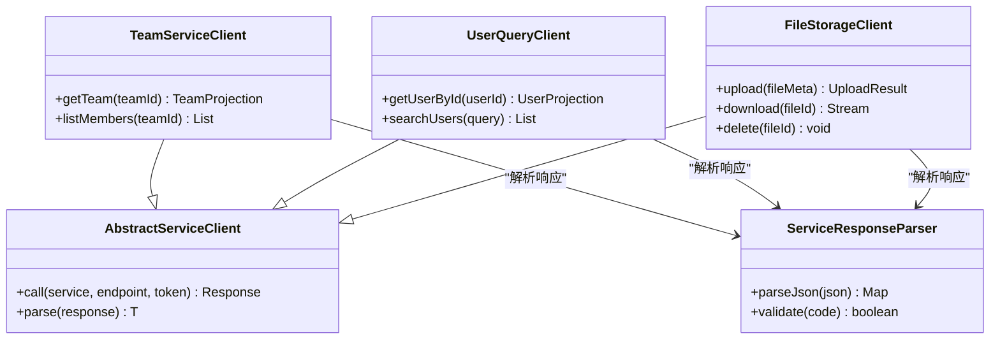

# 核心实体模型

<cite>
**本文引用的文件**   
- [schema_user.sql](file://ZXYZdatabaseBack/sql/schema_user.sql)
- [schema_team.sql](file://ZXYZdatabaseBack/sql/schema_team.sql)
- [schema_project.sql](file://ZXYZdatabaseBack/sql/schema_project.sql)
- [schema_file.sql](file://ZXYZdatabaseBack/sql/schema_file.sql)
- [schema_audit.sql](file://ZXYZdatabaseBack/sql/schema_audit.sql)
- [V1__init_schema.sql](file://ZXYZdatabaseBack/zxyz-audit-service/src/main/resources/db/migration/V1__init_schema.sql)
- [V2__add_operate_log_before_after_values.sql](file://ZXYZdatabaseBack/zxyz-audit-service/src/main/resources/db/migration/V2__add_operate_log_before_after_values.sql)
- [V3__add_message_hash_unique.sql](file://ZXYZdatabaseBack/zxyz-audit-service/src/main/resources/db/migration/V3__add_message_hash_unique.sql)
- [OperateLogConsumer.java](file://ZXYZdatabaseBack/zxyz-audit-service/src/main/java/uno/acloud/audit/mq/OperateLogConsumer.java)
- [AuditDlqConsumer.java](file://ZXYZdatabaseBack/zxyz-audit-service/src/main/java/uno/acloud/audit/mq/AuditDlqConsumer.java)
- [OperateLogMapper.java](file://ZXYZdatabaseBack/zxyz-audit-service/src/main/java/uno/acloud/audit/mapper/OperateLogMapper.java)
- [RabbitMqConfig.java](file://ZXYZdatabaseBack/zxyz-audit-service/src/main/java/uno/acloud/audit/config/RabbitMqConfig.java)
- [TeamServiceClient.java](file://ZXYZdatabaseBack/zxyz-common/src/main/java/uno/acloud/client/TeamServiceClient.java)
- [UserQueryClient.java](file://ZXYZdatabaseBack/zxyz-common/src/main/java/uno/acloud/client/UserQueryClient.java)
- [FileStorageClient.java](file://ZXYZdatabaseBack/zxyz-common/src/main/java/uno/acloud/client/FileStorageClient.java)
- [AbstractServiceClient.java](file://ZXYZdatabaseBack/zxyz-common/src/main/java/uno/acloud/client/AbstractServiceClient.java)
- [ServiceResponseParser.java](file://ZXYZdatabaseBack/zxyz-common/src/main/java/uno/acloud/client/ServiceResponseParser.java)
- [application.yml](file://ZXYZdatabaseBack/zxyz-audit-service/src/main/resources/application.yml)
- [application-dev.yml](file://ZXYZdatabaseBack/zxyz-audit-service/src/main/resources/application-dev.yml)
- [application-prod.yml](file://ZXYZdatabaseBack/zxyz-audit-service/src/main/resources/application-prod.yml)
</cite>

## 目录
1. [简介](#简介)
2. [项目结构](#项目结构)
3. [核心实体](#核心实体)
4. [架构总览](#架构总览)
5. [详细组件分析](#详细组件分析)
6. [依赖关系分析](#依赖关系分析)
7. [性能考虑](#性能考虑)
8. [故障排查指南](#故障排查指南)
9. [结论](#结论)
10. [附录](#附录)

## 简介
本文件面向 ZXYZ 项目的核心实体模型，聚焦用户(User)、团队(Team)、项目(Project)、文件(File)等关键领域对象的数据结构设计，以及 RBAC 权限模型与审计日志(Audit)的落地方案。文档从字段定义、数据类型选择、约束条件与业务含义出发，系统阐述实体间关联关系（一对一、一对多、多对多）的实现方式，并给出数据验证规则、业务约束与完整性检查策略。同时提供 ER 图与实体关系矩阵，帮助读者快速理解复杂数据依赖。

## 项目结构
ZXYZ 采用微服务架构，数据库 Schema 以 SQL 迁移脚本形式维护在 ZXYZdatabaseBack/sql 与各服务的 db/migration 目录下；审计相关表由 zxyz-audit-service 独立管理，并通过 RabbitMQ Topic Exchange 异步消费操作日志事件。

图表来源
- [application.yml](file://ZXYZdatabaseBack/zxyz-audit-service/src/main/resources/application.yml)
- [RabbitMqConfig.java](file://ZXYZdatabaseBack/zxyz-audit-service/src/main/java/uno/acloud/audit/config/RabbitMqConfig.java)

章节来源
- [schema_user.sql](file://ZXYZdatabaseBack/sql/schema_user.sql)
- [schema_team.sql](file://ZXYZdatabaseBack/sql/schema_team.sql)
- [schema_project.sql](file://ZXYZdatabaseBack/sql/schema_project.sql)
- [schema_file.sql](file://ZXYZdatabaseBack/sql/schema_file.sql)
- [schema_audit.sql](file://ZXYZdatabaseBack/sql/schema_audit.sql)
- [V1__init_schema.sql](file://ZXYZdatabaseBack/zxyz-audit-service/src/main/resources/db/migration/V1__init_schema.sql)
- [V2__add_operate_log_before_after_values.sql](file://ZXYZdatabaseBack/zxyz-audit-service/src/main/resources/db/migration/V2__add_operate_log_before_after_values.sql)
- [V3__add_message_hash_unique.sql](file://ZXYZdatabaseBack/zxyz-audit-service/src/main/resources/db/migration/V3__add_message_hash_unique.sql)

## 核心实体
本节概述各核心实体的字段设计、类型选择与约束，以及业务含义。为便于阅读，以下描述聚焦于“字段类别”和“约束要点”，不直接粘贴代码内容。

- 用户(User)
  - 标识与基础信息：唯一用户ID、登录名、邮箱、手机号、显示名称、头像URL、状态、创建/更新时间戳等。
  - 安全与认证：密码哈希、最近登录时间、锁定标志、失败次数等。
  - 约束与校验：登录名/邮箱唯一性、非空校验、长度限制、格式校验（邮箱/手机号）、状态枚举合法值。
  - 业务含义：系统身份主体，跨团队/项目复用；用于鉴权、通知、审计溯源。

- 团队(Team)
  - 标识与元信息：团队ID、名称、描述、Logo、状态、创建/更新时间戳等。
  - 资源配额：存储空间上限、成员数量上限、过期时间等。
  - 约束与校验：名称唯一性（或按租户隔离）、状态枚举、配额非负。
  - 业务含义：协作空间边界，承载成员、项目、文件等资源归属与权限上下文。

- 项目(Project)
  - 标识与归属：项目ID、所属团队ID、名称、描述、可见性、状态、排序、创建/更新时间戳等。
  - 生命周期：开始/结束日期、归档标志、删除标志等。
  - 约束与校验：团队内名称唯一性、状态枚举、日期合法性、外键引用完整性。
  - 业务含义：团队协作的最小工作单元，承载文件、任务、讨论等业务域。

- 文件(File)
  - 标识与归属：文件ID、父文件夹ID、所属团队ID、所属项目ID、存储提供者ID、路径、名称、大小、版本、状态、创建/更新时间戳等。
  - 元数据：MIME类型、哈希值、扩展名、缩略图URL、加密标志、访问控制标签等。
  - 约束与校验：路径唯一性（团队+项目+路径）、大小上限、哈希唯一性（防重）、状态机转换约束。
  - 业务含义：可共享、可版本化、可回收的核心资产，支撑上传、下载、预览、分享等功能。

- 角色(Role)与权限(Permission)
  - 角色：角色ID、名称、描述、作用域（系统/团队/项目）、状态、创建/更新时间戳等。
  - 权限：权限ID、资源、动作、表达式、描述、状态等。
  - 绑定与继承：用户-角色绑定、角色-权限绑定、角色继承链（父子角色）。
  - 约束与校验：作用域内唯一性、动作枚举合法、继承无环检测。
  - 业务含义：RBAC 模型的基础，实现细粒度授权与权限聚合。

- 审计(Audit)
  - 操作记录：操作ID、操作者ID、操作时间、操作类型、资源类型、资源ID、请求摘要、结果码、客户端IP、UA、链路追踪ID等。
  - 变更追踪：变更前快照、变更后快照、差异字段列表、事务ID。
  - 约束与校验：操作类型/资源类型枚举、快照JSON合法性、去重（消息哈希唯一）。
  - 业务含义：合规审计、问题回溯、风控与告警依据。

章节来源
- [schema_user.sql](file://ZXYZdatabaseBack/sql/schema_user.sql)
- [schema_team.sql](file://ZXYZdatabaseBack/sql/schema_team.sql)
- [schema_project.sql](file://ZXYZdatabaseBack/sql/schema_project.sql)
- [schema_file.sql](file://ZXYZdatabaseBack/sql/schema_file.sql)
- [schema_audit.sql](file://ZXYZdatabaseBack/sql/schema_audit.sql)
- [V1__init_schema.sql](file://ZXYZdatabaseBack/zxyz-audit-service/src/main/resources/db/migration/V1__init_schema.sql)
- [V2__add_operate_log_before_after_values.sql](file://ZXYZdatabaseBack/zxyz-audit-service/src/main/resources/db/migration/V2__add_operate_log_before_after_values.sql)
- [V3__add_message_hash_unique.sql](file://ZXYZdatabaseBack/zxyz-audit-service/src/main/resources/db/migration/V3__add_message_hash_unique.sql)

## 架构总览
核心实体分布在多个服务中，通过 ServiceClient 进行窄端点调用，返回投影 VO，避免胖 DTO 耦合。审计服务独立消费 MQ 事件，落库审计表，支持死信队列处理异常消息。

图表来源
- [OperateLogConsumer.java](file://ZXYZdatabaseBack/zxyz-audit-service/src/main/java/uno/acloud/audit/mq/OperateLogConsumer.java)
- [AuditDlqConsumer.java](file://ZXYZdatabaseBack/zxyz-audit-service/src/main/java/uno/acloud/audit/mq/AuditDlqConsumer.java)
- [RabbitMqConfig.java](file://ZXYZdatabaseBack/zxyz-audit-service/src/main/java/uno/acloud/audit/config/RabbitMqConfig.java)
- [OperateLogMapper.java](file://ZXYZdatabaseBack/zxyz-audit-service/src/main/java/uno/acloud/audit/mapper/OperateLogMapper.java)

## 详细组件分析

### 用户(User)实体
- 字段类别
  - 标识：user_id（主键）
  - 身份：login_name、email、phone、display_name、avatar_url
  - 安全：password_hash、status、locked、failed_attempts、last_login_at
  - 审计：created_by、updated_by、created_at、updated_at
- 数据类型与约束
  - 字符串类字段设置长度与字符集，邮箱/手机号正则校验
  - 状态枚举限定合法值，默认启用
  - 唯一索引：login_name、email
- 业务含义
  - 作为全局唯一身份，参与团队/项目成员关系、权限绑定与审计溯源

章节来源
- [schema_user.sql](file://ZXYZdatabaseBack/sql/schema_user.sql)

### 团队(Team)实体
- 字段类别
  - 标识：team_id（主键）
  - 元信息：name、description、logo_url、status
  - 配额：storage_quota_bytes、member_limit
  - 审计：created_by、updated_by、created_at、updated_at
- 数据类型与约束
  - 名称唯一性约束（可按租户隔离）
  - 配额非负，状态枚举合法
- 业务含义
  - 协作边界，承载成员、项目、文件等资源归属

章节来源
- [schema_team.sql](file://ZXYZdatabaseBack/sql/schema_team.sql)

### 项目(Project)实体
- 字段类别
  - 标识：project_id（主键）
  - 归属：team_id（外键）
  - 元信息：name、description、visibility、status、sort_order
  - 生命周期：start_date、end_date、archived、deleted
  - 审计：created_by、updated_by、created_at、updated_at
- 数据类型与约束
  - team_id 外键约束保证归属完整性
  - 名称在团队内唯一
  - 日期合法性、状态机转换约束
- 业务含义
  - 团队协作的最小工作单元，承载文件、任务、讨论等

章节来源
- [schema_project.sql](file://ZXYZdatabaseBack/sql/schema_project.sql)

### 文件(File)实体
- 字段类别
  - 标识：file_id（主键）
  - 归属：team_id、project_id、parent_folder_id
  - 存储：provider_id、storage_path、mime_type、size_bytes、version、hash
  - 元数据：name、extension、thumbnail_url、encrypted_flag、access_tags
  - 状态与审计：status、created_by、updated_by、created_at、updated_at
- 数据类型与约束
  - 路径唯一性（team_id + project_id + storage_path）
  - hash 唯一性（防重复上传）
  - size_bytes 上限、状态机转换约束
- 业务含义
  - 可共享、可版本化、可回收的核心资产

章节来源
- [schema_file.sql](file://ZXYZdatabaseBack/sql/schema_file.sql)

### RBAC 权限模型（角色/权限/绑定/继承）
- 角色(Role)
  - 字段：role_id、name、description、scope（system/team/project）、status、审计字段
  - 约束：作用域内唯一性、状态枚举
- 权限(Permission)
  - 字段：permission_id、resource、action、expression、description、status
  - 约束：资源-动作组合唯一性、表达式合法性
- 绑定与继承
  - 用户-角色绑定表：user_id、role_id、scope、effective_at、expired_at
  - 角色-权限绑定表：role_id、permission_id、scope
  - 角色继承：parent_role_id、inheritance_depth、无环约束
- 业务含义
  - 基于角色的访问控制，支持作用域隔离与权限聚合

章节来源
- [schema_team.sql](file://ZXYZdatabaseBack/sql/schema_team.sql)
- [schema_project.sql](file://ZXYZdatabaseBack/sql/schema_project.sql)

### 审计(Audit)实体
- 字段类别
  - 操作记录：operate_id、operator_id、operate_time、operate_type、resource_type、resource_id、request_summary、result_code、client_ip、user_agent、trace_id
  - 变更追踪：before_snapshot、after_snapshot、diff_fields、transaction_id
  - 去重：message_hash（唯一索引）
- 数据类型与约束
  - operate_type/resource_type 枚举合法
  - before_snapshot/after_snapshot JSON 合法性校验
  - message_hash 唯一，防止重复入库
- 业务含义
  - 合规审计、问题回溯、风控与告警依据

章节来源
- [schema_audit.sql](file://ZXYZdatabaseBack/sql/schema_audit.sql)
- [V1__init_schema.sql](file://ZXYZdatabaseBack/zxyz-audit-service/src/main/resources/db/migration/V1__init_schema.sql)
- [V2__add_operate_log_before_after_values.sql](file://ZXYZdatabaseBack/zxyz-audit-service/src/main/resources/db/migration/V2__add_operate_log_before_after_values.sql)
- [V3__add_message_hash_unique.sql](file://ZXYZdatabaseBack/zxyz-audit-service/src/main/resources/db/migration/V3__add_message_hash_unique.sql)

### 实体关系矩阵
- 用户-团队：多对多（成员关系）
- 用户-项目：多对多（通过团队间接关联）
- 团队-项目：一对多
- 项目-文件：一对多
- 团队-文件：一对多（归属维度）
- 用户-角色：多对多
- 角色-权限：多对多
- 角色-角色：自引用继承（树形）

章节来源
- [schema_user.sql](file://ZXYZdatabaseBack/sql/schema_user.sql)
- [schema_team.sql](file://ZXYZdatabaseBack/sql/schema_team.sql)
- [schema_project.sql](file://ZXYZdatabaseBack/sql/schema_project.sql)
- [schema_file.sql](file://ZXYZdatabaseBack/sql/schema_file.sql)

### ER 图

图表来源
- [schema_user.sql](file://ZXYZdatabaseBack/sql/schema_user.sql)
- [schema_team.sql](file://ZXYZdatabaseBack/sql/schema_team.sql)
- [schema_project.sql](file://ZXYZdatabaseBack/sql/schema_project.sql)
- [schema_file.sql](file://ZXYZdatabaseBack/sql/schema_file.sql)
- [schema_audit.sql](file://ZXYZdatabaseBack/sql/schema_audit.sql)
- [V1__init_schema.sql](file://ZXYZdatabaseBack/zxyz-audit-service/src/main/resources/db/migration/V1__init_schema.sql)
- [V2__add_operate_log_before_after_values.sql](file://ZXYZdatabaseBack/zxyz-audit-service/src/main/resources/db/migration/V2__add_operate_log_before_after_values.sql)
- [V3__add_message_hash_unique.sql](file://ZXYZdatabaseBack/zxyz-audit-service/src/main/resources/db/migration/V3__add_message_hash_unique.sql)

## 依赖关系分析
- 服务间调用
  - 使用 zxyz-common 中的 AbstractServiceClient 基类，封装内部服务调用与鉴权头（X-Internal-Service-Token）。
  - TeamServiceClient、UserQueryClient、FileStorageClient 分别对接团队、用户、文件服务，返回窄端点投影 VO。
  - ServiceResponseParser 统一解析响应体，确保错误码与数据结构一致性。
- 审计服务依赖
  - RabbitMqConfig 配置 Topic Exchange 与队列绑定，OperateLogConsumer 消费事件并持久化，AuditDlqConsumer 处理死信消息。
  - OperateLogMapper 负责审计表读写，迁移脚本保障表结构与约束演进。

图表来源
- [AbstractServiceClient.java](file://ZXYZdatabaseBack/zxyz-common/src/main/java/uno/acloud/client/AbstractServiceClient.java)
- [TeamServiceClient.java](file://ZXYZdatabaseBack/zxyz-common/src/main/java/uno/acloud/client/TeamServiceClient.java)
- [UserQueryClient.java](file://ZXYZdatabaseBack/zxyz-common/src/main/java/uno/acloud/client/UserQueryClient.java)
- [FileStorageClient.java](file://ZXYZdatabaseBack/zxyz-common/src/main/java/uno/acloud/client/FileStorageClient.java)
- [ServiceResponseParser.java](file://ZXYZdatabaseBack/zxyz-common/src/main/java/uno/acloud/client/ServiceResponseParser.java)

章节来源
- [AbstractServiceClient.java](file://ZXYZdatabaseBack/zxyz-common/src/main/java/uno/acloud/client/AbstractServiceClient.java)
- [TeamServiceClient.java](file://ZXYZdatabaseBack/zxyz-common/src/main/java/uno/acloud/client/TeamServiceClient.java)
- [UserQueryClient.java](file://ZXYZdatabaseBack/zxyz-common/src/main/java/uno/acloud/client/UserQueryClient.java)
- [FileStorageClient.java](file://ZXYZdatabaseBack/zxyz-common/src/main/java/uno/acloud/client/FileStorageClient.java)
- [ServiceResponseParser.java](file://ZXYZdatabaseBack/zxyz-common/src/main/java/uno/acloud/client/ServiceResponseParser.java)

## 性能考虑
- 索引与查询
  - 用户：login_name、email 唯一索引；常用查询加复合索引（如 status + created_at）。
  - 团队：name 唯一索引；按 owner/creator 查询加索引。
  - 项目：team_id + name 复合唯一；team_id + status + created_at 复合索引。
  - 文件：team_id + project_id + storage_path 复合唯一；hash 唯一索引；parent_folder_id + name 复合索引。
  - 审计：operate_time、resource_type + resource_id、message_hash 索引；分区建议按时间。
- 存储与分片
  - 文件大对象走对象存储，数据库仅存元数据；哈希去重减少冗余。
- 并发与幂等
  - 审计消息去重（message_hash 唯一）；上传/下载接口幂等设计。
- 缓存与热点
  - 用户/团队/项目元数据读多写少，适合缓存；权限计算结果缓存。

[本节为通用指导，无需特定文件来源]

## 故障排查指南
- 审计消息重复
  - 现象：审计表出现重复记录。
  - 排查：检查 message_hash 唯一约束是否生效；确认消费者幂等逻辑。
  - 参考：V3__add_message_hash_unique.sql 添加唯一索引。
- 死信队列堆积
  - 现象：AuditDlqConsumer 积压。
  - 排查：查看消费者异常堆栈；检查消息体 JSON 合法性；必要时人工修复后重新投递。
- 服务间调用失败
  - 现象：ServiceClient 调用超时或返回错误码。
  - 排查：检查 X-Internal-Service-Token 鉴权；确认目标服务健康；核对投影字段映射。
- 文件上传冲突
  - 现象：同名同路径文件上传失败。
  - 排查：检查 storage_path 唯一性；确认 hash 去重逻辑；查看 provider 可用性。

章节来源
- [V3__add_message_hash_unique.sql](file://ZXYZdatabaseBack/zxyz-audit-service/src/main/resources/db/migration/V3__add_message_hash_unique.sql)
- [AuditDlqConsumer.java](file://ZXYZdatabaseBack/zxyz-audit-service/src/main/java/uno/acloud/audit/mq/AuditDlqConsumer.java)
- [OperateLogConsumer.java](file://ZXYZdatabaseBack/zxyz-audit-service/src/main/java/uno/acloud/audit/mq/OperateLogConsumer.java)
- [OperateLogMapper.java](file://ZXYZdatabaseBack/zxyz-audit-service/src/main/java/uno/acloud/audit/mapper/OperateLogMapper.java)

## 结论
ZXYZ 的核心实体模型围绕用户、团队、项目、文件展开，辅以 RBAC 权限模型与审计日志体系，形成清晰的数据边界与强约束。通过微服务与窄端点投影模式，降低耦合度；通过 MQ 与去重机制，保障审计一致性与可追溯性。建议在后续迭代中持续完善索引策略、缓存策略与监控告警，以提升性能与稳定性。

[本节为总结性内容，无需特定文件来源]

## 附录

### 数据验证规则与业务约束清单
- 用户
  - 登录名/邮箱唯一；邮箱/手机号格式校验；状态枚举合法；密码强度要求。
- 团队
  - 名称唯一；配额非负；成员数不超过限额。
- 项目
  - 团队内名称唯一；状态机转换合法；日期范围合理。
- 文件
  - 路径唯一；哈希唯一；大小上限；状态机转换合法。
- 权限
  - 资源-动作唯一；表达式语法合法；继承无环。
- 审计
  - 操作/资源类型枚举合法；快照 JSON 合法；消息哈希唯一。

章节来源
- [schema_user.sql](file://ZXYZdatabaseBack/sql/schema_user.sql)
- [schema_team.sql](file://ZXYZdatabaseBack/sql/schema_team.sql)
- [schema_project.sql](file://ZXYZdatabaseBack/sql/schema_project.sql)
- [schema_file.sql](file://ZXYZdatabaseBack/sql/schema_file.sql)
- [schema_audit.sql](file://ZXYZdatabaseBack/sql/schema_audit.sql)
- [V1__init_schema.sql](file://ZXYZdatabaseBack/zxyz-audit-service/src/main/resources/db/migration/V1__init_schema.sql)
- [V2__add_operate_log_before_after_values.sql](file://ZXYZdatabaseBack/zxyz-audit-service/src/main/resources/db/migration/V2__add_operate_log_before_after_values.sql)
- [V3__add_message_hash_unique.sql](file://ZXYZdatabaseBack/zxyz-audit-service/src/main/resources/db/migration/V3__add_message_hash_unique.sql)