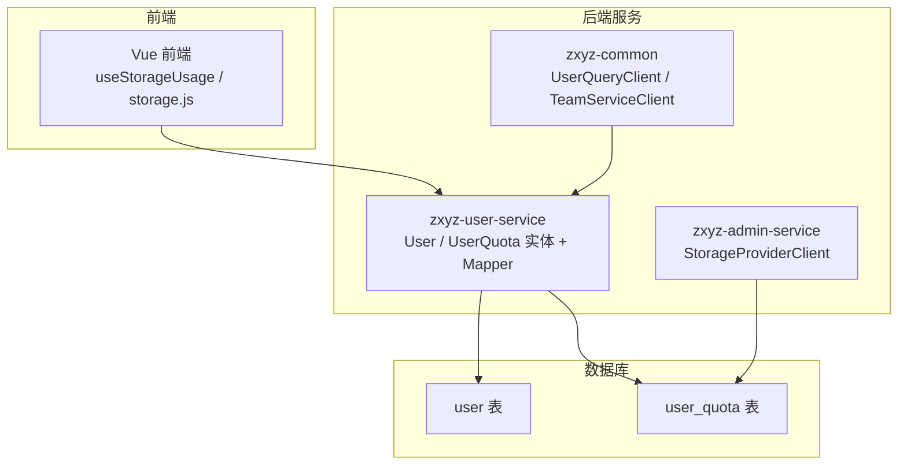
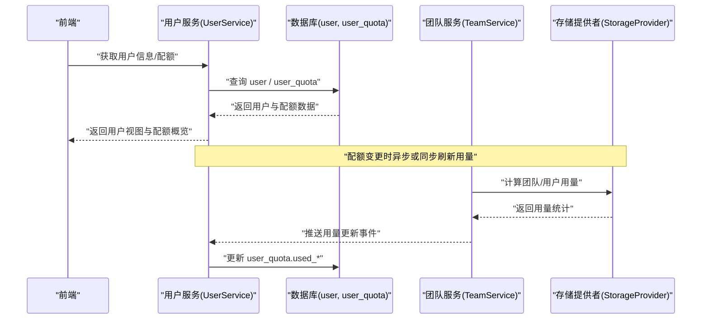
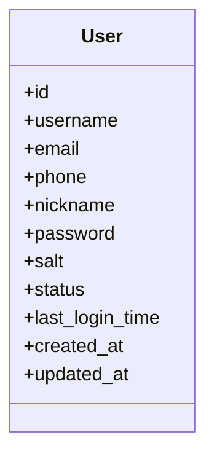
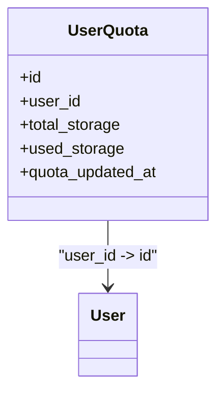
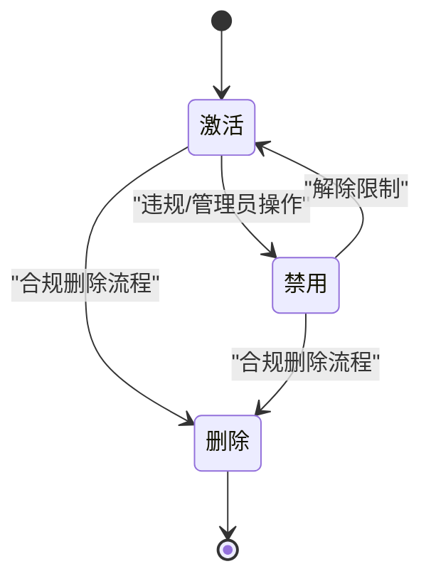
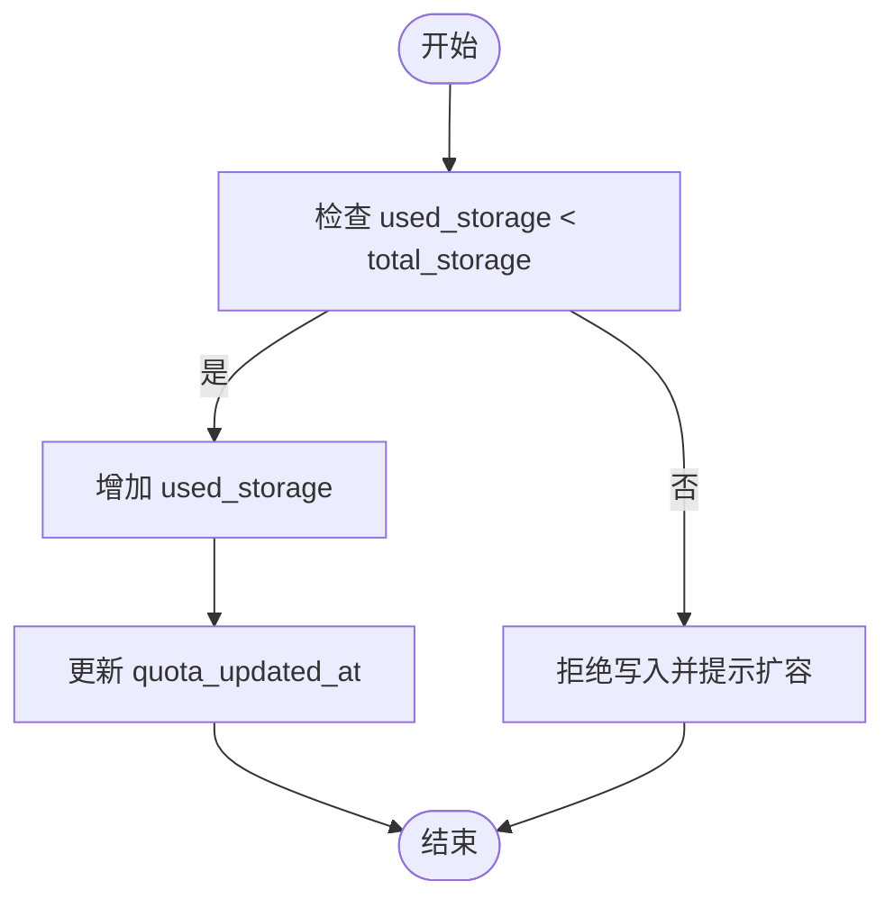
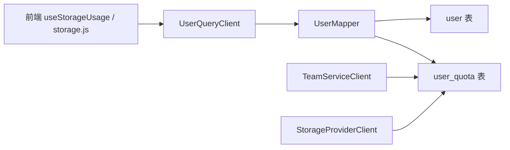
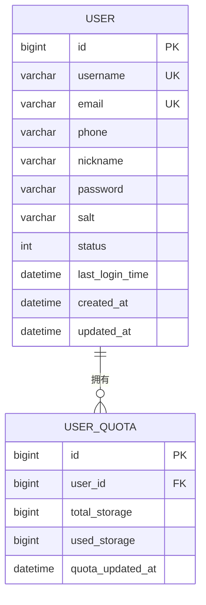

# 用户实体模型

<cite>
**本文引用的文件**   
- [schema_user.sql](file://ZXYZdatabaseBack/sql/schema_user.sql)
- [User.java](file://ZXYZdatabaseBack/zxyz-user-service/src/main/java/uno/acloud/user/entity/User.java)
- [UserQuota.java](file://ZXYZdatabaseBack/zxyz-user-service/src/main/java/uno/acloud/user/entity/UserQuota.java)
- [UserMapper.java](file://ZXYZdatabaseBack/zxyz-user-service/src/main/java/uno/acloud/user/mapper/UserMapper.java)
- [UserQueryClient.java](file://ZXYZdatabaseBack/zxyz-common/src/main/java/uno/acloud/client/UserQueryClient.java)
- [TeamServiceClient.java](file://ZXYZdatabaseBack/zxyz-common/src/main/java/uno/acloud/client/TeamServiceClient.java)
- [StorageProviderClient.java](file://ZXYZdatabaseBack/zxyz-admin-service/src/main/java/uno/acloud/admin/client/StorageProviderClient.java)
- [useStorageUsage.js](file://ZXYZdatabaseFront/src/composables/useStorageUsage.js)
- [storage.js](file://ZXYZdatabaseFront/src/api/storage.js)
</cite>

## 目录
1. [引言](#引言)
2. [项目结构](#项目结构)
3. [核心组件](#核心组件)
4. [架构总览](#架构总览)
5. [详细组件分析](#详细组件分析)
6. [依赖关系分析](#依赖关系分析)
7. [性能考量](#性能考量)
8. [故障排查指南](#故障排查指南)
9. [结论](#结论)
10. [附录](#附录)

## 引言
本文件面向 ZXYZ 项目的“用户实体模型”，聚焦 User 与 UserQuota 两个核心实体的数据结构设计、字段语义、约束与校验规则，以及用户状态管理与配额管理机制。文档同时给出 ER 图与字段关系矩阵，帮助读者快速理解用户数据在系统内的流转与使用方式。

## 项目结构
围绕用户实体相关的关键位置如下：
- 数据库定义：SQL 脚本中定义 user 与 user_quota 表结构与索引
- 后端实体与映射：zxyz-user-service 模块中的实体类与 Mapper
- 跨服务调用：zxyz-common 中的 UserQueryClient、TeamServiceClient；admin 服务的 StorageProviderClient
- 前端展示与监控：Vue 组合式函数 useStorageUsage 与 storage API 封装

图表来源
- [schema_user.sql](file://ZXYZdatabaseBack/sql/schema_user.sql)
- [User.java](file://ZXYZdatabaseBack/zxyz-user-service/src/main/java/uno/acloud/user/entity/User.java)
- [UserQuota.java](file://ZXYZdatabaseBack/zxyz-user-service/src/main/java/uno/acloud/user/entity/UserQuota.java)
- [UserQueryClient.java](file://ZXYZdatabaseBack/zxyz-common/src/main/java/uno/acloud/client/UserQueryClient.java)
- [TeamServiceClient.java](file://ZXYZdatabaseBack/zxyz-common/src/main/java/uno/acloud/client/TeamServiceClient.java)
- [StorageProviderClient.java](file://ZXYZdatabaseBack/zxyz-admin-service/src/main/java/uno/acloud/admin/client/StorageProviderClient.java)
- [useStorageUsage.js](file://ZXYZdatabaseFront/src/composables/useStorageUsage.js)
- [storage.js](file://ZXYZdatabaseFront/src/api/storage.js)

章节来源
- [schema_user.sql](file://ZXYZdatabaseBack/sql/schema_user.sql)
- [User.java](file://ZXYZdatabaseBack/zxyz-user-service/src/main/java/uno/acloud/user/entity/User.java)
- [UserQuota.java](file://ZXYZdatabaseBack/zxyz-user-service/src/main/java/uno/acloud/user/entity/UserQuota.java)

## 核心组件
- User 实体：承载用户基本信息、认证与安全相关字段、审计与状态字段
- UserQuota 实体：承载用户个人存储空间配额及用量统计，支撑配额限制与监控

章节来源
- [User.java](file://ZXYZdatabaseBack/zxyz-user-service/src/main/java/uno/acloud/user/entity/User.java)
- [UserQuota.java](file://ZXYZdatabaseBack/zxyz-user-service/src/main/java/uno/acloud/user/entity/UserQuota.java)

## 架构总览
用户实体在系统中的交互路径：
- 前端通过 API 获取当前用户信息与配额使用情况
- 用户服务提供查询与更新能力，持久化到 user 与 user_quota 表
- 团队服务与存储提供者协同，影响并同步用户/团队的配额使用量
- 管理端通过存储客户端对底层存储进行配额分配与用量采集

图表来源
- [UserQueryClient.java](file://ZXYZdatabaseBack/zxyz-common/src/main/java/uno/acloud/client/UserQueryClient.java)
- [TeamServiceClient.java](file://ZXYZdatabaseBack/zxyz-common/src/main/java/uno/acloud/client/TeamServiceClient.java)
- [StorageProviderClient.java](file://ZXYZdatabaseBack/zxyz-admin-service/src/main/java/uno/acloud/admin/client/StorageProviderClient.java)
- [UserMapper.java](file://ZXYZdatabaseBack/zxyz-user-service/src/main/java/uno/acloud/user/mapper/UserMapper.java)
- [schema_user.sql](file://ZXYZdatabaseBack/sql/schema_user.sql)

## 详细组件分析

### User 实体（用户主表）
- 业务职责
  - 唯一标识用户身份
  - 维护登录认证与安全相关字段
  - 记录用户基本资料与状态
- 关键字段说明（类型、约束、含义）
  - id：主键，唯一标识用户
  - username：用户名，唯一，用于登录与显示
  - email：邮箱，唯一，用于通知与找回
  - phone：手机号，可选，用于联系与验证
  - nickname：昵称，非必填，展示用
  - password：密码密文，加密存储
  - salt：盐值，增强密码安全性
  - status：用户状态（如激活、禁用、删除等），受状态机控制
  - last_login_time：最近登录时间，用于安全审计与活跃度统计
- 状态管理机制
  - 激活：注册完成并通过验证后进入激活状态
  - 禁用：管理员或策略触发，禁止登录与资源访问
  - 删除：软删除标记，保留历史关联数据但不可见
  - 转换规则
    - 激活 → 禁用：违反策略或管理员操作
    - 禁用 → 激活：解除限制
    - 任意 → 删除：合规清理流程，保留审计轨迹
- 数据验证与安全策略
  - 用户名/邮箱格式校验与唯一性约束
  - 密码强度策略（长度、复杂度）与定期更换建议
  - 敏感字段脱敏输出（如手机号、邮箱）
- 审计与追踪
  - 创建时间、更新时间、最近登录时间等审计字段
  - 与操作日志服务联动，记录关键变更

图表来源
- [schema_user.sql](file://ZXYZdatabaseBack/sql/schema_user.sql)
- [User.java](file://ZXYZdatabaseBack/zxyz-user-service/src/main/java/uno/acloud/user/entity/User.java)

章节来源
- [schema_user.sql](file://ZXYZdatabaseBack/sql/schema_user.sql)
- [User.java](file://ZXYZdatabaseBack/zxyz-user-service/src/main/java/uno/acloud/user/entity/User.java)

### UserQuota 实体（用户配额）
- 业务职责
  - 记录用户个人存储空间配额上限与已用量
  - 为配额限制与预警提供数据基础
- 关键字段说明（类型、约束、含义）
  - id：主键，唯一标识配额记录
  - user_id：外键，关联 user.id
  - total_storage：个人存储空间总量（配额上限）
  - used_storage：已使用存储空间
  - quota_updated_at：配额用量最后更新时间
- 配额使用限制与监控
  - 写入前检查 used_storage < total_storage
  - 接近阈值（如 80%、95%）触发预警
  - 超限拒绝新增写入并提示扩容
- 与团队配额的关系
  - 用户配额与团队配额相互独立，但共享底层存储资源
  - 团队维度用量由团队服务聚合，必要时回写至用户维度做参考

图表来源
- [schema_user.sql](file://ZXYZdatabaseBack/sql/schema_user.sql)
- [UserQuota.java](file://ZXYZdatabaseBack/zxyz-user-service/src/main/java/uno/acloud/user/entity/UserQuota.java)

章节来源
- [schema_user.sql](file://ZXYZdatabaseBack/sql/schema_user.sql)
- [UserQuota.java](file://ZXYZdatabaseBack/zxyz-user-service/src/main/java/uno/acloud/user/entity/UserQuota.java)

### 用户状态机（状态转换规则）

图表来源
- [schema_user.sql](file://ZXYZdatabaseBack/sql/schema_user.sql)
- [User.java](file://ZXYZdatabaseBack/zxyz-user-service/src/main/java/uno/acloud/user/entity/User.java)

### 配额校验与用量更新流程

图表来源
- [schema_user.sql](file://ZXYZdatabaseBack/sql/schema_user.sql)
- [UserQuota.java](file://ZXYZdatabaseBack/zxyz-user-service/src/main/java/uno/acloud/user/entity/UserQuota.java)

## 依赖关系分析
- 用户服务内部依赖
  - UserMapper：负责 user 与 user_quota 表的读写映射
- 跨服务依赖
  - UserQueryClient：供其他服务查询用户信息（窄接口投影）
  - TeamServiceClient：读取团队维度配额与成员关系，辅助用户配额决策
  - StorageProviderClient：管理端与存储提供者交互，获取/更新用量
- 前端依赖
  - useStorageUsage：组合式函数封装配额使用量的获取与展示逻辑
  - storage.js：API 封装，统一请求与错误处理

图表来源
- [UserMapper.java](file://ZXYZdatabaseBack/zxyz-user-service/src/main/java/uno/acloud/user/mapper/UserMapper.java)
- [UserQueryClient.java](file://ZXYZdatabaseBack/zxyz-common/src/main/java/uno/acloud/client/UserQueryClient.java)
- [TeamServiceClient.java](file://ZXYZdatabaseBack/zxyz-common/src/main/java/uno/acloud/client/TeamServiceClient.java)
- [StorageProviderClient.java](file://ZXYZdatabaseBack/zxyz-admin-service/src/main/java/uno/acloud/admin/client/StorageProviderClient.java)
- [useStorageUsage.js](file://ZXYZdatabaseFront/src/composables/useStorageUsage.js)
- [storage.js](file://ZXYZdatabaseFront/src/api/storage.js)

章节来源
- [UserMapper.java](file://ZXYZdatabaseBack/zxyz-user-service/src/main/java/uno/acloud/user/mapper/UserMapper.java)
- [UserQueryClient.java](file://ZXYZdatabaseBack/zxyz-common/src/main/java/uno/acloud/client/UserQueryClient.java)
- [TeamServiceClient.java](file://ZXYZdatabaseBack/zxyz-common/src/main/java/uno/acloud/client/TeamServiceClient.java)
- [StorageProviderClient.java](file://ZXYZdatabaseBack/zxyz-admin-service/src/main/java/uno/acloud/admin/client/StorageProviderClient.java)
- [useStorageUsage.js](file://ZXYZdatabaseFront/src/composables/useStorageUsage.js)
- [storage.js](file://ZXYZdatabaseFront/src/api/storage.js)

## 性能考量
- 索引与查询
  - user.username、user.email 建立唯一索引，加速登录与注册校验
  - user_quota.user_id 建立索引，提升按用户查询用量效率
- 读写分离与缓存
  - 用户信息可短期缓存（如 Redis），降低热点读压力
  - 配额用量更新采用增量更新，避免全量扫描
- 事务边界
  - 配额更新与审计记录在同一事务内，保证一致性
- 并发控制
  - 配额更新使用乐观锁或行级锁，防止超卖

[本节为通用指导，不直接分析具体文件]

## 故障排查指南
- 常见问题
  - 登录失败：检查 status 是否为激活，last_login_time 是否异常
  - 配额不足：核对 total_storage 与 used_storage，确认是否有未释放的临时空间
  - 数据不一致：比对团队服务与用户服务的用量统计，定位延迟或丢失
- 排查步骤
  - 查看 user 与 user_quota 表记录与更新时间戳
  - 检查跨服务调用链路（UserQueryClient、TeamServiceClient、StorageProviderClient）
  - 审查前端配额展示逻辑（useStorageUsage、storage.js）
- 日志与审计
  - 结合审计服务日志，回溯用户状态与配额变更轨迹

章节来源
- [UserMapper.java](file://ZXYZdatabaseBack/zxyz-user-service/src/main/java/uno/acloud/user/mapper/UserMapper.java)
- [UserQueryClient.java](file://ZXYZdatabaseBack/zxyz-common/src/main/java/uno/acloud/client/UserQueryClient.java)
- [TeamServiceClient.java](file://ZXYZdatabaseBack/zxyz-common/src/main/java/uno/acloud/client/TeamServiceClient.java)
- [StorageProviderClient.java](file://ZXYZdatabaseBack/zxyz-admin-service/src/main/java/uno/acloud/admin/client/StorageProviderClient.java)
- [useStorageUsage.js](file://ZXYZdatabaseFront/src/composables/useStorageUsage.js)
- [storage.js](file://ZXYZdatabaseFront/src/api/storage.js)

## 结论
User 与 UserQuota 构成了 ZXYZ 用户体系的核心数据基座。通过严格的字段约束、状态机与配额校验机制，系统在安全、一致性与可扩展性方面具备良好基础。配合跨服务协作与前端监控，可实现完整的用户生命周期与配额管理能力。

[本节为总结性内容，不直接分析具体文件]

## 附录

### ER 图（用户与配额）

图表来源
- [schema_user.sql](file://ZXYZdatabaseBack/sql/schema_user.sql)

### 字段关系矩阵（User ↔ UserQuota）
- user.id ↔ user_quota.user_id：一对一主从关系
- 配额校验：user_quota.total_storage 作为上限，user_quota.used_storage 作为已用量
- 状态影响：user.status 为禁用或删除时，限制配额写入与展示
- 审计联动：user.updated_at 与 user_quota.quota_updated_at 保持时间一致性

章节来源
- [schema_user.sql](file://ZXYZdatabaseBack/sql/schema_user.sql)
- [User.java](file://ZXYZdatabaseBack/zxyz-user-service/src/main/java/uno/acloud/user/entity/User.java)
- [UserQuota.java](file://ZXYZdatabaseBack/zxyz-user-service/src/main/java/uno/acloud/user/entity/UserQuota.java)