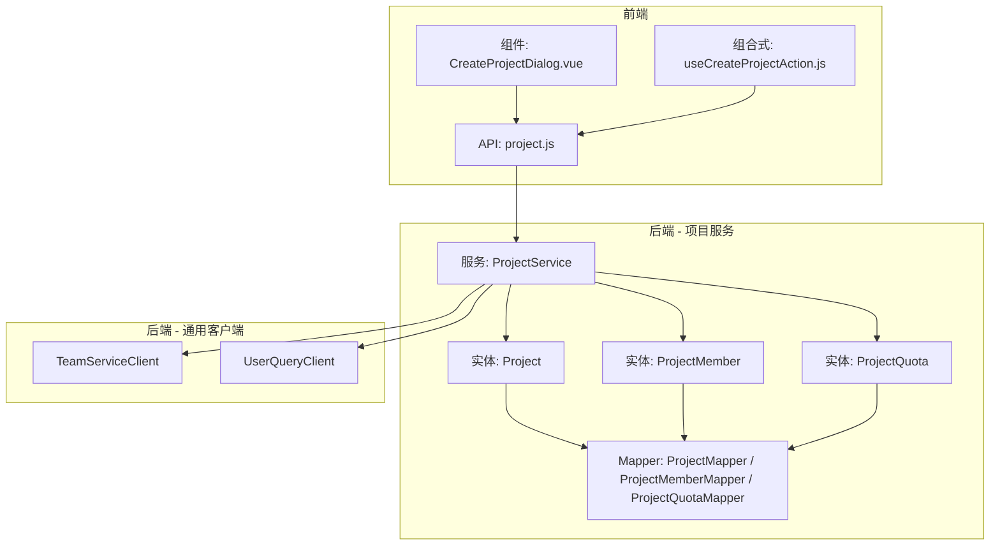
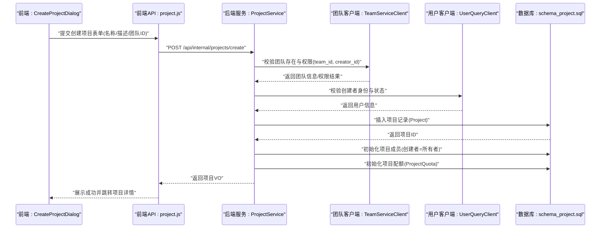
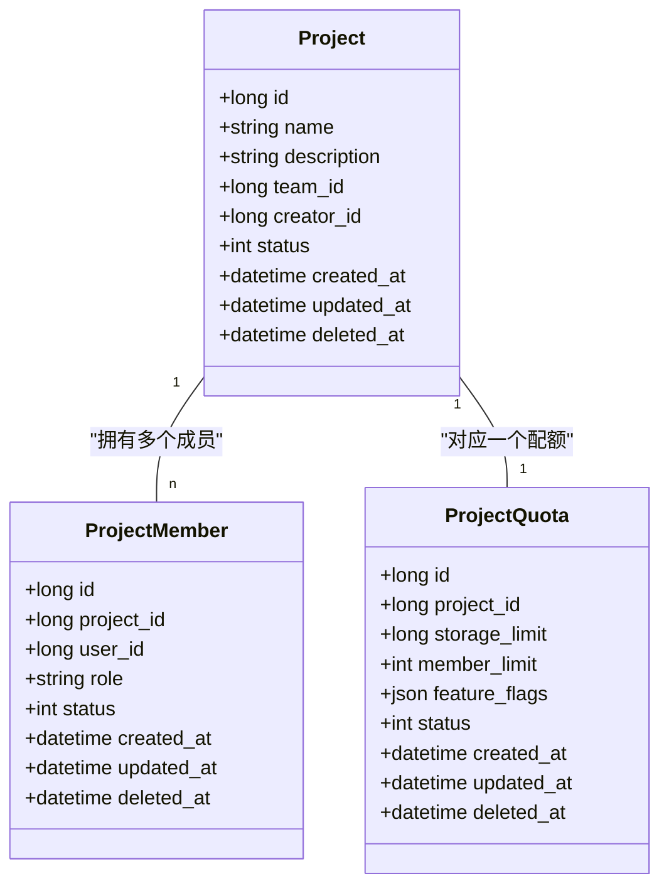
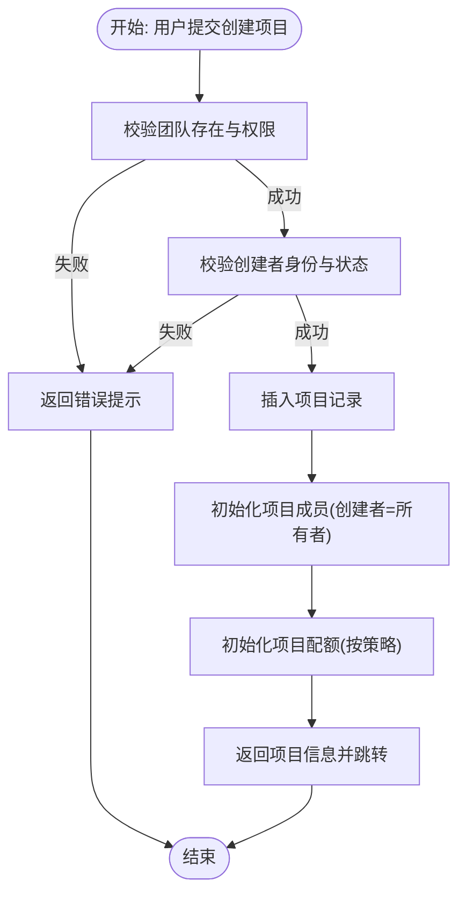
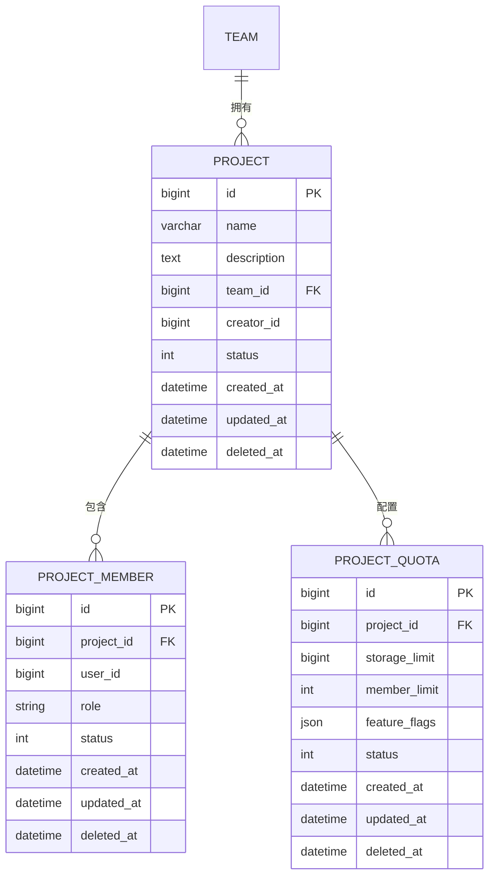
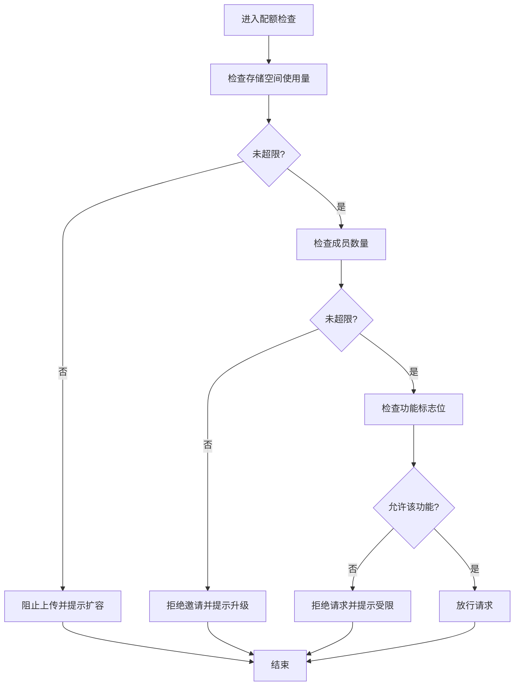
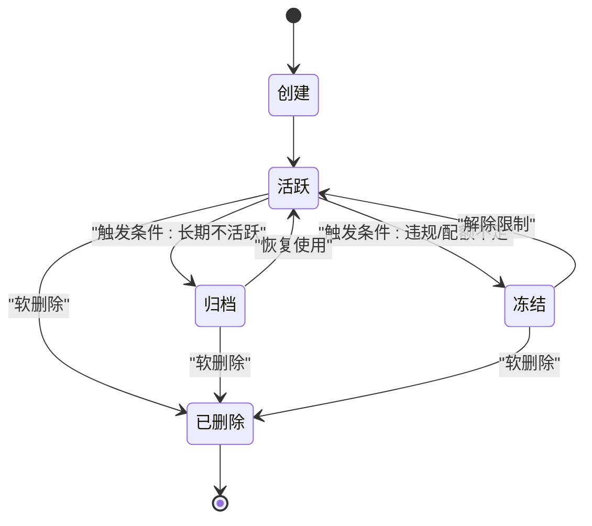
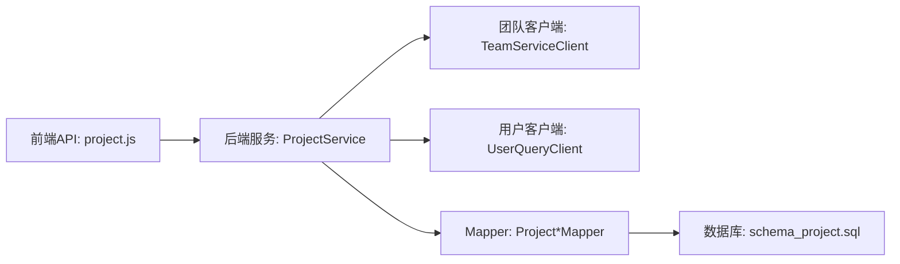

# 项目实体模型

<cite>
**本文引用的文件**   
- [schema_project.sql](file://ZXYZdatabaseBack/sql/schema_project.sql)
- [Project.java](file://ZXYZdatabaseBack/zxyz-project-service/src/main/java/uno/acloud/project/entity/Project.java)
- [ProjectMember.java](file://ZXYZdatabaseBack/zxyz-project-service/src/main/java/uno/acloud/project/entity/ProjectMember.java)
- [ProjectQuota.java](file://ZXYZdatabaseBack/zxyz-project-service/src/main/java/uno/acloud/project/entity/ProjectQuota.java)
- [ProjectService.java](file://ZXYZdatabaseBack/zxyz-project-service/src/main/java/uno/acloud/project/service/ProjectService.java)
- [TeamServiceClient.java](file://ZXYZdatabaseBack/zxyz-common/src/main/java/uno/acloud/client/TeamServiceClient.java)
- [UserQueryClient.java](file://ZXYZdatabaseBack/zxyz-common/src/main/java/uno/acloud/client/UserQueryClient.java)
- [project.js](file://ZXYZdatabaseFront/src/api/project.js)
- [CreateProjectDialog.vue](file://ZXYZdatabaseFront/src/components/CreateProjectDialog.vue)
- [useCreateProjectAction.js](file://ZXYZdatabaseFront/src/composables/useCreateProjectAction.js)
- [team.js](file://ZXYZdatabaseFront/src/api/team.js)
</cite>

## 目录
1. [简介](#简介)
2. [项目结构](#项目结构)
3. [核心组件](#核心组件)
4. [架构总览](#架构总览)
5. [详细组件分析](#详细组件分析)
6. [依赖关系分析](#依赖关系分析)
7. [性能考虑](#性能考虑)
8. [故障排查指南](#故障排查指南)
9. [结论](#结论)
10. [附录](#附录)

## 简介
本文件面向 ZXYZ 项目的“项目”领域，系统性梳理 Project、ProjectMember、ProjectQuota 等核心实体的数据结构设计，说明项目基本信息字段（id、name、description、team_id、creator_id 等）、成员管理与配额控制字段，解释项目与团队的从属关系、创建流程、成员继承机制与权限传递规则；同时给出角色体系（所有者、管理员、开发者、访客）的权限范围、配额管理（存储空间、成员数量、协作功能限制），以及生命周期管理（含软删除与归档策略）。文末提供 ER 图与成员权限矩阵，帮助读者快速理解并落地实现。

## 项目结构
围绕“项目”领域的代码分布在后端 zxyz-project-service 模块与前端 API/组件中：
- 后端实体定义位于 entity 包，服务逻辑位于 service 包，数据访问位于 mapper 包。
- 数据库表结构与迁移脚本位于 sql/schema_project.sql。
- 前端通过 api/project.js 调用后端接口，CreateProjectDialog 与 useCreateProjectAction 封装创建交互与状态。

图表来源
- [Project.java](file://ZXYZdatabaseBack/zxyz-project-service/src/main/java/uno/acloud/project/entity/Project.java)
- [ProjectMember.java](file://ZXYZdatabaseBack/zxyz-project-service/src/main/java/uno/acloud/project/entity/ProjectMember.java)
- [ProjectQuota.java](file://ZXYZdatabaseBack/zxyz-project-service/src/main/java/uno/acloud/project/entity/ProjectQuota.java)
- [ProjectService.java](file://ZXYZdatabaseBack/zxyz-project-service/src/main/java/uno/acloud/project/service/ProjectService.java)
- [TeamServiceClient.java](file://ZXYZdatabaseBack/zxyz-common/src/main/java/uno/acloud/client/TeamServiceClient.java)
- [UserQueryClient.java](file://ZXYZdatabaseBack/zxyz-common/src/main/java/uno/acloud/client/UserQueryClient.java)
- [project.js](file://ZXYZdatabaseFront/src/api/project.js)
- [CreateProjectDialog.vue](file://ZXYZdatabaseFront/src/components/CreateProjectDialog.vue)
- [useCreateProjectAction.js](file://ZXYZdatabaseFront/src/composables/useCreateProjectAction.js)

章节来源
- [schema_project.sql](file://ZXYZdatabaseBack/sql/schema_project.sql)
- [Project.java](file://ZXYZdatabaseBack/zxyz-project-service/src/main/java/uno/acloud/project/entity/Project.java)
- [ProjectMember.java](file://ZXYZdatabaseBack/zxyz-project-service/src/main/java/uno/acloud/project/entity/ProjectMember.java)
- [ProjectQuota.java](file://ZXYZdatabaseBack/zxyz-project-service/src/main/java/uno/acloud/project/entity/ProjectQuota.java)
- [ProjectService.java](file://ZXYZdatabaseBack/zxyz-project-service/src/main/java/uno/acloud/project/service/ProjectService.java)
- [project.js](file://ZXYZdatabaseFront/src/api/project.js)
- [CreateProjectDialog.vue](file://ZXYZdatabaseFront/src/components/CreateProjectDialog.vue)
- [useCreateProjectAction.js](file://ZXYZdatabaseFront/src/composables/useCreateProjectAction.js)

## 核心组件
本节聚焦三大核心实体及其职责边界：
- Project：项目主实体，承载项目基本信息、归属团队、创建者、状态与审计字段。
- ProjectMember：项目成员关联实体，记录成员在项目中拥有的角色与权限上下文。
- ProjectQuota：项目配额实体，约束存储空间、成员上限与协作能力开关。

关键要点
- 项目与团队为多对一关系（team_id 外键），项目创建需校验团队存在性与当前用户团队权限。
- 项目成员角色决定操作权限，默认创建者为项目所有者。
- 配额由系统或团队策略下发，项目内存储使用量与配额阈值联动触发告警或限制。

章节来源
- [Project.java](file://ZXYZdatabaseBack/zxyz-project-service/src/main/java/uno/acloud/project/entity/Project.java)
- [ProjectMember.java](file://ZXYZdatabaseBack/zxyz-project-service/src/main/java/uno/acloud/project/entity/ProjectMember.java)
- [ProjectQuota.java](file://ZXYZdatabaseBack/zxyz-project-service/src/main/java/uno/acloud/project/entity/ProjectQuota.java)
- [schema_project.sql](file://ZXYZdatabaseBack/sql/schema_project.sql)

## 架构总览
项目领域采用传统分层（controller → service → mapper → entity），并通过通用客户端与团队、用户服务交互，遵循窄端点与投影模式。

图表来源
- [ProjectService.java](file://ZXYZdatabaseBack/zxyz-project-service/src/main/java/uno/acloud/project/service/ProjectService.java)
- [TeamServiceClient.java](file://ZXYZdatabaseBack/zxyz-common/src/main/java/uno/acloud/client/TeamServiceClient.java)
- [UserQueryClient.java](file://ZXYZdatabaseBack/zxyz-common/src/main/java/uno/acloud/client/UserQueryClient.java)
- [schema_project.sql](file://ZXYZdatabaseBack/sql/schema_project.sql)
- [project.js](file://ZXYZdatabaseFront/src/api/project.js)
- [CreateProjectDialog.vue](file://ZXYZdatabaseFront/src/components/CreateProjectDialog.vue)

## 详细组件分析

### 实体类与数据模型
- Project：包含 id、name、description、team_id、creator_id、状态、时间戳等基础字段，用于标识与描述项目、归属团队与创建者。
- ProjectMember：包含 project_id、user_id、role、状态与审计字段，用于表达成员在项目中的角色与权限上下文。
- ProjectQuota：包含 project_id、storage_limit、member_limit、feature_flags、状态与审计字段，用于约束项目资源与协作能力。

图表来源
- [Project.java](file://ZXYZdatabaseBack/zxyz-project-service/src/main/java/uno/acloud/project/entity/Project.java)
- [ProjectMember.java](file://ZXYZdatabaseBack/zxyz-project-service/src/main/java/uno/acloud/project/entity/ProjectMember.java)
- [ProjectQuota.java](file://ZXYZdatabaseBack/zxyz-project-service/src/main/java/uno/acloud/project/entity/ProjectQuota.java)
- [schema_project.sql](file://ZXYZdatabaseBack/sql/schema_project.sql)

章节来源
- [Project.java](file://ZXYZdatabaseBack/zxyz-project-service/src/main/java/uno/acloud/project/entity/Project.java)
- [ProjectMember.java](file://ZXYZdatabaseBack/zxyz-project-service/src/main/java/uno/acloud/project/entity/ProjectMember.java)
- [ProjectQuota.java](file://ZXYZdatabaseBack/zxyz-project-service/src/main/java/uno/acloud/project/entity/ProjectQuota.java)
- [schema_project.sql](file://ZXYZdatabaseBack/sql/schema_project.sql)

### 项目与团队关系及创建流程
- 从属关系：Project.team_id 指向团队，确保项目属于特定团队空间。
- 创建流程：前端提交表单后，后端校验团队与创建者身份，写入项目记录，初始化成员（创建者为所有者）与配额（按团队策略或系统默认）。
- 权限传递：项目权限基于成员角色与团队权限叠加，创建者自动获得最高权限。

图表来源
- [ProjectService.java](file://ZXYZdatabaseBack/zxyz-project-service/src/main/java/uno/acloud/project/service/ProjectService.java)
- [TeamServiceClient.java](file://ZXYZdatabaseBack/zxyz-common/src/main/java/uno/acloud/client/TeamServiceClient.java)
- [UserQueryClient.java](file://ZXYZdatabaseBack/zxyz-common/src/main/java/uno/acloud/client/UserQueryClient.java)
- [project.js](file://ZXYZdatabaseFront/src/api/project.js)
- [CreateProjectDialog.vue](file://ZXYZdatabaseFront/src/components/CreateProjectDialog.vue)
- [useCreateProjectAction.js](file://ZXYZdatabaseFront/src/composables/useCreateProjectAction.js)

章节来源
- [ProjectService.java](file://ZXYZdatabaseBack/zxyz-project-service/src/main/java/uno/acloud/project/service/ProjectService.java)
- [project.js](file://ZXYZdatabaseFront/src/api/project.js)
- [CreateProjectDialog.vue](file://ZXYZdatabaseFront/src/components/CreateProjectDialog.vue)
- [useCreateProjectAction.js](file://ZXYZdatabaseFront/src/composables/useCreateProjectAction.js)

### 成员管理与角色体系
- 角色定义：
  - 所有者：对项目拥有完全控制权，包括成员管理、配额调整、项目设置与删除。
  - 管理员：可管理成员与部分设置，但不能删除项目或修改核心配额。
  - 开发者：可读写项目内容，参与协作，但无成员管理权限。
  - 访客：只读访问，不可编辑或删除。
- 继承机制：新成员加入项目时，若具备团队管理员权限，可按策略赋予更高项目角色；否则默认授予开发者或访客。
- 权限判定：以项目成员角色为主，结合团队权限进行最终决策。

图表来源
- [schema_project.sql](file://ZXYZdatabaseBack/sql/schema_project.sql)

章节来源
- [ProjectMember.java](file://ZXYZdatabaseBack/zxyz-project-service/src/main/java/uno/acloud/project/entity/ProjectMember.java)
- [schema_project.sql](file://ZXYZdatabaseBack/sql/schema_project.sql)

### 配额管理系统
- 存储空间配额：storage_limit 限制项目可用存储空间，超出则阻止新增文件上传或触发扩容流程。
- 成员数量限制：member_limit 限制项目最大成员数，超过则拒绝邀请或要求升级配额。
- 协作功能限制：feature_flags 控制是否启用评论、共享、外部协作等功能。
- 配额变更：由团队策略或管理员调整，变更后影响新项目或现有项目（视策略而定）。

图表来源
- [ProjectQuota.java](file://ZXYZdatabaseBack/zxyz-project-service/src/main/java/uno/acloud/project/entity/ProjectQuota.java)
- [schema_project.sql](file://ZXYZdatabaseBack/sql/schema_project.sql)

章节来源
- [ProjectQuota.java](file://ZXYZdatabaseBack/zxyz-project-service/src/main/java/uno/acloud/project/entity/ProjectQuota.java)
- [schema_project.sql](file://ZXYZdatabaseBack/sql/schema_project.sql)

### 生命周期管理与软删除、归档策略
- 生命周期阶段：创建 → 活跃 → 冻结/归档 → 删除（软删除）。
- 软删除：deleted_at 标记删除时间，查询时过滤已删除记录，支持回收站恢复。
- 归档策略：当项目长期不活跃或达到配额上限，可转入归档状态，限制写操作并保留读权限。
- 清理流程：定期扫描归档项目，执行数据压缩、冷存储迁移与审计日志归档。

图表来源
- [schema_project.sql](file://ZXYZdatabaseBack/sql/schema_project.sql)

章节来源
- [schema_project.sql](file://ZXYZdatabaseBack/sql/schema_project.sql)

### 前端交互与权限矩阵
- 前端创建项目：CreateProjectDialog 收集表单数据，useCreateProjectAction 调用 project.js 发起请求，处理响应与错误提示。
- 权限矩阵：不同角色对项目的操作权限如下所示（√ 表示允许，× 表示禁止）。

| 操作 | 所有者 | 管理员 | 开发者 | 访客 |
| --- | --- | --- | --- | --- |
| 查看项目 | √ | √ | √ | √ |
| 编辑项目信息 | √ | × | × | × |
| 管理成员 | √ | √ | × | × |
| 分配角色 | √ | × | × | × |
| 上传/下载文件 | √ | √ | √ | √ |
| 删除文件 | √ | √ | √ | × |
| 调整配额 | √ | × | × | × |
| 归档/解冻 | √ | × | × | × |
| 删除项目 | √ | × | × | × |

章节来源
- [project.js](file://ZXYZdatabaseFront/src/api/project.js)
- [CreateProjectDialog.vue](file://ZXYZdatabaseFront/src/components/CreateProjectDialog.vue)
- [useCreateProjectAction.js](file://ZXYZdatabaseFront/src/composables/useCreateProjectAction.js)

## 依赖关系分析
- 服务间依赖：ProjectService 依赖 TeamServiceClient 与 UserQueryClient，完成团队与用户校验。
- 数据依赖：实体与表结构严格对应，mapper 层负责持久化与查询。
- 前端依赖：project.js 暴露内部端点，组件与组合式函数封装调用与状态。

图表来源
- [ProjectService.java](file://ZXYZdatabaseBack/zxyz-project-service/src/main/java/uno/acloud/project/service/ProjectService.java)
- [TeamServiceClient.java](file://ZXYZdatabaseBack/zxyz-common/src/main/java/uno/acloud/client/TeamServiceClient.java)
- [UserQueryClient.java](file://ZXYZdatabaseBack/zxyz-common/src/main/java/uno/acloud/client/UserQueryClient.java)
- [project.js](file://ZXYZdatabaseFront/src/api/project.js)
- [schema_project.sql](file://ZXYZdatabaseBack/sql/schema_project.sql)

章节来源
- [ProjectService.java](file://ZXYZdatabaseBack/zxyz-project-service/src/main/java/uno/acloud/project/service/ProjectService.java)
- [TeamServiceClient.java](file://ZXYZdatabaseBack/zxyz-common/src/main/java/uno/acloud/client/TeamServiceClient.java)
- [UserQueryClient.java](file://ZXYZdatabaseBack/zxyz-common/src/main/java/uno/acloud/client/UserQueryClient.java)
- [project.js](file://ZXYZdatabaseFront/src/api/project.js)
- [schema_project.sql](file://ZXYZdatabaseBack/sql/schema_project.sql)

## 性能考虑
- 索引建议：为 project.team_id、project.creator_id、project_member.project_id、project_member.user_id、project_quota.project_id 建立索引，提升查询效率。
- 查询优化：分页查询项目列表时，避免全表扫描；成员与配额查询尽量使用投影 VO，减少数据传输。
- 配额检查：在高频路径（如上传、邀请）引入缓存或计数器，降低数据库压力。
- 软删除：查询时统一追加 deleted_at IS NULL 条件，避免业务层重复过滤。

[本节为通用指导，无需具体文件引用]

## 故障排查指南
- 创建项目失败：检查团队是否存在、创建者是否具备团队权限；确认内部端点鉴权与 Token 有效。
- 成员无法加入：核对项目成员上限与配额策略；确认用户状态与团队关系。
- 配额超限：检查 storage_limit 与当前使用量；查看 feature_flags 是否禁用相关功能。
- 软删除恢复：确认 deleted_at 是否为空；检查回收站权限与恢复流程。

章节来源
- [ProjectService.java](file://ZXYZdatabaseBack/zxyz-project-service/src/main/java/uno/acloud/project/service/ProjectService.java)
- [schema_project.sql](file://ZXYZdatabaseBack/sql/schema_project.sql)

## 结论
本项目实体模型以 Project、ProjectMember、ProjectQuota 为核心，清晰表达了项目与团队从属关系、成员角色体系与配额管理机制。通过严格的创建流程、权限传递与生命周期管理，保障了项目数据的完整性与安全性。ER 图与权限矩阵为设计与实现提供了直观参考，建议在后续迭代中持续优化索引与配额检查性能，完善归档与清理策略。

[本节为总结性内容，无需具体文件引用]

## 附录
- 术语说明：
  - 软删除：通过 deleted_at 标记删除，而非物理删除。
  - 配额：对存储空间、成员数量与功能的限制策略。
  - 角色：项目成员权限级别，如所有者、管理员、开发者、访客。
- 参考文件：
  - 数据库表结构：schema_project.sql
  - 实体与服务：Project.java、ProjectMember.java、ProjectQuota.java、ProjectService.java
  - 前端接口与组件：project.js、CreateProjectDialog.vue、useCreateProjectAction.js

[本节为补充信息，无需具体文件引用]