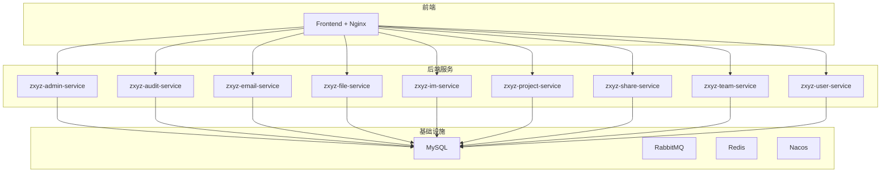
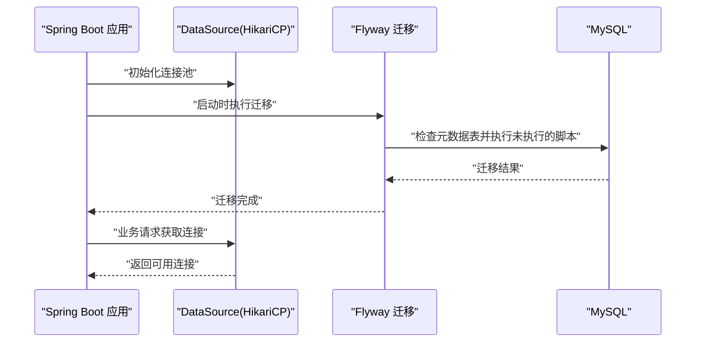
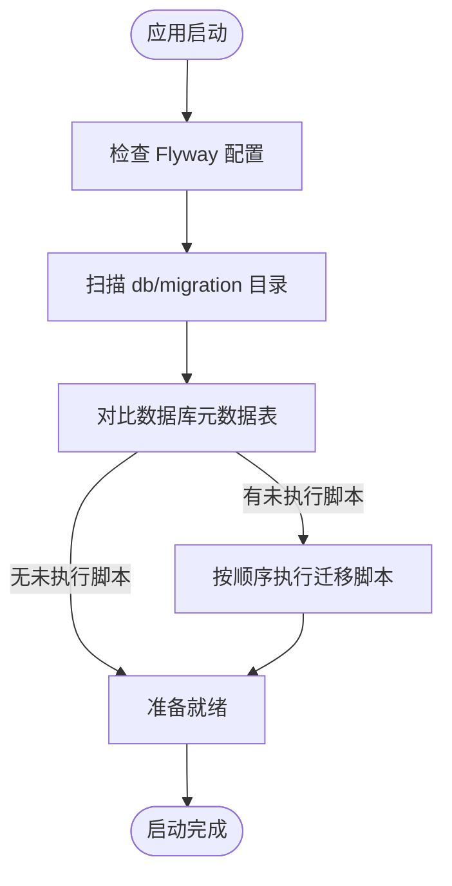
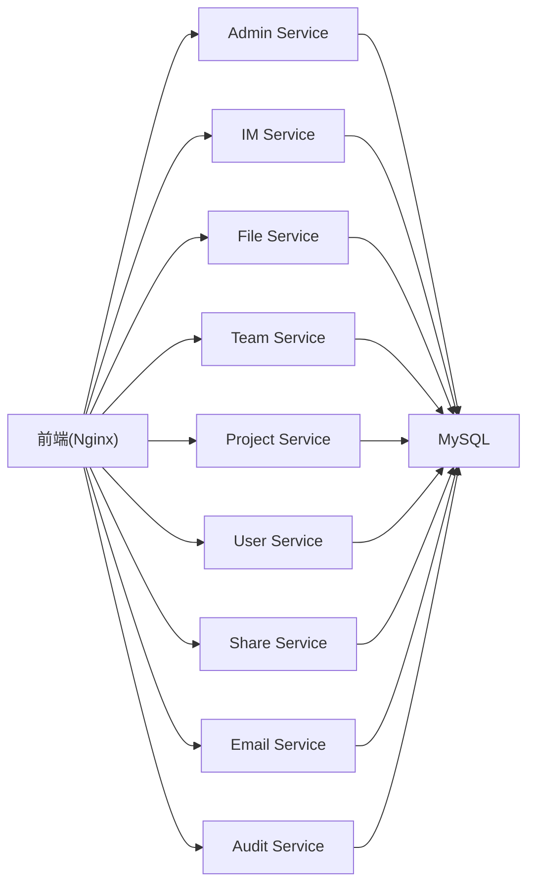

# MySQL数据库集成

<cite>
**本文引用的文件**
- [docker-compose.yml](file://docker-compose.yml)
- [docker-compose.dev.yml](file://docker-compose.dev.yml)
- [zxyz-database.service](file://ZXYZdatabaseBack/zxyz-project-service/deploy/zxyz-database.service)
- [application.yml（admin）](file://ZXYZdatabaseBack/zxyz-admin-service/src/main/resources/application.yml)
- [application-dev.yml（admin）](file://ZXYZdatabaseBack/zxyz-admin-service/src/main/resources/application-dev.yml)
- [application-prod.yml（admin）](file://ZXYZdatabaseBack/zxyz-admin-service/src/main/resources/application-prod.yml)
- [ConfigDataSourceConfig.java](file://ZXYZdatabaseBack/zxyz-admin-service/src/main/java/uno/acloud/admin/config/ConfigDataSourceConfig.java)
- [V1__init_config_schema.sql](file://ZXYZdatabaseBack/zxyz-admin-service/src/main/resources/db/migration/V1__init_config_schema.sql)
- [V2__hot_config_keys.sql](file://ZXYZdatabaseBack/zxyz-admin-service/src/main/resources/db/migration/V2__hot_config_keys.sql)
- [V3__fix_config_keys.sql](file://ZXYZdatabaseBack/zxyz-admin-service/src/main/resources/db/migration/V3__fix_config_keys.sql)
- [application.yml（audit）](file://ZXYZdatabaseBack/zxyz-audit-service/src/main/resources/application.yml)
- [application-dev.yml（audit）](file://ZXYZdatabaseBack/zxyz-audit-service/src/main/resources/application-dev.yml)
- [application-prod.yml（audit）](file://ZXYZdatabaseBack/zxyz-audit-service/src/main/resources/application-prod.yml)
- [V1__init_schema.sql（audit）](file://ZXYZdatabaseBack/zxyz-audit-service/src/main/resources/db/migration/V1__init_schema.sql)
- [V2__add_operate_log_before_after_values.sql（audit）](file://ZXYZdatabaseBack/zxyz-audit-service/src/main/resources/db/migration/V2__add_operate_log_before_after_values.sql)
- [V3__add_message_hash_unique.sql（audit）](file://ZXYZdatabaseBack/zxyz-audit-service/src/main/resources/db/migration/V3__add_message_hash_unique.sql)
- [application.yml（email）](file://ZXYZdatabaseBack/zxyz-email-service/src/main/resources/application.yml)
- [application-dev.yml（email）](file://ZXYZdatabaseBack/zxyz-email-service/src/main/resources/application-dev.yml)
- [application-prod.yml（email）](file://ZXYZdatabaseBack/zxyz-email-service/src/main/resources/application-prod.yml)
- [application.yml（file）](file://ZXYZdatabaseBack/zxyz-file-service/src/main/resources/application.yml)
- [application-dev.yml（file）](file://ZXYZdatabaseBack/zxyz-file-service/src/main/resources/application-dev.yml)
- [application-prod.yml（file）](file://ZXYZdatabaseBack/zxyz-file-service/src/main/resources/application-prod.yml)
- [application.yml（im）](file://ZXYZdatabaseBack/zxyz-im-service/src/main/resources/application.yml)
- [application-dev.yml（im）](file://ZXYZdatabaseBack/zxyz-im-service/src/main/resources/application-dev.yml)
- [application-prod.yml（im）](file://ZXYZdatabaseBack/zxyz-im-service/src/main/resources/application-prod.yml)
- [application.yml（project）](file://ZXYZdatabaseBack/zxyz-project-service/src/main/resources/application.yml)
- [application-dev.yml（project）](file://ZXYZdatabaseBack/zxyz-project-service/src/main/resources/application-dev.yml)
- [application-prod.yml（project）](file://ZXYZdatabaseBack/zxyz-project-service/src/main/resources/application-prod.yml)
- [application.yml（share）](file://ZXYZdatabaseBack/zxyz-share-service/src/main/resources/application.yml)
- [application-dev.yml（share）](file://ZXYZdatabaseBack/zxyz-share-service/src/main/resources/application-dev.yml)
- [application-prod.yml（share）](file://ZXYZdatabaseBack/zxyz-share-service/src/main/resources/application-prod.yml)
- [application.yml（team）](file://ZXYZdatabaseBack/zxyz-team-service/src/main/resources/application.yml)
- [application-dev.yml（team）](file://ZXYZdatabaseBack/zxyz-team-service/src/main/resources/application-dev.yml)
- [application-prod.yml（team）](file://ZXYZdatabaseBack/zxyz-team-service/src/main/resources/application-prod.yml)
- [application.yml（user）](file://ZXYZdatabaseBack/zxyz-user-service/src/main/resources/application.yml)
- [application-dev.yml（user）](file://ZXYZdatabaseBack/zxyz-user-service/src/main/resources/application-dev.yml)
- [application-prod.yml（user）](file://ZXYZdatabaseBack/zxyz-user-service/src/main/resources/application-prod.yml)
- [00-init-zxyz.sh](file://sql/00-init-zxyz.sh)
- [schema_user.sql](file://ZXYZdatabaseBack/sql/schema_user.sql)
- [schema_project.sql](file://ZXYZdatabaseBack/sql/schema_project.sql)
- [schema_team.sql](file://ZXYZdatabaseBack/sql/schema_team.sql)
- [schema_file.sql](file://ZXYZdatabaseBack/sql/schema_file.sql)
- [schema_email.sql](file://ZXYZdatabaseBack/sql/schema_email.sql)
- [schema_im.sql](file://ZXYZdatabaseBack/sql/schema_im.sql)
- [schema_share.sql](file://ZXYZdatabaseBack/sql/schema_share.sql)
- [schema_audit.sql](file://ZXYZdatabaseBack/sql/schema_audit.sql)
- [backup.sh](file://scripts/backup.sh)
- [health-check.sh](file://scripts/health-check.sh)
- [validate-env.sh](file://scripts/validate-env.sh)
</cite>

## 目录
1. [简介](#简介)
2. [项目结构](#项目结构)
3. [核心组件](#核心组件)
4. [架构总览](#架构总览)
5. [详细组件分析](#详细组件分析)
6. [依赖关系分析](#依赖关系分析)
7. [性能与连接池调优（HikariCP）](#性能与连接池调优hikaricp)
8. [事务管理配置](#事务管理配置)
9. [安全配置（SSL、权限、SQL注入防护）](#安全配置sslp权限sql注入防护)
10. [监控与慢查询分析](#监控与慢查询分析)
11. [故障排查指南](#故障排查指南)
12. [结论与最佳实践](#结论与最佳实践)
13. [附录：初始化与迁移流程](#附录初始化与迁移流程)

## 简介
本文件面向 ZXYZ 项目的 MySQL 数据库集成，覆盖 MyBatis-Plus 配置、连接池参数调优（HikariCP）、主从复制与读写分离策略、数据库初始化流程（Flyway 迁移脚本、分库分表策略、索引优化建议）、事务管理（声明式事务、分布式事务、隔离级别）、安全配置（SSL、用户权限、SQL注入防护）、性能监控指标、慢查询分析与连接池监控方法，以及常见问题排查与最佳实践。文档基于仓库中各服务 application*.yml、Flyway 迁移脚本、Docker Compose 编排与运维脚本进行归纳与说明，确保与实际实现一致。

## 项目结构
- 后端采用多模块 Maven 工程，每个业务服务均包含独立的 application.yml、application-dev.yml、application-prod.yml 配置文件，以及各自 db/migration 下的 Flyway 迁移脚本。
- 公共 SQL 脚本集中存放于 ZXYZdatabaseBack/sql 目录，用于一次性初始化或批量建库建表。
- Docker Compose 编排了 MySQL 及多个后端服务容器，便于本地与 CI 环境快速启动。
- 运维脚本提供备份、健康检查与环境校验等能力。

图表来源
- [docker-compose.yml](file://docker-compose.yml)
- [docker-compose.dev.yml](file://docker-compose.dev.yml)

章节来源
- [docker-compose.yml](file://docker-compose.yml)
- [docker-compose.dev.yml](file://docker-compose.dev.yml)

## 核心组件
- 数据源与连接池：各服务通过 Spring Boot 的 DataSource 与 HikariCP 管理连接池；部分服务存在自定义数据源配置类（如 admin 服务的 ConfigDataSourceConfig）。
- 持久层框架：MyBatis-Plus 在各服务中作为 ORM 使用，配合 Mapper 接口访问数据库。
- 数据库迁移：Flyway 负责版本化迁移，每个服务独立维护 db/migration 目录下的 SQL 脚本。
- 配置中心：Nacos 统一管理动态配置，敏感信息通过 Jasypt 加密。
- 运行环境：Docker Compose 编排 MySQL、Redis、RabbitMQ、Nacos 与各后端服务。

章节来源
- [application.yml（admin）](file://ZXYZdatabaseBack/zxyz-admin-service/src/main/resources/application.yml)
- [application-dev.yml（admin）](file://ZXYZdatabaseBack/zxyz-admin-service/src/main/resources/application-dev.yml)
- [application-prod.yml（admin）](file://ZXYZdatabaseBack/zxyz-admin-service/src/main/resources/application-prod.yml)
- [ConfigDataSourceConfig.java](file://ZXYZdatabaseBack/zxyz-admin-service/src/main/java/uno/acloud/admin/config/ConfigDataSourceConfig.java)
- [application.yml（audit）](file://ZXYZdatabaseBack/zxyz-audit-service/src/main/resources/application.yml)
- [application.yml（email）](file://ZXYZdatabaseBack/zxyz-email-service/src/main/resources/application.yml)
- [application.yml（file）](file://ZXYZdatabaseBack/zxyz-file-service/src/main/resources/application.yml)
- [application.yml（im）](file://ZXYZdatabaseBack/zxyz-im-service/src/main/resources/application.yml)
- [application.yml（project）](file://ZXYZdatabaseBack/zxyz-project-service/src/main/resources/application.yml)
- [application.yml（share）](file://ZXYZdatabaseBack/zxyz-share-service/src/main/resources/application.yml)
- [application.yml（team）](file://ZXYZdatabaseBack/zxyz-team-service/src/main/resources/application.yml)
- [application.yml（user）](file://ZXYZdatabaseBack/zxyz-user-service/src/main/resources/application.yml)

## 架构总览
ZXYZ 的后端服务通过各自的 application*.yml 配置 MySQL 数据源与连接池参数，并使用 Flyway 在启动时执行迁移脚本。MySQL 通常以单实例或主从模式部署（由运维侧决定），读写分离可通过应用层路由或中间件实现。Nacos 提供动态配置刷新，Jasypt 对敏感配置进行加密。

图表来源
- [application.yml（admin）](file://ZXYZdatabaseBack/zxyz-admin-service/src/main/resources/application.yml)
- [application-dev.yml（admin）](file://ZXYZdatabaseBack/zxyz-admin-service/src/main/resources/application-dev.yml)
- [application-prod.yml（admin）](file://ZXYZdatabaseBack/zxyz-admin-service/src/main/resources/application-prod.yml)
- [V1__init_config_schema.sql](file://ZXYZdatabaseBack/zxyz-admin-service/src/main/resources/db/migration/V1__init_config_schema.sql)
- [V2__hot_config_keys.sql](file://ZXYZdatabaseBack/zxyz-admin-service/src/main/resources/db/migration/V2__hot_config_keys.sql)
- [V3__fix_config_keys.sql](file://ZXYZdatabaseBack/zxyz-admin-service/src/main/resources/db/migration/V3__fix_config_keys.sql)

## 详细组件分析

### 数据源与连接池（HikariCP）
- 各服务通过 application*.yml 配置 spring.datasource 相关属性，包括 URL、用户名、密码、驱动类、连接池大小、超时、空闲回收等。
- HikariCP 默认启用，推荐根据 CPU 核数与 IO 特性调整最大连接数、连接超时、空闲超时等参数。
- 某些服务存在自定义数据源配置类（如 admin 的 ConfigDataSourceConfig），用于扩展或切换数据源。

章节来源
- [application.yml（admin）](file://ZXYZdatabaseBack/zxyz-admin-service/src/main/resources/application.yml)
- [application-dev.yml（admin）](file://ZXYZdatabaseBack/zxyz-admin-service/src/main/resources/application-dev.yml)
- [application-prod.yml（admin）](file://ZXYZdatabaseBack/zxyz-admin-service/src/main/resources/application-prod.yml)
- [ConfigDataSourceConfig.java](file://ZXYZdatabaseBack/zxyz-admin-service/src/main/java/uno/acloud/admin/config/ConfigDataSourceConfig.java)
- [application.yml（audit）](file://ZXYZdatabaseBack/zxyz-audit-service/src/main/resources/application.yml)
- [application.yml（email）](file://ZXYZdatabaseBack/zxyz-email-service/src/main/resources/application.yml)
- [application.yml（file）](file://ZXYZdatabaseBack/zxyz-file-service/src/main/resources/application.yml)
- [application.yml（im）](file://ZXYZdatabaseBack/zxyz-im-service/src/main/resources/application.yml)
- [application.yml（project）](file://ZXYZdatabaseBack/zxyz-project-service/src/main/resources/application.yml)
- [application.yml（share）](file://ZXYZdatabaseBack/zxyz-share-service/src/main/resources/application.yml)
- [application.yml（team）](file://ZXYZdatabaseBack/zxyz-team-service/src/main/resources/application.yml)
- [application.yml（user）](file://ZXYZdatabaseBack/zxyz-user-service/src/main/resources/application.yml)

### MyBatis-Plus 配置
- 各服务通过 Spring Boot 自动装配 MyBatis-Plus，Mapper 接口扫描路径在 application*.yml 中配置。
- 分页插件、逻辑删除、驼峰映射等常用功能可按需开启。
- 建议在开发环境与生产环境分别配置不同的日志级别与 SQL 输出开关。

章节来源
- [application.yml（admin）](file://ZXYZdatabaseBack/zxyz-admin-service/src/main/resources/application.yml)
- [application-dev.yml（admin）](file://ZXYZdatabaseBack/zxyz-admin-service/src/main/resources/application-dev.yml)
- [application-prod.yml（admin）](file://ZXYZdatabaseBack/zxyz-admin-service/src/main/resources/application-prod.yml)
- [application.yml（audit）](file://ZXYZdatabaseBack/zxyz-audit-service/src/main/resources/application.yml)
- [application.yml（email）](file://ZXYZdatabaseBack/zxyz-email-service/src/main/resources/application.yml)
- [application.yml（file）](file://ZXYZdatabaseBack/zxyz-file-service/src/main/resources/application.yml)
- [application.yml（im）](file://ZXYZdatabaseBack/zxyz-im-service/src/main/resources/application.yml)
- [application.yml（project）](file://ZXYZdatabaseBack/zxyz-project-service/src/main/resources/application.yml)
- [application.yml（share）](file://ZXYZdatabaseBack/zxyz-share-service/src/main/resources/application.yml)
- [application.yml（team）](file://ZXYZdatabaseBack/zxyz-team-service/src/main/resources/application.yml)
- [application.yml（user）](file://ZXYZdatabaseBack/zxyz-user-service/src/main/resources/application.yml)

### 数据库初始化与 Flyway 迁移
- 每个服务在 src/main/resources/db/migration 下维护版本化的 SQL 迁移脚本，命名遵循 V{version}__description.sql。
- 启动时 Flyway 自动检测并执行未应用的迁移，保证数据库结构与代码同步。
- 公共初始化脚本位于 sql/00-init-zxyz.sh，用于批量创建数据库与用户。

图表来源
- [V1__init_config_schema.sql](file://ZXYZdatabaseBack/zxyz-admin-service/src/main/resources/db/migration/V1__init_config_schema.sql)
- [V2__hot_config_keys.sql](file://ZXYZdatabaseBack/zxyz-admin-service/src/main/resources/db/migration/V2__hot_config_keys.sql)
- [V3__fix_config_keys.sql](file://ZXYZdatabaseBack/zxyz-admin-service/src/main/resources/db/migration/V3__fix_config_keys.sql)
- [V1__init_schema.sql（audit）](file://ZXYZdatabaseBack/zxyz-audit-service/src/main/resources/db/migration/V1__init_schema.sql)
- [V2__add_operate_log_before_after_values.sql（audit）](file://ZXYZdatabaseBack/zxyz-audit-service/src/main/resources/db/migration/V2__add_operate_log_before_after_values.sql)
- [V3__add_message_hash_unique.sql（audit）](file://ZXYZdatabaseBack/zxyz-audit-service/src/main/resources/db/migration/V3__add_message_hash_unique.sql)
- [00-init-zxyz.sh](file://sql/00-init-zxyz.sh)

章节来源
- [application.yml（admin）](file://ZXYZdatabaseBack/zxyz-admin-service/src/main/resources/application.yml)
- [application-dev.yml（admin）](file://ZXYZdatabaseBack/zxyz-admin-service/src/main/resources/application-dev.yml)
- [application-prod.yml（admin）](file://ZXYZdatabaseBack/zxyz-admin-service/src/main/resources/application-prod.yml)
- [application.yml（audit）](file://ZXYZdatabaseBack/zxyz-audit-service/src/main/resources/application.yml)
- [application-dev.yml（audit）](file://ZXYZdatabaseBack/zxyz-audit-service/src/main/resources/application-dev.yml)
- [application-prod.yml（audit）](file://ZXYZdatabaseBack/zxyz-audit-service/src/main/resources/application-prod.yml)
- [00-init-zxyz.sh](file://sql/00-init-zxyz.sh)

### 分库分表策略
- 当前仓库未发现显式的分库分表框架配置（如 ShardingSphere）。若需要水平扩展，可在应用层按业务维度（如 team_id、project_id）进行路由与聚合。
- 建议在新增大表前评估分片键与热点键，避免跨分片事务与复杂 JOIN。

章节来源
- [application.yml（im）](file://ZXYZdatabaseBack/zxyz-im-service/src/main/resources/application.yml)
- [application.yml（file）](file://ZXYZdatabaseBack/zxyz-file-service/src/main/resources/application.yml)
- [application.yml（project）](file://ZXYZdatabaseBack/zxyz-project-service/src/main/resources/application.yml)
- [application.yml（team）](file://ZXYZdatabaseBack/zxyz-team-service/src/main/resources/application.yml)
- [application.yml（user）](file://ZXYZdatabaseBack/zxyz-user-service/src/main/resources/application.yml)

### 索引优化建议
- 为高频查询条件列建立复合索引，注意区分选择性高的列优先。
- 避免在 WHERE 子句中对索引列进行函数运算或类型转换。
- 定期使用 EXPLAIN 分析慢查询，确认索引命中与扫描行数。

章节来源
- [schema_user.sql](file://ZXYZdatabaseBack/sql/schema_user.sql)
- [schema_project.sql](file://ZXYZdatabaseBack/sql/schema_project.sql)
- [schema_team.sql](file://ZXYZdatabaseBack/sql/schema_team.sql)
- [schema_file.sql](file://ZXYZdatabaseBack/sql/schema_file.sql)
- [schema_email.sql](file://ZXYZdatabaseBack/sql/schema_email.sql)
- [schema_im.sql](file://ZXYZdatabaseBack/sql/schema_im.sql)
- [schema_share.sql](file://ZXYZdatabaseBack/sql/schema_share.sql)
- [schema_audit.sql](file://ZXYZdatabaseBack/sql/schema_audit.sql)

### 主从复制与读写分离策略
- 主从复制由 MySQL 自身机制保障，应用层可通过多数据源或代理实现读写分离。
- 读多写少场景可考虑将读请求路由至从库，写请求走主库；注意延迟容忍与一致性要求。
- 若引入中间件（如 ProxySQL、ShardingSphere），需在网关或服务层统一配置路由规则。

章节来源
- [docker-compose.yml](file://docker-compose.yml)
- [docker-compose.dev.yml](file://docker-compose.dev.yml)
- [zxyz-database.service](file://ZXYZdatabaseBack/zxyz-project-service/deploy/zxyz-database.service)

## 依赖关系分析
- 各后端服务依赖 MySQL、Redis、RabbitMQ、Nacos；前端通过 Nginx 反向代理到后端服务。
- 服务间调用通过内部 Token 鉴权，禁止公网访问 /api/internal/**。
- 数据库迁移与初始化脚本由各服务独立维护，确保服务解耦。

图表来源
- [docker-compose.yml](file://docker-compose.yml)
- [docker-compose.dev.yml](file://docker-compose.dev.yml)

章节来源
- [docker-compose.yml](file://docker-compose.yml)
- [docker-compose.dev.yml](file://docker-compose.dev.yml)

## 性能与连接池调优（HikariCP）
- 关键参数
  - maximumPoolSize：根据并发与数据库连接上限设置，通常为 CPU 核数的 2~4 倍。
  - connectionTimeout：连接获取超时，建议 1~5 秒。
  - idleTimeout：空闲连接回收时间，建议 10 分钟以内。
  - maxLifetime：连接最大生命周期，建议小于数据库 wait_timeout。
  - keepaliveTime：心跳保活时间，防止防火墙断连。
- 监控指标
  - 活跃连接数、等待队列长度、连接泄漏告警。
  - 慢查询数量、平均响应时间、错误率。
- 调优步骤
  - 压测观察连接池水位与数据库负载。
  - 逐步调整参数并验证稳定性。
  - 结合慢查询日志优化 SQL 与索引。

章节来源
- [application.yml（admin）](file://ZXYZdatabaseBack/zxyz-admin-service/src/main/resources/application.yml)
- [application-dev.yml（admin）](file://ZXYZdatabaseBack/zxyz-admin-service/src/main/resources/application-dev.yml)
- [application-prod.yml（admin）](file://ZXYZdatabaseBack/zxyz-admin-service/src/main/resources/application-prod.yml)
- [application.yml（audit）](file://ZXYZdatabaseBack/zxyz-audit-service/src/main/resources/application.yml)
- [application.yml（email）](file://ZXYZdatabaseBack/zxyz-email-service/src/main/resources/application.yml)
- [application.yml（file）](file://ZXYZdatabaseBack/zxyz-file-service/src/main/resources/application.yml)
- [application.yml（im）](file://ZXYZdatabaseBack/zxyz-im-service/src/main/resources/application.yml)
- [application.yml（project）](file://ZXYZdatabaseBack/zxyz-project-service/src/main/resources/application.yml)
- [application.yml（share）](file://ZXYZdatabaseBack/zxyz-share-service/src/main/resources/application.yml)
- [application.yml（team）](file://ZXYZdatabaseBack/zxyz-team-service/src/main/resources/application.yml)
- [application.yml（user）](file://ZXYZdatabaseBack/zxyz-user-service/src/main/resources/application.yml)

## 事务管理配置
- 声明式事务：在 Service 层使用 @Transactional 注解控制事务边界，注意传播行为与隔离级别。
- 分布式事务：跨服务调用建议使用消息最终一致性（RabbitMQ Topic Exchange zxyz.topic）补偿方案；必要时引入 Saga/TCC。
- 隔离级别：默认 READ_COMMITTED，读多写少场景可考虑 REPEATABLE_READ，但需注意锁竞争。

章节来源
- [application.yml（admin）](file://ZXYZdatabaseBack/zxyz-admin-service/src/main/resources/application.yml)
- [application.yml（audit）](file://ZXYZdatabaseBack/zxyz-audit-service/src/main/resources/application.yml)
- [application.yml（email）](file://ZXYZdatabaseBack/zxyz-email-service/src/main/resources/application.yml)
- [application.yml（file）](file://ZXYZdatabaseBack/zxyz-file-service/src/main/resources/application.yml)
- [application.yml（im）](file://ZXYZdatabaseBack/zxyz-im-service/src/main/resources/application.yml)
- [application.yml（project）](file://ZXYZdatabaseBack/zxyz-project-service/src/main/resources/application.yml)
- [application.yml（share）](file://ZXYZdatabaseBack/zxyz-share-service/src/main/resources/application.yml)
- [application.yml（team）](file://ZXYZdatabaseBack/zxyz-team-service/src/main/resources/application.yml)
- [application.yml（user）](file://ZXYZdatabaseBack/zxyz-user-service/src/main/resources/application.yml)

## 安全配置（SSL、权限、SQL注入防护）
- SSL 连接：在 MySQL 服务端启用 SSL，客户端配置 trustStore 与 sslMode=VERIFY_CA。
- 用户权限：最小权限原则，按服务划分数据库账号，限制远程登录与危险命令。
- SQL 注入防护：使用预编译语句（MyBatis-Plus 默认支持），避免字符串拼接；输入校验与白名单过滤。

章节来源
- [application.yml（admin）](file://ZXYZdatabaseBack/zxyz-admin-service/src/main/resources/application.yml)
- [application-dev.yml（admin）](file://ZXYZdatabaseBack/zxyz-admin-service/src/main/resources/application-dev.yml)
- [application-prod.yml（admin）](file://ZXYZdatabaseBack/zxyz-admin-service/src/main/resources/application-prod.yml)
- [application.yml（audit）](file://ZXYZdatabaseBack/zxyz-audit-service/src/main/resources/application.yml)
- [application.yml（email）](file://ZXYZdatabaseBack/zxyz-email-service/src/main/resources/application.yml)
- [application.yml（file）](file://ZXYZdatabaseBack/zxyz-file-service/src/main/resources/application.yml)
- [application.yml（im）](file://ZXYZdatabaseBack/zxyz-im-service/src/main/resources/application.yml)
- [application.yml（project）](file://ZXYZdatabaseBack/zxyz-project-service/src/main/resources/application.yml)
- [application.yml（share）](file://ZXYZdatabaseBack/zxyz-share-service/src/main/resources/application.yml)
- [application.yml（team）](file://ZXYZdatabaseBack/zxyz-team-service/src/main/resources/application.yml)
- [application.yml（user）](file://ZXYZdatabaseBack/zxyz-user-service/src/main/resources/application.yml)

## 监控与慢查询分析
- 监控指标
  - 连接池：活跃连接、等待队列、泄漏告警。
  - 数据库：QPS、TPS、慢查询数、锁等待、缓冲池命中率。
  - 应用：接口耗时、错误率、线程池状态。
- 慢查询分析
  - 开启 MySQL slow_query_log，设置 long_query_time。
  - 使用 EXPLAIN 分析执行计划，关注全表扫描与临时表。
- 连接池监控
  - 暴露 Actuator 端点或使用 APM 工具采集 HikariCP 指标。

章节来源
- [health-check.sh](file://scripts/health-check.sh)
- [application.yml（admin）](file://ZXYZdatabaseBack/zxyz-admin-service/src/main/resources/application.yml)
- [application.yml（audit）](file://ZXYZdatabaseBack/zxyz-audit-service/src/main/resources/application.yml)
- [application.yml（email）](file://ZXYZdatabaseBack/zxyz-email-service/src/main/resources/application.yml)
- [application.yml（file）](file://ZXYZdatabaseBack/zxyz-file-service/src/main/resources/application.yml)
- [application.yml（im）](file://ZXYZdatabaseBack/zxyz-im-service/src/main/resources/application.yml)
- [application.yml（project）](file://ZXYZdatabaseBack/zxyz-project-service/src/main/resources/application.yml)
- [application.yml（share）](file://ZXYZdatabaseBack/zxyz-share-service/src/main/resources/application.yml)
- [application.yml（team）](file://ZXYZdatabaseBack/zxyz-team-service/src/main/resources/application.yml)
- [application.yml（user）](file://ZXYZdatabaseBack/zxyz-user-service/src/main/resources/application.yml)

## 故障排查指南
- 连接池耗尽
  - 现象：请求阻塞、超时、连接泄漏告警。
  - 排查：查看最大连接数、慢查询、未关闭的连接。
- 迁移失败
  - 现象：启动时报 Flyway 错误。
  - 排查：检查脚本幂等性、字符集、权限。
- 主从延迟
  - 现象：读不一致、事务冲突。
  - 排查：监控复制延迟，优化写入热点。
- 权限不足
  - 现象：拒绝访问、无法创建对象。
  - 排查：核对账号权限与网络白名单。

章节来源
- [backup.sh](file://scripts/backup.sh)
- [health-check.sh](file://scripts/health-check.sh)
- [validate-env.sh](file://scripts/validate-env.sh)

## 结论与最佳实践
- 统一配置：通过 Nacos 集中管理数据库连接、连接池、迁移开关等配置。
- 严格迁移：每个服务独立维护 Flyway 脚本，确保可回滚与幂等。
- 性能优先：合理设置连接池参数，持续优化慢查询与索引。
- 安全第一：启用 SSL、最小权限、预编译语句，防范注入攻击。
- 可观测性：完善监控与告警，及时发现异常与瓶颈。

## 附录：初始化与迁移流程
- 初始化脚本
  - 使用 sql/00-init-zxyz.sh 批量创建数据库与用户。
  - 各服务启动时自动执行 Flyway 迁移脚本。
- 分库分表
  - 当前未启用分库分表框架，可按业务维度在应用层实现路由。
- 索引优化
  - 依据查询模式设计复合索引，定期审查慢查询。

章节来源
- [00-init-zxyz.sh](file://sql/00-init-zxyz.sh)
- [V1__init_config_schema.sql](file://ZXYZdatabaseBack/zxyz-admin-service/src/main/resources/db/migration/V1__init_config_schema.sql)
- [V2__hot_config_keys.sql](file://ZXYZdatabaseBack/zxyz-admin-service/src/main/resources/db/migration/V2__hot_config_keys.sql)
- [V3__fix_config_keys.sql](file://ZXYZdatabaseBack/zxyz-admin-service/src/main/resources/db/migration/V3__fix_config_keys.sql)
- [V1__init_schema.sql（audit）](file://ZXYZdatabaseBack/zxyz-audit-service/src/main/resources/db/migration/V1__init_schema.sql)
- [V2__add_operate_log_before_after_values.sql（audit）](file://ZXYZdatabaseBack/zxyz-audit-service/src/main/resources/db/migration/V2__add_operate_log_before_after_values.sql)
- [V3__add_message_hash_unique.sql（audit）](file://ZXYZdatabaseBack/zxyz-audit-service/src/main/resources/db/migration/V3__add_message_hash_unique.sql)