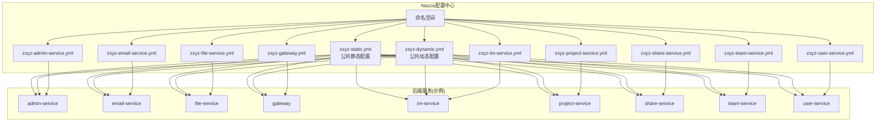
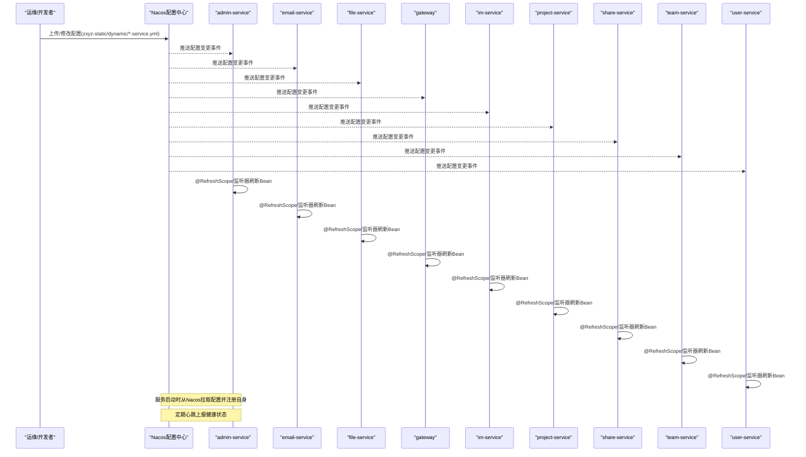
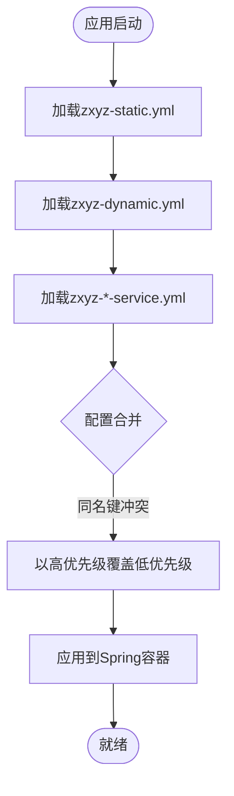
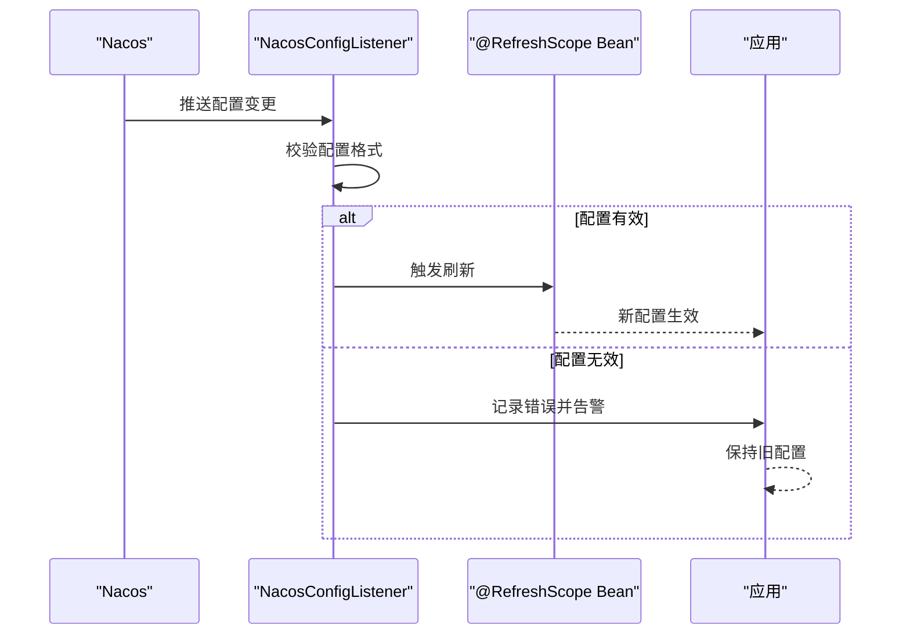
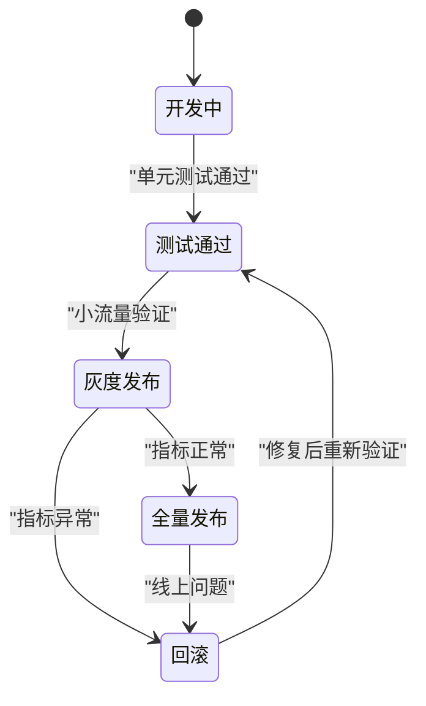
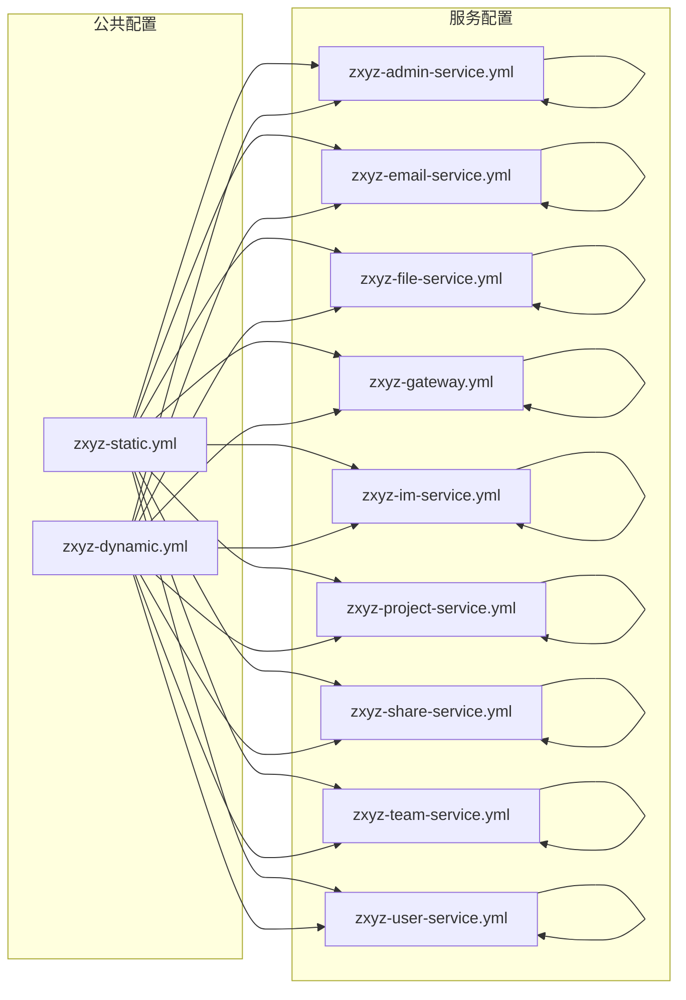

# Nacos配置中心集成

<cite>
**本文引用的文件**
- [nacos-config/zxyz-static.yml](file://nacos-config/zxyz-static.yml)
- [nacos-config/zxyz-dynamic.yml](file://nacos-config/zxyz-dynamic.yml)
- [nacos-config/zxyz-admin-service.yml](file://nacos-config/zxyz-admin-service.yml)
- [nacos-config/zxyz-audit-service.yml](file://nacos-config/zxyz-audit-service.yml)
- [nacos-config/zxyz-email-service.yml](file://nacos-config/zxyz-email-service.yml)
- [nacos-config/zxyz-file-service.yml](file://nacos-config/zxyz-file-service.yml)
- [nacos-config/zxyz-gateway.yml](file://nacos-config/zxyz-gateway.yml)
- [nacos-config/zxyz-im-service.yml](file://nacos-config/zxyz-im-service.yml)
- [nacos-config/zxyz-project-service.yml](file://nacos-config/zxyz-project-service.yml)
- [nacos-config/zxyz-share-service.yml](file://nacos-config/zxyz-share-service.yml)
- [nacos-config/zxyz-team-service.yml](file://nacos-config/zxyz-team-service.yml)
- [nacos-config/zxyz-user-service.yml](file://nacos-config/zxyz-user-service.yml)
- [nacos-config/import.sh](file://nacos-config/import.sh)
- [ZXYZdatabaseBack/zxyz-admin-service/src/main/resources/application.yml](file://ZXYZdatabaseBack/zxyz-admin-service/src/main/resources/application.yml)
- [ZXYZdatabaseBack/zxyz-admin-service/src/main/java/uno/acloud/admin/config/AdminServiceProperties.java](file://ZXYZdatabaseBack/zxyz-admin-service/src/main/java/uno/acloud/admin/config/AdminServiceProperties.java)
- [ZXYZdatabaseBack/zxyz-admin-service/src/main/java/uno/acloud/admin/controller/ConfigAdminController.java](file://ZXYZdatabaseBack/zxyz-admin-service/src/main/java/uno/acloud/admin/controller/ConfigAdminController.java)
- [ZXYZdatabaseBack/zxyz-admin-service/src/main/java/uno/acloud/admin/service/ConfigService.java](file://ZXYZdatabaseBack/zxyz-admin-service/src/main/java/uno/acloud/admin/service/ConfigService.java)
- [ZXYZdatabaseBack/zxyz-admin-service/src/main/java/uno/acloud/admin/domain/SysConfig.java](file://ZXYZdatabaseBack/zxyz-admin-service/src/main/java/uno/acloud/admin/domain/SysConfig.java)
- [ZXYZdatabaseBack/zxyz-admin-service/src/main/java/uno/acloud/admin/mapper/SysConfigMapper.java](file://ZXYZdatabaseBack/zxyz-admin-service/src/main/java/uno/acloud/admin/mapper/SysConfigMapper.java)
- [ZXYZdatabaseBack/zxyz-common/src/main/java/uno/acloud/common/config/NacosConfigListener.java](file://ZXYZdatabaseBack/zxyz-common/src/main/java/uno/acloud/common/config/NacosConfigListener.java)
- [ZXYZdatabaseBack/zxyz-common/src/main/java/uno/acloud/client/ConfigServiceClient.java](file://ZXYZdatabaseBack/zxyz-common/src/main/java/uno/acloud/client/ConfigServiceClient.java)
- [ZXYZdatabaseBack/zxyz-common/src/main/resources/application-common.yml](file://ZXYZdatabaseBack/zxyz-common/src/main/resources/application-common.yml)
- [docker-compose.yml](file://docker-compose.yml)
- [scripts/health-check.sh](file://scripts/health-check.sh)
- [scripts/rollback.sh](file://scripts/rollback.sh)
- [docs/jasypt-key-management.md](file://docs/jasypt-key-management.md)
</cite>

## 目录
1. [简介](#简介)
2. [项目结构](#项目结构)
3. [核心组件](#核心组件)
4. [架构总览](#架构总览)
5. [详细组件分析](#详细组件分析)
6. [依赖关系分析](#依赖关系分析)
7. [性能考虑](#性能考虑)
8. [故障排查指南](#故障排查指南)
9. [结论](#结论)
10. [附录](#附录)

## 简介
本文件面向ZXYZ微服务项目的Nacos配置中心集成，覆盖以下主题：
- 服务注册与发现配置（基于Nacos）
- 配置管理功能（静态、动态、环境隔离）
- 动态配置热更新机制（监听器与刷新策略）
- 配置版本控制（历史版本、灰度发布、回滚机制）
- 配置安全（加密、访问控制、审计）
- 配置监控（变更日志、健康检查、依赖关系图）
- 最佳实践、常见问题与性能优化建议

本项目采用Nacos作为统一配置中心与服务注册发现中心，结合Jasypt对敏感配置进行加密，通过Spring Cloud Alibaba的Nacos Config实现配置加载与热更新。各服务按环境隔离（dev/prod等），并通过统一的命名空间与Data ID组织配置。

## 项目结构
Nacos相关配置集中在仓库根目录的 nacos-config 文件夹中，包含：
- 公共静态配置：zxyz-static.yml
- 公共动态配置：zxyz-dynamic.yml
- 各服务独立配置：zxyz-*-service.yml（如 admin/email/file/gateway/im/project/share/team/user）
- 导入脚本：import.sh（用于批量导入到Nacos）

后端服务通过 Spring Boot 的 application.yml 或 application-{profile}.yml 指定 Nacos 连接信息、命名空间、Data ID 分组与环境标识。通用配置在 zxyz-common 模块中提供基础能力（如监听器、客户端封装）。

图表来源
- [nacos-config/zxyz-static.yml](file://nacos-config/zxyz-static.yml)
- [nacos-config/zxyz-dynamic.yml](file://nacos-config/zxyz-dynamic.yml)
- [nacos-config/zxyz-admin-service.yml](file://nacos-config/zxyz-admin-service.yml)
- [nacos-config/zxyz-email-service.yml](file://nacos-config/zxyz-email-service.yml)
- [nacos-config/zxyz-file-service.yml](file://nacos-config/zxyz-file-service.yml)
- [nacos-config/zxyz-gateway.yml](file://nacos-config/zxyz-gateway.yml)
- [nacos-config/zxyz-im-service.yml](file://nacos-config/zxyz-im-service.yml)
- [nacos-config/zxyz-project-service.yml](file://nacos-config/zxyz-project-service.yml)
- [nacos-config/zxyz-share-service.yml](file://nacos-config/zxyz-share-service.yml)
- [nacos-config/zxyz-team-service.yml](file://nacos-config/zxyz-team-service.yml)
- [nacos-config/zxyz-user-service.yml](file://nacos-config/zxyz-user-service.yml)

章节来源
- [nacos-config/import.sh](file://nacos-config/import.sh)
- [ZXYZdatabaseBack/zxyz-common/src/main/resources/application-common.yml](file://ZXYZdatabaseBack/zxyz-common/src/main/resources/application-common.yml)

## 核心组件
- Nacos配置加载与监听
  - 通过Spring Cloud Alibaba Nacos Config自动装配，读取application.yml中的server-addr、namespace、group、data-id等参数
  - 使用@RefreshScope或自定义监听器实现动态刷新
- 配置分层与合并
  - 静态配置(zxyz-static.yml)：不频繁变更的基础配置（如数据库连接池大小、线程池默认值）
  - 动态配置(zxyz-dynamic.yml)：可在线热更新的开关、限流阈值、路由规则
  - 服务级配置(zxyz-*-service.yml)：服务专属配置（端口、超时、第三方密钥占位符）
- 环境隔离
  - 通过命名空间(namespace)隔离不同环境（dev/test/staging/prod）
  - 通过group区分业务域或租户
  - 通过spring.profiles.active选择具体profile
- 配置安全
  - Jasypt加密敏感字段（如密码、密钥），启动时解密注入
  - Nacos访问控制（鉴权、白名单、IP限制）
  - 操作审计（变更记录、审批流程）
- 配置监控
  - 变更日志记录（入库+消息队列）
  - 健康检查（Nacos客户端心跳、配置拉取状态）
  - 依赖关系图（服务→配置→下游依赖）

章节来源
- [ZXYZdatabaseBack/zxyz-admin-service/src/main/resources/application.yml](file://ZXYZdatabaseBack/zxyz-admin-service/src/main/resources/application.yml)
- [ZXYZdatabaseBack/zxyz-common/src/main/java/uno/acloud/common/config/NacosConfigListener.java](file://ZXYZdatabaseBack/zxyz-common/src/main/java/uno/acloud/common/config/NacosConfigListener.java)
- [docs/jasypt-key-management.md](file://docs/jasypt-key-management.md)

## 架构总览
下图展示Nacos配置中心与ZXYZ各服务的交互关系，包括配置加载、热更新、服务注册发现与健康检查。

图表来源
- [nacos-config/zxyz-static.yml](file://nacos-config/zxyz-static.yml)
- [nacos-config/zxyz-dynamic.yml](file://nacos-config/zxyz-dynamic.yml)
- [nacos-config/zxyz-admin-service.yml](file://nacos-config/zxyz-admin-service.yml)
- [nacos-config/zxyz-email-service.yml](file://nacos-config/zxyz-email-service.yml)
- [nacos-config/zxyz-file-service.yml](file://nacos-config/zxyz-file-service.yml)
- [nacos-config/zxyz-gateway.yml](file://nacos-config/zxyz-gateway.yml)
- [nacos-config/zxyz-im-service.yml](file://nacos-config/zxyz-im-service.yml)
- [nacos-config/zxyz-project-service.yml](file://nacos-config/zxyz-project-service.yml)
- [nacos-config/zxyz-share-service.yml](file://nacos-config/zxyz-share-service.yml)
- [nacos-config/zxyz-team-service.yml](file://nacos-config/zxyz-team-service.yml)
- [nacos-config/zxyz-user-service.yml](file://nacos-config/zxyz-user-service.yml)

## 详细组件分析

### 配置分层与合并策略
- 静态配置(zxyz-static.yml)
  - 用途：数据库连接池、线程池、日志级别、通用开关
  - 特点：变更频率低，适合集中管理
- 动态配置(zxyz-dynamic.yml)
  - 用途：限流阈值、灰度比例、功能开关、路由策略
  - 特点：支持热更新，需配合监听器刷新
- 服务级配置(zxyz-*-service.yml)
  - 用途：服务端口、超时、第三方服务地址、加密密钥占位符
  - 特点：服务私有，避免跨服务污染

章节来源
- [nacos-config/zxyz-static.yml](file://nacos-config/zxyz-static.yml)
- [nacos-config/zxyz-dynamic.yml](file://nacos-config/zxyz-dynamic.yml)
- [nacos-config/zxyz-admin-service.yml](file://nacos-config/zxyz-admin-service.yml)

### 动态配置热更新机制
- 监听器模式
  - 通过NacosConfigListener监听配置变更事件
  - 触发@RefreshScope Bean重新初始化
- 刷新策略
  - 全量刷新：适用于简单配置
  - 增量刷新：仅更新受影响Bean，减少重启开销
- 错误处理
  - 配置解析失败回退到旧版本
  - 异常告警与重试机制

章节来源
- [ZXYZdatabaseBack/zxyz-common/src/main/java/uno/acloud/common/config/NacosConfigListener.java](file://ZXYZdatabaseBack/zxyz-common/src/main/java/uno/acloud/common/config/NacosConfigListener.java)

### 配置版本控制与灰度发布
- 历史版本
  - Nacos支持配置历史版本查看与回滚
  - 建议为重要配置添加版本号前缀（如v1/v2）
- 灰度发布
  - 通过group或命名空间隔离灰度环境
  - 逐步放量（1% → 10% → 50% → 100%）
- 回滚机制
  - 一键回滚到上一稳定版本
  - 自动化验证（健康检查+业务指标）

章节来源
- [nacos-config/import.sh](file://nacos-config/import.sh)

### 配置安全管理
- 加密配置
  - 使用Jasypt对敏感字段加密（如数据库密码、API密钥）
  - 密钥管理：环境变量或KMS托管
- 访问控制
  - Nacos服务端开启鉴权
  - 白名单限制IP访问
  - 最小权限原则（读写分离）
- 配置审计
  - 记录配置变更操作人、时间、内容
  - 审计日志入库+消息队列异步处理

章节来源
- [docs/jasypt-key-management.md](file://docs/jasypt-key-management.md)

### 配置监控与告警
- 变更日志
  - 所有配置变更写入SysConfigAudit表
  - 支持按服务、环境、操作人查询
- 健康检查
  - Nacos客户端心跳检测
  - 配置拉取成功率监控
- 依赖关系图
  - 服务→配置→下游依赖可视化
  - 影响范围评估

章节来源
- [ZXYZdatabaseBack/zxyz-admin-service/src/main/java/uno/acloud/admin/domain/SysConfig.java](file://ZXYZdatabaseBack/zxyz-admin-service/src/main/java/uno/acloud/admin/domain/SysConfig.java)
- [ZXYZdatabaseBack/zxyz-admin-service/src/main/java/uno/acloud/admin/mapper/SysConfigMapper.java](file://ZXYZdatabaseBack/zxyz-admin-service/src/main/java/uno/acloud/admin/mapper/SysConfigMapper.java)

## 依赖关系分析
ZXYZ各服务对Nacos配置的依赖关系如下：

图表来源
- [nacos-config/zxyz-static.yml](file://nacos-config/zxyz-static.yml)
- [nacos-config/zxyz-dynamic.yml](file://nacos-config/zxyz-dynamic.yml)
- [nacos-config/zxyz-admin-service.yml](file://nacos-config/zxyz-admin-service.yml)
- [nacos-config/zxyz-email-service.yml](file://nacos-config/zxyz-email-service.yml)
- [nacos-config/zxyz-file-service.yml](file://nacos-config/zxyz-file-service.yml)
- [nacos-config/zxyz-gateway.yml](file://nacos-config/zxyz-gateway.yml)
- [nacos-config/zxyz-im-service.yml](file://nacos-config/zxyz-im-service.yml)
- [nacos-config/zxyz-project-service.yml](file://nacos-config/zxyz-project-service.yml)
- [nacos-config/zxyz-share-service.yml](file://nacos-config/zxyz-share-service.yml)
- [nacos-config/zxyz-team-service.yml](file://nacos-config/zxyz-team-service.yml)
- [nacos-config/zxyz-user-service.yml](file://nacos-config/zxyz-user-service.yml)

## 性能考虑
- 配置加载优化
  - 启用Nacos本地缓存，减少网络请求
  - 合理设置刷新间隔（默认10s）
- 热更新优化
  - 避免全量刷新，使用增量更新
  - 大对象配置使用懒加载
- 并发控制
  - 配置监听器加锁，防止重复刷新
  - 降级策略：配置获取失败时使用默认值
- 监控指标
  - 配置拉取耗时、失败率
  - 热更新成功率、延迟

## 故障排查指南
- 常见问题
  - 无法连接Nacos：检查server-addr、namespace、鉴权配置
  - 配置未生效：确认@RefreshScope注解、监听器是否正确注册
  - 配置冲突：检查配置优先级和合并策略
- 排查步骤
  - 查看Nacos控制台配置是否正确
  - 检查应用日志中的配置加载信息
  - 使用健康检查脚本验证服务状态
- 恢复措施
  - 回滚到上一个稳定版本
  - 临时禁用有问题的配置项
  - 联系Nacos管理员检查服务端状态

章节来源
- [scripts/health-check.sh](file://scripts/health-check.sh)
- [scripts/rollback.sh](file://scripts/rollback.sh)

## 结论
通过Nacos配置中心，ZXYZ项目实现了统一的配置管理、服务注册发现与动态热更新能力。结合Jasypt加密、访问控制与审计机制，保障了配置的安全性与可追溯性。建议在生产环境严格遵循配置分层、灰度发布与回滚策略，确保系统稳定性。

## 附录
- 快速开始
  - 使用import.sh脚本批量导入配置到Nacos
  - 在各服务application.yml中配置Nacos连接信息
- 最佳实践
  - 配置命名规范：{服务名}-{环境}.{后缀}
  - 敏感信息必须加密存储
  - 重要配置变更需要审批流程
- 参考文档
  - Spring Cloud Alibaba Nacos官方文档
  - Jasypt加密配置指南
  - Nacos服务端部署与运维手册