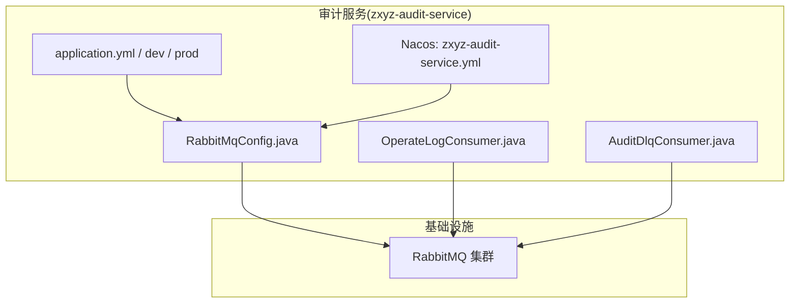
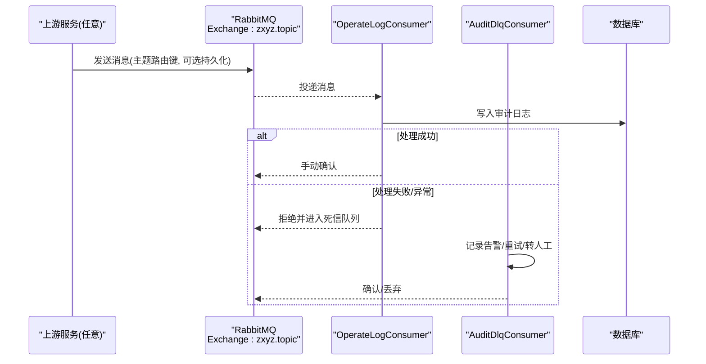
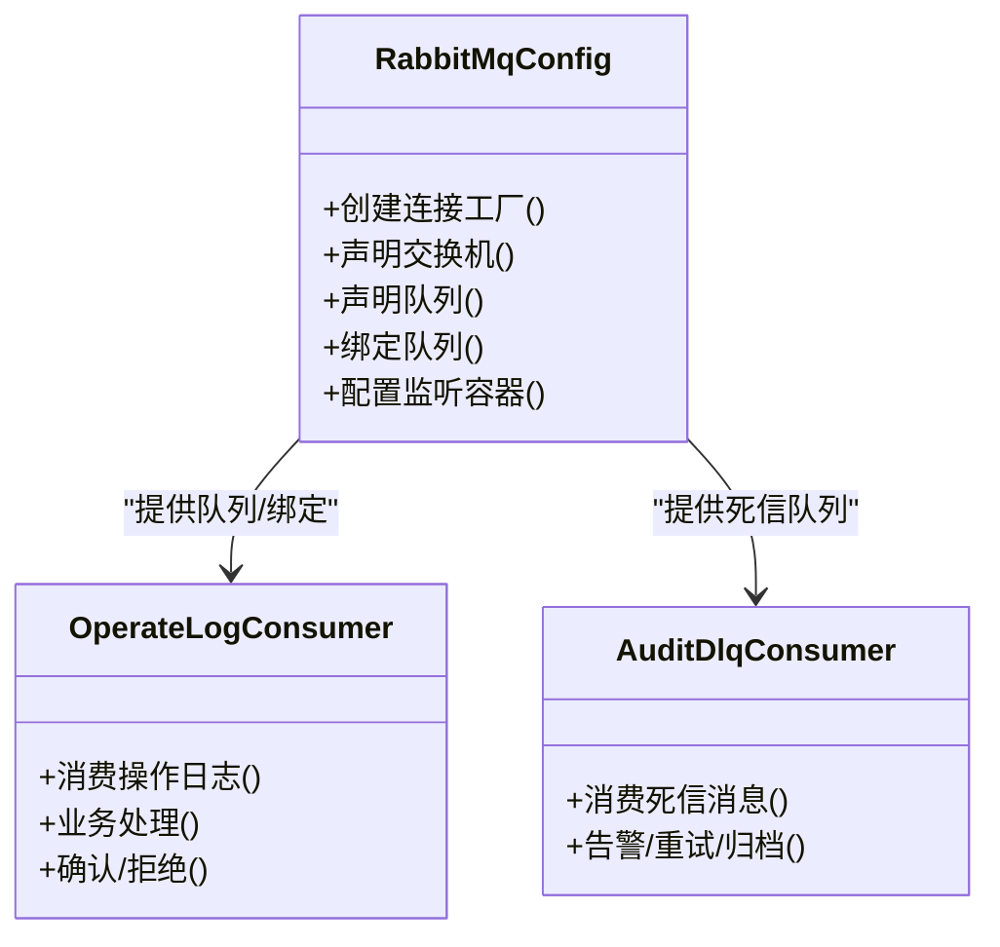
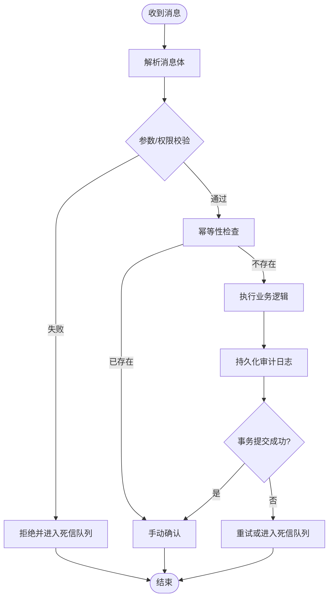
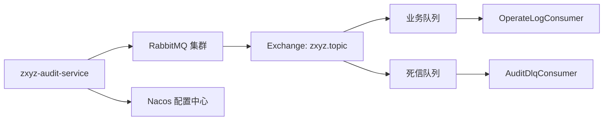

# RabbitMQ消息队列集成

<cite>
**本文引用的文件**   
- [zxyz-audit-service/RabbitMqConfig.java](file://ZXYZdatabaseBack/zxyz-audit-service/src/main/java/uno/acloud/audit/config/RabbitMqConfig.java)
- [zxyz-audit-service/OperateLogConsumer.java](file://ZXYZdatabaseBack/zxyz-audit-service/src/main/java/uno/acloud/audit/mq/OperateLogConsumer.java)
- [zxyz-audit-service/AuditDlqConsumer.java](file://ZXYZdatabaseBack/zxyz-audit-service/src/main/java/uno/acloud/audit/mq/AuditDlqConsumer.java)
- [zxyz-audit-service/application.yml](file://ZXYZdatabaseBack/zxyz-audit-service/src/main/resources/application.yml)
- [zxyz-audit-service/application-dev.yml](file://ZXYZdatabaseBack/zxyz-audit-service/src/main/resources/application-dev.yml)
- [zxyz-audit-service/application-prod.yml](file://ZXYZdatabaseBack/zxyz-audit-service/src/main/resources/application-prod.yml)
- [nacos zxyz-audit-service.yml](file://nacos-config/zxyz-audit-service.yml)
- [docker-compose.yml](file://docker-compose.yml)
- [DEPLOYMENT.md](file://DEPLOYMENT.md)
</cite>

## 目录
1. [引言](#引言)
2. [项目结构](#项目结构)
3. [核心组件](#核心组件)
4. [架构总览](#架构总览)
5. [详细组件分析](#详细组件分析)
6. [依赖关系分析](#依赖关系分析)
7. [性能与可靠性调优](#性能与可靠性调优)
8. [监控与可观测性](#监控与可观测性)
9. [故障排查指南](#故障排查指南)
10. [结论](#结论)
11. [附录：配置清单与最佳实践](#附录配置清单与最佳实践)

## 引言
本文件面向 ZXYZ 项目的 RabbitMQ 集成，聚焦于集群部署、高可用策略、Topic Exchange 路由模型、消息持久化与死信队列处理、消费者配置与重试机制、幂等性与去重、确认与补偿事务、以及监控指标与积压处理。文档同时给出性能调优参数建议、故障恢复策略与落地最佳实践，帮助读者在生产环境中稳定、高效地使用 RabbitMQ。

## 项目结构
ZXYZ 后端采用多模块 Maven 工程，审计服务（zxyz-audit-service）是本项目中已实现 RabbitMQ 集成的关键模块之一，包含：
- 连接与队列声明配置类
- 操作日志消费者与死信队列消费者
- 各环境配置文件（dev/prod）与 Nacos 配置

图表来源
- [zxyz-audit-service/RabbitMqConfig.java](file://ZXYZdatabaseBack/zxyz-audit-service/src/main/java/uno/acloud/audit/config/RabbitMqConfig.java)
- [zxyz-audit-service/OperateLogConsumer.java](file://ZXYZdatabaseBack/zxyz-audit-service/src/main/java/uno/acloud/audit/mq/OperateLogConsumer.java)
- [zxyz-audit-service/AuditDlqConsumer.java](file://ZXYZdatabaseBack/zxyz-audit-service/src/main/java/uno/acloud/audit/mq/AuditDlqConsumer.java)
- [zxyz-audit-service/application.yml](file://ZXYZdatabaseBack/zxyz-audit-service/src/main/resources/application.yml)
- [nacos zxyz-audit-service.yml](file://nacos-config/zxyz-audit-service.yml)

章节来源
- [zxyz-audit-service/RabbitMqConfig.java](file://ZXYZdatabaseBack/zxyz-audit-service/src/main/java/uno/acloud/audit/config/RabbitMqConfig.java)
- [zxyz-audit-service/OperateLogConsumer.java](file://ZXYZdatabaseBack/zxyz-audit-service/src/main/java/uno/acloud/audit/mq/OperateLogConsumer.java)
- [zxyz-audit-service/AuditDlqConsumer.java](file://ZXYZdatabaseBack/zxyz-audit-service/src/main/java/uno/acloud/audit/mq/AuditDlqConsumer.java)
- [zxyz-audit-service/application.yml](file://ZXYZdatabaseBack/zxyz-audit-service/src/main/resources/application.yml)
- [nacos zxyz-audit-service.yml](file://nacos-config/zxyz-audit-service.yml)

## 核心组件
- 连接与声明配置：负责 RabbitMQ 连接工厂、交换机、队列、绑定与 TTL/死信策略声明。
- 业务消费者：消费操作日志事件，执行业务逻辑并落库。
- 死信消费者：消费进入死信队列的消息，进行告警、人工干预或二次重试。
- 配置中心：通过 application.yml 与 Nacos 管理连接参数、并发、重试、超时等。

章节来源
- [zxyz-audit-service/RabbitMqConfig.java](file://ZXYZdatabaseBack/zxyz-audit-service/src/main/java/uno/acloud/audit/config/RabbitMqConfig.java)
- [zxyz-audit-service/OperateLogConsumer.java](file://ZXYZdatabaseBack/zxyz-audit-service/src/main/java/uno/acloud/audit/mq/OperateLogConsumer.java)
- [zxyz-audit-service/AuditDlqConsumer.java](file://ZXYZdatabaseBack/zxyz-audit-service/src/main/java/uno/acloud/audit/mq/AuditDlqConsumer.java)

## 架构总览
ZXYZ 的异步通信基于 Topic Exchange（zxyz.topic），生产者将事件以主题路由键发布到该交换器，消费者按订阅规则消费。审计服务作为典型消费者，接收操作日志事件并持久化；失败路径进入死信队列，由独立消费者处理。

图表来源
- [zxyz-audit-service/OperateLogConsumer.java](file://ZXYZdatabaseBack/zxyz-audit-service/src/main/java/uno/acloud/audit/mq/OperateLogConsumer.java)
- [zxyz-audit-service/AuditDlqConsumer.java](file://ZXYZdatabaseBack/zxyz-audit-service/src/main/java/uno/acloud/audit/mq/AuditDlqConsumer.java)

## 详细组件分析

### 连接与队列声明（RabbitMqConfig）
- 连接工厂与集群接入：支持多节点地址、虚拟主机、凭据、TLS 等参数，确保生产环境高可用。
- 交换机与队列声明：
  - 使用 Topic Exchange（名称 zxyz.topic）。
  - 为业务队列与死信队列分别声明，设置持久化、TTL、最大长度、优先级等。
- 绑定关系：根据主题路由键模式将队列绑定至交换器，实现灵活路由。
- 监听容器配置：并发、预取数、重试策略、ACK 模式、错误处理器等。

图表来源
- [zxyz-audit-service/RabbitMqConfig.java](file://ZXYZdatabaseBack/zxyz-audit-service/src/main/java/uno/acloud/audit/config/RabbitMqConfig.java)
- [zxyz-audit-service/OperateLogConsumer.java](file://ZXYZdatabaseBack/zxyz-audit-service/src/main/java/uno/acloud/audit/mq/OperateLogConsumer.java)
- [zxyz-audit-service/AuditDlqConsumer.java](file://ZXYZdatabaseBack/zxyz-audit-service/src/main/java/uno/acloud/audit/mq/AuditDlqConsumer.java)

章节来源
- [zxyz-audit-service/RabbitMqConfig.java](file://ZXYZdatabaseBack/zxyz-audit-service/src/main/java/uno/acloud/audit/config/RabbitMqConfig.java)

### 操作日志消费者（OperateLogConsumer）
- 消费流程：接收消息 → 反序列化 → 业务校验 → 落库 → 提交事务 → 手动确认。
- 幂等性保证：基于消息唯一标识（如业务ID+版本号或哈希）在入库前做去重检查，避免重复处理。
- 重试机制：对可重试异常进行有限次重试（指数退避），超过阈值转入死信队列。
- 错误处理：捕获不可重试异常，记录上下文并拒绝消息进入死信队列。

图表来源
- [zxyz-audit-service/OperateLogConsumer.java](file://ZXYZdatabaseBack/zxyz-audit-service/src/main/java/uno/acloud/audit/mq/OperateLogConsumer.java)

章节来源
- [zxyz-audit-service/OperateLogConsumer.java](file://ZXYZdatabaseBack/zxyz-audit-service/src/main/java/uno/acloud/audit/mq/OperateLogConsumer.java)

### 死信队列消费者（AuditDlqConsumer）
- 职责：消费进入死信队列的消息，进行告警、限流重试、归档或转人工处理。
- 策略：
  - 区分可重试与不可重试错误，前者走延迟重试，后者记录并通知。
  - 控制消费速率，避免雪崩。
  - 输出结构化日志与指标，便于追踪。

章节来源
- [zxyz-audit-service/AuditDlqConsumer.java](file://ZXYZdatabaseBack/zxyz-audit-service/src/main/java/uno/acloud/audit/mq/AuditDlqConsumer.java)

### 配置与环境（application.yml / Nacos）
- 连接参数：host/port/virtual-host/username/password/tls。
- 客户端行为：prefetch、ack-mode、retry、dead-letter、exchange/routing-key。
- 环境差异：dev/prod 分离，敏感信息通过 Nacos 集中管理。

章节来源
- [zxyz-audit-service/application.yml](file://ZXYZdatabaseBack/zxyz-audit-service/src/main/resources/application.yml)
- [zxyz-audit-service/application-dev.yml](file://ZXYZdatabaseBack/zxyz-audit-service/src/main/resources/application-dev.yml)
- [zxyz-audit-service/application-prod.yml](file://ZXYZdatabaseBack/zxyz-audit-service/src/main/resources/application-prod.yml)
- [nacos zxyz-audit-service.yml](file://nacos-config/zxyz-audit-service.yml)

## 依赖关系分析
- 审计服务依赖 RabbitMQ 集群，通过连接工厂建立连接。
- 消费者依赖声明的队列与交换器，遵循主题路由键规则。
- 配置中心（Nacos）统一注入连接与运行时参数。

图表来源
- [zxyz-audit-service/RabbitMqConfig.java](file://ZXYZdatabaseBack/zxyz-audit-service/src/main/java/uno/acloud/audit/config/RabbitMqConfig.java)
- [zxyz-audit-service/OperateLogConsumer.java](file://ZXYZdatabaseBack/zxyz-audit-service/src/main/java/uno/acloud/audit/mq/OperateLogConsumer.java)
- [zxyz-audit-service/AuditDlqConsumer.java](file://ZXYZdatabaseBack/zxyz-audit-service/src/main/java/uno/acloud/audit/mq/AuditDlqConsumer.java)
- [nacos zxyz-audit-service.yml](file://nacos-config/zxyz-audit-service.yml)

章节来源
- [zxyz-audit-service/RabbitMqConfig.java](file://ZXYZdatabaseBack/zxyz-audit-service/src/main/java/uno/acloud/audit/config/RabbitMqConfig.java)
- [nacos zxyz-audit-service.yml](file://nacos-config/zxyz-audit-service.yml)

## 性能与可靠性调优

### 集群部署与高可用
- 节点规模：至少三节点镜像集群，跨机房部署，启用网络分区容忍。
- 镜像策略：主从复制（mirror）或 Quorum Queue（推荐），确保数据一致性。
- 网络与存储：低延迟内网、SSD 磁盘、合理 I/O 吞吐。
- 连接池：客户端侧开启连接复用与心跳检测。

### 消息模型设计
- 交换器：Topic Exchange（zxyz.topic），使用点分隔的主题路由键，如 audit.log.user.*。
- 队列命名：按领域/场景划分，清晰表达用途（如 audit.operate-log）。
- 持久化：消息与队列均持久化，保障重启不丢。
- 死信队列：为每个业务队列配置独立的死信交换器与队列，隔离异常路径。

### 消费者配置与重试
- 并发与预取：根据 CPU 与 IO 能力调整并发与 prefetch，避免内存溢出。
- ACK 模式：手动确认，业务成功后再确认，失败则拒绝并进入死信。
- 重试策略：指数退避 + 最大次数限制，避免无限重试。
- 幂等性：基于唯一键去重，结合数据库唯一约束或 Redis 原子操作。

### 可靠性保障
- 确认机制：生产者 confirm、消费者 ack 双端确认。
- 补偿事务：本地事务与消息发送顺序一致，必要时引入本地消息表或出队补偿。
- 消息去重：消息头携带唯一 ID，消费者侧幂等校验。

### 积压处理与扩容
- 水平扩容：增加消费者实例，配合队列分区或分片路由键。
- 批量消费：合理批大小，平衡吞吐与延迟。
- 降级策略：非关键路径允许短暂丢弃或延迟处理。

### 故障恢复
- 自动重连：客户端配置重连与退避。
- 快速失败：超时与熔断保护下游依赖。
- 回滚与补偿：失败消息进入死信队列，人工介入后重新入队。

章节来源
- [zxyz-audit-service/RabbitMqConfig.java](file://ZXYZdatabaseBack/zxyz-audit-service/src/main/java/uno/acloud/audit/config/RabbitMqConfig.java)
- [zxyz-audit-service/OperateLogConsumer.java](file://ZXYZdatabaseBack/zxyz-audit-service/src/main/java/uno/acloud/audit/mq/OperateLogConsumer.java)
- [zxyz-audit-service/AuditDlqConsumer.java](file://ZXYZdatabaseBack/zxyz-audit-service/src/main/java/uno/acloud/audit/mq/AuditDlqConsumer.java)

## 监控与可观测性
- 队列长度：监控业务队列与死信队列长度，设置阈值告警。
- 消费延迟：统计消息从入队到消费完成的时间分布（P50/P95/P99）。
- 错误率：统计拒绝/重试/死信比例，定位热点错误。
- 资源指标：CPU、内存、GC、连接数、I/O 等待。
- 链路追踪：为消息添加 traceId，贯穿生产与消费链路。

章节来源
- [zxyz-audit-service/OperateLogConsumer.java](file://ZXYZdatabaseBack/zxyz-audit-service/src/main/java/uno/acloud/audit/mq/OperateLogConsumer.java)
- [zxyz-audit-service/AuditDlqConsumer.java](file://ZXYZdatabaseBack/zxyz-audit-service/src/main/java/uno/acloud/audit/mq/AuditDlqConsumer.java)

## 故障排查指南
- 无法连接：检查 host/port/virtual-host/用户名密码/TLS 配置，确认防火墙与网络连通。
- 消息未消费：核对路由键与绑定关系，检查消费者是否启动、并发与 prefetch 是否合理。
- 频繁重试：查看异常类型，区分可重试与不可重试，必要时调整重试策略。
- 死信堆积：分析死信原因，修复业务逻辑或扩大死信处理能力。
- 性能瓶颈：观察 JVM GC、线程池、数据库锁、外部依赖响应时间。

章节来源
- [zxyz-audit-service/application.yml](file://ZXYZdatabaseBack/zxyz-audit-service/src/main/resources/application.yml)
- [zxyz-audit-service/application-dev.yml](file://ZXYZdatabaseBack/zxyz-audit-service/src/main/resources/application-dev.yml)
- [zxyz-audit-service/application-prod.yml](file://ZXYZdatabaseBack/zxyz-audit-service/src/main/resources/application-prod.yml)

## 结论
通过 Topic Exchange 与死信队列的组合，ZXYZ 实现了高可靠、可扩展的异步消息处理。结合幂等、重试、确认与补偿事务，保障了消息的最终一致性。完善的监控与故障恢复策略，使系统在复杂生产环境下保持稳定运行。

## 附录：配置清单与最佳实践
- 连接与集群
  - 多节点地址、虚拟主机、凭据、TLS、心跳、重连策略。
- 交换器与队列
  - 交换器类型（topic）、队列持久化、TTL、最大长度、优先级。
  - 死信交换器与队列绑定。
- 消费者
  - 并发、prefetch、ack 模式、重试策略、错误处理器。
- 监控
  - 队列长度、消费延迟、错误率、资源指标、链路追踪。
- 运维
  - 灰度发布、滚动升级、容量规划、压测基线。

章节来源
- [zxyz-audit-service/RabbitMqConfig.java](file://ZXYZdatabaseBack/zxyz-audit-service/src/main/java/uno/acloud/audit/config/RabbitMqConfig.java)
- [zxyz-audit-service/application.yml](file://ZXYZdatabaseBack/zxyz-audit-service/src/main/resources/application.yml)
- [nacos zxyz-audit-service.yml](file://nacos-config/zxyz-audit-service.yml)