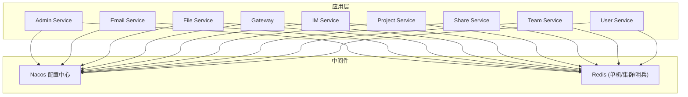
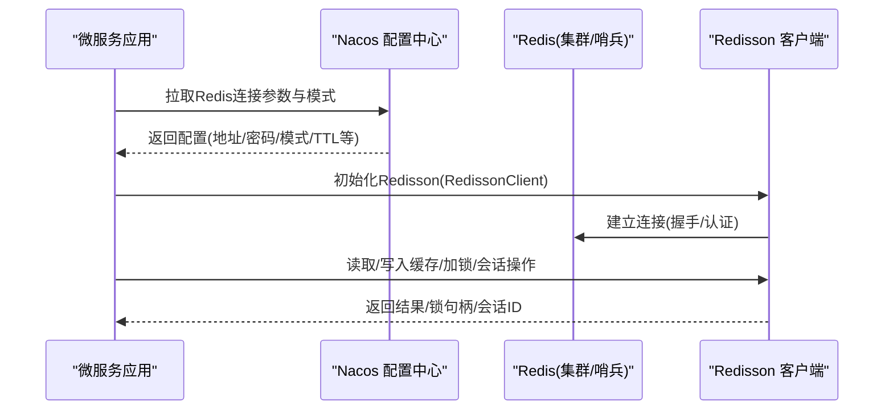
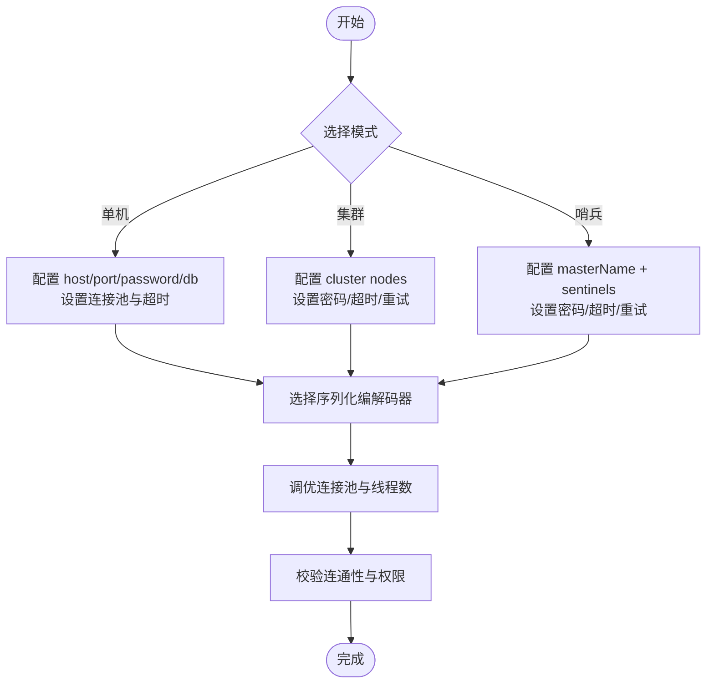
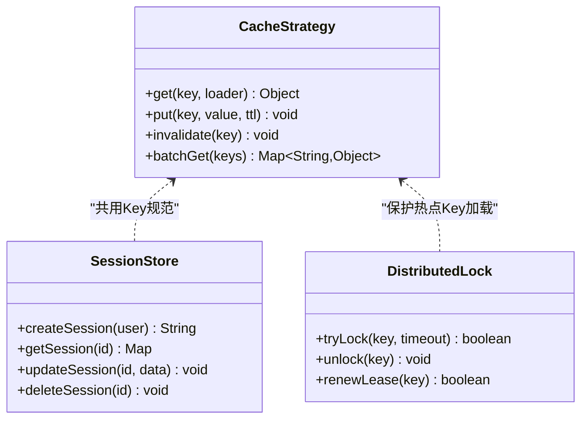
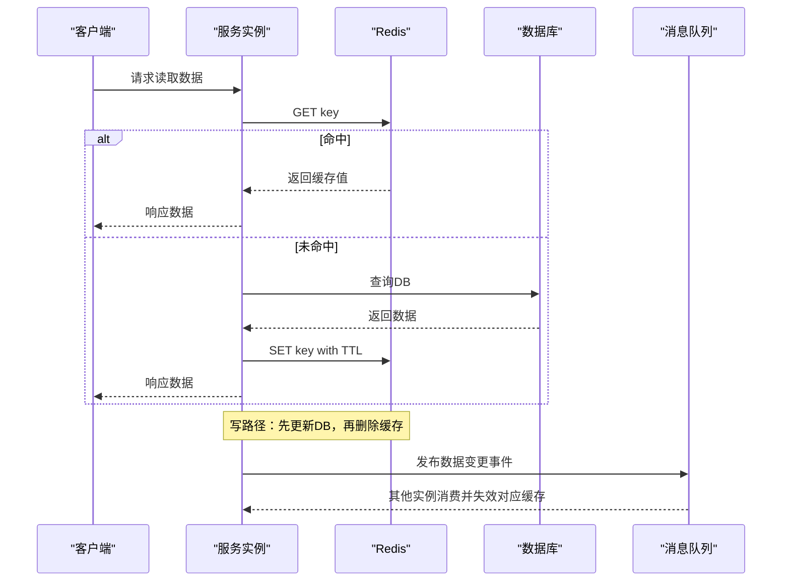
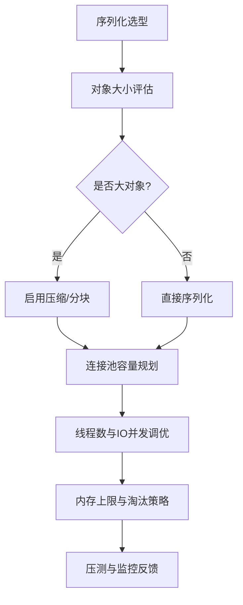
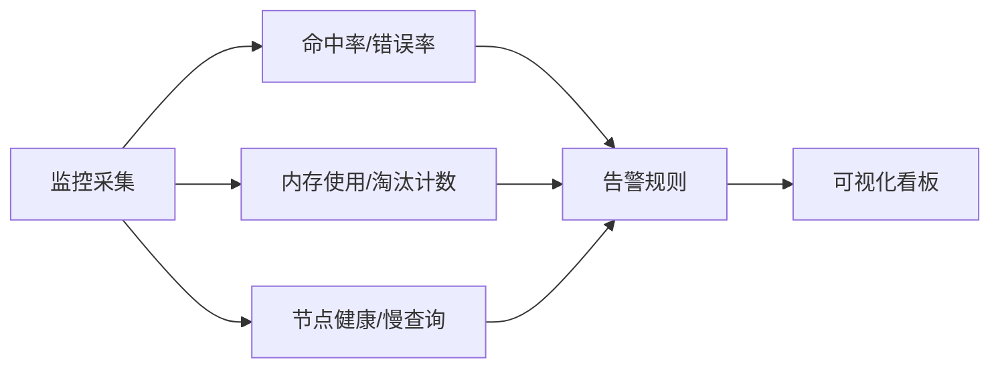
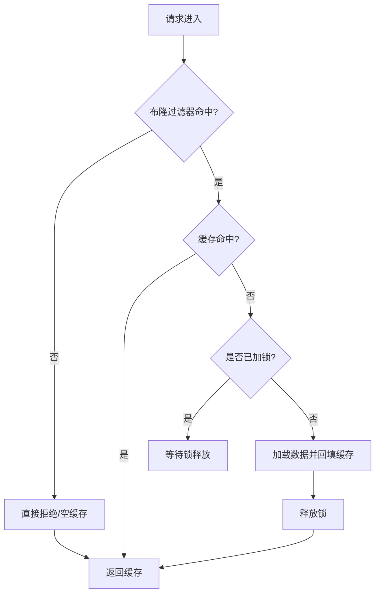
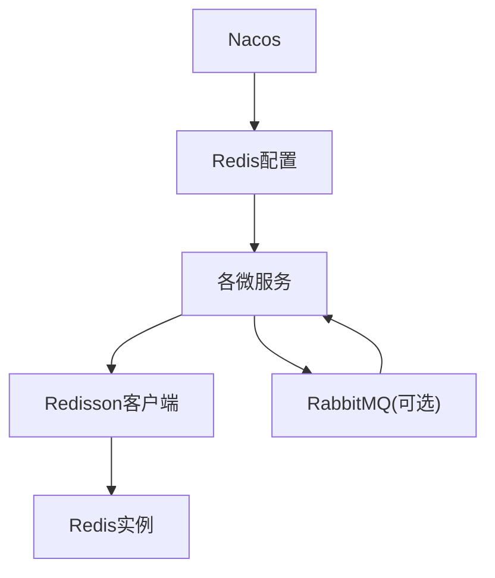

# Redis缓存集成

<cite>
**本文引用的文件**   
- [docker-compose.yml](file://docker-compose.yml)
- [zxyz-dynamic.yml](file://nacos-config/zxyz-dynamic.yml)
- [application-dev.yml](file://ZXYZdatabaseBack/zxyz-admin-service/src/main/resources/application-dev.yml)
- [application-prod.yml](file://ZXYZdatabaseBack/zxyz-admin-service/src/main/resources/application-prod.yml)
- [application.yml](file://ZXYZdatabaseBack/zxyz-admin-service/src/main/resources/application.yml)
- [application-dev.yml](file://ZXYZdatabaseBack/zxyz-email-service/src/main/resources/application-dev.yml)
- [application-prod.yml](file://ZXYZdatabaseBack/zxyz-email-service/src/main/resources/application-prod.yml)
- [application.yml](file://ZXYZdatabaseBack/zxyz-email-service/src/main/resources/application.yml)
- [application-dev.yml](file://ZXYZdatabaseBack/zxyz-file-service/src/main/resources/application-dev.yml)
- [application-prod.yml](file://ZXYZdatabaseBack/zxyz-file-service/src/main/resources/application-prod.yml)
- [application.yml](file://ZXYZdatabaseBack/zxyz-file-service/src/main/resources/application.yml)
- [application.yml](file://ZXYZdatabaseBack/zxyz-gateway/src/main/resources/application.yml)
- [application-dev.yml](file://ZXYZdatabaseBack/zxyz-im-service/src/main/resources/application-dev.yml)
- [application-prod.yml](file://ZXYZdatabaseBack/zxyz-im-service/src/main/resources/application-prod.yml)
- [application.yml](file://ZXYZdatabaseBack/zxyz-im-service/src/main/resources/application.yml)
- [application-dev.yml](file://ZXYZdatabaseBack/zxyz-project-service/src/main/resources/application-dev.yml)
- [application-prod.yml](file://ZXYZdatabaseBack/zxyz-project-service/src/main/resources/application-prod.yml)
- [application.yml](file://ZXYZdatabaseBack/zxyz-project-service/src/main/resources/application.yml)
- [application-dev.yml](file://ZXYZdatabaseBack/zxyz-share-service/src/main/resources/application-dev.yml)
- [application-prod.yml](file://ZXYZdatabaseBack/zxyz-share-service/src/main/resources/application-prod.yml)
- [application.yml](file://ZXYZdatabaseBack/zxyz-share-service/src/main/resources/application.yml)
- [application-dev.yml](file://ZXYZdatabaseBack/zxyz-team-service/src/main/resources/application-dev.yml)
- [application-prod.yml](file://ZXYZdatabaseBack/zxyz-team-service/src/main/resources/application-prod.yml)
- [application.yml](file://ZXYZdatabaseBack/zxyz-team-service/src/main/resources/application.yml)
- [application-dev.yml](file://ZXYZdatabaseBack/zxyz-user-service/src/main/resources/application-dev.yml)
- [application-prod.yml](file://ZXYZdatabaseBack/zxyz-user-service/src/main/resources/application-prod.yml)
- [application.yml](file://ZXYZdatabaseBack/zxyz-user-service/src/main/resources/application.yml)
</cite>

## 目录
1. [引言](#引言)
2. [项目结构](#项目结构)
3. [核心组件](#核心组件)
4. [架构总览](#架构总览)
5. [详细组件分析](#详细组件分析)
6. [依赖关系分析](#依赖关系分析)
7. [性能考虑](#性能考虑)
8. [故障排查指南](#故障排查指南)
9. [结论](#结论)
10. [附录](#附录)

## 引言
本文件面向ZXYZ项目的Redis缓存集成，覆盖以下目标：
- Redisson客户端配置（单机/集群/哨兵）
- 缓存策略设计（热点数据缓存、会话存储、分布式锁）
- 缓存一致性（Cache-Aside、订阅更新、失效策略）
- 性能优化（序列化、连接池、内存管理）
- 监控指标（命中率、内存使用、节点健康）
- 常见问题与最佳实践（穿透、雪崩、击穿）

## 项目结构
ZXYZ采用多服务微服务架构，后端服务通过Nacos集中管理配置，Redis作为共享缓存与会话存储。各服务的application-*.yml与nacos动态配置共同决定Redis接入方式（单机/集群/哨兵）。基础设施由Docker Compose编排，包含Redis容器及必要的网络与卷挂载。

**图表来源** 
- [docker-compose.yml](file://docker-compose.yml)
- [zxyz-dynamic.yml](file://nacos-config/zxyz-dynamic.yml)

**章节来源**
- [docker-compose.yml](file://docker-compose.yml)
- [zxyz-dynamic.yml](file://nacos-config/zxyz-dynamic.yml)

## 核心组件
- Redisson客户端：提供分布式锁、对象缓存、会话存储等能力，支持单机、集群、哨兵模式。
- 会话存储：基于Sa-Token + Redis的HttpOnly Cookie会话方案，跨实例共享用户状态。
- 热点缓存：通用Key前缀与TTL策略，结合本地二级缓存或异步刷新降低热点Key压力。
- 分布式锁：基于Redisson的RLock实现，适用于幂等控制、库存扣减、任务调度等场景。
- 一致性策略：优先采用Cache-Aside；对强一致场景配合消息订阅更新；过期策略按业务语义设置。

**章节来源**
- [application.yml](file://ZXYZdatabaseBack/zxyz-admin-service/src/main/resources/application.yml)
- [application-dev.yml](file://ZXYZdatabaseBack/zxyz-admin-service/src/main/resources/application-dev.yml)
- [application-prod.yml](file://ZXYZdatabaseBack/zxyz-admin-service/src/main/resources/application-prod.yml)
- [application.yml](file://ZXYZdatabaseBack/zxyz-email-service/src/main/resources/application.yml)
- [application-dev.yml](file://ZXYZdatabaseBack/zxyz-email-service/src/main/resources/application-dev.yml)
- [application-prod.yml](file://ZXYZdatabaseBack/zxyz-email-service/src/main/resources/application-prod.yml)
- [application.yml](file://ZXYZdatabaseBack/zxyz-file-service/src/main/resources/application.yml)
- [application-dev.yml](file://ZXYZdatabaseBack/zxyz-file-service/src/main/resources/application-dev.yml)
- [application-prod.yml](file://ZXYZdatabaseBack/zxyz-file-service/src/main/resources/application-prod.yml)
- [application.yml](file://ZXYZdatabaseBack/zxyz-gateway/src/main/resources/application.yml)
- [application.yml](file://ZXYZdatabaseBack/zxyz-im-service/src/main/resources/application.yml)
- [application-dev.yml](file://ZXYZdatabaseBack/zxyz-im-service/src/main/resources/application-dev.yml)
- [application-prod.yml](file://ZXYZdatabaseBack/zxyz-im-service/src/main/resources/application-prod.yml)
- [application.yml](file://ZXYZdatabaseBack/zxyz-project-service/src/main/resources/application.yml)
- [application-dev.yml](file://ZXYZdatabaseBack/zxyz-project-service/src/main/resources/application-dev.yml)
- [application-prod.yml](file://ZXYZdatabaseBack/zxyz-project-service/src/main/resources/application-prod.yml)
- [application.yml](file://ZXYZdatabaseBack/zxyz-share-service/src/main/resources/application.yml)
- [application-dev.yml](file://ZXYZdatabaseBack/zxyz-share-service/src/main/resources/application-dev.yml)
- [application-prod.yml](file://ZXYZdatabaseBack/zxyz-share-service/src/main/resources/application-prod.yml)
- [application.yml](file://ZXYZdatabaseBack/zxyz-team-service/src/main/resources/application.yml)
- [application-dev.yml](file://ZXYZdatabaseBack/zxyz-team-service/src/main/resources/application-dev.yml)
- [application-prod.yml](file://ZXYZdatabaseBack/zxyz-team-service/src/main/resources/application-prod.yml)
- [application.yml](file://ZXYZdatabaseBack/zxyz-user-service/src/main/resources/application.yml)
- [application-dev.yml](file://ZXYZdatabaseBack/zxyz-user-service/src/main/resources/application-dev.yml)
- [application-prod.yml](file://ZXYZdatabaseBack/zxyz-user-service/src/main/resources/application-prod.yml)

## 架构总览
下图展示各服务通过Nacos获取Redis配置，并统一以Redisson访问缓存与会话。生产环境建议采用集群或哨兵部署，保证高可用与弹性扩容。

**图表来源** 
- [zxyz-dynamic.yml](file://nacos-config/zxyz-dynamic.yml)
- [application.yml](file://ZXYZdatabaseBack/zxyz-admin-service/src/main/resources/application.yml)

## 详细组件分析

### Redisson客户端配置（单机/集群/哨兵）
- 单机模式：适用于开发或小规模部署，配置项包括host、port、password、db索引、超时、连接池大小等。
- 集群模式：适用于生产高可用场景，需配置多个节点地址、密码、集群名称、超时与重试策略。
- 哨兵模式：适用于主从切换的高可用场景，需配置masterName、sentinel节点列表、密码、超时与重试策略。

关键配置维度（示例字段说明，具体值以实际配置文件为准）：
- 连接信息：host/port或cluster/sentinel节点列表
- 认证：password、database
- 超时与重试：connectTimeout、soTimeout、retryAttempts、retryInterval
- 连接池：threads、nettyThreads、poolSize、maxIdleTime
- 序列化：codec（如JSON/Kryo）、键前缀、命名空间
- 安全：SSL/TLS开关、证书路径（按需）

**图表来源** 
- [application-dev.yml](file://ZXYZdatabaseBack/zxyz-admin-service/src/main/resources/application-dev.yml)
- [application-prod.yml](file://ZXYZdatabaseBack/zxyz-admin-service/src/main/resources/application-prod.yml)
- [application-dev.yml](file://ZXYZdatabaseBack/zxyz-email-service/src/main/resources/application-dev.yml)
- [application-prod.yml](file://ZXYZdatabaseBack/zxyz-email-service/src/main/resources/application-prod.yml)
- [application-dev.yml](file://ZXYZdatabaseBack/zxyz-file-service/src/main/resources/application-dev.yml)
- [application-prod.yml](file://ZXYZdatabaseBack/zxyz-file-service/src/main/resources/application-prod.yml)
- [application-dev.yml](file://ZXYZdatabaseBack/zxyz-im-service/src/main/resources/application-dev.yml)
- [application-prod.yml](file://ZXYZdatabaseBack/zxyz-im-service/src/main/resources/application-prod.yml)
- [application-dev.yml](file://ZXYZdatabaseBack/zxyz-project-service/src/main/resources/application-dev.yml)
- [application-prod.yml](file://ZXYZdatabaseBack/zxyz-project-service/src/main/resources/application-prod.yml)
- [application-dev.yml](file://ZXYZdatabaseBack/zxyz-share-service/src/main/resources/application-dev.yml)
- [application-prod.yml](file://ZXYZdatabaseBack/zxyz-share-service/src/main/resources/application-prod.yml)
- [application-dev.yml](file://ZXYZdatabaseBack/zxyz-team-service/src/main/resources/application-dev.yml)
- [application-prod.yml](file://ZXYZdatabaseBack/zxyz-team-service/src/main/resources/application-prod.yml)
- [application-dev.yml](file://ZXYZdatabaseBack/zxyz-user-service/src/main/resources/application-dev.yml)
- [application-prod.yml](file://ZXYZdatabaseBack/zxyz-user-service/src/main/resources/application-prod.yml)

**章节来源**
- [application.yml](file://ZXYZdatabaseBack/zxyz-admin-service/src/main/resources/application.yml)
- [application-dev.yml](file://ZXYZdatabaseBack/zxyz-admin-service/src/main/resources/application-dev.yml)
- [application-prod.yml](file://ZXYZdatabaseBack/zxyz-admin-service/src/main/resources/application-prod.yml)
- [application.yml](file://ZXYZdatabaseBack/zxyz-email-service/src/main/resources/application.yml)
- [application-dev.yml](file://ZXYZdatabaseBack/zxyz-email-service/src/main/resources/application-dev.yml)
- [application-prod.yml](file://ZXYZdatabaseBack/zxyz-email-service/src/main/resources/application-prod.yml)
- [application.yml](file://ZXYZdatabaseBack/zxyz-file-service/src/main/resources/application.yml)
- [application-dev.yml](file://ZXYZdatabaseBack/zxyz-file-service/src/main/resources/application-dev.yml)
- [application-prod.yml](file://ZXYZdatabaseBack/zxyz-file-service/src/main/resources/application-prod.yml)
- [application.yml](file://ZXYZdatabaseBack/zxyz-im-service/src/main/resources/application.yml)
- [application-dev.yml](file://ZXYZdatabaseBack/zxyz-im-service/src/main/resources/application-dev.yml)
- [application-prod.yml](file://ZXYZdatabaseBack/zxyz-im-service/src/main/resources/application-prod.yml)
- [application.yml](file://ZXYZdatabaseBack/zxyz-project-service/src/main/resources/application.yml)
- [application-dev.yml](file://ZXYZdatabaseBack/zxyz-project-service/src/main/resources/application-dev.yml)
- [application-prod.yml](file://ZXYZdatabaseBack/zxyz-project-service/src/main/resources/application-prod.yml)
- [application.yml](file://ZXYZdatabaseBack/zxyz-share-service/src/main/resources/application.yml)
- [application-dev.yml](file://ZXYZdatabaseBack/zxyz-share-service/src/main/resources/application-dev.yml)
- [application-prod.yml](file://ZXYZdatabaseBack/zxyz-share-service/src/main/resources/application-prod.yml)
- [application.yml](file://ZXYZdatabaseBack/zxyz-team-service/src/main/resources/application.yml)
- [application-dev.yml](file://ZXYZdatabaseBack/zxyz-team-service/src/main/resources/application-dev.yml)
- [application-prod.yml](file://ZXYZdatabaseBack/zxyz-team-service/src/main/resources/application-prod.yml)
- [application.yml](file://ZXYZdatabaseBack/zxyz-user-service/src/main/resources/application.yml)
- [application-dev.yml](file://ZXYZdatabaseBack/zxyz-user-service/src/main/resources/application-dev.yml)
- [application-prod.yml](file://ZXYZdatabaseBack/zxyz-user-service/src/main/resources/application-prod.yml)

### 缓存策略设计
- 热点数据缓存
  - Key设计：统一前缀+业务标识+维度（如user:profile:{id}）
  - TTL策略：短TTL+异步刷新，避免长尾过期风暴
  - 降级策略：缓存不可用时回退数据库或默认值
- 会话存储
  - Sa-Token + Redis：跨实例共享会话，Cookie为HttpOnly，提升安全性
  - 会话清理：定期清理过期会话，避免内存膨胀
- 分布式锁
  - 使用Redisson RLock，确保可重入与看门狗续期
  - 锁粒度：尽量细粒度，避免热点冲突
  - 超时与重试：合理设置锁超时时间，避免死锁

**图表来源** 
- [application.yml](file://ZXYZdatabaseBack/zxyz-admin-service/src/main/resources/application.yml)
- [application.yml](file://ZXYZdatabaseBack/zxyz-email-service/src/main/resources/application.yml)
- [application.yml](file://ZXYZdatabaseBack/zxyz-file-service/src/main/resources/application.yml)
- [application.yml](file://ZXYZdatabaseBack/zxyz-im-service/src/main/resources/application.yml)
- [application.yml](file://ZXYZdatabaseBack/zxyz-project-service/src/main/resources/application.yml)
- [application.yml](file://ZXYZdatabaseBack/zxyz-share-service/src/main/resources/application.yml)
- [application.yml](file://ZXYZdatabaseBack/zxyz-team-service/src/main/resources/application.yml)
- [application.yml](file://ZXYZdatabaseBack/zxyz-user-service/src/main/resources/application.yml)

**章节来源**
- [application-dev.yml](file://ZXYZdatabaseBack/zxyz-admin-service/src/main/resources/application-dev.yml)
- [application-prod.yml](file://ZXYZdatabaseBack/zxyz-admin-service/src/main/resources/application-prod.yml)
- [application-dev.yml](file://ZXYZdatabaseBack/zxyz-email-service/src/main/resources/application-dev.yml)
- [application-prod.yml](file://ZXYZdatabaseBack/zxyz-email-service/src/main/resources/application-prod.yml)
- [application-dev.yml](file://ZXYZdatabaseBack/zxyz-file-service/src/main/resources/application-dev.yml)
- [application-prod.yml](file://ZXYZdatabaseBack/zxyz-file-service/src/main/resources/application-prod.yml)
- [application-dev.yml](file://ZXYZdatabaseBack/zxyz-im-service/src/main/resources/application-dev.yml)
- [application-prod.yml](file://ZXYZdatabaseBack/zxyz-im-service/src/main/resources/application-prod.yml)
- [application-dev.yml](file://ZXYZdatabaseBack/zxyz-project-service/src/main/resources/application-dev.yml)
- [application-prod.yml](file://ZXYZdatabaseBack/zxyz-project-service/src/main/resources/application-prod.yml)
- [application-dev.yml](file://ZXYZdatabaseBack/zxyz-share-service/src/main/resources/application-dev.yml)
- [application-prod.yml](file://ZXYZdatabaseBack/zxyz-share-service/src/main/resources/application-prod.yml)
- [application-dev.yml](file://ZXYZdatabaseBack/zxyz-team-service/src/main/resources/application-dev.yml)
- [application-prod.yml](file://ZXYZdatabaseBack/zxyz-team-service/src/main/resources/application-prod.yml)
- [application-dev.yml](file://ZXYZdatabaseBack/zxyz-user-service/src/main/resources/application-dev.yml)
- [application-prod.yml](file://ZXYZdatabaseBack/zxyz-user-service/src/main/resources/application-prod.yml)

### 缓存一致性保证
- Cache-Aside模式
  - 读：先查缓存，未命中再查DB并回填缓存
  - 写：先更新DB，再删除缓存（或延迟双删），避免脏读
- 订阅更新
  - 通过RabbitMQ Topic事件通知其他实例失效或更新缓存
  - 适用于跨服务数据变更的一致性要求
- 失效策略
  - 短TTL+异步刷新：降低热点Key过期风暴影响
  - 随机抖动：避免批量过期导致DB突刺

**图表来源** 
- [application.yml](file://ZXYZdatabaseBack/zxyz-admin-service/src/main/resources/application.yml)
- [application.yml](file://ZXYZdatabaseBack/zxyz-email-service/src/main/resources/application.yml)
- [application.yml](file://ZXYZdatabaseBack/zxyz-file-service/src/main/resources/application.yml)
- [application.yml](file://ZXYZdatabaseBack/zxyz-im-service/src/main/resources/application.yml)
- [application.yml](file://ZXYZdatabaseBack/zxyz-project-service/src/main/resources/application.yml)
- [application.yml](file://ZXYZdatabaseBack/zxyz-share-service/src/main/resources/application.yml)
- [application.yml](file://ZXYZdatabaseBack/zxyz-team-service/src/main/resources/application.yml)
- [application.yml](file://ZXYZdatabaseBack/zxyz-user-service/src/main/resources/application.yml)

**章节来源**
- [application-dev.yml](file://ZXYZdatabaseBack/zxyz-admin-service/src/main/resources/application-dev.yml)
- [application-prod.yml](file://ZXYZdatabaseBack/zxyz-admin-service/src/main/resources/application-prod.yml)
- [application-dev.yml](file://ZXYZdatabaseBack/zxyz-email-service/src/main/resources/application-dev.yml)
- [application-prod.yml](file://ZXYZdatabaseBack/zxyz-email-service/src/main/resources/application-prod.yml)
- [application-dev.yml](file://ZXYZdatabaseBack/zxyz-file-service/src/main/resources/application-dev.yml)
- [application-prod.yml](file://ZXYZdatabaseBack/zxyz-file-service/src/main/resources/application-prod.yml)
- [application-dev.yml](file://ZXYZdatabaseBack/zxyz-im-service/src/main/resources/application-dev.yml)
- [application-prod.yml](file://ZXYZdatabaseBack/zxyz-im-service/src/main/resources/application-prod.yml)
- [application-dev.yml](file://ZXYZdatabaseBack/zxyz-project-service/srcmain/resources/application-dev.yml)
- [application-prod.yml](file://ZXYZdatabaseBack/zxyz-project-service/src/main/resources/application-prod.yml)
- [application-dev.yml](file://ZXYZdatabaseBack/zxyz-share-service/src/main/resources/application-dev.yml)
- [application-prod.yml](file://ZXYZdatabaseBack/zxyz-share-service/src/main/resources/application-prod.yml)
- [application-dev.yml](file://ZXYZdatabaseBack/zxyz-team-service/src/main/resources/application-dev.yml)
- [application-prod.yml](file://ZXYZdatabaseBack/zxyz-team-service/src/main/resources/application-prod.yml)
- [application-dev.yml](file://ZXYZdatabaseBack/zxyz-user-service/src/main/resources/application-dev.yml)
- [application-prod.yml](file://ZXYZdatabaseBack/zxyz-user-service/src/main/resources/application-prod.yml)

### 缓存性能优化
- 序列化配置
  - 选择合适的编解码器（JSON/Kryo等），平衡可读性与性能
  - 压缩大对象，减少网络传输开销
- 连接池调优
  - 根据QPS与CPU核数调整threads/nettyThreads/poolSize
  - 监控连接等待与超时，避免资源耗尽
- 内存管理
  - 设置合理的maxmemory与淘汰策略（volatile-lru/allkeys-lru）
  - 避免大Key与热Key倾斜，拆分或分片

**图表来源** 
- [application-dev.yml](file://ZXYZdatabaseBack/zxyz-admin-service/src/main/resources/application-dev.yml)
- [application-prod.yml](file://ZXYZdatabaseBack/zxyz-admin-service/src/main/resources/application-prod.yml)
- [application-dev.yml](file://ZXYZdatabaseBack/zxyz-email-service/src/main/resources/application-dev.yml)
- [application-prod.yml](file://ZXYZdatabaseBack/zxyz-email-service/src/main/resources/application-prod.yml)
- [application-dev.yml](file://ZXYZdatabaseBack/zxyz-file-service/src/main/resources/application-dev.yml)
- [application-prod.yml](file://ZXYZdatabaseBack/zxyz-file-service/src/main/resources/application-prod.yml)
- [application-dev.yml](file://ZXYZdatabaseBack/zxyz-im-service/src/main/resources/application-dev.yml)
- [application-prod.yml](file://ZXYZdatabaseBack/zxyz-im-service/src/main/resources/application-prod.yml)
- [application-dev.yml](file://ZXYZdatabaseBack/zxyz-project-service/src/main/resources/application-dev.yml)
- [application-prod.yml](file://ZXYZdatabaseBack/zxyz-project-service/src/main/resources/application-prod.yml)
- [application-dev.yml](file://ZXYZdatabaseBack/zxyz-share-service/src/main/resources/application-dev.yml)
- [application-prod.yml](file://ZXYZdatabaseBack/zxyz-share-service/src/main/resources/application-prod.yml)
- [application-dev.yml](file://ZXYZdatabaseBack/zxyz-team-service/src/main/resources/application-dev.yml)
- [application-prod.yml](file://ZXYZdatabaseBack/zxyz-team-service/src/main/resources/application-prod.yml)
- [application-dev.yml](file://ZXYZdatabaseBack/zxyz-user-service/src/main/resources/application-dev.yml)
- [application-prod.yml](file://ZXYZdatabaseBack/zxyz-user-service/src/main/resources/application-prod.yml)

**章节来源**
- [application.yml](file://ZXYZdatabaseBack/zxyz-admin-service/src/main/resources/application.yml)
- [application.yml](file://ZXYZdatabaseBack/zxyz-email-service/src/main/resources/application.yml)
- [application.yml](file://ZXYZdatabaseBack/zxyz-file-service/src/main/resources/application.yml)
- [application.yml](file://ZXYZdatabaseBack/zxyz-im-service/src/main/resources/application.yml)
- [application.yml](file://ZXYZdatabaseBack/zxyz-project-service/src/main/resources/application.yml)
- [application.yml](file://ZXYZdatabaseBack/zxyz-share-service/src/main/resources/application.yml)
- [application.yml](file://ZXYZdatabaseBack/zxyz-team-service/src/main/resources/application.yml)
- [application.yml](file://ZXYZdatabaseBack/zxyz-user-service/src/main/resources/application.yml)

### 缓存监控指标
- 命中率统计
  - 统计GET/SET/DEL操作次数与命中率，异常率与延迟分布
- 内存使用监控
  - 监控used_memory、evicted_keys、keyspace_hits/misses
- 节点健康检查
  - 监控连接状态、主从同步、持久化状态、慢查询日志

**图表来源** 
- [docker-compose.yml](file://docker-compose.yml)
- [application.yml](file://ZXYZdatabaseBack/zxyz-admin-service/src/main/resources/application.yml)
- [application.yml](file://ZXYZdatabaseBack/zxyz-email-service/src/main/resources/application.yml)
- [application.yml](file://ZXYZdatabaseBack/zxyz-file-service/src/main/resources/application.yml)
- [application.yml](file://ZXYZdatabaseBack/zxyz-im-service/src/main/resources/application.yml)
- [application.yml](file://ZXYZdatabaseBack/zxyz-project-service/src/main/resources/application.yml)
- [application.yml](file://ZXYZdatabaseBack/zxyz-share-service/src/main/resources/application.yml)
- [application.yml](file://ZXYZdatabaseBack/zxyz-team-service/src/main/resources/application.yml)
- [application.yml](file://ZXYZdatabaseBack/zxyz-user-service/src/main/resources/application.yml)

**章节来源**
- [application-dev.yml](file://ZXYZdatabaseBack/zxyz-admin-service/src/main/resources/application-dev.yml)
- [application-prod.yml](file://ZXYZdatabaseBack/zxyz-admin-service/src/main/resources/application-prod.yml)
- [application-dev.yml](file://ZXYZdatabaseBack/zxyz-email-service/src/main/resources/application-dev.yml)
- [application-prod.yml](file://ZXYZdatabaseBack/zxyz-email-service/src/main/resources/application-prod.yml)
- [application-dev.yml](file://ZXYZdatabaseBack/zxyz-file-service/src/main/resources/application-dev.yml)
- [application-prod.yml](file://ZXYZdatabaseBack/zxyz-file-service/src/main/resources/application-prod.yml)
- [application-dev.yml](file://ZXYZdatabaseBack/zxyz-im-service/src/main/resources/application-dev.yml)
- [application-prod.yml](file://ZXYZdatabaseBack/zxyz-im-service/src/main/resources/application-prod.yml)
- [application-dev.yml](file://ZXYZdatabaseBack/zxyz-project-service/src/main/resources/application-dev.yml)
- [application-prod.yml](file://ZXYZdatabaseBack/zxyz-project-service/src/main/resources/application-prod.yml)
- [application-dev.yml](file://ZXYZdatabaseBack/zxyz-share-service/src/main/resources/application-dev.yml)
- [application-prod.yml](file://ZXYZdatabaseBack/zxyz-share-service/src/main/resources/application-prod.yml)
- [application-dev.yml](file://ZXYZdatabaseBack/zxyz-team-service/src/main/resources/application-dev.yml)
- [application-prod.yml](file://ZXYZdatabaseBack/zxyz-team-service/src/main/resources/application-prod.yml)
- [application-dev.yml](file://ZXYZdatabaseBack/zxyz-user-service/src/main/resources/application-dev.yml)
- [application-prod.yml](file://ZXYZdatabaseBack/zxyz-user-service/src/main/resources/application-prod.yml)

### 常见问题与最佳实践
- 缓存穿透
  - 布隆过滤器拦截非法Key
  - 空值缓存+短TTL，限制回源频率
- 缓存雪崩
  - TTL随机抖动，避免批量过期
  - 多级缓存与限流降级
- 缓存击穿
  - 热点Key加互斥锁（分布式锁）
  - 异步预热与后台刷新

**图表来源** 
- [application-dev.yml](file://ZXYZdatabaseBack/zxyz-admin-service/src/main/resources/application-dev.yml)
- [application-prod.yml](file://ZXYZdatabaseBack/zxyz-admin-service/src/main/resources/application-prod.yml)
- [application-dev.yml](file://ZXYZdatabaseBack/zxyz-email-service/src/main/resources/application-dev.yml)
- [application-prod.yml](file://ZXYZdatabaseBack/zxyz-email-service/src/main/resources/application-prod.yml)
- [application-dev.yml](file://ZXYZdatabaseBack/zxyz-file-service/src/main/resources/application-dev.yml)
- [application-prod.yml](file://ZXYZdatabaseBack/zxyz-file-service/src/main/resources/application-prod.yml)
- [application-dev.yml](file://ZXYZdatabaseBack/zxyz-im-service/src/main/resources/application-dev.yml)
- [application-prod.yml](file://ZXYZdatabaseBack/zxyz-im-service/src/main/resources/application-prod.yml)
- [application-dev.yml](file://ZXYZdatabaseBack/zxyz-project-service/src/main/resources/application-dev.yml)
- [application-prod.yml](file://ZXYZdatabaseBack/zxyz-project-service/src/main/resources/application-prod.yml)
- [application-dev.yml](file://ZXYZdatabaseBack/zxyz-share-service/src/main/resources/application-dev.yml)
- [application-prod.yml](file://ZXYZdatabaseBack/zxyz-share-service/src/main/resources/application-prod.yml)
- [application-dev.yml](file://ZXYZdatabaseBack/zxyz-team-service/src/main/resources/application-dev.yml)
- [application-prod.yml](file://ZXYZdatabaseBack/zxyz-team-service/src/main/resources/application-prod.yml)
- [application-dev.yml](file://ZXYZdatabaseBack/zxyz-user-service/src/main/resources/application-dev.yml)
- [application-prod.yml](file://ZXYZdatabaseBack/zxyz-user-service/src/main/resources/application-prod.yml)

**章节来源**
- [application.yml](file://ZXYZdatabaseBack/zxyz-admin-service/src/main/resources/application.yml)
- [application.yml](file://ZXYZdatabaseBack/zxyz-email-service/src/main/resources/application.yml)
- [application.yml](file://ZXYZdatabaseBack/zxyz-file-service/src/main/resources/application.yml)
- [application.yml](file://ZXYZdatabaseBack/zxyz-im-service/src/main/resources/application.yml)
- [application.yml](file://ZXYZdatabaseBack/zxyz-project-service/src/main/resources/application.yml)
- [application.yml](file://ZXYZdatabaseBack/zxyz-share-service/src/main/resources/application.yml)
- [application.yml](file://ZXYZdatabaseBack/zxyz-team-service/src/main/resources/application.yml)
- [application.yml](file://ZXYZdatabaseBack/zxyz-user-service/src/main/resources/application.yml)

## 依赖关系分析
- 配置依赖：所有服务通过Nacos动态配置获取Redis连接参数与模式，便于统一管理与灰度发布。
- 运行时依赖：Redisson客户端依赖Redis实例可用性；会话存储依赖Sa-Token与Redis的协同。
- 外部依赖：RabbitMQ用于缓存一致性事件传播（可选）。

**图表来源** 
- [zxyz-dynamic.yml](file://nacos-config/zxyz-dynamic.yml)
- [application.yml](file://ZXYZdatabaseBack/zxyz-admin-service/src/main/resources/application.yml)
- [application.yml](file://ZXYZdatabaseBack/zxyz-email-service/src/main/resources/application.yml)
- [application.yml](file://ZXYZdatabaseBack/zxyz-file-service/src/main/resources/application.yml)
- [application.yml](file://ZXYZdatabaseBack/zxyz-im-service/src/main/resources/application.yml)
- [application.yml](file://ZXYZdatabaseBack/zxyz-project-service/src/main/resources/application.yml)
- [application.yml](file://ZXYZdatabaseBack/zxyz-share-service/src/main/resources/application.yml)
- [application.yml](file://ZXYZdatabaseBack/zxyz-team-service/src/main/resources/application.yml)
- [application.yml](file://ZXYZdatabaseBack/zxyz-user-service/src/main/resources/application.yml)

**章节来源**
- [zxyz-dynamic.yml](file://nacos-config/zxyz-dynamic.yml)
- [application.yml](file://ZXYZdatabaseBack/zxyz-admin-service/src/main/resources/application.yml)
- [application.yml](file://ZXYZdatabaseBack/zxyz-email-service/src/main/resources/application.yml)
- [application.yml](file://ZXYZdatabaseBack/zxyz-file-service/src/main/resources/application.yml)
- [application.yml](file://ZXYZdatabaseBack/zxyz-im-service/src/main/resources/application.yml)
- [application.yml](file://ZXYZdatabaseBack/zxyz-project-service/src/main/resources/application.yml)
- [application.yml](file://ZXYZdatabaseBack/zxyz-share-service/src/main/resources/application.yml)
- [application.yml](file://ZXYZdatabaseBack/zxyz-team-service/src/main/resources/application.yml)
- [application.yml](file://ZXYZdatabaseBack/zxyz-user-service/src/main/resources/application.yml)

## 性能考虑
- 序列化：优先选择高性能编解码器，必要时启用压缩；避免大对象直传。
- 连接池：根据QPS与CPU核数调整线程与连接数，监控等待时间与超时。
- 内存：设置maxmemory与淘汰策略，避免OOM；定期清理无效Key。
- 热点Key：使用本地缓存或分片Key降低单点压力。
- 监控：埋点命中率、延迟、错误率，结合告警快速定位问题。

[本节为通用指导，不直接分析具体文件]

## 故障排查指南
- 连接失败
  - 检查Nacos配置是否正确，确认Redis实例可达与权限
  - 查看Redisson连接池与超时配置
- 会话丢失
  - 检查Sa-Token与Redis会话配置，确认Cookie域与路径
  - 验证会话清理策略与过期时间
- 锁竞争
  - 检查锁粒度与超时设置，避免长时间持有锁
  - 监控锁获取失败率与重试次数
- 内存告警
  - 观察used_memory与evicted_keys，识别大Key与热Key
  - 调整maxmemory与淘汰策略

**章节来源**
- [application-dev.yml](file://ZXYZdatabaseBack/zxyz-admin-service/src/main/resources/application-dev.yml)
- [application-prod.yml](file://ZXYZdatabaseBack/zxyz-admin-service/src/main/resources/application-prod.yml)
- [application-dev.yml](file://ZXYZdatabaseBack/zxyz-email-service/src/main/resources/application-dev.yml)
- [application-prod.yml](file://ZXYZdatabaseBack/zxyz-email-service/src/main/resources/application-prod.yml)
- [application-dev.yml](file://ZXYZdatabaseBack/zxyz-file-service/src/main/resources/application-dev.yml)
- [application-prod.yml](file://ZXYZdatabaseBack/zxyz-file-service/src/main/resources/application-prod.yml)
- [application-dev.yml](file://ZXYZdatabaseBack/zxyz-im-service/src/main/resources/application-dev.yml)
- [application-prod.yml](file://ZXYZdatabaseBack/zxyz-im-service/src/main/resources/application-prod.yml)
- [application-dev.yml](file://ZXYZdatabaseBack/zxyz-project-service/src/main/resources/application-dev.yml)
- [application-prod.yml](file://ZXYZdatabaseBack/zxyz-project-service/src/main/resources/application-prod.yml)
- [application-dev.yml](file://ZXYZdatabaseBack/zxyz-share-service/src/main/resources/application-dev.yml)
- [application-prod.yml](file://ZXYZdatabaseBack/zxyz-share-service/src/main/resources/application-prod.yml)
- [application-dev.yml](file://ZXYZdatabaseBack/zxyz-team-service/src/main/resources/application-dev.yml)
- [application-prod.yml](file://ZXYZdatabaseBack/zxyz-team-service/src/main/resources/application-prod.yml)
- [application-dev.yml](file://ZXYZdatabaseBack/zxyz-user-service/src/main/resources/application-dev.yml)
- [application-prod.yml](file://ZXYZdatabaseBack/zxyz-user-service/src/main/resources/application-prod.yml)

## 结论
ZXYZ项目通过Nacos统一管理Redis配置，各服务以Redisson客户端接入，支持单机/集群/哨兵多种部署模式。结合Cache-Aside、订阅更新与合理的失效策略，可实现高效且一致的缓存体系。通过序列化、连接池与内存管理的优化，以及完善的监控与告警，能够有效应对穿透、雪崩、击穿等常见问题，保障系统稳定性与性能。

[本节为总结性内容，不直接分析具体文件]

## 附录
- 部署参考：使用Docker Compose编排Redis与其他中间件，确保网络互通与卷持久化。
- 配置迁移：在Nacos中维护不同环境的Redis配置，支持灰度与回滚。
- 监控集成：结合Prometheus/Grafana采集Redis与应用指标，形成统一看板。

[本节为补充信息，不直接分析具体文件]