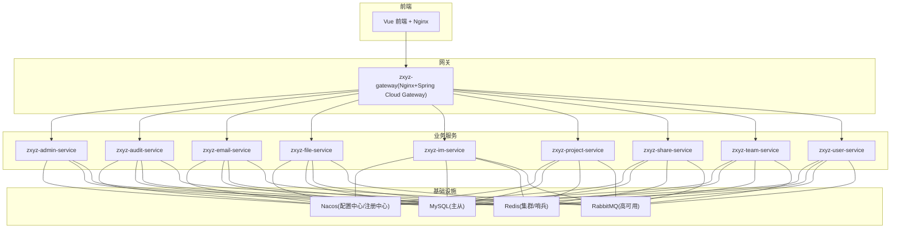
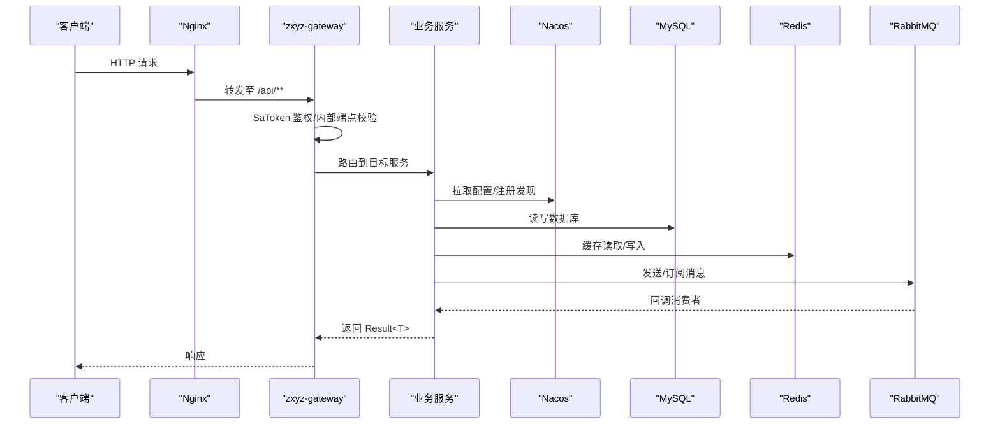
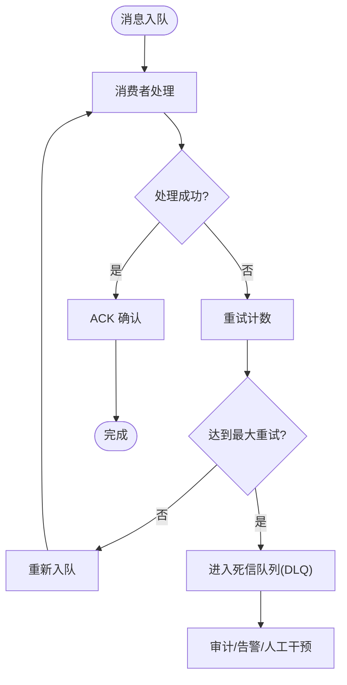
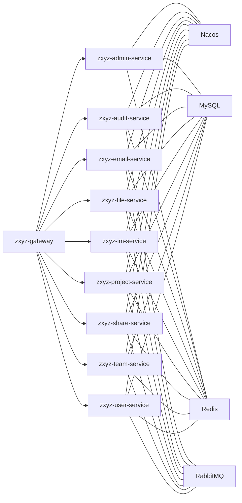

# 中间件集成配置

<cite>
**本文引用的文件**   
- [docker-compose.yml](file://docker-compose.yml)
- [docker-compose.dev.yml](file://docker-compose.dev.yml)
- [nacos-config/zxyz-dynamic.yml](file://nacos-config/zxyz-dynamic.yml)
- [nacos-config/zxyz-static.yml](file://nacos-config/zxyz-static.yml)
- [nacos-config/import.sh](file://nacos-config/import.sh)
- [ZXYZdatabaseBack/pom.xml](file://ZXYZdatabaseBack/pom.xml)
- [ZXYZdatabaseBack/ZXYZdatabaseBack/zxyz-admin-service/src/main/resources/application.yml](file://ZXYZdatabaseBack/zxyz-admin-service/src/main/resources/application.yml)
- [ZXYZdatabaseBack/ZXYZdatabaseBack/zxyz-admin-service/src/main/resources/application-dev.yml](file://ZXYZdatabaseBack/zxyz-admin-service/src/main/resources/application-dev.yml)
- [ZXYZdatabaseBack/ZXYZdatabaseBack/zxyz-admin-service/src/main/resources/application-prod.yml](file://ZXYZdatabaseBack/zxyz-admin-service/src/main/resources/application-prod.yml)
- [ZXYZdatabaseBack/ZXYZdatabaseBack/zxyz-audit-service/src/main/java/uno/acloud/audit/config/RabbitMqConfig.java](file://ZXYZdatabaseBack/zxyz-audit-service/src/main/java/uno/acloud/audit/config/RabbitMqConfig.java)
- [ZXYZdatabaseBack/ZXYZdatabaseBack/zxyz-audit-service/src/main/java/uno/acloud/audit/mq/AuditDlqConsumer.java](file://ZXYZdatabaseBack/zxyz-audit-service/src/main/java/uno/acloud/audit/mq/AuditDlqConsumer.java)
- [ZXYZdatabaseBack/ZXYZdatabaseBack/zxyz-audit-service/src/main/java/uno/acloud/audit/mq/OperateLogConsumer.java](file://ZXYZdatabaseBack/zxyz-audit-service/src/main/java/uno/acloud/audit/mq/OperateLogConsumer.java)
- [ZXYZdatabaseBack/ZXYZdatabaseBack/zxyz-common/src/main/resources/application-common.yml](file://ZXYZdatabaseBack/zxyz-common/src/main/resources/application-common.yml)
- [ZXYZdatabaseBack/ZXYZdatabaseBack/zxyz-email-service/src/main/resources/application.yml](file://ZXYZdatabaseBack/zxyz-email-service/src/main/resources/application.yml)
- [ZXYZdatabaseBack/ZXYZdatabaseBack/zxyz-file-service/src/main/resources/application.yml](file://ZXYZdatabaseBack/zxyz-file-service/src/main/resources/application.yml)
- [ZXYZdatabaseBack/ZXYZdatabaseBack/zxyz-gateway/src/main/resources/application.yml](file://ZXYZdatabaseBack/zxyz-gateway/src/main/resources/application.yml)
- [ZXYZdatabaseBack/ZXYZdatabaseBack/zxyz-im-service/src/main/resources/application.yml](file://ZXYZdatabaseBack/zxyz-im-service/src/main/resources/application.yml)
- [ZXYZdatabaseBack/ZXYZdatabaseBack/zxyz-project-service/src/main/resources/application.yml](file://ZXYZdatabaseBack/zxyz-project-service/src/main/resources/application.yml)
- [ZXYZdatabaseBack/ZXYZdatabaseBack/zxyz-share-service/src/main/resources/application.yml](file://ZXYZdatabaseBack/zxyz-share-service/src/main/resources/application.yml)
- [ZXYZdatabaseBack/ZXYZdatabaseBack/zxyz-team-service/src/main/resources/application.yml](file://ZXYZdatabaseBack/zxyz-team-service/src/main/resources/application.yml)
- [ZXYZdatabaseBack/ZXYZdatabaseBack/zxyz-user-service/src/main/resources/application.yml](file://ZXYZdatabaseBack/zxyz-user-service/src/main/resources/application.yml)
- [deploy/nginx/default.conf](file://deploy/nginx/default.conf)
- [scripts/health-check.sh](file://scripts/health-check.sh)
- [docs/jasypt-key-management.md](file://docs/jasypt-key-management.md)
</cite>

## 目录
1. [简介](#简介)
2. [项目结构](#项目结构)
3. [核心组件](#核心组件)
4. [架构总览](#架构总览)
5. [详细组件分析](#详细组件分析)
6. [依赖关系分析](#依赖关系分析)
7. [性能考虑](#性能考虑)
8. [故障排查指南](#故障排查指南)
9. [结论](#结论)
10. [附录](#附录)

## 简介
本文件面向 ZXYZ 项目的中间件集成与配置，覆盖 MySQL 主从复制、连接池调优与 SQL 优化；Redis 集群模式、缓存策略与会话存储；RabbitMQ 高可用、队列与死信队列处理；Nacos 配置中心与服务注册发现。同时给出动态配置热更新、环境隔离、版本管理策略，以及 Jasypt 加密、SSL/TLS、访问控制等安全配置要点。文档还包含监控指标、性能调优参数与故障恢复机制，并提供常见问题排查方法与最佳实践建议。

## 项目结构
ZXYZ 采用微服务架构（后端 Maven 多模块 + Vue 前端），通过 Docker Compose 编排基础设施与业务服务，使用 Nacos 作为配置中心与服务注册发现，Jasypt 对敏感信息进行加密。关键组织方式：
- 后端服务：zxyz-admin-service、zxyz-audit-service、zxyz-email-service、zxyz-file-service、zxyz-gateway、zxyz-im-service、zxyz-project-service、zxyz-share-service、zxyz-team-service、zxyz-user-service
- 公共库：zxyz-common
- 前端：Vue 3 + Element Plus + Pinia
- 基础设施：MySQL、Redis、RabbitMQ、Nacos、Promtail/Grafana（日志）
- 部署脚本与 CI/CD：GitHub Actions、Docker Compose、Nacos 配置导入脚本

图表来源
- [docker-compose.yml](file://docker-compose.yml)
- [docker-compose.dev.yml](file://docker-compose.dev.yml)
- [nacos-config/zxyz-dynamic.yml](file://nacos-config/zxyz-dynamic.yml)
- [nacos-config/zxyz-static.yml](file://nacos-config/zxyz-static.yml)

章节来源
- [docker-compose.yml](file://docker-compose.yml)
- [docker-compose.dev.yml](file://docker-compose.dev.yml)

## 核心组件
- MySQL：主从复制、读写分离、连接池与慢查询治理
- Redis：集群模式、缓存策略、会话存储与分布式锁
- RabbitMQ：Topic Exchange、消息幂等、重试与死信队列
- Nacos：配置中心（动态热更新）、服务注册发现、命名空间与环境隔离
- 安全：Jasypt 加密、SSL/TLS、访问控制（Gateway SaToken）

章节来源
- [ZXYZdatabaseBack/pom.xml](file://ZXYZdatabaseBack/pom.xml)
- [ZXYZdatabaseBack/zxyz-common/src/main/resources/application-common.yml](file://ZXYZdatabaseBack/zxyz-common/src/main/resources/application-common.yml)
- [docs/jasypt-key-management.md](file://docs/jasypt-key-management.md)

## 架构总览
整体数据流与调用链：
- 客户端请求经 Nginx 进入 zxyz-gateway，由 SaToken 过滤器进行鉴权与内部端点保护
- 业务服务通过 Nacos 拉取配置并注册自身，消费/生产消息到 RabbitMQ，读写 MySQL 与 Redis
- 审计与异步任务通过 MQ 解耦，失败消息进入死信队列，后续人工或自动补偿

图表来源
- [ZXYZdatabaseBack/zxyz-gateway/src/main/resources/application.yml](file://ZXYZdatabaseBack/zxyz-gateway/src/main/resources/application.yml)
- [ZXYZdatabaseBack/zxyz-common/src/main/resources/application-common.yml](file://ZXYZdatabaseBack/zxyz-common/src/main/resources/application-common.yml)

## 详细组件分析

### MySQL 主从复制与连接池调优
- 主从复制：主库写、从库读，读写分离通过连接池实现；确保主从延迟监控与告警
- 连接池：推荐 HikariCP，合理设置最大连接数、空闲超时、连接验证与心跳
- SQL 优化：索引设计、分页优化、避免 N+1 查询、慢查询日志采集与分析
- 事务与隔离级别：根据业务选择合适的事务边界与隔离级别，减少锁竞争

章节来源
- [ZXYZdatabaseBack/zxyz-common/src/main/resources/application-common.yml](file://ZXYZdatabaseBack/zxyz-common/src/main/resources/application-common.yml)

### Redis 集群模式、缓存策略与会话存储
- 集群模式：支持分片与高可用，节点故障自动迁移；注意键分布与热点 key 治理
- 缓存策略：Cache-Aside、Write-Behind、TTL 与过期策略；一致性通过版本号或事件同步
- 会话存储：Sa-Token 基于 Redis 的 Session 持久化，保证跨实例共享与会话清理

章节来源
- [ZXYZdatabaseBack/zxyz-common/src/main/resources/application-common.yml](file://ZXYZdatabaseBack/zxyz-common/src/main/resources/application-common.yml)

### RabbitMQ 高可用、队列与死信队列处理
- Topic Exchange：按主题路由消息，解耦生产者与消费者
- 高可用：镜像队列或多副本，确保消息不丢失
- 死信队列：消费者异常或重试耗尽后进入 DLQ，提供审计与补偿能力
- 幂等性：消息去重（如唯一键/哈希），避免重复处理

图表来源
- [ZXYZdatabaseBack/zxyz-audit-service/src/main/java/uno/acloud/audit/config/RabbitMqConfig.java](file://ZXYZdatabaseBack/zxyz-audit-service/src/main/java/uno/acloud/audit/config/RabbitMqConfig.java)
- [ZXYZdatabaseBack/zxyz-audit-service/src/main/java/uno/acloud/audit/mq/AuditDlqConsumer.java](file://ZXYZdatabaseBack/zxyz-audit-service/src/main/java/uno/acloud/audit/mq/AuditDlqConsumer.java)
- [ZXYZdatabaseBack/zxyz-audit-service/src/main/java/uno/acloud/audit/mq/OperateLogConsumer.java](file://ZXYZdatabaseBack/zxyz-audit-service/src/main/java/uno/acloud/audit/mq/OperateLogConsumer.java)

章节来源
- [ZXYZdatabaseBack/zxyz-audit-service/src/main/java/uno/acloud/audit/config/RabbitMqConfig.java](file://ZXYZdatabaseBack/zxyz-audit-service/src/main/java/uno/acloud/audit/config/RabbitMqConfig.java)
- [ZXYZdatabaseBack/zxyz-audit-service/src/main/java/uno/acloud/audit/mq/AuditDlqConsumer.java](file://ZXYZdatabaseBack/zxyz-audit-service/src/main/java/uno/acloud/audit/mq/AuditDlqConsumer.java)
- [ZXYZdatabaseBack/zxyz-audit-service/src/main/java/uno/acloud/audit/mq/OperateLogConsumer.java](file://ZXYZdatabaseBack/zxyz-audit-service/src/main/java/uno/acloud/audit/mq/OperateLogConsumer.java)

### Nacos 配置中心与服务注册发现
- 配置中心：集中化管理配置，支持动态热更新与环境隔离（命名空间）
- 服务注册：服务启动时向 Nacos 注册，消费方通过服务名发现实例
- 版本管理：配置文件版本化，变更可回滚；灰度发布与蓝绿部署配合

章节来源
- [nacos-config/zxyz-dynamic.yml](file://nacos-config/zxyz-dynamic.yml)
- [nacos-config/zxyz-static.yml](file://nacos-config/zxyz-static.yml)
- [nacos-config/import.sh](file://nacos-config/import.sh)

### 配置管理策略：动态热更新、环境隔离、版本管理
- 动态热更新：通过 Nacos 监听配置变化，应用无需重启即可生效
- 环境隔离：不同环境（dev/test/prod）使用独立命名空间与配置集
- 版本管理：Git 管理配置变更，CI/CD 自动化导入 Nacos，支持回滚

章节来源
- [nacos-config/zxyz-dynamic.yml](file://nacos-config/zxyz-dynamic.yml)
- [nacos-config/zxyz-static.yml](file://nacos-config/zxyz-static.yml)
- [nacos-config/import.sh](file://nacos-config/import.sh)

### 安全配置：Jasypt 加密、SSL/TLS、访问控制
- Jasypt：敏感信息（数据库密码、密钥）加密存储，启动时解密
- SSL/TLS：服务间通信启用 TLS，证书管理与轮换
- 访问控制：Gateway 层 SaToken 过滤器拦截内部端点，防止公网暴露

章节来源
- [docs/jasypt-key-management.md](file://docs/jasypt-key-management.md)
- [ZXYZdatabaseBack/zxyz-gateway/src/main/resources/application.yml](file://ZXYZdatabaseBack/zxyz-gateway/src/main/resources/application.yml)

## 依赖关系分析
- 服务间调用：ServiceClient + X-Internal-Service-Token 鉴权，窄端点 + 投影 VO
- 异步通信：RabbitMQ Topic Exchange，解耦与削峰填谷
- 配置与注册：Nacos 统一管理，支持动态更新与发现
- 数据存储：MySQL（主从）、Redis（缓存/会话）、对象存储（文件服务）

图表来源
- [docker-compose.yml](file://docker-compose.yml)
- [ZXYZdatabaseBack/zxyz-common/src/main/resources/application-common.yml](file://ZXYZdatabaseBack/zxyz-common/src/main/resources/application-common.yml)

章节来源
- [docker-compose.yml](file://docker-compose.yml)
- [ZXYZdatabaseBack/zxyz-common/src/main/resources/application-common.yml](file://ZXYZdatabaseBack/zxyz-common/src/main/resources/application-common.yml)

## 性能考虑
- MySQL：连接池大小与并发匹配，慢查询日志开启，索引优化，读写分离
- Redis：热点 Key 治理、序列化优化、内存淘汰策略
- RabbitMQ：消费者并行度、预取数量、队列长度监控
- Nacos：配置推送频率与批量更新，服务发现缓存
- 网关：限流、熔断、降级策略

[本节为通用指导，不直接分析具体文件]

## 故障排查指南
- 健康检查：使用 health-check.sh 检测各服务状态
- 日志采集：Promtail + Grafana 统一收集与分析
- 常见错误：连接超时、认证失败、消息堆积、缓存穿透
- 恢复机制：自动重试、死信队列、配置回滚、服务重启

章节来源
- [scripts/health-check.sh](file://scripts/health-check.sh)

## 结论
ZXYZ 项目通过 Nacos、MySQL、Redis、RabbitMQ 等中间件构建了高可用、可扩展的微服务体系。结合动态配置、安全加密与完善的监控与故障恢复机制，保障了系统的稳定性与可维护性。建议在持续演进中关注性能调优与容量规划，确保系统在高负载下的稳定运行。

[本节为总结性内容，不直接分析具体文件]

## 附录
- 环境变量与配置项：参考各服务 application*.yml 与 Nacos 配置集
- 部署脚本：docker-compose、import.sh、health-check.sh
- 安全文档：jasypt-key-management.md

[本节为补充信息，不直接分析具体文件]