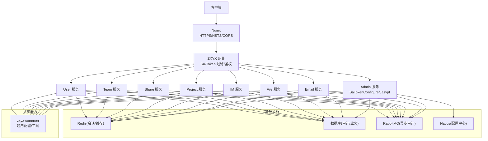
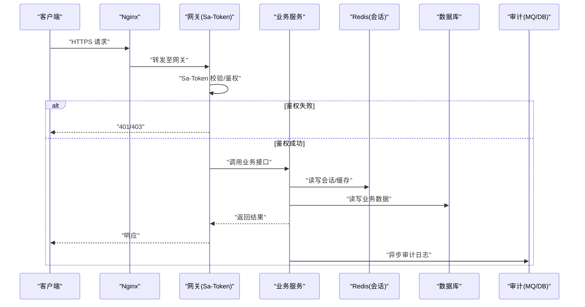
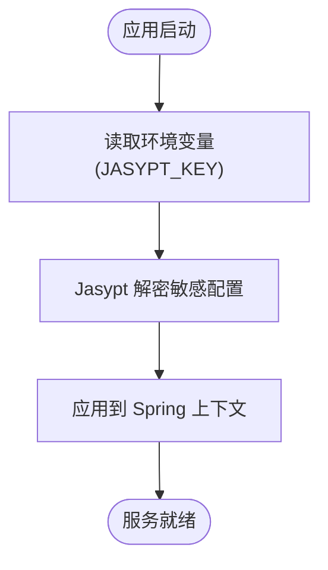
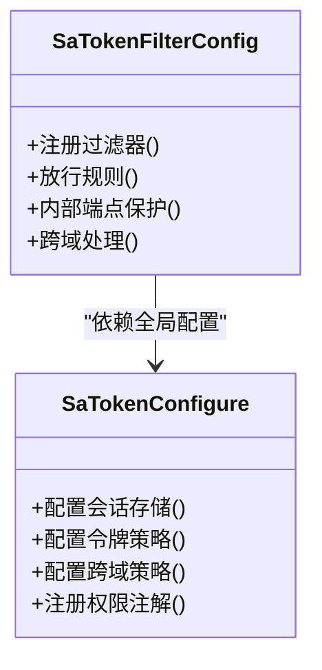
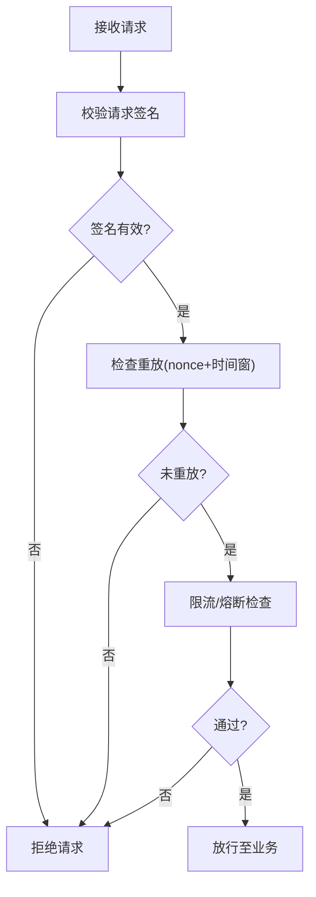
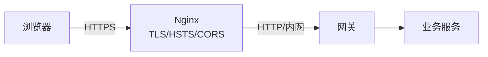
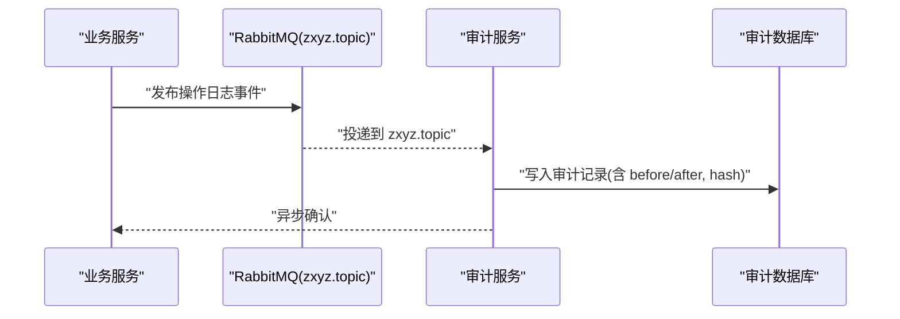
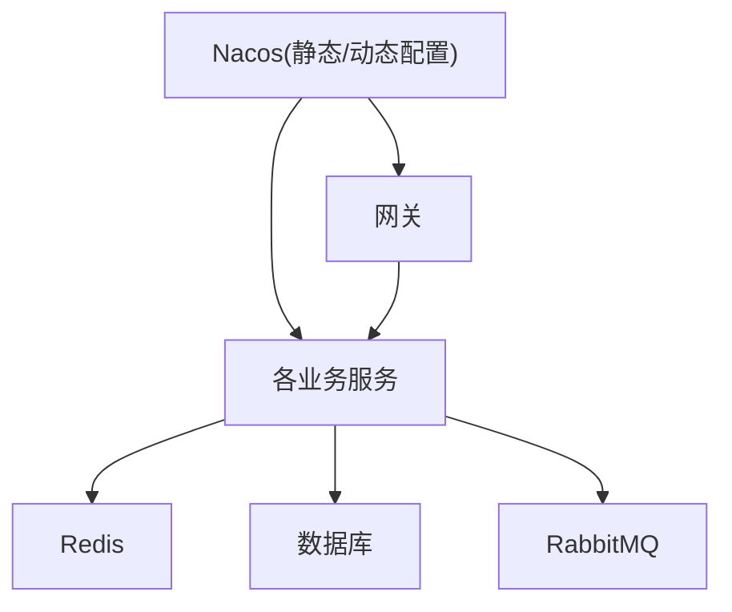

# 安全配置管理

<cite>
**本文引用的文件**   
- [docs/jasypt-key-management.md](file://docs/jasypt-key-management.md)
- [ZXYZdatabaseBack/zxyz-admin-service/src/main/java/uno/acloud/admin/config/SaTokenConfigure.java](file://ZXYZdatabaseBack/zxyz-admin-service/src/main/java/uno/acloud/admin/config/SaTokenConfigure.java)
- [ZXYZdatabaseBack/zxyz-gateway/src/main/java/uno/acloud/gateway/filter/SaTokenFilterConfig.java](file://ZXYZdatabaseBack/zxyz-gateway/src/main/java/uno/acloud/gateway/filter/SaTokenFilterConfig.java)
- [ZXYZdatabaseBack/zxyz-common/src/main/resources/application-common.yml](file://ZXYZdatabaseBack/zxyz-common/src/main/resources/application-common.yml)
- [ZXYZdatabaseBack/zxyz-admin-service/src/main/resources/application-dev.yml](file://ZXYZdatabaseBack/zxyz-admin-service/src/main/resources/application-dev.yml)
- [ZXYZdatabaseBack/zxyz-admin-service/src/main/resources/application-prod.yml](file://ZXYZdatabaseBack/zxyz-admin-service/src/main/resources/application-prod.yml)
- [nacos-config/zxyz-static.yml](file://nacos-config/zxyz-static.yml)
- [nacos-config/zxyz-dynamic.yml](file://nacos-config/zxyz-dynamic.yml)
- [deploy/nginx/default.conf](file://deploy/nginx/default.conf)
- [docker-compose.yml](file://docker-compose.yml)
- [scripts/validate-env.sh](file://scripts/validate-env.sh)
- [ZXYZdatabaseBack/zxyz-email-service/src/test/java/uno/acloud/email/application/EmailSecretCipherTest.java](file://ZXYZdatabaseBack/zxyz-email-service/src/test/java/uno/acloud/email/application/EmailSecretCipherTest.java)
- [ZXYZdatabaseBack/zxyz-share-service/src/test/java/uno/acloud/share/service/impl/ShareAccessRateLimiterTest.java](file://ZXYZdatabaseBack/zxyz-share-service/src/test/java/uno/acloud/share/service/impl/ShareAccessRateLimiterTest.java)
- [ZXYZdatabaseBack/zxyz-audit-service/src/main/java/uno/acloud/audit/mq/OperateLogConsumer.java](file://ZXYZdatabaseBack/zxyz-audit-service/src/main/java/uno/acloud/audit/mq/OperateLogConsumer.java)
- [ZXYZdatabaseBack/sql/schema_audit.sql](file://ZXYZdatabaseBack/sql/schema_audit.sql)
</cite>

## 目录
1. [引言](#引言)
2. [项目结构](#项目结构)
3. [核心组件](#核心组件)
4. [架构总览](#架构总览)
5. [详细组件分析](#详细组件分析)
6. [依赖分析](#依赖分析)
7. [性能考虑](#性能考虑)
8. [故障排查指南](#故障排查指南)
9. [结论](#结论)
10. [附录](#附录)

## 引言
本文件面向 ZXYZ 项目的安全配置管理，覆盖以下关键主题：
- Jasypt 加密配置：敏感信息加密、密钥管理与环境变量注入
- Sa-Token 认证授权：JWT 令牌、会话管理、权限验证与跨域策略
- API 安全：请求签名、防重放攻击、限流熔断、IP 白名单
- 网络安全：SSL/TLS 配置、HTTPS 强制、CORS 策略
- 安全监控：登录审计、异常检测、安全事件告警
- 安全最佳实践、漏洞防护与安全合规要求

本项目采用微服务架构（多个后端模块 + Vue 前端），通过 Nacos 集中管理配置，使用 Jasypt 对敏感配置进行加密，Sa-Token 统一认证授权，Nginx 作为反向代理提供 HTTPS 终止与基础安全头。

## 项目结构
从安全视角看，关键位置包括：
- 网关层：Sa-Token 过滤器、内部端点拦截、跨域与鉴权前置校验
- 应用层：各服务的 Sa-Token 配置、Jasypt 解密、Redis 会话存储、限流与熔断
- 基础设施：Nginx 的 SSL/TLS、HSTS、CORS、访问控制；Docker Compose 的环境变量编排
- 配置中心：Nacos 静态与动态配置，敏感项通过 Jasypt 加密
- 审计与监控：操作日志消费者、审计表结构与日志采集

**图表来源** 
- [ZXYZdatabaseBack/zxyz-gateway/src/main/java/uno/acloud/gateway/filter/SaTokenFilterConfig.java](file://ZXYZdatabaseBack/zxyz-gateway/src/main/java/uno/acloud/gateway/filter/SaTokenFilterConfig.java)
- [ZXYZdatabaseBack/zxyz-admin-service/src/main/java/uno/acloud/admin/config/SaTokenConfigure.java](file://ZXYZdatabaseBack/zxyz-admin-service/src/main/java/uno/acloud/admin/config/SaTokenConfigure.java)
- [ZXYZdatabaseBack/zxyz-common/src/main/resources/application-common.yml](file://ZXYZdatabaseBack/zxyz-common/src/main/resources/application-common.yml)
- [deploy/nginx/default.conf](file://deploy/nginx/default.conf)
- [docker-compose.yml](file://docker-compose.yml)

**章节来源**
- [ZXYZdatabaseBack/zxyz-common/src/main/resources/application-common.yml](file://ZXYZdatabaseBack/zxyz-common/src/main/resources/application-common.yml)
- [deploy/nginx/default.conf](file://deploy/nginx/default.conf)
- [docker-compose.yml](file://docker-compose.yml)

## 核心组件
- Jasypt 加密与密钥管理：用于对数据库密码、第三方凭据等敏感配置进行加密，并通过环境变量或外部密钥管理服务注入解密密钥
- Sa-Token 认证授权：统一处理登录、令牌签发与校验、会话状态、权限判定与跨域策略
- 网关安全：Sa-Token 过滤器在入口完成鉴权、内部端点保护、跨域与基础安全头设置
- 审计与监控：操作日志消费与持久化，支撑登录审计与异常检测

**章节来源**
- [docs/jasypt-key-management.md](file://docs/jasypt-key-management.md)
- [ZXYZdatabaseBack/zxyz-admin-service/src/main/java/uno/acloud/admin/config/SaTokenConfigure.java](file://ZXYZdatabaseBack/zxyz-admin-service/src/main/java/uno/acloud/admin/config/SaTokenConfigure.java)
- [ZXYZdatabaseBack/zxyz-gateway/src/main/java/uno/acloud/gateway/filter/SaTokenFilterConfig.java](file://ZXYZdatabaseBack/zxyz-gateway/src/main/java/uno/acloud/gateway/filter/SaTokenFilterConfig.java)

## 架构总览
下图展示从客户端到网关与各服务的请求路径，以及安全相关的关键节点：

**图表来源** 
- [ZXYZdatabaseBack/zxyz-gateway/src/main/java/uno/acloud/gateway/filter/SaTokenFilterConfig.java](file://ZXYZdatabaseBack/zxyz-gateway/src/main/java/uno/acloud/gateway/filter/SaTokenFilterConfig.java)
- [ZXYZdatabaseBack/zxyz-admin-service/src/main/java/uno/acloud/admin/config/SaTokenConfigure.java](file://ZXYZdatabaseBack/zxyz-admin-service/src/main/java/uno/acloud/admin/config/SaTokenConfigure.java)
- [ZXYZdatabaseBack/zxyz-audit-service/src/main/java/uno/acloud/audit/mq/OperateLogConsumer.java](file://ZXYZdatabaseBack/zxyz-audit-service/src/main/java/uno/acloud/audit/mq/OperateLogConsumer.java)

## 详细组件分析

### Jasypt 加密配置与密钥管理
- 目标：对所有敏感配置（数据库密码、第三方服务密钥等）进行加密存储，运行时通过环境变量注入解密密钥
- 关键点：
  - 配置文件中的敏感值以 Jasypt 密文形式存在
  - 启动时通过环境变量加载密钥并自动解密
  - 生产环境建议将密钥交由外部密钥管理服务或容器编排平台的安全注入机制管理
- 参考实现与说明：
  - 密钥管理指南文档
  - 各环境 application 配置中启用 Jasypt 解密
  - 测试用例中对“邮箱密钥”加解密逻辑进行验证

**图表来源** 
- [docs/jasypt-key-management.md](file://docs/jasypt-key-management.md)
- [ZXYZdatabaseBack/zxyz-admin-service/src/main/resources/application-dev.yml](file://ZXYZdatabaseBack/zxyz-admin-service/src/main/resources/application-dev.yml)
- [ZXYZdatabaseBack/zxyz-admin-service/src/main/resources/application-prod.yml](file://ZXYZdatabaseBack/zxyz-admin-service/src/main/resources/application-prod.yml)
- [ZXYZdatabaseBack/zxyz-email-service/src/test/java/uno/acloud/email/application/EmailSecretCipherTest.java](file://ZXYZdatabaseBack/zxyz-email-service/src/test/java/uno/acloud/email/application/EmailSecretCipherTest.java)

**章节来源**
- [docs/jasypt-key-management.md](file://docs/jasypt-key-management.md)
- [ZXYZdatabaseBack/zxyz-admin-service/src/main/resources/application-dev.yml](file://ZXYZdatabaseBack/zxyz-admin-service/src/main/resources/application-dev.yml)
- [ZXYZdatabaseBack/zxyz-admin-service/src/main/resources/application-prod.yml](file://ZXYZdatabaseBack/zxyz-admin-service/src/main/resources/application-prod.yml)
- [ZXYZdatabaseBack/zxyz-email-service/src/test/java/uno/acloud/email/application/EmailSecretCipherTest.java](file://ZXYZdatabaseBack/zxyz-email-service/src/test/java/uno/acloud/email/application/EmailSecretCipherTest.java)

### Sa-Token 认证授权与跨域配置
- 目标：统一登录认证、令牌管理、会话维护、权限校验与跨域策略
- 关键点：
  - 网关层通过 Sa-Token 过滤器完成鉴权与内部端点保护
  - 应用层通过 SaTokenConfigure 配置会话存储、令牌策略与跨域
  - 前端依赖 HttpOnly Cookie 与 Redis 会话，避免敏感信息泄露
- 参考实现与说明：
  - 网关 Sa-Token 过滤器配置
  - 管理服务的 Sa-Token 配置类
  - 公共配置中的通用安全参数

**图表来源** 
- [ZXYZdatabaseBack/zxyz-admin-service/src/main/java/uno/acloud/admin/config/SaTokenConfigure.java](file://ZXYZdatabaseBack/zxyz-admin-service/src/main/java/uno/acloud/admin/config/SaTokenConfigure.java)
- [ZXYZdatabaseBack/zxyz-gateway/src/main/java/uno/acloud/gateway/filter/SaTokenFilterConfig.java](file://ZXYZdatabaseBack/zxyz-gateway/src/main/java/uno/acloud/gateway/filter/SaTokenFilterConfig.java)

**章节来源**
- [ZXYZdatabaseBack/zxyz-admin-service/src/main/java/uno/acloud/admin/config/SaTokenConfigure.java](file://ZXYZdatabaseBack/zxyz-admin-service/src/main/java/uno/acloud/admin/config/SaTokenConfigure.java)
- [ZXYZdatabaseBack/zxyz-gateway/src/main/java/uno/acloud/gateway/filter/SaTokenFilterConfig.java](file://ZXYZdatabaseBack/zxyz-gateway/src/main/java/uno/acloud/gateway/filter/SaTokenFilterConfig.java)
- [ZXYZdatabaseBack/zxyz-common/src/main/resources/application-common.yml](file://ZXYZdatabaseBack/zxyz-common/src/main/resources/application-common.yml)

### API 安全：请求签名、防重放、限流熔断、IP 白名单
- 请求签名：建议在网关或统一拦截器中实现时间戳+随机数+签名的校验，防止篡改
- 防重放攻击：使用 nonce 与时间窗口校验，结合 Redis 去重
- 限流熔断：基于网关或应用层限流组件（如 Sentinel/Resilience4j）实现
- IP 白名单：在网关层对内部端点进行来源 IP 限制，仅允许可信网段访问
- 参考实现与说明：
  - 网关过滤器可扩展上述能力
  - 分享服务的访问限流测试用例体现限流思路

**图表来源** 
- [ZXYZdatabaseBack/zxyz-gateway/src/main/java/uno/acloud/gateway/filter/SaTokenFilterConfig.java](file://ZXYZdatabaseBack/zxyz-gateway/src/main/java/uno/acloud/gateway/filter/SaTokenFilterConfig.java)
- [ZXYZdatabaseBack/zxyz-share-service/src/test/java/uno/acloud/share/service/impl/ShareAccessRateLimiterTest.java](file://ZXYZdatabaseBack/zxyz-share-service/src/test/java/uno/acloud/share/service/impl/ShareAccessRateLimiterTest.java)

**章节来源**
- [ZXYZdatabaseBack/zxyz-gateway/src/main/java/uno/acloud/gateway/filter/SaTokenFilterConfig.java](file://ZXYZdatabaseBack/zxyz-gateway/src/main/java/uno/acloud/gateway/filter/SaTokenFilterConfig.java)
- [ZXYZdatabaseBack/zxyz-share-service/src/test/java/uno/acloud/share/service/impl/ShareAccessRateLimiterTest.java](file://ZXYZdatabaseBack/zxyz-share-service/src/test/java/uno/acloud/share/service/impl/ShareAccessRateLimiterTest.java)

### 网络安全：SSL/TLS、HTTPS 强制、CORS 策略
- Nginx 负责 TLS 终止、HSTS、严格传输安全头、CORS 策略与访问控制
- 应用层通过 Sa-Token 配置跨域白名单与凭证策略
- Docker Compose 中暴露端口与环境变量确保正确运行

**图表来源** 
- [deploy/nginx/default.conf](file://deploy/nginx/default.conf)
- [ZXYZdatabaseBack/zxyz-common/src/main/resources/application-common.yml](file://ZXYZdatabaseBack/zxyz-common/src/main/resources/application-common.yml)
- [docker-compose.yml](file://docker-compose.yml)

**章节来源**
- [deploy/nginx/default.conf](file://deploy/nginx/default.conf)
- [ZXYZdatabaseBack/zxyz-common/src/main/resources/application-common.yml](file://ZXYZdatabaseBack/zxyz-common/src/main/resources/application-common.yml)
- [docker-compose.yml](file://docker-compose.yml)

### 安全监控：登录审计、异常检测、安全事件告警
- 审计日志通过 RabbitMQ Topic Exchange zxyz.topic 异步投递，由审计服务消费并落库
- 审计表结构包含操作前后值、消息哈希唯一性约束，便于追踪与去重
- 可结合日志采集与告警系统实现异常检测与告警

**图表来源** 
- [ZXYZdatabaseBack/zxyz-audit-service/src/main/java/uno/acloud/audit/mq/OperateLogConsumer.java](file://ZXYZdatabaseBack/zxyz-audit-service/src/main/java/uno/acloud/audit/mq/OperateLogConsumer.java)
- [ZXYZdatabaseBack/sql/schema_audit.sql](file://ZXYZdatabaseBack/sql/schema_audit.sql)

**章节来源**
- [ZXYZdatabaseBack/zxyz-audit-service/src/main/java/uno/acloud/audit/mq/OperateLogConsumer.java](file://ZXYZdatabaseBack/zxyz-audit-service/src/main/java/uno/acloud/audit/mq/OperateLogConsumer.java)
- [ZXYZdatabaseBack/sql/schema_audit.sql](file://ZXYZdatabaseBack/sql/schema_audit.sql)

## 依赖分析
- 网关与服务间依赖：网关通过 Sa-Token 过滤器统一鉴权，内部端点受保护
- 配置依赖：Nacos 静态与动态配置分离，敏感项通过 Jasypt 加密
- 运行时依赖：Redis 用于会话与缓存，数据库用于业务与审计，RabbitMQ 用于异步审计

**图表来源** 
- [nacos-config/zxyz-static.yml](file://nacos-config/zxyz-static.yml)
- [nacos-config/zxyz-dynamic.yml](file://nacos-config/zxyz-dynamic.yml)
- [ZXYZdatabaseBack/zxyz-gateway/src/main/java/uno/acloud/gateway/filter/SaTokenFilterConfig.java](file://ZXYZdatabaseBack/zxyz-gateway/src/main/java/uno/acloud/gateway/filter/SaTokenFilterConfig.java)

**章节来源**
- [nacos-config/zxyz-static.yml](file://nacos-config/zxyz-static.yml)
- [nacos-config/zxyz-dynamic.yml](file://nacos-config/zxyz-dynamic.yml)
- [ZXYZdatabaseBack/zxyz-gateway/src/main/java/uno/acloud/gateway/filter/SaTokenFilterConfig.java](file://ZXYZdatabaseBack/zxyz-gateway/src/main/java/uno/acloud/gateway/filter/SaTokenFilterConfig.java)

## 性能考虑
- 会话与缓存：合理设置 Redis TTL 与连接池，避免频繁序列化与网络开销
- 审计日志：异步化投递，批量写入，降低主链路延迟
- 限流熔断：在网关或服务侧就近执行，减少无效请求传播
- 配置加载：Nacos 动态配置热更新，避免重启带来的抖动

[本节为通用指导，不直接分析具体文件]

## 故障排查指南
- 环境变量校验：使用脚本校验必要的安全环境变量是否齐全
- 常见错误：
  - Jasypt 解密失败：检查密钥环境变量是否正确注入
  - Sa-Token 鉴权失败：检查 Cookie/Session 与 Redis 连通性
  - 跨域问题：检查 Nginx CORS 与 Sa-Token 跨域配置一致性
  - 审计缺失：检查 RabbitMQ 连接与消费者状态

**章节来源**
- [scripts/validate-env.sh](file://scripts/validate-env.sh)

## 结论
ZXYZ 项目在安全配置方面形成了较为完整的体系：通过 Jasypt 加密敏感配置、Sa-Token 统一认证授权、Nginx 提供网络安全边界、Nacos 集中管理配置、RabbitMQ 与数据库支撑审计与监控。建议在生产环境中进一步完善请求签名、防重放、限流熔断与 IP 白名单等能力，并持续强化安全监控与告警闭环。

[本节为总结性内容，不直接分析具体文件]

## 附录
- 安全最佳实践
  - 最小权限原则：内部端点仅限可信来源访问
  - 密钥管理：使用外部密钥管理服务，避免硬编码
  - 传输安全：全站 HTTPS，启用 HSTS 与强加密套件
  - 输入校验：服务端严格校验与脱敏输出
  - 审计与告警：全量关键操作审计，异常行为实时告警
- 合规要求
  - 数据分类分级与加密存储
  - 访问控制与审计留痕
  - 隐私保护与数据最小化

[本节为通用指导，不直接分析具体文件]