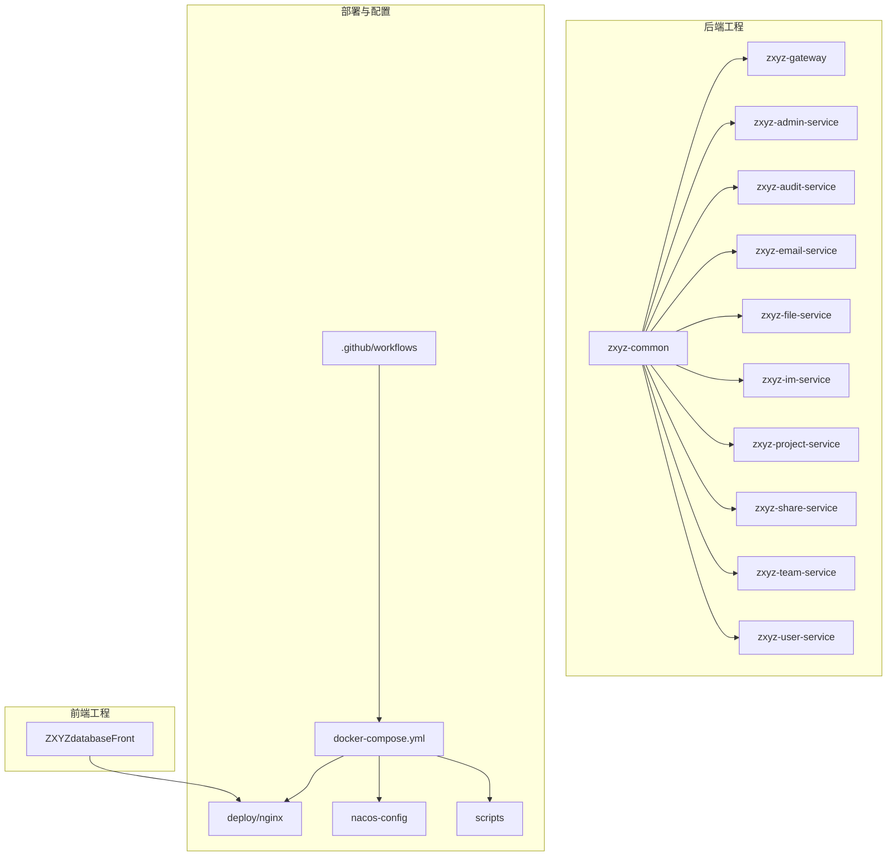
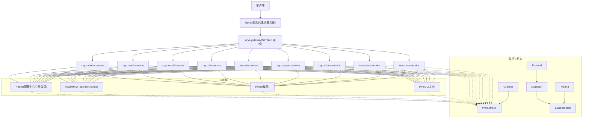
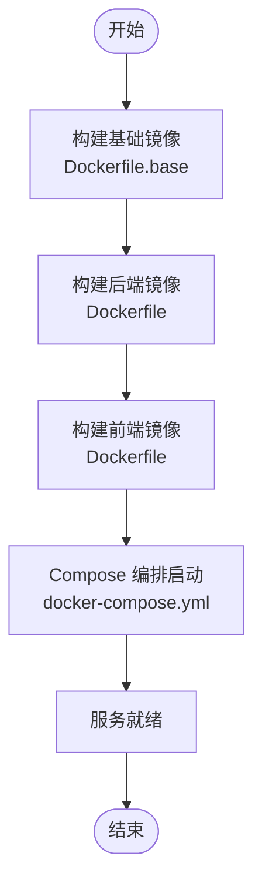
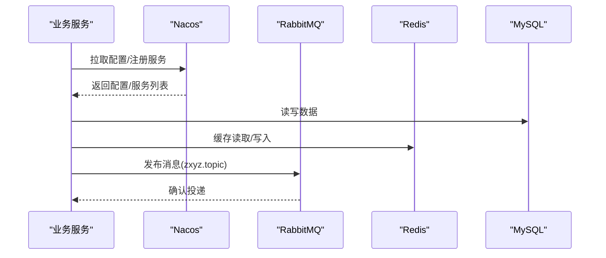
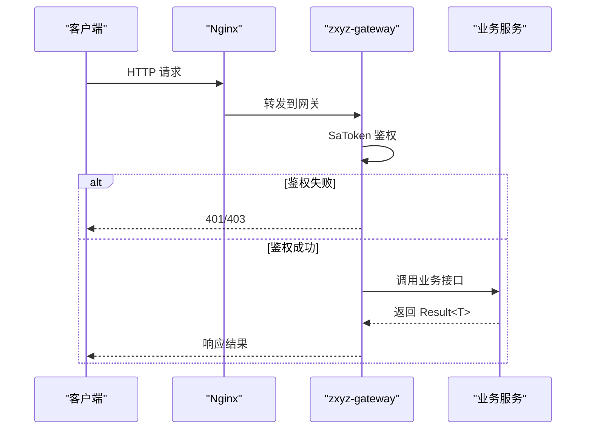
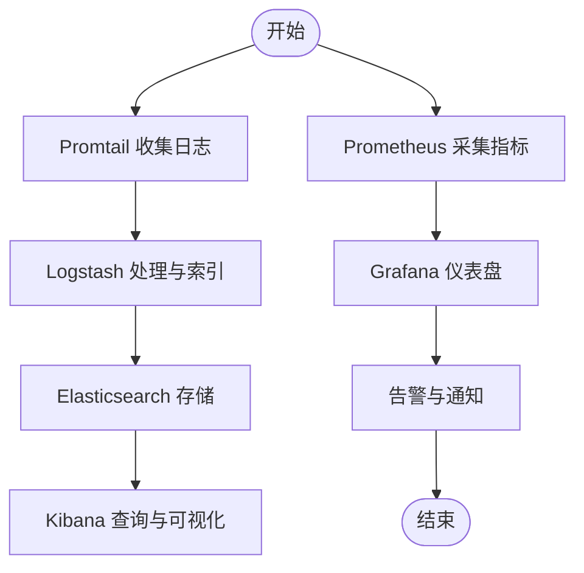
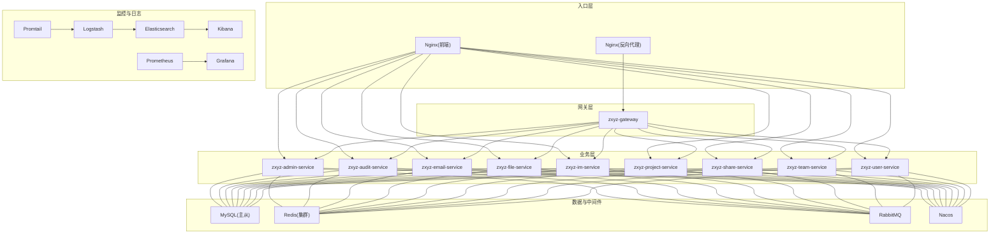
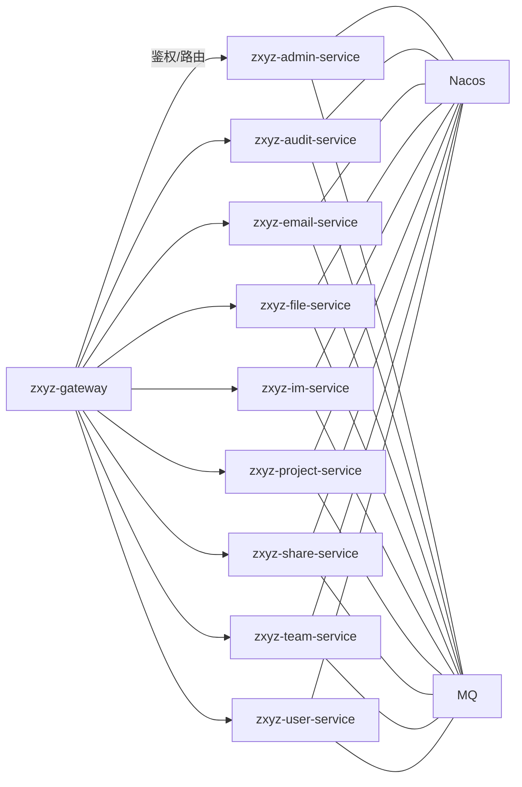

# 基础设施层

<cite>
**本文引用的文件**   
- [docker-compose.yml](file://docker-compose.yml)
- [docker-compose.dev.yml](file://docker-compose.dev.yml)
- [Dockerfile](file://ZXYZdatabaseBack/Dockerfile)
- [Dockerfile.base](file://ZXYZdatabaseBack/Dockerfile.base)
- [Dockerfile](file://ZXYZdatabaseFront/Dockerfile)
- [default.conf](file://deploy/nginx/default.conf)
- [entrypoint.sh](file://deploy/nginx/entrypoint.sh)
- [promtail-config.yml](file://deploy/promtail-config.yml)
- [zxyz-dynamic.yml](file://nacos-config/zxyz-dynamic.yml)
- [zxyz-static.yml](file://nacos-config/zxyz-static.yml)
- [zxyz-gateway.yml](file://nacos-config/zxyz-gateway.yml)
- [zxyz-admin-service.yml](file://nacos-config/zxyz-admin-service.yml)
- [zxyz-audit-service.yml](file://nacos-config/zxyz-audit-service.yml)
- [zxyz-email-service.yml](file://nacos-config/zxyz-email-service.yml)
- [zxyz-file-service.yml](file://nacos-config/zxyz-file-service.yml)
- [zxyz-im-service.yml](file://nacos-config/zxyz-im-service.yml)
- [zxyz-project-service.yml](file://nacos-config/zxyz-project-service.yml)
- [zxyz-share-service.yml](file://nacos-config/zxyz-share-service.yml)
- [zxyz-team-service.yml](file://nacos-config/zxyz-team-service.yml)
- [zxyz-user-service.yml](file://nacos-config/zxyz-user-service.yml)
- [import.sh](file://nacos-config/import.sh)
- [00-init-zxyz.sh](file://sql/00-init-zxyz.sh)
- [backup.sh](file://scripts/backup.sh)
- [health-check.sh](file://scripts/health-check.sh)
- [validate-env.sh](file://scripts/validate-env.sh)
- [ci-cd.yml](file://.github/workflows/ci-cd.yml)
- [build.yml](file://ZXYZdatabaseFront/.github/workflows/build.yml)
- [deploy.yml](file://ZXYZdatabaseFront/.github/workflows/deploy.yml)
- [architecture.md](file://docs/architecture.md)
- [infrastructure.md](file://docs/infrastructure.md)
- [application.yml](file://ZXYZdatabaseBack/zxyz-gateway/src/main/resources/application.yml)
</cite>

## 目录
1. [引言](#引言)
2. [项目结构](#项目结构)
3. [核心组件](#核心组件)
4. [架构总览](#架构总览)
5. [详细组件分析](#详细组件分析)
6. [依赖关系分析](#依赖关系分析)
7. [性能考量](#性能考量)
8. [故障排查指南](#故障排查指南)
9. [结论](#结论)
10. [附录](#附录)

## 引言
本设计文档面向 ZXYZ 项目的基础设施层，聚焦容器化部署与中间件集成、网络与路由、监控日志与健康检查。整体采用 Docker Compose 编排 18 个容器：5 个基础设施服务（MySQL、Redis、RabbitMQ、Nacos、Nginx）、10 个后端微服务、前端 Nginx 以及日志栈（Prometheus + Grafana + ELK）。配置中心与服务注册发现由 Nacos 统一管理，敏感配置通过 Jasypt 加密。网关统一鉴权与路由，内部端点受 SaToken 保护，外部访问经 Nginx 反向代理与负载均衡。

## 项目结构
仓库包含前后端源码、Nacos 配置、部署脚本、CI/CD 流水线与文档。关键目录说明：
- ZXYZdatabaseBack：后端 Maven 多模块工程，含各微服务与公共库
- ZXYZdatabaseFront：Vue 3 前端工程
- deploy：Nginx 与 Promtail 配置
- nacos-config：Nacos 配置导入脚本与各服务配置文件
- scripts：备份、健康检查、环境校验等运维脚本
- .github/workflows：CI/CD 流水线定义
- docs：架构与基础设施文档

**图表来源** 
- [docker-compose.yml](file://docker-compose.yml)
- [Dockerfile](file://ZXYZdatabaseBack/Dockerfile)
- [Dockerfile](file://ZXYZdatabaseFront/Dockerfile)
- [default.conf](file://deploy/nginx/default.conf)
- [ci-cd.yml](file://.github/workflows/ci-cd.yml)

**章节来源**
- [docker-compose.yml](file://docker-compose.yml)
- [Dockerfile](file://ZXYZdatabaseBack/Dockerfile)
- [Dockerfile](file://ZXYZdatabaseFront/Dockerfile)
- [default.conf](file://deploy/nginx/default.conf)
- [ci-cd.yml](file://.github/workflows/ci-cd.yml)

## 核心组件
- 基础设施服务
  - MySQL：主从复制，持久化数据卷，初始化脚本
  - Redis：集群模式，缓存与会话存储
  - RabbitMQ：高可用队列，Topic Exchange 异步通信
  - Nacos：配置中心与服务注册发现，动态配置热更新
  - Nginx：前端静态资源与反向代理、负载均衡
- 后端服务（10 个）
  - zxyz-gateway：API 网关，SaToken 鉴权、路由转发
  - zxyz-admin-service：系统配置管理
  - zxyz-audit-service：审计日志消费与清理
  - zxyz-email-service：邮件发送与模板渲染
  - zxyz-file-service：文件上传下载与存储适配
  - zxyz-im-service：即时通讯（DDD 分层）
  - zxyz-project-service：项目管理
  - zxyz-share-service：分享链接与权限控制
  - zxyz-team-service：团队与成员管理
  - zxyz-user-service：用户认证与资料
- 前端与日志栈
  - 前端 Nginx：静态资源托管与 API 代理
  - Prometheus：指标采集
  - Grafana：可视化仪表盘
  - ELK：Elasticsearch + Logstash + Kibana 日志分析
  - Promtail：日志收集与转发

**章节来源**
- [docker-compose.yml](file://docker-compose.yml)
- [zxyz-dynamic.yml](file://nacos-config/zxyz-dynamic.yml)
- [zxyz-static.yml](file://nacos-config/zxyz-static.yml)
- [zxyz-gateway.yml](file://nacos-config/zxyz-gateway.yml)
- [application.yml](file://ZXYZdatabaseBack/zxyz-gateway/src/main/resources/application.yml)

## 架构总览
下图展示端到端请求路径与组件交互：客户端经 Nginx 进入 Gateway，Gateway 鉴权后路由至具体业务服务；业务服务通过 Nacos 进行服务发现，使用 RabbitMQ 进行异步消息处理，读写 MySQL 与 Redis；Prometheus/Grafana 采集指标，ELK 收集日志。

**图表来源** 
- [docker-compose.yml](file://docker-compose.yml)
- [zxyz-dynamic.yml](file://nacos-config/zxyz-dynamic.yml)
- [zxyz-gateway.yml](file://nacos-config/zxyz-gateway.yml)
- [default.conf](file://deploy/nginx/default.conf)

**章节来源**
- [docker-compose.yml](file://docker-compose.yml)
- [zxyz-dynamic.yml](file://nacos-config/zxyz-dynamic.yml)
- [zxyz-gateway.yml](file://nacos-config/zxyz-gateway.yml)
- [default.conf](file://deploy/nginx/default.conf)

## 详细组件分析

### 容器编排与镜像构建
- 编排文件
  - docker-compose.yml：定义全部 18 个容器的网络、端口映射、数据卷、环境变量与依赖启动顺序
  - docker-compose.dev.yml：开发环境覆盖配置（如调试端口、本地数据库连接）
- 镜像构建
  - 后端基础镜像：Dockerfile.base 提供 JDK 运行时与通用依赖
  - 后端应用镜像：Dockerfile 基于基础镜像，拷贝编译产物并暴露端口
  - 前端镜像：独立 Dockerfile 构建 Vue 静态资源并通过 Nginx 提供服务

**图表来源** 
- [Dockerfile.base](file://ZXYZdatabaseBack/Dockerfile.base)
- [Dockerfile](file://ZXYZdatabaseBack/Dockerfile)
- [Dockerfile](file://ZXYZdatabaseFront/Dockerfile)
- [docker-compose.yml](file://docker-compose.yml)

**章节来源**
- [docker-compose.yml](file://docker-compose.yml)
- [docker-compose.dev.yml](file://docker-compose.dev.yml)
- [Dockerfile.base](file://ZXYZdatabaseBack/Dockerfile.base)
- [Dockerfile](file://ZXYZdatabaseBack/Dockerfile)
- [Dockerfile](file://ZXYZdatabaseFront/Dockerfile)

### 中间件集成
- MySQL 主从复制
  - 主节点负责写，从节点只读；数据持久化到宿主机卷
  - 初始化脚本在容器启动时执行，创建数据库与表结构
- Redis 集群模式
  - 多个 Redis 实例组成集群，用于缓存与会话共享
  - 配置集群拓扑与密码，确保跨节点会话一致性
- RabbitMQ 高可用
  - 启用镜像队列或 Quorum Queue 提升可用性
  - Topic Exchange 命名空间 zxyz.topic，按业务域划分队列
- Nacos 配置中心与注册发现
  - 动态配置 zxyz-dynamic.yml，静态配置 zxyz-static.yml
  - 各服务配置通过 import.sh 批量导入，支持热更新

**图表来源** 
- [zxyz-dynamic.yml](file://nacos-config/zxyz-dynamic.yml)
- [zxyz-static.yml](file://nacos-config/zxyz-static.yml)
- [import.sh](file://nacos-config/import.sh)
- [00-init-zxyz.sh](file://sql/00-init-zxyz.sh)

**章节来源**
- [zxyz-dynamic.yml](file://nacos-config/zxyz-dynamic.yml)
- [zxyz-static.yml](file://nacos-config/zxyz-static.yml)
- [import.sh](file://nacos-config/import.sh)
- [00-init-zxyz.sh](file://sql/00-init-zxyz.sh)

### 网络架构与路由
- 服务间通信网络
  - 内部网络隔离，服务通过容器名解析互相访问
  - 内部端点前缀 /api/internal/**，被 Gateway SaToken 过滤器拒绝公网访问
- 外部访问路由
  - Nginx 作为入口，按路径规则转发到 Gateway 或静态资源
  - 负载均衡策略可配置轮询或权重
- 网关鉴权
  - SaToken 基于 HttpOnly Cookie 的 UUID Token 与 Redis Session
  - 统一响应结构 Result<T>，code=1 表示成功

**图表来源** 
- [default.conf](file://deploy/nginx/default.conf)
- [application.yml](file://ZXYZdatabaseBack/zxyz-gateway/src/main/resources/application.yml)

**章节来源**
- [default.conf](file://deploy/nginx/default.conf)
- [application.yml](file://ZXYZdatabaseBack/zxyz-gateway/src/main/resources/application.yml)

### 监控与日志体系
- 指标采集
  - Prometheus 抓取各服务与中间件指标
  - Grafana 提供可视化仪表盘
- 日志收集与分析
  - Promtail 收集容器日志，转发至 Logstash
  - Logstash 清洗与索引到 Elasticsearch
  - Kibana 提供查询与可视化
- 健康检查机制
  - 各服务暴露健康端点，Compose 中配置 healthcheck
  - 脚本 health-check.sh 定期探测服务状态

**图表来源** 
- [promtail-config.yml](file://deploy/promtail-config.yml)
- [health-check.sh](file://scripts/health-check.sh)

**章节来源**
- [promtail-config.yml](file://deploy/promtail-config.yml)
- [health-check.sh](file://scripts/health-check.sh)

### 部署拓扑图

**图表来源** 
- [docker-compose.yml](file://docker-compose.yml)
- [default.conf](file://deploy/nginx/default.conf)
- [promtail-config.yml](file://deploy/promtail-config.yml)

**章节来源**
- [docker-compose.yml](file://docker-compose.yml)
- [default.conf](file://deploy/nginx/default.conf)
- [promtail-config.yml](file://deploy/promtail-config.yml)

## 依赖关系分析
- 服务耦合与内聚
  - 各业务服务通过 Nacos 解耦服务发现与配置管理
  - 内部端点通过 SaToken 与 X-Internal-Service-Token 实现强鉴权
  - 异步解耦通过 RabbitMQ Topic Exchange 降低同步依赖
- 外部依赖
  - MySQL、Redis、RabbitMQ、Nacos 为强依赖，需保证高可用与容量规划
  - 监控与日志为弱依赖，不影响核心业务但影响可观测性
- 循环依赖
  - 避免服务间直接循环调用，必要时通过事件总线（RabbitMQ）异步化解

**图表来源** 
- [zxyz-gateway.yml](file://nacos-config/zxyz-gateway.yml)
- [zxyz-dynamic.yml](file://nacos-config/zxyz-dynamic.yml)

**章节来源**
- [zxyz-gateway.yml](file://nacos-config/zxyz-gateway.yml)
- [zxyz-dynamic.yml](file://nacos-config/zxyz-dynamic.yml)

## 性能考量
- 数据库
  - 读写分离：主库写、从库读，合理分库分表与索引优化
  - 连接池：调整最大连接数与超时时间，避免连接耗尽
- 缓存
  - Redis 集群扩容与热点 Key 治理，避免单点瓶颈
  - 缓存穿透/击穿/雪崩防护策略
- 消息队列
  - RabbitMQ 队列分区与消费者并发度调优
  - 死信队列与重试机制保障可靠性
- 网关与代理
  - Nginx 限流与连接复用，Gateway 线程池与超时配置
- 监控与告警
  - 关键指标阈值告警，容量预警与自动扩缩容

[本节为通用指导，不直接分析具体文件]

## 故障排查指南
- 常见问题定位
  - 服务不可用：检查健康检查与依赖服务状态
  - 鉴权失败：核对 SaToken Cookie 与 Redis Session
  - 消息丢失：查看 RabbitMQ 队列与死信队列
  - 数据库连接异常：检查主从同步与连接池配置
- 工具与脚本
  - health-check.sh：服务健康探测
  - backup.sh：数据库备份与恢复
  - validate-env.sh：环境变量与依赖校验
  - import.sh：Nacos 配置导入

**章节来源**
- [health-check.sh](file://scripts/health-check.sh)
- [backup.sh](file://scripts/backup.sh)
- [validate-env.sh](file://scripts/validate-env.sh)
- [import.sh](file://nacos-config/import.sh)

## 结论
ZXYZ 基础设施层以 Docker Compose 为核心编排，结合 Nacos、RabbitMQ、Redis、MySQL 与 Nginx 构建高可用、可扩展的微服务生态。通过统一的网关鉴权与内部端点保护，配合完善的监控日志与健康检查，保障系统的稳定性与可观测性。建议在生产环境进一步实施自动化扩缩容、灰度发布与混沌工程演练，持续提升系统韧性。

[本节为总结，不直接分析具体文件]

## 附录
- CI/CD 流水线
  - 后端：.github/workflows/ci-cd.yml
  - 前端：ZXYZdatabaseFront/.github/workflows/build.yml 与 deploy.yml
- 参考文档
  - docs/architecture.md：架构总览
  - docs/infrastructure.md：基础设施详细说明

**章节来源**
- [ci-cd.yml](file://.github/workflows/ci-cd.yml)
- [build.yml](file://ZXYZdatabaseFront/.github/workflows/build.yml)
- [deploy.yml](file://ZXYZdatabaseFront/.github/workflows/deploy.yml)
- [architecture.md](file://docs/architecture.md)
- [infrastructure.md](file://docs/infrastructure.md)