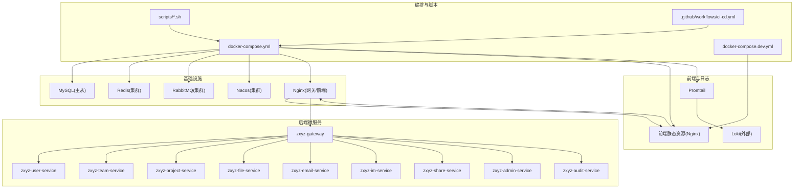
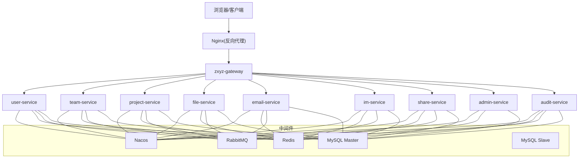
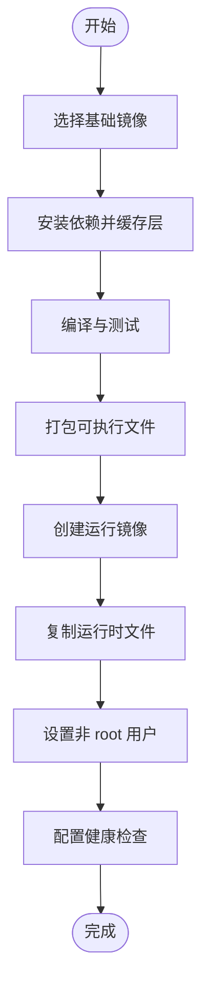
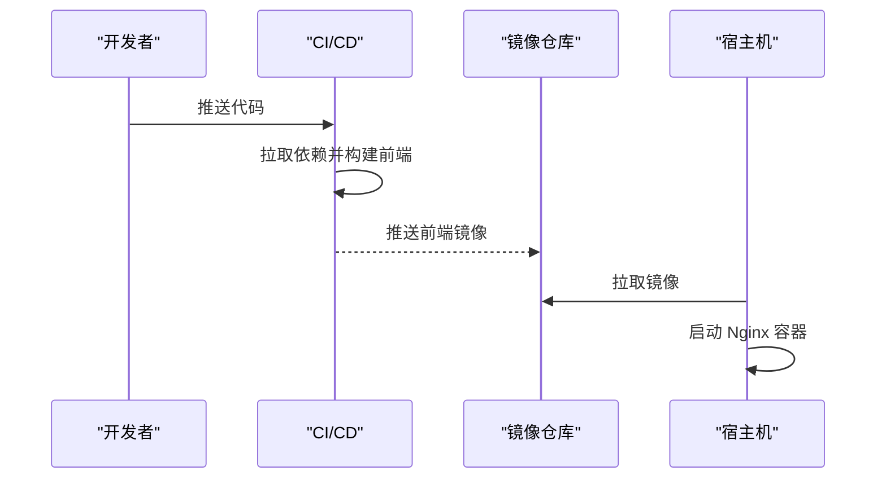
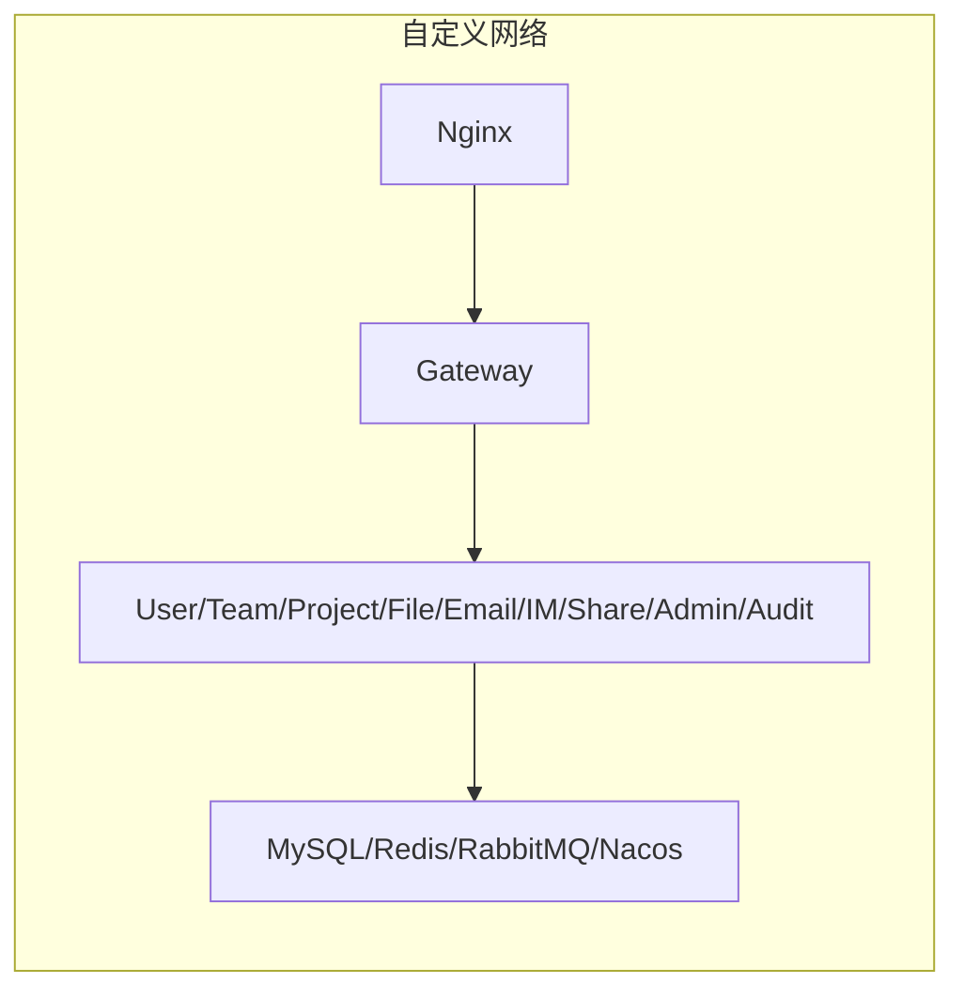
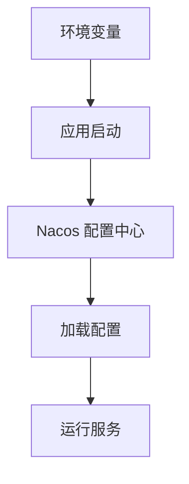
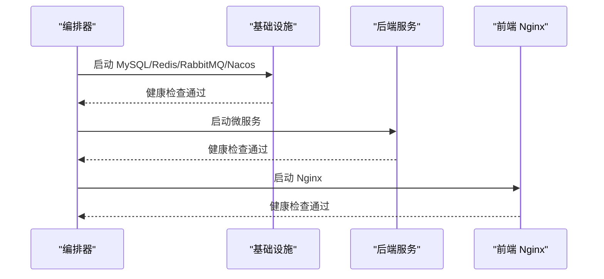
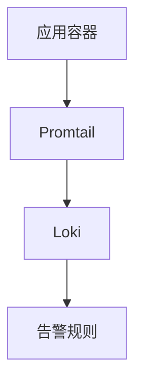
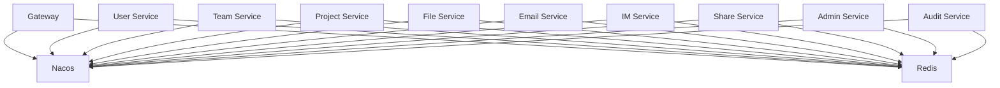

# 容器编排与部署

<cite>
**本文引用的文件**
- [docker-compose.yml](file://docker-compose.yml)
- [docker-compose.dev.yml](file://docker-compose.dev.yml)
- [Dockerfile](file://ZXYZdatabaseBack/Dockerfile)
- [Dockerfile.base](file://ZXYZdatabaseBack/Dockerfile.base)
- [frontend Dockerfile](file://ZXYZdatabaseFront/Dockerfile)
- [nginx default.conf](file://deploy/nginx/default.conf)
- [promtail-config.yml](file://deploy/promtail-config.yml)
- [nacos zxyz-dynamic.yml](file://nacos-config/zxyz-dynamic.yml)
- [nacos zxyz-static.yml](file://nacos-config/zxyz-static.yml)
- [nacos import.sh](file://nacos-config/import.sh)
- [CI/CD 工作流](file://.github/workflows/ci-cd.yml)
- [前端构建 CI](file://ZXYZdatabaseFront/.github/workflows/build.yml)
- [前端部署 CI](file://ZXYZdatabaseFront/.github/workflows/deploy.yml)
- [数据库初始化脚本](file://sql/00-init-zxyz.sh)
- [健康检查脚本](file://scripts/health-check.sh)
- [快速部署脚本](file://scripts/deploy-fast.sh)
- [备份脚本](file://scripts/backup.sh)
- [回滚脚本](file://scripts/rollback.sh)
- [环境校验脚本](file://scripts/validate-env.sh)
- [架构文档](file://docs/architecture.md)
- [基础设施说明](file://docs/infrastructure.md)
- [Jasypt 密钥管理](file://docs/jasypt-key-management.md)
</cite>

## 目录
1. [简介](#简介)
2. [项目结构](#项目结构)
3. [核心组件](#核心组件)
4. [架构总览](#架构总览)
5. [详细组件分析](#详细组件分析)
6. [依赖关系分析](#依赖关系分析)
7. [性能考虑](#性能考虑)
8. [故障排查指南](#故障排查指南)
9. [结论](#结论)
10. [附录](#附录)

## 简介
本文件面向 ZXYZ 项目的容器化编排与部署，覆盖以下目标：
- 基于 Docker Compose 的 18 个容器编排（5 个基础设施服务、10 个后端微服务、1 个前端 Nginx、2 个日志栈）。
- Java 应用多阶段构建优化与前端静态资源构建镜像策略。
- 自定义网络拓扑、服务间通信、端口映射与数据卷挂载。
- 环境变量管理、敏感信息加密、配置注入与服务发现。
- 启动顺序依赖、健康检查、资源限制与监控集成。
- 开发环境与生产环境的差异化配置。

## 项目结构
仓库采用前后端分离与多模块后端组织：
- 后端：ZXYZdatabaseBack 包含多个 Maven 模块（如 admin-service、audit-service、email-service、file-service、gateway、im-service、project-service、share-service、team-service、user-service），共享公共库 zxyz-common。
- 前端：ZXYZdatabaseFront 为 Vue 3 + Vite 工程，提供静态资源构建与 Nginx 镜像。
- 编排与部署：根目录 docker-compose*.yml、deploy、nacos-config、scripts、.github/workflows 等。

图表来源
- [docker-compose.yml](file://docker-compose.yml)
- [docker-compose.dev.yml](file://docker-compose.dev.yml)
- [CI/CD 工作流](file://.github/workflows/ci-cd.yml)

章节来源
- [docker-compose.yml](file://docker-compose.yml)
- [docker-compose.dev.yml](file://docker-compose.dev.yml)

## 核心组件
- 基础设施服务
  - MySQL 主从：持久化数据卷，读写分离通过连接参数或客户端路由实现。
  - Redis 集群：会话存储、缓存、分布式锁等。
  - RabbitMQ 集群：异步消息总线，Topic Exchange 用于事件驱动。
  - Nacos 集群：配置中心与服务注册发现。
  - Nginx：反向代理、静态资源托管、TLS 终止。
- 后端微服务
  - gateway：统一入口、鉴权过滤、内部接口保护。
  - user/team/project/file/email/im/share/admin/audit：业务域服务，按分层或 DDD 风格实现。
- 前端与日志
  - 前端 Nginx：静态资源分发与 API 转发。
  - Promtail：日志采集并上报至 Loki（外部）。

章节来源
- [docker-compose.yml](file://docker-compose.yml)
- [docker-compose.dev.yml](file://docker-compose.dev.yml)

## 架构总览
整体采用“网关 + 微服务 + 中间件 + 配置中心”的经典云原生架构。请求由 Nginx 进入，经 Gateway 鉴权后路由到具体服务；服务间同步调用通过 HTTP Client，异步通过 RabbitMQ；配置由 Nacos 动态下发；所有服务通过自定义 Docker 网络互通。

图表来源
- [docker-compose.yml](file://docker-compose.yml)
- [架构文档](file://docs/architecture.md)

## 详细组件分析

### 容器编排与定义（18 个容器）
- 基础设施（5）
  - MySQL 主从：两个实例，主写从读，数据卷持久化，健康检查基于 mysqladmin ping。
  - Redis 集群：多节点，启用持久化与密码认证，健康检查基于 redis-cli ping。
  - RabbitMQ 集群：多节点，启用管理插件，健康检查基于 rabbitmqctl status。
  - Nacos 集群：多节点，持久化到 MySQL，健康检查基于 /nacos/v1/ns/operator/health。
  - Nginx：作为网关与静态资源服务器，挂载配置文件与证书。
- 后端微服务（10）
  - gateway/user/team/project/file/email/im/share/admin/audit：每个服务一个容器，依赖 Nacos、Redis、RabbitMQ、MySQL，暴露内部 API 端口。
- 前端与日志（3）
  - 前端 Nginx：挂载构建产物，反向代理到网关。
  - Promtail：采集宿主机或容器日志，上报 Loki。
  - Loki：外部服务，不在 Compose 中运行。

章节来源
- [docker-compose.yml](file://docker-compose.yml)
- [docker-compose.dev.yml](file://docker-compose.dev.yml)

### 多阶段构建优化（Java 应用）
- 基础镜像：使用精简 JDK 镜像，避免系统包膨胀。
- 构建阶段：Maven 编译、单元测试、打包生成可执行 jar。
- 运行阶段：仅复制运行时依赖与 jar，设置非 root 用户，最小化攻击面。
- 缓存优化：分层缓存依赖，减少重复构建时间。

图表来源
- [Dockerfile](file://ZXYZdatabaseBack/Dockerfile)
- [Dockerfile.base](file://ZXYZdatabaseBack/Dockerfile.base)

章节来源
- [Dockerfile](file://ZXYZdatabaseBack/Dockerfile)
- [Dockerfile.base](file://ZXYZdatabaseBack/Dockerfile.base)

### 前端静态资源构建与镜像优化
- 构建阶段：Node 镜像安装依赖、构建静态资源。
- 运行阶段：Nginx 镜像仅包含静态资源与配置，支持 Gzip/Brotli。
- 缓存策略：利用 .dockerignore 排除无关文件，提升构建速度。

图表来源
- [frontend Dockerfile](file://ZXYZdatabaseFront/Dockerfile)
- [前端构建 CI](file://ZXYZdatabaseFront/.github/workflows/build.yml)
- [前端部署 CI](file://ZXYZdatabaseFront/.github/workflows/deploy.yml)

章节来源
- [frontend Dockerfile](file://ZXYZdatabaseFront/Dockerfile)
- [前端构建 CI](file://ZXYZdatabaseFront/.github/workflows/build.yml)
- [前端部署 CI](file://ZXYZdatabaseFront/.github/workflows/deploy.yml)

### 网络拓扑与通信
- 自定义网络：所有容器加入同一桥接网络，服务名即 DNS 解析。
- 端口映射：仅对外暴露 Nginx 与必要的管理端口，内部服务不直接暴露。
- 数据卷：MySQL、Redis、RabbitMQ、Nacos 数据持久化到宿主机路径。

图表来源
- [docker-compose.yml](file://docker-compose.yml)

章节来源
- [docker-compose.yml](file://docker-compose.yml)

### 环境变量管理与配置注入
- 环境变量：敏感信息通过环境变量注入，支持 Jasypt 加密。
- 配置中心：Nacos 集中管理各服务配置，支持热更新。
- 动态配置：zxyz-dynamic.yml 提供运行时可调参数。

图表来源
- [nacos zxyz-dynamic.yml](file://nacos-config/zxyz-dynamic.yml)
- [nacos zxyz-static.yml](file://nacos-config/zxyz-static.yml)
- [nacos import.sh](file://nacos-config/import.sh)
- [Jasypt 密钥管理](file://docs/jasypt-key-management.md)

章节来源
- [nacos zxyz-dynamic.yml](file://nacos-config/zxyz-dynamic.yml)
- [nacos zxyz-static.yml](file://nacos-config/zxyz-static.yml)
- [nacos import.sh](file://nacos-config/import.sh)
- [Jasypt 密钥管理](file://docs/jasypt-key-management.md)

### 启动顺序依赖与健康检查
- 启动顺序：先启动基础设施（MySQL、Redis、RabbitMQ、Nacos），再启动后端服务，最后启动前端 Nginx。
- 健康检查：每个服务定义健康检查命令，确保就绪后再提供服务。
- 依赖等待：使用 wait-for-it 或类似机制确保依赖就绪。

图表来源
- [docker-compose.yml](file://docker-compose.yml)
- [健康检查脚本](file://scripts/health-check.sh)

章节来源
- [docker-compose.yml](file://docker-compose.yml)
- [健康检查脚本](file://scripts/health-check.sh)

### 资源限制与监控集成
- 资源限制：为每个容器设置 CPU 和内存上限，防止资源争用。
- 监控集成：Promtail 采集日志，上报 Loki；可选 Prometheus 指标暴露。
- 告警规则：基于日志关键字或指标阈值触发告警。

图表来源
- [promtail-config.yml](file://deploy/promtail-config.yml)

章节来源
- [promtail-config.yml](file://deploy/promtail-config.yml)

## 依赖关系分析
- 服务间依赖：所有微服务依赖 Nacos、Redis、RabbitMQ、MySQL。
- 网关依赖：Gateway 依赖 Nacos 进行路由配置，依赖 Redis 进行会话管理。
- 前端依赖：前端 Nginx 依赖后端网关进行 API 转发。

图表来源
- [docker-compose.yml](file://docker-compose.yml)

章节来源
- [docker-compose.yml](file://docker-compose.yml)

## 性能考虑
- 镜像优化：使用多阶段构建，减小镜像体积，加快拉取速度。
- 连接池：合理配置数据库、Redis、RabbitMQ 连接池大小。
- 缓存策略：热点数据缓存到 Redis，减少数据库压力。
- 负载均衡：Nginx 对后端服务进行负载均衡，提升并发处理能力。

## 故障排查指南
- 查看容器日志：使用 docker logs 查看服务日志。
- 健康检查失败：检查依赖服务是否正常运行。
- 配置问题：核对 Nacos 配置是否正确加载。
- 网络问题：确认自定义网络是否连通。

章节来源
- [健康检查脚本](file://scripts/health-check.sh)

## 结论
通过 Docker Compose 编排 18 个容器，实现了 ZXYZ 项目的完整部署。多阶段构建优化了镜像体积，Nacos 提供了灵活的配置管理，Promtail 实现了日志采集。开发环境与生产环境通过不同 Compose 文件进行差异化配置，确保了部署的一致性与可维护性。

## 附录
- 快速部署：使用 deploy-fast.sh 脚本一键部署。
- 备份与回滚：使用 backup.sh 和 rollback.sh 脚本进行数据备份与版本回滚。
- 环境校验：使用 validate-env.sh 脚本验证环境变量配置。

章节来源
- [快速部署脚本](file://scripts/deploy-fast.sh)
- [备份脚本](file://scripts/backup.sh)
- [回滚脚本](file://scripts/rollback.sh)
- [环境校验脚本](file://scripts/validate-env.sh)