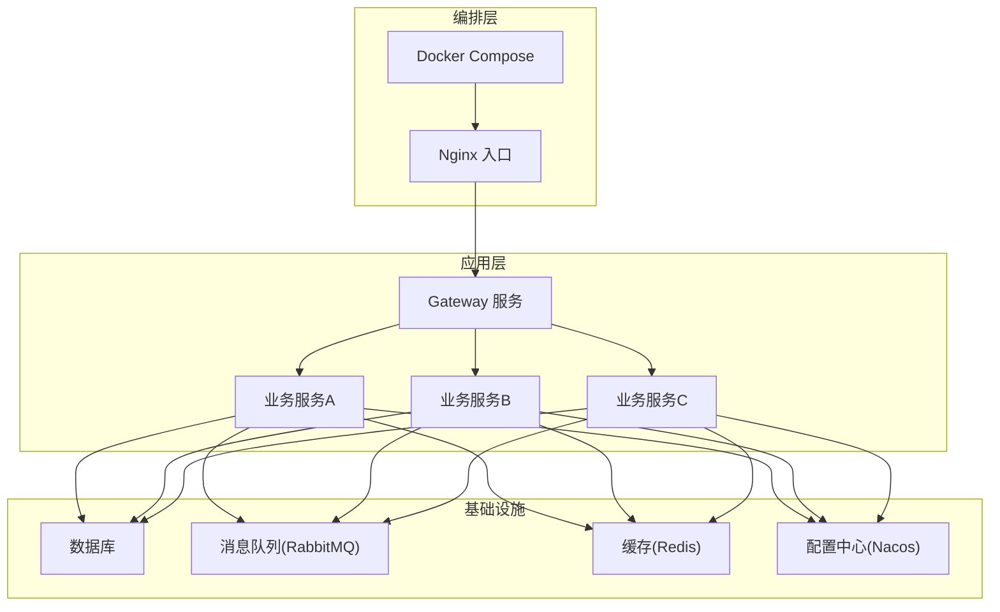
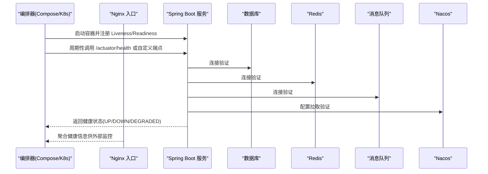
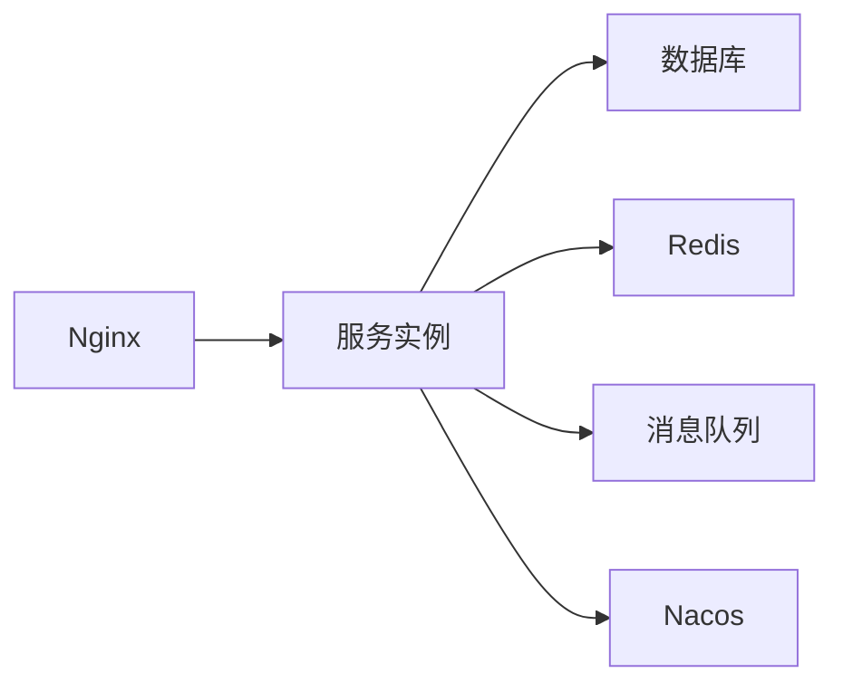

# 健康检查

<cite>
**本文引用的文件**   
- [health-check.sh](file://scripts/health-check.sh)
- [docker-compose.yml](file://docker-compose.yml)
- [application.yml](file://ZXYZdatabaseBack/zxyz-admin-service/src/main/resources/application.yml)
- [application-dev.yml](file://ZXYZdatabaseBack/zxyz-admin-service/src/main/resources/application-dev.yml)
- [application-prod.yml](file://ZXYZdatabaseBack/zxyz-admin-service/src/main/resources/application-prod.yml)
- [application.yml](file://ZXYZdatabaseBack/zxyz-audit-service/src/main/resources/application.yml)
- [application-dev.yml](file://ZXYZdatabaseBack/zxyz-audit-service/src/main/resources/application-dev.yml)
- [application-prod.yml](file://ZXYZdatabaseBack/zxyz-audit-service/src/main/resources/application-prod.yml)
- [application.yml](file://ZXYZdatabaseBack/zxyz-email-service/src/main/resources/application.yml)
- [application-dev.yml](file://ZXYZdatabaseBack/zxyz-email-service/src/main/resources/application-dev.yml)
- [application-prod.yml](file://ZXYZdatabaseBack/zxyz-email-service/src/main/resources/application-prod.yml)
- [application.yml](file://ZXYZdatabaseBack/zxyz-file-service/src/main/resources/application.yml)
- [application-dev.yml](file://ZXYZdatabaseBack/zxyz-file-service/src/main/resources/application-dev.yml)
- [application-prod.yml](file://ZXYZdatabaseBack/zxyz-file-service/src/main/resources/application-prod.yml)
- [application.yml](file://ZXYZdatabaseBack/zxyz-gateway/src/main/resources/application.yml)
- [application.yml](file://ZXYZdatabaseBack/zxyz-im-service/src/main/resources/application.yml)
- [application-dev.yml](file://ZXYZdatabaseBack/zxyz-im-service/src/main/resources/application-dev.yml)
- [application-prod.yml](file://ZXYZdatabaseBack/zxyz-im-service/src/main/resources/application-prod.yml)
- [application.yml](file://ZXYZdatabaseBack/zxyz-project-service/src/main/resources/application.yml)
- [application-dev.yml](file://ZXYZdatabaseBack/zxyz-project-service/src/main/resources/application-dev.yml)
- [application-prod.yml](file://ZXYZdatabaseBack/zxyz-project-service/src/main/resources/application-prod.yml)
- [application.yml](file://ZXYZdatabaseBack/zxyz-share-service/src/main/resources/application.yml)
- [application-dev.yml](file://ZXYZdatabaseBack/zxyz-share-service/src/main/resources/application-dev.yml)
- [application-prod.yml](file://ZXYZdatabaseBack/zxyz-share-service/src/main/resources/application-prod.yml)
- [application.yml](file://ZXYZdatabaseBack/zxyz-team-service/src/main/resources/application.yml)
- [application-dev.yml](file://ZXYZdatabaseBack/zxyz-team-service/src/main/resources/application-dev.yml)
- [application-prod.yml](file://ZXYZdatabaseBack/zxyz-team-service/src/main/resources/application-prod.yml)
- [application.yml](file://ZXYZdatabaseBack/zxyz-user-service/src/main/resources/application.yml)
- [application-dev.yml](file://ZXYZdatabaseBack/zxyz-user-service/src/main/resources/application-dev.yml)
- [application-prod.yml](file://ZXYZdatabaseBack/zxyz-user-service/src/main/resources/application-prod.yml)
- [application-common.yml](file://ZXYZdatabaseBack/zxyz-common/src/main/resources/application-common.yml)
- [default.conf](file://deploy/nginx/default.conf)
- [entrypoint.sh](file://deploy/nginx/entrypoint.sh)
- [zxyz-dynamic.yml](file://nacos-config/zxyz-dynamic.yml)
- [zxyz-static.yml](file://nacos-config/zxyz-static.yml)
- [ci-cd.yml](file://.github/workflows/ci-cd.yml)
</cite>

## 目录
1. [简介](#简介)
2. [项目结构](#项目结构)
3. [核心组件](#核心组件)
4. [架构总览](#架构总览)
5. [详细组件分析](#详细组件分析)
6. [依赖关系分析](#依赖关系分析)
7. [性能考虑](#性能考虑)
8. [故障排查指南](#故障排查指南)
9. [结论](#结论)
10. [附录](#附录)

## 简介
本文件面向 ZXYZ 微服务项目的健康检查体系，覆盖 Liveness（存活）探针、Readiness（就绪）探针与依赖服务检查策略。文档基于仓库中的脚本与配置进行梳理，给出可操作的实现建议、监控集成方案与故障排查路径，帮助运维与研发在容器化与编排环境中稳定运行。

## 项目结构
- 后端为多模块 Maven 工程，包含多个 Spring Boot 服务（如 admin、audit、email、file、gateway、im、project、share、team、user 等），每个服务均提供 application*.yml 配置文件。
- 部署使用 Docker Compose 编排，Nginx 作为入口网关，Promtail 用于日志采集。
- 健康检查相关脚本位于 scripts/health-check.sh；Nginx 入口配置位于 deploy/nginx/default.conf 与 entrypoint.sh。
- Nacos 管理动态与静态配置，CI/CD 通过 GitHub Actions 执行构建与发布流程。

图表来源
- [docker-compose.yml](file://docker-compose.yml)
- [default.conf](file://deploy/nginx/default.conf)
- [entrypoint.sh](file://deploy/nginx/entrypoint.sh)

章节来源
- [docker-compose.yml](file://docker-compose.yml)
- [default.conf](file://deploy/nginx/default.conf)
- [entrypoint.sh](file://deploy/nginx/entrypoint.sh)

## 核心组件
- 健康检查脚本：scripts/health-check.sh，用于对关键依赖进行连通性检测，可作为容器健康检查或外部巡检工具。
- 各服务 application*.yml：定义数据源、Redis、RabbitMQ、Nacos 等连接参数，是健康检查的基础依据。
- Nginx 入口：默认站点配置与健康检查路由的承载点，便于统一暴露健康端点。
- CI/CD 流水线：可在构建阶段执行健康检查脚本，确保镜像可用性。

章节来源
- [health-check.sh](file://scripts/health-check.sh)
- [application.yml](file://ZXYZdatabaseBack/zxyz-admin-service/src/main/resources/application.yml)
- [application-dev.yml](file://ZXYZdatabaseBack/zxyz-admin-service/src/main/resources/application-dev.yml)
- [application-prod.yml](file://ZXYZdatabaseBack/zxyz-admin-service/src/main/resources/application-prod.yml)
- [application.yml](file://ZXYZdatabaseBack/zxyz-audit-service/src/main/resources/application.yml)
- [application-dev.yml](file://ZXYZdatabaseBack/zxyz-audit-service/src/main/resources/application-dev.yml)
- [application-prod.yml](file://ZXYZdatabaseBack/zxyz-audit-service/src/main/resources/application-prod.yml)
- [application.yml](file://ZXYZdatabaseBack/zxyz-email-service/src/main/resources/application.yml)
- [application-dev.yml](file://ZXYZdatabaseBack/zxyz-email-service/src/main/resources/application-dev.yml)
- [application-prod.yml](file://ZXYZdatabaseBack/zxyz-email-service/src/main/resources/application-prod.yml)
- [application.yml](file://ZXYZdatabaseBack/zxyz-file-service/src/main/resources/application.yml)
- [application-dev.yml](file://ZXYZdatabaseBack/zxyz-file-service/src/main/resources/application-dev.yml)
- [application-prod.yml](file://ZXYZdatabaseBack/zxyz-file-service/src/main/resources/application-prod.yml)
- [application.yml](file://ZXYZdatabaseBack/zxyz-gateway/src/main/resources/application.yml)
- [application.yml](file://ZXYZdatabaseBack/zxyz-im-service/src/main/resources/application.yml)
- [application-dev.yml](file://ZXYZdatabaseBack/zxyz-im-service/src/main/resources/application-dev.yml)
- [application-prod.yml](file://ZXYZdatabaseBack/zxyz-im-service/src/main/resources/application-prod.yml)
- [application.yml](file://ZXYZdatabaseBack/zxyz-project-service/src/main/resources/application.yml)
- [application-dev.yml](file://ZXYZdatabaseBack/zxyz-project-service/src/main/resources/application-dev.yml)
- [application-prod.yml](file://ZXYZdatabaseBack/zxyz-project-service/src/main/resources/application-prod.yml)
- [application.yml](file://ZXYZdatabaseBack/zxyz-share-service/src/main/resources/application.yml)
- [application-dev.yml](file://ZXYZdatabaseBack/zxyz-share-service/src/main/resources/application-dev.yml)
- [application-prod.yml](file://ZXYZdatabaseBack/zxyz-share-service/src/main/resources/application-prod.yml)
- [application.yml](file://ZXYZdatabaseBack/zxyz-team-service/src/main/resources/application.yml)
- [application-dev.yml](file://ZXYZdatabaseBack/zxyz-team-service/src/main/resources/application-dev.yml)
- [application-prod.yml](file://ZXYZdatabaseBack/zxyz-team-service/src/main/resources/application-prod.yml)
- [application.yml](file://ZXYZdatabaseBack/zxyz-user-service/src/main/resources/application.yml)
- [application-dev.yml](file://ZXYZdatabaseBack/zxyz-user-service/src/main/resources/application-dev.yml)
- [application-prod.yml](file://ZXYZdatabaseBack/zxyz-user-service/src/main/resources/application-prod.yml)
- [application-common.yml](file://ZXYZdatabaseBack/zxyz-common/src/main/resources/application-common.yml)
- [default.conf](file://deploy/nginx/default.conf)
- [entrypoint.sh](file://deploy/nginx/entrypoint.sh)
- [ci-cd.yml](file://.github/workflows/ci-cd.yml)

## 架构总览
健康检查体系由“容器编排 + 入口网关 + 服务内健康端点 + 外部巡检脚本”组成：
- Liveness 探针：用于判定进程是否存活，失败将触发重启。
- Readiness 探针：用于判定服务是否可接收流量，失败将从负载均衡摘除。
- 依赖服务检查：校验数据库、Redis、消息队列、配置中心等依赖是否可用。
- 统一入口：Nginx 暴露健康端点，聚合各服务状态，便于外部监控系统抓取。

图表来源
- [docker-compose.yml](file://docker-compose.yml)
- [default.conf](file://deploy/nginx/default.conf)
- [application.yml](file://ZXYZdatabaseBack/zxyz-admin-service/src/main/resources/application.yml)
- [application.yml](file://ZXYZdatabaseBack/zxyz-audit-service/src/main/resources/application.yml)
- [application.yml](file://ZXYZdatabaseBack/zxyz-email-service/src/main/resources/application.yml)
- [application.yml](file://ZXYZdatabaseBack/zxyz-file-service/src/main/resources/application.yml)
- [application.yml](file://ZXYZdatabaseBack/zxyz-gateway/src/main/resources/application.yml)
- [application.yml](file://ZXYZdatabaseBack/zxyz-im-service/src/main/resources/application.yml)
- [application.yml](file://ZXYZdatabaseBack/zxyz-project-service/src/main/resources/application.yml)
- [application.yml](file://ZXYZdatabaseBack/zxyz-share-service/src/main/resources/application.yml)
- [application.yml](file://ZXYZdatabaseBack/zxyz-team-service/src/main/resources/application.yml)
- [application.yml](file://ZXYZdatabaseBack/zxyz-user-service/src/main/resources/application.yml)
- [application-common.yml](file://ZXYZdatabaseBack/zxyz-common/src/main/resources/application-common.yml)

## 详细组件分析

### Liveness 探针设计
- 目标：快速判断进程是否处于有效运行状态，避免僵尸进程占用资源。
- 建议实现：
  - 轻量级 HTTP 端点（如 /actuator/health/liveness），仅检查 JVM 与核心线程池状态。
  - 超时与重试策略需短小精悍，避免误杀。
- 编排集成：
  - Docker Compose 可通过 healthcheck 命令定期执行脚本或 curl 端点。
  - K8s 中通过 livenessProbe 配置 HTTP GET 或脚本探测。

章节来源
- [docker-compose.yml](file://docker-compose.yml)
- [health-check.sh](file://scripts/health-check.sh)

### Readiness 探针设计
- 目标：确认服务已完全初始化并可处理请求，包括依赖服务连通性。
- 建议实现：
  - 读取 application*.yml 中的依赖配置，依次校验数据库、Redis、消息队列、Nacos 等。
  - 若任一关键依赖不可用，返回 DOWN 或 DEGRADED 以阻止流量进入。
- 编排集成：
  - Docker Compose 的 healthcheck 或 K8s 的 readinessProbe 调用同一健康逻辑。

章节来源
- [application.yml](file://ZXYZdatabaseBack/zxyz-admin-service/src/main/resources/application.yml)
- [application-dev.yml](file://ZXYZdatabaseBack/zxyz-admin-service/src/main/resources/application-dev.yml)
- [application-prod.yml](file://ZXYZdatabaseBack/zxyz-admin-service/src/main/resources/application-prod.yml)
- [application.yml](file://ZXYZdatabaseBack/zxyz-audit-service/src/main/resources/application.yml)
- [application-dev.yml](file://ZXYZdatabaseBack/zxyz-audit-service/src/main/resources/application-dev.yml)
- [application-prod.yml](file://ZXYZdatabaseBack/zxyz-audit-service/src/main/resources/application-prod.yml)
- [application.yml](file://ZXYZdatabaseBack/zxyz-email-service/src/main/resources/application.yml)
- [application-dev.yml](file://ZXYZdatabaseBack/zxyz-email-service/src/main/resources/application-dev.yml)
- [application-prod.yml](file://ZXYZdatabaseBack/zxyz-email-service/src/main/resources/application-prod.yml)
- [application.yml](file://ZXYZdatabaseBack/zxyz-file-service/src/main/resources/application.yml)
- [application-dev.yml](file://ZXYZdatabaseBack/zxyz-file-service/src/main/resources/application-dev.yml)
- [application-prod.yml](file://ZXYZdatabaseBack/zxyz-file-service/src/main/resources/application-prod.yml)
- [application.yml](file://ZXYZdatabaseBack/zxyz-gateway/src/main/resources/application.yml)
- [application.yml](file://ZXYZdatabaseBack/zxyz-im-service/src/main/resources/application.yml)
- [application-dev.yml](file://ZXYZdatabaseBack/zxyz-im-service/src/main/resources/application-dev.yml)
- [application-prod.yml](file://ZXYZdatabaseBack/zxyz-im-service/src/main/resources/application-prod.yml)
- [application.yml](file://ZXYZdatabaseBack/zxyz-project-service/src/main/resources/application.yml)
- [application-dev.yml](file://ZXYZdatabaseBack/zxyz-project-service/src/main/resources/application-dev.yml)
- [application-prod.yml](file://ZXYZdatabaseBack/zxyz-project-service/src/main/resources/application-prod.yml)
- [application.yml](file://ZXYZdatabaseBack/zxyz-share-service/src/main/resources/application.yml)
- [application-dev.yml](file://ZXYZdatabaseBack/zxyz-share-service/src/main/resources/application-dev.yml)
- [application-prod.yml](file://ZXYZdatabaseBack/zxyz-share-service/src/main/resources/application-prod.yml)
- [application.yml](file://ZXYZdatabaseBack/zxyz-team-service/src/main/resources/application.yml)
- [application-dev.yml](file://ZXYZdatabaseBack/zxyz-team-service/src/main/resources/application-dev.yml)
- [application-prod.yml](file://ZXYZdatabaseBack/zxyz-team-service/src/main/resources/application-prod.yml)
- [application.yml](file://ZXYZdatabaseBack/zxyz-user-service/src/main/resources/application.yml)
- [application-dev.yml](file://ZXYZdatabaseBack/zxyz-user-service/src/main/resources/application-dev.yml)
- [application-prod.yml](file://ZXYZdatabaseBack/zxyz-user-service/src/main/resources/application-prod.yml)
- [application-common.yml](file://ZXYZdatabaseBack/zxyz-common/src/main/resources/application-common.yml)

### 依赖服务检查策略
- 数据库连接验证：
  - 校验连接字符串、用户名密码、网络可达性与最小查询（如 SELECT 1）。
  - 失败时标记 DOWN，并在 Readiness 中阻止入站流量。
- Redis 缓存可用性：
  - 校验连接与基本读写（SET/GET），记录延迟阈值。
  - 高延迟或失败时降级为只读或跳过非关键缓存写入。
- 消息队列连接状态：
  - 校验 RabbitMQ 连接与 Topic Exchange zxyz.topic 的发送能力。
  - 失败时启用本地缓冲或延迟重试，保证最终一致性。
- 配置中心（Nacos）：
  - 校验配置拉取与热更新能力，失败时回退到本地缓存配置。

章节来源
- [application.yml](file://ZXYZdatabaseBack/zxyz-admin-service/src/main/resources/application.yml)
- [application.yml](file://ZXYZdatabaseBack/zxyz-audit-service/src/main/resources/application.yml)
- [application.yml](file://ZXYZdatabaseBack/zxyz-email-service/src/main/resources/application.yml)
- [application.yml](file://ZXYZdatabaseBack/zxyz-file-service/src/main/resources/application.yml)
- [application.yml](file://ZXYZdatabaseBack/zxyz-gateway/src/main/resources/application.yml)
- [application.yml](file://ZXYZdatabaseBack/zxyz-im-service/src/main/resources/application.yml)
- [application.yml](file://ZXYZdatabaseBack/zxyz-project-service/src/main/resources/application.yml)
- [application.yml](file://ZXYZdatabaseBack/zxyz-share-service/src/main/resources/application.yml)
- [application.yml](file://ZXYZdatabaseBack/zxyz-team-service/src/main/resources/application.yml)
- [application.yml](file://ZXYZdatabaseBack/zxyz-user-service/src/main/resources/application.yml)
- [application-common.yml](file://ZXYZdatabaseBack/zxyz-common/src/main/resources/application-common.yml)
- [zxyz-dynamic.yml](file://nacos-config/zxyz-dynamic.yml)
- [zxyz-static.yml](file://nacos-config/zxyz-static.yml)

### 检查结果定义与降级策略
- 健康状态定义：
  - UP：所有关键依赖正常，服务可接收流量。
  - DOWN：关键依赖不可用或服务未初始化完成，拒绝新请求。
  - DEGRADED：部分非关键依赖异常，功能受限但可继续提供服务。
- 降级策略：
  - 缓存不可用时，降级为直连数据库或跳过缓存写入。
  - 消息队列不可用时，启用本地持久化缓冲与定时重发。
  - 配置中心不可用时，回退到本地缓存配置并告警。
- 故障转移机制：
  - 多实例部署下，Readiness 失败的服务将被负载均衡摘除。
  - 自动恢复：依赖恢复后，Readiness 成功重新接入流量。

章节来源
- [health-check.sh](file://scripts/health-check.sh)
- [application.yml](file://ZXYZdatabaseBack/zxyz-admin-service/src/main/resources/application.yml)
- [application.yml](file://ZXYZdatabaseBack/zxyz-audit-service/src/main/resources/application.yml)
- [application.yml](file://ZXYZdatabaseBack/zxyz-email-service/src/main/resources/application.yml)
- [application.yml](file://ZXYZdatabaseBack/zxyz-file-service/src/main/resources/application.yml)
- [application.yml](file://ZXYZdatabaseBack/zxyz-gateway/src/main/resources/application.yml)
- [application.yml](file://ZXYZdatabaseBack/zxyz-im-service/src/main/resources/application.yml)
- [application.yml](file://ZXYZdatabaseBack/zxyz-project-service/src/main/resources/application.yml)
- [application.yml](file://ZXYZdatabaseBack/zxyz-share-service/src/main/resources/application.yml)
- [application.yml](file://ZXYZdatabaseBack/zxyz-team-service/src/main/resources/application.yml)
- [application.yml](file://ZXYZdatabaseBack/zxyz-user-service/src/main/resources/application.yml)
- [application-common.yml](file://ZXYZdatabaseBack/zxyz-common/src/main/resources/application-common.yml)

### 监控集成与告警规则
- 健康指标暴露：
  - 通过 Nginx 统一入口暴露健康端点，聚合各服务状态。
  - 可选接入 Prometheus/Grafana 抓取 /actuator/metrics 或自定义指标。
- 告警规则配置：
  - 当 Readiness 连续失败超过阈值触发告警。
  - 依赖延迟超过阈值（如 Redis 响应时间 > 200ms）触发降级告警。
  - 消息队列积压或消费失败率超阈值触发告警。
- 自动恢复流程：
  - 编排器根据探针结果自动重启或摘除实例。
  - 依赖恢复后，Readiness 成功自动恢复流量。

章节来源
- [default.conf](file://deploy/nginx/default.conf)
- [entrypoint.sh](file://deploy/nginx/entrypoint.sh)
- [ci-cd.yml](file://.github/workflows/ci-cd.yml)

### 健康检查配置示例
- Docker Compose 健康检查：
  - 在每个服务的 container 配置中添加 healthcheck，调用 health-check.sh 或 curl 健康端点。
- Nginx 健康路由：
  - 在 default.conf 中增加 /health 路由，转发至各服务健康端点。
- 环境变量与敏感配置：
  - 使用 Jasypt 加密敏感配置，避免明文泄露。
  - 通过 Nacos 动态下发健康检查阈值与开关。

章节来源
- [docker-compose.yml](file://docker-compose.yml)
- [default.conf](file://deploy/nginx/default.conf)
- [entrypoint.sh](file://deploy/nginx/entrypoint.sh)
- [zxyz-dynamic.yml](file://nacos-config/zxyz-dynamic.yml)
- [zxyz-static.yml](file://nacos-config/zxyz-static.yml)

## 依赖关系分析
健康检查与各依赖的关系如下：
- 服务 → 数据库：连接与查询验证
- 服务 → Redis：连接与读写验证
- 服务 → 消息队列：连接与发送验证
- 服务 → Nacos：配置拉取验证
- Nginx → 服务：健康端点聚合

图表来源
- [application.yml](file://ZXYZdatabaseBack/zxyz-admin-service/src/main/resources/application.yml)
- [application.yml](file://ZXYZdatabaseBack/zxyz-audit-service/src/main/resources/application.yml)
- [application.yml](file://ZXYZdatabaseBack/zxyz-email-service/src/main/resources/application.yml)
- [application.yml](file://ZXYZdatabaseBack/zxyz-file-service/src/main/resources/application.yml)
- [application.yml](file://ZXYZdatabaseBack/zxyz-gateway/src/main/resources/application.yml)
- [application.yml](file://ZXYZdatabaseBack/zxyz-im-service/src/main/resources/application.yml)
- [application.yml](file://ZXYZdatabaseBack/zxyz-project-service/src/main/resources/application.yml)
- [application.yml](file://ZXYZdatabaseBack/zxyz-share-service/src/main/resources/application.yml)
- [application.yml](file://ZXYZdatabaseBack/zxyz-team-service/src/main/resources/application.yml)
- [application.yml](file://ZXYZdatabaseBack/zxyz-user-service/src/main/resources/application.yml)
- [application-common.yml](file://ZXYZdatabaseBack/zxyz-common/src/main/resources/application-common.yml)
- [default.conf](file://deploy/nginx/default.conf)

章节来源
- [application.yml](file://ZXYZdatabaseBack/zxyz-admin-service/src/main/resources/application.yml)
- [application.yml](file://ZXYZdatabaseBack/zxyz-audit-service/src/main/resources/application.yml)
- [application.yml](file://ZXYZdatabaseBack/zxyz-email-service/src/main/resources/application.yml)
- [application.yml](file://ZXYZdatabaseBack/zxyz-file-service/src/main/resources/application.yml)
- [application.yml](file://ZXYZdatabaseBack/zxyz-gateway/src/main/resources/application.yml)
- [application.yml](file://ZXYZdatabaseBack/zxyz-im-service/src/main/resources/application.yml)
- [application.yml](file://ZXYZdatabaseBack/zxyz-project-service/src/main/resources/application.yml)
- [application.yml](file://ZXYZdatabaseBack/zxyz-share-service/src/main/resources/application.yml)
- [application.yml](file://ZXYZdatabaseBack/zxyz-team-service/src/main/resources/application.yml)
- [application.yml](file://ZXYZdatabaseBack/zxyz-user-service/src/main/resources/application.yml)
- [application-common.yml](file://ZXYZdatabaseBack/zxyz-common/src/main/resources/application-common.yml)
- [default.conf](file://deploy/nginx/default.conf)

## 性能考虑
- 健康检查频率：Liveness 间隔较短（如 10s），Readiness 间隔适中（如 30s），避免频繁探测影响性能。
- 超时设置：单次探测超时控制在 2-5s，避免阻塞编排器调度。
- 依赖探测优化：优先检查连接建立，再执行轻量操作（如 SELECT 1、SET/GET），减少 IO 开销。
- 批量健康检查：在脚本中并行检查多个依赖，缩短整体耗时。

[本节为通用指导，不直接分析具体文件]

## 故障排查指南
- 常见问题定位：
  - 数据库连接失败：检查连接字符串、网络策略、账号权限。
  - Redis 不可用：检查端口、认证、内存限制与网络连通性。
  - 消息队列连接失败：检查 RabbitMQ 服务状态、Topic 是否存在、权限配置。
  - Nacos 配置拉取失败：检查服务地址、鉴权、网络策略。
- 排查步骤：
  - 查看健康检查脚本输出与日志。
  - 通过 Nginx 健康端点聚合状态，定位具体服务。
  - 逐步隔离依赖，确认问题范围。
- 恢复措施：
  - 修复依赖后，等待 Readiness 成功自动恢复流量。
  - 必要时手动重启服务或清理缓存。

章节来源
- [health-check.sh](file://scripts/health-check.sh)
- [default.conf](file://deploy/nginx/default.conf)
- [application.yml](file://ZXYZdatabaseBack/zxyz-admin-service/src/main/resources/application.yml)
- [application.yml](file://ZXYZdatabaseBack/zxyz-audit-service/src/main/resources/application.yml)
- [application.yml](file://ZXYZdatabaseBack/zxyz-email-service/src/main/resources/application.yml)
- [application.yml](file://ZXYZdatabaseBack/zxyz-file-service/src/main/resources/application.yml)
- [application.yml](file://ZXYZdatabaseBack/zxyz-gateway/src/main/resources/application.yml)
- [application.yml](file://ZXYZdatabaseBack/zxyz-im-service/src/main/resources/application.yml)
- [application.yml](file://ZXYZdatabaseBack/zxyz-project-service/src/main/resources/application.yml)
- [application.yml](file://ZXYZdatabaseBack/zxyz-share-service/src/main/resources/application.yml)
- [application.yml](file://ZXYZdatabaseBack/zxyz-team-service/src/main/resources/application.yml)
- [application.yml](file://ZXYZdatabaseBack/zxyz-user-service/src/main/resources/application.yml)
- [application-common.yml](file://ZXYZdatabaseBack/zxyz-common/src/main/resources/application-common.yml)

## 结论
ZXYZ 项目的健康检查体系围绕容器编排与入口网关展开，结合脚本与配置文件实现对关键依赖的全面校验。通过合理的 Liveness/Readiness 策略、依赖检查与降级机制，确保系统在异常情况下仍能保持稳定与可恢复。建议持续完善监控与告警，提升故障发现与自愈能力。

[本节为总结性内容，不直接分析具体文件]

## 附录
- 健康检查脚本路径：scripts/health-check.sh
- Nginx 入口配置：deploy/nginx/default.conf、deploy/nginx/entrypoint.sh
- 服务配置文件：各服务的 application*.yml
- 动态配置：nacos-config/zxyz-dynamic.yml、nacos-config/zxyz-static.yml
- CI/CD 流水线：.github/workflows/ci-cd.yml

章节来源
- [health-check.sh](file://scripts/health-check.sh)
- [default.conf](file://deploy/nginx/default.conf)
- [entrypoint.sh](file://deploy/nginx/entrypoint.sh)
- [application.yml](file://ZXYZdatabaseBack/zxyz-admin-service/src/main/resources/application.yml)
- [application.yml](file://ZXYZdatabaseBack/zxyz-audit-service/src/main/resources/application.yml)
- [application.yml](file://ZXYZdatabaseBack/zxyz-email-service/src/main/resources/application.yml)
- [application.yml](file://ZXYZdatabaseBack/zxyz-file-service/src/main/resources/application.yml)
- [application.yml](file://ZXYZdatabaseBack/zxyz-gateway/src/main/resources/application.yml)
- [application.yml](file://ZXYZdatabaseBack/zxyz-im-service/src/main/resources/application.yml)
- [application.yml](file://ZXYZdatabaseBack/zxyz-project-service/src/main/resources/application.yml)
- [application.yml](file://ZXYZdatabaseBack/zxyz-share-service/src/main/resources/application.yml)
- [application.yml](file://ZXYZdatabaseBack/zxyz-team-service/src/main/resources/application.yml)
- [application.yml](file://ZXYZdatabaseBack/zxyz-user-service/src/main/resources/application.yml)
- [application-common.yml](file://ZXYZdatabaseBack/zxyz-common/src/main/resources/application-common.yml)
- [zxyz-dynamic.yml](file://nacos-config/zxyz-dynamic.yml)
- [zxyz-static.yml](file://nacos-config/zxyz-static.yml)
- [ci-cd.yml](file://.github/workflows/ci-cd.yml)