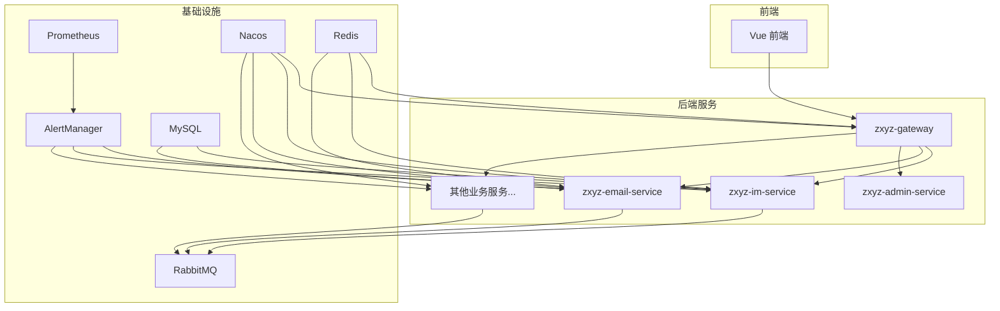
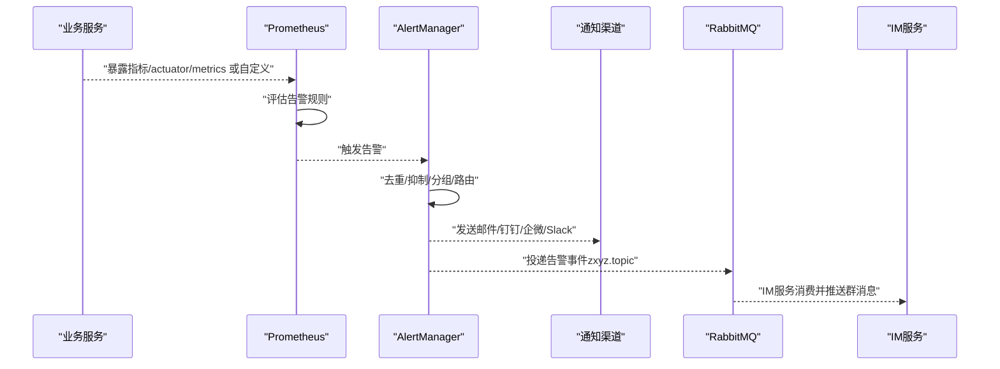
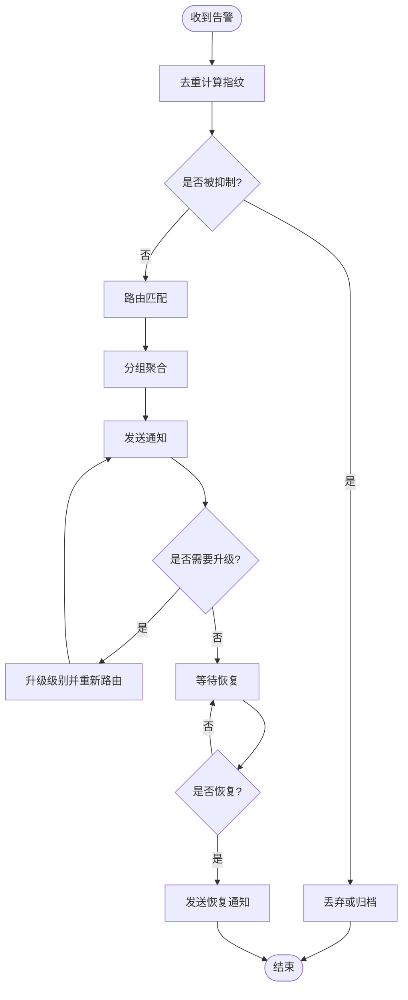
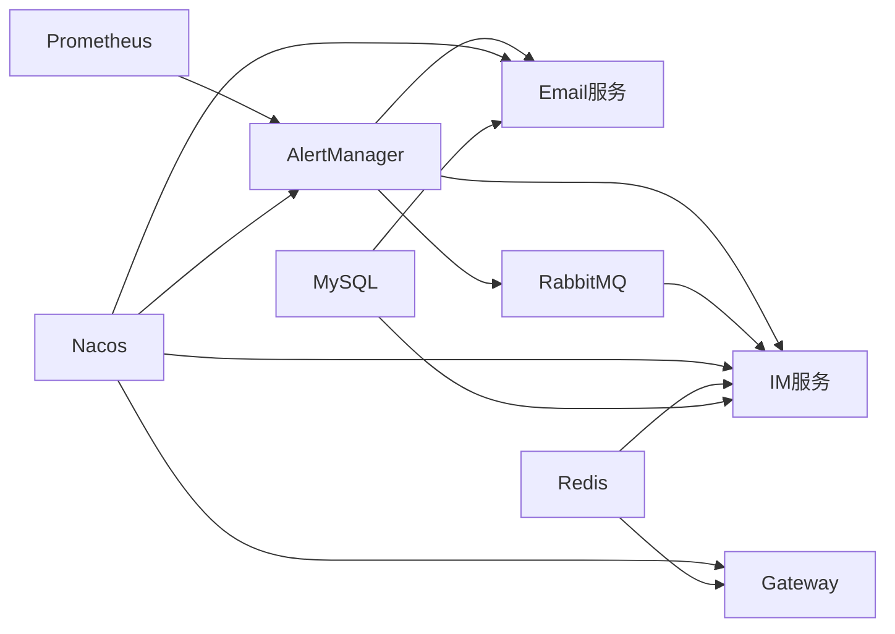

# 告警系统

<cite>
**本文引用的文件**   
- [架构文档](file://docs/architecture.md)
- [基础设施文档](file://docs/infrastructure.md)
- [API契约](file://docs/api-contract.md)
- [后端应用配置（通用）](file://ZXYZdatabaseBack/zxyz-common/src/main/resources/application-common.yml)
- [网关应用配置](file://ZXYZdatabaseBack/zxyz-gateway/src/main/resources/application.yml)
- [IM服务应用配置（开发）](file://ZXYZdatabaseBack/zxyz-im-service/src/main/resources/application-dev.yml)
- [邮件服务应用配置（开发）](file://ZXYZdatabaseBack/zxyz-email-service/src/main/resources/application-dev.yml)
- [Nacos动态配置](file://nacos-config/zxyz-dynamic.yml)
- [Nacos静态配置（网关）](file://nacos-config/zxyz-gateway.yml)
- [Nacos静态配置（IM服务）](file://nacos-config/zxyz-im-service.yml)
- [Nacos静态配置（邮件服务）](file://nacos-config/zxyz-email-service.yml)
- [Docker Compose（生产编排）](file://docker-compose.yml)
- [Docker Compose（开发编排）](file://docker-compose.dev.yml)
- [部署脚本](file://deploy/nginx/default.conf)
- [CI/CD流水线](file://.github/workflows/ci-cd.yml)
</cite>

## 目录
1. [简介](#简介)
2. [项目结构](#项目结构)
3. [核心组件](#核心组件)
4. [架构总览](#架构总览)
5. [详细组件分析](#详细组件分析)
6. [依赖分析](#依赖分析)
7. [性能考虑](#性能考虑)
8. [故障处理指南](#故障处理指南)
9. [结论](#结论)
10. [附录](#附录)

## 简介
本文件为 ZXYZ 项目的告警系统设计文档，覆盖以下方面：
- 告警架构：AlertManager 配置、告警规则定义、通知渠道管理
- 告警规则：阈值设置、告警级别划分、抑制规则配置、静默时段设置
- 通知渠道：邮件、钉钉机器人、企业微信、Slack 集成
- 告警处理：去重、升级策略、自动恢复通知、历史查询
- 告警优化：误报减少、风暴防护、智能降噪
- 配置示例与故障处理流程

说明：当前仓库未包含独立的 AlertManager 或 Prometheus 源码实现，但通过 Nacos 配置、Docker Compose 编排以及各服务的配置文件，可明确告警系统的运行环境与集成点。本文基于现有工程结构与配置进行系统化梳理，并给出落地建议与最佳实践。

## 项目结构
ZXYZ 采用微服务架构，后端由多个 Maven 模块组成，前端为 Vue 3 + Element Plus。告警相关能力主要分布在以下位置：
- 基础设施与编排：Docker Compose、Nginx 配置、CI/CD 流水线
- 运行时配置：Nacos 动态/静态配置与各服务 application*.yml
- 服务间通信：内部端点 /api/internal/** 经 Gateway SaToken 鉴权，RabbitMQ Topic Exchange zxyz.topic 用于异步事件

图表来源
- [Docker Compose（生产编排）](file://docker-compose.yml)
- [Docker Compose（开发编排）](file://docker-compose.dev.yml)
- [网关应用配置](file://ZXYZdatabaseBack/zxyz-gateway/src/main/resources/application.yml)
- [IM服务应用配置（开发）](file://ZXYZdatabaseBack/zxyz-im-service/src/main/resources/application-dev.yml)
- [邮件服务应用配置（开发）](file://ZXYZdatabaseBack/zxyz-email-service/src/main/resources/application-dev.yml)
- [Nacos动态配置](file://nacos-config/zxyz-dynamic.yml)
- [Nacos静态配置（网关）](file://nacos-config/zxyz-gateway.yml)
- [Nacos静态配置（IM服务）](file://nacos-config/zxyz-im-service.yml)
- [Nacos静态配置（邮件服务）](file://nacos-config/zxyz-email-service.yml)

章节来源
- [架构文档](file://docs/architecture.md)
- [基础设施文档](file://docs/infrastructure.md)

## 核心组件
- 指标采集与存储：Prometheus（负责采集各服务暴露的指标，如 JVM、HTTP、业务关键指标）
- 告警引擎：AlertManager（负责规则评估、去重、抑制、路由、通知）
- 通知渠道：邮件、钉钉机器人、企业微信、Slack（通过 AlertManager 的 receivers 配置）
- 配置中心：Nacos（集中管理各服务与中间件配置，包括 AlertManager 路由与通道参数）
- 消息总线：RabbitMQ（Topic Exchange zxyz.topic，用于异步告警事件分发与消费）
- 网关与鉴权：Gateway + SaToken（统一鉴权与限流，保护内部端点）

章节来源
- [API契约](file://docs/api-contract.md)
- [基础设施文档](file://docs/infrastructure.md)

## 架构总览
告警系统整体流程：
- 各服务暴露指标（如 HTTP 错误率、延迟、队列积压等）
- Prometheus 定时抓取指标并评估规则
- 触发告警后推送至 AlertManager
- AlertManager 执行去重、抑制、分组、路由
- 根据路由将告警发送至对应通知渠道（邮件、钉钉、企微、Slack）
- 可选：通过 RabbitMQ 将告警事件投递到下游系统（如 IM 服务、审计服务）

图表来源
- [Docker Compose（生产编排）](file://docker-compose.yml)
- [Nacos动态配置](file://nacos-config/zxyz-dynamic.yml)
- [IM服务应用配置（开发）](file://ZXYZdatabaseBack/zxyz-im-service/src/main/resources/application-dev.yml)
- [邮件服务应用配置（开发）](file://ZXYZdatabaseBack/zxyz-email-service/src/main/resources/application-dev.yml)

## 详细组件分析

### AlertManager 配置与路由
- 目标：统一管理告警接收器、路由树、抑制与静默策略
- 关键点：
  - receivers：定义邮件、钉钉、企微、Slack 等通道
  - route：按团队/环境/严重等级进行分派
  - group_by：按实例、服务、区域等维度聚合
  - inhibit_rules：相同根因告警抑制
  - mute_time_intervals：维护窗口与静默时段
  - templates：统一告警模板（标题、内容、链接）

章节来源
- [Nacos动态配置](file://nacos-config/zxyz-dynamic.yml)
- [Nacos静态配置（网关）](file://nacos-config/zxyz-gateway.yml)
- [Nacos静态配置（IM服务）](file://nacos-config/zxyz-im-service.yml)
- [Nacos静态配置（邮件服务）](file://nacos-config/zxyz-email-service.yml)

### 告警规则定义（Prometheus）
- 指标来源：JVM、HTTP、DB连接池、队列长度、业务KPI
- 阈值设置：
  - 错误率 > X%（持续 Y 分钟）
  - P95/P99 延迟 > 阈值
  - 队列积压 > 阈值且持续增长
  - DB 连接池耗尽或等待时间过长
- 级别划分：
  - P1（致命）：核心链路不可用、数据丢失风险
  - P2（严重）：功能降级、影响部分用户
  - P3（警告）：潜在风险、需关注
  - P4（提示）：信息性告警
- 抑制规则：
  - 同一根因（如机房宕机）抑制衍生告警
  - 维护期抑制非关键告警
- 静默时段：
  - 发布窗口、计划维护、节假日

章节来源
- [基础设施文档](file://docs/infrastructure.md)
- [API契约](file://docs/api-contract.md)

### 通知渠道管理
- 邮件通知：SMTP 服务器、发件人、收件人组、模板变量
- 钉钉机器人：Webhook URL、签名校验、@指定人员
- 企业微信：应用ID、Secret、AgentId、部门/成员ID
- Slack：Webhook URL、频道、Markdown 模板
- 路由策略：按标签（team、env、severity）选择 receiver

章节来源
- [Nacos动态配置](file://nacos-config/zxyz-dynamic.yml)
- [邮件服务应用配置（开发）](file://ZXYZdatabaseBack/zxyz-email-service/src/main/resources/application-dev.yml)

### 告警处理流程
- 去重：基于指纹（fingerprint）合并重复告警
- 升级策略：P3→P2→P1 逐级升级（超时未处理）
- 自动恢复：条件满足时发送恢复通知
- 历史查询：通过 Prometheus UI 或 API 查询告警历史

图表来源
- [Nacos动态配置](file://nacos-config/zxyz-dynamic.yml)
- [IM服务应用配置（开发）](file://ZXYZdatabaseBack/zxyz-im-service/src/main/resources/application-dev.yml)

### 告警优化策略
- 误报减少：
  - 合理阈值与持续时间
  - 多指标联合判断（如错误率+延迟）
  - 基线对比（同比/环比）
- 告警风暴防护：
  - 快速收敛（group_wait、group_interval）
  - 抑制规则（同根因抑制）
  - 静默时段（发布窗口）
- 智能降噪：
  - 按服务/团队聚合
  - 动态阈值（机器学习基线）
  - 告警疲劳度统计与自动降频

章节来源
- [基础设施文档](file://docs/infrastructure.md)
- [API契约](file://docs/api-contract.md)

## 依赖分析
- 外部依赖：
  - Prometheus/AlertManager：告警核心
  - RabbitMQ：异步事件分发
  - Nacos：配置中心
  - Redis：会话与缓存
  - MySQL：持久化
- 内部依赖：
  - Gateway 统一鉴权与路由
  - IM 服务：告警事件消费与即时通知
  - Email 服务：邮件发送与模板渲染

图表来源
- [Docker Compose（生产编排）](file://docker-compose.yml)
- [Nacos动态配置](file://nacos-config/zxyz-dynamic.yml)
- [网关应用配置](file://ZXYZdatabaseBack/zxyz-gateway/src/main/resources/application.yml)

章节来源
- [基础设施文档](file://docs/infrastructure.md)
- [API契约](file://docs/api-contract.md)

## 性能考虑
- 指标采集频率：避免过高频率导致采集压力
- 规则评估：复杂表达式需拆分与缓存
- 告警聚合：合理设置 group_by 与 group_wait
- 通知限流：对高频渠道（如钉钉）进行速率限制
- 存储容量：Prometheus 与 AlertManager 日志与历史数据定期清理

[本节为通用指导，不直接分析具体文件]

## 故障处理指南
- 常见问题：
  - 指标未上报：检查服务健康端点与 Prometheus 抓取配置
  - 告警未触发：核对规则表达式与阈值
  - 通知失败：验证渠道配置（Webhook、SMTP、签名）
  - 告警风暴：启用抑制与静默，调整聚合策略
- 排查步骤：
  - 查看 Prometheus 规则状态与最近评估结果
  - 检查 AlertManager 路由与 receivers 配置
  - 确认 RabbitMQ 队列与消费者状态
  - 验证 Nacos 配置是否生效
- 回滚与恢复：
  - 使用 CI/CD 回滚到上一版本
  - 临时关闭告警规则或降低敏感度
  - 通过静默时段避免干扰

章节来源
- [部署脚本](file://deploy/nginx/default.conf)
- [CI/CD流水线](file://.github/workflows/ci-cd.yml)

## 结论
ZXYZ 告警系统以 Prometheus + AlertManager 为核心，结合 Nacos 配置管理与 RabbitMQ 异步事件，形成完整的告警采集、评估、路由与通知闭环。通过合理的阈值、抑制与静默策略，可有效降低误报与告警风暴，提升运维效率。建议持续优化告警规则与通知渠道，建立完善的告警治理体系。

[本节为总结性内容，不直接分析具体文件]

## 附录
- 配置示例路径：
  - AlertManager 路由与通道：见 Nacos 动态配置
  - 服务指标暴露：参考各服务 application*.yml
  - 通知模板：在 AlertManager 模板中定义
- 监控看板建议：
  - 服务健康度（错误率、延迟、吞吐量）
  - 资源使用（CPU、内存、磁盘、网络）
  - 业务KPI（订单量、转化率、用户活跃度）

[本节为补充信息，不直接分析具体文件]