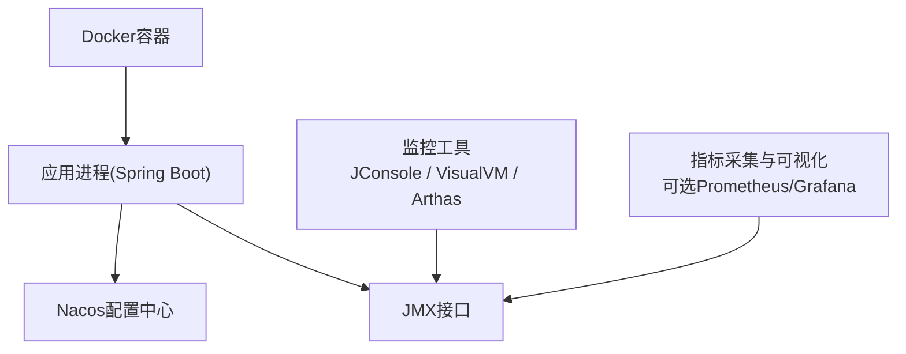
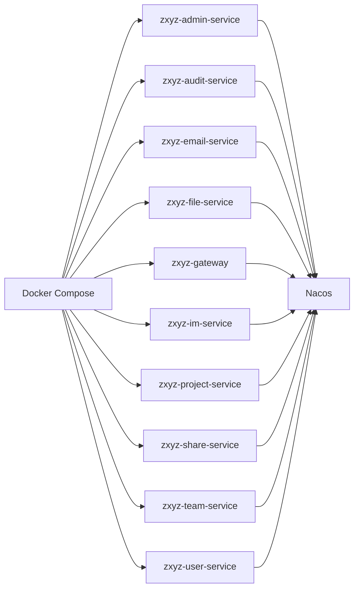

# JVM性能监控

<cite>
**本文引用的文件**   
- [zxyz-admin-service/application.yml](file://ZXYZdatabaseBack/zxyz-admin-service/src/main/resources/application.yml)
- [zxyz-audit-service/application.yml](file://ZXYZdatabaseBack/zxyz-audit-service/src/main/resources/application.yml)
- [zxyz-email-service/application.yml](file://ZXYZdatabaseBack/zxyz-email-service/src/main/resources/application.yml)
- [zxyz-file-service/application.yml](file://ZXYZdatabaseBack/zxyz-file-service/src/main/resources/application.yml)
- [zxyz-gateway/application.yml](file://ZXYZdatabaseBack/zxyz-gateway/src/main/resources/application.yml)
- [zxyz-im-service/application.yml](file://ZXYZdatabaseBack/zxyz-im-service/src/main/resources/application.yml)
- [zxyz-project-service/application.yml](file://ZXYZdatabaseBack/zxyz-project-service/src/main/resources/application.yml)
- [zxyz-share-service/application.yml](file://ZXYZdatabaseBack/zxyz-share-service/src/main/resources/application.yml)
- [zxyz-team-service/application.yml](file://ZXYZdatabaseBack/zxyz-team-service/src/main/resources/application.yml)
- [zxyz-user-service/application.yml](file://ZXYZdatabaseBack/zxyz-user-service/src/main/resources/application.yml)
- [docker-compose.yml](file://docker-compose.yml)
- [Dockerfile.base](file://Dockerfile.base)
- [nacos-config/zxyz-static.yml](file://nacos-config/zxyz-static.yml)
- [nacos-config/zxyz-dynamic.yml](file://nacos-config/zxyz-dynamic.yml)
- [nacos-config/zxyz-admin-service.yml](file://nacos-config/zxyz-admin-service.yml)
- [nacos-config/zxyz-audit-service.yml](file://nacos-config/zxyz-audit-service.yml)
- [nacos-config/zxyz-email-service.yml](file://nacos-config/zxyz-email-service.yml)
- [nacos-config/zxyz-file-service.yml](file://nacos-config/zxyz-file-service.yml)
- [nacos-config/zxyz-gateway.yml](file://nacos-config/zxyz-gateway.yml)
- [nacos-config/zxyz-im-service.yml](file://nacos-config/zxyz-im-service.yml)
- [nacos-config/zxyz-project-service.yml](file://nacos-config/zxyz-project-service.yml)
- [nacos-config/zxyz-share-service.yml](file://nacos-config/zxyz-share-service.yml)
- [nacos-config/zxyz-team-service.yml](file://nacos-config/zxyz-team-service.yml)
- [nacos-config/zxyz-user-service.yml](file://nacos-config/zxyz-user-service.yml)
- [scripts/health-check.sh](file://scripts/health-check.sh)
- [deploy/nginx/default.conf](file://deploy/nginx/default.conf)
</cite>

## 目录
1. [简介](#简介)
2. [项目结构](#项目结构)
3. [核心组件](#核心组件)
4. [架构总览](#架构总览)
5. [详细组件分析](#详细组件分析)
6. [依赖关系分析](#依赖关系分析)
7. [性能考量](#性能考量)
8. [故障排查指南](#故障排查指南)
9. [结论](#结论)
10. [附录](#附录)

## 简介
本文件面向ZXYZ项目的JVM性能监控与调优，覆盖以下主题：
- JVM内存使用监控：堆内存、非堆内存、元空间使用情况
- GC频率统计与垃圾回收器选择策略
- 线程池状态监控：核心线程数、活跃线程数、队列长度、任务执行时间
- JVM参数调优：启动参数配置、内存分配策略、GC优化参数
- JVM监控工具：JConsole、VisualVM、Arthas的使用方法以及关键指标分析
- 常见问题定位与OOM解决方案

本项目为微服务架构（多个Spring Boot服务），通过Nacos进行配置管理，部署于Docker Compose环境。各服务默认未内嵌JVM监控端点，建议结合容器运行时与外部监控体系进行观测。

## 项目结构
- 后端由多个独立Spring Boot服务组成，每个服务包含application.yml及对应Nacos配置
- 统一通过Nacos集中管理配置，支持动态刷新
- 容器编排使用docker-compose，基础镜像在Dockerfile.base中定义
- 健康检查脚本位于scripts/health-check.sh，用于进程存活探测

```mermaid
graph TB
subgraph "容器编排"
DC["docker-compose.yml"]
DBF["Dockerfile.base"]
end
subgraph "配置中心(Nacos)"
NStatic["zxyz-static.yml"]
NDynamic["zxyz-dynamic.yml"]
NSvc["各服务yml"]
end
subgraph "服务实例"
S1["zxyz-admin-service"]
S2["zxyz-audit-service"]
S3["zxyz-email-service"]
S4["zxyz-file-service"]
S5["zxyz-gateway"]
S6["zxyz-im-service"]
S7["zxyz-project-service"]
S8["zxyz-share-service"]
S9["zxyz-team-service"]
S10["zxyz-user-service"]
end
DC --> DBF
DC --> S1
DC --> S2
DC --> S3
DC --> S4
DC --> S5
DC --> S6
DC --> S7
DC --> S8
DC --> S9
DC --> S10
NStatic --> S1
NStatic --> S2
NStatic --> S3
NStatic --> S4
NStatic --> S5
NStatic --> S6
NStatic --> S7
NStatic --> S8
NStatic --> S9
NStatic --> S10
NDynamic --> S1
NDynamic --> S2
NDynamic --> S3
NDynamic --> S4
NDynamic --> S5
NDynamic --> S6
NDynamic --> S7
NDynamic --> S8
NDynamic --> S9
NDynamic --> S10
NSvc --> S1
NSvc --> S2
NSvc --> S3
NSvc --> S4
NSvc --> S5
NSvc --> S6
NSvc --> S7
NSvc --> S8
NSvc --> S9
NSvc --> S10
```

**图表来源** 
- [docker-compose.yml](file://docker-compose.yml)
- [Dockerfile.base](file://Dockerfile.base)
- [nacos-config/zxyz-static.yml](file://nacos-config/zxyz-static.yml)
- [nacos-config/zxyz-dynamic.yml](file://nacos-config/zxyz-dynamic.yml)
- [nacos-config/zxyz-admin-service.yml](file://nacos-config/zxyz-admin-service.yml)
- [nacos-config/zxyz-audit-service.yml](file://nacos-config/zxyz-audit-service.yml)
- [nacos-config/zxyz-email-service.yml](file://nacos-config/zxyz-email-service.yml)
- [nacos-config/zxyz-file-service.yml](file://nacos-config/zxyz-file-service.yml)
- [nacos-config/zxyz-gateway.yml](file://nacos-config/zxyz-gateway.yml)
- [nacos-config/zxyz-im-service.yml](file://nacos-config/zxyz-im-service.yml)
- [nacos-config/zxyz-project-service.yml](file://nacos-config/zxyz-project-service.yml)
- [nacos-config/zxyz-share-service.yml](file://nacos-config/zxyz-share-service.yml)
- [nacos-config/zxyz-team-service.yml](file://nacos-config/zxyz-team-service.yml)
- [nacos-config/zxyz-user-service.yml](file://nacos-config/zxyz-user-service.yml)

**章节来源**
- [docker-compose.yml](file://docker-compose.yml)
- [Dockerfile.base](file://Dockerfile.base)
- [nacos-config/zxyz-static.yml](file://nacos-config/zxyz-static.yml)
- [nacos-config/zxyz-dynamic.yml](file://nacos-config/zxyz-dynamic.yml)

## 核心组件
- 应用配置文件：每个服务的application.yml用于本地或开发环境的基础配置
- Nacos配置：静态与动态配置分离，按服务维度拆分，便于热更新
- 健康检查：通过脚本对容器进程进行存活探测，保障服务可用性

**章节来源**
- [zxyz-admin-service/application.yml](file://ZXYZdatabaseBack/zxyz-admin-service/src/main/resources/application.yml)
- [zxyz-audit-service/application.yml](file://ZXYZdatabaseBack/zxyz-audit-service/src/main/resources/application.yml)
- [zxyz-email-service/application.yml](file://ZXYZdatabaseBack/zxyz-email-service/src/main/resources/application.yml)
- [zxyz-file-service/application.yml](file://ZXYZdatabaseBack/zxyz-file-service/src/main/resources/application.yml)
- [zxyz-gateway/application.yml](file://ZXYZdatabaseBack/zxyz-gateway/src/main/resources/application.yml)
- [zxyz-im-service/application.yml](file://ZXYZdatabaseBack/zxyz-im-service/src/main/resources/application.yml)
- [zxyz-project-service/application.yml](file://ZXYZdatabaseBack/zxyz-project-service/src/main/resources/application.yml)
- [zxyz-share-service/application.yml](file://ZXYZdatabaseBack/zxyz-share-service/src/main/resources/application.yml)
- [zxyz-team-service/application.yml](file://ZXYZdatabaseBack/zxyz-team-service/src/main/resources/application.yml)
- [zxyz-user-service/application.yml](file://ZXYZdatabaseBack/zxyz-user-service/src/main/resources/application.yml)
- [scripts/health-check.sh](file://scripts/health-check.sh)

## 架构总览
下图展示ZXYZ的JVM监控相关组件与数据流：应用进程暴露JVM指标，外部监控工具采集并可视化；Nacos提供配置中心能力；容器编排负责运行环境与资源限制。

[本图为概念性架构图，不直接映射具体源码文件]

## 详细组件分析

### JVM内存使用监控
- 堆内存监控
  - 关注新生代、老年代的使用率与增长趋势
  - 观察Full GC触发频率与耗时
- 非堆内存监控
  - 方法区、代码缓存等区域的使用情况
- 元空间监控
  - 类加载导致的元空间增长需重点关注
- 监控手段
  - 使用JConsole/VisualVM连接JMX端口查看实时内存曲线
  - 使用Arthas的memory命令快速诊断内存占用热点
  - 结合容器资源限制（CPU/Memory）评估实际可用内存

**章节来源**
- [zxyz-admin-service/application.yml](file://ZXYZdatabaseBack/zxyz-admin-service/src/main/resources/application.yml)
- [zxyz-audit-service/application.yml](file://ZXYZdatabaseBack/zxyz-audit-service/src/main/resources/application.yml)
- [zxyz-email-service/application.yml](file://ZXYZdatabaseBack/zxyz-email-service/src/main/resources/application.yml)
- [zxyz-file-service/application.yml](file://ZXYZdatabaseBack/zxyz-file-service/src/main/resources/application.yml)
- [zxyz-gateway/application.yml](file://ZXYZdatabaseBack/zxyz-gateway/src/main/resources/application.yml)
- [zxyz-im-service/application.yml](file://ZXYZdatabaseBack/zxyz-im-service/src/main/resources/application.yml)
- [zxyz-project-service/application.yml](file://ZXYZdatabaseBack/zxyz-project-service/src/main/resources/application.yml)
- [zxyz-share-service/application.yml](file://ZXYZdatabaseBack/zxyz-share-service/src/main/resources/application.yml)
- [zxyz-team-service/application.yml](file://ZXYZdatabaseBack/zxyz-team-service/src/main/resources/application.yml)
- [zxyz-user-service/application.yml](file://ZXYZdatabaseBack/zxyz-user-service/src/main/resources/application.yml)

### GC频率统计与垃圾回收器选择策略
- 常用垃圾回收器
  - G1：适合大堆、低延迟场景，推荐作为默认选择
  - ZGC：超低停顿，适用于超大堆与高吞吐
  - Parallel GC：批处理场景，追求吞吐优先
- 关键指标
  - GC次数、GC耗时、暂停时间分布
  - 对象晋升率、Survivor区命中率
- 调优要点
  - 合理设置堆大小与比例（新生代/老年代）
  - 调整G1的Region大小与目标停顿时间
  - 避免频繁Full GC，关注对象生命周期与引用泄漏

**章节来源**
- [zxyz-admin-service/application.yml](file://ZXYZdatabaseBack/zxyz-admin-service/src/main/resources/application.yml)
- [zxyz-audit-service/application.yml](file://ZXYZdatabaseBack/zxyz-audit-service/src/main/resources/application.yml)
- [zxyz-email-service/application.yml](file://ZXYZdatabaseBack/zxyz-email-service/src/main/resources/application.yml)
- [zxyz-file-service/application.yml](file://ZXYZdatabaseBack/zxyz-file-service/src/main/resources/application.yml)
- [zxyz-gateway/application.yml](file://ZXYZdatabaseBack/zxyz-gateway/src/main/resources/application.yml)
- [zxyz-im-service/application.yml](file://ZXYZdatabaseBack/zxyz-im-service/src/main/resources/application.yml)
- [zxyz-project-service/application.yml](file://ZXYZdatabaseBack/zxyz-project-service/src/main/resources/application.yml)
- [zxyz-share-service/application.yml](file://ZXYZdatabaseBack/zxyz-share-service/src/main/resources/application.yml)
- [zxyz-team-service/application.yml](file://ZXYZdatabaseBack/zxyz-team-service/src/main/resources/application.yml)
- [zxyz-user-service/application.yml](file://ZXYZdatabaseBack/zxyz-user-service/src/main/resources/application.yml)

### 线程池状态监控
- 核心线程数与最大线程数
  - 根据业务并发特征设定，避免过大导致上下文切换开销
- 活跃线程数与队列长度
  - 队列积压表明处理能力不足或下游阻塞
- 任务执行时间
  - 关注P95/P99延迟，识别慢调用
- 监控手段
  - 使用Arthas的thread命令查看线程状态与堆栈
  - 结合日志与链路追踪定位阻塞点
  - 对异步任务（如MQ消费者）单独设置线程池并监控

**章节来源**
- [zxyz-admin-service/application.yml](file://ZXYZdatabaseBack/zxyz-admin-service/src/main/resources/application.yml)
- [zxyz-audit-service/application.yml](file://ZXYZdatabaseBack/zxyz-audit-service/src/main/resources/application.yml)
- [zxyz-email-service/application.yml](file://ZXYZdatabaseBack/zxyz-email-service/src/main/resources/application.yml)
- [zxyz-file-service/application.yml](file://ZXYZdatabaseBack/zxyz-file-service/src/main/resources/application.yml)
- [zxyz-gateway/application.yml](file://ZXYZdatabaseBack/zxyz-gateway/src/main/resources/application.yml)
- [zxyz-im-service/application.yml](file://ZXYZdatabaseBack/zxyz-im-service/src/main/resources/application.yml)
- [zxyz-project-service/application.yml](file://ZXYZdatabaseBack/zxyz-project-service/src/main/resources/application.yml)
- [zxyz-share-service/application.yml](file://ZXYZdatabaseBack/zxyz-share-service/src/main/resources/application.yml)
- [zxyz-team-service/application.yml](file://ZXYZdatabaseBack/zxyz-team-service/src/main/resources/application.yml)
- [zxyz-user-service/application.yml](file://ZXYZdatabaseBack/zxyz-user-service/src/main/resources/application.yml)

### JVM参数调优
- 启动参数配置
  - 堆大小（-Xms/-Xmx）、元空间（-XX:MetaspaceSize/-XX:MaxMetaspaceSize）
  - GC选择与调优参数（如G1/ZGC相关）
  - 日志输出（GC日志、错误日志路径）
- 内存分配策略
  - 新生代与老年代比例、Survivor区大小
  - 对象晋升阈值与TLAB设置
- GC优化参数
  - 目标停顿时间、并行度、分代阈值
  - 避免过早Full GC的参数组合

**章节来源**
- [zxyz-admin-service/application.yml](file://ZXYZdatabaseBack/zxyz-admin-service/src/main/resources/application.yml)
- [zxyz-audit-service/application.yml](file://ZXYZdatabaseBack/zxyz-audit-service/src/main/resources/application.yml)
- [zxyz-email-service/application.yml](file://ZXYZdatabaseBack/zxyz-email-service/src/main/resources/application.yml)
- [zxyz-file-service/application.yml](file://ZXYZdatabaseBack/zxyz-file-service/src/main/resources/application.yml)
- [zxyz-gateway/application.yml](file://ZXYZdatabaseBack/zxyz-gateway/src/main/resources/application.yml)
- [zxyz-im-service/application.yml](file://ZXYZdatabaseBack/zxyz-im-service/src/main/resources/application.yml)
- [zxyz-project-service/application.yml](file://ZXYZdatabaseBack/zxyz-project-service/src/main/resources/application.yml)
- [zxyz-share-service/application.yml](file://ZXYZdatabaseBack/zxyz-share-service/src/main/resources/application.yml)
- [zxyz-team-service/application.yml](file://ZXYZdatabaseBack/zxyz-team-service/src/main/resources/application.yml)
- [zxyz-user-service/application.yml](file://ZXYZdatabaseBack/zxyz-user-service/src/main/resources/application.yml)

### JVM监控工具使用方法
- JConsole
  - 连接JMX端口，查看内存、线程、类加载、GC等面板
  - 适合快速定位内存泄漏与线程死锁
- VisualVM
  - 图形化界面，支持CPU采样、堆转储、线程快照
  - 适合深入分析热点方法与GC行为
- Arthas
  - 在线诊断工具，支持thread、memory、vmtool等命令
  - 适合生产环境快速定位问题，无需重启

**章节来源**
- [zxyz-admin-service/application.yml](file://ZXYZdatabaseBack/zxyz-admin-service/src/main/resources/application.yml)
- [zxyz-audit-service/application.yml](file://ZXYZdatabaseBack/zxyz-audit-service/src/main/resources/application.yml)
- [zxyz-email-service/application.yml](file://ZXYZdatabaseBack/zxyz-email-service/src/main/resources/application.yml)
- [zxyz-file-service/application.yml](file://ZXYZdatabaseBack/zxyz-file-service/src/main/resources/application.yml)
- [zxyz-gateway/application.yml](file://ZXYZdatabaseBack/zxyz-gateway/src/main/resources/application.yml)
- [zxyz-im-service/application.yml](file://ZXYZdatabaseBack/zxyz-im-service/src/main/resources/application.yml)
- [zxyz-project-service/application.yml](file://ZXYZdatabaseBack/zxyz-project-service/src/main/resources/application.yml)
- [zxyz-share-service/application.yml](file://ZXYZdatabaseBack/zxyz-share-service/src/main/resources/application.yml)
- [zxyz-team-service/application.yml](file://ZXYZdatabaseBack/zxyz-team-service/src/main/resources/application.yml)
- [zxyz-user-service/application.yml](file://ZXYZdatabaseBack/zxyz-user-service/src/main/resources/application.yml)

## 依赖关系分析
- 配置依赖
  - 各服务通过Nacos获取运行时配置，支持动态刷新
- 运行时依赖
  - 容器编排提供网络、存储、环境变量等基础设施
- 监控依赖
  - JMX接口供外部工具采集指标，无侵入式监控

**图表来源** 
- [docker-compose.yml](file://docker-compose.yml)
- [nacos-config/zxyz-static.yml](file://nacos-config/zxyz-static.yml)
- [nacos-config/zxyz-dynamic.yml](file://nacos-config/zxyz-dynamic.yml)
- [nacos-config/zxyz-admin-service.yml](file://nacos-config/zxyz-admin-service.yml)
- [nacos-config/zxyz-audit-service.yml](file://nacos-config/zxyz-audit-service.yml)
- [nacos-config/zxyz-email-service.yml](file://nacos-config/zxyz-email-service.yml)
- [nacos-config/zxyz-file-service.yml](file://nacos-config/zxyz-file-service.yml)
- [nacos-config/zxyz-gateway.yml](file://nacos-config/zxyz-gateway.yml)
- [nacos-config/zxyz-im-service.yml](file://nacos-config/zxyz-im-service.yml)
- [nacos-config/zxyz-project-service.yml](file://nacos-config/zxyz-project-service.yml)
- [nacos-config/zxyz-share-service.yml](file://nacos-config/zxyz-share-service.yml)
- [nacos-config/zxyz-team-service.yml](file://nacos-config/zxyz-team-service.yml)
- [nacos-config/zxyz-user-service.yml](file://nacos-config/zxyz-user-service.yml)

**章节来源**
- [docker-compose.yml](file://docker-compose.yml)
- [nacos-config/zxyz-static.yml](file://nacos-config/zxyz-static.yml)
- [nacos-config/zxyz-dynamic.yml](file://nacos-config/zxyz-dynamic.yml)

## 性能考量
- 容器资源限制
  - 合理设置CPU与Memory上限，避免过度竞争
- 堆内存与元空间平衡
  - 根据类加载量与对象生命周期调整元空间大小
- GC选择与调优
  - 根据延迟与吞吐需求选择合适的GC，并进行参数微调
- 线程池容量与队列策略
  - 避免队列无限增长导致内存溢出
- 监控与告警
  - 建立关键指标阈值告警，及时发现异常

[本节为通用指导，不直接分析具体文件]

## 故障排查指南
- 常见OOM问题
  - Java heap space：堆内存不足，检查对象创建与释放
  - Metaspace：元空间不足，检查类加载与动态代理
  - Direct buffer memory：直接内存不足，检查NIO缓冲使用
  - GC overhead limit exceeded：GC过于频繁，检查内存泄漏与堆大小
- 排查步骤
  - 使用Arthas的memory与thread命令快速定位
  - 导出堆转储文件，使用VisualVM分析对象引用链
  - 检查GC日志，确认是否频繁Full GC
- 解决建议
  - 调整堆大小与GC参数
  - 修复内存泄漏与不当的对象生命周期
  - 优化线程池配置与任务处理逻辑

**章节来源**
- [zxyz-admin-service/application.yml](file://ZXYZdatabaseBack/zxyz-admin-service/src/main/resources/application.yml)
- [zxyz-audit-service/application.yml](file://ZXYZdatabaseBack/zxyz-audit-service/src/main/resources/application.yml)
- [zxyz-email-service/application.yml](file://ZXYZdatabaseBack/zxyz-email-service/src/main/resources/application.yml)
- [zxyz-file-service/application.yml](file://ZXYZdatabaseBack/zxyz-file-service/src/main/resources/application.yml)
- [zxyz-gateway/application.yml](file://ZXYZdatabaseBack/zxyz-gateway/src/main/resources/application.yml)
- [zxyz-im-service/application.yml](file://ZXYZdatabaseBack/zxyz-im-service/src/main/resources/application.yml)
- [zxyz-project-service/application.yml](file://ZXYZdatabaseBack/zxyz-project-service/src/main/resources/application.yml)
- [zxyz-share-service/application.yml](file://ZXYZdatabaseBack/zxyz-share-service/src/main/resources/application.yml)
- [zxyz-team-service/application.yml](file://ZXYZdatabaseBack/zxyz-team-service/src/main/resources/application.yml)
- [zxyz-user-service/application.yml](file://ZXYZdatabaseBack/zxyz-user-service/src/main/resources/application.yml)

## 结论
ZXYZ项目采用微服务架构与Nacos配置中心，JVM监控应结合容器运行时与外部工具进行。通过合理的JVM参数调优、GC策略选择与线程池配置，可有效提升系统稳定性与性能。建议在生产环境引入统一的监控与告警体系，持续优化关键指标。

[本节为总结性内容，不直接分析具体文件]

## 附录
- 健康检查脚本位置：scripts/health-check.sh
- Nginx配置位置：deploy/nginx/default.conf
- 容器编排文件：docker-compose.yml
- 基础镜像定义：Dockerfile.base

**章节来源**
- [scripts/health-check.sh](file://scripts/health-check.sh)
- [deploy/nginx/default.conf](file://deploy/nginx/default.conf)
- [docker-compose.yml](file://docker-compose.yml)
- [Dockerfile.base](file://Dockerfile.base)