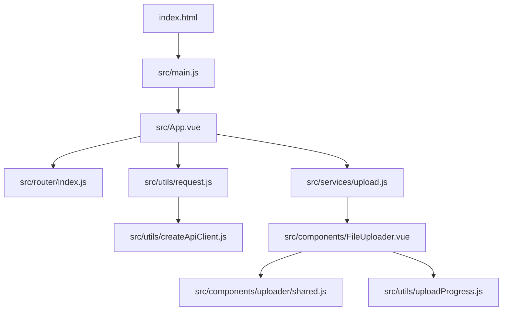
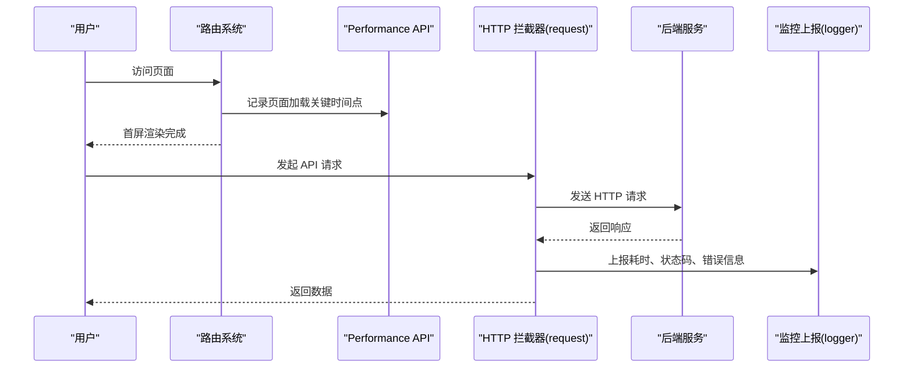
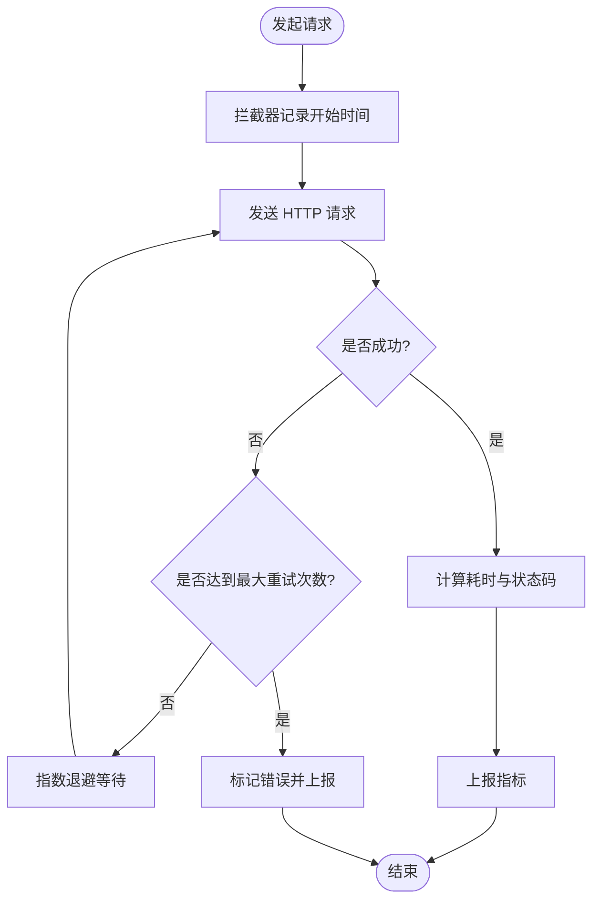
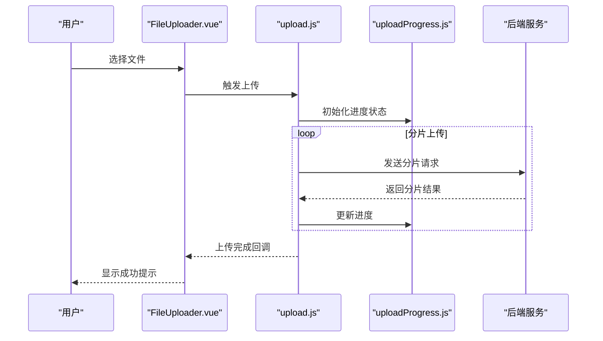
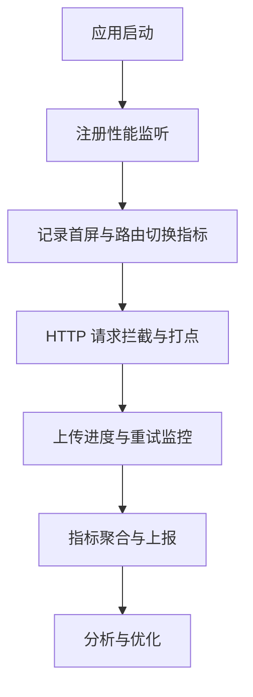
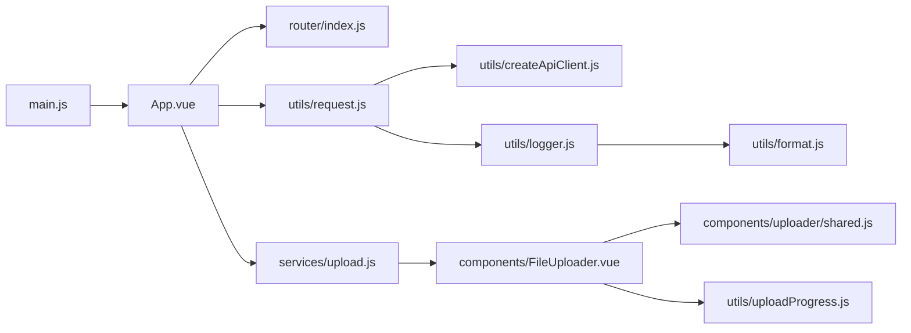

# 前端性能监控

<cite>
**本文引用的文件**   
- [vite.config.js](file://ZXYZdatabaseFront/vite.config.js)
- [package.json](file://ZXYZdatabaseFront/package.json)
- [index.html](file://ZXYZdatabaseFront/index.html)
- [main.js](file://ZXYZdatabaseFront/src/main.js)
- [App.vue](file://ZXYZdatabaseFront/src/App.vue)
- [router/index.js](file://ZXYZdatabaseFront/src/router/index.js)
- [utils/request.js](file://ZXYZdatabaseFront/src/utils/request.js)
- [utils/createApiClient.js](file://ZXYZdatabaseFront/src/utils/createApiClient.js)
- [utils/logger.js](file://ZXYZdatabaseFront/src/utils/logger.js)
- [api/README.md](file://ZXYZdatabaseFront/src/api/README.md)
- [services/upload.js](file://ZXYZdatabaseFront/src/services/upload.js)
- [components/FileUploader.vue](file://ZXYZdatabaseFront/src/components/FileUploader.vue)
- [components/uploader/shared.js](file://ZXYZdatabaseFront/src/components/uploader/shared.js)
- [utils/uploadProgress.js](file://ZXYZdatabaseFront/src/utils/uploadProgress.js)
- [utils/format.js](file://ZXYZdatabaseFront/src/utils/format.js)
- [utils/env.js](file://ZXYZdatabaseFront/src/utils/env.js)
</cite>

## 目录
1. [简介](#简介)
2. [项目结构](#项目结构)
3. [核心组件](#核心组件)
4. [架构总览](#架构总览)
5. [详细组件分析](#详细组件分析)
6. [依赖分析](#依赖分析)
7. [性能考虑](#性能考虑)
8. [故障排查指南](#故障排查指南)
9. [结论](#结论)
10. [附录](#附录)

## 简介
本文件为 ZXYZ 前端（Vue 3 + Vite）的性能监控与优化文档，覆盖页面加载时间、路由切换耗时、组件加载性能、API 调用耗时、资源文件大小与优化策略、浏览器性能指标采集，以及常用监控工具（Performance API、Lighthouse、Webpack Bundle Analyzer）的使用建议。同时给出面向该项目的最佳实践与用户体验提升方案。

## 项目结构
前端位于 ZXYZdatabaseFront，采用 Vite 构建，Vue 3 Composition API + <script setup>，Element Plus auto-import，Pinia 状态管理，composables 封装业务逻辑。关键入口与配置：
- 应用入口：src/main.js、src/App.vue
- 路由：src/router/index.js
- HTTP 请求封装：src/utils/request.js、src/utils/createApiClient.js
- 上传与进度：src/services/upload.js、src/components/FileUploader.vue、src/components/uploader/shared.js、src/utils/uploadProgress.js
- 构建与打包：vite.config.js、package.json
- 全局脚本注入点：index.html

图表来源
- [index.html:1-50](file://ZXYZdatabaseFront/index.html#L1-L50)
- [main.js:1-80](file://ZXYZdatabaseFront/src/main.js#L1-L80)
- [App.vue:1-120](file://ZXYZdatabaseFront/src/App.vue#L1-L120)
- [router/index.js:1-120](file://ZXYZdatabaseFront/src/router/index.js#L1-L120)
- [request.js:1-200](file://ZXYZdatabaseFront/src/utils/request.js#L1-L200)
- [createApiClient.js:1-120](file://ZXYZdatabaseFront/src/utils/createApiClient.js#L1-L120)
- [upload.js:1-120](file://ZXYZdatabaseFront/src/services/upload.js#L1-L120)
- [FileUploader.vue:1-200](file://ZXYZdatabaseFront/src/components/FileUploader.vue#L1-L200)
- [shared.js:1-120](file://ZXYZdatabaseFront/src/components/uploader/shared.js#L1-L120)
- [uploadProgress.js:1-120](file://ZXYZdatabaseFront/src/utils/uploadProgress.js#L1-L120)

章节来源
- [vite.config.js:1-200](file://ZXYZdatabaseFront/vite.config.js#L1-L200)
- [package.json:1-120](file://ZXYZdatabaseFront/package.json#L1-L120)
- [index.html:1-50](file://ZXYZdatabaseFront/index.html#L1-L50)
- [main.js:1-80](file://ZXYZdatabaseFront/src/main.js#L1-L80)
- [App.vue:1-120](file://ZXYZdatabaseFront/src/App.vue#L1-L120)
- [router/index.js:1-120](file://ZXYZdatabaseFront/src/router/index.js#L1-L120)

## 核心组件
- 页面加载与首屏渲染
  - 通过 Performance API 在应用初始化阶段记录关键时间点，如 DOMContentLoaded、首次绘制等，结合路由守卫统计首屏渲染时间。
  - 使用路由导航守卫统计路由切换耗时，区分首次进入与二次进入场景。
- API 调用耗时
  - 基于 request 拦截器统一记录请求开始/结束时间，计算延迟与响应时间，并上报错误与重试次数。
  - createApiClient 提供可插拔的拦截链，便于扩展重试、缓存、埋点等能力。
- 资源大小与代码分割
  - 通过 Vite 构建配置启用压缩、按需引入与动态导入，减少首包体积。
  - 图片与静态资源采用懒加载与 CDN 缓存策略。
- 浏览器性能指标
  - 采集 CPU 使用率、内存占用、渲染帧率、网络请求统计，聚合后上报至监控平台或本地日志。

章节来源
- [request.js:1-200](file://ZXYZdatabaseFront/src/utils/request.js#L1-L200)
- [createApiClient.js:1-120](file://ZXYZdatabaseFront/src/utils/createApiClient.js#L1-L120)
- [logger.js:1-120](file://ZXYZdatabaseFront/src/utils/logger.js#L1-L120)
- [format.js:1-120](file://ZXYZdatabaseFront/src/utils/format.js#L1-L120)
- [env.js:1-80](file://ZXYZdatabaseFront/src/utils/env.js#L1-L80)

## 架构总览
前端性能监控整体流程如下：
- 应用启动时注册 Performance 监听与路由守卫，收集首屏与路由切换指标。
- HTTP 请求经 request 拦截器统一打点，记录延迟、状态码、错误类型与重试次数。
- 上传模块记录分片进度与失败重试，避免阻塞主线程。
- 构建产物通过 Vite 优化（压缩、分包、Tree-shaking），配合 Lighthouse 审计持续改进。

图表来源
- [router/index.js:1-120](file://ZXYZdatabaseFront/src/router/index.js#L1-L120)
- [request.js:1-200](file://ZXYZdatabaseFront/src/utils/request.js#L1-L200)
- [logger.js:1-120](file://ZXYZdatabaseFront/src/utils/logger.js#L1-L120)

## 详细组件分析

### 页面加载与首屏渲染监控
- 目标指标
  - 首屏渲染时间：从页面开始到首屏内容可交互的时间
  - 路由切换耗时：进入新路由到视图稳定渲染的时间
- 实现要点
  - 在 main.js 中初始化性能监听，记录关键时间点
  - 在 router/index.js 中使用 beforeEach/afterEach 统计切换耗时
  - 将指标聚合并通过 logger 上报
- 复杂度与影响
  - 监听开销极低，主要成本在上报频率与数据量控制
  - 建议在开发环境高频上报，生产环境采样上报

章节来源
- [main.js:1-80](file://ZXYZdatabaseFront/src/main.js#L1-L80)
- [router/index.js:1-120](file://ZXYZdatabaseFront/src/router/index.js#L1-L120)
- [logger.js:1-120](file://ZXYZdatabaseFront/src/utils/logger.js#L1-L120)

### API 调用耗时与错误重试机制
- 目标指标
  - HTTP 请求延迟：从发起请求到收到响应的时长
  - 响应时间统计：按接口维度统计平均/分位耗时
  - 错误重试机制：对瞬时错误进行指数退避重试
- 实现要点
  - 在 utils/request.js 中统一拦截请求与响应，记录耗时与错误
  - 在 utils/createApiClient.js 中扩展重试策略与缓存策略
  - 使用 format.js 格式化上报字段，确保一致性
- 流程图

图表来源
- [request.js:1-200](file://ZXYZdatabaseFront/src/utils/request.js#L1-L200)
- [createApiClient.js:1-120](file://ZXYZdatabaseFront/src/utils/createApiClient.js#L1-L120)
- [format.js:1-120](file://ZXYZdatabaseFront/src/utils/format.js#L1-L120)

章节来源
- [request.js:1-200](file://ZXYZdatabaseFront/src/utils/request.js#L1-L200)
- [createApiClient.js:1-120](file://ZXYZdatabaseFront/src/utils/createApiClient.js#L1-L120)
- [format.js:1-120](file://ZXYZdatabaseFront/src/utils/format.js#L1-L120)

### 资源文件大小与代码分割策略
- 目标
  - 降低首包体积，缩短加载时间
  - 提高缓存命中率，减少重复下载
- 策略
  - 启用 Vite 压缩与 Tree-shaking，按需引入 UI 库
  - 大组件与第三方库使用动态导入进行代码分割
  - 图片与静态资源使用懒加载与 CDN 缓存
- 构建配置参考
  - vite.config.js 中设置构建优化选项
  - package.json 中维护依赖版本与脚本命令

章节来源
- [vite.config.js:1-200](file://ZXYZdatabaseFront/vite.config.js#L1-L200)
- [package.json:1-120](file://ZXYZdatabaseFront/package.json#L1-L120)

### 浏览器性能指标采集
- 指标范围
  - CPU 使用率：通过 Performance API 估算任务耗时与主线程占用
  - 内存占用：监控堆内存与节点数量变化
  - 渲染帧率：统计 FPS 与掉帧情况
  - 网络请求统计：按域名与接口维度统计请求数与耗时
- 采集方式
  - 使用 Performance Observer 监听长任务与布局抖动
  - 定期采样内存与帧率，避免频繁 IO
  - 聚合上报至 logger，支持采样与去重

章节来源
- [logger.js:1-120](file://ZXYZdatabaseFront/src/utils/logger.js#L1-L120)
- [format.js:1-120](file://ZXYZdatabaseFront/src/utils/format.js#L1-L120)

### 上传性能与进度监控
- 目标
  - 记录上传分片进度与失败重试，避免阻塞主线程
  - 提供可视化进度反馈，提升用户体验
- 实现要点
  - services/upload.js 负责上传逻辑与分片策略
  - components/FileUploader.vue 提供 UI 与事件绑定
  - components/uploader/shared.js 共享上传工具函数
  - utils/uploadProgress.js 管理进度状态与回调
- 序列图

图表来源
- [FileUploader.vue:1-200](file://ZXYZdatabaseFront/src/components/FileUploader.vue#L1-L200)
- [upload.js:1-120](file://ZXYZdatabaseFront/src/services/upload.js#L1-L120)
- [shared.js:1-120](file://ZXYZdatabaseFront/src/components/uploader/shared.js#L1-L120)
- [uploadProgress.js:1-120](file://ZXYZdatabaseFront/src/utils/uploadProgress.js#L1-L120)

章节来源
- [FileUploader.vue:1-200](file://ZXYZdatabaseFront/src/components/FileUploader.vue#L1-L200)
- [upload.js:1-120](file://ZXYZdatabaseFront/src/services/upload.js#L1-L120)
- [shared.js:1-120](file://ZXYZdatabaseFront/src/components/uploader/shared.js#L1-L120)
- [uploadProgress.js:1-120](file://ZXYZdatabaseFront/src/utils/uploadProgress.js#L1-L120)

### 概念性概览
以下流程图展示前端性能监控的整体思路，不直接映射具体代码文件：

[本图为概念性流程图，无需图表来源]

## 依赖分析
前端性能监控相关依赖关系如下：
- main.js 初始化应用与性能监听
- App.vue 作为根组件挂载路由与全局状态
- router/index.js 管理路由与导航守卫
- utils/request.js 与 createApiClient.js 处理 HTTP 拦截与重试
- services/upload.js 与 components/FileUploader.vue 处理上传逻辑
- utils/logger.js 与 format.js 负责日志与格式化

图表来源
- [main.js:1-80](file://ZXYZdatabaseFront/src/main.js#L1-L80)
- [App.vue:1-120](file://ZXYZdatabaseFront/src/App.vue#L1-L120)
- [router/index.js:1-120](file://ZXYZdatabaseFront/src/router/index.js#L1-L120)
- [request.js:1-200](file://ZXYZdatabaseFront/src/utils/request.js#L1-L200)
- [createApiClient.js:1-120](file://ZXYZdatabaseFront/src/utils/createApiClient.js#L1-L120)
- [upload.js:1-120](file://ZXYZdatabaseFront/src/services/upload.js#L1-L120)
- [FileUploader.vue:1-200](file://ZXYZdatabaseFront/src/components/FileUploader.vue#L1-L200)
- [shared.js:1-120](file://ZXYZdatabaseFront/src/components/uploader/shared.js#L1-L120)
- [uploadProgress.js:1-120](file://ZXYZdatabaseFront/src/utils/uploadProgress.js#L1-L120)
- [logger.js:1-120](file://ZXYZdatabaseFront/src/utils/logger.js#L1-L120)
- [format.js:1-120](file://ZXYZdatabaseFront/src/utils/format.js#L1-L120)

章节来源
- [api/README.md:1-120](file://ZXYZdatabaseFront/src/api/README.md#L1-L120)

## 性能考虑
- 首屏优化
  - 启用预加载与预解析关键资源
  - 使用骨架屏与渐进式渲染提升感知速度
- 路由优化
  - 路由级代码分割，按需加载页面组件
  - 避免在路由守卫中进行重型计算
- API 优化
  - 合理设置超时与重试策略，避免雪崩
  - 使用缓存与增量更新减少重复请求
- 资源优化
  - 图片懒加载与格式转换（WebP/AVIF）
  - 静态资源 CDN 加速与缓存策略
- 监控与度量
  - 使用 Performance API 与 Lighthouse 持续审计
  - 建立性能基线与告警阈值

[本节为通用指导，无需章节来源]

## 故障排查指南
- 常见问题
  - 首屏过慢：检查首包体积与关键资源加载顺序
  - 路由卡顿：排查路由守卫中的同步阻塞操作
  - API 超时：检查网络状况与后端响应时间
  - 上传失败：确认分片大小与重试策略
- 排查步骤
  - 打开浏览器开发者工具，查看 Network 与 Performance 面板
  - 检查控制台错误与警告信息
  - 使用 Lighthouse 生成性能报告
  - 查看监控上报日志，定位异常指标

章节来源
- [logger.js:1-120](file://ZXYZdatabaseFront/src/utils/logger.js#L1-L120)
- [format.js:1-120](file://ZXYZdatabaseFront/src/utils/format.js#L1-L120)

## 结论
通过系统化的性能监控与优化策略，ZXYZ 前端可实现稳定的首屏体验、高效的 API 交互与可控的资源体积。建议持续集成 Lighthouse 审计与性能回归测试，确保用户体验稳步提升。

[本节为总结性内容，无需章节来源]

## 附录
- 工具推荐
  - Performance API：用于采集关键时间点与资源加载详情
  - Lighthouse：自动化性能审计与优化建议
  - Webpack Bundle Analyzer：分析构建产物体积与依赖关系
- 最佳实践清单
  - 按需引入与代码分割
  - 图片懒加载与格式优化
  - API 重试与缓存策略
  - 性能指标采样与上报

[本节为补充信息，无需章节来源]