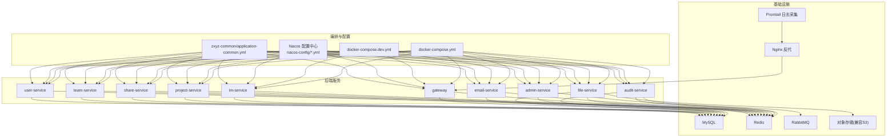
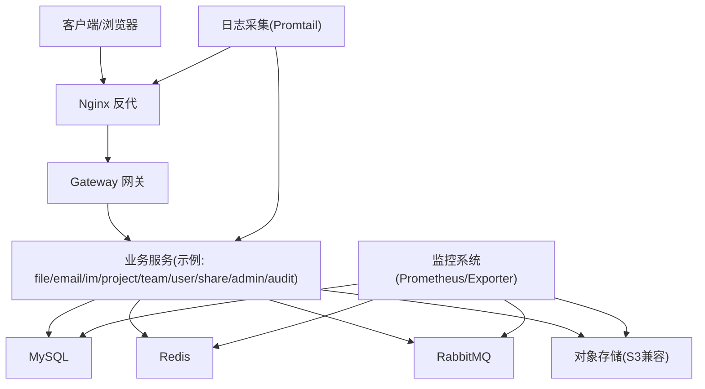
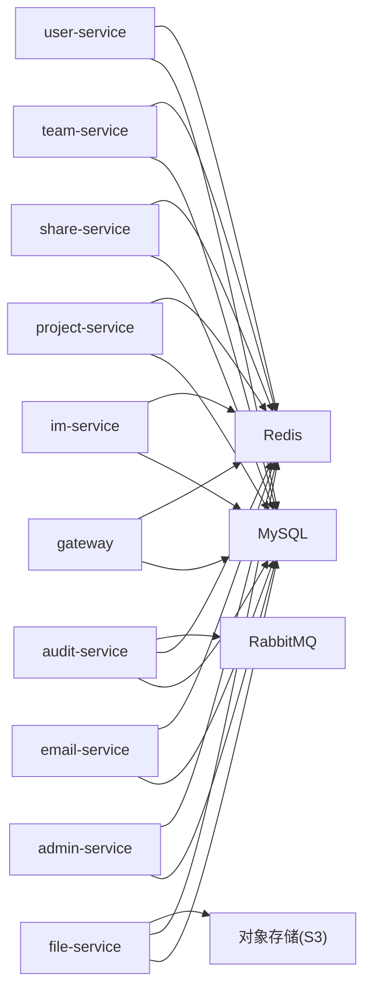

# 基础设施性能监控

<cite>
**本文引用的文件**   
- [docker-compose.yml](file://docker-compose.yml)
- [docker-compose.dev.yml](file://docker-compose.dev.yml)
- [nacos-config/zxyz-static.yml](file://nacos-config/zxyz-static.yml)
- [nacos-config/zxyz-dynamic.yml](file://nacos-config/zxyz-dynamic.yml)
- [nacos-config/zxyz-admin-service.yml](file://nacos-config/zxyz-admin-service.yml)
- [nacos-config/zxyz-audit-service.yml](file://nacos-config/zxyz-audit-service.yml)
- [nacos-config/zxyz-email-service.yml](file://nacos-config/zxyz-email-service.yml)
- [nacos-config/zxyz-file-service.yml](file://nacos-config/zxyz-file-service.yml)
- [nacos-config/zxyz-gateway.yml](file://nacos-config/zxyz-gateway.yml)
- [nacos-config/zxyz-im-service.yml](file://nacos-config/zxyz-im-service.yml)
- [nacos-config/zxyz-project-service.yml](file://nacos-config/zxyz-project-service.yml)
- [nacos-config/zxyz-share-service.yml](file://nacos-config/zxyz-share-service.yml)
- [nacos-config/zxyz-team-service.yml](file://nacos-config/zxyz-team-service.yml)
- [nacos-config/zxyz-user-service.yml](file://nacos-config/zxyz-user-service.yml)
- [ZXYZdatabaseBack/zxyz-common/src/main/resources/application-common.yml](file://ZXYZdatabaseBack/zxyz-common/src/main/resources/application-common.yml)
- [ZXYZdatabaseBack/zxyz-audit-service/src/main/java/uno/acloud/audit/config/RabbitMqConfig.java](file://ZXYZdatabaseBack/zxyz-audit-service/src/main/java/uno/acloud/audit/config/RabbitMqConfig.java)
- [ZXYZdatabaseBack/zxyz-audit-service/src/main/java/uno/acloud/audit/mq/AuditDlqConsumer.java](file://ZXYZdatabaseBack/zxyz-audit-service/src/main/java/uno/acloud/audit/mq/AuditDlqConsumer.java)
- [ZXYZdatabaseBack/zxyz-audit-service/src/main/java/uno/acloud/audit/service/AuditLogCleanupService.java](file://ZXYZdatabaseBack/zxyz-audit-service/src/main/java/uno/acloud/audit/service/AuditLogCleanupService.java)
- [ZXYZdatabaseBack/zxyz-file-service/src/main/java/uno/acloud/file/storage/StorageProviderClient.java](file://ZXYZdatabaseBack/zxyz-file-service/src/main/java/uno/acloud/file/storage/StorageProviderClient.java)
- [ZXYZdatabaseBack/zxyz-file-service/src/main/java/uno/acloud/file/service/FileService.java](file://ZXYZdatabaseBack/zxyz-file-service/src/main/java/uno/acloud/file/service/FileService.java)
- [scripts/health-check.sh](file://scripts/health-check.sh)
- [scripts/backup.sh](file://scripts/backup.sh)
- [deploy/nginx/default.conf](file://deploy/nginx/default.conf)
- [deploy/promtail-config.yml](file://deploy/promtail-config.yml)
- [.github/workflows/ci-cd.yml](file://.github/workflows/ci-cd.yml)
- [docs/infrastructure.md](file://docs/infrastructure.md)
</cite>

## 目录
1. [引言](#引言)
2. [项目结构](#项目结构)
3. [核心组件](#核心组件)
4. [架构总览](#架构总览)
5. [详细组件分析](#详细组件分析)
6. [依赖关系分析](#依赖关系分析)
7. [性能考量](#性能考量)
8. [故障排查指南](#故障排查指南)
9. [结论](#结论)
10. [附录](#附录)

## 引言
本文件面向 ZXYZ 项目的运维与研发人员，聚焦“基础设施性能监控”主题，覆盖数据库连接池、Redis、RabbitMQ、磁盘与对象存储、以及中间件健康检查等关键维度。文档基于仓库中的编排配置、Nacos 配置、服务代码与脚本进行梳理，给出可落地的指标采集点、阈值建议、调优策略与故障恢复流程，帮助团队快速定位瓶颈并提升系统稳定性。

## 项目结构
ZXYZ 采用微服务架构，后端包含多个 Maven 模块（如 admin、audit、email、file、gateway、im、project、share、team、user），前端为 Vue 应用；基础设施通过 Docker Compose 统一编排，配置中心使用 Nacos，日志采集使用 Promtail。监控相关的关键位置包括：
- 容器编排与端口映射：docker-compose*.yml
- 全局与动态配置：nacos-config/*.yml
- 公共基础配置：zxyz-common/application-common.yml
- MQ 消费者与死信处理：audit-service 的 RabbitMqConfig、AuditDlqConsumer、AuditLogCleanupService
- 文件与对象存储访问：file-service 的 StorageProviderClient、FileService
- 健康检查与备份脚本：scripts/health-check.sh、scripts/backup.sh
- 网关与反向代理：deploy/nginx/default.conf
- 日志采集：deploy/promtail-config.yml
- CI/CD 流水线：.github/workflows/ci-cd.yml
- 基础设施说明文档：docs/infrastructure.md

图表来源
- [docker-compose.yml](file://docker-compose.yml)
- [docker-compose.dev.yml](file://docker-compose.dev.yml)
- [nacos-config/zxyz-static.yml](file://nacos-config/zxyz-static.yml)
- [nacos-config/zxyz-dynamic.yml](file://nacos-config/zxyz-dynamic.yml)
- [ZXYZdatabaseBack/zxyz-common/src/main/resources/application-common.yml](file://ZXYZdatabaseBack/zxyz-common/src/main/resources/application-common.yml)

章节来源
- [docker-compose.yml](file://docker-compose.yml)
- [docker-compose.dev.yml](file://docker-compose.dev.yml)
- [nacos-config/zxyz-static.yml](file://nacos-config/zxyz-static.yml)
- [nacos-config/zxyz-dynamic.yml](file://nacos-config/zxyz-dynamic.yml)
- [ZXYZdatabaseBack/zxyz-common/src/main/resources/application-common.yml](file://ZXYZdatabaseBack/zxyz-common/src/main/resources/application-common.yml)

## 核心组件
- 数据库连接池监控
  - 关注指标：连接池大小、活跃连接数、等待队列长度、连接泄漏检测
  - 采集方式：通过 HikariCP/JDBC 暴露的连接池指标（如 activeConnections、idleConnections、maxPoolSize、queueLength）
  - 告警建议：活跃连接持续接近上限、等待队列持续增长、连接泄漏报警
- Redis 命中率监控
  - 关注指标：缓存命中率、内存使用量、键过期策略、集群节点状态
  - 采集方式：Redis INFO stats（keyspace_hits/keyspace_misses）、memory.used、expire 策略、cluster nodes
  - 告警建议：命中率低于阈值、内存使用率过高、节点异常或主从切换频繁
- RabbitMQ 积压情况
  - 关注指标：消息队列长度、消费速率、死信队列处理、网络 IO
  - 采集方式：RabbitMQ Management API（queues、consumers、messages、bytes_in/out）
  - 告警建议：队列堆积、消费速率下降、死信队列增长、网络 IO 异常
- 磁盘 IO 使用
  - 关注指标：文件存储使用率、对象存储访问延迟、备份任务执行情况
  - 采集方式：文件系统 df/iostat、对象存储 SDK 延迟统计、备份脚本执行结果
  - 告警建议：磁盘使用率超阈值、对象存储延迟升高、备份失败或超时
- 中间件健康检查
  - MySQL 主从同步、Redis 哨兵模式、RabbitMQ 集群状态
  - 采集方式：各中间件健康端点或 CLI 命令、脚本 health-check.sh
  - 告警建议：主从延迟、哨脑脑裂、集群分区或节点失联

章节来源
- [ZXYZdatabaseBack/zxyz-common/src/main/resources/application-common.yml](file://ZXYZdatabaseBack/zxyz-common/src/main/resources/application-common.yml)
- [scripts/health-check.sh](file://scripts/health-check.sh)

## 架构总览
下图展示 ZXYZ 在运行时的主要交互路径与监控关键点，涵盖网关、业务服务、数据库、缓存、消息队列与对象存储。

图表来源
- [docker-compose.yml](file://docker-compose.yml)
- [deploy/nginx/default.conf](file://deploy/nginx/default.conf)
- [deploy/promtail-config.yml](file://deploy/promtail-config.yml)

## 详细组件分析

### 数据库连接池监控
- 监控目标
  - 连接池大小：最大连接数、当前连接数、空闲连接数
  - 活跃连接数：并发请求导致的活跃连接峰值
  - 等待队列长度：请求排队等待连接的长度
  - 连接泄漏检测：长时间未释放的连接
- 指标采集与阈值
  - 活跃连接接近最大值时触发预警
  - 等待队列长度持续大于 0 且增长时触发告警
  - 连接泄漏：存在超过阈值的长生命周期连接
- 调优建议
  - 根据 QPS 与平均响应时间调整最大连接数
  - 优化慢查询与事务范围，减少连接占用时间
  - 启用连接泄漏检测并设置合理超时
- 故障恢复
  - 临时扩容连接池上限
  - 重启受影响的服务实例以释放泄漏连接
  - 定位慢查询与锁竞争，必要时限流降级

章节来源
- [ZXYZdatabaseBack/zxyz-common/src/main/resources/application-common.yml](file://ZXYZdatabaseBack/zxyz-common/src/main/resources/application-common.yml)

### Redis 命中率监控
- 监控目标
  - 缓存命中率：hits/(hits+misses)
  - 内存使用量：used_memory、maxmemory、eviction 策略
  - 键过期策略：TTL 分布、过期键清理效率
  - 集群节点状态：主从角色、节点存活、复制延迟
- 指标采集与阈值
  - 命中率低于预期（如 < 80%）触发预警
  - 内存使用率 > 85% 触发告警
  - 节点状态异常或复制延迟增大
- 调优建议
  - 调整 maxmemory 与淘汰策略（allkeys-lru/lfu）
  - 优化热点键与批量操作，避免大 Key
  - 合理设置 TTL，避免集中过期风暴
- 故障恢复
  - 扩容内存或增加节点
  - 预热热点数据，平滑流量
  - 主从切换后验证数据一致性

章节来源
- [ZXYZdatabaseBack/zxyz-common/src/main/resources/application-common.yml](file://ZXYZdatabaseBack/zxyz-common/src/main/resources/application-common.yml)

### RabbitMQ 积压情况
- 监控目标
  - 消息队列长度：入队速率 vs 出队速率
  - 消费速率：消费者数量与处理耗时
  - 死信队列处理：DLQ 增长与重试策略
  - 网络 IO：bytes_in/out、连接数
- 指标采集与阈值
  - 队列长度持续增长且消费速率下降
  - DLQ 增长过快，重试次数过多
  - 网络 IO 异常或连接数激增
- 调优建议
  - 水平扩展消费者，提升吞吐
  - 优化消息体大小与批处理
  - 合理设置重试与退避策略
- 故障恢复
  - 暂停生产者或限流
  - 重新路由到备用队列
  - 清理 DLQ 中无效消息

章节来源
- [ZXYZdatabaseBack/zxyz-audit-service/src/main/java/uno/acloud/audit/config/RabbitMqConfig.java](file://ZXYZdatabaseBack/zxyz-audit-service/src/main/java/uno/acloud/audit/config/RabbitMqConfig.java)
- [ZXYZdatabaseBack/zxyz-audit-service/src/main/java/uno/acloud/audit/mq/AuditDlqConsumer.java](file://ZXYZdatabaseBack/zxyz-audit-service/src/main/java/uno/acloud/audit/mq/AuditDlqConsumer.java)
- [ZXYZdatabaseBack/zxyz-audit-service/src/main/java/uno/acloud/audit/service/AuditLogCleanupService.java](file://ZXYZdatabaseBack/zxyz-audit-service/src/main/java/uno/acloud/audit/service/AuditLogCleanupService.java)

### 磁盘 IO 使用
- 监控目标
  - 文件存储使用率：本地磁盘与挂载卷
  - 对象存储访问延迟：上传/下载耗时
  - 备份任务执行情况：成功率、耗时、错误码
- 指标采集与阈值
  - 磁盘使用率 > 90% 触发告警
  - 对象存储 P95/P99 延迟升高
  - 备份失败或超时
- 调优建议
  - 分片与归档冷数据
  - 使用 CDN 或就近区域的对象存储
  - 增量备份与并行化
- 故障恢复
  - 清理无用文件或迁移至冷存储
  - 切换对象存储端点或重试
  - 回滚备份版本并修复损坏

章节来源
- [ZXYZdatabaseBack/zxyz-file-service/src/main/java/uno/acloud/file/storage/StorageProviderClient.java](file://ZXYZdatabaseBack/zxyz-file-service/src/main/java/uno/acloud/file/storage/StorageProviderClient.java)
- [ZXYZdatabaseBack/zxyz-file-service/src/main/java/uno/acloud/file/service/FileService.java](file://ZXYZdatabaseBack/zxyz-file-service/src/main/java/uno/acloud/file/service/FileService.java)
- [scripts/backup.sh](file://scripts/backup.sh)

### 中间件健康检查
- 监控目标
  - MySQL 主从同步：延迟、状态
  - Redis 哨兵模式：哨兵选举、主节点切换
  - RabbitMQ 集群状态：节点连通性、分区
- 指标采集与阈值
  - 主从延迟 > 阈值
  - 哨兵频繁切换
  - 集群分区或节点失联
- 调优建议
  - 调整复制参数与心跳
  - 优化哨兵配置与超时
  - 均衡负载与隔离故障节点
- 故障恢复
  - 手动干预主从切换
  - 重启异常节点
  - 重建集群或恢复快照

章节来源
- [scripts/health-check.sh](file://scripts/health-check.sh)

## 依赖关系分析
ZXYZ 的后端服务通过 Nacos 获取配置，并通过 docker-compose 编排运行。关键依赖如下：
- 所有服务依赖 MySQL、Redis、RabbitMQ（部分服务）
- 文件服务依赖对象存储（S3 兼容）
- 网关负责统一入口与鉴权
- 日志由 Promtail 采集并上报

图表来源
- [nacos-config/zxyz-admin-service.yml](file://nacos-config/zxyz-admin-service.yml)
- [nacos-config/zxyz-audit-service.yml](file://nacos-config/zxyz-audit-service.yml)
- [nacos-config/zxyz-email-service.yml](file://nacos-config/zxyz-email-service.yml)
- [nacos-config/zxyz-file-service.yml](file://nacos-config/zxyz-file-service.yml)
- [nacos-config/zxyz-gateway.yml](file://nacos-config/zxyz-gateway.yml)
- [nacos-config/zxyz-im-service.yml](file://nacos-config/zxyz-im-service.yml)
- [nacos-config/zxyz-project-service.yml](file://nacos-config/zxyz-project-service.yml)
- [nacos-config/zxyz-share-service.yml](file://nacos-config/zxyz-share-service.yml)
- [nacos-config/zxyz-team-service.yml](file://nacos-config/zxyz-team-service.yml)
- [nacos-config/zxyz-user-service.yml](file://nacos-config/zxyz-user-service.yml)

章节来源
- [nacos-config/zxyz-static.yml](file://nacos-config/zxyz-static.yml)
- [nacos-config/zxyz-dynamic.yml](file://nacos-config/zxyz-dynamic.yml)

## 性能考量
- 数据库连接池
  - 根据峰值 QPS 与平均响应时间估算连接数
  - 避免长事务与大事务，减少锁竞争
  - 使用连接池监控及时发现泄漏
- Redis
  - 控制 Key 大小与数量，避免热点 Key
  - 合理设置过期时间与淘汰策略
  - 监控内存碎片与持久化开销
- RabbitMQ
  - 水平扩展消费者，避免单点瓶颈
  - 使用批处理与异步化提升吞吐
  - 监控 DLQ 与重试策略，防止雪崩
- 磁盘与对象存储
  - 冷热数据分离，定期归档
  - 使用 CDN 加速静态资源
  - 监控备份任务与恢复演练
- 中间件
  - 主从复制与哨兵配置需与实际负载匹配
  - 集群分区与脑裂防护
  - 健康检查与自动恢复机制

[本节为通用指导，不直接分析具体文件]

## 故障排查指南
- 数据库连接池问题
  - 检查活跃连接与等待队列
  - 定位慢查询与锁等待
  - 重启实例释放泄漏连接
- Redis 问题
  - 查看命中率与内存使用
  - 检查过期键与淘汰策略
  - 主从切换后验证一致性
- RabbitMQ 问题
  - 检查队列长度与消费速率
  - 分析 DLQ 与重试逻辑
  - 网络 IO 与连接数异常排查
- 磁盘与对象存储问题
  - 磁盘使用率与 IO 延迟
  - 对象存储访问延迟与错误码
  - 备份任务失败原因分析
- 中间件健康检查
  - MySQL 主从延迟与状态
  - Redis 哨兵选举与主节点
  - RabbitMQ 集群节点连通性

章节来源
- [scripts/health-check.sh](file://scripts/health-check.sh)
- [scripts/backup.sh](file://scripts/backup.sh)

## 结论
通过对数据库连接池、Redis、RabbitMQ、磁盘与对象存储以及中间件健康检查的系统化监控与调优，ZXYZ 能够在高并发与复杂业务场景下保持稳定与高性能。建议结合 Prometheus、Grafana 与日志采集构建统一的监控平台，实现指标可视化、告警自动化与故障快速恢复。

[本节为总结，不直接分析具体文件]

## 附录
- 部署与编排
  - docker-compose 编排与端口映射
  - Nacos 配置中心管理
- 日志与监控
  - Promtail 日志采集
  - CI/CD 流水线与选择性构建
- 基础设施说明
  - docs/infrastructure.md 提供整体架构与部署细节

章节来源
- [docker-compose.yml](file://docker-compose.yml)
- [docker-compose.dev.yml](file://docker-compose.dev.yml)
- [deploy/promtail-config.yml](file://deploy/promtail-config.yml)
- [.github/workflows/ci-cd.yml](file://.github/workflows/ci-cd.yml)
- [docs/infrastructure.md](file://docs/infrastructure.md)