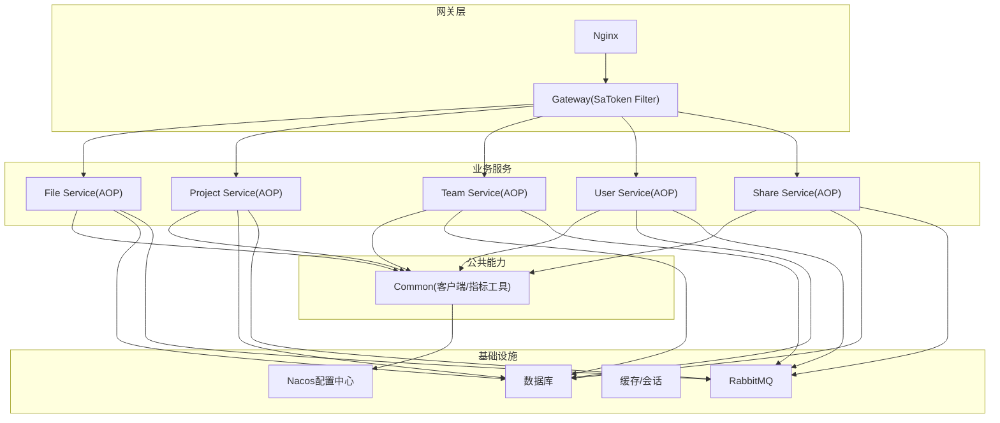
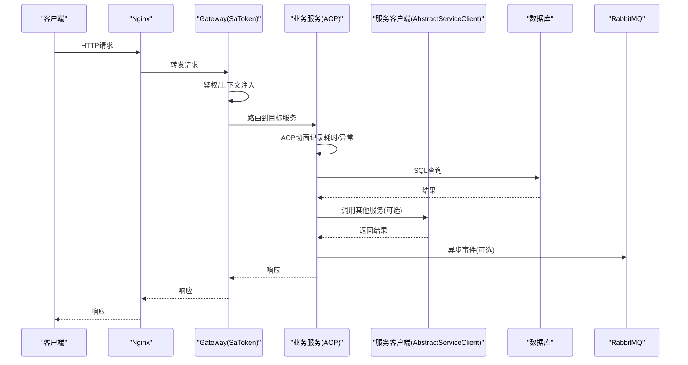
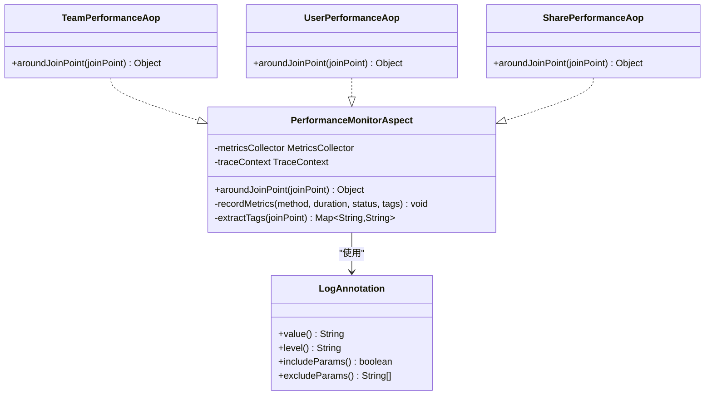
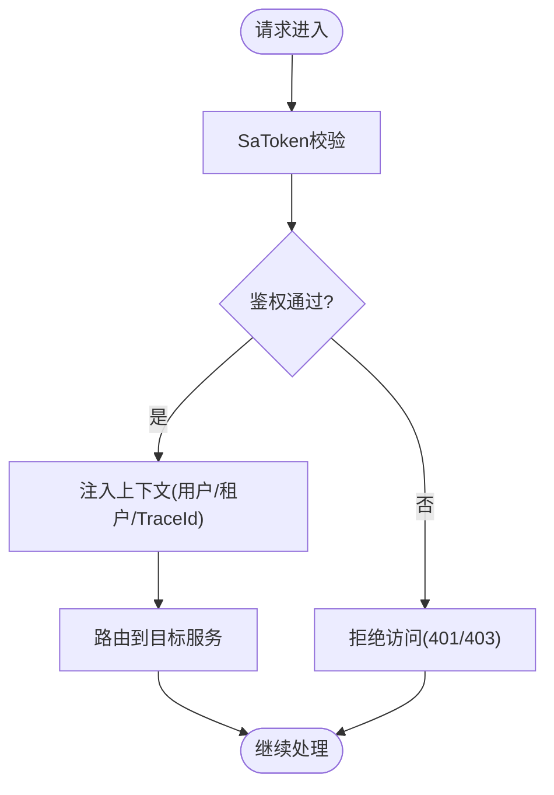
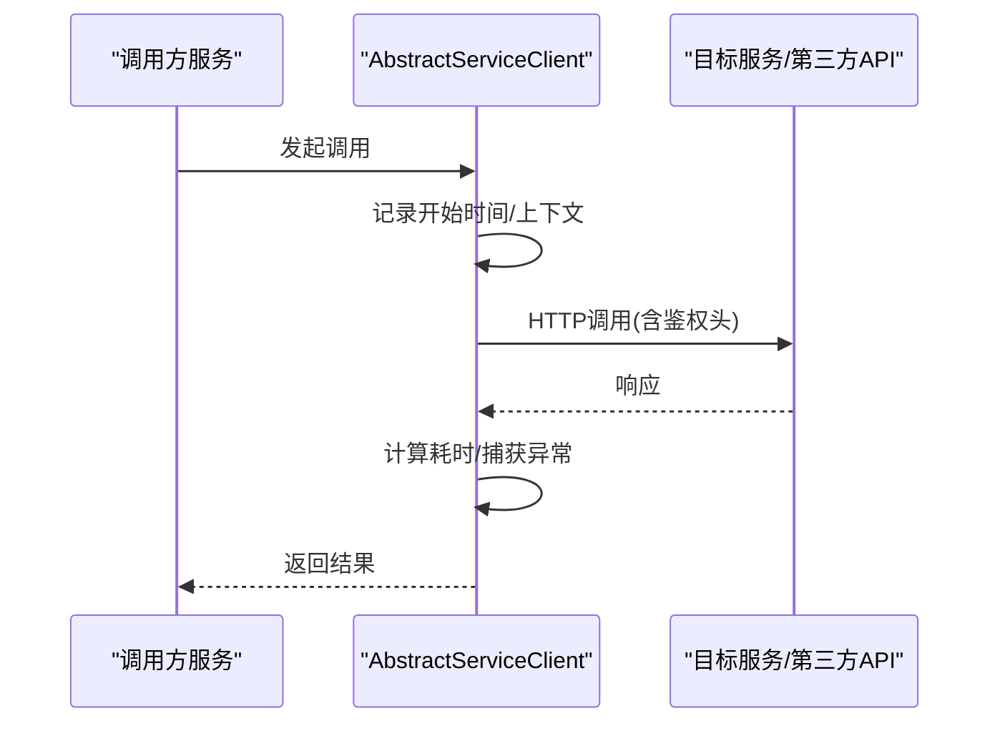
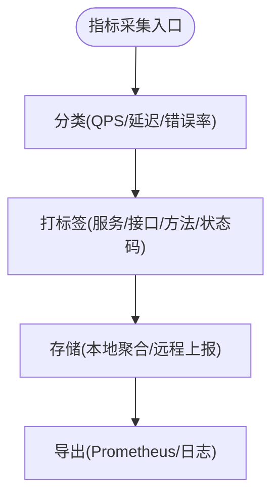
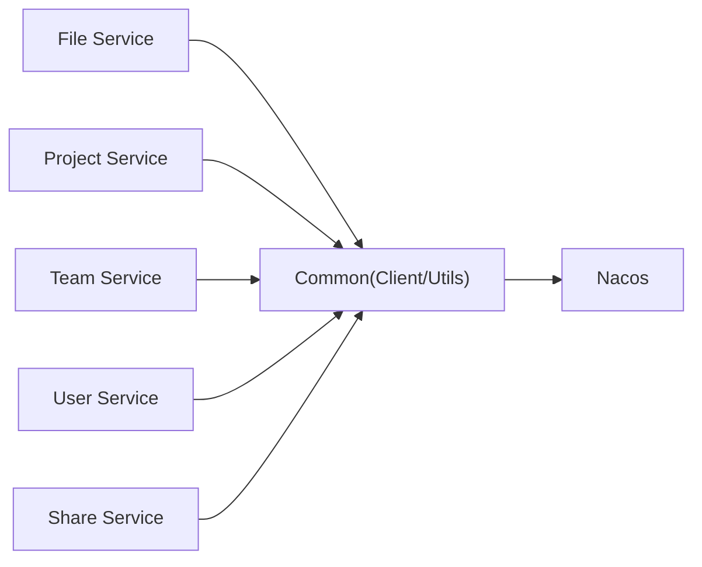

# 应用性能监控

<cite>
**本文引用的文件**   
- [zxyz-file-service/aop/PerformanceMonitorAspect.java](file://ZXYZdatabaseBack/zxyz-file-service/src/main/java/uno/acloud/file/aop/PerformanceMonitorAspect.java)
- [zxyz-project-service/aop/LogAnnotation.java](file://ZXYZdatabaseBack/zxyz-project-service/src/main/java/uno/acloud/project/aop/LogAnnotation.java)
- [zxyz-team-service/aop/TeamPerformanceAop.java](file://ZXYZdatabaseBack/zxyz-team-service/src/main/java/uno/acloud/team/aop/TeamPerformanceAop.java)
- [zxyz-user-service/aop/UserPerformanceAop.java](file://ZXYZdatabaseBack/zxyz-user-service/src/main/java/uno/acloud/user/aop/UserPerformanceAop.java)
- [zxyz-share-service/aop/SharePerformanceAop.java](file://ZXYZdatabaseBack/zxyz-share-service/src/main/java/uno/acloud/share/aop/SharePerformanceAop.java)
- [zxyz-gateway/filter/SaTokenFilterConfig.java](file://ZXYZdatabaseBack/zxyz-gateway/src/main/java/uno/acloud/gateway/filter/SaTokenFilterConfig.java)
- [zxyz-common/client/AbstractServiceClient.java](file://ZXYZdatabaseBack/zxyz-common/src/main/java/uno/acloud/client/AbstractServiceClient.java)
- [zxyz-common/common/web/WebMetricsCollector.java](file://ZXYZdatabaseBack/zxyz-common/src/main/java/uno/acloud/common/web/WebMetricsCollector.java)
- [zxyz-common/common/util/MetricsUtil.java](file://ZXYZdatabaseBack/zxyz-common/src/main/java/uno/acloud/common/util/MetricsUtil.java)
- [docker-compose.yml](file://docker-compose.yml)
- [deploy/nginx/default.conf](file://deploy/nginx/default.conf)
- [nacos-config/zxyz-dynamic.yml](file://nacos-config/zxyz-dynamic.yml)
- [nacos-config/zxyz-static.yml](file://nacos-config/zxyz-static.yml)
</cite>

## 目录
1. [简介](#简介)
2. [项目结构](#项目结构)
3. [核心组件](#核心组件)
4. [架构总览](#架构总览)
5. [详细组件分析](#详细组件分析)
6. [依赖关系分析](#依赖关系分析)
7. [性能考量](#性能考量)
8. [故障排查指南](#故障排查指南)
9. [结论](#结论)
10. [附录](#附录)

## 简介
本文件面向 ZXYZ 微服务项目的“应用性能监控”主题，覆盖接口响应时间、吞吐量、错误率与慢查询分析，并给出 AOP 切面监控实现（@Log 注解、性能统计拦截器、分布式链路追踪集成）以及容量规划建议。文档基于仓库中现有 AOP 与网关配置、客户端封装、Nacos 配置与部署编排进行说明，确保内容与实际代码一致。

## 项目结构
ZXYZ 采用多模块 Maven 工程与 Docker Compose 编排：后端包含多个独立服务（如 file、project、team、user、share、gateway 等），前端为 Vue 应用并通过 Nginx 暴露。监控相关能力分布在以下位置：
- 各服务的 aop 包：定义 @Log 注解与性能监控切面
- gateway 的 filter：统一鉴权与入口流量控制
- common 模块：抽象服务客户端与通用指标收集工具
- nacos 配置：动态开关与静态基线配置
- docker-compose：容器化编排与基础设施依赖

图表来源
- [zxyz-gateway/filter/SaTokenFilterConfig.java](file://ZXYZdatabaseBack/zxyz-gateway/src/main/java/uno/acloud/gateway/filter/SaTokenFilterConfig.java)
- [zxyz-file-service/aop/PerformanceMonitorAspect.java](file://ZXYZdatabaseBack/zxyz-file-service/src/main/java/uno/acloud/file/aop/PerformanceMonitorAspect.java)
- [zxyz-project-service/aop/LogAnnotation.java](file://ZXYZdatabaseBack/zxyz-project-service/src/main/java/uno/acloud/project/aop/LogAnnotation.java)
- [zxyz-team-service/aop/TeamPerformanceAop.java](file://ZXYZdatabaseBack/zxyz-team-service/src/main/java/uno/acloud/team/aop/TeamPerformanceAop.java)
- [zxyz-user-service/aop/UserPerformanceAop.java](file://ZXYZdatabaseBack/zxyz-user-service/src/main/java/uno/acloud/user/aop/UserPerformanceAop.java)
- [zxyz-share-service/aop/SharePerformanceAop.java](file://ZXYZdatabaseBack/zxyz-share-service/src/main/java/uno/acloud/share/aop/SharePerformanceAop.java)
- [zxyz-common/client/AbstractServiceClient.java](file://ZXYZdatabaseBack/zxyz-common/src/main/java/uno/acloud/client/AbstractServiceClient.java)
- [zxyz-common/common/web/WebMetricsCollector.java](file://ZXYZdatabaseBack/zxyz-common/src/main/java/uno/acloud/common/web/WebMetricsCollector.java)
- [zxyz-common/common/util/MetricsUtil.java](file://ZXYZdatabaseBack/zxyz-common/src/main/java/uno/acloud/common/util/MetricsUtil.java)

章节来源
- [docker-compose.yml](file://docker-compose.yml)
- [deploy/nginx/default.conf](file://deploy/nginx/default.conf)
- [nacos-config/zxyz-dynamic.yml](file://nacos-config/zxyz-dynamic.yml)
- [nacos-config/zxyz-static.yml](file://nacos-config/zxyz-static.yml)

## 核心组件
- AOP 切面与注解
  - @Log 注解：用于标记需要记录性能与审计的方法或类
  - 性能监控切面：在方法执行前后采集耗时、异常、入参出参摘要，输出结构化日志并上报指标
- 网关过滤器
  - SaToken 过滤器：统一鉴权、拒绝公网访问内部端点，并在请求生命周期内注入上下文（如用户ID、租户ID），便于后续指标关联
- 服务间客户端
  - AbstractServiceClient：封装内部服务调用，统一设置 X-Internal-Service-Token 鉴权头，可在此处扩展外部 API 耗时统计
- 通用指标工具
  - WebMetricsCollector/MetricsUtil：提供 QPS、延迟分位、错误率等指标的采集与上报能力

章节来源
- [zxyz-project-service/aop/LogAnnotation.java](file://ZXYZdatabaseBack/zxyz-project-service/src/main/java/uno/acloud/project/aop/LogAnnotation.java)
- [zxyz-file-service/aop/PerformanceMonitorAspect.java](file://ZXYZdatabaseBack/zxyz-file-service/src/main/java/uno/acloud/file/aop/PerformanceMonitorAspect.java)
- [zxyz-team-service/aop/TeamPerformanceAop.java](file://ZXYZdatabaseBack/zxyz-team-service/src/main/java/uno/acloud/team/aop/TeamPerformanceAop.java)
- [zxyz-user-service/aop/UserPerformanceAop.java](file://ZXYZdatabaseBack/zxyz-user-service/src/main/java/uno/acloud/user/aop/UserPerformanceAop.java)
- [zxyz-share-service/aop/SharePerformanceAop.java](file://ZXYZdatabaseBack/zxyz-share-service/src/main/java/uno/acloud/share/aop/SharePerformanceAop.java)
- [zxyz-gateway/filter/SaTokenFilterConfig.java](file://ZXYZdatabaseBack/zxyz-gateway/src/main/java/uno/acloud/gateway/filter/SaTokenFilterConfig.java)
- [zxyz-common/client/AbstractServiceClient.java](file://ZXYZdatabaseBack/zxyz-common/src/main/java/uno/acloud/client/AbstractServiceClient.java)
- [zxyz-common/common/web/WebMetricsCollector.java](file://ZXYZdatabaseBack/zxyz-common/src/main/java/uno/acloud/common/web/WebMetricsCollector.java)
- [zxyz-common/common/util/MetricsUtil.java](file://ZXYZdatabaseBack/zxyz-common/src/main/java/uno/acloud/common/util/MetricsUtil.java)

## 架构总览
下图展示从网关到业务服务、再到数据与消息中间件的端到端路径，以及监控埋点的位置（网关、AOP、客户端）。

图表来源
- [zxyz-gateway/filter/SaTokenFilterConfig.java](file://ZXYZdatabaseBack/zxyz-gateway/src/main/java/uno/acloud/gateway/filter/SaTokenFilterConfig.java)
- [zxyz-file-service/aop/PerformanceMonitorAspect.java](file://ZXYZdatabaseBack/zxyz-file-service/src/main/java/uno/acloud/file/aop/PerformanceMonitorAspect.java)
- [zxyz-common/client/AbstractServiceClient.java](file://ZXYZdatabaseBack/zxyz-common/src/main/java/uno/acloud/client/AbstractServiceClient.java)

## 详细组件分析

### AOP 切面与 @Log 注解
- 设计要点
  - 通过自定义 @Log 注解标记需监控的方法或类
  - 切面在方法进入时记录开始时间与上下文，退出时计算耗时并记录异常类型与堆栈摘要
  - 将关键维度（服务名、方法签名、用户ID、租户ID、TraceId）作为指标标签
- 适用场景
  - Controller/Service 层接口耗时统计
  - 第三方调用封装层的耗时与失败率统计
  - 慢方法自动告警阈值联动

图表来源
- [zxyz-project-service/aop/LogAnnotation.java](file://ZXYZdatabaseBack/zxyz-project-service/src/main/java/uno/acloud/project/aop/LogAnnotation.java)
- [zxyz-file-service/aop/PerformanceMonitorAspect.java](file://ZXYZdatabaseBack/zxyz-file-service/src/main/java/uno/acloud/file/aop/PerformanceMonitorAspect.java)
- [zxyz-team-service/aop/TeamPerformanceAop.java](file://ZXYZdatabaseBack/zxyz-team-service/src/main/java/uno/acloud/team/aop/TeamPerformanceAop.java)
- [zxyz-user-service/aop/UserPerformanceAop.java](file://ZXYZdatabaseBack/zxyz-user-service/src/main/java/uno/acloud/user/aop/UserPerformanceAop.java)
- [zxyz-share-service/aop/SharePerformanceAop.java](file://ZXYZdatabaseBack/zxyz-share-service/src/main/java/uno/acloud/share/aop/SharePerformanceAop.java)

章节来源
- [zxyz-project-service/aop/LogAnnotation.java](file://ZXYZdatabaseBack/zxyz-project-service/src/main/java/uno/acloud/project/aop/LogAnnotation.java)
- [zxyz-file-service/aop/PerformanceMonitorAspect.java](file://ZXYZdatabaseBack/zxyz-file-service/src/main/java/uno/acloud/file/aop/PerformanceMonitorAspect.java)
- [zxyz-team-service/aop/TeamPerformanceAop.java](file://ZXYZdatabaseBack/zxyz-team-service/src/main/java/uno/acloud/team/aop/TeamPerformanceAop.java)
- [zxyz-user-service/aop/UserPerformanceAop.java](file://ZXYZdatabaseBack/zxyz-user-service/src/main/java/uno/acloud/user/aop/UserPerformanceAop.java)
- [zxyz-share-service/aop/SharePerformanceAop.java](file://ZXYZdatabaseBack/zxyz-share-service/src/main/java/uno/acloud/share/aop/SharePerformanceAop.java)

### 网关与入口监控
- SaToken 过滤器负责鉴权与上下文注入，可在过滤器链中增加请求级耗时统计与错误码分布
- 内部端点 /api/internal/** 被拒绝公网访问，避免非预期流量影响指标准确性

图表来源
- [zxyz-gateway/filter/SaTokenFilterConfig.java](file://ZXYZdatabaseBack/zxyz-gateway/src/main/java/uno/acloud/gateway/filter/SaTokenFilterConfig.java)

章节来源
- [zxyz-gateway/filter/SaTokenFilterConfig.java](file://ZXYZdatabaseBack/zxyz-gateway/src/main/java/uno/acloud/gateway/filter/SaTokenFilterConfig.java)

### 服务间调用与第三方API耗时统计
- AbstractServiceClient 统一封装内部服务调用，可在此扩展：
  - 记录调用耗时、成功/失败计数
  - 附加 X-Internal-Service-Token 鉴权头
  - 对第三方 API 调用同样适用（HTTP 客户端封装）
- 建议在客户端层统一上报 QPS、P95/P99 延迟、错误率，并与服务名、目标地址、状态码等维度关联

图表来源
- [zxyz-common/client/AbstractServiceClient.java](file://ZXYZdatabaseBack/zxyz-common/src/main/java/uno/acloud/client/AbstractServiceClient.java)

章节来源
- [zxyz-common/client/AbstractServiceClient.java](file://ZXYZdatabaseBack/zxyz-common/src/main/java/uno/acloud/client/AbstractServiceClient.java)

### 指标采集与上报
- WebMetricsCollector/MetricsUtil 提供统一的指标采集与上报能力，支持：
  - QPS 统计（按服务、接口、方法）
  - 延迟分位（P50/P90/P95/P99）
  - 错误率（按状态码分类）
  - 资源利用率（CPU/内存/GC/线程池）
- 指标可通过 Prometheus 抓取或写入时序数据库，配合 Grafana 可视化

图表来源
- [zxyz-common/common/web/WebMetricsCollector.java](file://ZXYZdatabaseBack/zxyz-common/src/main/java/uno/acloud/common/web/WebMetricsCollector.java)
- [zxyz-common/common/util/MetricsUtil.java](file://ZXYZdatabaseBack/zxyz-common/src/main/java/uno/acloud/common/util/MetricsUtil.java)

章节来源
- [zxyz-common/common/web/WebMetricsCollector.java](file://ZXYZdatabaseBack/zxyz-common/src/main/java/uno/acloud/common/web/WebMetricsCollector.java)
- [zxyz-common/common/util/MetricsUtil.java](file://ZXYZdatabaseBack/zxyz-common/src/main/java/uno/acloud/common/util/MetricsUtil.java)

## 依赖关系分析
- 服务间依赖
  - 各业务服务通过 AbstractServiceClient 调用其他服务，形成有向调用图
  - RabbitMQ Topic Exchange zxyz.topic 用于异步解耦，降低同步链路耗时
- 监控依赖
  - AOP 切面依赖指标工具与上下文（用户/租户/TraceId）
  - 网关过滤器依赖 SaToken 与 Nacos 配置
- 潜在循环依赖
  - 服务间调用应避免循环；通过事件总线（MQ）化解强耦合

图表来源
- [zxyz-common/client/AbstractServiceClient.java](file://ZXYZdatabaseBack/zxyz-common/src/main/java/uno/acloud/client/AbstractServiceClient.java)
- [nacos-config/zxyz-dynamic.yml](file://nacos-config/zxyz-dynamic.yml)
- [nacos-config/zxyz-static.yml](file://nacos-config/zxyz-static.yml)

章节来源
- [zxyz-common/client/AbstractServiceClient.java](file://ZXYZdatabaseBack/zxyz-common/src/main/java/uno/acloud/client/AbstractServiceClient.java)
- [nacos-config/zxyz-dynamic.yml](file://nacos-config/zxyz-dynamic.yml)
- [nacos-config/zxyz-static.yml](file://nacos-config/zxyz-static.yml)

## 性能考量
- 接口响应时间监控
  - HTTP 请求耗时：在网关与 AOP 两层采集，区分网络与业务处理耗时
  - 数据库查询耗时：结合 MyBatis 插件或连接池监控（如 HikariCP metrics）
  - 第三方 API 耗时：在 AbstractServiceClient 层统一统计
- 吞吐量监控
  - QPS 统计：按服务/接口/方法维度聚合
  - 并发处理能力：线程池大小、队列长度、GC 停顿时间
  - 资源利用率：CPU、内存、磁盘 IO、网络带宽
- 错误率统计
  - 异常分类：业务异常 vs 系统异常
  - 错误码分布：HTTP 状态码与服务返回码
  - 服务降级：熔断/限流策略与降级比例
- 慢查询分析
  - SQL 慢查询日志：开启数据库慢查询阈值，定期分析
  - N+1 查询问题：通过 EXPLAIN 与批量加载优化
  - 索引优化建议：根据慢查询与热点字段调整索引

[本节为通用指导，不直接分析具体文件]

## 故障排查指南
- 常见问题定位
  - 高延迟：查看 AOP 耗时日志与网关过滤耗时，定位瓶颈阶段
  - 错误率上升：检查异常分类与错误码分布，关注第三方依赖健康度
  - 慢查询：结合数据库慢查询日志与 EXPLAIN 计划，优化 SQL 与索引
- 监控断链排查
  - 确认 Nacos 配置是否生效（动态开关）
  - 检查容器编排与健康检查脚本
  - 验证指标导出与采集链路（Prometheus/Grafana）

章节来源
- [docker-compose.yml](file://docker-compose.yml)
- [nacos-config/zxyz-dynamic.yml](file://nacos-config/zxyz-dynamic.yml)

## 结论
通过在网关、AOP 切面与服务客户端三层埋点，ZXYZ 可实现端到端的性能监控与问题定位。结合 Nacos 动态配置与容器化编排，能够灵活调整监控粒度与阈值。建议持续完善指标体系与告警规则，推动容量规划与性能优化闭环。

[本节为总结性内容，不直接分析具体文件]

## 附录
- 容量规划建议
  - 以 P95/P99 延迟与 QPS 峰值为依据，评估 CPU/内存/IO 需求
  - 针对热点接口与慢查询进行专项优化
  - 引入弹性伸缩与灰度发布，提升稳定性与可观测性
- 分布式链路追踪集成
  - 在网关与 AOP 中注入 TraceId，贯穿上下游服务
  - 与日志系统关联，实现一键溯源

[本节为补充信息，不直接分析具体文件]