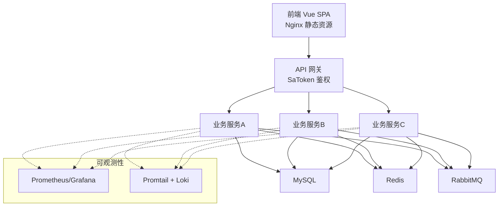
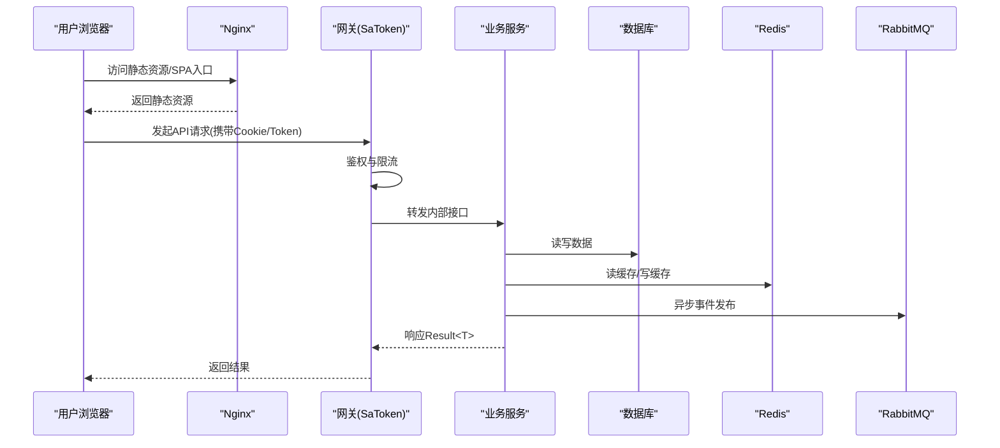
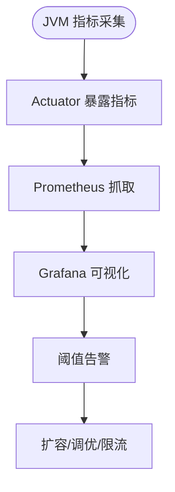
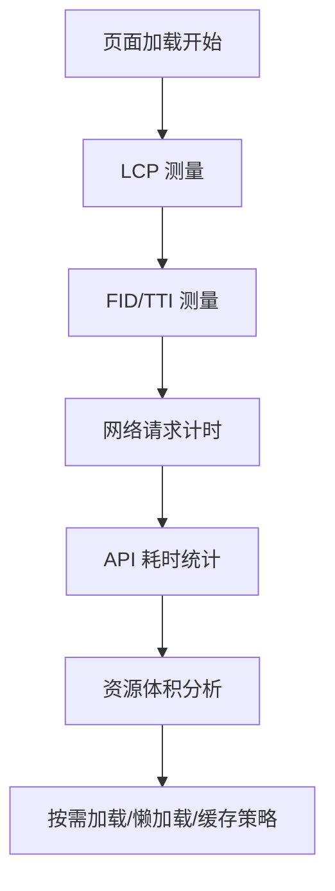
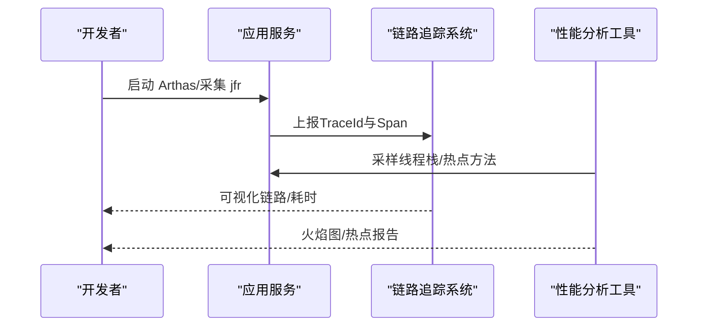
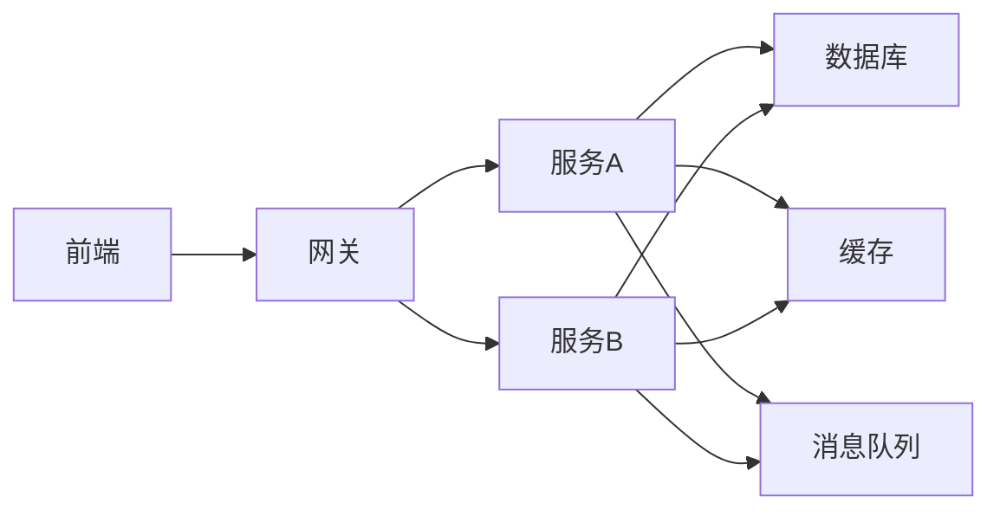

# 性能监控

<cite>
**本文引用的文件**   
- [zxyz-dynamic.yml](file://nacos-config/zxyz-dynamic.yml)
- [zxyz-static.yml](file://nacos-config/zxyz-static.yml)
- [docker-compose.yml](file://docker-compose.yml)
- [application.yml](file://ZXYZdatabaseBack/zxyz-common/src/main/resources/application-common.yml)
- [application-dev.yml](file://ZXYZdatabaseBack/zxyz-admin-service/src/main/resources/application-dev.yml)
- [application-prod.yml](file://ZXYZdatabaseBack/zxyz-admin-service/src/main/resources/application-prod.yml)
- [application.yml](file://ZXYZdatabaseBack/zxyz-gateway/src/main/resources/application.yml)
- [application.yml](file://ZXYZdatabaseBack/zxyz-file-service/src/main/resources/application.yml)
- [application.yml](file://ZXYZdatabaseBack/zxyz-im-service/src/main/resources/application.yml)
- [application.yml](file://ZXYZdatabaseBack/zxyz-project-service/src/main/resources/application.yml)
- [application.yml](file://ZXYZdatabaseBack/zxyz-share-service/src/main/resources/application.yml)
- [application.yml](file://ZXYZdatabaseBack/zxyz-team-service/src/main/resources/application.yml)
- [application.yml](file://ZXYZdatabaseBack/zxyz-user-service/src/main/resources/application.yml)
- [application.yml](file://ZXYZdatabaseBack/zxyz-email-service/src/main/resources/application.yml)
- [application.yml](file://ZXYZdatabaseBack/zxyz-audit-service/src/main/resources/application.yml)
- [package.json](file://ZXYZdatabaseFront/package.json)
- [vite.config.js](file://ZXYZdatabaseFront/vite.config.js)
- [index.html](file://ZXYZdatabaseFront/index.html)
- [default.conf](file://deploy/nginx/default.conf)
- [promtail-config.yml](file://deploy/promtail-config.yml)
- [health-check.sh](file://scripts/health-check.sh)
- [CLAUDE.md](file://CLAUDE.md)
</cite>

## 目录
1. [简介](#简介)
2. [项目结构](#项目结构)
3. [核心组件](#核心组件)
4. [架构总览](#架构总览)
5. [详细组件分析](#详细组件分析)
6. [依赖关系分析](#依赖关系分析)
7. [性能考量](#性能考量)
8. [故障排查指南](#故障排查指南)
9. [结论](#结论)
10. [附录](#附录)

## 简介
本文件面向 ZXYZ 项目的性能监控与优化，覆盖 JVM 运行时、应用接口、基础设施（数据库、缓存、消息队列、磁盘）、前端体验以及性能分析工具链。目标是帮助研发与运维团队建立可观测性基线、定位瓶颈并制定容量规划策略。

## 项目结构
ZXYZ 采用微服务架构：后端由多个 Spring Boot 服务组成，统一经网关暴露；前端为 Vue 3 SPA，通过 Nginx 静态托管并由网关路由到后端。配置中心使用 Nacos，部署编排使用 Docker Compose，日志采集使用 Promtail。

[本图为概念性架构图，不直接映射具体源码文件]

## 核心组件
- 运行时指标采集：各服务通过 Spring Boot Actuator 暴露健康检查与基础指标，结合 Prometheus 抓取与 Grafana 可视化。
- 链路追踪：在网关与各服务间注入链路上下文，配合分布式追踪系统实现端到端耗时与错误归因。
- 日志采集：Promtail 收集容器标准输出与日志文件，汇聚至 Loki，便于关联查询。
- 前端性能：基于浏览器 Performance API 与构建产物统计，评估页面加载、网络请求与资源体积。

**章节来源**
- [application.yml](file://ZXYZdatabaseBack/zxyz-common/src/main/resources/application-common.yml)
- [docker-compose.yml](file://docker-compose.yml)
- [promtail-config.yml](file://deploy/promtail-config.yml)

## 架构总览
下图展示从前端到后端服务的请求路径、关键拦截点与可观测性埋点位置。

**图表来源**
- [application.yml](file://ZXYZdatabaseBack/zxyz-gateway/src/main/resources/application.yml)
- [application.yml](file://ZXYZdatabaseBack/zxyz-file-service/src/main/resources/application.yml)
- [application.yml](file://ZXYZdatabaseBack/zxyz-im-service/src/main/resources/application.yml)
- [application.yml](file://ZXYZdatabaseBack/zxyz-project-service/src/main/resources/application.yml)
- [application.yml](file://ZXYZdatabaseBack/zxyz-share-service/src/main/resources/application.yml)
- [application.yml](file://ZXYZdatabaseBack/zxyz-team-service/src/main/resources/application.yml)
- [application.yml](file://ZXYZdatabaseBack/zxyz-user-service/src/main/resources/application.yml)
- [application.yml](file://ZXYZdatabaseBack/zxyz-email-service/src/main/resources/application.yml)
- [application.yml](file://ZXYZdatabaseBack/zxyz-audit-service/src/main/resources/application.yml)

## 详细组件分析

### JVM 内存与 GC 监控
- 目标指标：堆/非堆内存、GC 次数与耗时、线程池活跃/队列长度、类加载数、CPU 占用。
- 采集方式：Actuator /actuator/metrics 暴露 JVM 指标；Prometheus 定时抓取；Grafana 面板展示。
- 告警建议：堆使用率持续 >80%、Full GC 频繁、线程池饱和、CPU 长期 >80%。

**章节来源**
- [application.yml](file://ZXYZdatabaseBack/zxyz-common/src/main/resources/application-common.yml)
- [docker-compose.yml](file://docker-compose.yml)

### CPU 利用率与线程池状态
- 关注点：系统 CPU、进程 CPU、用户态/内核态占比；线程池核心/最大线程数、队列深度、拒绝计数。
- 采集方式：操作系统指标 + JVM 线程池指标；必要时结合 Arthas 采样线程栈。
- 优化方向：合理设置线程池大小、避免阻塞调用、异步化 IO、减少锁竞争。

**章节来源**
- [docker-compose.yml](file://docker-compose.yml)

### 接口响应时间与吞吐量监控
- 目标指标：P50/P95/P99 延迟、QPS、错误率、慢请求比例。
- 采集方式：网关层记录请求耗时与状态码；服务内 AOP 埋点；Prometheus 汇总。
- 分析手段：按接口维度聚合，识别热点与退化趋势。

**章节来源**
- [application.yml](file://ZXYZdatabaseBack/zxyz-gateway/src/main/resources/application.yml)

### 错误率统计与慢查询分析
- 错误率：HTTP 5xx、业务异常码、下游超时/拒绝。
- 慢查询：SQL 执行时间、索引缺失、锁等待；结合数据库慢查询日志与 APM 链路。
- 处理流程：发现慢接口 → 链路定位 → SQL/缓存/并发优化 → 回归验证。

**章节来源**
- [application.yml](file://ZXYZdatabaseBack/zxyz-file-service/src/main/resources/application.yml)
- [application.yml](file://ZXYZdatabaseBack/zxyz-im-service/src/main/resources/application.yml)

### 数据库连接池监控
- 指标：活跃连接数、等待队列、获取连接耗时、连接泄漏检测。
- 建议：根据并发与 RT 估算连接数上限；开启连接泄漏检测；分库分表或读写分离应对增长。

**章节来源**
- [application.yml](file://ZXYZdatabaseBack/zxyz-project-service/src/main/resources/application.yml)

### Redis 命中率与缓存一致性
- 指标：命中率、命令延迟、内存使用、淘汰策略触发。
- 建议：热点 Key 保护、批量操作、合理过期策略、跨服务一致性方案（如失效广播）。

**章节来源**
- [application.yml](file://ZXYZdatabaseBack/zxyz-user-service/src/main/resources/application.yml)

### RabbitMQ 积压与消费能力
- 指标：队列长度、入队/出队速率、消费者数量、重试与死信队列。
- 建议：水平扩展消费者、幂等处理、背压与限流、DLQ 监控与人工干预流程。

**章节来源**
- [application.yml](file://ZXYZdatabaseBack/zxyz-audit-service/src/main/resources/application.yml)

### 磁盘 IO 与存储使用
- 指标：磁盘 IOPS、吞吐、延迟、inode 使用率、日志文件大小。
- 建议：日志轮转、冷热数据分层、对象存储替代本地大文件。

**章节来源**
- [docker-compose.yml](file://docker-compose.yml)

### 前端性能：页面加载、API 耗时、资源体积与浏览器指标
- 页面加载：首屏时间、可交互时间、资源瀑布图。
- API 耗时：前端计时器 + 后端链路耗时对比，定位网络与服务端差异。
- 资源体积：JS/CSS/图片拆分与压缩，CDN 加速。
- 浏览器指标：LCP、FID、CLS 等 Web Vitals。

**章节来源**
- [package.json](file://ZXYZdatabaseFront/package.json)
- [vite.config.js](file://ZXYZdatabaseFront/vite.config.js)
- [index.html](file://ZXYZdatabaseFront/index.html)

### 性能分析工具：Arthas、火焰图、分布式链路追踪
- Arthas：在线诊断线程、方法耗时、CPU 热点、内存快照。
- 火焰图：jstack/jfr + FlameGraph 生成，定位热点调用链。
- 链路追踪：网关注入 TraceId，服务透传，集中展示全链路耗时与错误。

[本图为概念性流程图，不直接映射具体源码文件]

## 依赖关系分析
- 服务间调用：窄端点 + 投影 VO，避免胖 DTO 传播，降低序列化开销。
- 认证与鉴权：Gateway SaToken 统一校验，内部端点前缀 /api/internal/** 仅内网可达。
- 配置管理：Nacos 动态配置，区分 dev/prod 环境，敏感信息 Jasypt 加密。

**章节来源**
- [CLAUDE.md](file://CLAUDE.md)
- [application.yml](file://ZXYZdatabaseBack/zxyz-gateway/src/main/resources/application.yml)
- [zxyz-dynamic.yml](file://nacos-config/zxyz-dynamic.yml)
- [zxyz-static.yml](file://nacos-config/zxyz-static.yml)

## 性能考量
- 容量规划
  - 计算模型：QPS = 峰值并发 × 平均请求大小 / 平均响应时间；连接数 ≈ 并发 × 平均等待时间。
  - 资源预留：CPU 峰值留 20%-30% 余量，内存预留 GC 空间，磁盘预留日志与增量空间。
  - 弹性伸缩：基于 CPU/队列长度/延迟阈值自动扩缩容。
- 稳定性设计
  - 限流与熔断：网关与服务层限流，下游失败快速失败与降级。
  - 幂等与重试：消息与写操作幂等，重试退避与上限控制。
  - 灰度与回滚：小流量灰度，一键回滚与热修复。
- 成本优化
  - 缓存命中优先，减少冷读；批量与合并请求；对象存储与 CDN 分流。

[本节为通用指导，不直接分析具体文件]

## 故障排查指南
- 常见问题定位
  - 高延迟：查看链路耗时分布、数据库慢查询、缓存穿透/击穿、线程池饱和。
  - 高错误率：检查下游依赖健康、超时与重试风暴、参数校验与权限问题。
  - 资源耗尽：内存泄漏、连接池耗尽、磁盘满、句柄数限制。
- 排查步骤
  - 确认影响范围与时间窗口，拉取相关日志与指标。
  - 使用 Arthas 定位热点方法与线程阻塞。
  - 生成火焰图定位 CPU/IO 热点。
  - 复现实验与回归验证。

**章节来源**
- [health-check.sh](file://scripts/health-check.sh)

## 结论
通过统一的指标采集、链路追踪与日志聚合，结合前端性能度量与容量规划方法，ZXYZ 可在高并发与复杂依赖场景下保持稳定的性能表现。建议持续完善监控面板与告警规则，形成“监测—定位—优化—验证”的闭环。

## 附录
- 常用命令与脚本
  - 健康检查：health-check.sh
  - 容器编排：docker-compose.yml
  - 日志采集：promtail-config.yml
- 参考文档
  - 架构说明与规范：CLAUDE.md

**章节来源**
- [health-check.sh](file://scripts/health-check.sh)
- [docker-compose.yml](file://docker-compose.yml)
- [promtail-config.yml](file://deploy/promtail-config.yml)
- [CLAUDE.md](file://CLAUDE.md)